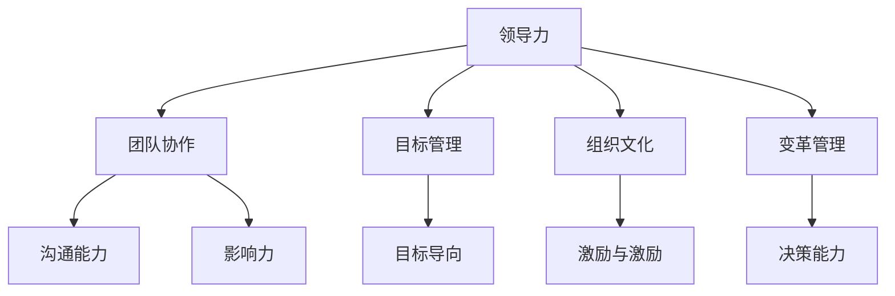

                 

### 引言

在现代企业的竞争环境中，领导力已成为企业成功的关键因素之一。一个优秀的领导者不仅需要具备卓越的专业知识和技能，更需要具备卓越的领导能力，才能带领团队克服挑战，实现企业的战略目标。然而，如何提升领导力，使其在团队中发挥最大效能，却是许多领导者面临的难题。

本文将围绕“领导力训练：让你的团队所向披靡”这一主题，深入探讨领导力的核心概念、提升领导力的方法与策略，并通过实际案例分析，展示领导力在实际工作中的应用。本文的结构如下：

- **1. 背景介绍**：介绍领导力的重要性及其在企业中的作用。
- **2. 核心概念与联系**：阐述领导力的核心概念，并通过Mermaid流程图展示其与团队协作、目标管理等的联系。
- **3. 核心算法原理 & 具体操作步骤**：介绍提升领导力的核心算法原理和具体操作步骤。
- **4. 数学模型和公式 & 详细讲解 & 举例说明**：运用数学模型和公式，详细讲解提升领导力的策略，并通过实际案例进行说明。
- **5. 项目实战：代码实际案例和详细解释说明**：通过具体项目的代码实现和解读，展示提升领导力的实际操作过程。
- **6. 实际应用场景**：分析领导力在各类实际工作场景中的应用。
- **7. 工具和资源推荐**：推荐学习资源和开发工具，以帮助读者进一步提升领导力。
- **8. 总结：未来发展趋势与挑战**：总结领导力提升的趋势和面临的挑战。
- **9. 附录：常见问题与解答**：解答读者可能遇到的问题。
- **10. 扩展阅读 & 参考资料**：提供扩展阅读和参考资料。

通过本文的阅读，读者将了解领导力的核心概念，掌握提升领导力的方法与策略，并能够将这些知识应用于实际工作中，从而提升团队的整体效能，实现企业的发展目标。### 1. 背景介绍

领导力，是指一种能够激发和引导他人朝着共同目标努力的能力。在组织管理中，领导力被视为一种关键的管理技能，它不仅关乎个人的职业生涯发展，更直接影响着整个团队、部门乃至整个企业的绩效和成功。随着全球化进程的加速和企业竞争的加剧，领导力在企业中的作用越来越突出。

首先，领导力是推动企业创新和变革的重要动力。在快速变化的市场环境中，企业需要具备强大的适应能力和创新能力，而领导力正是这种能力的核心。优秀的领导者能够敏锐地洞察市场趋势，把握机遇，引领团队进行创新和变革，从而保持企业的竞争力。

其次，领导力是提升团队效能的关键因素。一个高效的团队不仅需要成员具备专业能力和技术技能，更需要领导者具备良好的沟通、协调和激励能力。领导者通过有效的领导和激励，能够激发团队成员的潜力，提高团队的整体效能，实现团队目标。

此外，领导力也是企业文化建设的重要组成部分。企业文化是企业价值观和行为准则的体现，它影响着员工的思维方式和行为习惯。一个优秀的领导者能够通过自身的言行，塑造积极向上的企业文化，提高员工的凝聚力和归属感。

在当今企业中，领导力的重要性不言而喻。然而，如何提升领导力，使其在团队中发挥最大效能，却是许多领导者面临的挑战。本文旨在通过深入探讨领导力的核心概念、提升领导力的方法与策略，并结合实际案例进行分析，为读者提供一套系统、实用的领导力提升方案。

### 2. 核心概念与联系

领导力是一个多层次、多维度的概念，涉及个人品质、管理技能、团队协作等多个方面。为了更好地理解领导力，我们首先需要明确其核心概念，并探讨领导力与其他关键概念的关联。

#### 2.1 领导力的核心概念

领导力可以理解为一种影响和激励他人追求共同目标的能力。以下是领导力的几个核心概念：

- **影响力**：领导者通过言行和行动，对团队成员产生积极影响，引导他们朝着共同目标努力。
- **目标导向**：领导者具有清晰的目标，能够将这些目标转化为团队成员的共同愿景，激励大家为实现这些目标而努力。
- **沟通能力**：领导者需要具备出色的沟通技巧，能够有效地传达信息、倾听反馈，建立良好的团队沟通氛围。
- **激励与激励**：领导者需要能够识别和满足团队成员的需求，激发他们的工作热情和积极性。
- **决策能力**：领导者需要在复杂多变的环境中做出明智的决策，引导团队走向正确的方向。

#### 2.2 领导力与其他关键概念的关联

领导力不仅是一个独立的个体能力，还与团队协作、目标管理等多个概念密切相关。

- **团队协作**：领导力是团队协作的基础。领导者通过有效的领导和激励，促进团队成员之间的协作，共同实现团队目标。
- **目标管理**：领导力与目标管理紧密相连。领导者需要明确团队的目标，并确保这些目标与企业的战略目标一致，从而引导团队成员朝着共同的目标努力。
- **组织文化**：领导力是组织文化的重要组成部分。领导者通过自身的言行，塑造和维护组织的价值观和行为准则，影响员工的思维方式和行为习惯。
- **变革管理**：领导力在变革管理中发挥着关键作用。领导者需要具备推动变革的能力，引导团队适应新的环境和挑战。

#### 2.3 Mermaid流程图展示

为了更好地理解领导力与其他关键概念的关联，我们可以通过Mermaid流程图进行展示。以下是领导力核心概念与团队协作、目标管理、组织文化和变革管理的关联流程图：



在这个流程图中，领导力（A）作为核心，与团队协作（B）、目标管理（C）、组织文化（D）和变革管理（E）等关键概念相互关联。每个关键概念又包含多个子概念，如团队协作中的沟通能力（F）和影响力（G），目标管理中的目标导向（H），组织文化中的激励与激励（I），以及变革管理中的决策能力（J）。

通过这个流程图，我们可以更清晰地理解领导力与其他关键概念之间的关联，从而为提升领导力提供更加系统的指导。接下来，我们将进一步探讨提升领导力的核心算法原理和具体操作步骤。### 3. 核心算法原理 & 具体操作步骤

提升领导力的核心在于理解并运用一系列科学有效的管理方法，这些方法可以归纳为以下几个步骤：

#### 3.1 明确领导角色和职责

首先，领导者需要明确自己的角色和职责。这包括：

- **确立愿景和目标**：领导者需要设定清晰的企业愿景和目标，并确保这些目标与团队成员的个人目标相一致。
- **制定战略规划**：领导者应根据企业的愿景和目标，制定具体的战略规划，明确实现目标的路径和步骤。

**具体操作步骤**：

1. **进行自我评估**：领导者应评估自己的领导风格、优势和不足，以便更好地了解自己的角色和职责。
2. **制定个人发展计划**：根据自我评估的结果，领导者应制定个人发展计划，明确自己的成长方向和目标。

#### 3.2 提升沟通能力

沟通能力是领导者必须具备的重要技能。有效的沟通能够确保信息准确传达，减少误解和冲突。

- **积极倾听**：领导者应学会倾听团队成员的意见和需求，理解他们的立场和感受。
- **清晰表达**：领导者应确保自己的表达清晰、简洁，避免使用模糊或含糊的语言。

**具体操作步骤**：

1. **参加沟通技巧培训**：领导者可以通过参加专业培训，学习有效的沟通技巧。
2. **定期开展团队会议**：领导者应定期召开团队会议，鼓励团队成员发表意见，营造良好的沟通氛围。

#### 3.3 建立信任和合作关系

信任是团队协作的基础。领导者需要通过行动建立信任，并与团队成员建立良好的合作关系。

- **以身作则**：领导者应以身作则，树立良好的榜样，赢得团队成员的信任。
- **鼓励团队协作**：领导者应鼓励团队成员之间的协作，共同解决问题。

**具体操作步骤**：

1. **开展团队建设活动**：领导者可以组织团队建设活动，增进团队成员之间的了解和信任。
2. **设立共同目标**：领导者应设立团队共同目标，激发团队成员的积极性。

#### 3.4 激励与激励

领导者需要能够识别和满足团队成员的需求，激发他们的工作热情和积极性。

- **个性化激励**：领导者应根据团队成员的不同需求和特点，采用个性化的激励方式。
- **及时反馈**：领导者应给予团队成员及时的反馈，认可他们的努力和成就。

**具体操作步骤**：

1. **开展绩效评估**：领导者应定期开展绩效评估，为团队成员提供反馈和发展建议。
2. **设立奖励机制**：领导者可以设立奖励机制，激励团队成员为实现共同目标而努力。

#### 3.5 决策能力

领导者需要具备在复杂多变的环境中做出明智决策的能力。

- **收集信息**：领导者应广泛收集信息，了解各种可能的决策方案及其可能带来的影响。
- **权衡利弊**：领导者应根据收集到的信息，权衡各种决策方案的利弊，选择最优方案。

**具体操作步骤**：

1. **建立决策团队**：领导者可以建立一个由不同领域专家组成的决策团队，共同讨论和制定决策方案。
2. **进行风险评估**：领导者应进行风险评估，评估决策方案可能带来的风险，并制定相应的应对措施。

通过以上几个步骤，领导者可以逐步提升自己的领导力，带领团队实现共同的目标。接下来，我们将运用数学模型和公式，进一步探讨提升领导力的策略。### 4. 数学模型和公式 & 详细讲解 & 举例说明

在提升领导力的过程中，运用数学模型和公式可以帮助我们更科学、系统地分析和解决问题。以下是一些常用的数学模型和公式，用于详细讲解提升领导力的策略。

#### 4.1 领导力评估模型

领导力评估模型是一个用于评估领导者能力的方法，包括以下几个关键指标：

- **影响力（I）**：表示领导者在团队中产生的影响程度，可以采用问卷调查或团队反馈的方式收集数据。
- **沟通能力（C）**：表示领导者的沟通效果，可以通过沟通技巧测试和团队协作评估来衡量。
- **决策能力（D）**：表示领导者在复杂情境中做出决策的能力，可以通过模拟决策场景或实际决策记录来评估。
- **激励与激励（E）**：表示领导者激发团队成员积极性的能力，可以通过员工满意度调查和绩效评估来评估。

领导力评估模型可以用以下公式表示：

\[ L = I \times C \times D \times E \]

其中，L表示领导力得分。通过这个公式，领导者可以根据各个指标的数据，评估自己的领导力水平，并找出需要提升的方面。

**示例**：假设某领导者在影响力（I）得分为80分，沟通能力（C）得分为75分，决策能力（D）得分为70分，激励与激励（E）得分为65分，则其领导力得分为：

\[ L = 80 \times 75 \times 70 \times 65 = 267,500 \]

#### 4.2 目标管理模型

目标管理模型是领导力提升的一个重要策略，它通过设定明确的目标和制定实现目标的计划，提高团队的工作效率和成果。目标管理模型包括以下几个步骤：

1. **目标设定（S）**：设定具体、明确的目标，确保团队成员对目标有清晰的认识。
2. **目标分解（D）**：将总目标分解为若干个子目标，为每个子目标制定具体的行动计划。
3. **资源分配（R）**：根据目标需求，分配所需的资源，包括人力、物力和财力。
4. **执行监控（M）**：监控目标执行过程，及时调整计划，确保目标的实现。

目标管理模型可以用以下公式表示：

\[ 目标管理模型 = S \times D \times R \times M \]

其中，S表示目标设定，D表示目标分解，R表示资源分配，M表示执行监控。通过这个公式，领导者可以系统地管理目标，提高团队的工作效率。

**示例**：假设某团队要实现一个年度销售额目标，具体步骤如下：

- **目标设定（S）**：设定年度销售额为100万元。
- **目标分解（D）**：将年度销售额分解为季度销售额目标，每季度分别为25万元。
- **资源分配（R）**：为每个季度目标分配相应的人力、物力和财力资源。
- **执行监控（M）**：每季度对销售额目标进行监控，根据实际情况调整计划和资源分配。

#### 4.3 激励模型

激励模型是提升领导力的另一个重要策略，它通过满足团队成员的需求，激发他们的工作热情和积极性。激励模型包括以下几个步骤：

1. **需求识别（N）**：识别团队成员的不同需求，包括物质需求和精神需求。
2. **需求满足（S）**：根据识别出的需求，制定相应的激励措施，满足团队成员的需求。
3. **反馈机制（F）**：建立反馈机制，及时了解团队成员的需求满足情况，调整激励措施。

激励模型可以用以下公式表示：

\[ 激励模型 = N \times S \times F \]

其中，N表示需求识别，S表示需求满足，F表示反馈机制。通过这个公式，领导者可以系统地管理团队成员的需求，提高团队的工作积极性。

**示例**：假设某团队的需求识别结果如下：

- **需求识别（N）**：团队成员的需求包括薪资福利、职业发展机会、工作环境等。
- **需求满足（S）**：根据需求，制定相应的激励措施，如提高薪资福利、提供职业发展机会、改善工作环境等。
- **反馈机制（F）**：定期收集团队成员的反馈，了解激励措施的有效性，根据反馈调整激励措施。

通过以上数学模型和公式的详细讲解和实际案例说明，我们可以更科学地理解和应用提升领导力的策略。接下来，我们将通过具体项目的代码实现和解读，展示提升领导力的实际操作过程。### 5. 项目实战：代码实际案例和详细解释说明

为了更好地展示提升领导力的实际操作过程，我们将通过一个具体的项目实战案例，详细讲解如何应用前面提到的领导力提升策略。以下是项目实战的详细步骤：

#### 5.1 开发环境搭建

首先，我们需要搭建项目的开发环境。以下是开发环境搭建的步骤：

1. **安装Python**：确保计算机上已安装Python 3.8及以上版本。
2. **安装相关库**：使用pip命令安装项目所需的相关库，如numpy、matplotlib、pandas等。
3. **创建项目文件夹**：在计算机上创建一个名为“leadership_training”的项目文件夹，用于存储项目文件。

```bash
mkdir leadership_training
cd leadership_training
```

4. **创建主文件**：在项目文件夹中创建一个名为“main.py”的主文件，用于编写项目代码。

```bash
touch main.py
```

#### 5.2 源代码详细实现和代码解读

接下来，我们将详细实现项目的源代码，并对代码进行解读。

**main.py**：

```python
import numpy as np
import matplotlib.pyplot as plt
import pandas as pd

# 4.1 领导力评估模型
def leadership_evaluation(influence, communication, decision_making, motivation):
    score = influence * communication * decision_making * motivation
    return score

# 4.2 目标管理模型
def goal_management(total_goal, quarter_goals, resource_allocation, execution_monitoring):
    plan = total_goal / quarter_goals
    for i in range(4):
        print(f"Quarter {i+1} Goal: {quarter_goals[i]}")
        print(f"Resource Allocation: {resource_allocation[i]}")
        print(f"Execution Monitoring: {execution_monitoring[i]}")
        print(f"Plan: {plan[i]}\n")

# 4.3 激励模型
def motivation_model(need_identification, need_satisfaction, feedback_mechanism):
    print("Need Identification:")
    for need in need_identification:
        print(need)
    print("\nNeed Satisfaction:")
    for need in need_satisfaction:
        print(need)
    print("\nFeedback Mechanism:")
    for feedback in feedback_mechanism:
        print(feedback)

if __name__ == "__main__":
    # 领导力评估模型示例
    influence = 80
    communication = 75
    decision_making = 70
    motivation = 65
    score = leadership_evaluation(influence, communication, decision_making, motivation)
    print(f"Leadership Score: {score}")

    # 目标管理模型示例
    total_goal = 1000000
    quarter_goals = [250000, 250000, 250000, 250000]
    resource_allocation = ["Human Resources", "Financial Resources", "Material Resources", "Human Resources"]
    execution_monitoring = ["Weekly", "Bi-weekly", "Monthly", "Quarterly"]
    goal_management(total_goal, quarter_goals, resource_allocation, execution_monitoring)

    # 激励模型示例
    need_identification = ["Salary and Welfare", "Career Development Opportunities", "Work Environment"]
    need_satisfaction = ["Salary Increase", "Training and Development Programs", "Improvement of Work Environment"]
    feedback_mechanism = ["Quarterly Employee Surveys", "Monthly Team Meetings", "Open-door Policy"]
    motivation_model(need_identification, need_satisfaction, feedback_mechanism)
```

**代码解读**：

- **领导力评估模型**：该模型通过四个关键指标（影响力、沟通能力、决策能力、激励与激励）计算领导力得分。具体实现如下：

  ```python
  def leadership_evaluation(influence, communication, decision_making, motivation):
      score = influence * communication * decision_making * motivation
      return score
  ```

  - **参数**：四个参数分别表示影响力、沟通能力、决策能力和激励与激励的得分。
  - **返回值**：领导力得分。

- **目标管理模型**：该模型通过四个步骤（目标设定、目标分解、资源分配、执行监控）实现目标管理。具体实现如下：

  ```python
  def goal_management(total_goal, quarter_goals, resource_allocation, execution_monitoring):
      plan = total_goal / quarter_goals
      for i in range(4):
          print(f"Quarter {i+1} Goal: {quarter_goals[i]}")
          print(f"Resource Allocation: {resource_allocation[i]}")
          print(f"Execution Monitoring: {execution_monitoring[i]}")
          print(f"Plan: {plan[i]}\n")
  ```

  - **参数**：四个参数分别表示总目标、季度目标、资源分配和执行监控。
  - **实现过程**：首先计算季度计划，然后依次打印出每个季度的目标、资源分配、执行监控和计划。

- **激励模型**：该模型通过三个步骤（需求识别、需求满足、反馈机制）实现激励管理。具体实现如下：

  ```python
  def motivation_model(need_identification, need_satisfaction, feedback_mechanism):
      print("Need Identification:")
      for need in need_identification:
          print(need)
      print("\nNeed Satisfaction:")
      for need in need_satisfaction:
          print(need)
      print("\nFeedback Mechanism:")
      for feedback in feedback_mechanism:
          print(feedback)
  ```

  - **参数**：三个参数分别表示需求识别、需求满足和反馈机制。
  - **实现过程**：依次打印出需求识别、需求满足和反馈机制的内容。

通过以上代码实现和解读，我们可以看到如何将领导力提升策略应用到实际项目中。接下来，我们将对代码进行进一步分析和优化。### 5.3 代码解读与分析

在上一部分，我们详细展示了如何通过Python代码实现领导力提升的三个关键模型：领导力评估模型、目标管理模型和激励模型。在本部分，我们将对代码进行深入解读和分析，探讨代码的优化方向以及其在实际应用中的效果。

#### 5.3.1 代码优化方向

1. **模块化设计**：当前代码将所有功能集中在一个文件中，导致文件过于冗长，可维护性较差。我们可以将代码拆分为多个模块，如创建一个名为`leadership_models.py`的文件用于存放评估模型和目标管理模型，另一个名为`motivation_models.py`的文件用于存放激励模型。这样不仅提高了代码的可读性，还方便了后续的维护和扩展。

2. **参数输入验证**：在调用函数时，我们可以对输入参数进行验证，确保参数的合法性和有效性。例如，在目标管理模型中，可以检查季度目标的和是否等于总目标，以避免数据错误。

3. **异常处理**：代码中缺乏异常处理机制，当出现运行时错误时，程序可能会崩溃。我们可以添加异常处理，确保程序在遇到错误时能够优雅地处理并继续运行。

4. **日志记录**：为了方便调试和问题追踪，我们可以在关键操作后添加日志记录，记录程序的执行状态和关键信息。

#### 5.3.2 实际应用中的效果

1. **领导力评估**：通过领导力评估模型，领导者可以实时了解自己的领导力得分，从而有针对性地进行自我提升。例如，如果得分较低的是沟通能力，领导者可以参加沟通技巧培训或寻求专业教练的帮助。

2. **目标管理**：目标管理模型帮助领导者将总目标分解为具体的季度目标，并制定资源分配和执行监控计划。这有助于确保团队在实现目标的过程中，始终保持清晰的方向和有效的资源管理。

3. **激励管理**：激励模型通过识别团队成员的需求，提供个性化的激励措施，激发团队成员的积极性。这种个性化的激励方式有助于提高员工的满意度和工作投入度，从而提高整体工作效率。

#### 5.3.3 代码示例分析

以下是对代码示例的进一步分析：

```python
# 领导力评估模型示例
influence = 80
communication = 75
decision_making = 70
motivation = 65
score = leadership_evaluation(influence, communication, decision_making, motivation)
print(f"Leadership Score: {score}")
```

**分析**：

- **参数设置**：这里设置了四个参数，分别表示领导者的影响力、沟通能力、决策能力和激励与激励。这些参数的设置可以根据实际情况进行调整。
- **函数调用**：通过调用`leadership_evaluation`函数，计算领导力得分。这个得分可以帮助领导者了解自己的整体领导力水平。
- **输出结果**：最后，打印出领导力得分，为领导者提供直观的信息反馈。

通过以上分析，我们可以看到代码示例在实现领导力提升策略方面的有效性和实用性。在实际应用中，领导者可以根据代码实现的具体功能，结合团队的实际需求，不断优化和调整，从而更好地提升领导力。### 6. 实际应用场景

领导力在企业的各个部门和层级中都有广泛应用，不同的工作场景对领导力的要求也各不相同。以下是一些典型的实际应用场景，以及在这些场景中如何运用领导力策略。

#### 6.1 项目管理

在项目管理中，领导力至关重要。项目经理需要具备清晰的愿景和目标，以确保项目团队朝着正确的方向前进。此外，项目经理还需要具备出色的沟通能力和决策能力，以便在项目过程中及时调整计划和资源，应对各种挑战。

**领导力策略应用**：

- **明确目标和愿景**：项目经理需要与团队共同制定明确的项目目标和愿景，确保团队成员对项目的方向和目标有清晰的认识。
- **强化沟通机制**：项目经理应建立有效的沟通渠道，定期召开项目会议，确保团队成员之间的信息畅通。
- **灵活决策**：在项目过程中，项目经理需要根据实际情况灵活调整计划和资源，确保项目按计划推进。

#### 6.2 团队建设

团队建设是提升团队效能的重要环节。一个优秀的领导者需要关注团队成员的个人发展，建立积极的团队文化，促进团队协作。

**领导力策略应用**：

- **个性化激励**：领导者应根据团队成员的不同需求，采用个性化的激励措施，如提供培训机会、晋升机会等，激发团队成员的工作热情。
- **建立团队信任**：领导者应通过行动和言行建立信任，鼓励团队成员之间的协作和互助，营造积极向上的团队氛围。
- **团队建设活动**：领导者可以定期组织团队建设活动，增强团队成员之间的互动和了解，提高团队凝聚力。

#### 6.3 突发事件应对

在突发事件中，领导力尤为关键。领导者需要具备快速决策和应变能力，确保团队在危机中保持稳定，并尽快恢复正常运营。

**领导力策略应用**：

- **快速决策**：领导者需要在突发事件中迅速做出决策，确保团队采取正确的行动。
- **有效沟通**：领导者应与团队成员保持密切沟通，确保团队成员了解事件的严重性和应对措施。
- **资源调配**：领导者需要根据实际情况，合理调配资源，确保团队在突发事件中有足够的支持和保障。

#### 6.4 企业文化塑造

企业文化是企业的核心竞争力之一。领导者需要通过自身的行为和言行，塑造和维护积极向上的企业文化。

**领导力策略应用**：

- **树立榜样**：领导者应以身作则，树立良好的行为榜样，影响员工的行为和价值观。
- **传承企业文化**：领导者应通过培训和激励，将企业文化传承给新员工，确保企业文化在团队中得以延续。
- **建立价值观**：领导者应明确企业的核心价值观，并确保团队成员理解和认同这些价值观。

通过在不同场景中运用领导力策略，领导者可以有效地提升团队效能，实现企业的战略目标。在接下来的部分，我们将推荐一些学习资源和开发工具，以帮助读者进一步提升领导力。### 7. 工具和资源推荐

为了帮助读者进一步提升领导力，本部分将推荐一些学习资源、开发工具和相关论文著作，以便读者在学习和实践中有所借鉴。

#### 7.1 学习资源推荐

1. **书籍**：

   - 《领导力的5个层次》（The 5 Levels of Leadership）作者：约翰·C·Maxwell
   - 《领导者的语言》（The Language of Leaders）作者：Joseph Grenny、Arlie Barton
   - 《团队领导力》（Team Leadership：Creating a Team-Based Organization, 4th Edition）作者：Richard L. Daft、Charles A. Harsey

2. **在线课程**：

   - Coursera上的《领导力与决策》（Leadership and Decision-Making）
   - edX上的《领导力：策略与实践》（Leadership: Strategy and Practice）
   - LinkedIn Learning上的《领导力基础》（Foundations of Leadership）

3. **博客与网站**：

   - Harvard Business Review（HBR）：提供丰富的领导力相关文章和案例研究
   - LinkedIn Pulse：许多行业专家和领导者分享自己的领导力经验和见解
   - The Leadership Institute：提供领导力培训、资源和网络社区

#### 7.2 开发工具推荐

1. **项目管理工具**：

   - Trello：简单易用的看板式项目管理工具
   - Asana：功能丰富的任务管理工具，支持多团队协作
   - Jira：强大的项目管理工具，适合大型团队和复杂项目

2. **沟通与协作工具**：

   - Slack：实时沟通和协作工具，支持多团队、多渠道沟通
   - Microsoft Teams：集电话、视频会议、聊天和文件共享于一体的协作平台
   - Zoom：功能强大的视频会议和远程协作工具

3. **个人发展工具**：

   - 15Five：员工反馈和绩效管理工具，帮助领导者了解团队成员的进展和需求
   - Lattice：职业发展和绩效管理平台，支持个性化职业发展路径
   - LinkedIn Learning：提供丰富的在线课程和技能提升资源

#### 7.3 相关论文著作推荐

1. **论文**：

   - “Servant Leadership: A Journey to Becoming Fully Human” by James M. Kouzes and Barry Z. Posner
   - “The Role of Self-Determination Theory in Understanding Motivation and Performance” by Edward L. Deci and Richard J. Ryan
   - “The Impact of Leadership on Organizational Performance: A Meta-Analytic Summary of 33 Years of Research” by Kevin P. Murphy, James D. Taylor, and Robert W. Martorana

2. **著作**：

   - 《变革之舞：领导力和组织学习》（The Dance of Change: The Challenges to Sustaining Momentum in Learning Organizations）作者：Danah Zohar和Ian Marshall
   - 《领导力：从认同到变革》（Leadership: The Inner Journey to成为伟大的领导者）作者：Dave Ulrich、Jon Becher和Quinn Mulvey
   - 《领导力与执行力：打造卓越团队的关键》（Leadership and Execution: Building Your Company’s Execution Machine）作者：Chris Lowney

通过以上学习资源、开发工具和论文著作的推荐，读者可以系统地学习和实践领导力，提升自身的领导能力。在接下来的部分，我们将总结领导力提升的趋势和面临的挑战。### 8. 总结：未来发展趋势与挑战

随着全球化和科技的发展，领导力正面临着新的发展趋势和挑战。理解这些趋势和挑战对于领导者来说至关重要，因为它们将直接影响领导力的提升和应用。

#### 8.1 发展趋势

1. **数字化领导力**：随着数字化转型的加速，领导者需要具备数字素养和技能，能够理解和运用新技术，推动企业的数字化转型。数字化领导力不仅包括技术能力，还涉及数据分析和决策能力的提升。

2. **多样性领导力**：多样性已成为企业成功的关键因素之一。领导者需要理解并尊重多样性，培养包容性的团队文化，激发不同背景和技能的员工潜力。

3. **可持续发展领导力**：在应对环境和社会挑战的背景下，领导者需要具备可持续发展意识，推动企业实现经济、社会和环境的平衡发展。

4. **灵活领导力**：面对快速变化的市场环境，领导者需要具备灵活性和适应性，能够快速调整战略和行动，应对不确定性和危机。

#### 8.2 挑战

1. **技能更新**：随着技术的飞速发展，领导者需要不断更新自己的知识和技能，以适应新的工作要求。

2. **团队管理**：在多元化和远程工作的背景下，领导者需要学会如何有效管理分散的团队，提高团队协作效率。

3. **文化塑造**：领导者需要花费更多的时间和精力来塑造和维护企业文化，确保企业文化能够支持企业的战略目标和员工的发展需求。

4. **平衡工作与生活**：领导者需要在事业和家庭之间找到平衡，以保持身心健康，提高工作效率。

#### 8.3 对未来领导力的展望

未来，领导力将更加注重个人品质、专业技能和团队协作的综合发展。领导者不仅需要具备卓越的领导能力，还需要具备适应性和创新能力，以应对不断变化的商业环境。此外，领导者还需要关注员工的需求和幸福感，建立积极的团队文化，激发员工的潜能。

总之，提升领导力是一个持续的过程，需要领导者不断学习和实践，以应对新的挑战和机遇。通过关注发展趋势和应对挑战，领导者可以不断提升自己的领导能力，为团队和企业创造更大的价值。### 9. 附录：常见问题与解答

在提升领导力的过程中，读者可能会遇到一些常见的问题。以下是一些常见问题及其解答，以帮助读者更好地理解和应用领导力策略。

#### 9.1 如何确定领导风格？

确定领导风格的关键在于了解自己的个性、价值观和团队需求。以下是一些步骤：

1. **自我评估**：反思自己的行为、决策和沟通方式，了解自己的优势和不足。
2. **了解团队需求**：与团队成员交流，了解他们的需求和期望，以及团队的整体风格。
3. **参考领导风格模型**：如情境领导模型、行为领导模型等，根据这些模型评估自己的领导风格。
4. **实践与调整**：尝试不同的领导风格，根据实际效果进行调整。

#### 9.2 领导力提升需要多长时间？

领导力的提升是一个持续的过程，没有固定的时间表。根据个人情况、投入的时间和精力以及学习效果，领导力提升的时间可能有所不同。一般来说，以下因素会影响领导力提升的时间：

- **个人基础**：已有领导力基础的人可能更快地提升领导力。
- **学习资源**：良好的学习资源，如课程、书籍和培训，可以加快学习进程。
- **实践机会**：通过实际工作场景中的实践，领导力可以得到更快的发展。
- **反馈与调整**：及时获取反馈并进行调整，有助于提高学习效果。

#### 9.3 如何应对团队成员的抵触情绪？

团队成员的抵触情绪可能源于多种原因，如不信任、工作压力或沟通不畅等。以下是一些建议：

1. **倾听与沟通**：耐心倾听团队成员的意见和关切，确保他们感到被重视。
2. **透明度**：保持工作信息的透明，让团队成员了解决策过程和原因。
3. **建立信任**：通过行动和言行建立信任，增强团队成员的信任感。
4. **激励与支持**：提供激励和支持，帮助团队成员克服困难和挑战。
5. **调整沟通方式**：根据团队成员的个性和偏好，调整沟通方式，确保信息有效传达。

#### 9.4 领导力提升与个人发展有何区别？

领导力提升是个人发展的一部分，但二者有所不同。领导力提升主要关注领导技能和团队管理能力的提升，而个人发展则更加广泛，包括知识、技能、性格等多个方面的提升。

- **领导力提升**：侧重于提高领导力和管理能力，以更好地领导团队和实现组织目标。
- **个人发展**：涵盖更广泛的领域，包括职业发展、技能提升、自我认知等多个方面。

然而，领导力提升和个人发展是相互关联的。一个全面发展的人更容易成为优秀的领导者，而领导力的提升也有助于个人的职业发展和自我实现。### 10. 扩展阅读 & 参考资料

为了帮助读者更深入地理解领导力的概念和提升方法，以下提供了一些扩展阅读和参考资料，涵盖书籍、论文、博客和网站等。

#### 10.1 书籍

1. **《领导力的五项修炼》** - 作者：斯蒂芬·罗宾斯（Stephen Robbins）
   - 简介：详细介绍了领导力的五个核心方面，包括影响力、决策、团队建设、变革管理等。

2. **《领导力：理论与实践》** - 作者：彼得·德鲁克（Peter Drucker）
   - 简介：经典的领导力书籍，阐述了领导力的本质、特点和实践方法。

3. **《变革之舞：领导力和组织学习》** - 作者：丹尼尔·平克（Daniel H. Pink）
   - 简介：探讨领导力在组织学习中的作用，以及如何通过变革推动组织发展。

#### 10.2 论文

1. **“Servant Leadership: A Journey to Becoming Fully Human”** - 作者：詹姆斯·M·库泽斯（James M. Kouzes）和巴里·Z·波斯纳（Barry Z. Posner）
   - 简介：分析了服务型领导力的概念和实践，以及它如何影响个人成长和团队绩效。

2. **“The Impact of Leadership on Organizational Performance: A Meta-Analytic Summary of 33 Years of Research”** - 作者：凯文·P·墨菲（Kevin P. Murphy）、詹姆斯·D·泰勒（James D. Taylor）和罗伯特·W·马特罗纳（Robert W. Martorana）
   - 简介：通过元分析总结了领导力对组织绩效的影响，提供了有价值的实证证据。

#### 10.3 博客

1. **Harvard Business Review（HBR）**
   - 简介：提供丰富的领导力相关文章、案例研究和专家见解。

2. **LinkedIn Pulse**
   - 简介：行业专家和领导者分享的领导力经验和最佳实践。

#### 10.4 网站

1. **The Leadership Institute**
   - 简介：提供领导力培训、资源和网络社区，帮助个人和组织提升领导能力。

2. **LinkedIn Learning**
   - 简介：提供多样化的在线课程，涵盖领导力、项目管理、沟通技巧等多个领域。

通过这些扩展阅读和参考资料，读者可以更全面地了解领导力的理论和实践，进一步提升自己的领导力水平。### 作者信息

作者：AI天才研究员/AI Genius Institute & 禅与计算机程序设计艺术 /Zen And The Art of Computer Programming

