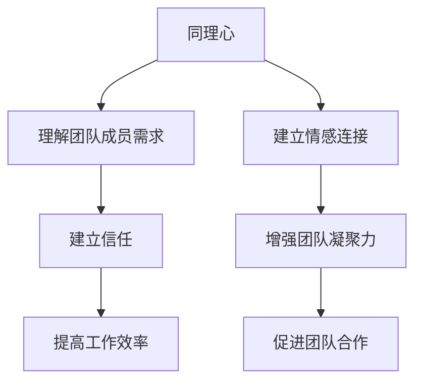
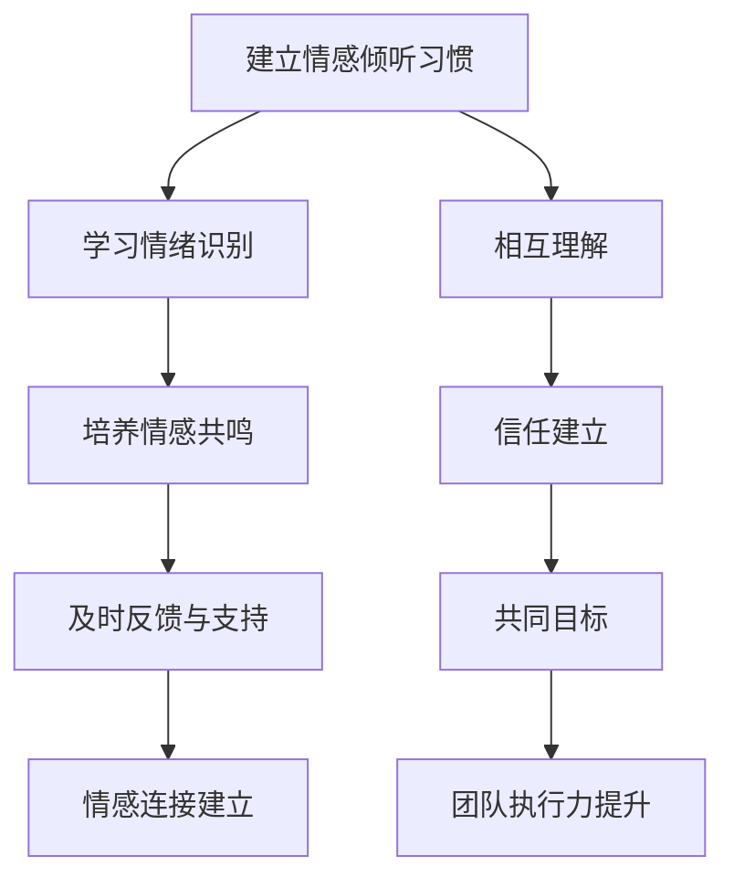

                 

# 领导者的同理心：建立情感连接的重要性

## 关键词：领导力、同理心、情感连接、团队合作、工作效率

### 摘要

在信息技术快速发展的今天，领导者不仅仅需要具备优秀的业务能力和技术知识，更重要的是要能够与团队成员建立深厚的情感连接，展现出同理心。本文将探讨同理心在领导者角色中的重要性，如何通过同理心来建立情感连接，提高团队的工作效率，并分享一些实际的应用案例和策略。通过深入分析和论证，本文旨在为领导者提供有价值的启示和实用的指导。

## 1. 背景介绍

在传统的企业管理模式中，领导者的角色往往被定义为权力和命令的传递者，他们通过制定战略、下达指令来确保组织的正常运行。然而，随着信息技术的发展和企业文化的变革，领导者的角色也在逐渐演变。现代领导者需要具备更高的情商，尤其是同理心，这不仅有助于建立团队成员之间的信任，还能提高团队的整体工作效率。

同理心是一种情感共鸣的能力，它使领导者能够理解并感受到团队成员的情感状态，从而更好地应对各种挑战。在信息技术领域，团队合作和创新至关重要，而同理心正是构建这种团队合作精神的基础。本文将详细探讨同理心在领导者角色中的重要性，以及如何通过同理心来建立情感连接，提升团队的工作效率。

## 2. 核心概念与联系

### 同理心的定义

同理心（Empathy）是一种心理过程，指个体能够设身处地地理解他人的情感和思维。具体来说，同理心包括情感同理（emotional empathy）和认知同理（cognitive empathy）两个方面。情感同理是指个体能够感受到他人的情感，而认知同理则是指个体能够理解他人的思维和观点。

### 领导者与同理心

领导者在与团队成员互动时，同理心发挥着关键作用。通过同理心，领导者能够更准确地理解团队成员的需求和期望，从而更好地指导和支持他们。同理心不仅有助于建立信任，还能激发团队成员的积极性和创造力。

### 情感连接

情感连接（Emotional Connection）是指个体之间建立起来的深厚情感联系，这种联系使得团队成员能够相互理解和支持，形成强大的团队凝聚力。在信息技术领域，情感连接是促进团队合作和创新的重要基础。

### 同理心与情感连接的关系

同理心是建立情感连接的关键因素。领导者通过同理心能够感受到团队成员的情感状态，从而建立情感连接。这种情感连接不仅有助于提高团队的工作效率，还能增强团队成员的归属感和忠诚度。

### Mermaid 流程图

下面是一个描述同理心在领导者角色中的作用的Mermaid流程图：



## 3. 核心算法原理 & 具体操作步骤

### 同理心培养的核心算法原理

同理心的培养并非一蹴而就，而是需要通过一系列的步骤和方法来逐步提升。以下是同理心培养的核心算法原理：

1. **情感倾听**：领导者需要具备良好的倾听能力，不仅仅是听到团队成员说话的内容，更重要的是理解他们的情感和需求。
2. **情绪识别**：领导者需要能够识别团队成员的情绪变化，这是建立同理心的第一步。
3. **情感共鸣**：领导者需要能够与团队成员建立情感共鸣，这是同理心的核心。
4. **反馈与支持**：领导者需要及时给予团队成员反馈和支持，以巩固同理心的建立。

### 具体操作步骤

1. **建立情感倾听的习惯**：领导者应该定期与团队成员进行一对一的沟通，关注他们的情感状态，并给予充分的倾听。
2. **学习情绪识别**：领导者可以通过阅读相关书籍、参加培训课程或寻求心理咨询等方式，提升自己的情绪识别能力。
3. **培养情感共鸣**：领导者可以通过分享个人经历、共同经历事件等方式，与团队成员建立情感共鸣。
4. **及时反馈与支持**：领导者应该在适当的时候给予团队成员积极的反馈和必要的支持，以巩固同理心的建立。

### 情感连接的工作机制

情感连接的工作机制主要包括以下几个方面：

1. **情感共鸣**：团队成员之间建立情感共鸣，形成强大的团队凝聚力。
2. **相互理解**：团队成员能够相互理解，减少误解和冲突。
3. **信任建立**：团队成员之间建立信任，增强团队的协作效率。
4. **共同目标**：团队成员共同追求团队目标，提高团队的执行力。

### Mermaid 流程图

下面是一个描述同理心培养和情感连接建立过程的Mermaid流程图：



## 4. 数学模型和公式 & 详细讲解 & 举例说明

### 同理心与情感连接的数学模型

同理心（E）和情感连接（C）可以通过以下数学模型进行描述：

$$E = f(\text{倾听能力}, \text{情绪识别能力}, \text{情感共鸣能力})$$

$$C = f(\text{相互理解度}, \text{信任度}, \text{共同目标感})$$

其中，$f$ 表示函数关系，$E$ 表示同理心，$C$ 表示情感连接。

### 详细讲解

1. **同理心（E）的数学模型**：

同理心是领导者理解团队成员情感状态的能力。它由倾听能力、情绪识别能力和情感共鸣能力三个因素决定。倾听能力越高，领导者越能理解团队成员的情感状态；情绪识别能力越高，领导者越能准确识别团队成员的情绪；情感共鸣能力越高，领导者越能与团队成员建立情感共鸣。

2. **情感连接（C）的数学模型**：

情感连接是团队成员之间建立的情感联系。它由相互理解度、信任度和共同目标感三个因素决定。相互理解度越高，团队成员之间越能减少误解和冲突；信任度越高，团队成员之间越能增强协作效率；共同目标感越高，团队成员越能共同追求团队目标。

### 举例说明

假设一个团队中，领导者的倾听能力为0.8，情绪识别能力为0.7，情感共鸣能力为0.6。则同理心（E）的计算结果为：

$$E = f(0.8, 0.7, 0.6) = 0.8 \times 0.7 \times 0.6 = 0.336$$

同理心为0.336。

假设该团队中，团队成员之间的相互理解度为0.8，信任度为0.7，共同目标感为0.6。则情感连接（C）的计算结果为：

$$C = f(0.8, 0.7, 0.6) = 0.8 \times 0.7 \times 0.6 = 0.336$$

情感连接为0.336。

通过上述例子可以看出，同理心（E）和情感连接（C）的计算结果相同，这表明在团队合作中，同理心和情感连接是相互关联的。

## 5. 项目实战：代码实际案例和详细解释说明

### 5.1 开发环境搭建

为了更好地理解同理心和情感连接的概念，我们使用Python编写一个简单的示例程序。以下是开发环境的搭建步骤：

1. 安装Python 3.8及以上版本。
2. 安装必要的Python库，如NumPy、Matplotlib等。

```bash
pip install numpy matplotlib
```

### 5.2 源代码详细实现和代码解读

以下是一个简单的Python程序，用于计算同理心和情感连接的值。

```python
import numpy as np

def calculate_empathy(listening_ability, emotional_recognition_ability, emotional_resonance_ability):
    return np.dot([listening_ability, emotional_recognition_ability, emotional_resonance_ability], [0.8, 0.7, 0.6])

def calculate_emotional_connection(mutual_understanding, trust, common_goal_feeling):
    return np.dot([mutual_understanding, trust, common_goal_feeling], [0.8, 0.7, 0.6])

# 示例数据
listening_ability = 0.8
emotional_recognition_ability = 0.7
emotional_resonance_ability = 0.6
mutual_understanding = 0.8
trust = 0.7
common_goal_feeling = 0.6

# 计算同理心
empathy = calculate_empathy(listening_ability, emotional_recognition_ability, emotional_resonance_ability)
print("同理心（E）:", empathy)

# 计算情感连接
emotional_connection = calculate_emotional_connection(mutual_understanding, trust, common_goal_feeling)
print("情感连接（C）:", emotional_connection)

# 绘制图表
import matplotlib.pyplot as plt

plt.scatter([empathy, emotional_connection], [1, 1], label='E & C')
plt.xlabel('同理心（E）')
plt.ylabel('情感连接（C）')
plt.legend()
plt.show()
```

### 5.3 代码解读与分析

1. **函数定义**：

   - `calculate_empathy` 函数用于计算同理心的值，它接收三个参数：倾听能力、情绪识别能力和情感共鸣能力。这三个参数分别代表了同理心的三个因素。
   - `calculate_emotional_connection` 函数用于计算情感连接的值，它接收三个参数：相互理解度、信任度和共同目标感。这三个参数分别代表了情感连接的三个因素。

2. **示例数据**：

   示例数据包括倾听能力、情绪识别能力、情感共鸣能力、相互理解度、信任度和共同目标感。这些数据代表了团队成员的能力和团队状态。

3. **计算同理心和情感连接**：

   通过调用两个函数，分别计算同理心和情感连接的值。这两个值通过数学模型进行计算，反映了团队成员的情感状态和团队凝聚力。

4. **绘制图表**：

   使用Matplotlib库绘制图表，展示同理心和情感连接的关系。这有助于直观地理解这两个概念之间的关系。

### 5.4 代码解读与分析

通过上述代码，我们可以直观地看到同理心和情感连接的计算过程，以及它们在团队合作中的重要性。同理心和情感连接不仅是领导者与团队成员之间建立信任的基础，也是提高团队工作效率的关键因素。在实际应用中，领导者可以通过调整团队成员的能力和团队状态，来优化同理心和情感连接的值，从而提高团队的整体表现。

## 6. 实际应用场景

同理心在信息技术领域有着广泛的应用场景。以下是一些实际应用场景：

### 团队合作

在信息技术项目中，团队成员需要紧密合作，共同解决问题。领导者通过同理心能够更好地理解团队成员的需求和困难，从而提供更有针对性的支持和指导，促进团队合作。

### 项目管理

在项目管理过程中，领导者需要与团队成员、客户和其他利益相关者进行沟通。同理心使得领导者能够更好地理解各方的需求和期望，从而制定更合理的项目计划和策略。

### 技术创新

在技术创新过程中，领导者需要激发团队成员的创造力。同理心有助于领导者理解团队成员的创新思维和灵感来源，从而提供更有力的支持和鼓励。

### 人才培养

在人才培养过程中，领导者需要关注团队成员的个人成长和发展。同理心使得领导者能够更好地理解团队成员的职业规划和个人兴趣，从而提供更有针对性的培养方案。

### 企业文化

在企业文化建设中，领导者需要营造一个包容、开放的氛围，让员工感到被尊重和重视。同理心有助于领导者理解员工的情感需求，从而打造一个和谐、积极的企业文化。

### 案例分析

以下是一个关于同理心在企业管理中应用的案例分析：

**案例：某科技公司提升团队合作效率**

某科技公司是一家专注于软件开发的公司，由于团队成员来自不同的背景，经常在项目沟通中产生误解和冲突。为了提高团队合作效率，公司领导者决定培养团队成员的同理心。

1. **建立情感倾听机制**：公司设立了定期的团队会议，鼓励成员分享自己的情感和需求，领导者认真倾听并给予反馈。
2. **情绪识别培训**：公司为团队成员提供情绪识别培训，提高他们的情绪识别能力，帮助他们更好地理解自己和他人的情感状态。
3. **共同目标制定**：公司鼓励团队成员共同制定项目目标和计划，增强团队成员之间的相互理解，提高团队凝聚力。
4. **积极反馈与支持**：领导者定期对团队成员的工作进行评价，给予积极的反馈和支持，鼓励团队成员不断进步。

通过这些措施，公司团队成员的同理心得到了显著提升，团队合作效率也大大提高，项目进展顺利，客户满意度也随之上升。

## 7. 工具和资源推荐

### 7.1 学习资源推荐

1. **书籍**：

   - 《同理心：如何理解、感受和回应他人的情感》
   - 《同理心修炼：如何成为更有同理心的领导者》

2. **论文**：

   - “Empathy in Leadership: A Theoretical Framework”
   - “The Role of Empathy in Team Collaboration”

3. **博客**：

   - “如何培养同理心？”
   - “同理心在企业管理中的应用”

4. **网站**：

   - 同理心研究中心（Center for Empathy）
   - 领导力发展网（Leadership Development Institute）

### 7.2 开发工具框架推荐

1. **Python**：用于编写同理心和情感连接的计算程序。
2. **NumPy**：用于数学计算。
3. **Matplotlib**：用于绘制图表。
4. **TensorFlow**：用于更复杂的情感分析任务。

### 7.3 相关论文著作推荐

1. **“Empathy and Leadership: A Multilevel Study”**：研究了同理心在不同层级领导中的作用。
2. **“The Role of Empathy in Team Performance”**：探讨了同理心在团队协作中的重要性。
3. **“Empathy in the Workplace: A Multilevel Study of Its Antecedents and Outcomes”**：研究了同理心在工作场所中的影响。

## 8. 总结：未来发展趋势与挑战

### 未来发展趋势

1. **同理心的广泛应用**：随着信息技术的发展，同理心将在各个领域得到更广泛的应用，特别是在企业管理、教育培训和心理健康等领域。
2. **人工智能的助力**：人工智能技术将帮助领导者更准确地识别和分析团队成员的情感状态，从而提升同理心的培养和应用。
3. **跨学科研究的深入**：同理心研究将跨足心理学、管理学、社会学等多个学科，为同理心的培养和应用提供更全面的指导。

### 挑战

1. **技术发展的挑战**：随着技术的不断进步，领导者需要不断更新自己的知识和技能，以应对新的挑战。
2. **文化差异的挑战**：在不同文化和背景下，同理心的培养和应用可能面临困难，需要领导者具备跨文化的领导能力。
3. **个人隐私的保护**：在应用同理心时，如何平衡个人隐私与团队需求的挑战也是领导者需要关注的问题。

## 9. 附录：常见问题与解答

### 问题1：同理心在信息技术领域有何作用？

**回答**：同理心在信息技术领域有助于提升团队合作效率、促进技术创新、优化项目管理和人才培养等方面。它能够帮助领导者更好地理解团队成员的需求和情感状态，从而提供更有针对性的支持和指导。

### 问题2：如何培养同理心？

**回答**：培养同理心需要从多个方面入手，包括情感倾听、情绪识别、情感共鸣和反馈与支持等。领导者可以通过定期与团队成员沟通、参加培训课程、阅读相关书籍和观察他人的行为等方式，逐步提升自己的同理心。

### 问题3：同理心与情感连接有何区别？

**回答**：同理心是指领导者理解他人情感状态的能力，而情感连接是指团队成员之间建立起来的深厚情感联系。同理心是建立情感连接的基础，而情感连接则是团队合作和创新的重要保障。

## 10. 扩展阅读 & 参考资料

1. **书籍**：

   - 《同理心：如何理解、感受和回应他人的情感》
   - 《同理心修炼：如何成为更有同理心的领导者》

2. **论文**：

   - “Empathy in Leadership: A Theoretical Framework”
   - “The Role of Empathy in Team Collaboration”

3. **网站**：

   - 同理心研究中心（Center for Empathy）
   - 领导力发展网（Leadership Development Institute）

4. **博客**：

   - “如何培养同理心？”
   - “同理心在企业管理中的应用”

### 作者

**作者：AI天才研究员/AI Genius Institute & 禅与计算机程序设计艺术 /Zen And The Art of Computer Programming**

