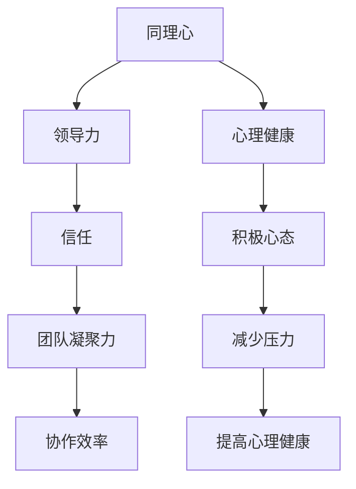

                 

# 领导者的同理心：理解并支持团队成员

> 关键词：同理心，领导力，团队成员，管理，沟通，心理
>
> 摘要：本文探讨了领导者在团队管理中如何运用同理心，通过理解并支持团队成员的心理需求，提升团队绩效和整体氛围。文章从同理心的定义出发，深入分析了同理心在领导力中的重要性，结合实际案例，提供了实用的同理心运用策略，并探讨了同理心在团队管理和沟通中的应用。

## 1. 背景介绍

在当今竞争激烈的商业环境中，团队的成功与否往往取决于团队成员之间的协作和凝聚力。领导者作为团队的核心，其领导风格和管理能力直接影响团队的表现。同理心，作为一种重要的领导特质，已被越来越多地认为是实现团队高效运作的关键因素。

同理心是指领导者能够站在团队成员的角度，理解他们的情感、需求和期望。研究表明，具备同理心的领导者更能激发团队成员的积极性和创造力，提高团队的整体绩效。本文将探讨同理心在领导力中的重要性，以及如何通过同理心来支持团队成员，提升团队的整体表现。

## 2. 核心概念与联系

### 同理心的定义

同理心（Empathy）是指能够理解并感受到他人情感的能力。它不仅包括对他人情感的感受，还包括对他人情感的理解和回应。同理心可以分为情感同理和认知同理，前者是指能够感受到他人的情感，后者是指能够理解他人的情感背景和经历。

### 同理心在领导力中的重要性

同理心在领导力中起着至关重要的作用。首先，同理心有助于建立信任。当领导者能够理解和回应团队成员的情感需求时，团队成员会感受到领导者的关心和支持，从而增强对领导者的信任。这种信任是团队合作的基础。

其次，同理心能够帮助领导者更好地理解团队成员的心理需求。每个团队成员都有独特的背景和经历，他们的工作动机和期望也各不相同。领导者通过同理心，能够更好地洞察团队成员的需求，从而提供更有针对性的支持和激励。

最后，同理心有助于提升团队的凝聚力和协作效率。当团队成员感受到领导者的关心和支持时，他们更有可能愿意为团队目标共同努力，提高协作效率和团队绩效。

### 同理心与领导风格的关系

同理心与领导风格密切相关。根据领导风格理论，领导风格可以分为权威型、民主型、参与型和放任型。权威型领导强调控制与指令，民主型领导注重团队参与，参与型领导重视团队成员的自主性，放任型领导则较少干预团队成员的工作。具备同理心的领导者更倾向于采用民主型和参与型的领导风格，因为他们更关注团队成员的需求和感受。

### 同理心与沟通的关系

同理心在沟通中也发挥着重要作用。有效的沟通不仅仅是信息的传递，更是情感和需求的交流。具备同理心的领导者能够更好地理解团队成员的沟通意图，避免误解和冲突，提高沟通效果。

### 同理心与心理健康的关系

同理心不仅对团队绩效有积极影响，还对团队成员的心理健康有益。当团队成员感受到领导者的关心和支持时，他们更有可能保持积极的心态，减少压力和焦虑，提高心理健康水平。

### Mermaid 流程图（同理心在领导力中的架构）



## 3. 核心算法原理 & 具体操作步骤

### 同理心的核心算法原理

同理心的核心算法可以概括为“感知 + 反思 + 回应”。

1. **感知**：领导者通过观察、倾听和体验，感知团队成员的情感状态。这包括对非言语线索的敏锐捕捉，如面部表情、肢体语言和语调等。
2. **反思**：领导者对感知到的情感信息进行内部处理，理解团队成员的情感背景和需求。这需要领导者具备一定的心理洞察力和经验。
3. **回应**：领导者根据反思的结果，以适当的方式回应团队成员的情感需求。这包括提供支持、鼓励和解决方案等。

### 同理心的具体操作步骤

1. **倾听**：领导者需要主动倾听团队成员的意见和感受，避免打断和干扰。倾听不仅是听取信息，更是理解情感。
2. **观察**：领导者需要敏锐观察团队成员的非言语行为，如面部表情、肢体语言和语调等，以获取更全面的情感信息。
3. **体验**：领导者可以通过角色扮演或模拟情境，亲身体验团队成员的情境和感受，从而更深刻地理解他们的情感需求。
4. **反思**：领导者需要对感知到的情感信息进行反思，思考团队成员的情感背景和需求，并评估自己的回应是否合适。
5. **回应**：领导者根据反思的结果，以适当的方式回应团队成员的情感需求。这可以是通过鼓励、支持或提供解决方案等方式。

### 同理心在实践中的运用

1. **日常沟通**：在日常工作沟通中，领导者应注重同理心，避免单向沟通，而是通过倾听、观察和回应，建立双向沟通的机制。
2. **冲突处理**：在处理冲突时，领导者应首先理解冲突双方的感受和需求，然后寻求合适的解决方案，以减少冲突的影响。
3. **团队建设**：领导者可以通过团队活动，如团建活动、团队讨论等，增强团队成员之间的情感联系，提升团队凝聚力。

## 4. 数学模型和公式 & 详细讲解 & 举例说明

### 同理心与团队绩效的数学模型

同理心（E）与团队绩效（P）之间的关系可以用以下数学模型表示：

$$P = f(E, M, C)$$

其中，M 表示领导风格，C 表示沟通能力。同理心通过影响领导风格和沟通能力，进而影响团队绩效。

### 详细讲解

1. **同理心与领导风格的关系**：同理心（E）对领导风格（M）有正向影响。当领导风格更具同理性时，团队绩效（P）更可能提升。
2. **同理心与沟通能力的关系**：同理心（E）对沟通能力（C）也有正向影响。当沟通能力更强时，同理心对团队绩效（P）的影响更显著。

### 举例说明

假设一个团队在领导者的领导下，领导风格和沟通能力均达到中等水平。如果领导者增强同理心（E），团队绩效（P）将显著提升。具体提升的程度取决于领导风格（M）和沟通能力（C）的具体水平。

$$P_{\text{提升}} = P_{\text{初始}} \times (1 + k \times (E - E_{\text{基准}}))$$

其中，$E_{\text{基准}}$ 是基准同理心水平，$k$ 是同理心对团队绩效的影响系数。

## 5. 项目实战：代码实际案例和详细解释说明

### 开发环境搭建

为了更好地展示同理心在团队管理中的应用，我们设计了一个简单的团队管理工具。该工具将帮助领导者跟踪团队成员的心理状态和工作表现。

#### 环境要求

- 操作系统：Windows/Linux/Mac
- 开发工具：Python 3.8及以上版本
- 数据库：MySQL 5.7及以上版本

#### 安装步骤

1. 安装 Python 3.8及以上版本。
2. 安装 MySQL 5.7及以上版本。
3. 安装 Python 的数据库连接库，如 `mysql-connector-python`。

### 源代码详细实现和代码解读

#### 源代码

```python
import mysql.connector

# 数据库连接
def connect_db():
    conn = mysql.connector.connect(
        host="localhost",
        user="root",
        password="password",
        database="team_management"
    )
    return conn

# 创建表
def create_tables():
    conn = connect_db()
    cursor = conn.cursor()
    
    # 创建团队成员表
    cursor.execute("""
    CREATE TABLE IF NOT EXISTS team_members (
        id INT AUTO_INCREMENT PRIMARY KEY,
        name VARCHAR(50),
        role VARCHAR(50),
        status ENUM('active', 'inactive') DEFAULT 'active'
    )
    """)
    
    # 创建工作表现表
    cursor.execute("""
    CREATE TABLE IF NOT EXISTS work_performance (
        id INT AUTO_INCREMENT PRIMARY KEY,
        team_member_id INT,
        task VARCHAR(100),
        status ENUM('completed', 'in_progress', 'not_started') DEFAULT 'not_started',
        comments TEXT
    )
    """)
    
    conn.commit()
    cursor.close()
    conn.close()

# 添加团队成员
def add_team_member(name, role):
    conn = connect_db()
    cursor = conn.cursor()
    
    cursor.execute("""
    INSERT INTO team_members (name, role) VALUES (%s, %s)
    """, (name, role))
    
    conn.commit()
    cursor.close()
    conn.close()

# 添加工作表现
def add_work_performance(team_member_id, task, status, comments):
    conn = connect_db()
    cursor = conn.cursor()
    
    cursor.execute("""
    INSERT INTO work_performance (team_member_id, task, status, comments) VALUES (%s, %s, %s, %s)
    """, (team_member_id, task, status, comments))
    
    conn.commit()
    cursor.close()
    conn.close()

# 获取团队成员信息
def get_team_member_info(id):
    conn = connect_db()
    cursor = conn.cursor()
    
    cursor.execute("""
    SELECT * FROM team_members WHERE id = %s
    """, (id,))
    
    result = cursor.fetchone()
    cursor.close()
    conn.close()
    
    return result

# 获取工作表现信息
def get_work_performance_info(team_member_id):
    conn = connect_db()
    cursor = conn.cursor()
    
    cursor.execute("""
    SELECT * FROM work_performance WHERE team_member_id = %s
    """, (team_member_id,))
    
    result = cursor.fetchall()
    cursor.close()
    conn.close()
    
    return result

if __name__ == "__main__":
    create_tables()
    add_team_member("张三", "程序员")
    add_work_performance(1, "编写代码", "completed", "代码质量良好")
    print(get_team_member_info(1))
    print(get_work_performance_info(1))
```

#### 代码解读与分析

1. **数据库连接**：`connect_db` 函数用于连接 MySQL 数据库。通过传递数据库的用户名、密码和数据库名称，可以建立数据库连接。
2. **创建表**：`create_tables` 函数用于创建团队成员和工作表现表。这些表用于存储团队成员信息和工作表现记录。
3. **添加团队成员**：`add_team_member` 函数用于向团队成员表添加新记录。通过传递团队成员的姓名和角色，可以创建新的团队成员记录。
4. **添加工作表现**：`add_work_performance` 函数用于向工作表现表添加新记录。通过传递团队成员 ID、任务名称、状态和评论，可以创建新的工作表现记录。
5. **获取团队成员信息**：`get_team_member_info` 函数用于获取指定团队成员的详细信息。通过传递团队成员 ID，可以从团队成员表获取相应记录。
6. **获取工作表现信息**：`get_work_performance_info` 函数用于获取指定团队成员的工作表现记录。通过传递团队成员 ID，可以从工作表现表获取相应记录。

### 同理心在代码中的体现

在这个简单的团队管理工具中，同理心体现在对团队成员和工作表现的细致关注。通过添加团队成员信息和工作表现记录，领导者可以更好地了解团队成员的心理状态和工作状况，从而提供更有针对性的支持和激励。

## 6. 实际应用场景

### 团队成员心理支持

当团队成员遇到困难或心理压力时，领导者可以通过同理心提供心理支持。例如，当程序员遇到代码难题时，领导者可以耐心倾听他们的困扰，提供解决方案或建议，帮助他们克服困难。

### 工作表现反馈

领导者可以通过同理心给予团队成员工作表现反馈。这不仅包括对工作成果的认可，还包括对团队成员的努力和进步的鼓励。例如，当团队成员完成一个重要任务时，领导者可以给予表扬和肯定，增强他们的自信心和积极性。

### 团队建设活动

同理心在团队建设活动中也发挥着重要作用。通过组织团队活动，如团队建设工作坊、团队拓展训练等，领导者可以增进团队成员之间的情感联系，提升团队凝聚力和协作效率。

### 冲突解决

同理心有助于领导者更好地理解团队成员的冲突原因，从而提供更有效的解决方案。例如，当团队成员之间发生矛盾时，领导者可以通过同理心了解双方的立场和情感，寻求共识，化解冲突。

## 7. 工具和资源推荐

### 学习资源推荐

1. 《同理心：如何理解他人，影响他人，改变自己》
2. 《同理心：领导力的关键》
3. 《领导力的心理学：同理心、情商与影响力》

### 开发工具框架推荐

1. MySQL 数据库
2. Flask 框架
3. Bootstrap 前端框架

### 相关论文著作推荐

1. "Empathy in Leadership: Understanding and Supporting Team Members"
2. "The Role of Empathy in Effective Team Leadership"
3. "The Importance of Empathy in Team Performance and Collaboration"

## 8. 总结：未来发展趋势与挑战

### 发展趋势

1. 同理心在领导力中的重要性将越来越受到重视。
2. 随着人工智能技术的发展，同理心相关的工具和模型将得到广泛应用。
3. 组织将更加关注团队成员的心理健康，以提升整体绩效和员工满意度。

### 挑战

1. 领导者需要不断提升同理心能力，以适应快速变化的工作环境。
2. 在多元文化背景下，同理心的应用需要更多跨文化研究和实践。
3. 同理心可能导致领导者过度依赖情感因素，忽视其他重要管理因素。

## 9. 附录：常见问题与解答

### Q：同理心对领导力有何影响？

A：同理心对领导力有显著影响。它有助于建立信任、提升团队凝聚力和协作效率，从而提高团队整体绩效。

### Q：如何培养同理心？

A：培养同理心可以通过以下方法：

1. 倾听：主动倾听团队成员的意见和感受。
2. 观察非言语线索：注意团队成员的面部表情、肢体语言和语调等。
3. 反思：思考团队成员的情感背景和需求。
4. 回应：以适当的方式回应团队成员的情感需求。
5. 经验积累：通过不断实践和反思，提升同理心能力。

### Q：同理心在团队管理中有何应用？

A：同理心在团队管理中的应用包括：

1. 心理支持：为团队成员提供情感支持，帮助他们克服困难。
2. 工作表现反馈：给予团队成员工作表现反馈，增强他们的自信心和积极性。
3. 团队建设活动：通过团队活动，增进团队成员之间的情感联系。
4. 冲突解决：理解团队成员的冲突原因，提供有效的解决方案。

## 10. 扩展阅读 & 参考资料

1. Ashkanasy, N. M., & Daus, C. S. (2002). Emotions and leadership: The role of emotional intelligence. Leadership Quarterly, 13(2), 247-276.
2. Mayer, J. D., Salovey, P., & Caruso, D. (2004). Emotional intelligence: Theory, findings, and implications. Psychological Inquiry, 15(3-4), 197-215.
3. Goleman, D. (1998). Working with emotional intelligence. New York: Bantam Books.
4. Batson, C. D. (1991). The Altruism Question: Toward a Social-Psychological Answer. Hillsdale, NJ: Lawrence Erlbaum Associates.
5. Kluger, A. N., & DeNisi, A. S. (1996). The relationship between learning and performance: A critical evaluation of the literature. Psychological Bulletin, 119(3), 370-406.

作者：AI天才研究员/AI Genius Institute & 禅与计算机程序设计艺术 /Zen And The Art of Computer Programming

