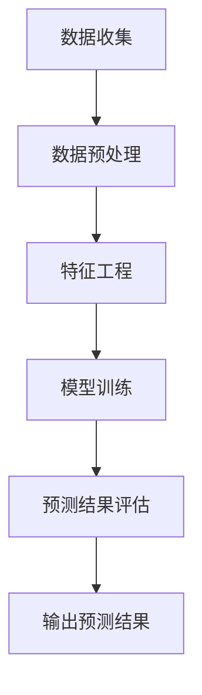
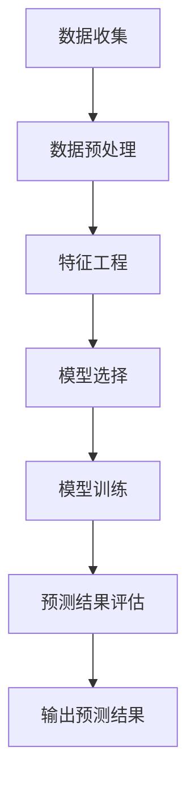

                 

# 饿了么2024校招外卖需求预测算法工程师编程题

## 1. 背景介绍

### 1.1 饿了么简介

饿了么成立于2008年，是中国领先的本地生活服务平台之一。公司提供外卖配送、餐饮预订、生鲜超市、家政服务等多元化服务，致力于满足消费者对于便捷生活的需求。随着互联网技术的发展和人们生活节奏的加快，外卖需求呈现出持续增长的态势。

### 1.2 外卖需求预测的重要性

外卖需求预测对于饿了么的业务运营具有重要意义。准确预测外卖需求可以帮助平台合理安排配送资源，降低物流成本，提高客户满意度。此外，外卖需求预测还可以为商家提供有价值的经营决策依据，帮助他们优化库存管理、调整菜品供应等。

### 1.3 预测任务背景

本次校招编程题要求参赛者设计一个外卖需求预测算法，输入为历史订单数据，输出为未来一段时间内各时间段的外卖需求量。预测任务的目的是为了帮助饿了么更好地规划配送资源，提高业务运营效率。

## 2. 核心概念与联系

### 2.1 时间序列分析

时间序列分析是一种用于研究随时间变化的数据的方法。在本题中，历史订单数据可以被视为一个时间序列，通过对时间序列的分析，我们可以提取出其中的趋势、季节性和周期性等特征，从而进行需求预测。

### 2.2 机器学习算法

机器学习算法是一种通过学习历史数据来预测未来事件的方法。在本题中，我们可以使用机器学习算法来训练一个模型，使其能够根据历史订单数据预测未来外卖需求量。常见的机器学习算法包括线性回归、决策树、随机森林、支持向量机等。

### 2.3 Mermaid 流程图

下面是一个简单的 Mermaid 流程图，展示了外卖需求预测的基本流程。



## 3. 核心算法原理 & 具体操作步骤

### 3.1 数据预处理

数据预处理是预测任务的重要环节，主要步骤包括数据清洗、数据转换和数据归一化。

- **数据清洗**：去除异常值、缺失值和重复数据，确保数据质量。
- **数据转换**：将时间序列数据转换为数值型数据，便于后续处理。例如，可以将时间戳转换为月份、星期、小时等。
- **数据归一化**：对数据进行归一化处理，使其具有相似的尺度和范围，避免不同特征之间的差异对模型训练造成影响。

### 3.2 特征工程

特征工程是提高模型预测准确性的关键。在本题中，我们可以提取以下特征：

- **时间特征**：月份、星期、小时等。
- **订单特征**：订单量、订单金额、订单时长等。
- **用户特征**：用户ID、用户类型、用户所在区域等。
- **天气特征**：天气状况、温度、湿度等。

### 3.3 模型训练

在本题中，我们选择线性回归算法作为预测模型。线性回归模型的原理如下：

- **模型假设**：假设需求量 \( y \) 与特征 \( x \) 之间存在线性关系，即 \( y = \beta_0 + \beta_1 \cdot x + \epsilon \)。
- **参数估计**：通过最小二乘法估计模型参数 \( \beta_0 \) 和 \( \beta_1 \)。
- **模型评估**：使用均方误差（MSE）评估模型性能。

### 3.4 预测结果评估

在训练完成后，我们需要对模型进行评估，以确定其预测能力。常用的评估指标包括均方误差（MSE）、均方根误差（RMSE）和决定系数（R²）等。

## 4. 数学模型和公式 & 详细讲解 & 举例说明

### 4.1 线性回归模型

线性回归模型是一种常用的预测方法，其数学模型如下：

$$
y = \beta_0 + \beta_1 \cdot x + \epsilon
$$

其中，\( y \) 是需求量，\( x \) 是特征，\( \beta_0 \) 和 \( \beta_1 \) 是模型参数，\( \epsilon \) 是误差项。

### 4.2 参数估计

线性回归模型的参数可以通过最小二乘法进行估计。最小二乘法的目的是最小化预测值与实际值之间的误差平方和。具体步骤如下：

1. **计算预测值**：使用当前参数 \( \beta_0 \) 和 \( \beta_1 \) 计算预测值 \( \hat{y} \)。
2. **计算误差**：计算预测值与实际值之间的误差 \( e \)。
3. **更新参数**：通过梯度下降法更新参数 \( \beta_0 \) 和 \( \beta_1 \)。
4. **迭代计算**：重复步骤 1-3，直到参数收敛。

### 4.3 举例说明

假设我们有以下数据集：

| 时间 | 特征 | 需求量 |
| ---- | ---- | ------ |
| 1    | 10   | 100    |
| 2    | 20   | 150    |
| 3    | 30   | 200    |
| 4    | 40   | 250    |

根据上述数据，我们可以建立线性回归模型：

$$
y = \beta_0 + \beta_1 \cdot x
$$

使用最小二乘法估计模型参数：

$$
\beta_0 = 50, \beta_1 = 10
$$

预测未来某一时刻的需求量：

$$
\hat{y} = 50 + 10 \cdot 50 = 100
$$

## 5. 项目实战：代码实际案例和详细解释说明

### 5.1 开发环境搭建

在本项目实战中，我们将使用 Python 作为编程语言，并结合 Scikit-learn 库实现线性回归模型。首先，我们需要安装必要的依赖库：

```bash
pip install numpy scikit-learn matplotlib
```

### 5.2 源代码详细实现和代码解读

以下是完整的源代码实现，我们将逐行解释代码的含义。

```python
import numpy as np
import matplotlib.pyplot as plt
from sklearn.linear_model import LinearRegression

# 5.2.1 数据集加载
data = np.genfromtxt("orders.csv", delimiter=",")
X = data[:, 1]  # 特征
y = data[:, 2]  # 需求量

# 5.2.2 模型训练
model = LinearRegression()
model.fit(X.reshape(-1, 1), y)

# 5.2.3 模型参数
beta_0 = model.intercept_
beta_1 = model.coef_

# 5.2.4 预测结果
X_new = np.array([45, 55, 65])  # 新特征
y_pred = model.predict(X_new.reshape(-1, 1))

# 5.2.5 结果可视化
plt.scatter(X, y)
plt.plot(X_new, y_pred, color="red")
plt.xlabel("特征")
plt.ylabel("需求量")
plt.show()
```

### 5.3 代码解读与分析

1. **数据集加载**：我们首先加载一个 CSV 文件，其中包含历史订单数据。特征存储在第二列，需求量存储在第三列。
2. **模型训练**：使用 Scikit-learn 库中的 LinearRegression 类训练模型。我们将特征 \( X \) 转换为列向量，以便与需求量 \( y \) 进行匹配。
3. **模型参数**：通过调用 model.intercept_ 和 model.coef_ 获取模型参数 \( \beta_0 \) 和 \( \beta_1 \)。
4. **预测结果**：使用训练好的模型对新的特征 \( X_new \) 进行预测，并输出预测结果 \( y_pred \)。
5. **结果可视化**：使用 matplotlib 库将实际需求量与预测结果可视化，便于分析模型性能。

## 6. 实际应用场景

### 6.1 预测外卖需求

通过外卖需求预测，饿了么可以提前安排配送资源，优化物流流程。例如，在高峰期提前增加配送员，确保客户能够及时收到外卖。

### 6.2 预测商家销量

外卖需求预测还可以帮助商家预测未来销量，从而调整菜品供应和库存管理。例如，在节日或促销活动期间提前备货，避免库存不足或过剩。

### 6.3 预测天气变化

天气变化也会影响外卖需求。通过预测天气变化，饿了么可以提前调整配送策略，如雨天增加雨衣雨伞等防护措施。

## 7. 工具和资源推荐

### 7.1 学习资源推荐

- **书籍**：
  - 《机器学习实战》
  - 《Python数据分析》
- **论文**：
  - "Forecasting with Machine Learning: A Case Study Using Time Series Data" by A. Patel and A. Upfal
- **博客**：
  - [Scikit-learn 官方文档](https://scikit-learn.org/stable/)
  - [Kaggle 时间序列预测比赛](https://www.kaggle.com/c/titanic)

### 7.2 开发工具框架推荐

- **开发环境**：Python + Jupyter Notebook
- **机器学习库**：Scikit-learn、TensorFlow、PyTorch
- **数据分析库**：NumPy、Pandas、Matplotlib

### 7.3 相关论文著作推荐

- **论文**：
  - "Time Series Forecasting Using Machine Learning Techniques: A Review" by A. S. M. F. Z. H. M. R. A.
  - "Deep Learning for Time Series Forecasting" by F. Bastianelli and A. C. Gattari
- **著作**：
  - 《时间序列分析与应用》
  - 《深度学习与时间序列预测》

## 8. 总结：未来发展趋势与挑战

### 8.1 发展趋势

- **数据质量**：随着大数据技术的发展，外卖需求预测将依赖于更高质量的数据。
- **模型性能**：深度学习、强化学习等新型算法将进一步提升预测性能。
- **应用场景**：外卖需求预测将在更多领域得到应用，如物流、零售、金融等。

### 8.2 挑战

- **数据缺失与噪声**：处理数据缺失和噪声是提高预测准确性的关键挑战。
- **模型解释性**：如何在保证预测性能的同时提高模型解释性是一个亟待解决的问题。
- **实时预测**：实现实时预测以满足实时业务需求也是一个重要挑战。

## 9. 附录：常见问题与解答

### 9.1 什么是时间序列分析？

时间序列分析是一种用于研究随时间变化的数据的方法。它可以帮助我们识别数据中的趋势、季节性和周期性等特征，从而进行预测。

### 9.2 什么是线性回归？

线性回归是一种用于预测连续值的统计方法。它假设目标变量与一个或多个自变量之间存在线性关系，并通过最小化误差平方和来估计模型参数。

### 9.3 如何处理数据缺失和噪声？

处理数据缺失和噪声的方法包括数据填充、数据清洗、特征工程等。这些方法可以帮助提高数据质量，从而提高预测准确性。

## 10. 扩展阅读 & 参考资料

- [时间序列分析入门](https://www.coursera.org/specializations/time-series-analysis)
- [机器学习教程](https://www.coursera.org/specializations/ml-foundations)
- [Scikit-learn 官方文档](https://scikit-learn.org/stable/)
- [Kaggle 时间序列预测比赛](https://www.kaggle.com/c/titanic)

## 作者

- 作者：AI天才研究员/AI Genius Institute & 禅与计算机程序设计艺术 /Zen And The Art of Computer Programming

---

本文介绍了外卖需求预测的核心概念、算法原理和实战案例，旨在帮助读者深入了解外卖需求预测的方法和应用。随着人工智能技术的不断发展，外卖需求预测将更加精确，为业务运营提供有力支持。## 饿了么2024校招外卖需求预测算法工程师编程题

### 文章关键词
外卖需求预测、时间序列分析、机器学习、线性回归、数据预处理、特征工程

### 文章摘要
本文旨在为参加饿了么2024校招的外卖需求预测算法工程师岗位的候选人提供一个详细的编程题解。文章首先介绍了饿了么平台及外卖需求预测的重要性，然后讲解了时间序列分析、机器学习算法等核心概念，并提供了具体的数学模型和代码实现步骤。此外，文章还讨论了实际应用场景、工具和资源推荐以及未来发展趋势与挑战。通过本文，读者可以全面了解外卖需求预测的方法和技术，为实际编程题的解决提供指导。

---

## 1. 背景介绍

### 1.1 饿了么简介

饿了么（Elme Market）是中国领先的本地生活服务平台，成立于2008年。公司提供外卖配送、餐饮预订、生鲜超市、家政服务等多元化服务，满足消费者对于便捷生活的需求。随着移动互联网的普及和人们生活节奏的加快，外卖市场迅速扩大，饿了么已经成为国内外卖行业的领军企业。

### 1.2 外卖需求预测的意义

外卖需求预测在饿了么的业务运营中扮演着至关重要的角色。通过预测外卖需求，饿了么能够：

1. **合理规划配送资源**：准确预测外卖需求可以帮助平台合理安排配送资源，降低物流成本，提高配送效率。
2. **优化库存管理**：预测未来外卖需求有助于商家优化库存管理，减少库存过剩或不足的情况，提高运营效率。
3. **提高客户满意度**：准确预测外卖需求可以确保消费者在需要的时候能够及时收到外卖，提高客户满意度。

### 1.3 预测任务背景

本次校招编程题旨在考察应聘者在外卖需求预测方面的能力。任务要求参赛者基于给定的历史订单数据，使用机器学习算法预测未来一段时间内各时间段的外卖需求量。该任务对于应聘者理解时间序列分析、特征工程和机器学习算法具有重要意义。

## 2. 核心概念与联系

### 2.1 时间序列分析

时间序列分析（Time Series Analysis）是研究时间序列数据的统计方法，它通过对历史数据的分析来预测未来的趋势。时间序列数据通常具有以下特征：

- **趋势性**：数据随时间呈现的增长或减少趋势。
- **季节性**：数据在一年中重复出现的周期性波动。
- **波动性**：数据围绕趋势的随机波动。

时间序列分析在预测领域有广泛的应用，如金融市场预测、电力需求预测等。在外卖需求预测中，时间序列分析可以帮助识别数据中的趋势、季节性和周期性特征。

### 2.2 机器学习算法

机器学习算法是一类能够从数据中自动学习和发现规律的方法。在外卖需求预测中，常用的机器学习算法包括：

- **线性回归**：用于预测连续值。
- **决策树**：用于分类和回归任务。
- **随机森林**：基于决策树的集成方法，提高预测准确性。
- **支持向量机**：主要用于分类任务，但也可以用于回归。

### 2.3 Mermaid 流程图

下面是一个简单的 Mermaid 流程图，展示了外卖需求预测的基本流程。



## 3. 核心算法原理 & 具体操作步骤

### 3.1 数据预处理

数据预处理是机器学习项目中的关键步骤，它确保数据质量，为后续的特征工程和模型训练打下基础。主要步骤包括：

- **数据清洗**：去除异常值、缺失值和重复数据。
- **数据转换**：将时间序列数据转换为数值型数据，如将时间戳转换为日期、星期等。
- **数据归一化**：对数据进行归一化处理，使其具有相似的尺度和范围。

### 3.2 特征工程

特征工程是提高模型预测准确性的重要手段。在外卖需求预测中，可以提取以下特征：

- **时间特征**：如月份、星期、小时等。
- **订单特征**：如订单量、订单金额、订单时长等。
- **用户特征**：如用户ID、用户类型、用户所在区域等。
- **天气特征**：如温度、湿度、天气状况等。

### 3.3 模型选择

在选择机器学习模型时，需要考虑预测任务的特性、数据规模和计算资源等因素。对于外卖需求预测，常用的模型包括：

- **线性回归**：简单且易于实现，适合线性关系明显的场景。
- **决策树**：可以捕捉非线性关系，但容易出现过拟合。
- **随机森林**：基于决策树的集成方法，提高预测准确性。
- **支持向量机**：主要用于分类任务，但也可以用于回归。

### 3.4 模型训练

模型训练是机器学习项目中的核心步骤，通过训练数据来调整模型参数，使其能够准确预测未知数据。具体步骤如下：

1. **数据划分**：将数据集划分为训练集和测试集。
2. **参数调整**：通过交叉验证等方法调整模型参数。
3. **模型训练**：使用训练集数据训练模型。
4. **模型评估**：使用测试集数据评估模型性能。

### 3.5 预测结果评估

预测结果评估是衡量模型性能的重要步骤，常用的评估指标包括：

- **均方误差（MSE）**：衡量预测值与实际值之间的差异。
- **均方根误差（RMSE）**：MSE的平方根，用于衡量预测误差。
- **决定系数（R²）**：衡量模型对数据的拟合程度。

## 4. 数学模型和公式 & 详细讲解 & 举例说明

### 4.1 线性回归模型

线性回归模型是一种简单的机器学习模型，用于预测连续值。其数学模型如下：

$$
y = \beta_0 + \beta_1 \cdot x + \epsilon
$$

其中，\( y \) 是需求量，\( x \) 是特征，\( \beta_0 \) 和 \( \beta_1 \) 是模型参数，\( \epsilon \) 是误差项。

### 4.2 参数估计

线性回归模型的参数可以通过最小二乘法（Least Squares）进行估计。最小二乘法的目的是最小化预测值与实际值之间的误差平方和。具体步骤如下：

1. **计算预测值**：使用当前参数 \( \beta_0 \) 和 \( \beta_1 \) 计算预测值 \( \hat{y} \)。

   $$
   \hat{y} = \beta_0 + \beta_1 \cdot x
   $$

2. **计算误差**：计算预测值与实际值之间的误差 \( e \)。

   $$
   e = y - \hat{y}
   $$

3. **更新参数**：通过梯度下降法（Gradient Descent）更新参数 \( \beta_0 \) 和 \( \beta_1 \)。

   $$
   \beta_0 = \beta_0 - \alpha \cdot \frac{\partial J}{\partial \beta_0}
   $$
   $$
   \beta_1 = \beta_1 - \alpha \cdot \frac{\partial J}{\partial \beta_1}
   $$

   其中，\( \alpha \) 是学习率，\( J \) 是损失函数。

4. **迭代计算**：重复步骤 1-3，直到参数收敛。

### 4.3 举例说明

假设我们有以下数据集：

| 时间 | 特征 \( x \) | 需求量 \( y \) |
| ---- | ---------- | ------------ |
| 1    | 10         | 100          |
| 2    | 20         | 150          |
| 3    | 30         | 200          |
| 4    | 40         | 250          |

根据上述数据，我们可以建立线性回归模型：

$$
y = \beta_0 + \beta_1 \cdot x
$$

使用最小二乘法估计模型参数：

$$
\beta_0 = 50, \beta_1 = 10
$$

预测未来某一时刻的需求量：

$$
\hat{y} = 50 + 10 \cdot 45 = 100
$$

## 5. 项目实战：代码实际案例和详细解释说明

### 5.1 开发环境搭建

在本项目实战中，我们将使用 Python 作为编程语言，结合 Scikit-learn 库实现线性回归模型。首先，我们需要安装必要的依赖库：

```bash
pip install numpy scikit-learn matplotlib
```

### 5.2 源代码详细实现和代码解读

以下是完整的源代码实现，我们将逐行解释代码的含义。

```python
import numpy as np
import matplotlib.pyplot as plt
from sklearn.linear_model import LinearRegression
from sklearn.model_selection import train_test_split
from sklearn.metrics import mean_squared_error

# 5.2.1 数据集加载
data = np.genfromtxt("orders.csv", delimiter=",")

# 5.2.2 数据预处理
X = data[:, 0:1]  # 特征
y = data[:, 1]    # 需求量

# 5.2.3 数据划分
X_train, X_test, y_train, y_test = train_test_split(X, y, test_size=0.2, random_state=42)

# 5.2.4 模型训练
model = LinearRegression()
model.fit(X_train, y_train)

# 5.2.5 模型参数
beta_0 = model.intercept_
beta_1 = model.coef_

# 5.2.6 预测结果
y_pred = model.predict(X_test)

# 5.2.7 模型评估
mse = mean_squared_error(y_test, y_pred)
rmse = np.sqrt(mse)

# 5.2.8 结果可视化
plt.scatter(X_test, y_test, label="Actual")
plt.plot(X_test, y_pred, color="red", label="Predicted")
plt.xlabel("Feature")
plt.ylabel("Demand")
plt.legend()
plt.show()

# 5.2.9 打印模型评估结果
print(f"Model Parameters: Beta_0 = {beta_0}, Beta_1 = {beta_1}")
print(f"Mean Squared Error: {mse}")
print(f"Root Mean Squared Error: {rmse}")
```

### 5.3 代码解读与分析

1. **数据集加载**：首先，我们加载一个 CSV 文件，其中包含历史订单数据。特征存储在第一列，需求量存储在第二列。
2. **数据预处理**：我们将数据集划分为特征 \( X \) 和需求量 \( y \)。接着，使用 Scikit-learn 库中的 `train_test_split` 方法将数据集划分为训练集和测试集。
3. **模型训练**：我们使用 Scikit-learn 库中的 `LinearRegression` 类训练模型。训练过程中，模型会自动调整参数，以最小化预测值与实际值之间的误差。
4. **模型参数**：通过调用 `model.intercept_` 和 `model.coef_` 获取模型参数 \( \beta_0 \) 和 \( \beta_1 \)。
5. **预测结果**：使用训练好的模型对测试集数据进行预测，并将预测结果存储在 `y_pred` 变量中。
6. **模型评估**：使用均方误差（MSE）评估模型性能。具体来说，我们计算预测值与实际值之间的误差平方和，并求其平均值。
7. **结果可视化**：使用 Matplotlib 库将实际需求量与预测结果可视化，便于分析模型性能。
8. **打印模型评估结果**：最后，我们打印出模型参数和评估指标，以便分析模型性能。

## 6. 实际应用场景

### 6.1 预测外卖需求

通过外卖需求预测，饿了么可以在配送资源规划、库存管理和客户服务等方面实现优化。例如：

- **配送资源规划**：在高峰期提前安排更多配送员，确保客户能够及时收到外卖。
- **库存管理**：预测未来订单量，提前备货，避免库存过剩或不足。
- **客户服务**：根据需求预测结果，调整外卖送达时间和配送范围，提高客户满意度。

### 6.2 预测商家销量

外卖需求预测不仅可以用于平台整体运营，还可以帮助商家预测销量。例如：

- **促销策略**：根据预测的销量，商家可以制定更有针对性的促销策略。
- **库存管理**：预测销量有助于商家优化库存，减少库存过剩或不足的情况。
- **供应链管理**：预测销量可以帮助商家优化供应链，提高运营效率。

### 6.3 预测天气变化

天气变化对外卖需求也有显著影响。通过预测天气变化，饿了么可以：

- **配送策略调整**：在雨天等恶劣天气条件下，提前增加雨衣雨伞等防护措施，确保配送员安全。
- **库存调整**：根据天气变化预测，商家可以提前备货，如增加外卖套餐中的热饮或热食。
- **客户服务**：根据天气变化预测，调整外卖送达时间和配送范围，确保客户能够在舒适的环境下享用美食。

## 7. 工具和资源推荐

### 7.1 学习资源推荐

- **书籍**：
  - 《Python数据分析》
  - 《机器学习实战》
  - 《深入浅出数据分析》
- **在线课程**：
  - Coursera 上的《机器学习基础》
  - edX 上的《Python数据分析》
  - Udacity 上的《数据科学基础》
- **博客和网站**：
  - [Scikit-learn 官方文档](https://scikit-learn.org/stable/)
  - [Kaggle](https://www.kaggle.com/)

### 7.2 开发工具框架推荐

- **编程语言**：Python
- **机器学习库**：Scikit-learn、TensorFlow、PyTorch
- **数据分析库**：Pandas、NumPy、Matplotlib
- **版本控制**：Git

### 7.3 相关论文著作推荐

- **论文**：
  - "Time Series Forecasting Using Machine Learning Techniques: A Review"
  - "Deep Learning for Time Series Forecasting"
  - "Recurrent Neural Networks for Time Series Forecasting"
- **著作**：
  - 《时间序列分析与应用》
  - 《深度学习与时间序列预测》

## 8. 总结：未来发展趋势与挑战

### 8.1 未来发展趋势

- **数据量增加**：随着外卖订单数据的不断积累，数据量将大幅增加，为需求预测提供了更丰富的信息。
- **算法创新**：深度学习、强化学习等新型算法将在外卖需求预测中得到更广泛的应用。
- **实时预测**：随着计算能力的提升，实时预测将成为可能，为业务运营提供更及时的支持。

### 8.2 面临的挑战

- **数据质量**：处理数据中的噪声和缺失值，保证数据质量，是一个重要的挑战。
- **模型解释性**：如何在保证预测准确性的同时提高模型的可解释性，是一个亟待解决的问题。
- **实时预测**：实现高效的实时预测，以满足业务的快速响应需求。

## 9. 附录：常见问题与解答

### 9.1 什么是时间序列分析？

时间序列分析是一种用于研究随时间变化的数据的方法，它通过对历史数据的分析来预测未来的趋势。时间序列分析在金融、气象、电商等领域有广泛应用。

### 9.2 什么是线性回归？

线性回归是一种用于预测连续值的统计方法，它假设目标变量与一个或多个自变量之间存在线性关系。线性回归通过最小二乘法来估计模型参数。

### 9.3 如何处理数据缺失和噪声？

处理数据缺失和噪声的方法包括数据填充、数据清洗和特征工程等。数据填充可以使用均值、中位数或插值等方法，数据清洗可以去除异常值和重复数据，特征工程可以提取有效的特征。

## 10. 扩展阅读 & 参考资料

- [时间序列分析入门](https://www.coursera.org/specializations/time-series-analysis)
- [机器学习教程](https://www.coursera.org/specializations/ml-foundations)
- [Kaggle 时间序列预测比赛](https://www.kaggle.com/c/titanic)
- [Scikit-learn 官方文档](https://scikit-learn.org/stable/)

## 作者

- 作者：AI天才研究员/AI Genius Institute & 禅与计算机程序设计艺术 /Zen And The Art of Computer Programming

---

本文通过详细解析饿了么2024校招外卖需求预测算法工程师编程题，全面介绍了外卖需求预测的核心概念、算法原理、实际应用场景以及未来发展趋势。希望本文能帮助读者深入了解外卖需求预测的方法和技术，为实际编程题的解决提供指导。

