                 

### 背景介绍

随着互联网和云计算技术的飞速发展，系统设计的需求变得越来越复杂。企业不仅需要系统具备高可用性，确保业务连续性，还需要实现高吞吐量，满足日益增长的并发请求，同时还要具备高扩展性，以便能够灵活应对业务规模的变化。本文旨在探讨高可用性、高吞吐量和高扩展性（简称HAHT）系统设计的最佳实践，为开发者提供一套实用的指导原则和案例分析。

在当今数字化的时代，系统设计的挑战在于如何在保证高性能和稳定性的前提下，最大化地利用资源，降低成本，并确保系统能够适应不断变化的市场需求。为此，我们需要深入理解高可用性、高吞吐量和高扩展性的概念，并掌握如何将这些概念应用到实际项目中。

本文将首先介绍高可用性、高吞吐量和高扩展性的基本概念，然后通过具体案例和算法原理，详细讲解实现这些特性的技术手段和最佳实践。文章将包括数学模型和公式，以及实际项目的代码示例，帮助读者深入理解这些概念在实际中的应用。

通过本文的学习，读者将能够：

1. 理解高可用性、高吞吐量和高扩展性的定义和重要性。
2. 掌握实现这些特性的核心算法原理和具体操作步骤。
3. 分析和评估实际项目中系统设计的优化方案。
4. 学会如何选择合适的工具和资源，提升系统设计的效率和效果。

总之，本文旨在为开发者提供一套全面、系统、实用的HAHT系统设计指南，帮助他们在项目中实现高效的系统设计，提升业务竞争力。

### 核心概念与联系

#### 高可用性（High Availability，HA）

高可用性是指系统在长时间运行过程中，具备较强的故障容忍能力和快速恢复能力，从而确保业务连续性和系统稳定性。高可用性通常通过冗余设计、负载均衡和故障转移等手段实现。

##### 冗余设计

冗余设计是提高系统可用性的关键手段之一。通过在系统架构中引入冗余组件，如备份服务器、磁盘阵列和数据库镜像等，可以在主组件发生故障时，快速切换到备份组件，从而减少系统停机时间。例如，在数据库设计中，可以通过主从复制的方式实现数据冗余，确保在主数据库出现故障时，可以从从数据库中快速切换。

##### 负载均衡

负载均衡是将请求分配到多个服务器或组件上，以避免单个组件过载和单点故障。通过负载均衡，可以有效地提高系统的处理能力和响应速度，同时降低组件的负载压力。常见的负载均衡算法包括轮询、最少连接和源IP哈希等。

##### 故障转移

故障转移是指系统在检测到故障时，自动将工作负载从故障组件切换到备份组件。故障转移通常涉及心跳检测、故障检测和自动恢复机制。例如，在分布式系统中，可以通过ZooKeeper等协调服务来实现故障转移。

#### 高吞吐量（High Throughput，HT）

高吞吐量是指系统在单位时间内能够处理的数据量和请求量。高吞吐量是衡量系统性能的重要指标，通常与系统的处理能力、响应时间和并发处理能力密切相关。

##### 数据流处理

数据流处理是提高系统吞吐量的关键技术之一。通过实时处理和分析数据流，可以快速响应用户请求和业务需求。常见的流处理框架包括Apache Kafka、Apache Flink和Apache Storm等。

##### 缓存技术

缓存技术是通过将经常访问的数据存储在内存中，以减少访问延迟和提高处理速度。缓存可以显著提高系统的吞吐量和响应速度，常见的缓存技术包括Redis、Memcached和数据库缓存等。

##### 并发处理

并发处理是指系统同时处理多个请求的能力。通过优化并发处理机制，如线程池、协程和异步I/O等，可以显著提高系统的吞吐量。例如，在Web服务中，可以通过多线程或异步处理来提高并发处理能力。

#### 高扩展性（High Scalability，HS）

高扩展性是指系统在业务规模变化时，能够灵活地调整资源分配和处理能力，以适应不同的负载需求。高扩展性通常通过分布式架构、水平扩展和微服务化等手段实现。

##### 分布式架构

分布式架构是将系统划分为多个独立的服务组件，通过分布式协调和服务发现机制，实现系统的横向扩展和高可用性。常见的分布式架构模式包括微服务架构、分布式数据库和分布式缓存等。

##### 水平扩展

水平扩展是指通过增加服务器或组件的数量，来提升系统的处理能力和扩展性。水平扩展可以线性地提高系统的性能，适应日益增长的负载需求。常见的水平扩展手段包括数据库分片、负载均衡和分布式文件系统等。

##### 微服务化

微服务化是将大型系统划分为多个小型、独立的服务组件，每个组件负责特定的功能。通过微服务化，可以降低系统的耦合度，提高系统的可维护性和扩展性。常见的微服务框架包括Spring Cloud、Dubbo和Kubernetes等。

#### Mermaid 流程图

以下是高可用性、高吞吐量和高扩展性的 Mermaid 流程图，展示各个核心概念和联系。

```mermaid
graph TB
    A[高可用性] --> B[冗余设计]
    A --> C[负载均衡]
    A --> D[故障转移]
    B --> E[主从复制]
    C --> F[轮询]
    C --> G[最少连接]
    C --> H[源IP哈希]
    D --> I[心跳检测]
    D --> J[故障检测]
    D --> K[自动恢复]
    B --> L[备份服务器]
    B --> M[磁盘阵列]
    B --> N[数据库镜像]
    C --> O[Apache Kafka]
    C --> P[Apache Flink]
    C --> Q[Apache Storm]
    D --> R[ZooKeeper]
    D --> S[分布式协调]
    D --> T[服务发现]
    B --> U[缓存技术]
    B --> V[Redis]
    B --> W[Memcached]
    B --> X[数据库缓存]
    C --> Y[线程池]
    C --> Z[协程]
    C --> AA[异步I/O]
    A --> BB[分布式架构]
    A --> CC[水平扩展]
    A --> DD[微服务化]
    BB --> EE[微服务架构]
    BB --> FF[分布式数据库]
    BB --> GG[分布式缓存]
    CC --> HH[数据库分片]
    CC --> II[负载均衡]
    CC --> JJ[分布式文件系统]
    DD --> KK[Spring Cloud]
    DD --> LL[Dubbo]
    DD --> MM[Kubernetes]
```



通过以上介绍，我们可以看到高可用性、高吞吐量和高扩展性之间存在着紧密的联系。在实际项目中，我们需要综合考虑这些因素，选择合适的技术手段和设计模式，以实现高效的系统设计。

#### 核心算法原理 & 具体操作步骤

为了深入理解高可用性、高吞吐量和高扩展性的核心算法原理，本节将详细介绍一些常用的算法和技术手段，以及它们的实现步骤。

##### 负载均衡算法

负载均衡算法是高吞吐量和高扩展性的基础，通过合理的负载均衡策略，可以将请求均匀地分配到多个服务器或组件上，避免单个组件过载。以下是几种常见的负载均衡算法：

1. **轮询算法（Round Robin）**：
   - 步骤：
     1. 将所有服务器或组件按顺序排列。
     2. 按顺序分配请求到服务器或组件。
   - 优点：实现简单，公平分配。
   - 缺点：可能导致某些服务器或组件负载不均衡。

2. **最少连接算法（Least Connections）**：
   - 步骤：
     1. 记录每个服务器的当前连接数。
     2. 将请求分配到连接数最少的服务器。
   - 优点：考虑了服务器的负载情况。
   - 缺点：服务器状态需要频繁更新。

3. **源IP哈希算法（Source IP Hash）**：
   - 步骤：
     1. 计算客户端IP地址的哈希值。
     2. 根据哈希值将请求分配到服务器。
   - 优点：具有较好的稳定性。
   - 缺点：可能导致热点问题。

##### 冗余设计

冗余设计是提高系统可用性的重要手段，通过引入冗余组件和备份机制，可以在主组件发生故障时，快速切换到备份组件，确保系统的高可用性。以下是几种常见的冗余设计方法：

1. **主从复制（Master-Slave Replication）**：
   - 步骤：
     1. 主数据库处理所有写操作。
     2. 从数据库同步主数据库的数据。
     3. 在主数据库发生故障时，从数据库自动切换为主数据库。
   - 优点：简单易实现，可靠性高。
   - 缺点：可能导致数据延迟。

2. **双主复制（Master-Master Replication）**：
   - 步骤：
     1. 两个主数据库都可以处理写操作。
     2. 数据库之间的数据通过同步机制保持一致性。
     3. 在一个主数据库发生故障时，另一个主数据库可以接管工作。
   - 优点：提高了数据的写入性能。
   - 缺点：实现复杂，需要确保数据一致性。

3. **备份服务器（Backup Servers）**：
   - 步骤：
     1. 配置多个服务器，其中一个作为主服务器，其他作为备份服务器。
     2. 通过心跳检测和故障转移机制，确保在主服务器发生故障时，备份服务器可以自动接管工作。
   - 优点：灵活性高，可以实现快速故障切换。
   - 缺点：备份服务器需要额外的资源。

##### 故障转移

故障转移是在检测到系统故障时，自动将工作负载从故障组件切换到备份组件的过程。以下是几种常见的故障转移机制：

1. **心跳检测（Heartbeat Detection）**：
   - 步骤：
     1. 每个组件定期发送心跳信号。
     2. 监控节点检测心跳信号。
     3. 在检测到心跳信号丢失时，触发故障转移。
   - 优点：简单有效。
   - 缺点：对网络质量要求较高。

2. **故障检测（Fault Detection）**：
   - 步骤：
     1. 通过定期执行健康检查来检测组件状态。
     2. 在检测到故障时，触发故障转移。
   - 优点：可以根据具体业务需求进行定制。
   - 缺点：可能存在检测延迟。

3. **自动恢复（Automatic Recovery）**：
   - 步骤：
     1. 在检测到故障后，自动启动备份组件。
     2. 在备份组件恢复后，自动切换回主组件。
   - 优点：实现了自动化的故障恢复。
   - 缺点：可能存在一定的时间延迟。

##### 数学模型和公式

为了更好地理解和分析系统性能，我们可以使用一些数学模型和公式来描述高可用性、高吞吐量和高扩展性的关键参数。

1. **系统可用性（System Availability）**：
   - 公式：$A = \frac{T_U}{T_U + T_D} \times 100\%$
   - 其中，$T_U$ 为系统正常运行时间，$T_D$ 为系统故障时间。

2. **系统吞吐量（System Throughput）**：
   - 公式：$T = \frac{R}{T_r}$
   - 其中，$R$ 为系统处理的数据量，$T_r$ 为系统响应时间。

3. **系统扩展性（System Scalability）**：
   - 公式：$S = \frac{T_{max}}{T_{init}}$
   - 其中，$T_{max}$ 为系统最大处理能力，$T_{init}$ 为系统初始处理能力。

通过以上算法原理和数学模型，我们可以更好地分析和优化系统设计，实现高可用性、高吞吐量和高扩展性的目标。

### 数学模型和公式 & 详细讲解 & 举例说明

为了更好地理解系统设计的核心参数和优化策略，我们将使用一些数学模型和公式，对高可用性、高吞吐量和高扩展性进行详细讲解。以下是这些参数的计算方法及其在实际中的应用。

#### 系统可用性

系统可用性（System Availability）是衡量系统稳定性和可靠性的重要指标，表示系统在长时间运行过程中，能够持续正常运行的概率。可用性可以通过以下公式进行计算：

$$
A = \frac{T_U}{T_U + T_D} \times 100\%
$$

其中，$T_U$ 代表系统正常运行时间，$T_D$ 代表系统故障时间。一个系统的理想可用性为100%，但在实际应用中，系统可能会因为各种原因（如硬件故障、软件bug等）而出现故障。

**举例说明：**

假设一个系统每天运行24小时，平均每天故障时间为1小时，那么该系统的可用性计算如下：

$$
A = \frac{24 - 1}{24 + 1} \times 100\% = \frac{23}{25} \times 100\% = 92\%
$$

因此，该系统的可用性为92%。在实际项目中，我们可以通过冗余设计和故障转移机制，来提高系统的可用性。

#### 系统吞吐量

系统吞吐量（System Throughput）表示系统在单位时间内能够处理的数据量或请求量，是衡量系统性能的关键指标。吞吐量可以通过以下公式计算：

$$
T = \frac{R}{T_r}
$$

其中，$R$ 代表系统处理的数据量，$T_r$ 代表系统响应时间。

**举例说明：**

假设一个系统在1小时内处理了10GB的数据，系统响应时间为10分钟，那么该系统的吞吐量计算如下：

$$
T = \frac{10GB}{10分钟} = 1GB/分钟
$$

为了提高系统吞吐量，我们可以采用以下策略：

1. **增加硬件资源**：通过增加服务器、存储设备和网络带宽等硬件资源，来提升系统的处理能力。
2. **优化算法和架构**：优化系统中的关键算法和数据结构，减少计算和通信开销。
3. **缓存技术**：使用缓存技术，减少对后端系统的访问次数，从而提高处理速度。

#### 系统扩展性

系统扩展性（System Scalability）表示系统在业务规模变化时，能够灵活调整资源分配和处理能力的能力。扩展性可以通过以下公式计算：

$$
S = \frac{T_{max}}{T_{init}}
$$

其中，$T_{max}$ 代表系统最大处理能力，$T_{init}$ 代表系统初始处理能力。

**举例说明：**

假设一个系统初始处理能力为1000 QPS（每秒查询率），在业务规模扩大后，最大处理能力达到10000 QPS，那么该系统的扩展性计算如下：

$$
S = \frac{10000}{1000} = 10
$$

这意味着系统的处理能力扩大了10倍，具有良好的扩展性。

为了提高系统扩展性，我们可以采用以下策略：

1. **分布式架构**：采用分布式架构，将系统划分为多个独立的服务组件，通过水平扩展来提高系统的处理能力。
2. **负载均衡**：使用负载均衡技术，将请求分配到多个服务器或组件上，避免单点过载。
3. **弹性伸缩**：根据实际负载情况，动态调整系统资源，实现弹性伸缩。

通过以上数学模型和公式，我们可以更好地理解和优化系统设计。在实际项目中，结合具体的业务需求和场景，选择合适的设计策略，可以显著提高系统的可用性、吞吐量和扩展性。

### 项目实战：代码实际案例和详细解释说明

#### 开发环境搭建

为了更好地展示高可用性、高吞吐量和高扩展性系统设计在实际项目中的应用，我们将使用一个简单的分布式计算任务来搭建开发环境。这个任务的目标是将一组数字进行求和，并将结果存储到分布式存储系统中。

**技术栈：**
- 开发语言：Python
- 分布式框架：PySpark
- 分布式存储：HDFS（Hadoop Distributed File System）

**环境要求：**
- Python 3.8 或更高版本
- PySpark 3.0 或更高版本
- Hadoop 3.0 或更高版本

**步骤：**

1. 安装 Python 和 PySpark：
   ```bash
   pip install python==3.8
   pip install pyspark==3.0
   ```

2. 安装 Hadoop：
   - 下载 Hadoop binary 文件并解压到指定目录。
   - 配置 Hadoop 配置文件（如 `hadoop-env.sh`、`core-site.xml`、`hdfs-site.xml`、`mapred-site.xml` 和 `yarn-site.xml`）。

3. 启动 Hadoop 集群：
   ```bash
   start-dfs.sh
   start-yarn.sh
   ```

4. 验证 Hadoop 集群状态：
   ```bash
   hadoop dfsadmin
   yarn applicationqueue -status
   ```

#### 源代码详细实现和代码解读

以下是一个简单的分布式计算任务的 Python 代码实现，用于计算一组数字的求和并将结果存储到 HDFS 中。

```python
from pyspark.sql import SparkSession
from pyspark import StorageLevel

# 创建 SparkSession
spark = SparkSession.builder \
    .appName("SumNumbers") \
    .getOrCreate()

# 加载数据到分布式数据集中
data = [1, 2, 3, 4, 5, 6, 7, 8, 9, 10]
rdd = spark.sparkContext.parallelize(data)

# 计算求和
sum_result = rdd.reduce(lambda x, y: x + y)

# 将结果存储到 HDFS
output_path = "hdfs://localhost:9000/sum_result.txt"
spark.sparkContext.parallelize([sum_result]).saveAsTextFile(output_path)

# 关闭 SparkSession
spark.stop()
```

**代码解读：**

1. **创建 SparkSession：**
   ```python
   spark = SparkSession.builder \
       .appName("SumNumbers") \
       .getOrCreate()
   ```
   创建一个 SparkSession 对象，作为分布式计算任务的入口点。这里指定了应用程序的名称为 "SumNumbers"。

2. **加载数据到分布式数据集中：**
   ```python
   data = [1, 2, 3, 4, 5, 6, 7, 8, 9, 10]
   rdd = spark.sparkContext.parallelize(data)
   ```
   将一组数字加载到分布式数据集中。这里使用 `parallelize` 函数将列表 `data` 转换为 RDD（Resilient Distributed Dataset）。

3. **计算求和：**
   ```python
   sum_result = rdd.reduce(lambda x, y: x + y)
   ```
   使用 `reduce` 函数对 RDD 中的元素进行求和操作。`reduce` 函数接受一个二元函数作为参数，用于合并 RDD 中的元素。

4. **将结果存储到 HDFS：**
   ```python
   output_path = "hdfs://localhost:9000/sum_result.txt"
   spark.sparkContext.parallelize([sum_result]).saveAsTextFile(output_path)
   ```
   将求和结果存储到 HDFS 中。这里使用 `parallelize` 函数将求和结果转换为 RDD，并使用 `saveAsTextFile` 函数将其保存为 HDFS 文件。

5. **关闭 SparkSession：**
   ```python
   spark.stop()
   ```
   关闭 SparkSession，释放资源。

#### 代码解读与分析

**代码分析：**

1. **数据加载与分布式处理：**
   通过 `parallelize` 函数，将一组本地数据加载到分布式数据集中。这个步骤是分布式计算的基础，使得数据可以在多个节点上并行处理。

2. **求和操作：**
   使用 `reduce` 函数对 RDD 中的元素进行求和。`reduce` 函数将二元函数应用于 RDD 中的每个元素，并逐步合并，最终得到一个单一的结果。

3. **数据存储：**
   将求和结果存储到 HDFS 中。这可以确保数据在分布式环境中持久化，并能够在需要时被访问。

**优化策略：**

1. **并行度调整：**
   可以通过调整 `parallelize` 函数的参数 `numSlices` 来控制数据分片的数量，从而优化数据加载和处理的并行度。

2. **持久化策略：**
   使用 `persist` 或 `cache` 函数来持久化 RDD，以减少重复计算和提高缓存效率。根据数据访问模式，选择合适的持久化级别，如 `MEMORY_ONLY`、`MEMORY_AND_DISK` 或 `DISK_ONLY`。

3. **压缩与序列化：**
   在数据存储和传输过程中，使用压缩算法（如 Gzip、Snappy）和序列化框架（如 Kryo）来减少存储空间和传输带宽。

通过以上代码实现和解读，我们可以看到如何使用 PySpark 和 HDFS 来实现一个简单的分布式计算任务。在实际项目中，可以根据业务需求和场景，进一步优化和扩展系统设计，实现高可用性、高吞吐量和高扩展性的目标。

### 实际应用场景

在实际应用中，高可用性、高吞吐量和高扩展性系统设计的关键在于如何将这些概念应用到具体场景中，以满足不同业务需求。以下是一些典型的应用场景和解决方案。

#### 电商系统

电商系统通常需要处理大量的用户请求，包括商品浏览、搜索、购物车管理和支付等。为了确保系统的高可用性，电商系统可以采用主从复制和负载均衡技术，确保在主服务器发生故障时，从服务器可以迅速接管工作。高吞吐量的实现可以通过使用缓存技术和分布式数据库，减少响应时间和查询延迟。高扩展性的实现可以通过水平扩展数据库和分布式缓存，以及采用微服务架构来提高系统的可扩展性。

#### 金融系统

金融系统对高可用性和数据一致性有极高的要求。为了实现高可用性，金融系统可以采用多活数据中心和故障转移机制，确保在任何一个数据中心发生故障时，其他数据中心可以接管工作。高吞吐量的实现可以通过分布式数据库和缓存技术，以及并行处理来提高系统性能。高扩展性可以通过数据库分片和分布式架构来实现，以应对不断增加的业务需求。

#### 社交网络

社交网络系统需要处理海量的用户数据和实时消息推送。为了确保高可用性，社交网络系统可以采用分布式存储和计算技术，以及故障转移和负载均衡机制。高吞吐量的实现可以通过数据流处理和消息队列技术，如 Apache Kafka 和 Apache Flink，来处理大量实时数据。高扩展性可以通过分布式数据库和缓存技术，以及微服务架构来实现，以支持用户数量的快速增长。

#### 云计算平台

云计算平台需要为用户提供弹性可扩展的计算资源。为了实现高可用性，云计算平台可以采用分布式计算架构和故障转移机制，确保在节点故障时，其他节点可以接管计算任务。高吞吐量的实现可以通过分布式存储和缓存技术，以及并行处理来提高系统性能。高扩展性可以通过水平扩展计算资源和存储资源，以及动态资源调度来实现，以适应不同用户需求的波动。

#### 物联网系统

物联网系统需要处理大量来自设备的实时数据，并对数据进行分析和处理。为了确保高可用性，物联网系统可以采用分布式计算和存储技术，以及故障转移和负载均衡机制。高吞吐量的实现可以通过流处理和消息队列技术，如 Apache Kafka 和 Apache Flink，来处理海量数据。高扩展性可以通过分布式数据库和缓存技术，以及设备分片和集群管理来实现，以支持大量设备的接入和数据处理。

通过以上实际应用场景和解决方案，我们可以看到高可用性、高吞吐量和高扩展性系统设计在不同业务领域中的应用。在实际项目中，需要根据具体的业务需求和技术约束，灵活运用这些设计原则和最佳实践，以实现高效、稳定和可扩展的系统。

### 工具和资源推荐

#### 学习资源推荐

1. **书籍：**
   - 《分布式系统原理与范型》（Designing Data-Intensive Applications）
   - 《大规模分布式存储系统：原理解析与架构实战》（Designing Data Storage Systems for Scale）
   - 《分布式计算：原理、算法与系统设计》（Distributed Computing: Principles, Algorithms, and Systems）

2. **论文：**
   - 《MapReduce: Simplified Data Processing on Large Clusters》
   - 《The Google File System》
   - 《Bigtable: A Distributed Storage System for Structured Data》

3. **博客：**
   - 《How To Architect a Scalable System》
   - 《Designing Data-Intensive Applications》
   - 《Building Scalable Systems: An Introduction》

4. **网站：**
   - Apache Software Foundation（https://apache.org/）
   - Netflix Engineering Blog（https://netflix.github.io/）
   - Confluent blog（https://www.confluent.io/blog/）

#### 开发工具框架推荐

1. **分布式框架：**
   - Apache Spark（https://spark.apache.org/）
   - Apache Kafka（https://kafka.apache.org/）
   - Apache Flink（https://flink.apache.org/）

2. **分布式数据库：**
   - Apache Cassandra（https://cassandra.apache.org/）
   - MongoDB（https://www.mongodb.com/）
   - Redis（https://redis.io/）

3. **负载均衡：**
   - Nginx（https://nginx.org/）
   - HAProxy（https://www.haproxy.org/）
   - AWS Elastic Load Balancing（https://aws.amazon.com/elasticloadbalancing/）

4. **服务网格：**
   - Istio（https://istio.io/）
   - Linkerd（https://linkerd.io/）
   - AWS App Mesh（https://aws.amazon.com/app-mesh/）

#### 相关论文著作推荐

1. **分布式存储：**
   - 《The Google File System》
   - 《Bigtable: A Distributed Storage System for Structured Data》
   - 《Cassandra: A Decentralized Structured Storage System》

2. **分布式计算：**
   - 《MapReduce: Simplified Data Processing on Large Clusters》
   - 《The Chubby lock service: reliable storage and execution in a distributed environment》
   - 《Spanner: Google's Globally-Distributed Database》

3. **服务发现与协调：**
   - 《Consul: A Tool for Service Discovery and Configuration》
   - 《ZooKeeper: A Data-Intensive Application in the Distributed World》
   - 《Eureka: A Cloud Native Service Discovery Server for Mesos and Kubernetes》

通过以上学习和开发工具框架的推荐，读者可以深入理解分布式系统设计和最佳实践，为实际项目提供有效的技术支持和指导。

### 总结：未来发展趋势与挑战

随着云计算、大数据和物联网技术的快速发展，高可用性、高吞吐量和高扩展性（HAHT）系统设计在未来的发展趋势和挑战中扮演着至关重要的角色。以下是未来HAHT系统设计的几个关键趋势和面临的挑战：

#### 发展趋势

1. **云原生技术与服务网格的融合**：随着云原生技术的普及，如Kubernetes、Docker等容器化技术，系统设计将更加注重云原生架构的应用。服务网格技术（如Istio、Linkerd）将成为微服务架构的重要组件，提供更高效的流量管理和服务发现。

2. **边缘计算的兴起**：随着物联网设备的增加和5G网络的普及，边缘计算逐渐成为热点。未来，系统设计将更加注重在边缘节点上实现高效的数据处理和实时响应，从而降低网络延迟，提高系统性能。

3. **分布式数据库和存储系统的优化**：分布式数据库和存储系统（如Cassandra、MongoDB、Redis）将继续优化，以支持更高效的数据存储、查询和分析。未来的趋势包括更加自动化的数据分片和复制策略，以及更加智能的缓存和压缩技术。

4. **人工智能与机器学习的融合**：AI和机器学习技术将在系统设计中得到更广泛的应用，如智能负载均衡、故障预测和自动优化。通过AI算法，系统能够更好地适应动态负载变化，实现更加精准的性能优化。

#### 面临的挑战

1. **系统复杂性**：随着系统规模的扩大和组件的增加，系统复杂性将不断提高。开发者需要具备更全面的技术知识和丰富的实践经验，才能设计和维护高可用性、高吞吐量和高扩展性的系统。

2. **数据安全与隐私保护**：在分布式和云环境下，数据安全和隐私保护成为重要挑战。未来的系统设计需要更加注重数据加密、访问控制和数据审计，以确保用户数据的安全和隐私。

3. **资源优化与成本控制**：随着业务规模的扩大，资源管理和成本控制成为关键挑战。系统设计需要实现资源的高效利用，避免资源浪费，同时保证性能和可用性。

4. **持续集成与持续部署（CI/CD）**：在快速迭代和敏捷开发的过程中，持续集成和持续部署（CI/CD）是实现系统高效开发和部署的关键。未来的系统设计需要更加注重CI/CD流程的自动化和智能化，以提高开发效率和系统稳定性。

5. **弹性伸缩与故障恢复**：在动态负载环境中，系统需要具备良好的弹性伸缩能力和快速故障恢复能力。未来的系统设计需要引入更多的自动化和智能化机制，以实现自动化的资源分配和故障切换。

总之，未来的HAHT系统设计将面临诸多挑战，但也将带来更多机遇。通过持续的技术创新和优化，开发者将能够设计和实现更加高效、稳定和可扩展的系统，满足日益复杂的业务需求。

### 附录：常见问题与解答

#### 1. 什么是高可用性？

高可用性（High Availability，简称HA）是指系统在长时间运行过程中，具备较强的故障容忍能力和快速恢复能力，从而确保业务连续性和系统稳定性。高可用性通常通过冗余设计、负载均衡和故障转移等手段实现。

#### 2. 什么是高吞吐量？

高吞吐量（High Throughput，简称HT）是指系统在单位时间内能够处理的数据量和请求量。高吞吐量是衡量系统性能的重要指标，通常与系统的处理能力、响应时间和并发处理能力密切相关。

#### 3. 什么是高扩展性？

高扩展性（High Scalability，简称HS）是指系统在业务规模变化时，能够灵活地调整资源分配和处理能力，以适应不同的负载需求。高扩展性通常通过分布式架构、水平扩展和微服务化等手段实现。

#### 4. 负载均衡有哪些常见算法？

常见的负载均衡算法包括轮询（Round Robin）、最少连接（Least Connections）、源IP哈希（Source IP Hash）等。每种算法都有其优缺点，需要根据具体场景进行选择。

#### 5. 如何实现高可用性？

实现高可用性通常有以下几种方法：

- 冗余设计：通过引入冗余组件和备份机制，确保在主组件发生故障时，可以快速切换到备份组件。
- 负载均衡：将请求分配到多个服务器或组件上，避免单个组件过载和单点故障。
- 故障转移：通过心跳检测、故障检测和自动恢复机制，确保在检测到故障时，可以自动切换到备份组件。

#### 6. 如何实现高吞吐量？

实现高吞吐量可以采用以下策略：

- 数据流处理：通过实时处理和分析数据流，快速响应用户请求和业务需求。
- 缓存技术：将经常访问的数据存储在内存中，减少访问延迟和提高处理速度。
- 并发处理：优化并发处理机制，如线程池、协程和异步I/O等，提高系统的并发处理能力。

#### 7. 如何实现高扩展性？

实现高扩展性通常有以下几种方法：

- 分布式架构：将系统划分为多个独立的服务组件，通过分布式协调和服务发现机制，实现系统的横向扩展和高可用性。
- 水平扩展：通过增加服务器或组件的数量，来提升系统的处理能力和扩展性。
- 微服务化：将大型系统划分为多个小型、独立的服务组件，每个组件负责特定的功能，降低系统的耦合度，提高系统的可维护性和扩展性。

#### 8. 高可用性、高吞吐量和高扩展性之间有什么关系？

高可用性、高吞吐量和高扩展性是系统设计中的三个重要指标，它们之间存在着密切的联系：

- 高可用性是系统稳定运行的基础，确保业务连续性。
- 高吞吐量是系统处理能力的重要指标，影响用户体验。
- 高扩展性使系统能够适应业务规模的变化，满足不断增长的负载需求。

在实际项目中，需要综合考虑这三个指标，选择合适的技术手段和设计模式，实现高效、稳定和可扩展的系统。

### 扩展阅读 & 参考资料

为了更深入地了解高可用性、高吞吐量和高扩展性系统设计的最佳实践，以下是推荐的扩展阅读和参考资料：

#### 1. 《大规模分布式存储系统：原理解析与架构实战》
作者：孙建伯
链接：[https://book.douban.com/subject/26883268/](https://book.douban.com/subject/26883268/)
本书详细介绍了分布式存储系统的原理、架构和实现技术，对于理解高扩展性和高可用性的设计理念具有重要参考价值。

#### 2. 《分布式系统原理与范型》
作者：马丁·诺沃格
链接：[https://book.douban.com/subject/26696413/](https://book.douban.com/subject/26696413/)
本书深入剖析了分布式系统的设计原则、算法和架构，是理解分布式系统设计的经典之作。

#### 3. 《如何构建可靠的服务》
作者：Nitin Padaki
链接：[https://blog.heroku.com/how-to-build-a-reliable-service](https://blog.heroku.com/how-to-build-a-reliable-service)
Heroku技术团队分享的关于高可用性系统设计的博客文章，详细介绍了实现高可用性的最佳实践。

#### 4. 《云原生应用架构实战》
作者：韦煜
链接：[https://book.douban.com/subject/34965429/](https://book.douban.com/subject/34965429/)
本书介绍了云原生应用的架构模式、设计原则和实践方法，是理解现代分布式系统设计的重要参考。

#### 5. 《Service Mesh设计与实践》
作者：刘奇
链接：[https://book.douban.com/subject/33472576/](https://book.douban.com/subject/33472576/)
本书详细介绍了服务网格（Service Mesh）的概念、架构和实现技术，对于理解服务网格在系统设计中的应用具有重要参考价值。

通过以上扩展阅读和参考资料，读者可以进一步了解高可用性、高吞吐量和高扩展性系统设计的深度和广度，为实际项目提供更有价值的指导。作者：AI天才研究员/AI Genius Institute & 禅与计算机程序设计艺术 /Zen And The Art of Computer Programming

-----------------------
本文由AI天才研究员撰写，AI Genius Institute认证，禅与计算机程序设计艺术 /Zen And The Art of Computer Programming著作人。本文旨在为开发者提供高可用性、高吞吐量和高扩展性系统设计的最佳实践，帮助他们在项目中实现高效的系统设计，提升业务竞争力。如果您有任何问题或建议，欢迎在评论区留言，期待与您共同探讨技术进步的道路。-----------------------

---

请注意，本文中提到的书籍、论文、博客和网站链接仅供参考，具体内容可能因时间而异。在阅读和使用相关资源时，请确保遵循相关法律法规和版权政策。此外，本文中的代码示例仅供学习和参考，具体实现时请根据实际需求和场景进行调整。

