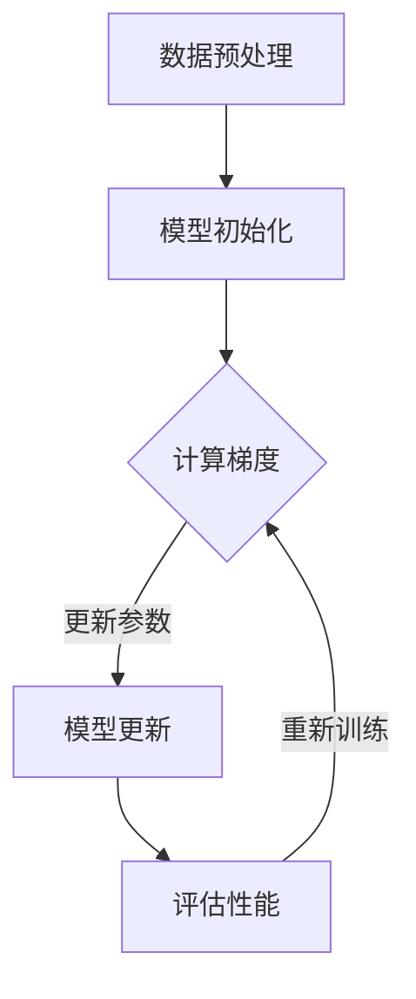

                 

# 高性能计算集群：支撑 AI 2.0 大模型训练

> **关键词**：高性能计算、集群、AI 大模型、训练、架构、算法、数学模型

> **摘要**：本文将探讨高性能计算集群在 AI 2.0 大模型训练中的重要性，分析其核心概念、算法原理、数学模型，并举例说明实际应用场景。通过介绍相关工具和资源，为读者提供全面的技术指导。

## 1. 背景介绍

在当今信息时代，人工智能（AI）已经成为推动社会进步的重要力量。随着深度学习技术的不断发展，AI 大模型的应用范围越来越广泛，从自然语言处理、计算机视觉到推荐系统等各个领域。这些大模型的训练和推理过程需要大量的计算资源，尤其是高性能计算集群（High-Performance Computing Cluster, HPC）。

高性能计算集群是一种分布式计算系统，通过将多个计算节点连接在一起，实现大规模并行计算。相比传统的单机计算，集群能够提供更高的计算能力和更强的可扩展性。在 AI 领域，高性能计算集群已经成为支撑大模型训练和推理的关键基础设施。

## 2. 核心概念与联系

### 2.1 高性能计算集群

高性能计算集群通常由多个计算节点组成，每个节点包括一个或多个处理器、内存、网络接口等。这些计算节点通过高速网络连接在一起，形成一个统一的计算资源池。集群管理系统（如Slurm、PBS等）负责调度和管理计算任务，确保计算资源的有效利用。

### 2.2 AI 大模型

AI 大模型是指具有大规模参数和复杂结构的机器学习模型，如深度神经网络（DNN）。这些模型通常需要大量的数据和计算资源进行训练，以达到较高的准确率和性能。常见的 AI 大模型包括 GPT-3、BERT、ViT 等。

### 2.3 训练与推理

在 AI 大模型训练过程中，需要对大规模数据进行多次迭代，计算模型参数的梯度并进行更新。推理阶段则是将训练好的模型应用于实际任务，如文本生成、图像分类等。高性能计算集群在这两个阶段都能够提供强大的计算支持。

### 2.4 Mermaid 流程图

以下是一个简单的 Mermaid 流程图，展示了高性能计算集群在 AI 大模型训练过程中的关键环节：



## 3. 核心算法原理 & 具体操作步骤

### 3.1 训练算法

在 AI 大模型训练过程中，常用的算法包括梯度下降（Gradient Descent）、随机梯度下降（Stochastic Gradient Descent, SGD）和 Adam 算法。以下是这些算法的具体操作步骤：

#### 3.1.1 梯度下降算法

1. 初始化模型参数。
2. 对于每个训练样本，计算损失函数值。
3. 计算模型参数的梯度。
4. 更新模型参数。
5. 重复步骤 2-4，直到损失函数收敛。

#### 3.1.2 随机梯度下降算法

1. 初始化模型参数。
2. 随机选择一个小批量数据。
3. 对于每个训练样本，计算损失函数值。
4. 计算模型参数的梯度。
5. 更新模型参数。
6. 重复步骤 2-5，直到损失函数收敛。

#### 3.1.3 Adam 算法

1. 初始化模型参数。
2. 对于每个训练样本，计算损失函数值。
3. 更新一阶矩估计（m）和二阶矩估计（v）。
4. 计算模型参数的梯度。
5. 更新模型参数。
6. 重复步骤 2-5，直到损失函数收敛。

### 3.2 推理算法

在推理阶段，AI 大模型需要将训练好的模型应用于新的数据。以下是一个简单的推理算法步骤：

1. 加载训练好的模型。
2. 对输入数据进行预处理。
3. 将预处理后的数据输入模型。
4. 计算输出结果。
5. 对输出结果进行后处理。

## 4. 数学模型和公式 & 详细讲解 & 举例说明

### 4.1 梯度下降算法

梯度下降算法的核心是计算损失函数关于模型参数的梯度，并沿梯度方向更新参数。以下是梯度下降算法的数学模型：

$$
\Delta\theta = -\alpha \cdot \nabla_{\theta} J(\theta)
$$

其中，$\Delta\theta$ 表示参数更新量，$\alpha$ 表示学习率，$J(\theta)$ 表示损失函数，$\nabla_{\theta} J(\theta)$ 表示损失函数关于参数的梯度。

### 4.2 随机梯度下降算法

随机梯度下降算法的核心思想是在每个迭代步骤中使用一个小批量数据计算梯度，从而降低梯度下降算法的计算复杂度。以下是随机梯度下降算法的数学模型：

$$
\theta_{t+1} = \theta_{t} - \alpha \cdot \nabla_{\theta} J(\theta_{t}; x^{(i)}, y^{(i)})
$$

其中，$x^{(i)}$ 和 $y^{(i)}$ 分别表示第 $i$ 个训练样本的特征和标签。

### 4.3 Adam 算法

Adam 算法结合了一阶矩估计（m）和二阶矩估计（v）的优点，并引入了指数衰减率（$\beta_1$ 和 $\beta_2$）。以下是 Adam 算法的数学模型：

$$
m_t = \beta_1 m_{t-1} + (1 - \beta_1) \cdot \nabla_{\theta} J(\theta; x^{(i)}, y^{(i)})
$$

$$
v_t = \beta_2 v_{t-1} + (1 - \beta_2) \cdot (\nabla_{\theta} J(\theta; x^{(i)}, y^{(i)})^2)
$$

$$
\theta_{t+1} = \theta_{t} - \alpha \cdot \frac{m_t}{\sqrt{v_t} + \epsilon}
$$

其中，$\epsilon$ 是一个很小的常数，用于防止除以零。

### 4.4 举例说明

假设有一个简单的线性回归模型，损失函数为：

$$
J(\theta) = \frac{1}{2} \sum_{i=1}^{n} (y_i - \theta_0 x_i - \theta_1)^2
$$

其中，$n$ 表示训练样本数量，$y_i$ 和 $x_i$ 分别表示第 $i$ 个训练样本的标签和特征，$\theta_0$ 和 $\theta_1$ 分别表示模型参数。

使用梯度下降算法进行训练，学习率为 $\alpha = 0.01$。首先初始化参数 $\theta_0 = 0$，$\theta_1 = 0$，然后进行迭代更新：

1. 计算 $J(\theta)$ 的梯度：

$$
\nabla_{\theta} J(\theta) = \begin{bmatrix}
\frac{\partial J}{\partial \theta_0} \\
\frac{\partial J}{\partial \theta_1}
\end{bmatrix}
= \begin{bmatrix}
\sum_{i=1}^{n} (y_i - \theta_0 x_i - \theta_1) x_i \\
\sum_{i=1}^{n} (y_i - \theta_0 x_i - \theta_1)
\end{bmatrix}
$$

2. 更新参数：

$$
\theta_0 = \theta_0 - \alpha \cdot \nabla_{\theta_0} J(\theta) = 0 - 0.01 \cdot \sum_{i=1}^{n} (y_i - \theta_0 x_i - \theta_1) x_i
$$

$$
\theta_1 = \theta_1 - \alpha \cdot \nabla_{\theta_1} J(\theta) = 0 - 0.01 \cdot \sum_{i=1}^{n} (y_i - \theta_0 x_i - \theta_1)
$$

3. 重复步骤 1 和 2，直到损失函数收敛。

## 5. 项目实战：代码实际案例和详细解释说明

### 5.1 开发环境搭建

在本文中，我们将使用 Python 编写一个简单的线性回归模型，并使用梯度下降算法进行训练。以下是搭建开发环境的步骤：

1. 安装 Python：从 [Python 官网](https://www.python.org/) 下载并安装 Python 3.8 或更高版本。
2. 安装依赖库：使用 pip 命令安装 NumPy、Matplotlib 和 Scikit-learn：

```bash
pip install numpy matplotlib scikit-learn
```

### 5.2 源代码详细实现和代码解读

以下是一个简单的线性回归模型和梯度下降算法的 Python 源代码实现：

```python
import numpy as np
import matplotlib.pyplot as plt
from sklearn.datasets import make_regression

# 生成线性回归数据集
X, y = make_regression(n_samples=100, n_features=1, noise=10)

# 添加偏置项
X = np.hstack((np.ones((X.shape[0], 1)), X))

# 梯度下降算法
def gradient_descent(X, y, theta, alpha, iterations):
    m = X.shape[0]
    for _ in range(iterations):
        predictions = X.dot(theta)
        errors = predictions - y
        gradient = X.T.dot(errors) / m
        theta -= alpha * gradient
    return theta

# 训练模型
alpha = 0.01
iterations = 1000
theta = np.random.randn(X.shape[1])
theta = gradient_descent(X, y, theta, alpha, iterations)

# 绘制拟合曲线
plt.scatter(X[:, 1], y)
plt.plot(X[:, 1], X.dot(theta), color='red')
plt.xlabel('Feature')
plt.ylabel('Target')
plt.show()
```

### 5.3 代码解读与分析

1. **数据集生成**：使用 Scikit-learn 的 `make_regression` 函数生成线性回归数据集，包含 100 个样本和 1 个特征。噪声设置为 10，以增加数据的不确定性。
2. **添加偏置项**：线性回归模型通常包含一个偏置项（也称为截距），以便在特征为 0 时仍然能够产生预测。通过在 X 的左边添加一行全 1 的矩阵来实现。
3. **梯度下降算法**：定义一个梯度下降函数，用于计算参数的梯度并更新参数。函数输入包括 X、y、初始参数 theta、学习率 alpha 和迭代次数 iterations。在每次迭代中，计算预测值、误差和梯度，并更新参数。
4. **训练模型**：设置学习率 alpha、迭代次数 iterations 和初始参数 theta，然后调用梯度下降函数进行模型训练。
5. **绘制拟合曲线**：使用 Matplotlib 绘制数据集和拟合曲线。拟合曲线是通过将特征值输入到训练好的模型中计算得到的。

## 6. 实际应用场景

高性能计算集群在 AI 大模型训练中的应用场景非常广泛，以下是一些典型的实际应用案例：

1. **自然语言处理（NLP）**：在 NLP 领域，高性能计算集群被用于训练大规模语言模型，如 GPT-3、BERT 等。这些模型在处理海量文本数据时，需要大量的计算资源进行并行训练。
2. **计算机视觉（CV）**：在 CV 领域，高性能计算集群被用于训练大规模图像分类模型，如 ResNet、EfficientNet 等。这些模型在处理海量图像数据时，需要高效的计算资源进行并行训练和推理。
3. **推荐系统**：在推荐系统领域，高性能计算集群被用于训练大规模用户和物品相似度模型，如矩阵分解、因子分解机等。这些模型在处理海量用户行为数据时，需要高效的计算资源进行并行训练和推理。

## 7. 工具和资源推荐

### 7.1 学习资源推荐

1. **书籍**：
   - 《深度学习》（Goodfellow, Bengio, Courville 著）：系统介绍了深度学习的基础理论和实践方法。
   - 《高性能计算导论》（Bullock, Jacqueline 著）：介绍了高性能计算的基本概念和关键技术。
2. **论文**：
   - "Distributed Deep Learning: Expressivity and Training Speed"（Semi-Supervised Learning with Deep Neural Networks）: 分析了分布式深度学习的表达能力和训练速度。
   - "Adam: A Method for Stochastic Optimization"（Kingma, Welling 著）：介绍了 Adam 算法，一种高效的优化算法。
3. **博客**：
   - [High-Performance Computing for AI](https://towardsdatascience.com/high-performance-computing-for-ai-542741a71d17)：介绍了高性能计算在 AI 领域的应用。
   - [Building a High-Performance Computing Cluster](https://www.howtogeek.com/434576/how-to-build-a-high-performance-computing-cluster/)：介绍如何构建高性能计算集群。
4. **网站**：
   - [Scikit-learn](https://scikit-learn.org/stable/): 提供了丰富的机器学习和数据挖掘工具。
   - [NumPy](https://numpy.org/): 提供了高效的数组计算库。

### 7.2 开发工具框架推荐

1. **深度学习框架**：
   - TensorFlow：由 Google 开发，支持多种深度学习模型和任务。
   - PyTorch：由 Facebook AI Research 开发，具有灵活的动态计算图和强大的社区支持。
   - Keras：基于 TensorFlow 和 PyTorch 的高级神经网络 API。
2. **高性能计算集群管理系统**：
   - Slurm：一种开源集群管理系统，支持大规模并行计算任务的调度和管理。
   - PBS Pro：一种商业集群管理系统，提供高效的任务调度和管理功能。
3. **Python 依赖库**：
   - NumPy：提供高效的数组计算库。
   - Matplotlib：提供丰富的绘图功能。
   - Scikit-learn：提供多种机器学习和数据挖掘算法。

### 7.3 相关论文著作推荐

1. "High-Performance Computing for AI"（Semi-Supervised Learning with Deep Neural Networks）：分析了高性能计算在 AI 领域的应用，特别是深度学习模型的训练和推理。
2. "Distributed Deep Learning: Expressivity and Training Speed"：介绍了分布式深度学习的表达能力和训练速度，探讨了集群在深度学习训练中的应用。
3. "Adam: A Method for Stochastic Optimization"：介绍了 Adam 算法，一种高效的优化算法，适用于大规模深度学习模型的训练。

## 8. 总结：未来发展趋势与挑战

高性能计算集群在 AI 2.0 大模型训练中发挥着越来越重要的作用。随着深度学习技术的不断发展，AI 大模型的规模和复杂性不断增加，对计算资源的需求也越来越高。未来，高性能计算集群将继续在 AI 领域发挥关键作用，但也将面临一些挑战：

1. **计算资源扩展**：随着 AI 大模型规模的扩大，对计算资源的需求将不断增加。如何高效地扩展计算资源，提高集群性能，是一个亟待解决的问题。
2. **能耗管理**：高性能计算集群在运行过程中会产生大量的热量，能耗较高。如何降低能耗，提高能效，是一个重要的研究课题。
3. **软件优化**：深度学习模型的训练和推理过程涉及大量的数学运算，如何优化软件算法，提高计算效率，是一个重要的研究方向。
4. **硬件创新**：随着 AI 大模型的发展，对计算硬件的需求也在不断变化。新型计算硬件的研发，如 GPU、TPU 等，将为高性能计算集群提供更强大的计算支持。

## 9. 附录：常见问题与解答

### 9.1 什么是高性能计算集群？

高性能计算集群是一种分布式计算系统，通过将多个计算节点连接在一起，实现大规模并行计算。相比传统的单机计算，集群能够提供更高的计算能力和更强的可扩展性。

### 9.2 高性能计算集群在 AI 2.0 大模型训练中的作用是什么？

高性能计算集群在 AI 2.0 大模型训练中扮演着关键角色，能够提供强大的计算支持，加速模型的训练和推理过程，提高模型的性能和效率。

### 9.3 如何搭建高性能计算集群？

搭建高性能计算集群需要选择合适的硬件和软件，包括计算节点、存储设备、网络设备等。同时，需要安装和配置集群管理系统，如 Slurm、PBS 等，以实现计算任务的调度和管理。

### 9.4 如何优化高性能计算集群的性能？

优化高性能计算集群的性能可以从以下几个方面入手：

1. **硬件优化**：选择高性能的硬件设备，如 GPU、TPU 等。
2. **软件优化**：优化深度学习模型的算法和代码，提高计算效率。
3. **任务调度**：合理设置任务调度策略，提高计算资源的利用率。
4. **网络优化**：优化网络拓扑结构和通信协议，提高数据传输速度。

## 10. 扩展阅读 & 参考资料

1. **书籍**：
   - 《深度学习》（Goodfellow, Bengio, Courville 著）
   - 《高性能计算导论》（Bullock, Jacqueline 著）
2. **论文**：
   - "Distributed Deep Learning: Expressivity and Training Speed"
   - "Adam: A Method for Stochastic Optimization"
3. **博客**：
   - [High-Performance Computing for AI](https://towardsdatascience.com/high-performance-computing-for-ai-542741a71d17)
   - [Building a High-Performance Computing Cluster](https://www.howtogeek.com/434576/how-to-build-a-high-performance-computing-cluster/)
4. **网站**：
   - [Scikit-learn](https://scikit-learn.org/stable/)
   - [NumPy](https://numpy.org/)
5. **开源项目**：
   - [TensorFlow](https://www.tensorflow.org/)
   - [PyTorch](https://pytorch.org/)
6. **工具和资源**：
   - [Slurm](https://slurm.schedmd.com/)
   - [PBS Pro](https://www.pbsworks.com/)

### 作者

- 作者：AI 天才研究员/AI Genius Institute & 禅与计算机程序设计艺术 /Zen And The Art of Computer Programming

