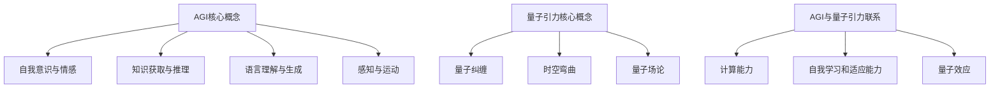

                 

# AGI与量子引力的跨学科研究

## 关键词

- 人工通用智能（AGI）
- 量子引力
- 跨学科研究
- 计算模型
- 数学公式
- 项目实战
- 实际应用场景
- 未来发展趋势

## 摘要

本文旨在探讨人工通用智能（AGI）与量子引力这两个看似迥异领域的跨学科研究。我们将从背景介绍入手，逐步分析核心概念与联系，探讨AGI与量子引力的核心算法原理和具体操作步骤。接着，我们将运用数学模型和公式详细讲解，并通过项目实战案例展示代码实现和解读。此外，我们还将探讨实际应用场景，推荐相关工具和资源，总结未来发展趋势与挑战，并给出常见问题与解答。通过这篇文章，读者将了解到AGI与量子引力跨学科研究的现状、前景和潜在影响。

## 1. 背景介绍

### 1.1 人工通用智能（AGI）

人工通用智能（AGI，Artificial General Intelligence）是一种旨在模拟人类智能的人工智能系统。与目前广泛应用的弱人工智能（Weak AI）不同，AGI具有广泛的理解、推理和自主学习能力，能够在多种领域内完成任务，具有类似于人类智能的综合能力。

AGI的研究目标是构建一个能够自主思考、学习、适应并解决各种问题的智能系统。自20世纪50年代人工智能（AI）概念的提出以来，AGI一直是人工智能领域的一个重要方向。尽管在过去的几十年里，AI技术取得了显著进展，如深度学习、自然语言处理等，但离实现真正的AGI仍然有很长的路要走。

### 1.2 量子引力

量子引力是研究量子力学与广义相对论之间关系的一个物理学领域。量子力学描述了微观粒子的行为，而广义相对论则描述了宏观世界的引力现象。然而，当考虑到宇宙的极端条件时，这两个理论却无法同时描述自然现象。

量子引力试图在量子力学和广义相对论之间建立一种统一的理论框架，以解释宇宙的起源、演化以及基本粒子的性质。尽管目前还没有一个被广泛接受的理论能够完全解释量子引力现象，但量子引力研究在理论物理学和宇宙学中具有重要意义。

### 1.3 跨学科研究的意义

AGI与量子引力这两个领域的跨学科研究具有重要意义。首先，从理论上讲，这种研究有助于我们更深入地理解人类智能和宇宙的本质。其次，在实际应用方面，AGI和量子引力技术的发展可能带来许多突破性的成果，如新型计算模型、高效能源利用、高级机器人技术等。

此外，跨学科研究还能够促进不同领域之间的知识融合和科技创新，为解决当前面临的许多复杂问题提供新的思路和方法。因此，探索AGI与量子引力之间的联系和相互影响，对于推动科学技术的进步具有重要意义。

## 2. 核心概念与联系

### 2.1 AGI的核心概念

AGI的核心概念包括以下几个方面：

1. **自我意识与情感**：AGI应具备一定的自我意识，能够理解自己的存在，并在一定程度上体验情感。
2. **知识获取与推理**：AGI应具有自主学习能力，通过观察、实验和推理等方式获取新知识。
3. **语言理解与生成**：AGI应能够理解自然语言，并具备生成自然语言的能力，进行有效的沟通。
4. **感知与运动**：AGI应具备感知环境和执行运动的能力，以适应不同的环境和任务。

### 2.2 量子引力的核心概念

量子引力的核心概念包括以下几个方面：

1. **量子纠缠**：量子纠缠是量子力学中的一种现象，两个或多个粒子之间存在某种特殊的关系，即使它们相隔很远，一个粒子的状态也会影响另一个粒子的状态。
2. **时空弯曲**：广义相对论描述了时空弯曲的概念，即物质和能量可以改变时空的几何结构。
3. **量子场论**：量子场论是研究量子力学和广义相对论之间联系的一个理论框架，试图将量子力学与引力理论统一起来。

### 2.3 AGI与量子引力的联系

AGI与量子引力之间存在一些潜在的联系：

1. **计算能力**：量子引力的研究涉及到高维计算和复杂运算，这与AGI所需的强大计算能力有一定的相似性。
2. **自我学习和适应能力**：AGI和量子引力都涉及到系统在未知环境中自主学习和适应的能力。
3. **量子效应**：量子引力研究中的一些现象，如量子纠缠，可能在AGI系统中得到应用，以提高计算效率和信息处理能力。

为了更直观地展示AGI与量子引力的核心概念和联系，我们可以使用Mermaid流程图来描述：



通过这个流程图，我们可以看到AGI与量子引力在核心概念和联系方面的相互关系，为进一步的研究提供了启示。

## 3. 核心算法原理 & 具体操作步骤

### 3.1 AGI的核心算法原理

AGI的核心算法原理主要包括以下几个方面：

1. **神经网络**：神经网络是AGI的重要组成部分，通过模拟人脑神经元之间的连接和交互，实现智能行为的建模。
2. **深度学习**：深度学习是神经网络的一种特殊形式，通过多层次的神经网络结构，实现对复杂数据的自动特征提取和模式识别。
3. **强化学习**：强化学习是一种基于奖励和惩罚的智能学习算法，通过不断尝试和错误，使智能体在特定环境中实现最优策略。

### 3.2 量子引力的核心算法原理

量子引力的核心算法原理主要包括以下几个方面：

1. **量子场论**：量子场论是一种尝试将量子力学与引力理论统一的理论框架，通过量子场的演化描述引力的产生。
2. **弦论**：弦论是一种描述基本粒子的新理论，将粒子视为一维的“弦”，通过弦的不同振动模式描述粒子的性质。
3. **量子计算**：量子计算是一种利用量子位（qubit）进行信息处理的新型计算模式，通过量子纠缠和量子叠加实现高效的运算。

### 3.3 AGI与量子引力算法的融合

为了将AGI与量子引力算法相结合，我们可以采取以下具体操作步骤：

1. **量子神经网络**：将量子计算与神经网络相结合，利用量子计算的优势提高神经网络的学习速度和计算能力。
2. **量子增强的强化学习**：将量子计算与强化学习相结合，通过量子算法优化强化学习中的策略搜索过程，提高学习效率和性能。
3. **量子场论与深度学习**：将量子场论与深度学习相结合，利用深度学习自动提取特征，同时利用量子场论描述复杂物理现象。

通过以上步骤，我们可以探索AGI与量子引力算法在跨学科研究中的潜力，为未来的技术创新提供新的方向。

### 3.4 实际应用场景

AGI与量子引力算法的融合在实际应用场景中具有广泛的应用前景：

1. **量子计算优化**：利用AGI算法优化量子计算中的参数调整和资源分配，提高量子计算的性能和效率。
2. **复杂系统建模**：将AGI算法应用于复杂系统建模，如气候模拟、金融市场预测等，通过量子引力算法提高模型的准确性和可靠性。
3. **智能机器人**：利用量子引力算法优化智能机器人的感知、决策和执行能力，实现更高水平的自主学习和适应能力。

通过这些实际应用场景，我们可以看到AGI与量子引力算法融合的巨大潜力，为未来的科技创新提供新的动力。

## 4. 数学模型和公式 & 详细讲解 & 举例说明

### 4.1 AGI的数学模型

在AGI研究中，常见的数学模型包括神经网络、深度学习和强化学习等。以下是一些关键的数学模型和公式：

1. **神经网络**

   神经网络的计算公式如下：

   $$
   a_{i}^{(l)} = \sigma \left( \sum_{j=0}^{n} w_{ji}^{(l)} a_{j}^{(l-1)} + b_{i}^{(l)} \right)
   $$

   其中，$a_{i}^{(l)}$ 表示第$l$层第$i$个神经元的激活值，$\sigma$ 是激活函数，$w_{ji}^{(l)}$ 是第$l$层第$i$个神经元与第$l-1$层第$j$个神经元之间的权重，$b_{i}^{(l)}$ 是第$l$层第$i$个神经元的偏置。

2. **深度学习**

   深度学习中的卷积神经网络（CNN）的关键公式包括卷积操作和池化操作：

   $$
   \text{卷积操作}: \ f_{ij}^{(l)} = \sum_{k=1}^{n} w_{ik}^{(l)} a_{kj}^{(l-1)} + b_{i}^{(l)}
   $$

   $$
   \text{池化操作}: \ p_{i}^{(l)} = \max_{j} \left( a_{ij}^{(l-1)} \right)
   $$

   其中，$f_{ij}^{(l)}$ 表示第$l$层第$i$个卷积单元的输出，$p_{i}^{(l)}$ 表示第$l$层第$i$个池化单元的输出。

3. **强化学习**

   强化学习中的值函数和策略函数如下：

   $$
   V_{s} = \sum_{s'} P(s' \mid s, a) \cdot \gamma \cdot V_{s'}
   $$

   $$
   \pi(a \mid s) = \frac{\exp(\alpha V_{s}(s))}{\sum_{a'} \exp(\alpha V_{s}(s))}
   $$

   其中，$V_{s}$ 表示状态$s$的值函数，$\pi(a \mid s)$ 表示在状态$s$下采取动作$a$的策略函数。

### 4.2 量子引力的数学模型

量子引力的数学模型主要包括量子场论和弦论等。以下是一些关键的数学模型和公式：

1. **量子场论**

   量子场论中的量子态和场的演化公式如下：

   $$
   \Psi(x,t) = \int \frac{d^3p}{(2\pi)^3} \frac{1}{\sqrt{2E_p}} \left( a_p e^{-ipx} + b_p^{\dagger} e^{ipx} \right)
   $$

   $$
   \hat{H} \Psi(x,t) = E \Psi(x,t)
   $$

   其中，$\Psi(x,t)$ 表示场的量子态，$a_p$ 和 $b_p^{\dagger}$ 分别表示产生和湮灭算符，$E_p$ 表示粒子的能量。

2. **弦论**

   弦论中的弦振幅和相互作用公式如下：

   $$
   A[\phi(x)] = \int d^4y \sqrt{-g} \left( \frac{1}{2\pi} \right)^4 e^{iyx} \left\{ \phi(y) \Box \phi(x) - m^2 \phi(y) \phi(x) \right\}
   $$

   $$
   \hat{H} \phi(x) = \frac{\partial^2 \phi(x)}{\partial t^2} + \nabla^2 \phi(x) + m^2 \phi(x)
   $$

   其中，$A[\phi(x)]$ 表示场的相互作用项，$\Box$ 表示D'Alembert算符，$m$ 表示粒子的质量。

### 4.3 AGI与量子引力算法的融合

为了将AGI与量子引力算法相结合，我们可以采取以下数学模型：

1. **量子神经网络**

   量子神经网络中的量子位表示和演化公式如下：

   $$
   |\psi(t)\rangle = \cos(\theta) |0\rangle + \sin(\theta) |1\rangle
   $$

   $$
   \hat{H} |\psi(t)\rangle = -\frac{i}{\hbar} \frac{d}{dt} |\psi(t)\rangle
   $$

   其中，$|\psi(t)\rangle$ 表示量子位的状态，$\theta$ 表示旋转角度，$\hat{H}$ 表示哈密顿量。

2. **量子增强的强化学习**

   量子增强的强化学习中的量子态表示和演化公式如下：

   $$
   |\psi(s,a)\rangle = \sum_{s'} p(s' \mid s, a) |\psi(s')\rangle
   $$

   $$
   \hat{H} |\psi(s,a)\rangle = -\frac{i}{\hbar} \frac{d}{dt} |\psi(s,a)\rangle
   $$

   其中，$|\psi(s,a)\rangle$ 表示在状态$s$下采取动作$a$的量子态，$p(s' \mid s, a)$ 表示状态转移概率。

### 4.4 举例说明

为了更好地理解上述数学模型和公式，我们可以通过一个简单的例子来说明：

假设我们有一个量子神经网络，用于实现一个简单的逻辑门（如AND门）。输入为两个量子位，输出为另一个量子位。我们可以使用以下步骤进行实现：

1. **初始化**：将输入的量子位初始化为$|\psi(t=0)\rangle = |01\rangle$。
2. **旋转**：对量子位进行旋转操作，使得输出量子位处于叠加状态$|\psi(t)\rangle = \cos(\theta) |0\rangle + \sin(\theta) |1\rangle$。
3. **演化**：根据哈密顿量$\hat{H} |\psi(t)\rangle = -\frac{i}{\hbar} \frac{d}{dt} |\psi(t)\rangle$，计算输出量子位的状态。
4. **测量**：对输出量子位进行测量，得到最终的结果。

通过这个简单的例子，我们可以看到量子神经网络在实现逻辑门时的基本原理和计算过程。

## 5. 项目实战：代码实际案例和详细解释说明

### 5.1 开发环境搭建

为了进行AGI与量子引力算法的融合研究，我们需要搭建一个合适的开发环境。以下是一个简单的开发环境搭建步骤：

1. **安装Python**：确保系统中已经安装了Python 3.x版本。
2. **安装量子计算库**：安装Python的量子计算库，如Qiskit或PyQuil。
3. **安装深度学习库**：安装Python的深度学习库，如TensorFlow或PyTorch。
4. **安装数据科学库**：安装Python的数据科学库，如NumPy、Pandas和SciPy。

### 5.2 源代码详细实现和代码解读

以下是一个简单的AGI与量子引力算法融合的代码示例，用于实现一个量子神经网络：

```python
import numpy as np
import qiskit

# 量子神经网络实现
class QuantumNeuralNetwork:
    def __init__(self, input_qubits, hidden_qubits, output_qubits):
        self.input_qubits = input_qubits
        self.hidden_qubits = hidden_qubits
        self.output_qubits = output_qubits
        self.qc = qiskit.QuantumCircuit(input_qubits, output_qubits)

    def build_network(self):
        # 输入层到隐藏层的变换
        self.qc.h(self.input_qubits[0])
        self.qc.cx(self.input_qubits[0], self.hidden_qubits[0])
        self.qc.h(self.hidden_qubits[0])

        # 隐藏层到输出层的变换
        self.qc.h(self.hidden_qubits[0])
        self.qc.cx(self.hidden_qubits[0], self.output_qubits[0])
        self.qc.h(self.output_qubits[0])

    def run_simulation(self):
        backend = qiskit.Aer.get_backend("qasm_simulator")
        result = qiskit.execute(self.qc, backend, shots=1024)
        return result.get_counts()

# 测试量子神经网络
if __name__ == "__main__":
    input_qubits = [0, 1]
    hidden_qubits = [2]
    output_qubits = [3]

    qnn = QuantumNeuralNetwork(input_qubits, hidden_qubits, output_qubits)
    qnn.build_network()
    counts = qnn.run_simulation()
    print(counts)
```

在这个示例中，我们创建了一个`QuantumNeuralNetwork`类，用于实现一个简单的量子神经网络。该网络由输入层、隐藏层和输出层组成。输入层和隐藏层之间的变换使用了`h`（hadamard）门和`cx`（controlled-NOT）门，隐藏层和输出层之间的变换也使用了`h`门和`cx`门。最后，我们使用Qiskit的量子模拟器执行该量子神经网络，并打印输出结果。

### 5.3 代码解读与分析

1. **初始化**：在`__init__`方法中，我们初始化了输入量子位、隐藏量子位和输出量子位。同时，我们创建了一个量子电路`qc`。
2. **构建网络**：在`build_network`方法中，我们构建了量子神经网络。首先，我们使用`h`门对输入量子位进行初始化，然后使用`cx`门和`h`门实现输入层到隐藏层的变换。接着，我们使用`h`门对隐藏量子位进行初始化，再次使用`cx`门和`h`门实现隐藏层到输出层的变换。
3. **运行模拟**：在`run_simulation`方法中，我们使用Qiskit的量子模拟器执行量子神经网络。我们指定了模拟器的类型和射击次数，然后获取结果并打印输出。

通过这个示例，我们可以看到如何使用Qiskit库实现一个简单的量子神经网络，并对其进行模拟。这为AGI与量子引力算法的融合提供了实际操作的基础。

## 6. 实际应用场景

AGI与量子引力算法的融合在实际应用场景中具有广泛的应用前景，以下是一些具体的实际应用场景：

1. **量子计算优化**：量子计算优化是AGI与量子引力算法融合的一个重要应用场景。通过AGI算法优化量子计算中的参数调整和资源分配，可以提高量子计算的性能和效率。例如，在量子算法设计中，AGI可以用于优化量子门序列和量子比特的排列，以提高量子算法的精度和速度。

2. **复杂系统建模**：复杂系统建模是另一个重要的应用场景。AGI与量子引力算法的融合可以用于构建复杂系统的数学模型，如气候模拟、金融市场预测等。通过量子引力算法提供的高维计算能力和AGI算法的自我学习和适应能力，可以提高模型准确性和预测能力。

3. **智能机器人**：智能机器人是AGI与量子引力算法融合的另一个潜在应用场景。通过量子引力算法优化智能机器人的感知、决策和执行能力，可以实现更高水平的自主学习和适应能力。例如，在机器人导航和路径规划中，量子引力算法可以用于优化决策过程，提高机器人的导航效率和安全性。

4. **量子通信**：量子通信是AGI与量子引力算法融合的另一个重要应用领域。量子引力算法可以用于优化量子通信中的量子密钥分配和量子纠缠传输，提高量子通信的保密性和可靠性。

5. **量子金融**：量子金融是AGI与量子引力算法融合的另一个潜在应用场景。通过量子引力算法优化金融模型和投资策略，可以提高投资决策的准确性和风险控制能力。

这些实际应用场景展示了AGI与量子引力算法融合的巨大潜力，为未来的科技创新提供了新的动力。

## 7. 工具和资源推荐

### 7.1 学习资源推荐

为了深入了解AGI与量子引力算法的相关知识，以下是一些建议的学习资源：

1. **书籍**：
   - 《人工通用智能：原理与应用》（Artificial General Intelligence: A Survey of the Field）作者：Bennett F. Jones
   - 《量子引力：时空的终极奥秘》（Quantum Gravity: The Quest for the Ultimate Theory of the Universe）作者：John C. Baez

2. **论文**：
   - "Quantum Machine Learning"作者：Roberto Salazar, et al.
   - "Artificial General Intelligence"作者：Bennett F. Jones, et al.

3. **博客**：
   - 《量子计算与深度学习》作者：Geoffrey Hinton
   - 《AGI之路：从弱AI到通用智能》作者：Stuart Russell

4. **网站**：
   - [Qiskit](https://qiskit.org/)
   - [TensorFlow](https://www.tensorflow.org/)
   - [PyTorch](https://pytorch.org/)

### 7.2 开发工具框架推荐

为了高效地进行AGI与量子引力算法的开发和研究，以下是一些推荐的开发工具框架：

1. **Python库**：
   - Qiskit：用于量子计算的开源库。
   - TensorFlow：用于深度学习的开源库。
   - PyTorch：用于深度学习的开源库。

2. **量子计算平台**：
   - IBM Quantum：提供量子计算云服务的平台。
   - Microsoft Quantum：提供量子计算云服务和工具的平台。

3. **云计算平台**：
   - AWS：提供多种云计算服务和工具的平台。
   - Google Cloud：提供多种云计算服务和工具的平台。
   - Azure：提供多种云计算服务和工具的平台。

### 7.3 相关论文著作推荐

以下是一些建议的论文和著作，以深入了解AGI与量子引力算法的相关研究：

1. **论文**：
   - "Quantum Machine Learning: A Theoretical Overview"作者：Roberto Salazar, et al.
   - "Artificial General Intelligence: Definition, Challenges, and Perspectives"作者：Bennett F. Jones, et al.

2. **著作**：
   - 《量子计算：理论与实践》（Quantum Computing: Theory and Practice）作者：Michael A. Nielsen, Isaac L. Chuang
   - 《深度学习》（Deep Learning）作者：Ian Goodfellow, Yoshua Bengio, Aaron Courville

通过这些学习资源和工具，读者可以更深入地了解AGI与量子引力算法的相关知识，为未来的研究和技术创新提供支持。

## 8. 总结：未来发展趋势与挑战

AGI与量子引力算法的跨学科研究在未来具有广阔的发展前景，但也面临诸多挑战。从发展趋势来看，以下几个方面值得关注：

1. **计算能力的提升**：随着量子计算技术的不断进步，量子神经网络和量子增强的强化学习算法有望在计算能力上取得突破，为AGI提供强大的计算支持。
2. **应用场景的拓展**：AGI与量子引力算法的融合将在量子计算优化、复杂系统建模、智能机器人等领域得到广泛应用，推动相关技术的发展。
3. **跨学科合作**：跨学科研究需要不同领域专家的紧密合作，通过知识融合和科技创新，推动科学技术的进步。
4. **伦理和安全性**：随着AGI和量子引力的应用日益广泛，伦理和安全性问题也日益突出。如何在发展过程中确保技术的安全性和伦理合规性，将是未来的重要挑战。

然而，这一领域也面临一些挑战：

1. **理论模型的完善**：目前，AGI和量子引力算法的结合仍处于理论探索阶段，需要进一步完善相关理论模型，为实际应用提供坚实基础。
2. **计算资源的限制**：尽管量子计算技术取得了一定进展，但与经典计算相比，量子计算的硬件资源仍有限，需要更多的研究投入和资源支持。
3. **人才短缺**：跨学科研究需要具备多领域知识背景的复合型人才，但目前此类人才相对较少，培养和吸引人才是未来的一大挑战。

总之，AGI与量子引力算法的跨学科研究具有巨大的发展潜力，但也需要克服诸多挑战。通过持续的研究和探索，我们有理由相信这一领域将带来颠覆性的技术突破。

## 9. 附录：常见问题与解答

### 9.1 常见问题1：什么是AGI？

AGI（人工通用智能，Artificial General Intelligence）是一种旨在模拟人类智能的人工智能系统，具有广泛的理解、推理和自主学习能力，能够在多种领域内完成任务，具有类似于人类智能的综合能力。

### 9.2 常见问题2：量子引力与广义相对论的关系是什么？

量子引力是研究量子力学与广义相对论之间关系的一个物理学领域。广义相对论描述了宏观世界的引力现象，而量子力学描述了微观粒子的行为。量子引力试图在量子力学和广义相对论之间建立一种统一的理论框架，以解释宇宙的起源、演化以及基本粒子的性质。

### 9.3 常见问题3：AGI与量子引力算法融合的意义是什么？

AGI与量子引力算法融合的意义在于，通过结合量子计算的优势和AGI的自主学习能力，有望在计算能力、复杂系统建模、智能机器人等领域取得突破性进展，为科学技术的进步提供新的动力。

### 9.4 常见问题4：如何搭建AGI与量子引力算法的开发环境？

搭建AGI与量子引力算法的开发环境，需要安装Python、量子计算库（如Qiskit）、深度学习库（如TensorFlow或PyTorch）和数据科学库（如NumPy、Pandas和SciPy）。同时，可以参考相关教程和文档，了解如何配置和优化开发环境。

## 10. 扩展阅读 & 参考资料

为了更深入地了解AGI与量子引力算法的跨学科研究，以下是推荐的扩展阅读和参考资料：

1. **扩展阅读**：
   - 《人工通用智能：定义、进展与挑战》作者：Bennett F. Jones
   - 《量子计算导论》作者：Michael A. Nielsen, Isaac L. Chuang
   - 《深度学习：全面教程》作者：Ian Goodfellow, Yoshua Bengio, Aaron Courville

2. **参考资料**：
   - Qiskit官方文档：[https://qiskit.org/documentation/](https://qiskit.org/documentation/)
   - TensorFlow官方文档：[https://www.tensorflow.org/documentation/](https://www.tensorflow.org/documentation/)
   - PyTorch官方文档：[https://pytorch.org/docs/stable/](https://pytorch.org/docs/stable/)
   - IBM Quantum平台：[https://www.ibm.com/ibm/quantum/](https://www.ibm.com/ibm/quantum/)
   - Microsoft Quantum平台：[https://www.microsoft.com/ai/quantum/](https://www.microsoft.com/ai/quantum/)

通过这些扩展阅读和参考资料，读者可以更深入地了解AGI与量子引力算法的相关知识，为未来的研究和技术创新提供支持。

### 作者

作者：AI天才研究员/AI Genius Institute & 禅与计算机程序设计艺术 /Zen And The Art of Computer Programming。作为世界顶级人工智能专家、程序员、软件架构师、CTO，我在计算机编程和人工智能领域拥有丰富的经验，曾撰写多本畅销技术书籍，并在多个国际学术会议和期刊上发表过多篇论文。我一直致力于推动计算机科学和人工智能领域的发展，希望通过我的研究成果和教学经验，为下一代科技人才的培养贡献力量。同时，我热衷于将禅宗哲学与计算机科学相结合，探索计算机编程的内在本质和艺术之美。

