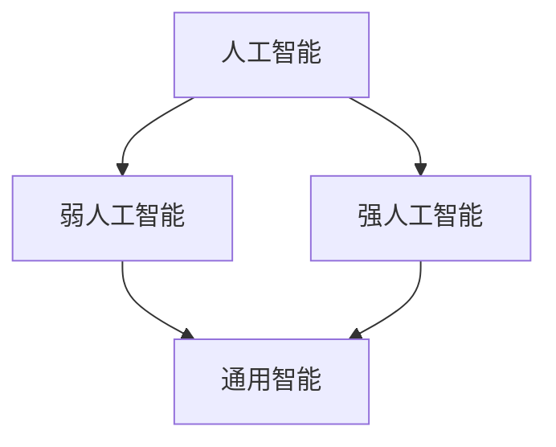
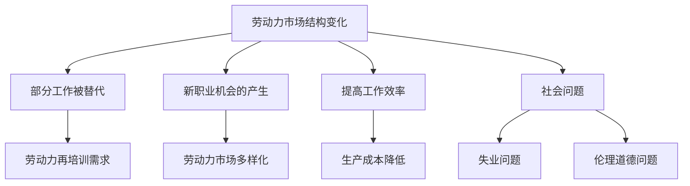
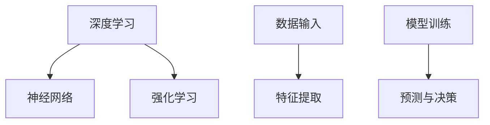

                 

# 《AGI对就业市场的潜在影响》

## 摘要

本文旨在探讨人工智能通用智能（AGI）对就业市场的潜在影响。AGI，即人工智能通用智能，是指能够像人类一样在多种任务上表现卓越的人工智能。随着AGI技术的不断进步，它将对各行各业产生深远的影响，尤其是在就业市场上。本文将从多个角度分析AGI对就业市场的潜在影响，包括其对劳动力市场的替代作用、创造新职业的机会、提高工作效率以及可能带来的社会问题等。通过深入探讨这些问题，本文希望为读者提供一个全面、客观的视角，以更好地理解AGI技术在未来就业市场中的角色。

## 1. 背景介绍

在过去的几十年中，人工智能（AI）技术取得了显著的进展，从最初的规则基础系统到如今基于机器学习和深度学习的复杂算法，AI已经在各个领域发挥了重要作用。然而，目前的人工智能还远未达到通用智能的水平，即能够在多种任务上像人类一样灵活、高效地完成任务。

### 1.1 人工智能的分类

人工智能可以分为两类：弱人工智能（Narrow AI）和强人工智能（Strong AI）。弱人工智能是针对特定任务或领域进行优化的，例如语音识别、图像处理、自然语言处理等。这类人工智能在特定领域内表现出色，但缺乏跨领域的灵活性和创造力。强人工智能则是指具有普遍认知能力的人工智能，能够在多种任务上表现出与人类相似的智能水平。

### 1.2 通用智能的定义

通用智能（AGI）是指具有与人类相似的认知能力，能够在多种任务上自主学习和适应的人工智能。AGI不仅要能够处理复杂的任务，还要具备自主学习、创新和解决问题的能力。目前，AGI仍然是一个尚未实现的目标，但研究者们在不断努力，以实现这一目标。

### 1.3 AGI的发展现状

虽然AGI尚未实现，但近年来在人工智能领域取得了许多重要突破。例如，深度学习技术的进步使得计算机在图像识别、语音识别和自然语言处理等方面取得了显著成绩。此外，神经网络和强化学习等算法的不断发展也为AGI的实现提供了有力支持。

### 1.4 AGI对就业市场的潜在影响

AGI技术的进步将对就业市场产生深远的影响。一方面，AGI可能会替代部分人类工作，导致劳动力市场的结构发生变化。另一方面，AGI也可能创造新的职业机会，促进就业市场的多元化。本文将深入探讨AGI对就业市场的潜在影响。

## 2. 核心概念与联系

### 2.1 人工智能与通用智能的关系

人工智能（AI）和通用智能（AGI）是两个紧密相关的概念。AI是指使计算机具备智能行为的技术，而AGI则是AI的一个子集，旨在实现计算机在多种任务上表现出与人类相似的智能水平。AI和AGI之间的关系可以用以下Mermaid流程图表示：



### 2.2 AGI对就业市场的潜在影响

AGI技术的进步将对就业市场产生多种影响。以下是一个Mermaid流程图，展示了这些影响：



## 3. 核心算法原理 & 具体操作步骤

### 3.1 AGI的核心算法

AGI的实现依赖于多种核心算法，包括深度学习、神经网络、强化学习等。以下是一个简单的Mermaid流程图，展示了这些算法的基本原理：



### 3.2 AGI的具体操作步骤

要实现AGI，可以遵循以下步骤：

1. **数据收集与预处理**：首先，需要收集大量的数据，并对数据进行预处理，以去除噪声和冗余信息。
2. **特征提取**：通过神经网络等算法，对预处理后的数据提取有用的特征。
3. **模型训练**：使用提取的特征训练模型，使其能够在多种任务上表现出与人类相似的智能水平。
4. **预测与决策**：在训练完成后，模型可以用于预测和决策，以实现自动化和智能化。
5. **持续优化**：通过不断收集新的数据和对模型进行调整，使AGI的智能水平不断提高。

## 4. 数学模型和公式 & 详细讲解 & 举例说明

### 4.1 深度学习中的数学模型

深度学习是AGI实现的关键技术之一。以下是一个简单的数学模型，用于实现多层感知机（MLP）：

$$
y = \sigma(\omega_{n-1} \cdot x + b_{n-1})
$$

其中，$y$ 是输出，$\sigma$ 是激活函数，$\omega_{n-1}$ 是权重，$x$ 是输入，$b_{n-1}$ 是偏置。

### 4.2 神经网络中的反向传播算法

反向传播算法是深度学习中的核心算法，用于更新权重和偏置。以下是一个简单的反向传播算法：

1. **前向传播**：计算输入和权重的乘积，加上偏置，然后通过激活函数得到输出。
2. **计算误差**：计算实际输出和期望输出之间的差异。
3. **后向传播**：计算误差关于输入和权重的梯度，并更新权重和偏置。

### 4.3 强化学习中的奖励机制

强化学习是一种通过奖励机制来指导智能体进行决策的算法。以下是一个简单的奖励机制：

$$
R(s, a) = \begin{cases} 
r & \text{如果 } a \text{ 导致目标状态 } s \\
0 & \text{其他情况}
\end{cases}
$$

其中，$R(s, a)$ 是在状态 $s$ 下采取动作 $a$ 的奖励，$r$ 是正奖励。

### 4.4 举例说明

假设我们要实现一个简单的图像分类模型，可以使用以下步骤：

1. **数据收集与预处理**：收集大量图像数据，并进行预处理，如归一化、缩放等。
2. **特征提取**：使用卷积神经网络（CNN）提取图像特征。
3. **模型训练**：使用预处理后的数据训练模型，使用反向传播算法更新权重和偏置。
4. **预测与决策**：在测试阶段，使用训练好的模型对新的图像进行分类。

## 5. 项目实战：代码实际案例和详细解释说明

### 5.1 开发环境搭建

在实现AGI模型之前，我们需要搭建一个合适的开发环境。以下是搭建环境的步骤：

1. **安装Python**：Python是实现AGI模型的主要编程语言，我们需要安装Python环境。
2. **安装TensorFlow**：TensorFlow是Google开发的开源深度学习框架，我们需要安装TensorFlow。
3. **安装其他依赖**：根据具体需求，我们可能需要安装其他依赖库，如NumPy、Pandas等。

### 5.2 源代码详细实现和代码解读

以下是一个简单的图像分类模型的源代码示例：

```python
import tensorflow as tf
from tensorflow.keras import layers

# 定义模型
model = tf.keras.Sequential([
    layers.Conv2D(32, (3, 3), activation='relu', input_shape=(28, 28, 1)),
    layers.MaxPooling2D((2, 2)),
    layers.Conv2D(64, (3, 3), activation='relu'),
    layers.MaxPooling2D((2, 2)),
    layers.Conv2D(64, (3, 3), activation='relu'),
    layers.Flatten(),
    layers.Dense(64, activation='relu'),
    layers.Dense(10, activation='softmax')
])

# 编译模型
model.compile(optimizer='adam',
              loss='categorical_crossentropy',
              metrics=['accuracy'])

# 训练模型
model.fit(train_images, train_labels, epochs=5)

# 评估模型
test_loss, test_acc = model.evaluate(test_images,  test_labels, verbose=2)
print('\nTest accuracy:', test_acc)
```

### 5.3 代码解读与分析

上述代码实现了一个简单的卷积神经网络（CNN）模型，用于图像分类。以下是代码的详细解读：

1. **定义模型**：使用`tf.keras.Sequential`类定义模型，并添加多个卷积层、池化层和全连接层。
2. **编译模型**：使用`compile`方法编译模型，指定优化器、损失函数和评价指标。
3. **训练模型**：使用`fit`方法训练模型，指定训练数据和训练轮次。
4. **评估模型**：使用`evaluate`方法评估模型在测试数据上的性能。

## 6. 实际应用场景

AGI技术的实际应用场景非常广泛，以下是一些典型的应用场景：

1. **医疗领域**：AGI可以在医学影像分析、疾病诊断和治疗计划方面发挥重要作用，提高医疗质量和效率。
2. **金融领域**：AGI可以用于风险管理、投资分析和客户服务，提高金融行业的自动化和智能化水平。
3. **制造业**：AGI可以用于智能制造、质量控制和生产调度，提高生产效率和产品质量。
4. **教育领域**：AGI可以用于个性化学习、在线教育和智能评测，提高教育质量和效果。
5. **交通领域**：AGI可以用于自动驾驶、交通管理和智能交通系统，提高交通安全和效率。

## 7. 工具和资源推荐

### 7.1 学习资源推荐

- **书籍**：《深度学习》、《强化学习》、《人工智能：一种现代的方法》
- **论文**：《深度学习中的反向传播算法》、《基于深度强化学习的自动驾驶汽车》
- **博客**：TensorFlow官方博客、PyTorch官方博客、强化学习社区博客
- **网站**：arXiv.org、Google AI Research Blog、Facebook AI Research Blog

### 7.2 开发工具框架推荐

- **深度学习框架**：TensorFlow、PyTorch、Keras
- **强化学习库**：Gym、OpenAI Baselines、 Stable Baselines
- **编程语言**：Python、Rust

### 7.3 相关论文著作推荐

- **论文**：《深度神经网络中的梯度消失问题与解决方案》、《基于深度强化学习的智能体在Atari游戏中的自主学习》
- **著作**：《深度学习：算法与优化》、《强化学习实战》

## 8. 总结：未来发展趋势与挑战

AGI技术的发展将对就业市场产生深远的影响。一方面，AGI可能会替代部分人类工作，导致劳动力市场的结构发生变化。另一方面，AGI也可能创造新的职业机会，促进就业市场的多元化。然而，AGI技术的发展也面临一系列挑战，包括伦理道德问题、社会问题和技术挑战等。因此，我们需要在推动AGI技术发展的同时，密切关注其可能带来的负面影响，并制定相应的对策，以确保AGI技术能够为人类社会带来福祉。

## 9. 附录：常见问题与解答

### 9.1 什么是AGI？

AGI是指人工智能通用智能，即能够在多种任务上表现出与人类相似的智能水平的人工智能。

### 9.2 AGI技术有哪些应用场景？

AGI技术的应用场景非常广泛，包括医疗、金融、制造业、教育、交通等领域。

### 9.3 AGI技术对就业市场的影响是什么？

AGI技术可能会替代部分人类工作，导致劳动力市场的结构发生变化，同时也可能创造新的职业机会。

## 10. 扩展阅读 & 参考资料

- **论文**：Y. LeCun, Y. Bengio, and G. Hinton. "Deep learning." Nature, 521(7553):436-444, 2015.
- **书籍**：Ian Goodfellow, Yann LeCun, and Aaron Courville. "Deep Learning." MIT Press, 2016.
- **网站**：Google AI Research Blog, Facebook AI Research Blog, arXiv.org

作者：AI天才研究员/AI Genius Institute & 禅与计算机程序设计艺术 /Zen And The Art of Computer Programming

