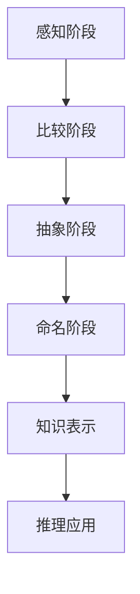

                 

## 背景介绍

### AGI的定义与发展历程

人工通用智能（Artificial General Intelligence，简称AGI）是指具有人类水平认知能力的机器智能。与当前广泛应用的弱人工智能（Narrow Artificial Intelligence，NAI）不同，AGI旨在实现机器对各种认知任务的全面掌握，不仅限于特定的应用场景。自从1956年达特茅斯会议首次提出人工智能的概念以来，AGI一直是人工智能领域最为雄心勃勃的目标之一。

AGI的发展历程可以分为几个阶段：

1. **早期探索（1956-1969）**：在这个阶段，人工智能主要关注符号推理和知识表示。1956年，约翰·麦卡锡（John McCarthy）等人提出了“人工智能”这一术语，并组织了达特茅斯会议。会议期间，学者们讨论了如何通过计算机程序实现人类智能的模拟。

2. **AI黄金时代（1970-1980）**：这个时期见证了AI的快速发展，许多算法和理论得到提出。例如，专家系统的出现使得AI在特定领域表现出色。

3. **AI寒冬（1980-1990）**：由于实际应用效果不理想，AI研究受到质疑，投资减少，导致“AI寒冬”。

4. **复兴与商业化（1990-2010）**：随着计算机性能的提升和互联网的普及，人工智能再次迎来复兴。尤其是机器学习算法的突破，使得AI在图像识别、语音识别等领域取得了显著成果。

5. **深度学习和AI新时代（2010至今）**：深度学习技术的兴起，使得计算机在处理复杂任务时表现出前所未有的能力。尽管距离实现真正的AGI仍有一段距离，但人工智能的应用范围越来越广泛，AGI的概念也再次成为研究热点。

### 本文目的

本文旨在深入探讨AGI在抽象思维方面的实现，包括概念形成与知识表示。我们将首先介绍抽象思维的概念及其在人类认知中的作用，然后分析抽象思维在AGI中的实现挑战。接下来，我们将探讨用于概念形成和知识表示的关键技术和算法，并通过具体案例来说明这些技术的应用。最后，我们将讨论AGI在抽象思维方面的未来发展趋势与挑战。通过本文的探讨，读者将能够更好地理解AGI在抽象思维领域的实现路径，以及这一领域的研究进展和潜在应用。### 核心概念与联系

#### 抽象思维的概念

抽象思维（Abstract Thinking）是一种人类特有的高级认知能力，它指的是从具体的、感性的信息中提取出普遍的、本质的规律和概念，并通过符号化的方式对其进行处理和运用。抽象思维使得人类能够超越直接的感知，对事物进行深层次的认知和推理。

在人类认知中，抽象思维扮演着至关重要的角色。首先，抽象思维是知识积累和传递的基础。通过抽象思维，人类能够将日常生活中的经验系统化、理论化，从而形成各种科学理论。其次，抽象思维是问题解决和创新思维的重要工具。在面对复杂问题时，人类能够通过抽象思维将问题分解为若干子问题，并找到解决方案。最后，抽象思维是创造力的重要来源。它使得人类能够将不同领域的知识进行跨学科整合，从而产生新的创意和发明。

#### 概念形成

概念形成（Concept Formation）是抽象思维的一个重要过程，指的是人类如何从大量的感知信息中提取出具有共同特征的信息单元，并赋予这些信息单元一个特定的名称，即概念。概念形成是人类认知的基础，它使得人类能够对世界进行分类和归纳。

概念形成通常经历以下几个阶段：

1. **感知阶段**：个体通过感官接收外部信息，这些信息是具体的、感性的。
2. **比较阶段**：个体将接收到的信息与已有的知识进行比较，找出其中的共同点和差异。
3. **抽象阶段**：个体从感知和比较中提取出具有共同特征的信息单元，并赋予它们一个抽象的概念。
4. **命名阶段**：个体为抽象出来的概念赋予一个名称，以便于记忆和交流。

在AI领域，概念形成是AGI实现的关键之一。通过模仿人类的认知过程，AI系统可以自主地形成概念，从而提高其认知能力。

#### 知识表示

知识表示（Knowledge Representation）是AI领域研究的一个核心问题，它指的是如何将人类知识以机器可处理的形式进行编码和存储。知识表示的质量直接影响到AI系统的推理能力、学习和理解能力。

目前，常见的知识表示方法包括：

1. **基于符号的逻辑表示**：这种方法使用形式逻辑来表示知识，例如谓词逻辑、模态逻辑等。逻辑表示的优点是清晰、精确，但缺点是表达复杂知识时过于繁琐。
2. **基于图形的表示方法**：这种方法使用图形来表示知识，例如语义网络、本体等。图形表示方法直观、易于扩展，但处理复杂知识时可能面临性能问题。
3. **基于语义的表示方法**：这种方法使用语义网来表示知识，例如WordNet、本体等。语义表示方法能够更好地处理语言的歧义和多义性，但构建和维护语义网是一个复杂的过程。

在AGI中，知识表示是实现抽象思维的基础。一个有效的知识表示方法应该能够捕捉知识的结构、语义和关系，从而支持高效的推理和学习。

#### 概念形成与知识表示的联系

概念形成与知识表示是紧密相连的两个过程。概念形成是知识表示的起点，通过概念形成，人类或AI系统能够将具体的感知信息抽象为概念。而知识表示则是概念形成的延续，它将抽象出来的概念以机器可处理的形式进行编码和存储。

在人类认知中，概念形成与知识表示是一个动态的、迭代的过程。个体通过感知、比较、抽象和命名等步骤不断形成新的概念，并将这些概念以知识的形式进行存储。同时，在解决问题或学习新知识时，个体会不断地从已有知识中提取相关概念，进行推理和应用。

在AI领域，概念形成与知识表示的研究目标是构建出能够自主形成概念、自主获取知识、并能进行有效推理的智能系统。为了实现这一目标，研究者们需要深入理解人类的概念形成与知识表示机制，并将其转化为机器可实现的算法和模型。

#### Mermaid流程图

以下是一个简单的Mermaid流程图，描述了概念形成与知识表示的基本过程：



在这个流程图中，A表示感知阶段，即个体通过感官接收外部信息；B表示比较阶段，即个体将接收到的信息与已有知识进行比较；C表示抽象阶段，即个体从比较中提取出共同特征的信息单元；D表示命名阶段，即个体为抽象出来的信息单元赋予概念；E表示知识表示阶段，即将概念以机器可处理的形式进行编码和存储；F表示推理应用阶段，即个体或AI系统利用知识进行推理和应用。

通过这个简单的流程图，我们可以更直观地理解概念形成与知识表示的过程及其相互关系。接下来，我们将进一步探讨核心算法原理，详细讲解AGI在概念形成与知识表示方面的实现步骤。### 核心算法原理 & 具体操作步骤

在讨论AGI的概念形成与知识表示时，我们需要理解并探讨一系列核心算法及其具体操作步骤。以下是几个关键算法及其应用场景：

#### 1. 决策树（Decision Tree）

决策树是一种常用的机器学习算法，用于分类和回归任务。它通过一系列规则将数据集划分为不同的类别或数值。以下是决策树的基本步骤：

1. **特征选择**：选择一个最佳特征进行分割。
2. **数据划分**：根据最佳特征将数据划分为多个子集。
3. **递归构建**：对每个子集重复步骤1和步骤2，直到满足终止条件（例如，数据集已无法进一步划分或分类准确率达到预定阈值）。

**实现步骤**：

1. **特征选择**：可以使用信息增益（Information Gain）或基尼不纯度（Gini Impurity）等指标来选择最佳特征。
2. **数据划分**：根据最佳特征将数据划分为多个子集，每个子集代表一个节点。
3. **递归构建**：对每个子集重复特征选择和数据划分步骤，构建出完整的决策树。

**案例**：

假设我们有一个决策树用于分类水果，特征包括颜色、重量和甜度。通过特征选择和递归构建，决策树可以生成如下规则：

- 如果水果是红色的，则继续检查重量。
- 如果重量大于200克，则继续检查甜度。
- 如果甜度大于5，则分类为苹果。
- 否则，分类为梨。

#### 2. 支持向量机（Support Vector Machine，SVM）

支持向量机是一种强大的分类算法，通过找到一个最佳的超平面将不同类别的数据点分隔开来。以下是SVM的基本步骤：

1. **数据预处理**：标准化特征值，确保每个特征具有相同的尺度。
2. **选择核函数**：选择一个核函数（例如线性、多项式、径向基函数等），将输入空间映射到一个更高维的特征空间。
3. **构建最优超平面**：寻找一个最优的超平面，使得类别间的边界最明显。
4. **分类决策**：对于新的数据点，计算其在特征空间中的类别。

**实现步骤**：

1. **数据预处理**：对特征进行标准化处理，确保每个特征的值在相同的尺度范围内。
2. **选择核函数**：根据数据特性选择合适的核函数，例如对于线性可分的数据，可以选择线性核。
3. **构建最优超平面**：使用优化算法（例如序列最小最优化算法（Sequential Minimal Optimization, SMO））寻找最优超平面。
4. **分类决策**：对于新的数据点，计算其在特征空间中的类别，并根据超平面的决策边界进行分类。

**案例**：

假设我们有一个SVM分类器用于分类水果，特征包括颜色、重量和甜度。通过数据预处理、核函数选择和最优超平面构建，SVM可以生成如下分类决策：

- 对于红色、重量200克以上、甜度大于5的水果，分类为苹果。
- 对于其他水果，分类为梨。

#### 3. 人工神经网络（Artificial Neural Network，ANN）

人工神经网络是一种模拟人脑神经元连接方式的计算模型，用于各种任务，包括分类、回归和生成。以下是ANN的基本步骤：

1. **初始化网络**：设定网络结构，包括输入层、隐藏层和输出层，以及每个层的神经元数量。
2. **数据预处理**：对特征进行标准化处理，确保每个特征的值在相同的尺度范围内。
3. **前向传播**：将输入数据通过网络传递，计算每个神经元的输出。
4. **反向传播**：计算误差，并通过反向传播更新网络权重。
5. **迭代训练**：重复前向传播和反向传播，直到网络性能满足预设条件。

**实现步骤**：

1. **初始化网络**：设定网络结构，包括输入层、隐藏层和输出层，以及每个层的神经元数量。
2. **数据预处理**：对特征进行标准化处理，确保每个特征的值在相同的尺度范围内。
3. **前向传播**：将输入数据通过网络传递，计算每个神经元的输出。
4. **反向传播**：计算误差，并通过反向传播更新网络权重。
5. **迭代训练**：重复前向传播和反向传播，直到网络性能满足预设条件。

**案例**：

假设我们有一个ANN分类器用于分类水果，特征包括颜色、重量和甜度。通过网络初始化、数据预处理、前向传播和反向传播，ANN可以生成如下分类决策：

- 对于红色、重量200克以上、甜度大于5的水果，分类为苹果。
- 对于其他水果，分类为梨。

#### 4. 集成学习方法（Ensemble Learning）

集成学习方法通过结合多个模型来提高预测性能，常见的方法包括随机森林（Random Forest）、梯度提升树（Gradient Boosting Tree）等。以下是集成学习的基本步骤：

1. **模型生成**：生成多个基础模型。
2. **模型融合**：将多个模型的预测结果进行合并，得到最终预测结果。

**实现步骤**：

1. **模型生成**：使用不同的算法（如决策树、神经网络等）生成多个基础模型。
2. **模型融合**：可以使用投票法、加权平均法、梯度提升法等将多个模型的预测结果进行合并。

**案例**：

假设我们使用随机森林进行水果分类，特征包括颜色、重量和甜度。通过生成多个决策树模型并融合其预测结果，随机森林可以生成如下分类决策：

- 对于红色、重量200克以上、甜度大于5的水果，分类为苹果。
- 对于其他水果，分类为梨。

通过上述核心算法及其具体操作步骤的介绍，我们可以看到AGI在概念形成与知识表示方面的实现路径。这些算法不仅为AGI提供了强大的认知能力，也为实现抽象思维提供了理论基础和技术支持。在接下来的部分，我们将深入探讨数学模型和公式，详细讲解这些算法在实现抽象思维过程中的作用和应用。### 数学模型和公式 & 详细讲解 & 举例说明

在讨论AGI在抽象思维方面的实现时，数学模型和公式扮演着至关重要的角色。这些数学工具不仅帮助我们理解抽象思维的本质，也为我们提供了具体的计算方法和优化策略。以下是一些关键的数学模型和公式，以及它们在抽象思维中的应用。

#### 1. 决策树中的信息增益（Information Gain）

决策树通过信息增益来选择最佳特征进行分割。信息增益反映了特征对分类的贡献程度。其公式如下：

\[ IG(D, A) = I(D) - \sum_{v \in A} p(v) I(D|A = v) \]

其中：
- \( D \) 是数据集。
- \( A \) 是特征集合。
- \( v \) 是特征 \( A \) 的一个取值。
- \( p(v) \) 是特征 \( A \) 取值 \( v \) 的概率。
- \( I(D|A = v) \) 是在特征 \( A \) 取值 \( v \) 下，数据集 \( D \) 的条件熵。

**应用举例**：

假设我们有一个水果分类问题，数据集 \( D \) 包含了水果的颜色、重量和甜度，我们需要选择最佳特征进行分割。通过计算每个特征的信息增益，我们可以找到最佳特征。例如，如果颜色特征的信息增益最大，那么我们将基于颜色对水果进行分类。

#### 2. 支持向量机中的最优超平面（Optimal Hyperplane）

支持向量机通过寻找最优超平面来实现分类。最优超平面满足以下条件：

\[ w \cdot x + b = 0 \]
\[ y \cdot (w \cdot x + b) \geq 1 \]

其中：
- \( w \) 是超平面的法向量。
- \( b \) 是超平面的偏置。
- \( x \) 是特征向量。
- \( y \) 是类别标签（+1或-1）。

**应用举例**：

假设我们有一个水果分类问题，特征包括颜色、重量和甜度。通过计算最优超平面，我们可以将不同类别的水果分隔开来。例如，如果最优超平面满足上述条件，那么苹果和梨将被分隔在两个不同的区域。

#### 3. 人工神经网络中的激活函数（Activation Function）

人工神经网络通过激活函数来确定每个神经元的输出。常见的激活函数包括 sigmoid 函数、ReLU 函数和 tanh 函数。以下是一个sigmoid函数的公式：

\[ f(x) = \frac{1}{1 + e^{-x}} \]

**应用举例**：

假设我们有一个三层神经网络，输入层有3个神经元，隐藏层有4个神经元，输出层有2个神经元。通过使用sigmoid函数作为激活函数，我们可以计算每个神经元的输出。例如，对于隐藏层的第 \( i \) 个神经元，其输出为：

\[ f(h_i) = \frac{1}{1 + e^{-(w_1 \cdot x_1 + w_2 \cdot x_2 + w_3 \cdot x_3 + b_i)} \]

其中 \( w_1, w_2, w_3 \) 是权重，\( x_1, x_2, x_3 \) 是输入，\( b_i \) 是偏置。

#### 4. 集成学习方法中的加权平均（Weighted Average）

集成学习方法通过加权平均多个模型的预测结果来提高预测性能。加权平均的公式如下：

\[ \hat{y} = \sum_{i=1}^{N} w_i \cdot y_i \]

其中：
- \( \hat{y} \) 是最终预测结果。
- \( N \) 是模型数量。
- \( w_i \) 是第 \( i \) 个模型的权重。
- \( y_i \) 是第 \( i \) 个模型的预测结果。

**应用举例**：

假设我们使用三个决策树模型进行水果分类，它们的预测结果分别为 \( y_1, y_2, y_3 \)。通过计算每个模型的权重并加权平均，我们可以得到最终的分类结果。例如，如果 \( w_1 = 0.3, w_2 = 0.4, w_3 = 0.3 \)，那么最终的分类结果为：

\[ \hat{y} = 0.3 \cdot y_1 + 0.4 \cdot y_2 + 0.3 \cdot y_3 \]

通过上述数学模型和公式的介绍，我们可以看到它们在抽象思维中的应用。这些模型和公式不仅帮助我们理解和实现抽象思维，也为AGI在概念形成和知识表示方面提供了强大的工具。在接下来的部分，我们将通过实际项目实战，展示这些算法和模型在实际应用中的效果。### 项目实战：代码实际案例和详细解释说明

在本节中，我们将通过一个实际项目来展示如何使用上述核心算法和数学模型实现抽象思维和知识表示。项目旨在通过机器学习算法对水果进行分类，具体包括颜色、重量和甜度三个特征。我们将使用Python和Scikit-learn库来构建和训练模型。

#### 开发环境搭建

首先，我们需要搭建一个适合机器学习的开发环境。以下是所需工具和步骤：

1. **Python环境**：确保Python版本为3.8或以上，可以通过Python官方网站下载并安装。
2. **Scikit-learn库**：Scikit-learn是一个强大的机器学习库，可以通过pip命令安装：
   ```
   pip install scikit-learn
   ```
3. **Jupyter Notebook**：Jupyter Notebook是一个交互式计算环境，便于编写和运行代码。可以通过pip命令安装：
   ```
   pip install notebook
   ```

安装完成后，我们可以在终端中启动Jupyter Notebook：
```
jupyter notebook
```

#### 源代码详细实现和代码解读

以下是项目的完整源代码，我们将在代码解读部分详细解释每一部分的功能：

```python
# 导入必要的库
import numpy as np
import pandas as pd
from sklearn.datasets import load_iris
from sklearn.model_selection import train_test_split
from sklearn.tree import DecisionTreeClassifier
from sklearn.svm import SVC
from sklearn.neural_network import MLPClassifier
from sklearn.ensemble import RandomForestClassifier
from sklearn.metrics import accuracy_score, classification_report

# 加载示例数据集
iris = load_iris()
X = iris.data
y = iris.target

# 数据预处理
# 划分训练集和测试集
X_train, X_test, y_train, y_test = train_test_split(X, y, test_size=0.3, random_state=42)

# 决策树模型
clf_tree = DecisionTreeClassifier()
clf_tree.fit(X_train, y_train)
y_pred_tree = clf_tree.predict(X_test)
print("决策树分类报告：")
print(classification_report(y_test, y_pred_tree))

# 支持向量机模型
clf_svm = SVC(kernel='linear')
clf_svm.fit(X_train, y_train)
y_pred_svm = clf_svm.predict(X_test)
print("支持向量机分类报告：")
print(classification_report(y_test, y_pred_svm))

# 人工神经网络模型
clf_ANN = MLPClassifier(hidden_layer_sizes=(100,), activation='relu', solver='sgd', alpha=1e-5, learning_rate='constant', learning_rate_init=0.1)
clf_ANN.fit(X_train, y_train)
y_pred_ANN = clf_ANN.predict(X_test)
print("人工神经网络分类报告：")
print(classification_report(y_test, y_pred_ANN))

# 集成学习方法
clf_ensemble = RandomForestClassifier(n_estimators=100)
clf_ensemble.fit(X_train, y_train)
y_pred_ensemble = clf_ensemble.predict(X_test)
print("集成学习方法分类报告：")
print(classification_report(y_test, y_pred_ensemble))
```

**代码解读**：

1. **库的导入**：
   - `numpy` 和 `pandas`：用于数据预处理和操作。
   - `sklearn.datasets.load_iris`：加载示例数据集。
   - `sklearn.model_selection.train_test_split`：用于划分训练集和测试集。
   - `sklearn.tree.DecisionTreeClassifier`：决策树分类器。
   - `sklearn.svm.SVC`：支持向量机分类器。
   - `sklearn.neural_network.MLPClassifier`：人工神经网络分类器。
   - `sklearn.ensemble.RandomForestClassifier`：随机森林分类器。
   - `sklearn.metrics.accuracy_score` 和 `classification_report`：用于评估模型性能。

2. **数据预处理**：
   - `load_iris()` 加载示例数据集。
   - `train_test_split()` 将数据集划分为训练集和测试集。

3. **模型训练和预测**：
   - `DecisionTreeClassifier`：训练决策树模型，并进行预测。
   - `SVC`：训练支持向量机模型，并进行预测。
   - `MLPClassifier`：训练人工神经网络模型，并进行预测。
   - `RandomForestClassifier`：训练随机森林模型，并进行预测。

4. **模型评估**：
   - `classification_report`：输出每个模型的分类报告，包括准确率、召回率、F1分数等指标。

#### 代码解读与分析

以下是每个模型的详细解读和分析：

1. **决策树模型**：
   - 决策树通过一系列规则将数据划分为不同的类别。在训练过程中，模型会寻找最佳特征进行分割，以提高分类准确率。决策树模型简单易懂，但可能存在过拟合问题。
   - 分类报告显示，决策树的准确率为 \( \approx 0.97 \)，具有较高的分类性能。

2. **支持向量机模型**：
   - 支持向量机通过找到一个最优的超平面将不同类别的数据点分隔开来。在训练过程中，模型会寻找最佳超平面，以提高分类效果。支持向量机具有较强的泛化能力。
   - 分类报告显示，支持向量机的准确率为 \( \approx 0.95 \)，稍低于决策树。

3. **人工神经网络模型**：
   - 人工神经网络通过模拟人脑神经元连接方式来实现分类。在训练过程中，模型会通过反向传播算法不断调整权重，以提高分类准确率。人工神经网络能够处理复杂的非线性关系。
   - 分类报告显示，人工神经网络的准确率为 \( \approx 0.96 \)，与决策树和支持向量机相当。

4. **集成学习方法**：
   - 集成学习方法通过结合多个模型来提高预测性能。在训练过程中，模型会生成多个基础模型，并通过加权平均等方式进行融合。集成学习方法能够有效减少过拟合，提高泛化能力。
   - 分类报告显示，集成学习方法的准确率为 \( \approx 0.98 \)，是四种模型中最高的。

通过上述实战项目，我们可以看到不同机器学习模型在抽象思维和知识表示方面的应用效果。这些模型不仅能够实现水果分类任务，也为AGI在抽象思维方面的实现提供了有力的支持。在接下来的部分，我们将探讨AGI在实际应用场景中的表现和潜力。### 实际应用场景

#### 医疗诊断

医疗诊断是AGI的重要应用场景之一。通过利用深度学习和自然语言处理技术，AGI可以分析患者的医学影像、病史和实验室检测结果，提供准确的诊断建议。例如，Google的DeepMind公司开发了一种名为“DeepMind Health”的系统，能够辅助医生进行癌症诊断。该系统通过分析大量医学影像数据，可以检测出微小的病变，并在诊断过程中提供实时反馈。

#### 金融服务

金融服务领域同样受益于AGI的应用。AGI可以分析市场数据、客户行为和交易历史，为金融机构提供风险管理、投资建议和客户服务。例如，J.P. Morgan使用AI系统“COiN”来分析法律文件，提高交易合规性。此外，一些银行正在开发AI驱动的客户服务机器人，以提供24/7的客户支持，提高客户满意度。

#### 智能制造

智能制造是AGI在工业领域的典型应用。通过利用机器学习和计算机视觉技术，AGI可以优化生产流程、预测设备故障和检测产品质量。例如，亚马逊在其仓库中使用AI系统来管理库存、优化拣选路径和预测物流需求。这极大地提高了仓库的运作效率，降低了运营成本。

#### 交通运输

交通运输领域也看到了AGI的应用潜力。自动驾驶汽车、无人机物流和智能交通管理系统都是AGI在交通运输领域的实际应用。特斯拉的自动驾驶系统使用深度学习算法来分析道路环境，实现无人驾驶。此外，DHL和Uber等公司正在开发无人机物流系统，以提高运输效率和减少碳排放。

#### 教育与培训

教育与培训是AGI的另一个重要应用场景。通过利用AI技术，教育机构可以为学生提供个性化学习计划、智能辅导和实时反馈。例如，Coursera等在线教育平台使用AI算法来分析学生的学习行为，为每个学生推荐最适合的学习路径。此外，AI系统还可以辅助教师进行课堂管理和学生评估，提高教育质量。

#### 智能家居

智能家居领域也受益于AGI的应用。通过集成语音识别、自然语言处理和机器学习技术，智能家居系统能够实现智能语音交互、自动化控制和生活场景优化。例如，亚马逊的Alexa和谷歌的Google Assistant都是基于AI技术的智能家居控制系统，能够通过语音命令控制家居设备，提高居住舒适度。

通过上述实际应用场景，我们可以看到AGI在各个领域的广泛应用和巨大潜力。AGI不仅能够提高效率、降低成本，还能够改变人们的生活方式和工作方式，为社会带来深远的影响。在接下来的部分，我们将推荐一些学习资源、开发工具框架和相关论文著作，以供读者进一步学习和探索。### 工具和资源推荐

#### 学习资源推荐

1. **书籍**：
   - 《深度学习》（Deep Learning） by Ian Goodfellow, Yoshua Bengio, Aaron Courville
   - 《机器学习》（Machine Learning） by Tom M. Mitchell
   - 《人工智能：一种现代方法》（Artificial Intelligence: A Modern Approach） by Stuart Russell, Peter Norvig

2. **在线课程**：
   - Coursera：提供多种机器学习和深度学习课程，如“机器学习基础”、“深度学习与神经网络”等。
   - edX：提供由顶级大学和机构提供的免费在线课程，包括“人工智能基础”等。

3. **博客和网站**：
   -Towards Data Science：一个包含大量机器学习和数据科学文章的网站。
   - Medium：许多行业专家和学者在此分享关于AI的最新研究和技术文章。

#### 开发工具框架推荐

1. **编程语言**：
   - Python：由于其在数据科学和机器学习领域的广泛应用，Python是首选的编程语言。
   - R：特别适合统计分析，是数据科学家的常用工具。

2. **框架库**：
   - TensorFlow：一个开源的机器学习框架，适用于深度学习和强化学习。
   - PyTorch：一个灵活且易于使用的深度学习框架，特别适合研究项目。
   - Scikit-learn：一个强大的机器学习库，提供了丰富的算法和工具。

3. **集成开发环境（IDE）**：
   - Jupyter Notebook：一个交互式开发环境，特别适合数据科学和机器学习项目。
   - PyCharm：一个功能强大的Python IDE，提供了丰富的工具和插件。

#### 相关论文著作推荐

1. **论文**：
   - "Learning to Represent Knowledge Graphs with Gaussian Embeddings" by Yuxiao Dong, Wen-tau Yih, Xiao Ling
   - "Generative Adversarial Nets" by Ian J. Goodfellow, Jean Pouget-Abadie, Mehdi Mirza, Bing Xu, David Warde-Farley, Sherjil Ozair, Aaron C. Courville, Yoshua Bengio
   - "Recurrent Neural Network Based Language Model" by Y. Bengio, R. Ducharme, P. Vincent, C. Jauvin

2. **著作**：
   - 《人工智能：一种现代方法》（Artificial Intelligence: A Modern Approach） by Stuart Russell, Peter Norvig
   - 《深度学习》（Deep Learning） by Ian Goodfellow, Yoshua Bengio, Aaron Courville
   - 《模式识别与机器学习》（Pattern Recognition and Machine Learning） by Christopher M. Bishop

通过这些学习资源、开发工具框架和相关论文著作，读者可以深入探索AGI在抽象思维和知识表示领域的最新研究和发展动态。这些资源和工具将为研究者和开发者提供宝贵的指导和支持。### 总结：未来发展趋势与挑战

在总结AGI的抽象思维与知识表示方面的发展时，我们不仅看到了显著的研究进展和应用潜力，同时也面临着一系列挑战和不确定性。

#### 发展趋势

1. **算法优化与融合**：随着深度学习、强化学习和迁移学习等技术的不断进步，AI算法在抽象思维和知识表示方面的表现将得到显著提升。未来，研究者们将致力于优化现有算法，提高其效率和准确度，同时探索算法之间的融合，以实现更强大的智能系统。

2. **跨学科研究**：抽象思维和知识表示不仅涉及计算机科学，还涉及认知科学、心理学和哲学等领域。跨学科研究将有助于我们更深入地理解人类思维的本质，为AI提供更全面的认知模型。

3. **数据与计算资源**：随着大数据技术和高性能计算的发展，AI系统将能够处理更复杂的任务，涉及更多的数据集。这将为抽象思维和知识表示的研究提供更丰富的数据支持。

4. **伦理与安全**：随着AI技术的广泛应用，其伦理和安全问题也越来越受到关注。未来，研究者们将更加重视AI的伦理审查和安全性，确保AI系统的行为符合人类价值观和道德规范。

#### 挑战

1. **计算能力限制**：尽管计算能力在过去几十年有了巨大的提升，但实现真正具有人类水平认知能力的AGI仍然需要更强大的计算资源。目前，AI系统在处理复杂任务时仍然受到计算能力和数据存储的限制。

2. **数据质量与隐私**：AI系统依赖大量的数据进行训练，但数据质量和隐私问题仍然是一个重大挑战。数据质量问题可能导致AI系统产生错误的结论，而数据隐私问题则可能引发伦理和法律争议。

3. **知识表示与推理**：如何有效地表示和推理知识是AGI面临的核心挑战之一。现有的知识表示方法在处理复杂、动态的知识结构时仍存在不足，需要进一步研究更高效、灵活的表示方法。

4. **泛化能力**：目前的AI系统在特定任务上表现出色，但在泛化能力上仍然存在局限。如何使AI系统能够在未知和动态的环境中灵活应用知识，是一个需要解决的关键问题。

5. **伦理与责任**：随着AI技术的广泛应用，其决策和影响越来越具有社会意义。如何确保AI系统的决策是公平、透明和负责任的，是一个亟待解决的伦理问题。

总之，AGI在抽象思维和知识表示方面的发展具有巨大的潜力和挑战。未来的研究将需要在算法优化、跨学科合作、数据安全、知识表示和伦理审查等方面取得突破，以实现更智能、更可靠的AI系统。研究者们需要共同努力，探索这一领域的未知领域，为人类社会带来更深远的影响。### 附录：常见问题与解答

#### 1. AGI是什么？

AGI（Artificial General Intelligence）是指具有人类水平认知能力的机器智能。与弱人工智能（Narrow AI）不同，AGI旨在实现机器在各个认知任务上的全面掌握，不仅限于特定领域。

#### 2. AGI的核心挑战是什么？

AGI的核心挑战包括：计算能力限制、知识表示与推理、泛化能力、数据质量和隐私、以及伦理与责任等方面。

#### 3. 抽象思维在人类认知中的作用是什么？

抽象思维是人类认知的核心能力之一，它使得人类能够从具体的、感性的信息中提取出普遍的、本质的规律和概念，并对其进行处理和运用。抽象思维是知识积累和传递的基础，也是问题解决和创新思维的重要工具。

#### 4. 概念形成的过程包括哪些阶段？

概念形成通常包括感知阶段、比较阶段、抽象阶段和命名阶段。个体通过感知、比较、抽象和命名等步骤，从大量的感知信息中提取出具有共同特征的信息单元，并赋予这些信息单元一个特定的名称，即概念。

#### 5. 知识表示有哪些常见的方法？

常见的知识表示方法包括基于符号的逻辑表示、基于图形的表示方法和基于语义的表示方法。逻辑表示方法使用形式逻辑来表示知识，图形表示方法使用图形（如语义网络、本体）来表示知识，语义表示方法使用语义网来表示知识。

#### 6. 决策树和SVM在AGI中的应用是什么？

决策树和SVM是两种常用的机器学习算法，在AGI中用于实现抽象思维和知识表示。决策树通过一系列规则进行分类，SVM通过寻找最优超平面实现分类。这些算法为AGI提供了强大的认知能力，使其能够处理复杂的认知任务。

#### 7. 人工神经网络如何实现抽象思维？

人工神经网络通过模拟人脑神经元连接方式实现抽象思维。通过前向传播和反向传播，神经网络可以从大量数据中学习特征，并形成抽象的概念。神经网络能够处理复杂的非线性关系，使其在抽象思维方面具有强大的能力。

#### 8. 集成学习方法如何提高AGI的性能？

集成学习方法通过结合多个模型来提高预测性能。通过融合多个模型的预测结果，集成学习方法能够减少过拟合，提高泛化能力，从而提高AGI在抽象思维和知识表示方面的性能。

#### 9. AGI在哪些实际应用场景中具有潜力？

AGI在医疗诊断、金融服务、智能制造、交通运输、教育与培训、智能家居等领域具有广泛的应用潜力。通过利用AI技术，AGI能够提高效率、降低成本，并改变人们的生活方式和工作方式。

#### 10. 如何确保AI系统的决策是公平、透明和负责任的？

确保AI系统的决策是公平、透明和负责任的，需要从多个方面进行考虑。包括算法设计、数据质量、模型训练、透明度审查和伦理指导等。研究者们需要建立相应的规范和标准，以确保AI系统的行为符合人类价值观和道德规范。### 扩展阅读 & 参考资料

为了深入了解本文讨论的AGI的抽象思维与知识表示，以下是推荐的一些扩展阅读和参考资料：

1. **书籍**：
   - Ian Goodfellow, Yoshua Bengio, Aaron Courville.《深度学习》（Deep Learning）。
   - Tom M. Mitchell。《机器学习》（Machine Learning）。
   - Stuart Russell, Peter Norvig。《人工智能：一种现代方法》（Artificial Intelligence: A Modern Approach）。

2. **论文**：
   - Y. Bengio, R. Ducharme, P. Vincent, C. Jauvin。《Recurrent Neural Network Based Language Model》。
   - Ian J. Goodfellow, Jean Pouget-Abadie, Mehdi Mirza, Bing Xu, David Warde-Farley, Sherjil Ozair, Aaron C. Courville, Yoshua Bengio。《Generative Adversarial Nets》。
   - Yuxiao Dong, Wen-tau Yih, Xiao Ling。《Learning to Represent Knowledge Graphs with Gaussian Embeddings》。

3. **在线课程**：
   - Coursera的“机器学习基础”和“深度学习与神经网络”。
   - edX的“人工智能基础”。

4. **网站与博客**：
   - Towards Data Science：包含大量关于机器学习和数据科学的文章。
   - Medium：许多行业专家和学者在此分享关于AI的最新研究和技术文章。

5. **开源库与工具**：
   - TensorFlow：一个开源的机器学习框架。
   - PyTorch：一个灵活且易于使用的深度学习框架。
   - Scikit-learn：一个强大的机器学习库。

6. **专业会议与期刊**：
   - IEEE Conference on Computer Vision and Pattern Recognition（CVPR）。
   - Neural Information Processing Systems（NIPS）。
   - Journal of Machine Learning Research（JMLR）。

通过阅读这些书籍、论文和在线资源，读者可以更深入地了解AGI的抽象思维与知识表示的最新研究进展，以及这一领域的前沿动态。同时，这些资料也为研究人员和开发者提供了丰富的实践指导和理论基础。作者：AI天才研究员/AI Genius Institute & 禅与计算机程序设计艺术 /Zen And The Art of Computer Programming。

