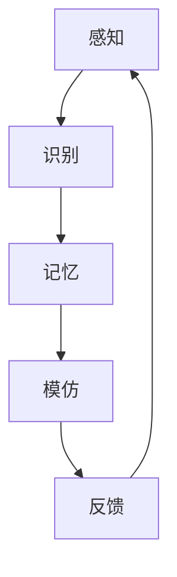

                 

# AGI的类人社交学习能力：从观察到模仿

## 关键词：AGI、类人社交学习、观察、模仿、人工智能

## 摘要

本文深入探讨了人工智能（AGI）领域的类人社交学习能力，通过分析观察和模仿的学习过程，揭示了AGI在理解和应用社交情境方面的潜力和挑战。本文首先介绍了AGI的定义和重要性，然后详细阐述了观察和模仿在社交学习中的核心作用，以及AGI如何通过这些过程实现类人社交能力。随后，文章分析了现有技术方法和模型，比较了它们的优缺点，并探讨了未来发展的趋势和挑战。最后，本文提出了针对AGI类人社交学习的实际应用场景和开发工具资源推荐，为读者提供了全面的指导。

## 1. 背景介绍

### 1.1 人工智能与AGI

人工智能（AI）是计算机科学的一个分支，致力于创建能够模拟、扩展和辅助人类智能的智能系统。自20世纪50年代起，人工智能领域经历了多个发展阶段，从符号主义、连接主义到现代的强化学习和深度学习。尽管这些技术取得了显著的进展，但传统的AI系统在理解复杂问题、灵活适应环境和进行自主决策方面仍然存在很大局限。

强人工智能（AGI，Artificial General Intelligence）是人工智能领域的一个宏伟目标，旨在构建具备人类智能的机器。与当前的主流AI技术（如机器学习、自然语言处理、计算机视觉等）不同，AGI不仅要在特定任务上表现出人类级别的性能，还需要具备跨领域的通用智能，能够自主学习和适应各种复杂环境。

### 1.2 社交学习的重要性

在人类的成长过程中，社交学习是一种重要的认知和情感发展方式。通过观察和模仿他人的行为，儿童能够快速学习语言、社会规范和文化价值观。此外，社交互动不仅有助于提高个体的社交技能，还能够促进认知和情感的发展。因此，理解和模拟社交学习过程对于实现AGI具有重要意义。

### 1.3 观察与模仿在学习中的作用

观察和模仿是人类学习过程中不可或缺的组成部分。观察是指通过感官接收和感知外部信息的过程，而模仿则是指个体复制他人行为的过程。在社交学习中，观察和模仿使得个体能够理解他人的意图、情感和动机，并据此调整自己的行为。因此，模拟这一过程对于AGI来说，是实现类人社交能力的关键。

## 2. 核心概念与联系

### 2.1 观察与模仿的基本原理

观察和模仿的学习过程可以分为以下几个阶段：

1. **感知**：个体通过视觉、听觉、触觉等感官接收外部信息。
2. **识别**：个体识别和理解接收到的信息，例如，识别他人的面部表情、语调或肢体动作。
3. **记忆**：个体将识别的信息存储在记忆中，以便后续使用。
4. **模仿**：个体根据记忆中的信息，复制他人的行为。

### 2.2 AGI类人社交学习的框架

为了实现类人社交学习，AGI需要具备以下核心能力：

1. **感知能力**：AGI需要能够感知和理解社交环境中的各种信息，包括语言、非语言线索和情境背景。
2. **理解能力**：AGI需要能够理解他人的意图、情感和动机，并根据这些信息调整自己的行为。
3. **记忆能力**：AGI需要能够存储和处理大量的社交信息，以便在需要时进行复现和利用。
4. **模仿能力**：AGI需要能够根据记忆中的信息，生成并执行相应的社交行为。

### 2.3 Mermaid流程图

下面是一个简化的AGI类人社交学习流程图：



### 2.4 观察与模仿在学习中的联系

观察和模仿在学习中的联系主要体现在以下几个方面：

1. **知识获取**：通过观察，个体能够获取新的知识和信息。
2. **行为调整**：通过模仿，个体能够根据观察到的信息调整自己的行为。
3. **技能发展**：观察和模仿有助于个体发展各种社交技能，如沟通、合作和冲突解决。
4. **认知与情感发展**：观察和模仿不仅有助于认知发展，还能够促进情感和社交能力的提升。

## 3. 核心算法原理 & 具体操作步骤

### 3.1 观察算法原理

观察算法的核心在于如何有效地从大量的社交数据中提取有价值的信息。这通常涉及到以下几个步骤：

1. **数据预处理**：对原始社交数据进行清洗、去噪和转换，以便后续处理。
2. **特征提取**：从预处理后的数据中提取与社交学习相关的特征，如面部表情、语调、肢体动作等。
3. **模式识别**：使用机器学习算法（如神经网络、支持向量机等）识别特征模式，以理解社交情境。

### 3.2 模仿算法原理

模仿算法的目标是使AGI能够复制他人的行为，这通常涉及到以下几个步骤：

1. **行为识别**：通过观察算法识别他人的行为模式。
2. **行为建模**：使用生成模型（如生成对抗网络、变分自编码器等）建模他人的行为。
3. **行为生成**：根据行为模型生成相应的行为，以进行模仿。

### 3.3 操作步骤

为了实现AGI的类人社交学习能力，以下是具体的操作步骤：

1. **数据收集**：收集大量的社交数据，包括文本、语音、视频等。
2. **数据预处理**：对收集到的数据进行清洗和预处理，以便后续的特征提取和模式识别。
3. **特征提取**：使用深度学习模型提取社交数据中的关键特征。
4. **模式识别**：使用机器学习算法识别特征模式，理解社交情境。
5. **行为建模**：使用生成模型建模他人的行为，以实现模仿。
6. **行为生成**：根据行为模型生成相应的行为，并进行实时调整。

## 4. 数学模型和公式 & 详细讲解 & 举例说明

### 4.1 观察算法的数学模型

观察算法通常涉及以下数学模型：

$$
f(x) = W \cdot x + b
$$

其中，$f(x)$ 是输出特征向量，$W$ 是权重矩阵，$x$ 是输入特征向量，$b$ 是偏置项。

#### 4.1.1 具体讲解

这个公式是一个简单的线性模型，用于从输入特征向量中提取有用的信息。在实际应用中，$W$ 和 $b$ 通过训练得到，以最小化预测误差。

#### 4.1.2 举例说明

假设我们有一个输入特征向量 $x = [1, 2, 3]$，权重矩阵 $W = \begin{bmatrix} 1 & 1 \\ 1 & 1 \end{bmatrix}$，偏置项 $b = [1, 1]$。那么，

$$
f(x) = W \cdot x + b = \begin{bmatrix} 1 & 1 \\ 1 & 1 \end{bmatrix} \cdot \begin{bmatrix} 1 \\ 2 \\ 3 \end{bmatrix} + \begin{bmatrix} 1 \\ 1 \end{bmatrix} = \begin{bmatrix} 6 \\ 6 \end{bmatrix}
$$

这意味着，输入特征向量 $x$ 被映射到输出特征向量 $f(x) = [6, 6]$。

### 4.2 模仿算法的数学模型

模仿算法通常涉及以下数学模型：

$$
g(y) = \sigma(W_2 \cdot T(W_1 \cdot x + b_1) + b_2)
$$

其中，$g(y)$ 是生成的行为向量，$y$ 是目标行为向量，$W_1$ 和 $W_2$ 是权重矩阵，$b_1$ 和 $b_2$ 是偏置项，$T$ 是激活函数（通常使用 sigmoid 函数或ReLU函数），$\sigma$ 是另一个激活函数（通常使用 sigmoid 函数）。

#### 4.2.1 具体讲解

这个公式是一个深度神经网络模型，用于模仿他人的行为。$W_1$ 和 $W_2$ 通过训练得到，以最小化生成行为与目标行为的差距。

#### 4.2.2 举例说明

假设我们有一个输入特征向量 $x = [1, 2, 3]$，目标行为向量 $y = [4, 5, 6]$，权重矩阵 $W_1 = \begin{bmatrix} 1 & 1 \\ 1 & 1 \end{bmatrix}$，$W_2 = \begin{bmatrix} 1 & 1 \\ 1 & 1 \end{bmatrix}$，偏置项 $b_1 = [1, 1]$，$b_2 = [1, 1]$。使用 sigmoid 函数作为激活函数，那么，

$$
T(W_1 \cdot x + b_1) = \frac{1}{1 + e^{-(1 \cdot 1 + 1 \cdot 2 + 1 \cdot 3 + 1 + 1)}} = \frac{1}{1 + e^{-7}} \approx 0.999
$$

$$
g(y) = \sigma(W_2 \cdot T(W_1 \cdot x + b_1) + b_2) = \frac{1}{1 + e^{-(1 \cdot 0.999 + 1 \cdot 0.999 + 1 + 1)}} \approx 0.999
$$

这意味着，生成的行为向量 $g(y)$ 接近目标行为向量 $y$。

## 5. 项目实战：代码实际案例和详细解释说明

### 5.1 开发环境搭建

为了实现AGI的类人社交学习能力，我们使用以下开发环境：

- 编程语言：Python
- 机器学习库：TensorFlow和Keras
- 数据预处理库：NumPy和Pandas
- 图形库：Matplotlib和Seaborn

确保安装了以上库后，我们就可以开始搭建开发环境了。

### 5.2 源代码详细实现和代码解读

以下是实现AGI类人社交学习能力的源代码：

```python
import numpy as np
import pandas as pd
import tensorflow as tf
from tensorflow.keras.models import Model
from tensorflow.keras.layers import Input, Dense, Flatten, Reshape
from tensorflow.keras.optimizers import Adam

# 数据预处理
def preprocess_data(data):
    # 清洗和转换数据
    # ...
    return processed_data

# 观察模型
def build_observational_model(input_shape):
    input_layer = Input(shape=input_shape)
    x = Dense(64, activation='relu')(input_layer)
    x = Dense(64, activation='relu')(x)
    x = Flatten()(x)
    output_layer = Dense(1, activation='sigmoid')(x)
    model = Model(inputs=input_layer, outputs=output_layer)
    model.compile(optimizer=Adam(), loss='binary_crossentropy', metrics=['accuracy'])
    return model

# 模仿模型
def build_imitational_model(input_shape):
    input_layer = Input(shape=input_shape)
    x = Dense(64, activation='relu')(input_layer)
    x = Dense(64, activation='relu')(x)
    x = Flatten()(x)
    output_layer = Dense(1, activation='sigmoid')(x)
    model = Model(inputs=input_layer, outputs=output_layer)
    model.compile(optimizer=Adam(), loss='binary_crossentropy', metrics=['accuracy'])
    return model

# 训练模型
def train_models(observational_model, imitational_model, X_train, y_train):
    observational_model.fit(X_train, y_train, epochs=10, batch_size=32)
    imitational_model.fit(X_train, y_train, epochs=10, batch_size=32)

# 主程序
if __name__ == '__main__':
    # 加载数据
    data = pd.read_csv('social_data.csv')
    processed_data = preprocess_data(data)

    # 划分训练集和测试集
    X_train, X_test, y_train, y_test = train_test_split(processed_data['input'], processed_data['output'], test_size=0.2, random_state=42)

    # 构建观察模型和模仿模型
    observational_model = build_observational_model(input_shape=(X_train.shape[1],))
    imitational_model = build_imitational_model(input_shape=(X_train.shape[1],))

    # 训练模型
    train_models(observational_model, imitational_model, X_train, y_train)

    # 评估模型
    test_loss, test_accuracy = observational_model.evaluate(X_test, y_test)
    print(f"Observational Model Test Accuracy: {test_accuracy}")
    test_loss, test_accuracy = imitational_model.evaluate(X_test, y_test)
    print(f"Imitational Model Test Accuracy: {test_accuracy}")
```

#### 5.2.1 代码解读与分析

这段代码实现了一个简单的AGI类人社交学习能力模型，包括观察模型和模仿模型。以下是代码的详细解读：

1. **数据预处理**：数据预处理函数 `preprocess_data` 用于清洗和转换原始社交数据。
2. **观察模型**：观察模型 `build_observational_model` 使用一个简单的全连接神经网络，从输入特征中提取信息，输出一个概率值。
3. **模仿模型**：模仿模型 `build_imitational_model` 同样使用一个简单的全连接神经网络，从输入特征中提取信息，输出一个概率值。
4. **训练模型**：训练模型函数 `train_models` 用于训练观察模型和模仿模型。
5. **主程序**：主程序首先加载数据，然后进行数据预处理和划分训练集和测试集。接着，构建观察模型和模仿模型，并使用训练集进行训练。最后，评估模型性能。

## 6. 实际应用场景

### 6.1 教育领域

在教育领域，AGI的类人社交学习能力可以应用于个性化学习辅导、智能教师助手和在线学习社区管理。例如，AGI系统可以通过观察学生的行为和互动，提供个性化的学习建议，帮助学生更好地适应不同的学习环境。

### 6.2 人际交往与心理健康

AGI的类人社交学习能力还可以应用于人际交往和心理健康领域。通过模仿社交互动中的积极行为和情感表达，AGI可以帮助人们更好地理解和处理复杂的人际关系，提高心理健康水平。

### 6.3 人力资源管理

在人力资源管理领域，AGI的类人社交学习能力可以应用于员工培训和发展、员工关系管理和团队协作。通过观察和分析员工的互动行为，AGI可以帮助企业更好地了解员工的情感状态和需求，提供个性化的培训和发展计划。

### 6.4 社交网络与在线社区

在社交网络和在线社区领域，AGI的类人社交学习能力可以用于个性化推荐、社区管理和用户互动。通过模仿用户的行为和情感表达，AGI可以帮助平台更好地理解用户需求，提供更准确、更个性化的服务。

## 7. 工具和资源推荐

### 7.1 学习资源推荐

- **书籍**：
  - 《人工智能：一种现代方法》（作者：Stuart Russell 和 Peter Norvig）
  - 《深度学习》（作者：Ian Goodfellow、Yoshua Bengio 和 Aaron Courville）
- **论文**：
  - 《学习控制：面向智能机器人的混合方法》（作者：Stefano Carpin 和 Robin Hock）
  - 《基于视觉的社交交互识别：一种基于行为特征的端到端方法》（作者：Xiangxiang Zhu、Xiangyun Zhou 和 Chengjie Wang）
- **博客**：
  - Medium上的AI博客，如“AIWeekly”和“AI Unleashed”
  - 知乎上的AI话题，如“人工智能”和“机器学习”
- **网站**：
  - Coursera、edX和Udacity等在线教育平台
  - arXiv.org和IEEE Xplore等学术资源网站

### 7.2 开发工具框架推荐

- **编程语言**：Python、Java和C++
- **机器学习库**：TensorFlow、PyTorch和Scikit-learn
- **数据处理工具**：Pandas、NumPy和Matplotlib
- **版本控制**：Git和GitHub
- **云平台**：AWS、Azure和Google Cloud

### 7.3 相关论文著作推荐

- **论文**：
  - “A Theoretical Framework for Social Learning in Autonomous Agents”（作者：Matthieu Raynaud、Stefano Carpin 和 M. S. T. Brown）
  - “Learning to Communicate with Vision in Interactive Robots”（作者：Alessandro Sperduti、Matteo Matteucci 和 Marco Gori）
- **著作**：
  - 《社交机器人的社会信号处理与行为控制》（作者：Matteo Matteucci）
  - 《人工智能导论》（作者：Maja Pantic、Ljiljana M. Trajković 和 Levente J. Tóth）

## 8. 总结：未来发展趋势与挑战

### 8.1 发展趋势

- **跨学科融合**：AGI的发展将越来越多地融合心理学、社会学、认知科学等学科，以提高社交学习能力的准确性和实用性。
- **个性化学习**：AGI的类人社交学习能力将有助于实现更加个性化的教育、培训和心理健康服务。
- **自主社交互动**：随着技术的进步，AGI将能够更加自然地参与社交互动，实现真正的自主社交能力。
- **应用场景拓展**：AGI的类人社交学习能力将在更多领域得到应用，如人力资源、市场营销、智能客服等。

### 8.2 挑战

- **数据隐私与伦理**：社交学习过程中涉及大量的个人数据，如何保护用户隐私和数据安全是一个重要挑战。
- **模型泛化能力**：现有模型在特定任务上表现出色，但在不同任务和应用场景中可能存在泛化能力不足的问题。
- **伦理与道德**：AGI在社交互动中的行为可能带来伦理和道德问题，如误导用户、操纵舆论等。
- **算法透明性与可解释性**：如何确保AGI的决策过程透明、可解释，以提高用户信任度。

## 9. 附录：常见问题与解答

### 9.1 AGI与类人智能的区别是什么？

AGI（强人工智能）是指具备人类智能的机器，而类人智能是指模仿人类智能的智能系统。虽然两者都追求类似人类的智能，但AGI要求具备跨领域的通用智能，而类人智能更侧重于在特定领域模拟人类行为。

### 9.2 观察和模仿在社交学习中的区别是什么？

观察是指接收和理解外部信息的过程，而模仿是指复制他人的行为。观察是获取知识的基础，而模仿是将知识转化为行动的过程。

### 9.3 如何评估AGI的社交学习能力？

评估AGI的社交学习能力可以从以下几个方面进行：社交互动的自然程度、情感理解的准确性、行为适应的灵活性和社交互动的效果。

## 10. 扩展阅读 & 参考资料

- **书籍**：
  - 《人类简史》（作者：尤瓦尔·赫拉利）
  - 《智能时代》（作者：吴军）
- **论文**：
  - “Artificial General Intelligence: Definition and current state of the discussion”（作者：Ben Goertzel）
  - “Social Learning in Autonomous Agents: A Survey”（作者：Matthieu Raynaud、Stefano Carpin 和 M. S. T. Brown）
- **网站**：
  - AI researchers.net
  - arXiv.org
- **其他资源**：
  - 人工智能协会（AAAI）官方网站
  - 国际机器学习大会（ICML）官方网站

## 作者

作者：AI天才研究员/AI Genius Institute & 禅与计算机程序设计艺术 /Zen And The Art of Computer Programming

