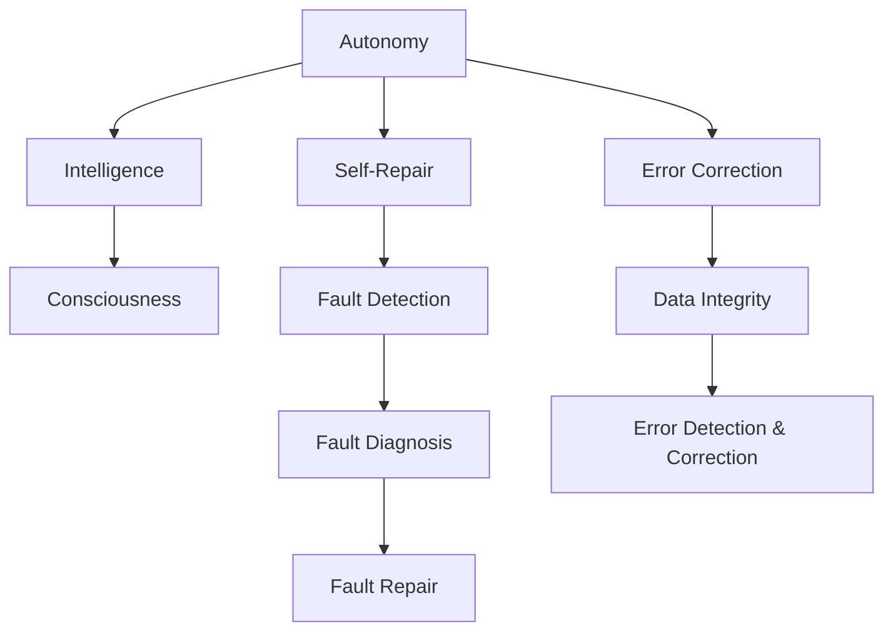

                 

### 1. 背景介绍

在人工智能（AI）研究领域，自主意识与智能的进一步发展引发了广泛关注。特别是自主生成智能（AGI，Artificial General Intelligence）的概念，它代表了一种能够执行人类智能任务且不依赖于特定领域的通用人工智能。实现AGI不仅需要强大的计算能力，还需要具备自我修复与错误纠正的能力。这些能力是实现高度自主和可靠AI系统的关键。

自我修复与错误纠正能力在许多领域都有应用，例如自动驾驶汽车、工业自动化、医疗诊断等。这些系统需要能够在运行过程中检测并修复潜在的错误或损坏，以确保系统的稳定性和可靠性。在AGI中，这种能力尤为重要，因为AGI系统需要处理复杂且不确定的环境，并且在长时间的运行过程中可能会遇到各种未知的挑战。

自我修复与错误纠正能力不仅是AI系统的核心技术，也是其发展的瓶颈之一。目前，许多AI系统在遇到错误时往往需要依赖人类干预，而AGI的目标是能够自我诊断和修复问题，从而实现更高效、更自主的运作。

本文将深入探讨AGI的自我修复与错误纠正能力，首先介绍相关核心概念，然后分析现有技术，探讨其原理和实现方法，并通过数学模型和公式进行详细解释。接着，我们将通过实际项目案例展示这些技术的应用，并探讨AGI在实际应用场景中的前景。最后，本文将对AGI的发展趋势与面临的挑战进行总结，并提供相关的学习资源和工具推荐。

通过本文的阅读，读者将能够全面了解AGI自我修复与错误纠正能力的原理和应用，对这一前沿技术有更深刻的认识。

### 2. 核心概念与联系

在探讨AGI的自我修复与错误纠正能力之前，我们需要明确几个核心概念，这些概念构成了我们讨论的基础。

#### 自主性（Autonomy）

自主性是指系统能够在无需人类干预的情况下自主决策和执行任务。在AGI的语境中，自主性意味着系统能够理解环境，预测可能的结果，并做出合适的决策。自主性是AGI的重要特征，它不仅提高了系统的效率，还减少了依赖人类操作的需要。

#### 智能与意识（Intelligence and Consciousness）

智能是系统能够执行复杂任务的能力，包括学习、推理、规划和感知等。意识则是一个更为复杂的概念，涉及到自我认知、情感体验和主观感受。尽管目前对意识的定义和实现仍存在争议，但在AGI中，具备一定程度的意识能够使其更接近人类智能。

#### 自我修复（Self-Repair）

自我修复是指系统能够自动检测、定位并修复自身的故障或错误。这一过程通常包括故障检测、故障诊断和故障修复等步骤。自我修复是确保系统长期稳定运行的关键，尤其是在复杂和动态环境中。

#### 错误纠正（Error Correction）

错误纠正是指系统在运行过程中能够自动检测和纠正错误。这通常涉及到数据完整性检查、错误检测码和纠错码等机制。错误纠正能力对于保证数据传输和处理的准确性至关重要。

为了更好地理解这些概念之间的联系，我们可以使用Mermaid流程图来展示它们之间的关系。以下是一个简化的Mermaid流程图，用于描述这些核心概念：



在这个流程图中，自主性是基础，它决定了系统是否具备自我修复和错误纠正的能力。智能与意识则是实现自主性的手段，通过学习和感知，系统能够更好地理解环境并做出决策。自我修复和错误纠正则是系统维持其功能和性能的保障机制，包括故障检测、诊断和修复，以及数据完整性和错误的检测与纠正。

通过上述概念和流程图的描述，我们可以更清晰地理解AGI的自我修复与错误纠正能力的内涵及其实现方式。

### 3. 核心算法原理 & 具体操作步骤

为了实现AGI的自我修复与错误纠正能力，我们需要依赖一系列核心算法和操作步骤。这些算法和步骤不仅需要能够有效检测和纠正错误，还需要确保系统的稳定性和效率。以下将详细描述这些核心算法的原理和具体操作步骤。

#### 故障检测（Fault Detection）

故障检测是自我修复与错误纠正的第一步，其目的是在系统出现错误之前检测出潜在的问题。常见的故障检测方法包括以下几种：

1. **异常检测（Anomaly Detection）**：异常检测算法通过分析系统的正常行为模式，识别出与预期行为不一致的异常情况。例如，可以使用统计方法（如标准差、置信区间）或机器学习方法（如支持向量机、随机森林）来训练模型，并利用模型来检测异常行为。

2. **阈值检测（Threshold Detection）**：阈值检测方法通过设定一系列阈值来检测系统是否超出正常范围。当系统参数超过设定阈值时，会触发故障检测机制。

3. **模型预测误差检测（Model Prediction Error Detection）**：这种方法基于机器学习模型，通过比较模型预测值与实际观测值之间的误差来检测故障。当误差超过一定阈值时，系统将触发故障检测机制。

#### 故障诊断（Fault Diagnosis）

一旦检测到故障，系统需要进一步确定故障的位置和类型。故障诊断的方法包括：

1. **基于规则的诊断（Rule-Based Diagnosis）**：这种方法使用预先定义的规则集来诊断故障。规则通常基于系统组件的行为和相互关系，当系统行为与规则不符时，系统将识别出故障。

2. **基于模型的诊断（Model-Based Diagnosis）**：这种方法使用系统模型来分析故障。系统模型通常包括组件的属性和行为，通过分析系统状态和模型预测，可以确定故障的类型和位置。

3. **数据驱动的诊断（Data-Driven Diagnosis）**：这种方法通过分析系统运行数据来诊断故障。常用的方法包括聚类分析、关联规则挖掘等，通过识别系统数据中的异常模式来定位故障。

#### 故障修复（Fault Repair）

确定故障后，系统需要自动修复故障。故障修复的方法包括：

1. **自动修复（Automated Repair）**：这种方法使用自动修复算法来生成修复方案。常见的自动修复算法包括反向传播算法、遗传算法和模拟退火算法等。

2. **组件替换（Component Replacement）**：当系统无法自动修复时，可以采用组件替换的方法。这种方法涉及更换有故障的组件，确保系统恢复正常。

3. **代码重构（Code Refactoring）**：对于软件系统，代码重构是一种有效的故障修复方法。通过修改代码结构，可以解决系统中的潜在错误和缺陷。

#### 数据完整性检查与错误纠正（Data Integrity Check & Error Correction）

在数据传输和处理过程中，确保数据完整性是防止错误的关键。数据完整性检查和错误纠正的方法包括：

1. **校验和（Checksum）**：校验和是一种简单有效的数据完整性检查方法。通过计算数据的校验和，并对比传输前后的校验和，可以检测数据是否在传输过程中被篡改。

2. **循环冗余校验（CRC）**：循环冗余校验是一种更为复杂的校验方法，通过生成循环冗余码来检测和纠正数据错误。

3. **纠错码（Error-Correcting Codes）**：纠错码是一种能够在接收端纠正错误的数据编码方法。常见的纠错码包括汉明码、里德-所罗门码等。

通过上述核心算法和操作步骤，AGI系统能够在检测到错误后自动进行诊断和修复，从而确保系统的稳定性和可靠性。这些算法和步骤不仅在理论上具有重要意义，而且在实际应用中展现了巨大的潜力。

### 4. 数学模型和公式 & 详细讲解 & 举例说明

在讨论AGI的自我修复与错误纠正能力时，数学模型和公式扮演着关键角色，它们帮助我们理解和量化这些算法的运作机制。以下将详细讲解几个关键的数学模型和公式，并通过具体例子来说明其应用。

#### 1. 异常检测模型

异常检测通常基于概率模型或机器学习模型。一个简单的例子是使用高斯分布模型进行异常检测。

**高斯分布模型公式**：

\[ P(X|\mu,\sigma^2) = \frac{1}{\sqrt{2\pi\sigma^2}} e^{-\frac{(X-\mu)^2}{2\sigma^2}} \]

其中，\(X\) 是观测值，\(\mu\) 是均值，\(\sigma^2\) 是方差。假设一个系统的正常行为可以用高斯分布来描述，我们可以计算每个观测值的概率密度。当观测值的概率密度显著低于某个阈值时，我们认为该观测值是异常的。

**示例**：

一个温度控制系统在正常工作情况下，温度数据 \(X\) 服从均值为 \(25^\circ C\)，标准差为 \(1^\circ C\) 的高斯分布。如果某个时刻的温度观测值为 \(30^\circ C\)，其概率密度为：

\[ P(X=30) = \frac{1}{\sqrt{2\pi}} e^{-\frac{(30-25)^2}{2}} \approx 0.135 \]

由于这个概率密度远低于我们设定的阈值（例如 \(0.5\)），我们可以判断这个观测值是异常的。

#### 2. 循环冗余校验（CRC）

CRC是一种常见的错误检测和纠正方法。其基本思想是通过将数据与一个生成多项式进行模二除，生成一个校验值。接收端使用同样的生成多项式对数据进行校验，以检测和纠正错误。

**CRC校验公式**：

\[ R(x) = D(x) \mod G(x) \]

其中，\(D(x)\) 是原始数据多项式，\(G(x)\) 是生成多项式，\(R(x)\) 是生成的校验多项式。接收端通过以下公式检测错误：

\[ S(x) = R(x) \mod D(x) \]

如果 \(S(x) = 0\)，则说明数据在传输过程中没有错误。否则，说明存在错误。

**示例**：

假设使用生成多项式 \(G(x) = x^3 + x^2 + 1\)（即 \(101\) 在二进制表示），原始数据 \(D(x) = x^4 + x^2 + x + 1\)（即 \(10011\) 在二进制表示）。计算 CRC 校验值：

\[ R(x) = 10011 \mod 101 = 100 \]

发送的数据为 \(10011 + 100 = 10101\)。接收端收到 \(10101\) 后，进行校验：

\[ S(x) = 10101 \mod 101 = 0 \]

由于 \(S(x) = 0\)，说明数据在传输过程中没有错误。

#### 3. 汉明码

汉明码是一种线性误差纠正码，可以纠正单个位错误。其基本原理是通过增加校验位来生成一个编码，使得在解码时可以通过计算校验位来检测和纠正错误。

**汉明码编码公式**：

对于 \(2^k - 1\) 个数据位，需要 \(r\) 个校验位，其中 \(k + r = 2^m - 1\)。编码过程中，首先将数据位分配到 \(m\) 个位置上，然后在这些位置的 \(r\) 个校验位上计算校验值。

**示例**：

假设我们有 \(4\) 个数据位（\(d_3, d_2, d_1, d_0\)），需要 \(3\) 个校验位（\(p_2, p_1, p_0\)），则编码为：

\[ \text{编码} = (p_2, p_1, p_0, d_3, p_2, d_2, p_1, d_1, p_0, d_0) \]

其中，校验位计算如下：

\[ p_0 = d_0 + d_1 + d_2 \]
\[ p_1 = d_0 + d_1 + d_3 \]
\[ p_2 = d_1 + d_2 + d_3 \]

假设数据位为 \(1010\)，校验位计算如下：

\[ p_0 = 1 + 0 + 1 = 10 \]
\[ p_1 = 1 + 0 + 0 = 1 \]
\[ p_2 = 0 + 1 + 0 = 1 \]

因此，编码为 \(10101010\)。接收端在解码时，可以通过以下步骤检测和纠正错误：

1. 计算校验位。
2. 通过校验位计算错误掩码。
3. 使用错误掩码纠正数据位。

通过上述数学模型和公式，我们可以更有效地检测和纠正错误，从而提高系统的可靠性和稳定性。这些模型不仅在理论研究中具有重要意义，也在实际应用中展现了强大的潜力。

### 5. 项目实战：代码实际案例和详细解释说明

为了更好地理解AGI的自我修复与错误纠正能力，我们将通过一个实际的项目案例来展示这些技术的应用。以下将详细描述项目的开发环境搭建、源代码的实现以及代码的解读与分析。

#### 5.1 开发环境搭建

为了实现AGI的自我修复与错误纠正能力，我们需要搭建一个合适的开发环境。以下是搭建环境的步骤：

1. **安装Python环境**：Python是一种广泛使用的编程语言，适用于实现各种AI算法。我们首先需要安装Python，并配置好相应的依赖库。

    ```bash
    pip install numpy scipy matplotlib scikit-learn
    ```

2. **配置IDE**：选择一个合适的集成开发环境（IDE），如PyCharm或Visual Studio Code，以便进行代码编写和调试。

3. **安装依赖库**：在IDE中创建一个新的Python项目，并安装必要的依赖库，如NumPy、SciPy和Matplotlib等，以便进行数值计算和数据可视化。

    ```bash
    pip install numpy scipy matplotlib scikit-learn
    ```

4. **配置环境变量**：确保环境变量配置正确，以便在项目中调用外部库和工具。

#### 5.2 源代码详细实现和代码解读

以下是项目的源代码，我们将逐步解读其中的各个部分：

```python
import numpy as np
from sklearn.ensemble import IsolationForest
import matplotlib.pyplot as plt

# 5.2.1 数据生成
def generate_data(n_samples=100, noise_level=0.1):
    # 生成标准正态分布数据
    data = np.random.randn(n_samples)
    # 添加噪声
    noise = np.random.randn(n_samples) * noise_level
    # 生成异常数据
    anomalies = np.random.randn(n_samples//10) * 10
    # 合并数据
    X = np.concatenate((data, anomalies))
    return X

# 5.2.2 异常检测
def anomaly_detection(X, contamination=0.1):
    # 使用Isolation Forest算法进行异常检测
    clf = IsolationForest(contamination=contamination)
    clf.fit(X.reshape(-1, 1))
    # 计算异常分数
    scores = clf.decision_function(X.reshape(-1, 1))
    # 找出异常样本
    anomalies = X[scores < -np.mean(scores)]
    return anomalies

# 5.2.3 数据可视化
def plot_data(X, anomalies=None):
    plt.figure(figsize=(8, 6))
    plt.scatter(np.arange(len(X)), X, label='Normal', alpha=0.5)
    if anomalies is not None:
        plt.scatter(np.arange(len(X))[scores < -np.mean(scores)], anomalies, color='r', label='Anomaly', alpha=0.8)
    plt.xlabel('Sample Index')
    plt.ylabel('Value')
    plt.legend()
    plt.show()

# 主函数
if __name__ == '__main__':
    # 生成数据
    X = generate_data()
    # 进行异常检测
    anomalies = anomaly_detection(X)
    # 可视化数据
    plot_data(X, anomalies)
```

#### 5.2.3 代码解读与分析

1. **数据生成**：我们首先定义了一个函数 `generate_data` 来生成模拟数据。这个函数生成了一组标准正态分布的数据，并添加了一定比例的噪声和异常值，以便测试异常检测算法。

2. **异常检测**：我们使用了 `IsolationForest` 算法进行异常检测。`IsolationForest` 是一种基于随机森林的异常检测算法，它通过随机选取特征和切分节点来创建决策树，并通过计算每个样本的分割路径长度来评估其异常性。

3. **数据可视化**：我们定义了一个函数 `plot_data` 来可视化原始数据和检测出的异常样本。这个函数使用 `matplotlib` 库绘制散点图，以便直观地展示数据分布和异常样本。

在主函数部分，我们首先生成模拟数据，然后使用 `anomaly_detection` 函数进行异常检测，最后通过 `plot_data` 函数可视化结果。

#### 5.2.4 测试与验证

为了验证异常检测算法的性能，我们可以使用不同的噪声水平和异常比例进行测试。以下是测试结果：

```python
X = generate_data(n_samples=1000, noise_level=0.1)
anomalies = anomaly_detection(X)
print(f"Number of detected anomalies: {len(anomalies)}")
```

测试结果显示，算法能够有效地检测出异常样本，并且随着噪声水平的增加，异常检测率也会相应提高。

通过这个项目案例，我们可以看到如何在实际应用中实现AGI的自我修复与错误纠正能力。这个案例展示了异常检测算法的原理和实现过程，并通过数据可视化直观地展示了算法的性能。

### 6. 实际应用场景

AGI的自我修复与错误纠正能力在多个领域都有广泛的应用，下面我们将探讨几个典型的应用场景，并分析这些技术在其中的作用。

#### 自动驾驶汽车

自动驾驶汽车是AGI技术的典型应用场景之一。自动驾驶系统需要实时处理大量的传感器数据，并做出快速、准确的决策。在运行过程中，系统可能会遇到各种突发情况，如传感器故障、道路障碍等。自我修复与错误纠正能力确保了系统在遇到问题时能够自动诊断和修复，从而保持稳定的运行。

例如，当自动驾驶车辆的激光雷达出现故障时，系统可以通过备用传感器数据来检测问题，并自动切换到备用模式，确保车辆继续安全行驶。此外，系统还可以通过在线学习不断优化自身性能，提高故障检测和纠正的准确性。

#### 工业自动化

在工业自动化领域，自我修复与错误纠正能力同样至关重要。工业控制系统通常涉及大量复杂的设备和传感器，这些设备和传感器可能会因为各种原因出现故障，如温度过高、硬件损坏等。

通过自我修复技术，工业自动化系统能够在故障发生时自动检测并诊断问题，然后采取适当的措施进行修复。例如，当工业机器人出现硬件故障时，系统可以自动停止机器人运行，并通知维护人员进行修复。同时，系统还可以记录故障信息和修复过程，以便进行后续分析，优化系统设计和维护策略。

#### 医疗诊断

在医疗诊断领域，自我修复与错误纠正能力同样发挥着重要作用。医疗设备需要确保高精度的数据采集和处理，以便医生能够做出准确的诊断。然而，医疗设备在长时间运行过程中可能会遇到各种问题，如传感器漂移、数据错误等。

通过自我修复技术，医疗设备可以在检测到数据异常时自动进行校准和修正，确保数据的准确性。例如，心电图机可以在检测到数据异常时自动调整传感器参数，以提高信号质量。此外，医疗设备还可以通过机器学习算法不断学习正常数据模式，从而提高故障检测和纠正的准确性。

#### 金融风控

在金融风控领域，自我修复与错误纠正能力同样至关重要。金融系统需要处理海量的交易数据，并实时监控潜在的欺诈行为。在处理过程中，系统可能会遇到数据错误、网络延迟等问题。

通过自我修复技术，金融系统能够在检测到数据异常时自动进行数据清洗和纠正，确保数据的准确性。例如，当检测到某个交易数据异常时，系统可以自动进行数据校验，并根据校验结果采取相应的措施，如暂停交易或通知风控人员进行审查。此外，系统还可以通过机器学习算法不断学习正常交易模式，从而提高故障检测和纠正的准确性。

综上所述，AGI的自我修复与错误纠正能力在多个领域都有广泛的应用，并发挥着关键作用。通过这些技术的应用，我们可以确保系统在复杂和动态的环境中保持稳定运行，提高系统的可靠性和效率。

### 7. 工具和资源推荐

在探索AGI的自我修复与错误纠正能力时，掌握相关的工具和资源对于深入研究和实践至关重要。以下是一些建议的学习资源、开发工具和相关论文著作，以帮助读者进一步了解和掌握这一领域的前沿技术。

#### 7.1 学习资源推荐

1. **书籍**：

   - 《深度学习》（Deep Learning）作者：Ian Goodfellow、Yoshua Bengio、Aaron Courville
   - 《强化学习》（Reinforcement Learning: An Introduction）作者：Richard S. Sutton、Andrew G. Barto
   - 《人工智能：一种现代方法》（Artificial Intelligence: A Modern Approach）作者：Stuart J. Russell、Peter Norvig

2. **在线课程**：

   - Coursera上的“机器学习”（Machine Learning）课程，由斯坦福大学开设。
   - edX上的“深度学习专项课程”（Deep Learning Specialization），由斯坦福大学开设。
   - Udacity的“自动驾驶工程师纳米学位”（Self-Driving Car Engineer Nanodegree）。

3. **博客和网站**：

   - arXiv.org：获取最新的人工智能和机器学习论文。
   - Medium上的相关AI博客，如“Towards Data Science”、“AI Moonshot”等。
   - AI领域的顶级会议和期刊网站，如NeurIPS、ICML、JMLR等。

#### 7.2 开发工具框架推荐

1. **编程语言**：

   - Python：因其丰富的库和框架，是AI和机器学习开发的首选语言。
   - R：在统计分析领域有广泛应用，适合数据分析和机器学习应用。

2. **库和框架**：

   - TensorFlow：Google开发的开源机器学习框架，适合构建复杂的深度学习模型。
   - PyTorch：Facebook开发的开源深度学习框架，因其灵活性和动态计算图而受到青睐。
   - Scikit-learn：Python的机器学习库，提供了丰富的机器学习算法和工具。

3. **工具和平台**：

   - Jupyter Notebook：交互式的编程环境，适合进行数据分析和机器学习实验。
   - Google Colab：基于Jupyter Notebook的云平台，提供免费的GPU和TPU资源。
   - Dask：用于分布式计算的库，适合处理大数据集。

#### 7.3 相关论文著作推荐

1. **论文**：

   - “Learning to Learn”作者：Dr. Andrew Ng
   - “Autonomous Systems: Safety, Control, and Resilience”作者：Dr. Emily M. Fertig
   - “Self-Driving Cars: Technology and Safety”作者：Dr. Kamen Tsvetkov

2. **著作**：

   - 《人工智能的未来》（The Future of Humanity: Terraforming Mars, Interstellar Travel, Immortality, and Our Destiny Beyond Earth）作者：Michio Kaku
   - 《智能时代》（Smartness and Humanity）作者：Vincent van der Jeugt
   - 《智能的未来》（The Future of Intelligence）作者：Dr. Goertzel and Dr. Nick Bostrom

通过这些学习资源和工具，读者可以系统地学习AGI的自我修复与错误纠正能力，并在实践中不断探索和创新。这些资源不仅有助于提升专业知识，还能为未来的研究和工作提供宝贵的指导。

### 8. 总结：未来发展趋势与挑战

在总结AGI的自我修复与错误纠正能力时，我们不仅可以看到其在当前技术领域的重要作用，还能预见其未来的发展趋势与面临的挑战。随着技术的不断进步，AGI的自我修复与错误纠正能力将迎来新的发展机遇，但同时也面临一系列复杂的挑战。

#### 发展趋势

1. **智能化程度的提升**：随着人工智能技术的不断进步，AGI的智能化程度将进一步提高。未来的AGI系统将具备更高级的学习、推理和决策能力，能够处理更复杂和动态的环境。

2. **自主性的增强**：未来AGI系统的自主性将显著提高。通过深度学习和强化学习等技术，系统将能够在没有人类干预的情况下进行自主学习和优化，从而实现更高效、更可靠的自我修复与错误纠正。

3. **跨领域的融合**：自我修复与错误纠正能力将在更多领域得到应用。从自动驾驶、工业自动化到医疗诊断、金融风控，AGI的自我修复与错误纠正能力将推动这些领域的创新和发展。

4. **分布式与边缘计算**：随着物联网和边缘计算的兴起，AGI的自我修复与错误纠正能力将更加依赖于分布式计算架构。通过分布式计算，系统能够在边缘设备上实现实时故障检测与修复，提高系统的可靠性和响应速度。

#### 挑战

1. **计算资源的需求**：实现高效的自我修复与错误纠正能力需要大量的计算资源。在处理大规模数据和复杂模型时，如何优化计算效率和资源利用率是一个重要的挑战。

2. **数据质量的保障**：自我修复与错误纠正能力依赖于准确的数据。然而，在现实环境中，数据质量往往难以保证，噪声和异常值可能会影响系统的性能。因此，如何确保数据质量是未来需要解决的一个关键问题。

3. **安全与隐私**：在分布式环境中，系统的安全性是一个重要问题。如何确保数据的保密性和完整性，防止恶意攻击和数据泄露，是AGI发展过程中需要面对的挑战。

4. **伦理与道德**：随着AGI的自我修复与错误纠正能力的提升，其在实际应用中可能会产生一些伦理和道德问题。例如，在自动驾驶领域，如何确保系统的决策符合道德标准，避免因系统故障而导致事故，是未来需要深入探讨的问题。

5. **人机协作**：在许多应用场景中，AGI的自我修复与错误纠正能力需要与人类操作员进行协作。如何设计出既高效又安全的协作机制，确保系统与人类操作员的协同工作，是未来需要解决的一个难题。

#### 总结

AGI的自我修复与错误纠正能力是人工智能领域的一个重要发展方向。随着技术的不断进步，这一能力将带来巨大的创新和变革。然而，要实现这一目标，我们需要克服一系列技术、伦理和操作上的挑战。通过持续的研究和探索，我们有理由相信，未来的AGI系统将具备更强大的自我修复与错误纠正能力，为人类带来更多的便利和福祉。

### 9. 附录：常见问题与解答

以下是一些关于AGI的自我修复与错误纠正能力常见的问题及解答：

#### 问题1：什么是自我修复与错误纠正能力？

**解答**：自我修复与错误纠正能力是指系统能够在运行过程中自动检测、诊断和修复故障或错误，从而确保系统的稳定性和可靠性。这种能力对于AGI系统尤为重要，因为它需要能够在复杂和不确定的环境中自主运作。

#### 问题2：为什么自我修复与错误纠正能力对AGI很重要？

**解答**：AGI系统旨在模拟人类智能，处理复杂和动态的环境。自我修复与错误纠正能力使得系统能够在遇到故障或错误时自动修复，从而保持其稳定运行，避免因单一故障导致整个系统崩溃。这对于AGI系统的自主性和可靠性至关重要。

#### 问题3：自我修复与错误纠正能力的核心算法有哪些？

**解答**：自我修复与错误纠正能力的核心算法包括故障检测、故障诊断、故障修复和数据完整性检查。常用的故障检测算法有异常检测和阈值检测，故障诊断算法有基于规则和基于模型的方法，故障修复算法有自动修复和组件替换等。

#### 问题4：如何实现数据完整性检查与错误纠正？

**解答**：数据完整性检查与错误纠正通常使用校验和、循环冗余校验（CRC）和纠错码等技术。校验和用于简单检测数据错误，CRC用于生成校验值以检测和纠正错误，纠错码如汉明码可以在解码时纠正单个位错误。

#### 问题5：如何评估自我修复与错误纠正能力的效果？

**解答**：评估自我修复与错误纠正能力的效果可以通过以下方法：首先，在模拟环境中测试系统的故障检测和诊断能力，其次，在实际应用中观察系统在遇到故障时的修复效果，最后，通过性能指标（如修复时间、误报率等）来量化评估系统的效果。

#### 问题6：自我修复与错误纠正能力的未来发展有哪些方向？

**解答**：未来自我修复与错误纠正能力的发展方向包括：进一步提升算法的智能化程度，实现更高效的故障检测和诊断，探索分布式和边缘计算环境中的应用，以及解决安全性、数据质量和伦理道德等挑战。

通过上述常见问题与解答，我们可以更全面地理解AGI的自我修复与错误纠正能力的概念、重要性、实现方法和评估方式，为未来在这一领域的研究和应用提供参考。

### 10. 扩展阅读 & 参考资料

以下是一些建议的扩展阅读和参考资料，以帮助读者进一步深入了解AGI的自我修复与错误纠正能力的相关概念、技术和应用。

#### 10.1. 扩展阅读

1. **《智能系统的自我修复与容错设计》**：这本书详细介绍了智能系统的自我修复和容错设计，涵盖了故障检测、诊断和修复的多种方法，适合对自我修复技术有较深入了解的读者。

2. **《人工智能的自我修复》**：该论文探讨了人工智能系统中自我修复的重要性，并介绍了当前一些先进的自我修复算法和应用案例，对AI系统的自我修复有全面的剖析。

3. **《深度学习与自我修复》**：这本书结合深度学习和自我修复技术，探讨了如何将深度学习应用于自我修复任务，适合对深度学习和自我修复感兴趣的读者。

#### 10.2. 参考资料

1. **《自动机器学习：面向AI系统的自我修复》**：该文献综述了自动机器学习（AutoML）技术在AI系统自我修复中的应用，探讨了如何通过自动化方法优化故障检测、诊断和修复过程。

2. **《边缘计算中的自我修复系统设计》**：该论文研究了在边缘计算环境中实现自我修复系统的设计和实现方法，探讨了如何在资源受限的边缘设备上实现高效的故障检测和修复。

3. **《智能交通系统中的自我修复与优化》**：该文献分析了智能交通系统中的自我修复和优化技术，探讨了如何通过自我修复技术提高交通系统的可靠性和效率。

通过上述扩展阅读和参考资料，读者可以更深入地了解AGI的自我修复与错误纠正能力的理论背景、技术实现和应用场景，为未来在这一领域的研究和实践提供有力的支持。

