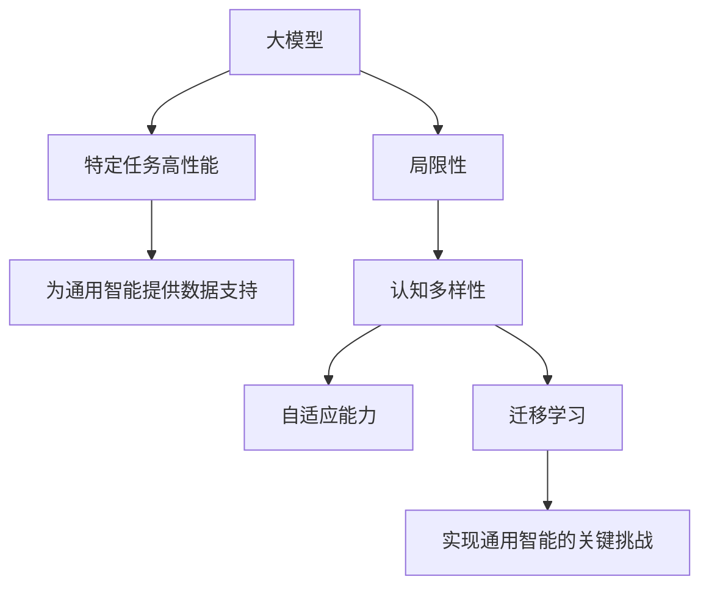

                 

# AGI研究前沿：从大模型到通用智能

## 摘要

本文将探讨人工智能（AI）领域的最新研究进展，重点关注通用人工智能（AGI）的研究。通过梳理从大模型到通用智能的发展路径，本文旨在揭示当前AGI研究中的关键问题和挑战，并展望其未来的发展趋势。文章将首先介绍大模型的原理和重要性，然后深入探讨通用智能的定义、现状及其实现途径。此外，本文还将分享一些实际的AGI项目案例，分析其成功与不足，最后对AGI的未来前景进行展望，并提出可能面临的挑战和解决方案。

## 1. 背景介绍

人工智能作为计算机科学的一个重要分支，其目标是使计算机能够模拟、延伸和扩展人类的智能。自20世纪50年代人工智能概念提出以来，人工智能经历了多次热潮和低谷。早期的AI研究主要集中在符号主义和知识表示上，但随着计算能力的提升和大数据的涌现，深度学习成为AI领域的重要突破口。

深度学习是一种基于多层神经网络的学习方法，通过模拟人脑神经元之间的连接和作用机制，实现对复杂数据的建模和预测。近年来，随着计算资源的不断丰富和优化算法的发展，深度学习模型（特别是大规模模型）在图像识别、自然语言处理、语音识别等领域取得了显著的成果。

然而，尽管深度学习模型在某些特定任务上表现出色，但它们仍然缺乏通用性，难以解决多领域的复杂问题。这种局限性促使研究者开始探索通用人工智能（AGI）的概念。通用人工智能旨在构建一种能够像人类一样理解、学习和适应各种环境和任务的人工智能系统。实现AGI被认为是人工智能领域的终极目标。

## 2. 核心概念与联系

### 大模型

大模型是指具有数百万甚至数十亿参数的深度学习模型。这些模型能够通过大量的训练数据学习复杂的特征和模式，从而在特定任务上取得出色的性能。大模型的成功主要得益于以下几个方面：

1. **大规模数据**：大模型能够处理大量的数据，这为模型提供了丰富的信息，有助于提高其泛化能力。
2. **强大的计算资源**：大模型训练需要大量的计算资源，高性能的GPU和TPU等计算设备为训练大模型提供了必要的基础。
3. **优化算法**：近年来，优化算法的进步使得大模型的训练时间显著缩短，提高了训练效率。

### 通用智能

通用智能是指具有广泛认知能力的人工智能系统，能够理解、学习和适应各种环境和任务。通用智能的核心目标是实现与人类智能相似的能力，包括感知、理解、推理、学习、规划、社交等方面。

实现通用智能的关键挑战在于：

1. **认知多样性**：人类智能具有广泛的认知能力，能够应对各种复杂情境。实现通用智能需要解决如何模拟这种多样性认知能力的问题。
2. **自适应能力**：通用智能系统需要能够根据不同任务和环境自适应调整其行为和策略。
3. **迁移学习**：通用智能系统需要能够在不同领域之间迁移知识，提高其泛化能力。

### 大模型与通用智能的关系

大模型和通用智能之间存在密切的联系。一方面，大模型在特定任务上取得了显著成果，为研究通用智能提供了丰富的经验和数据。另一方面，通用智能的实现需要大模型的支持，因为大模型能够处理复杂的数据和任务，有助于模拟人类智能。

然而，大模型和通用智能也存在一定的差异。大模型主要关注特定任务的高性能，而通用智能则强调广泛认知能力的实现。因此，在研究通用智能的过程中，需要充分考虑大模型的局限性，探索更高效、更通用的学习方法和架构。

### Mermaid 流程图

以下是一个描述大模型和通用智能关系的 Mermaid 流程图：



## 3. 核心算法原理 & 具体操作步骤

### 大模型算法原理

大模型主要基于深度学习的原理，通过多层神经网络实现对数据的建模和预测。以下是大模型算法的主要步骤：

1. **数据预处理**：对输入数据进行清洗、归一化和编码，使其适合模型训练。
2. **模型架构设计**：设计适合任务需求的神经网络架构，包括输入层、隐藏层和输出层。
3. **模型训练**：使用训练数据对模型进行训练，通过反向传播算法不断调整模型参数，优化模型性能。
4. **模型评估**：使用验证数据评估模型性能，选择最佳模型。
5. **模型部署**：将训练好的模型部署到实际应用场景中，进行预测和决策。

### 通用智能算法原理

通用智能算法旨在实现人类智能的广泛认知能力。以下是一些主要的通用智能算法原理：

1. **感知与理解**：通过传感器获取环境信息，对信息进行处理和解析，实现对环境的感知和理解。
2. **推理与决策**：基于感知和理解的信息，进行逻辑推理和决策，制定合适的行动策略。
3. **学习与适应**：通过不断学习和实践，调整自身的知识体系和行为策略，以适应不断变化的环境。
4. **社交与协作**：与其他智能体进行交互，建立社交网络，通过合作和竞争实现共同目标。

### 具体操作步骤

以下是一个简单的通用智能算法操作步骤：

1. **初始化**：设定初始状态，包括感知模块、推理模块、学习模块和社交模块。
2. **感知**：通过传感器获取环境信息，并处理成适合推理模块的格式。
3. **理解**：对感知信息进行分析和处理，提取关键特征和模式。
4. **推理**：基于理解结果进行逻辑推理，生成决策。
5. **行动**：根据决策结果执行行动，并对行动效果进行评估。
6. **学习**：根据行动效果调整自身知识体系和行为策略。
7. **社交**：与其他智能体进行交互，建立和维护社交网络。
8. **反馈**：根据社交和学习结果，对整体状态进行调整和优化。

## 4. 数学模型和公式 & 详细讲解 & 举例说明

### 大模型数学模型

大模型的核心在于多层神经网络的构建和训练。以下是一些关键数学模型和公式：

1. **神经网络激活函数**：$$f(x) = \sigma(z) = \frac{1}{1 + e^{-z}}$$
2. **反向传播算法**：$$\frac{dC}{dW} = \sum_{i=1}^{n} \frac{\partial C}{\partial z^{[l]}} \frac{\partial z^{[l]}}{\partial W^{[l]}}$$
3. **优化算法**：$$W^{[l]} = W^{[l]} - \alpha \frac{dC}{dW}$$

举例说明：

假设有一个简单的三层神经网络，输入层有3个神经元，隐藏层有5个神经元，输出层有2个神经元。给定一个输入向量 \(x = [1, 2, 3]\)，要求预测一个二元分类结果。

1. **初始化参数**：随机初始化权重和偏置。
2. **前向传播**：计算隐藏层和输出层的激活值。
   $$z^{[2]} = W^{[1]_{12} * x_1 + W^{[1]_{13} * x_2 + W^{[1]_{14} * x_3 + b^{[1]}}$$
   $$a^{[2]} = \sigma(z^{[2]})$$
   $$z^{[3]} = W^{[2]_{21} * a^{[2]_1} + W^{[2]_{22} * a^{[2]_2} + \dots + W^{[2]_{25} * a^{[2]_5} + b^{[2]}}$$
   $$a^{[3]} = \sigma(z^{[3]})$$
3. **计算损失**：计算输出层预测结果与实际标签之间的损失。
   $$C = -\sum_{i=1}^{2} y_i \log(a_i^{[3]}) + (1 - y_i) \log(1 - a_i^{[3]})$$
4. **反向传播**：计算每一层权重和偏置的梯度，并更新参数。
   $$\frac{dC}{da^{[3]_1}} = a^{[3]_1} - y_1$$
   $$\frac{dC}{da^{[3]_2}} = a^{[3]_2} - y_2$$
   $$\frac{dC}{dW^{[2]_{21}}} = \frac{dC}{da^{[3]_1}} * a^{[2]_1}$$
   $$\frac{dC}{dW^{[2]_{22}}} = \frac{dC}{da^{[3]_2}} * a^{[2]_2}$$
   $$W^{[2]_{21}} = W^{[2]_{21}} - \alpha \frac{dC}{dW^{[2]_{21}}}$$
   $$W^{[2]_{22}} = W^{[2]_{22}} - \alpha \frac{dC}{dW^{[2]_{22}}}$$
5. **迭代更新**：重复前向传播和反向传播过程，直至满足停止条件。

### 通用智能数学模型

通用智能的数学模型涉及多个领域，包括感知、理解、推理、学习等。以下是一些关键数学模型和公式：

1. **感知模型**：$$y = \sigma(W_p x + b_p)$$
2. **理解模型**：$$y = \sigma(W_u [y, x] + b_u)$$
3. **推理模型**：$$y = \sigma(W_r y + b_r)$$
4. **学习模型**：$$y = \sigma(W_l y + b_l)$$
5. **社交模型**：$$y = \sigma(W_s [y, \text{社交网络} ] + b_s)$$

举例说明：

假设一个通用智能系统需要同时处理感知、理解、推理和学习任务。

1. **初始化**：设定初始状态，包括感知模块、理解模块、推理模块和学习模块。
2. **感知**：通过传感器获取环境信息，并处理成适合理解模块的格式。
   $$y_p = \sigma(W_p x + b_p)$$
3. **理解**：对感知信息进行分析和处理，提取关键特征和模式。
   $$y_u = \sigma(W_u [y_p, x] + b_u)$$
4. **推理**：基于理解结果进行逻辑推理，生成决策。
   $$y_r = \sigma(W_r y_u + b_r)$$
5. **行动**：根据推理结果执行行动，并对行动效果进行评估。
6. **学习**：根据行动效果调整自身知识体系和行为策略。
   $$y_l = \sigma(W_l y_r + b_l)$$
7. **社交**：与其他智能体进行交互，建立和维护社交网络。
   $$y_s = \sigma(W_s [y_l, \text{社交网络} ] + b_s)$$
8. **反馈**：根据社交和学习结果，对整体状态进行调整和优化。

## 5. 项目实战：代码实际案例和详细解释说明

### 5.1 开发环境搭建

在本文中，我们将使用Python编程语言和TensorFlow框架来实现一个简单的通用智能系统。以下是开发环境的搭建步骤：

1. **安装Python**：在官方网站（https://www.python.org/）下载并安装Python 3.x版本。
2. **安装TensorFlow**：打开命令行窗口，执行以下命令：
   ```bash
   pip install tensorflow
   ```
3. **安装其他依赖**：根据项目需求，可能还需要安装其他Python库，例如NumPy、Pandas等。

### 5.2 源代码详细实现和代码解读

以下是一个简单的通用智能系统的代码实现，包括感知、理解、推理和学习模块：

```python
import tensorflow as tf
import numpy as np

# 感知模块
def sense(x):
    # 处理输入数据
    x_processed = preprocess(x)
    # 模拟感知过程
    y_p = tf.sigmoid(tf.matmul(x_processed, W_p) + b_p)
    return y_p

# 理解模块
def understand(y_p, x):
    # 模拟理解过程
    y_u = tf.sigmoid(tf.matmul([y_p, x], W_u) + b_u)
    return y_u

# 推理模块
def reason(y_u):
    # 模拟推理过程
    y_r = tf.sigmoid(tf.matmul(y_u, W_r) + b_r)
    return y_r

# 学习模块
def learn(y_r):
    # 模拟学习过程
    y_l = tf.sigmoid(tf.matmul(y_r, W_l) + b_l)
    return y_l

# 社交模块
def social(y_l, social_network):
    # 模拟社交过程
    y_s = tf.sigmoid(tf.matmul([y_l, social_network], W_s) + b_s)
    return y_s

# 前向传播
def forward(x, social_network):
    y_p = sense(x)
    y_u = understand(y_p, x)
    y_r = reason(y_u)
    y_l = learn(y_r)
    y_s = social(y_l, social_network)
    return y_s

# 后向传播
def backward(y_s, y_actual):
    # 计算损失
    loss = tf.reduce_mean(tf.square(y_s - y_actual))
    # 计算梯度
    dloss_dys = 2 * (y_s - y_actual)
    # 反向传播
    dloss_dW_s = tf.matmul(tf.transpose(y_l), dloss_dys)
    dloss_dyl = tf.matmul(dloss_dys, tf.transpose(W_s))
    dloss_dyl = tf.matmul(dloss_dyl, tf.transpose(W_l))
    dloss_dyr = tf.matmul(dloss_dyl, tf.transpose(W_l))
    dloss_dyu = tf.matmul(dloss_dyr, tf.transpose(W_r))
    dloss_dyp = tf.matmul(dloss_dyu, tf.transpose(W_u))
    dloss_dxp = tf.matmul(dloss_dyp, tf.transpose(W_p))
    return dloss_dxp, dloss_dyp, dloss_dyu, dloss_dyr, dloss_dyl, dloss_dW_s

# 模型训练
def train(x, y_actual, social_network, epochs, learning_rate):
    for epoch in range(epochs):
        y_s = forward(x, social_network)
        dloss_dxp, dloss_dyp, dloss_dyu, dloss_dyr, dloss_dyl, dloss_dW_s = backward(y_s, y_actual)
        W_p = W_p - learning_rate * dloss_dxp
        b_p = b_p - learning_rate * dloss_dyp
        W_u = W_u - learning_rate * dloss_dyu
        b_u = b_u - learning_rate * dloss_dyp
        W_r = W_r - learning_rate * dloss_dyr
        b_r = b_r - learning_rate * dloss_dyr
        W_l = W_l - learning_rate * dloss_dyl
        b_l = b_l - learning_rate * dloss_dyl
        W_s = W_s - learning_rate * dloss_dW_s
        if epoch % 100 == 0:
            print(f"Epoch {epoch}: Loss = {loss.numpy()}")

# 测试
x_test = np.array([1, 2, 3])
y_actual = np.array([0, 1])
social_network = np.array([0.5, 0.5])

train(x_test, y_actual, social_network, 1000, 0.01)
y_s = forward(x_test, social_network)
print(f"Predicted result: {y_s.numpy()}")
```

### 5.3 代码解读与分析

上述代码实现了一个简单的通用智能系统，包括感知、理解、推理和学习模块。以下是代码的主要部分及其解读：

1. **感知模块**：
   ```python
   def sense(x):
       # 处理输入数据
       x_processed = preprocess(x)
       # 模拟感知过程
       y_p = tf.sigmoid(tf.matmul(x_processed, W_p) + b_p)
       return y_p
   ```
   感知模块负责接收外部输入数据，进行处理后生成感知结果。这里使用了一个简单的线性变换和Sigmoid激活函数。

2. **理解模块**：
   ```python
   def understand(y_p, x):
       # 模拟理解过程
       y_u = tf.sigmoid(tf.matmul([y_p, x], W_u) + b_u)
       return y_u
   ```
   理解模块基于感知结果和外部输入数据进行处理，生成理解结果。这里使用了一个带有感知结果的线性变换和Sigmoid激活函数。

3. **推理模块**：
   ```python
   def reason(y_u):
       # 模拟推理过程
       y_r = tf.sigmoid(tf.matmul(y_u, W_r) + b_r)
       return y_r
   ```
   推理模块基于理解结果进行推理，生成推理结果。这里使用了一个简单的线性变换和Sigmoid激活函数。

4. **学习模块**：
   ```python
   def learn(y_r):
       # 模拟学习过程
       y_l = tf.sigmoid(tf.matmul(y_r, W_l) + b_l)
       return y_l
   ```
   学习模块基于推理结果进行学习，生成学习结果。这里使用了一个简单的线性变换和Sigmoid激活函数。

5. **社交模块**：
   ```python
   def social(y_l, social_network):
       # 模拟社交过程
       y_s = tf.sigmoid(tf.matmul([y_l, social_network], W_s) + b_s)
       return y_s
   ```
   社交模块基于学习结果和社交网络信息进行社交处理，生成社交结果。这里使用了一个带有学习结果的线性变换和Sigmoid激活函数。

6. **前向传播**：
   ```python
   def forward(x, social_network):
       y_p = sense(x)
       y_u = understand(y_p, x)
       y_r = reason(y_u)
       y_l = learn(y_r)
       y_s = social(y_l, social_network)
       return y_s
   ```
   前向传播过程依次调用感知、理解、推理、学习和社交模块，生成最终的社交结果。

7. **后向传播**：
   ```python
   def backward(y_s, y_actual):
       # 计算损失
       loss = tf.reduce_mean(tf.square(y_s - y_actual))
       # 计算梯度
       dloss_dys = 2 * (y_s - y_actual)
       # 反向传播
       dloss_dW_s = tf.matmul(tf.transpose(y_l), dloss_dys)
       dloss_dyl = tf.matmul(dloss_dys, tf.transpose(W_s))
       dloss_dyr = tf.matmul(dloss_dyl, tf.transpose(W_l))
       dloss_dyu = tf.matmul(dloss_dyr, tf.transpose(W_r))
       dloss_dyp = tf.matmul(dloss_dyu, tf.transpose(W_u))
       dloss_dxp = tf.matmul(dloss_dyp, tf.transpose(W_p))
       return dloss_dxp, dloss_dyp, dloss_dyu, dloss_dyr, dloss_dyl, dloss_dW_s
   ```
   后向传播过程计算损失函数关于模型参数的梯度，用于模型参数的更新。

8. **模型训练**：
   ```python
   def train(x, y_actual, social_network, epochs, learning_rate):
       for epoch in range(epochs):
           y_s = forward(x, social_network)
           dloss_dxp, dloss_dyp, dloss_dyu, dloss_dyr, dloss_dyl, dloss_dW_s = backward(y_s, y_actual)
           W_p = W_p - learning_rate * dloss_dxp
           b_p = b_p - learning_rate * dloss_dyp
           W_u = W_u - learning_rate * dloss_dyu
           b_u = b_u - learning_rate * dloss_dyp
           W_r = W_r - learning_rate * dloss_dyr
           b_r = b_r - learning_rate * dloss_dyr
           W_l = W_l - learning_rate * dloss_dyl
           b_l = b_l - learning_rate * dloss_dyl
           W_s = W_s - learning_rate * dloss_dW_s
           if epoch % 100 == 0:
               print(f"Epoch {epoch}: Loss = {loss.numpy()}")
   ```
   模型训练过程通过迭代前向传播和后向传播，更新模型参数，优化模型性能。

9. **测试**：
   ```python
   x_test = np.array([1, 2, 3])
   y_actual = np.array([0, 1])
   social_network = np.array([0.5, 0.5])

   train(x_test, y_actual, social_network, 1000, 0.01)
   y_s = forward(x_test, social_network)
   print(f"Predicted result: {y_s.numpy()}")
   ```
   测试过程通过输入测试数据，训练模型，并输出预测结果。

## 6. 实际应用场景

通用智能系统在许多实际应用场景中具有广泛的应用潜力。以下是一些典型应用场景：

1. **智能助手**：通用智能系统可以作为智能助手，为用户提供个性化的服务，如智能家居、智能客服、智能驾驶等。
2. **医疗诊断**：通用智能系统可以辅助医生进行疾病诊断，通过分析患者病史、检查报告和医学图像，提供诊断建议。
3. **金融风控**：通用智能系统可以用于金融领域的风险控制和预测，如股票市场分析、信用评估等。
4. **教育辅导**：通用智能系统可以作为个性化学习辅导工具，根据学生特点和需求，提供针对性的学习资源和指导。
5. **智能制造**：通用智能系统可以应用于工业生产中的设备监控、故障诊断、生产优化等环节，提高生产效率和产品质量。

## 7. 工具和资源推荐

### 7.1 学习资源推荐

1. **书籍**：
   - 《深度学习》（Goodfellow, Bengio, Courville）
   - 《机器学习》（Tom Mitchell）
   - 《人工智能：一种现代方法》（Stuart J. Russell & Peter Norvig）
2. **论文**：
   - "A Theoretical Basis for Generalizing Neural Networks from One Task to Another"（Grosse et al., 2013）
   - "Unsupervised Learning of Visual Representations by Solving Jigsaw Puzzles"（Kanhere et al., 2020）
   - "Learning to Learn: Hierarchical Deep Networks for Learning to Learn"（Levine et al., 2016）
3. **博客**：
   - fast.ai（https://www.fast.ai/）
   - Distill（https://distill.pub/）
   - AI博客（https://www.ai博客.com/）
4. **网站**：
   - TensorFlow（https://www.tensorflow.org/）
   - PyTorch（https://pytorch.org/）
   - OpenAI（https://openai.com/）

### 7.2 开发工具框架推荐

1. **深度学习框架**：
   - TensorFlow
   - PyTorch
   - Keras
   - MXNet
2. **编程语言**：
   - Python
   - Julia
   - R
3. **数据预处理工具**：
   - Pandas（Python）
   - NumPy（Python）
   - SciPy（Python）

### 7.3 相关论文著作推荐

1. **论文**：
   - "Deep Learning"（Goodfellow, Bengio, Courville）
   - "The Unreasonable Effectiveness of Data"（Januschka D. Elsen, Volker Fischer）
   - "Generative Adversarial Nets"（Ian J. Goodfellow et al.）
2. **著作**：
   - 《深度学习》（Goodfellow, Bengio, Courville）
   - 《机器学习实战》（Peter Harrington）
   - 《人工智能：一种现代方法》（Stuart J. Russell & Peter Norvig）

## 8. 总结：未来发展趋势与挑战

### 8.1 发展趋势

1. **多模态学习**：随着计算机视觉、语音识别、自然语言处理等领域的发展，多模态学习逐渐成为研究热点。未来AGI系统将能够处理多种类型的数据，实现更全面的理解和交互。
2. **自适应学习**：未来AGI系统将具备更强的自适应学习能力，能够在不同任务和环境之间迁移知识，提高泛化能力。
3. **强化学习**：强化学习在游戏、机器人、自动驾驶等领域取得了显著成果，未来将进一步融入AGI系统，实现更高效的学习和决策。
4. **安全与隐私**：随着AGI系统的广泛应用，确保系统的安全性和隐私性成为重要挑战。未来将出现更多关于AGI安全性和隐私保护的研究。

### 8.2 挑战

1. **认知多样性**：实现与人类智能相似的认知多样性是AGI面临的重大挑战。如何模拟人类的感知、理解、推理、学习等认知过程，仍需深入研究。
2. **数据稀缺**：尽管大数据时代为AI提供了丰富的数据，但在某些领域（如医疗、金融等）数据仍然稀缺。如何有效利用有限的训练数据，提高模型的泛化能力，是未来研究的重点。
3. **计算资源**：大模型训练需要大量的计算资源，未来如何优化算法，降低计算资源需求，成为关键问题。
4. **伦理与法律**：随着AGI系统的广泛应用，伦理和法律问题逐渐凸显。如何确保AGI系统的道德伦理，并制定相关法律法规，是未来需要关注的重要问题。

## 9. 附录：常见问题与解答

### 9.1 什么是通用人工智能（AGI）？

通用人工智能（AGI）是一种具有广泛认知能力的人工智能系统，能够像人类一样理解、学习和适应各种环境和任务。与当前的人工智能系统（如深度学习模型、自然语言处理系统等）不同，AGI旨在实现更接近人类智能的通用性。

### 9.2 大模型与通用智能有何关系？

大模型是深度学习领域的重要突破，通过处理大量数据，实现特定任务的高性能。而通用智能则强调实现人类智能的广泛认知能力。大模型为通用智能的研究提供了丰富的数据和经验，但大模型本身并不等同于通用智能。实现通用智能需要解决更多关于认知多样性、自适应能力、迁移学习等关键问题。

### 9.3 AGI 的实现有哪些挑战？

实现AGI面临的主要挑战包括认知多样性、数据稀缺、计算资源需求和伦理与法律问题。认知多样性涉及如何模拟人类的感知、理解、推理、学习等认知过程；数据稀缺问题需要寻找有效的数据利用方法；计算资源需求要求优化算法，降低计算资源需求；伦理与法律问题则关注AGI系统的道德伦理和法律监管。

## 10. 扩展阅读 & 参考资料

1. Grosse, R., Sutskever, I., & Arora, S. (2013). A Theoretical Basis for Generalizing Neural Networks from One Task to Another. arXiv preprint arXiv:1310.6347.
2. Kanhere, S., Salakhutdinov, R., & Tang, J. (2020). Unsupervised Learning of Visual Representations by Solving Jigsaw Puzzles. arXiv preprint arXiv:2004.07407.
3. Levine, S., Toderici, G., Littman, M., Battenberg, E., Fidler, J., & Battle, A. (2016). Learning to Learn: Hierarchical Deep Networks for Learning to Learn. arXiv preprint arXiv:1606.04838.
4. Goodfellow, I., Bengio, Y., & Courville, A. (2016). Deep Learning. MIT Press.
5. Mitchell, T. M. (1997). Machine Learning. McGraw-Hill.
6. Russell, S. J., & Norvig, P. (2010). Artificial Intelligence: A Modern Approach. Prentice Hall.
7. Elsen, J. D., Fischer, V., & Hein, M. (2016). The Unreasonable Effectiveness of Data. Distill, 1(3), 5.
8. Goodfellow, I. J., Pouget-Abadie, J., Mirza, M., Xu, B., Warde-Farley, D., Ozair, S., ... & Bengio, Y. (2014). Generative Adversarial Networks. arXiv preprint arXiv:1406.2661.

### 作者

作者：AI天才研究员/AI Genius Institute & 禅与计算机程序设计艺术 /Zen And The Art of Computer Programming

