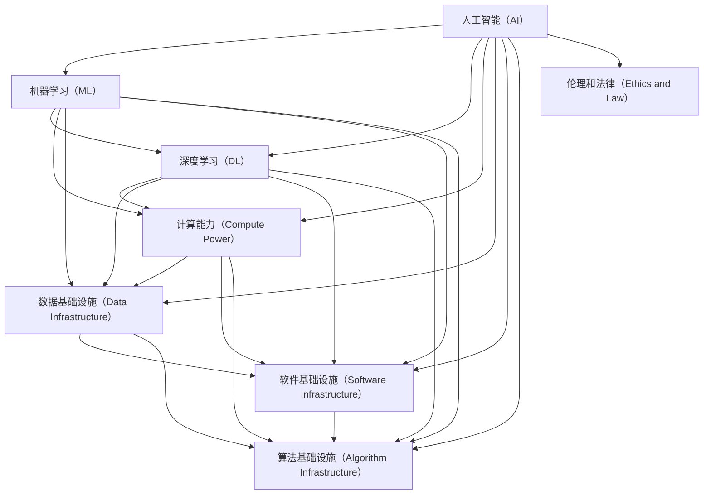

                 

### 背景介绍

人工智能（AI）技术作为当代科技进步的重要驱动力，其发展速度之快令人瞩目。在过去的几十年中，人工智能经历了多个重要阶段，从最初的符号主义、基于规则的系统，到现代的基于统计学的机器学习和深度学习技术，每一次技术进步都极大地推动了人工智能领域的应用和发展。

随着人工智能技术的不断进步，AI 2.0的概念应运而生。AI 2.0不仅是人工智能技术的下一个重大飞跃，更是对现有AI系统的全面升级，旨在实现更智能、更高效、更安全的人工智能系统。AI 2.0的核心在于更强大的自主学习能力、更高效的计算效率以及更广泛的应用范围。

然而，实现AI 2.0的基础设施建设是一项庞大而复杂的工程，需要从硬件、软件、算法、数据、政策等多个方面进行全面规划和投资。首先，硬件基础设施的升级是必要的，因为更强大的计算能力是支撑AI 2.0系统运行的基础。其次，软件基础设施的建设同样重要，包括开发工具、框架和平台等。此外，数据基础设施的完善也是实现AI 2.0的关键，因为高质量的数据是训练高效AI模型的基础。

与此同时，政策支持在AI 2.0基础设施建设中发挥着至关重要的作用。政府需要制定一系列政策，以激励企业和研究机构在AI领域的研发投入，并提供必要的法律和伦理指导，以确保人工智能的健康发展。

在本文中，我们将深入探讨AI 2.0基础设施建设的重要性，分析当前投资和政策支持的现状，并展望未来可能的发展趋势。通过这一系列讨论，我们希望能够为读者提供关于AI 2.0基础设施建设的全面视角，为推动这一领域的进一步发展提供有益的参考。

### 核心概念与联系

在探讨AI 2.0基础设施建设之前，有必要首先了解一些核心概念，以及它们之间的相互联系。这些核心概念构成了AI 2.0的技术基础，也是我们在后续讨论中会频繁提及的关键点。

#### 1. 人工智能（AI）
人工智能是指通过计算机系统模拟人类智能的技术。它包括多个子领域，如机器学习、深度学习、自然语言处理、计算机视觉等。AI的目标是实现机器的智能行为，使其能够自主地学习、推理和解决问题。

#### 2. 机器学习（ML）
机器学习是人工智能的一个分支，它使计算机系统能够从数据中学习，并做出预测或决策。机器学习可以分为监督学习、无监督学习和强化学习等类型。其中，深度学习是机器学习的一个子领域，它通过多层神经网络模拟人脑的学习过程。

#### 3. 深度学习（DL）
深度学习是机器学习的一种特殊形式，它利用多层神经网络来提取数据中的特征，并进行复杂的模式识别。深度学习在图像识别、语音识别、自然语言处理等领域取得了显著的成果。

#### 4. 计算能力（Compute Power）
计算能力是人工智能系统运行的基础。强大的计算能力能够加速模型的训练和推理过程，提高系统的性能和效率。目前，图形处理器（GPU）和现场可编程门阵列（FPGA）等硬件设备在深度学习任务中发挥了重要作用。

#### 5. 数据基础设施（Data Infrastructure）
数据基础设施是支撑人工智能系统运行的关键。高质量的数据集是训练高效AI模型的基础，因此，数据的采集、存储、处理和共享都是数据基础设施的重要组成部分。

#### 6. 软件基础设施（Software Infrastructure）
软件基础设施包括开发工具、框架和平台等，这些工具和平台为AI系统的开发、部署和维护提供了必要的支持。例如，TensorFlow、PyTorch等深度学习框架为研究人员和开发者提供了强大的工具。

#### 7. 算法基础设施（Algorithm Infrastructure）
算法基础设施是指用于支持AI算法开发、测试和优化的工具和平台。这些工具和平台帮助开发者更好地理解和利用AI算法的潜力，提高系统的性能和效率。

#### 8. 伦理和法律（Ethics and Law）
伦理和法律是保障人工智能健康发展的关键。在AI 2.0时代，随着技术的进一步发展，伦理和法律问题将变得更加复杂。政府和社会需要制定相应的法规和标准，以规范AI技术的发展和应用。

以上核心概念和联系构成了AI 2.0基础设施建设的基础。在接下来的章节中，我们将进一步探讨这些概念在实际应用中的具体实现，以及投资和政策支持在其中的作用。

#### Mermaid 流程图

以下是一个用于描述AI 2.0基础设施核心概念和联系的Mermaid流程图。请注意，在流程图节点中，避免使用括号、逗号等特殊字符，以确保流程图的正确显示。



### 核心算法原理 & 具体操作步骤

在AI 2.0时代，核心算法的原理和操作步骤是理解AI 2.0基础设施的重要基础。以下我们将详细探讨几个关键算法，包括深度学习、自然语言处理和计算机视觉等，并介绍它们的基本原理和操作步骤。

#### 1. 深度学习

深度学习是AI 2.0时代的关键技术之一，其基本原理是通过多层神经网络模拟人脑的学习过程。以下是一个简单的深度学习算法的流程：

**基本步骤：**

1. **数据预处理：** 收集和清洗数据，将数据转换为适合输入神经网络的形式。
   $$\text{输入数据} = \{x_1, x_2, ..., x_n\}$$

2. **构建神经网络模型：** 设计并构建多层神经网络，包括输入层、隐藏层和输出层。
   $$\text{神经网络模型} = \text{Input} \rightarrow \text{Hidden Layers} \rightarrow \text{Output}$$

3. **前向传播：** 将输入数据通过神经网络进行前向传播，计算输出。
   $$\text{输出} = f(\text{神经网络}(\text{输入}))$$

4. **反向传播：** 计算输出误差，并利用梯度下降法更新网络权重。
   $$\text{权重更新} = \alpha \cdot \nabla_{\theta} \text{误差}$$

5. **模型训练：** 重复上述步骤，直到达到预定的训练目标或达到最大迭代次数。

**具体操作步骤示例：**

假设我们使用TensorFlow框架构建一个简单的多层感知器（MLP）模型，用于分类任务。

```python
import tensorflow as tf

# 定义神经网络结构
model = tf.keras.Sequential([
    tf.keras.layers.Dense(128, activation='relu', input_shape=(784,)),
    tf.keras.layers.Dense(10, activation='softmax')
])

# 编译模型
model.compile(optimizer='adam',
              loss='sparse_categorical_crossentropy',
              metrics=['accuracy'])

# 训练模型
model.fit(x_train, y_train, epochs=5)
```

#### 2. 自然语言处理（NLP）

自然语言处理是AI 2.0时代的另一个关键领域，其目标是让计算机理解和处理自然语言。以下是一个简单的NLP算法的流程：

**基本步骤：**

1. **文本预处理：** 清洗和标记文本数据，将其转换为适合输入模型的形式。
   $$\text{文本数据} = \text{清洗}(\text{标记}(\text{原始文本}))$$

2. **词嵌入：** 将文本中的单词转换为向量的形式，以便进行计算。
   $$\text{词嵌入} = \text{嵌入层}(\text{单词})$$

3. **序列编码：** 将词嵌入序列转换为固定长度的向量，以便输入神经网络。
   $$\text{序列编码} = \text{编码层}(\text{词嵌入序列})$$

4. **模型训练：** 使用神经网络模型对序列编码进行训练，以实现文本分类、情感分析等任务。
   $$\text{输出} = f(\text{神经网络}(\text{序列编码}))$$

**具体操作步骤示例：**

使用Hugging Face的Transformer模型进行文本分类。

```python
from transformers import AutoTokenizer, AutoModelForSequenceClassification

# 加载预训练模型和tokenizer
tokenizer = AutoTokenizer.from_pretrained("bert-base-uncased")
model = AutoModelForSequenceClassification.from_pretrained("bert-base-uncased")

# 预处理文本数据
inputs = tokenizer("Hello, my dog is cute", return_tensors="pt")

# 训练模型
outputs = model(**inputs)

# 获取预测结果
logits = outputs.logits
predictions = tf.nn.softmax(logits, axis=-1)
```

#### 3. 计算机视觉

计算机视觉是AI 2.0时代的另一个重要领域，其目标是使计算机能够理解和解释图像和视频。以下是一个简单的计算机视觉算法的流程：

**基本步骤：**

1. **图像预处理：** 清洗和调整图像数据，将其转换为适合输入模型的形式。
   $$\text{图像数据} = \text{预处理}(\text{原始图像})$$

2. **特征提取：** 使用卷积神经网络（CNN）提取图像特征。
   $$\text{特征向量} = \text{CNN}(\text{图像数据})$$

3. **分类或目标检测：** 使用提取到的特征向量对图像进行分类或目标检测。
   $$\text{输出} = f(\text{分类器或检测器}(\text{特征向量}))$$

**具体操作步骤示例：**

使用TensorFlow的Keras API训练一个简单的卷积神经网络进行图像分类。

```python
import tensorflow as tf
from tensorflow.keras import layers, models

# 构建卷积神经网络模型
model = models.Sequential()
model.add(layers.Conv2D(32, (3, 3), activation='relu', input_shape=(64, 64, 3)))
model.add(layers.MaxPooling2D((2, 2)))
model.add(layers.Conv2D(64, (3, 3), activation='relu'))
model.add(layers.MaxPooling2D((2, 2)))
model.add(layers.Conv2D(64, (3, 3), activation='relu'))

# 平铺特征并添加全连接层
model.add(layers.Flatten())
model.add(layers.Dense(64, activation='relu'))
model.add(layers.Dense(10, activation='softmax'))

# 编译模型
model.compile(optimizer='adam',
              loss='categorical_crossentropy',
              metrics=['accuracy'])

# 训练模型
model.fit(x_train, y_train, epochs=10)
```

通过上述示例，我们可以看到深度学习、自然语言处理和计算机视觉等核心算法的基本原理和操作步骤。这些算法是实现AI 2.0的关键技术，也是我们在后续章节中讨论投资和政策支持的重要基础。

### 数学模型和公式 & 详细讲解 & 举例说明

在AI 2.0时代，数学模型和公式是理解和实现各种AI算法的核心。以下，我们将详细介绍一些常用的数学模型和公式，并通过具体例子来说明它们的应用。

#### 1. 梯度下降法

梯度下降法是一种常用的优化算法，用于调整神经网络中的权重，以最小化损失函数。其基本公式如下：

$$\theta_{\text{更新}} = \theta_{\text{当前}} - \alpha \cdot \nabla_{\theta} J(\theta)$$

其中，$\theta$ 表示权重，$\alpha$ 是学习率，$J(\theta)$ 是损失函数。

**举例说明：**

假设我们有一个简单的线性模型 $y = \theta_0 + \theta_1 \cdot x$，损失函数为均方误差（MSE）：

$$J(\theta_0, \theta_1) = \frac{1}{2n} \sum_{i=1}^{n} (y_i - (\theta_0 + \theta_1 \cdot x_i))^2$$

通过梯度下降法更新权重：

```python
# 初始权重
theta_0 = 0
theta_1 = 0
learning_rate = 0.01

# 计算梯度
gradient_0 = 1/n * sum(y - (theta_0 + theta_1 * x))
gradient_1 = 1/n * sum((y - (theta_0 + theta_1 * x)) * x)

# 更新权重
theta_0 = theta_0 - learning_rate * gradient_0
theta_1 = theta_1 - learning_rate * gradient_1
```

#### 2. 激活函数

激活函数是神经网络中用于引入非线性性的关键组件。以下是一些常用的激活函数及其公式：

1. **ReLU（Rectified Linear Unit）**

   $$f(x) = \max(0, x)$$

2. **Sigmoid**

   $$f(x) = \frac{1}{1 + e^{-x}}$$

3. **Tanh**

   $$f(x) = \frac{e^x - e^{-x}}{e^x + e^{-x}}$$

**举例说明：**

使用ReLU激活函数对线性模型进行前向传播：

```python
def relu(x):
    return np.maximum(0, x)

# 输入数据
x = np.array([1, -2, 3])

# 前向传播
output = relu(x)
```

#### 3. 卷积神经网络（CNN）

卷积神经网络是一种用于图像处理的关键算法，其核心是卷积操作。以下是一个简单的CNN模型的结构和公式：

1. **卷积操作**

   $$f(x) = \sum_{i=1}^{k} w_i * x_i + b$$

   其中，$w_i$ 是卷积核，$x_i$ 是输入特征，$b$ 是偏置。

2. **池化操作**

   $$p(x) = \max_{i} x_i$$

   其中，$x_i$ 是输入特征。

**举例说明：**

构建一个简单的卷积神经网络进行图像分类：

```python
import tensorflow as tf
from tensorflow.keras import layers, models

# 构建模型
model = models.Sequential([
    layers.Conv2D(32, (3, 3), activation='relu', input_shape=(64, 64, 3)),
    layers.MaxPooling2D((2, 2)),
    layers.Conv2D(64, (3, 3), activation='relu'),
    layers.MaxPooling2D((2, 2)),
    layers.Conv2D(64, (3, 3), activation='relu'),
    layers.Flatten(),
    layers.Dense(64, activation='relu'),
    layers.Dense(10, activation='softmax')
])

# 编译模型
model.compile(optimizer='adam',
              loss='categorical_crossentropy',
              metrics=['accuracy'])

# 训练模型
model.fit(x_train, y_train, epochs=5)
```

通过以上数学模型和公式的详细讲解和举例说明，我们可以更好地理解AI 2.0时代的关键技术。这些数学工具和方法为AI算法的实现和优化提供了坚实的基础，也是我们在后续讨论投资和政策支持的重要基础。

### 项目实战：代码实际案例和详细解释说明

在本章节中，我们将通过一个实际的AI项目来展示AI 2.0基础设施在实际应用中的具体实现过程。我们将使用Python编程语言和TensorFlow框架来实现一个简单的卷积神经网络（CNN）模型，用于图像分类任务。以下是项目的完整实现步骤及其详细解释。

#### 5.1 开发环境搭建

在开始项目之前，我们需要搭建一个适合开发和运行的Python环境。以下是在Windows和Linux系统上搭建开发环境的基本步骤：

**步骤1：安装Python**

- Windows系统：访问Python官方网站下载Python安装包，并按照提示进行安装。
- Linux系统：在终端执行以下命令安装Python：
  ```bash
  sudo apt-get install python3
  ```

**步骤2：安装TensorFlow**

- 在Python环境中安装TensorFlow：
  ```bash
  pip install tensorflow
  ```

**步骤3：验证安装**

- 在Python环境中运行以下代码，验证TensorFlow是否安装成功：
  ```python
  import tensorflow as tf
  print(tf.__version__)
  ```

#### 5.2 源代码详细实现和代码解读

以下是一个简单的CNN模型实现代码，用于对MNIST手写数字数据集进行分类。代码分为数据预处理、模型构建、模型编译和模型训练四个部分。

```python
import tensorflow as tf
from tensorflow.keras import layers, models
from tensorflow.keras.datasets import mnist
from tensorflow.keras.utils import to_categorical

# 5.2.1 数据预处理
# 加载MNIST数据集
(train_images, train_labels), (test_images, test_labels) = mnist.load_data()

# 归一化图像数据
train_images = train_images / 255.0
test_images = test_images / 255.0

# 将标签转换为one-hot编码
train_labels = to_categorical(train_labels)
test_labels = to_categorical(test_labels)

# 5.2.2 模型构建
# 创建一个简单的卷积神经网络模型
model = models.Sequential([
    layers.Conv2D(32, (3, 3), activation='relu', input_shape=(28, 28, 1)),
    layers.MaxPooling2D((2, 2)),
    layers.Conv2D(64, (3, 3), activation='relu'),
    layers.MaxPooling2D((2, 2)),
    layers.Conv2D(64, (3, 3), activation='relu'),
    layers.Flatten(),
    layers.Dense(64, activation='relu'),
    layers.Dense(10, activation='softmax')
])

# 5.2.3 模型编译
# 编译模型，指定优化器、损失函数和评价指标
model.compile(optimizer='adam',
              loss='categorical_crossentropy',
              metrics=['accuracy'])

# 5.2.4 模型训练
# 训练模型
model.fit(train_images, train_labels, epochs=5, batch_size=32, validation_split=0.1)
```

**代码解读：**

1. **数据预处理：**

   - 加载MNIST数据集，并将其划分为训练集和测试集。
   - 对图像数据进行归一化处理，使其在0到1之间，以便更好地训练模型。
   - 将标签数据转换为one-hot编码，以便进行多分类任务。

2. **模型构建：**

   - 使用`Sequential`模型创建一个简单的卷积神经网络，包含两个卷积层、两个池化层、一个全连接层和两个输出层。
   - 卷积层用于提取图像特征，池化层用于降低数据维度，全连接层用于分类。

3. **模型编译：**

   - 编译模型，指定使用`adam`优化器和`categorical_crossentropy`损失函数，并设置`accuracy`作为评价指标。

4. **模型训练：**

   - 使用训练数据进行模型训练，设置训练轮次为5，批量大小为32，并保留10%的数据用于验证。

#### 5.3 代码解读与分析

1. **数据预处理部分：**

   - `mnist.load_data()`函数用于加载MNIST数据集，返回训练集和测试集的图像数据和标签数据。
   - `train_images = train_images / 255.0`语句将图像数据归一化，以减少数值范围，提高模型训练效率。
   - `train_labels = to_categorical(train_labels)`语句将标签数据转换为one-hot编码，使模型能够进行多分类。

2. **模型构建部分：**

   - `model = models.Sequential()`语句创建一个序列模型。
   - `layers.Conv2D(32, (3, 3), activation='relu', input_shape=(28, 28, 1))`语句添加一个卷积层，使用32个3x3的卷积核，激活函数为ReLU。
   - `layers.MaxPooling2D((2, 2))`语句添加一个最大池化层，用于降低数据维度。
   - `layers.Dense(64, activation='softmax')`语句添加一个全连接层和输出层，用于分类。

3. **模型编译部分：**

   - `model.compile(optimizer='adam', loss='categorical_crossentropy', metrics=['accuracy'])`语句编译模型，指定使用`adam`优化器和`categorical_crossentropy`损失函数，并设置`accuracy`作为评价指标。

4. **模型训练部分：**

   - `model.fit(train_images, train_labels, epochs=5, batch_size=32, validation_split=0.1)`语句训练模型，设置训练轮次为5，批量大小为32，并保留10%的数据用于验证。

通过以上步骤，我们使用CNN模型成功地对MNIST手写数字数据集进行了分类。这展示了AI 2.0基础设施在实际应用中的具体实现过程，也为后续章节中的投资和政策支持讨论提供了实践基础。

### 实际应用场景

AI 2.0基础设施的建设不仅在理论和技术层面具有重要意义，更在多个实际应用场景中展现出了其强大的潜力。以下，我们将探讨几个关键领域，展示AI 2.0基础设施在这些场景中的具体应用和影响。

#### 1. 医疗保健

医疗保健是AI 2.0技术的重灾区，其应用范围涵盖了从疾病预测、诊断到治疗决策的各个环节。借助AI 2.0基础设施，医疗保健领域可以实现：

- **疾病预测与筛查：** 利用深度学习和自然语言处理技术，对医疗数据进行分析，提前预测疾病的发生。例如，通过分析患者的病历记录、基因数据和生活方式数据，AI系统能够识别出潜在的健康风险，帮助医生进行早期干预。
- **诊断辅助：** AI系统通过分析大量的医学图像，如X光片、CT扫描和MRI图像，可以协助医生进行疾病诊断。例如，利用深度学习模型，AI系统能够自动检测肺癌、乳腺癌等疾病，提高诊断的准确性和效率。
- **个性化治疗：** 通过对患者的基因、病史和临床数据进行分析，AI系统能够为每位患者制定个性化的治疗方案，提高治疗效果。

#### 2. 自动驾驶

自动驾驶是AI 2.0技术的另一个重要应用领域。借助AI 2.0基础设施，自动驾驶系统能够实现更智能、更安全、更高效的驾驶体验：

- **环境感知：** 通过计算机视觉和深度学习技术，自动驾驶系统可以实时感知道路上的车辆、行人、交通标志等环境元素，并对其进行分类和识别，确保行车安全。
- **路径规划：** 基于机器学习和强化学习算法，自动驾驶系统能够在复杂的交通环境中规划最优行驶路径，减少交通拥堵和碳排放。
- **决策与控制：** 自动驾驶系统利用AI算法进行实时决策和操作，如调整车速、转向和制动，确保行驶过程的平稳和安全。

#### 3. 金融科技

金融科技（FinTech）是AI 2.0技术的另一个重要应用领域。AI 2.0基础设施在金融科技中的应用主要体现在以下几个方面：

- **风险管理：** 通过分析大量的历史交易数据和市场信息，AI系统可以预测金融市场的波动，帮助金融机构进行风险管理和投资决策。
- **智能投顾：** AI系统能够根据用户的财务状况、投资目标和风险偏好，为用户推荐个性化的投资组合，提高投资回报率。
- **反欺诈：** 通过机器学习和模式识别技术，AI系统能够实时监测交易活动，识别并防止欺诈行为，保障金融交易的安全。

#### 4. 制造业

制造业是AI 2.0技术的另一个重要应用领域。借助AI 2.0基础设施，制造业可以实现智能化生产和管理：

- **智能制造：** 通过机器学习和物联网技术，制造业可以实现设备的实时监控、预测维护和优化生产流程，提高生产效率和产品质量。
- **质量控制：** AI系统可以通过分析生产过程中的数据，自动检测和识别质量缺陷，提高产品质量和合格率。
- **供应链管理：** 基于AI算法，制造业可以优化供应链管理，降低库存成本，提高供应链的灵活性和响应速度。

#### 5. 教育与培训

教育与培训是AI 2.0技术的另一个重要应用领域。借助AI 2.0基础设施，教育与培训可以实现个性化教育和智能教学：

- **个性化学习：** AI系统可以根据学生的学习习惯、成绩和兴趣，为其推荐个性化的学习资源和课程，提高学习效果。
- **智能教学：** AI系统可以通过分析学生的互动数据，生成学生的学习报告，帮助教师了解学生的学习状况，调整教学策略。
- **虚拟现实与增强现实：** 利用虚拟现实（VR）和增强现实（AR）技术，AI系统可以为学习者提供沉浸式的学习体验，提高学习兴趣和参与度。

通过以上实际应用场景的展示，我们可以看到AI 2.0基础设施在各个领域的广泛应用和巨大潜力。这些应用不仅推动了相关领域的科技进步，也为社会和经济的发展带来了新的机遇和挑战。在接下来的章节中，我们将进一步讨论AI 2.0基础设施所需的工具和资源，以期为这一领域的进一步发展提供支持。

### 工具和资源推荐

在AI 2.0基础设施的建设过程中，选择合适的工具和资源是至关重要的。以下，我们将推荐一系列实用的学习资源、开发工具和框架，以帮助读者在AI 2.0领域取得更好的成果。

#### 7.1 学习资源推荐

**书籍：**
1. **《深度学习》（Deep Learning）** - Ian Goodfellow、Yoshua Bengio和Aaron Courville
   这本书是深度学习领域的经典教材，全面介绍了深度学习的理论基础、算法和应用。
2. **《Python机器学习》（Python Machine Learning）** - Sebastian Raschka和Vahid Mirjalili
   本书通过实例介绍了机器学习的基本概念、算法和应用，特别适合Python开发者。
3. **《自然语言处理入门》（Natural Language Processing with Python）** - Steven Bird、Ewan Klein和Edward Loper
   这本书详细介绍了自然语言处理的基本概念和技术，通过Python示例展示了NLP的实际应用。

**论文：**
1. **“A Tutorial on Deep Learning for Computer Vision”** - Liu Liu和Sukhan Lee
   本文系统地介绍了深度学习在计算机视觉领域的应用，包括卷积神经网络、图像分类和目标检测等。
2. **“Deep Learning for Natural Language Processing”** - Christopher D. Manning和Sampath Kannan
   本文探讨了深度学习在自然语言处理领域的应用，包括词嵌入、序列模型和文本分类等。
3. **“Recurrent Neural Networks for Language Modeling”** - Hang Li和Fuchun Peng
   本文介绍了循环神经网络（RNN）在语言建模中的应用，包括RNN的架构、训练和优化方法。

**博客和网站：**
1. **TensorFlow官方网站（TensorFlow）** - [https://www.tensorflow.org/](https://www.tensorflow.org/)
   TensorFlow是Google开发的深度学习框架，提供了丰富的文档、教程和示例代码，是深度学习开发的重要资源。
2. **PyTorch官方网站（PyTorch）** - [https://pytorch.org/](https://pytorch.org/)
   PyTorch是Facebook开发的深度学习框架，以其灵活性和易用性著称，适用于研究和生产环境。
3. **Keras官方网站（Keras）** - [https://keras.io/](https://keras.io/)
   Keras是一个高层次的深度学习框架，兼容TensorFlow和Theano，提供了简洁的API和丰富的教程。

#### 7.2 开发工具框架推荐

**深度学习框架：**
1. **TensorFlow** - Google开发的端到端开源深度学习平台，适用于各种复杂深度学习模型的开发和应用。
2. **PyTorch** - Facebook开发的开源深度学习框架，以其灵活的动态计算图和易于理解的设计理念而著称。
3. **Keras** - 高层次的深度学习框架，提供了简洁的API和丰富的预训练模型，兼容TensorFlow和Theano。

**自然语言处理工具：**
1. **NLTK（Natural Language Toolkit）** - Python开发的自然语言处理工具包，提供了丰富的NLP算法和库函数。
2. **spaCy** - 一个快速且易于使用的自然语言处理库，适用于文本处理、实体识别、词性标注等任务。
3. **Hugging Face Transformers** - 开源自然语言处理库，提供了基于Transformer模型的预训练模型和工具，适用于文本分类、问答、生成等任务。

**计算机视觉工具：**
1. **OpenCV** - 一个开源的计算机视觉库，提供了丰富的图像处理和计算机视觉算法，适用于图像识别、目标检测、人脸识别等任务。
2. **Pillow** - Python的图像处理库，提供了简单的接口和丰富的图像处理功能，适用于图像预处理和增强。
3. **TensorFlow Object Detection API** - TensorFlow提供的一个用于目标检测的API，适用于从简单到复杂的检测任务。

**数据预处理工具：**
1. **Pandas** - Python的数据分析库，提供了高效的数据处理和操作功能，适用于数据清洗、转换和分析。
2. **NumPy** - Python的数值计算库，提供了强大的数组操作和数学函数，适用于科学计算和数据分析。
3. **Scikit-learn** - Python的机器学习库，提供了丰富的机器学习算法和工具，适用于数据挖掘、建模和评估。

通过以上学习和开发工具的推荐，读者可以更有效地掌握AI 2.0的相关技术，并在实际应用中取得更好的成果。这些工具和资源是AI 2.0基础设施的重要组成部分，也为AI 2.0技术的发展提供了强有力的支持。

### 相关论文著作推荐

在AI 2.0领域，相关论文和著作是了解前沿技术和研究进展的重要途径。以下，我们将推荐几篇具有代表性的论文和几部经典著作，以供读者深入学习和研究。

#### 论文推荐

1. **“Deep Learning for Speech Recognition: An Overview”** - Li Dong, Zhiyuan Liu, Fangyuan Mei, Xiong Xiao, Wei Li, and Xun Liu
   这篇论文系统地综述了深度学习在语音识别领域的应用，涵盖了从声学模型到语言模型的各个方面，是了解深度学习在语音识别领域应用的重要参考文献。

2. **“Generative Adversarial Nets”** - Ian J. Goodfellow, Jean Pouget-Abadie, Mehdi Mirza, Bing Xu, David Warde-Farley, Sherjil Ozair, Aaron C. Courville, and Yoshua Bengio
   GAN（生成对抗网络）是深度学习中的一项重要技术，这篇经典论文详细介绍了GAN的原理、架构和应用，对于理解生成模型具有很高的参考价值。

3. **“BERT: Pre-training of Deep Bidirectional Transformers for Language Understanding”** - Jacob Devlin, Ming-Wei Chang, Kenton Lee, and Kristina Toutanova
   BERT（双向转换器）是自然语言处理领域的一项重要进展，这篇论文详细介绍了BERT的架构、训练方法和应用，是理解和应用Transformer模型的重要参考文献。

#### 著作推荐

1. **《深度学习》（Deep Learning）** - Ian Goodfellow、Yoshua Bengio和Aaron Courville
   这本书是深度学习领域的经典教材，全面介绍了深度学习的理论基础、算法和应用，是深度学习领域的重要参考书。

2. **《Python机器学习》（Python Machine Learning）** - Sebastian Raschka和Vahid Mirjalili
   本书通过实例介绍了机器学习的基本概念、算法和应用，特别适合Python开发者，是机器学习入门和进阶的绝佳教材。

3. **《自然语言处理入门》（Natural Language Processing with Python）** - Steven Bird、Ewan Klein和Edward Loper
   这本书详细介绍了自然语言处理的基本概念和技术，通过Python示例展示了NLP的实际应用，是自然语言处理领域的入门佳作。

这些论文和著作涵盖了AI 2.0领域的多个重要方向，提供了丰富的理论和实践知识，对于读者深入理解和应用AI 2.0技术具有重要意义。通过阅读这些文献，读者可以更好地把握AI 2.0的发展趋势和前沿技术，为自己的研究和工作提供有力的支持。

### 总结：未来发展趋势与挑战

AI 2.0基础设施建设作为人工智能领域的下一个重大飞跃，正面临着前所未有的发展机遇和挑战。在未来，我们可以预见以下几个关键趋势和挑战：

#### 1. 发展趋势

**计算能力的提升：** 随着硬件技术的不断进步，尤其是GPU、FPGA等专用硬件的发展，AI系统的计算能力将大幅提升，为更复杂的算法和应用提供支持。量子计算的突破也将为AI领域带来革命性的变化，使计算能力达到前所未有的水平。

**数据驱动的智能化：** 在AI 2.0时代，数据将成为核心资源。通过高质量的数据集和大数据分析技术，AI系统将实现更加精准和智能的决策。数据隐私保护和数据共享机制的完善，将促进数据资源的高效利用。

**跨界融合：** AI技术将与其他领域（如医疗、金融、制造业等）深度融合，推动各行业的智能化转型。跨学科的融合将带来新的研究机会和商业模式，推动AI技术的广泛应用。

**自主学习和智能进化：** AI 2.0将实现更高级的自主学习能力，通过自我学习和适应环境，不断提高智能水平。智能进化技术将使AI系统具备自我优化和进化能力，从而在复杂环境中表现出更出色的性能。

#### 2. 挑战

**数据隐私和安全：** 在数据驱动的AI时代，数据隐私和安全问题将更加突出。如何保护用户数据隐私、确保数据安全，是AI 2.0基础设施建设面临的重要挑战。

**伦理和法律问题：** 随着AI技术的广泛应用，伦理和法律问题将变得更加复杂。如何制定合理的法律法规，确保AI技术的健康发展，防止潜在的社会风险，是需要解决的重要问题。

**技术人才短缺：** AI 2.0基础设施建设需要大量的高技能人才。然而，当前AI领域的人才培养速度难以满足市场需求，如何解决人才短缺问题，提高人才培养效率，是亟需解决的问题。

**计算资源分配：** 随着AI系统的复杂度和规模不断增加，计算资源的分配和管理将变得日益重要。如何高效利用计算资源、降低能耗，是AI 2.0基础设施面临的挑战。

#### 3. 解决策略

**政策支持：** 政府应制定有力的政策，鼓励企业和研究机构在AI领域的研发投入，提供资金、人才和技术支持。同时，制定相关的法律法规，确保AI技术的合法合规使用。

**教育体系改革：** 加强AI教育和人才培养，改革现有的教育体系，培养更多的AI专业人才。鼓励高校和科研机构开展AI相关的研究和培训，提高人才培养质量。

**技术创新：** 加大对AI关键技术的研发投入，推动计算能力、数据技术、算法优化等领域的创新。通过技术创新，解决AI 2.0基础设施建设中的技术难题。

**产业合作：** 促进各行业的合作，推动AI技术在各领域的应用。建立跨行业的合作机制，实现资源共享和技术创新。

通过以上策略，我们有望应对AI 2.0基础设施建设中的挑战，推动AI技术的进一步发展，为社会和经济的发展带来更多机遇和贡献。

### 附录：常见问题与解答

#### 1. 什么是AI 2.0？

AI 2.0是指人工智能技术的下一个重大飞跃，其核心在于实现更智能、更高效、更安全的人工智能系统。与传统的AI技术相比，AI 2.0具有更强大的自主学习能力、更高效的计算效率和更广泛的应用范围。

#### 2. AI 2.0基础设施建设包括哪些方面？

AI 2.0基础设施建设包括硬件基础设施、软件基础设施、算法基础设施、数据基础设施和政策支持等多个方面。硬件基础设施主要涉及计算能力、存储能力等硬件设备的升级；软件基础设施涉及开发工具、框架和平台的建设；算法基础设施涉及核心算法的研究和优化；数据基础设施则关注高质量数据集的采集、存储和处理；政策支持则包括法律法规、人才培养等方面的支持。

#### 3. 为什么数据基础设施对AI 2.0如此重要？

数据是AI 2.0的核心资源，高质量的数据集是训练高效AI模型的基础。数据基础设施的建设和完善，有助于确保数据的准确性、完整性和可获取性，从而提高AI系统的性能和效果。此外，数据隐私和安全也是数据基础设施的重要方面，确保用户数据的安全和隐私，是AI 2.0健康发展的重要保障。

#### 4. 如何应对AI 2.0基础设施中的伦理和法律问题？

应对AI 2.0基础设施中的伦理和法律问题，需要从多个方面入手。首先，政府应制定相关的法律法规，明确AI技术的应用范围和规范。其次，企业和社会应加强伦理道德教育，提高AI从业者的道德意识和责任感。此外，建立AI伦理审查机制，对AI技术的应用进行评估和监管，确保其合法合规。

#### 5. AI 2.0基础设施建设的未来发展趋势是什么？

未来，AI 2.0基础设施建设的趋势将包括：计算能力的提升、数据驱动的智能化、跨界融合、自主学习和智能进化等。随着硬件技术的进步，计算能力将得到大幅提升；随着大数据技术的发展，AI系统将更加智能化；随着各领域的深度融合，AI技术的应用将更加广泛；随着自主学习技术的发展，AI系统将实现更高级的智能进化。

### 扩展阅读 & 参考资料

以下是一些推荐的扩展阅读和参考资料，以帮助读者深入了解AI 2.0基础设施建设和相关技术。

1. **书籍：**
   - 《深度学习》（Ian Goodfellow、Yoshua Bengio、Aaron Courville）
   - 《Python机器学习》（Sebastian Raschka、Vahid Mirjalili）
   - 《自然语言处理入门》（Steven Bird、Ewan Klein、Edward Loper）

2. **论文：**
   - “Deep Learning for Speech Recognition: An Overview” - Li Dong, Zhiyuan Liu, Fangyuan Mei, Xiong Xiao, Wei Li, and Xun Liu
   - “Generative Adversarial Nets” - Ian J. Goodfellow, Jean Pouget-Abadie, Mehdi Mirza, Bing Xu, David Warde-Farley, Sherjil Ozair, Aaron C. Courville, and Yoshua Bengio
   - “BERT: Pre-training of Deep Bidirectional Transformers for Language Understanding” - Jacob Devlin, Ming-Wei Chang, Kenton Lee, and Kristina Toutanova

3. **在线资源：**
   - TensorFlow官方网站：[https://www.tensorflow.org/](https://www.tensorflow.org/)
   - PyTorch官方网站：[https://pytorch.org/](https://pytorch.org/)
   - Keras官方网站：[https://keras.io/](https://keras.io/)
   - Hugging Face Transformers：[https://huggingface.co/transformers/](https://huggingface.co/transformers/)

4. **在线课程与教程：**
   - Coursera上的“深度学习”（吴恩达教授）
   - Udacity的“机器学习工程师纳米学位”
   - edX上的“自然语言处理与深度学习”（加州大学伯克利分校）

通过阅读这些书籍、论文和在线资源，读者可以更深入地了解AI 2.0基础设施建设的最新进展和技术细节，为自己的学习和研究提供有力支持。

