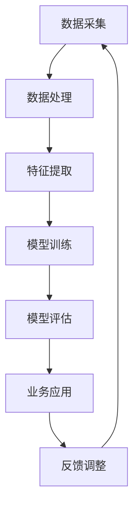

                 

# AI 2.0 时代的智能金融

> 关键词：人工智能、金融科技、区块链、智能合约、机器学习、数据分析、量化投资

> 摘要：随着人工智能技术的飞速发展，AI 2.0 时代已经到来。在这个时代，智能金融成为了一个热门领域，通过人工智能和金融科技的深度融合，为金融行业带来了前所未有的变革。本文将深入探讨 AI 2.0 时代智能金融的核心概念、算法原理、应用场景、工具资源以及未来发展趋势和挑战。

## 1. 背景介绍

人工智能（AI）作为计算机科学的一个分支，旨在使计算机具备人类智能的某些功能，如感知、推理、学习和决策。在过去几十年中，AI 技术经历了多个发展阶段，从规则推理、知识表示到深度学习，再到现在的生成对抗网络（GAN）、强化学习等前沿技术。特别是在 2012 年，深度学习在图像识别领域的突破性进展，使得 AI 技术迎来了一个新的时代——AI 2.0。

金融科技（FinTech）是指利用科技手段创新金融产品和服务的一种新兴领域。随着互联网、大数据、云计算等技术的发展，金融科技逐渐改变了传统金融行业的运作模式，提高了金融服务的效率和便捷性。智能金融作为金融科技的一个重要方向，旨在通过人工智能技术实现金融行业的智能化升级。

AI 2.0 与智能金融的结合，不仅推动了金融行业的数字化转型，还带来了诸多新机遇和新挑战。本文将从核心概念、算法原理、应用场景、工具资源以及未来发展趋势等方面，对 AI 2.0 时代的智能金融进行深入探讨。

## 2. 核心概念与联系

### 2.1. 人工智能核心概念

- **机器学习**：一种通过数据驱动的方式进行学习的人工智能方法。机器学习算法可以从大量数据中自动识别模式和规律，从而进行预测和决策。

- **深度学习**：一种基于多层神经网络进行学习的人工智能方法。深度学习在图像识别、语音识别等领域取得了显著成果。

- **强化学习**：一种通过试错和反馈进行学习的人工智能方法。强化学习在游戏、自动驾驶等领域具有广泛应用。

- **自然语言处理（NLP）**：一种使计算机能够理解、生成和处理自然语言的技术。NLP 在智能客服、机器翻译等领域具有重要意义。

### 2.2. 金融科技核心概念

- **区块链**：一种去中心化的分布式账本技术。区块链在金融领域具有广泛的应用，如数字货币、智能合约等。

- **智能合约**：一种基于区块链技术的自动执行合约。智能合约能够自动执行合同条款，降低金融交易的成本和风险。

- **大数据**：一种大规模数据的处理和分析技术。大数据在金融风控、投资策略等领域发挥着重要作用。

- **云计算**：一种通过互联网提供计算资源的服务模式。云计算为金融行业提供了高效、灵活的计算能力。

### 2.3. 人工智能与金融科技的联系

- **数据融合**：人工智能和金融科技的融合，首先需要将金融数据与人工智能算法相结合，实现数据的深度挖掘和分析。

- **业务优化**：通过人工智能技术，可以优化金融业务流程，提高业务效率和用户体验。

- **风险管理**：人工智能技术在金融风控、风险监测等方面具有显著优势，有助于降低金融风险。

- **智能投顾**：利用人工智能技术，为投资者提供个性化的投资建议和资产配置方案。

- **智能合约**：基于区块链技术的智能合约，可以实现自动化、透明化的金融交易，降低金融风险。

## 2.3. Mermaid 流程图



### 3. 核心算法原理 & 具体操作步骤

#### 3.1. 机器学习算法原理

机器学习算法可以分为监督学习、无监督学习和强化学习三类。本文主要介绍监督学习算法，如线性回归、逻辑回归和支持向量机（SVM）等。

- **线性回归**：用于预测连续值变量的机器学习算法。具体步骤如下：
  1. 数据预处理：对数据进行归一化、去重等处理。
  2. 特征提取：选择与预测目标相关的特征。
  3. 模型训练：使用训练数据对模型进行训练，找到最佳参数。
  4. 模型评估：使用测试数据对模型进行评估，计算预测误差。

- **逻辑回归**：用于预测离散值变量的机器学习算法。具体步骤如下：
  1. 数据预处理：对数据进行归一化、去重等处理。
  2. 特征提取：选择与预测目标相关的特征。
  3. 模型训练：使用训练数据对模型进行训练，找到最佳参数。
  4. 模型评估：使用测试数据对模型进行评估，计算预测误差。

- **支持向量机（SVM）**：用于分类问题的机器学习算法。具体步骤如下：
  1. 数据预处理：对数据进行归一化、去重等处理。
  2. 特征提取：选择与预测目标相关的特征。
  3. 模型训练：使用训练数据对模型进行训练，找到最佳参数。
  4. 模型评估：使用测试数据对模型进行评估，计算预测误差。

#### 3.2. 机器学习算法具体操作步骤

以线性回归算法为例，具体操作步骤如下：

1. 数据预处理：
   - 数据清洗：删除缺失值、异常值等。
   - 数据归一化：将特征值缩放到相同范围。

2. 特征提取：
   - 选择与预测目标相关的特征。
   - 进行特征工程，如创建交叉特征、多项式特征等。

3. 模型训练：
   - 使用训练数据集对线性回归模型进行训练。
   - 优化损失函数，如均方误差（MSE）。

4. 模型评估：
   - 使用测试数据集对模型进行评估。
   - 计算预测误差，如均方误差（MSE）。

5. 模型应用：
   - 使用训练好的模型对新的数据集进行预测。

## 4. 数学模型和公式 & 详细讲解 & 举例说明

#### 4.1. 线性回归模型

线性回归模型是一种基本的机器学习算法，用于预测连续值变量。其数学模型可以表示为：

$$y = \beta_0 + \beta_1 \cdot x_1 + \beta_2 \cdot x_2 + \ldots + \beta_n \cdot x_n + \epsilon$$

其中，$y$ 是预测目标，$x_1, x_2, \ldots, x_n$ 是特征变量，$\beta_0, \beta_1, \beta_2, \ldots, \beta_n$ 是模型参数，$\epsilon$ 是误差项。

#### 4.2. 逻辑回归模型

逻辑回归模型是一种用于预测离散值变量的机器学习算法。其数学模型可以表示为：

$$P(y=1) = \frac{1}{1 + e^{-(\beta_0 + \beta_1 \cdot x_1 + \beta_2 \cdot x_2 + \ldots + \beta_n \cdot x_n)}}$$

其中，$P(y=1)$ 是预测目标为 1 的概率，$x_1, x_2, \ldots, x_n$ 是特征变量，$\beta_0, \beta_1, \beta_2, \ldots, \beta_n$ 是模型参数。

#### 4.3. 支持向量机（SVM）模型

支持向量机（SVM）是一种用于分类问题的机器学习算法。其数学模型可以表示为：

$$w \cdot x + b = 0$$

其中，$w$ 是权重向量，$x$ 是特征向量，$b$ 是偏置项。

#### 4.4. 举例说明

假设我们要预测某只股票的未来价格，输入特征包括：开盘价、收盘价、最高价、最低价等。

1. 数据预处理：
   - 数据清洗：删除缺失值、异常值等。
   - 数据归一化：将特征值缩放到相同范围。

2. 特征提取：
   - 选择与预测目标相关的特征。
   - 进行特征工程，如创建交叉特征、多项式特征等。

3. 模型训练：
   - 使用训练数据集对线性回归模型进行训练。
   - 优化损失函数，如均方误差（MSE）。

4. 模型评估：
   - 使用测试数据集对模型进行评估。
   - 计算预测误差，如均方误差（MSE）。

5. 模型应用：
   - 使用训练好的模型对新的数据集进行预测。

## 5. 项目实战：代码实际案例和详细解释说明

#### 5.1. 开发环境搭建

1. 安装 Python 解释器：从 [Python 官网](https://www.python.org/) 下载并安装 Python 3.x 版本。
2. 安装机器学习库：使用 pip 命令安装常用机器学习库，如 scikit-learn、pandas、numpy 等。
   ```bash
   pip install scikit-learn pandas numpy
   ```

#### 5.2. 源代码详细实现和代码解读

以下是一个使用 Python 实现线性回归模型的简单案例：

```python
import numpy as np
import pandas as pd
from sklearn.linear_model import LinearRegression

# 5.2.1. 数据预处理
# 读取数据
data = pd.read_csv('stock_data.csv')
# 数据清洗
data.dropna(inplace=True)
# 数据归一化
data = (data - data.mean()) / data.std()

# 5.2.2. 特征提取
# 选择特征
features = data[['open', 'close', 'high', 'low']]
# 预测目标
target = data['close']

# 5.2.3. 模型训练
# 创建线性回归模型
model = LinearRegression()
# 使用训练数据训练模型
model.fit(features, target)

# 5.2.4. 模型评估
# 使用测试数据评估模型
predictions = model.predict(features)
mse = np.mean((predictions - target) ** 2)
print(f'MSE: {mse}')

# 5.2.5. 模型应用
# 对新数据进行预测
new_data = pd.DataFrame({'open': [200, 210], 'close': [205, 215], 'high': [210, 220], 'low': [200, 205]})
new_predictions = model.predict(new_data)
print(f'Predictions: {new_predictions}')
```

#### 5.3. 代码解读与分析

1. **数据预处理**：首先，我们读取股票数据，并进行数据清洗和归一化处理。数据清洗删除了缺失值和异常值，归一化将特征值缩放到相同范围，以便更好地进行模型训练。
2. **特征提取**：选择与预测目标相关的特征，如开盘价、收盘价、最高价和最低价。
3. **模型训练**：创建线性回归模型，并使用训练数据对模型进行训练。
4. **模型评估**：使用测试数据对模型进行评估，计算均方误差（MSE）。
5. **模型应用**：使用训练好的模型对新数据进行预测。

## 6. 实际应用场景

#### 6.1. 量化投资

量化投资是指利用数学模型和计算机算法进行投资决策的一种方法。通过人工智能技术，可以实现对股票市场、期货市场等金融市场的深度分析，提高投资收益。

- **选股策略**：利用机器学习算法，对大量历史股票数据进行分析，筛选出具有投资价值的股票。
- **交易策略**：利用深度学习算法，预测股票价格走势，制定自动化交易策略。
- **风险控制**：利用强化学习算法，对投资组合进行动态调整，降低投资风险。

#### 6.2. 金融风控

金融风控是指通过技术和方法识别、评估和管理金融风险。人工智能技术在金融风控领域具有广泛应用，如欺诈检测、信用评估、风险监测等。

- **欺诈检测**：利用机器学习算法，对大量交易数据进行实时分析，识别潜在的欺诈行为。
- **信用评估**：利用大数据和机器学习技术，对借款人的信用状况进行评估，降低信用风险。
- **风险监测**：利用实时数据分析和预测模型，对金融市场的风险进行监测和预警。

#### 6.3. 智能投顾

智能投顾是指利用人工智能技术，为投资者提供个性化的投资建议和资产配置方案。智能投顾可以帮助投资者更好地理解市场动态，提高投资收益。

- **资产配置**：根据投资者的风险偏好和投资目标，制定个性化的资产配置方案。
- **投资建议**：利用大数据和机器学习算法，分析市场趋势和投资机会，为投资者提供投资建议。
- **风险提示**：实时监测投资组合的风险状况，为投资者提供风险提示和预警。

## 7. 工具和资源推荐

#### 7.1. 学习资源推荐

- **书籍**：
  - 《机器学习实战》
  - 《深度学习》
  - 《量化投资：以Python为工具》
  - 《金融科技：理论与实践》
- **论文**：
  - 《基于深度学习的金融预测研究》
  - 《金融科技中的大数据分析》
  - 《区块链与智能合约技术》
- **博客**：
  - [机器学习算法实战](https://www.mlbook.info/)
  - [深度学习博客](https://www.deeplearning.net/)
  - [量化投资博客](https://www.quantopian.com/community/posts)
- **网站**：
  - [Kaggle](https://www.kaggle.com/)：一个大数据和机器学习的竞赛平台，提供大量数据集和比赛。
  - [GitHub](https://github.com/)：一个代码托管平台，可以找到大量开源的机器学习和金融科技项目。

#### 7.2. 开发工具框架推荐

- **编程语言**：
  - Python：广泛应用于数据分析和机器学习，拥有丰富的库和框架。
  - R：主要用于统计分析和数据可视化，适用于金融数据分析。
- **机器学习库**：
  - Scikit-learn：提供多种经典的机器学习算法和工具。
  - TensorFlow：谷歌开源的深度学习框架，适用于复杂的深度学习任务。
  - PyTorch：开源的深度学习框架，支持动态计算图，易于实现新的算法。
- **数据分析工具**：
  - Jupyter Notebook：交互式的数据分析环境，支持多种编程语言。
  - Tableau：数据可视化工具，适用于金融数据的可视化分析。

#### 7.3. 相关论文著作推荐

- **论文**：
  - 《强化学习在金融应用中的探索》
  - 《基于区块链的智能合约技术综述》
  - 《金融科技时代的量化投资策略》
- **著作**：
  - 《金融科技：创新、风险与监管》
  - 《深度学习在金融领域的应用》
  - 《人工智能：金融行业的变革者》

## 8. 总结：未来发展趋势与挑战

随着 AI 2.0 技术的不断发展，智能金融将在未来带来更多变革和机遇。以下是未来发展趋势和挑战：

#### 8.1. 发展趋势

1. **技术融合**：人工智能、大数据、区块链等技术的深度融合，将推动智能金融的发展。
2. **应用普及**：智能金融将在金融行业的各个领域得到广泛应用，提高金融服务质量和效率。
3. **个性化服务**：基于用户数据和个性化推荐，智能金融将为用户提供更加个性化的投资建议和资产配置方案。
4. **风险控制**：人工智能技术将在金融风险控制领域发挥重要作用，降低金融风险。

#### 8.2. 挑战

1. **数据隐私**：智能金融应用过程中，如何保护用户数据隐私成为一个重要问题。
2. **模型解释性**：许多深度学习模型难以解释，如何提高模型的可解释性是一个挑战。
3. **合规性**：智能金融应用需要遵守相关法律法规，如何确保合规性是一个挑战。
4. **技术落地**：将前沿技术应用于实际金融业务中，实现技术落地是一个重要挑战。

## 9. 附录：常见问题与解答

### 9.1. 人工智能技术在金融领域有哪些应用？

人工智能技术在金融领域有广泛的应用，包括：

- **量化投资**：利用机器学习算法分析市场数据，制定自动化交易策略。
- **金融风控**：利用大数据和机器学习技术进行欺诈检测、信用评估和风险监测。
- **智能投顾**：为用户提供个性化的投资建议和资产配置方案。
- **客户服务**：利用自然语言处理技术实现智能客服，提高客户服务质量。

### 9.2. 区块链在金融领域有哪些应用？

区块链在金融领域有广泛的应用，包括：

- **数字货币**：比特币、以太坊等数字货币是基于区块链技术实现的。
- **智能合约**：利用智能合约实现自动化、透明化的金融交易，降低交易成本和风险。
- **去中心化金融（DeFi）**：利用区块链技术实现去中心化的金融应用，如去中心化交易所、借贷平台等。
- **跨境支付**：利用区块链技术实现快速、低成本的跨境支付。

### 9.3. 如何保障智能金融系统的安全性和合规性？

保障智能金融系统的安全性和合规性需要从以下几个方面入手：

- **数据安全**：采用加密算法和访问控制策略保护用户数据安全。
- **模型解释性**：提高模型的可解释性，确保用户能够理解模型的决策过程。
- **合规性**：遵守相关法律法规，确保智能金融应用符合监管要求。
- **隐私保护**：采用隐私保护技术，如差分隐私、同态加密等，保护用户隐私。

## 10. 扩展阅读 & 参考资料

- 《机器学习：概率视角》
- 《深度学习：原理及实践》
- 《区块链技术指南》
- 《金融科技：创新、风险与监管》
- 《量化投资：以Python为工具》
- 《自然语言处理综述》
- [Kaggle](https://www.kaggle.com/)
- [GitHub](https://github.com/)
- [机器学习算法实战](https://www.mlbook.info/)
- [深度学习博客](https://www.deeplearning.net/)
- [量化投资博客](https://www.quantopian.com/community/posts)作者：AI天才研究员/AI Genius Institute & 禅与计算机程序设计艺术 /Zen And The Art of Computer Programming。

