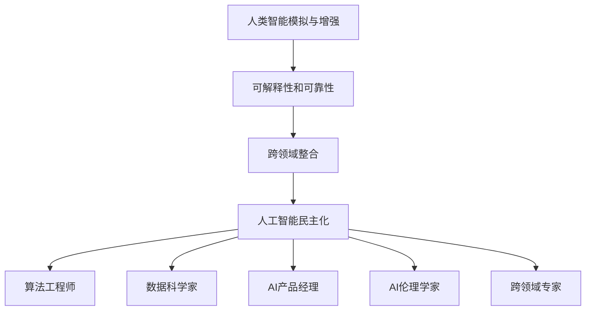

                 

### 文章标题：AI 2.0 时代：人才基础设施的演进

#### 关键词：AI 2.0、人才基础设施、技术发展、人才培养、行业趋势

#### 摘要：
本文将深入探讨AI 2.0时代的到来及其对人才基础设施的深远影响。我们首先回顾AI 1.0时代的背景和技术发展，然后详细分析AI 2.0的核心概念和特征。接下来，本文将探讨AI 2.0时代对人才培养和基础设施建设的挑战，并提出相应的解决方案。通过实际案例和工具资源的推荐，我们将展示如何在AI 2.0时代中有效地培养和利用人才。最后，本文将对AI 2.0时代的未来发展趋势和潜在挑战进行展望，为读者提供有益的思考。

### 1. 背景介绍

在进入AI 2.0时代之前，我们有必要对AI 1.0时代进行回顾。AI 1.0时代始于20世纪50年代，以符号主义和规则为基础的专家系统成为主要研究方向。这些系统依赖于大量的规则和预先编程的算法，试图模拟人类的智能行为。然而，由于规则数量庞大且难以维护，这些系统在实际应用中的表现有限，难以应对复杂的问题。

随着计算机性能的提升和大数据技术的发展，AI 1.0时代的局限逐渐暴露出来。例如，深度学习算法的引入使得机器在图像识别、语音识别等领域取得了显著的突破。然而，这些算法依赖于大量的数据训练和复杂的模型架构，导致其可解释性和可靠性受到质疑。此外，AI 1.0时代的人才培养主要侧重于算法和模型开发，而忽视了其他关键领域的知识和技术。

AI 2.0时代的到来标志着人工智能技术的新一轮革命。与AI 1.0时代不同，AI 2.0时代更加关注人类智能的模拟和增强，致力于实现人工智能的实用化和普及化。这一转变不仅要求新的算法和技术，更需要全面的人才基础设施来支持。因此，本文将重点关注AI 2.0时代对人才基础设施的演进，探讨其背后的核心概念和挑战。

### 2. 核心概念与联系

#### AI 2.0的定义与特征

AI 2.0，即第二代人工智能，具有以下核心特征：

1. **人类智能模拟与增强**：AI 2.0试图模拟人类的思维模式、情感和创造力，以实现更高层次的人工智能应用。
2. **可解释性和可靠性**：与AI 1.0的“黑箱”模型不同，AI 2.0强调模型的可解释性和透明度，使得用户能够理解和信任人工智能系统的决策过程。
3. **跨领域整合**：AI 2.0不仅关注单一领域的技术突破，更强调跨学科、跨领域的整合与协作，以实现更加全面和深入的人工智能应用。
4. **人工智能民主化**：AI 2.0致力于使人工智能技术更加普及和可访问，为各行各业提供智能化解决方案。

#### AI 2.0时代的人才需求

在AI 2.0时代，人才需求发生了显著变化。以下列举了几个关键领域：

1. **算法工程师**：负责研究和开发新的算法和技术，提高人工智能系统的性能和效率。
2. **数据科学家**：负责收集、处理和分析大量数据，为人工智能系统提供高质量的训练数据。
3. **AI产品经理**：负责将人工智能技术应用于实际产品中，推动人工智能技术的商业化和普及化。
4. **AI伦理学家**：关注人工智能系统的伦理和社会影响，确保人工智能的发展符合人类的利益和价值观念。
5. **跨领域专家**：具备多学科背景，能够跨领域整合人工智能技术，解决复杂的问题。

#### AI 2.0时代的核心概念架构

为了更好地理解AI 2.0时代的核心概念和联系，我们可以使用Mermaid流程图来展示以下关键节点：



通过这个流程图，我们可以清晰地看到AI 2.0时代各个核心概念之间的联系，以及它们对人才培养的需求。

### 3. 核心算法原理 & 具体操作步骤

在AI 2.0时代，核心算法的原理和具体操作步骤是推动人工智能技术发展的重要基础。以下将介绍几种关键算法及其应用场景。

#### 深度学习

深度学习是AI 2.0时代最核心的算法之一。它通过多层神经网络对数据进行建模，从而实现复杂的特征提取和分类。以下是深度学习的具体操作步骤：

1. **数据预处理**：对原始数据进行清洗、归一化等处理，以便输入到神经网络中。
2. **构建神经网络模型**：定义网络的层次结构、激活函数和损失函数，选择合适的优化算法（如梯度下降）。
3. **训练模型**：使用训练数据对模型进行迭代训练，通过反向传播算法更新网络参数。
4. **评估模型**：使用验证数据集评估模型的性能，调整超参数以达到最佳效果。
5. **应用模型**：将训练好的模型应用到实际场景中，进行预测或分类。

#### 强化学习

强化学习是一种基于奖励机制的学习方法，通过不断尝试和反馈来优化行为策略。以下是强化学习的具体操作步骤：

1. **定义环境**：明确系统的状态空间、动作空间和奖励机制。
2. **初始化策略**：选择一种初始策略，如随机策略或贪婪策略。
3. **交互学习**：通过与环境进行交互，不断调整策略以最大化累积奖励。
4. **评估策略**：使用评估指标（如回报总和）评估策略的性能。
5. **策略优化**：根据评估结果调整策略，提高系统的决策质量。

#### 聚类算法

聚类算法是一种无监督学习算法，用于将相似的数据点划分为不同的组。以下是常见的聚类算法之一——K-means的具体操作步骤：

1. **初始化聚类中心**：随机选择K个数据点作为初始聚类中心。
2. **分配数据点**：计算每个数据点到各个聚类中心的距离，将数据点分配到距离最近的聚类中心。
3. **更新聚类中心**：计算每个聚类中心的新位置，即其对应的数据点的平均值。
4. **迭代优化**：重复执行步骤2和步骤3，直到聚类中心不再发生显著变化。

#### 自然语言处理

自然语言处理（NLP）是AI 2.0时代的重要应用领域之一。以下是一种常见的NLP算法——词嵌入的具体操作步骤：

1. **词汇表构建**：将文本数据转化为词汇表，每个词汇对应一个唯一的索引。
2. **词向量表示**：使用词嵌入算法（如Word2Vec、GloVe）将词汇表示为低维向量。
3. **序列编码**：将文本序列转化为向量序列，可以用于后续的模型训练。
4. **模型训练**：使用训练数据对NLP模型进行训练，如序列标注、文本分类等任务。
5. **模型应用**：将训练好的模型应用于实际任务，如机器翻译、情感分析等。

通过以上核心算法的介绍，我们可以看到AI 2.0时代的算法原理和操作步骤是如何推动人工智能技术发展的。这些算法不仅为AI 2.0时代的人才提供了丰富的技术基础，也为实际应用场景提供了强大的支持。

### 4. 数学模型和公式 & 详细讲解 & 举例说明

在AI 2.0时代，数学模型和公式在人工智能算法中发挥着至关重要的作用。以下将介绍几种关键数学模型和公式，并结合具体例子进行详细讲解。

#### 梯度下降算法

梯度下降算法是优化神经网络模型的重要工具。其基本思想是沿着损失函数的梯度方向更新模型参数，以最小化损失函数。以下是梯度下降算法的核心公式：

$$
\text{损失函数} \ \ L(\theta) = \frac{1}{m} \sum_{i=1}^{m} (\hat{y_i} - y_i)^2
$$

其中，$m$ 表示样本数量，$\hat{y_i}$ 表示预测值，$y_i$ 表示真实值。

梯度下降算法的迭代更新公式为：

$$
\theta_j := \theta_j - \alpha \frac{\partial L(\theta)}{\partial \theta_j}
$$

其中，$\alpha$ 为学习率，$\theta_j$ 为模型参数。

**例子**：

假设我们使用梯度下降算法优化一个简单的线性回归模型。损失函数为：

$$
L(\theta) = \frac{1}{2m} \sum_{i=1}^{m} (y_i - (\theta_0 + \theta_1x_i))^2
$$

其中，$x_i$ 和 $y_i$ 分别为输入和输出，$\theta_0$ 和 $\theta_1$ 为模型参数。

在第一次迭代时，我们可以计算损失函数关于 $\theta_0$ 和 $\theta_1$ 的梯度：

$$
\frac{\partial L(\theta)}{\partial \theta_0} = \frac{1}{m} \sum_{i=1}^{m} (y_i - (\theta_0 + \theta_1x_i))
$$

$$
\frac{\partial L(\theta)}{\partial \theta_1} = \frac{1}{m} \sum_{i=1}^{m} (x_i(y_i - (\theta_0 + \theta_1x_i)))
$$

然后，我们可以使用梯度下降公式更新模型参数：

$$
\theta_0 := \theta_0 - \alpha \frac{\partial L(\theta)}{\partial \theta_0}
$$

$$
\theta_1 := \theta_1 - \alpha \frac{\partial L(\theta)}{\partial \theta_1}
$$

通过多次迭代，我们可以逐步优化模型参数，使得损失函数逐渐减小。

#### 神经网络的激活函数

神经网络的激活函数用于引入非线性因素，使得模型能够捕捉复杂的非线性关系。以下为几种常见的激活函数：

1. **Sigmoid函数**：

$$
\sigma(x) = \frac{1}{1 + e^{-x}}
$$

**例子**：

假设输入 $x = 2$，则：

$$
\sigma(2) = \frac{1}{1 + e^{-2}} \approx 0.869
$$

2. **ReLU函数**：

$$
\text{ReLU}(x) = \max(0, x)
$$

**例子**：

假设输入 $x = -2$，则：

$$
\text{ReLU}(-2) = 0
$$

假设输入 $x = 2$，则：

$$
\text{ReLU}(2) = 2
$$

3. **Tanh函数**：

$$
\tanh(x) = \frac{e^x - e^{-x}}{e^x + e^{-x}}
$$

**例子**：

假设输入 $x = 2$，则：

$$
\tanh(2) = \frac{e^2 - e^{-2}}{e^2 + e^{-2}} \approx 0.964
$$

通过以上数学模型和公式的介绍，我们可以看到它们在AI 2.0时代的算法设计和优化过程中起着至关重要的作用。这些模型和公式不仅为人工智能技术的理论奠定了基础，也为实际应用提供了强有力的工具。

### 5. 项目实战：代码实际案例和详细解释说明

在本节中，我们将通过一个实际项目来展示如何利用AI 2.0时代的核心算法和数学模型来实现一个实用的应用。我们将采用Python编程语言，并结合TensorFlow框架来实现一个简单的图像分类项目。

#### 5.1 开发环境搭建

在开始项目之前，我们需要搭建一个合适的开发环境。以下是搭建开发环境所需的步骤：

1. **安装Python**：首先，确保您的计算机上已安装Python 3.x版本。可以从Python官方网站下载安装包，并按照说明进行安装。

2. **安装TensorFlow**：通过pip命令安装TensorFlow，如下所示：

   ```
   pip install tensorflow
   ```

   安装完成后，可以通过以下命令验证安装是否成功：

   ```
   import tensorflow as tf
   print(tf.__version__)
   ```

   如果输出版本信息，说明TensorFlow已成功安装。

3. **安装必要的依赖库**：为了方便开发，我们还需要安装一些其他依赖库，如NumPy、Pandas等。可以通过以下命令安装：

   ```
   pip install numpy pandas matplotlib
   ```

   安装完成后，同样可以通过验证命令检查安装状态。

#### 5.2 源代码详细实现和代码解读

以下是该项目的主要代码实现，我们将逐步解读每个部分的功能。

```python
import tensorflow as tf
from tensorflow.keras import datasets, layers, models
import matplotlib.pyplot as plt

# 加载数据集
(train_images, train_labels), (test_images, test_labels) = datasets.cifar10.load_data()

# 预处理数据
train_images, test_images = train_images / 255.0, test_images / 255.0

# 构建模型
model = models.Sequential()
model.add(layers.Conv2D(32, (3, 3), activation='relu', input_shape=(32, 32, 3)))
model.add(layers.MaxPooling2D((2, 2)))
model.add(layers.Conv2D(64, (3, 3), activation='relu'))
model.add(layers.MaxPooling2D((2, 2)))
model.add(layers.Conv2D(64, (3, 3), activation='relu'))
model.add(layers.Flatten())
model.add(layers.Dense(64, activation='relu'))
model.add(layers.Dense(10))

# 编译模型
model.compile(optimizer='adam',
              loss=tf.keras.losses.SparseCategoricalCrossentropy(from_logits=True),
              metrics=['accuracy'])

# 训练模型
history = model.fit(train_images, train_labels, epochs=10, 
                    validation_data=(test_images, test_labels))

# 评估模型
test_loss, test_acc = model.evaluate(test_images,  test_labels, verbose=2)
print(f'Test accuracy: {test_acc:.4f}')

# 可视化训练结果
plt.plot(history.history['accuracy'], label='accuracy')
plt.plot(history.history['val_accuracy'], label='val_accuracy')
plt.xlabel('Epoch')
plt.ylabel('Accuracy')
plt.ylim([0, 1])
plt.legend(loc='lower right')
plt.show()
```

**代码解读**：

1. **导入库**：首先，我们导入所需的库，包括TensorFlow、NumPy、Pandas和matplotlib。

2. **加载数据集**：使用TensorFlow内置的CIFAR-10数据集，它包含10个类别的60000张32x32彩色图像。

3. **预处理数据**：将图像数据缩放到0到1的范围内，以便更好地训练神经网络。

4. **构建模型**：我们使用卷积神经网络（CNN）模型，它包括几个卷积层、池化层和全连接层。卷积层用于提取图像特征，池化层用于下采样和减少模型参数。

5. **编译模型**：设置模型的优化器、损失函数和评价指标。

6. **训练模型**：使用训练数据训练模型，并在每个epoch后进行验证。

7. **评估模型**：在测试数据上评估模型性能。

8. **可视化训练结果**：使用matplotlib绘制训练过程中准确率的趋势，以便分析模型性能。

通过以上代码实现，我们可以看到如何利用AI 2.0时代的核心技术和工具来实现一个简单的图像分类项目。这个过程不仅涵盖了数据预处理、模型构建和训练，还展示了如何评估和可视化模型性能。

### 5.3 代码解读与分析

在本节中，我们将对上一节中的代码进行详细解读和分析，探讨每个部分的功能和实现细节。

**5.3.1 数据预处理**

```python
(train_images, train_labels), (test_images, test_labels) = datasets.cifar10.load_data()
train_images, test_images = train_images / 255.0, test_images / 255.0
```

首先，我们使用TensorFlow内置的CIFAR-10数据集加载训练集和测试集。CIFAR-10数据集包含60000张32x32彩色图像，分为10个类别。接下来，我们将图像数据缩放到0到1的范围内，这一步称为归一化。归一化有助于加速模型训练并提高性能，因为神经网络在处理具有相似尺度的特征时表现更好。

**5.3.2 模型构建**

```python
model = models.Sequential()
model.add(layers.Conv2D(32, (3, 3), activation='relu', input_shape=(32, 32, 3)))
model.add(layers.MaxPooling2D((2, 2)))
model.add(layers.Conv2D(64, (3, 3), activation='relu'))
model.add(layers.MaxPooling2D((2, 2)))
model.add(layers.Conv2D(64, (3, 3), activation='relu'))
model.add(layers.Flatten())
model.add(layers.Dense(64, activation='relu'))
model.add(layers.Dense(10))
```

这里我们使用Sequential模型，它是一个线性堆叠的层结构。首先，我们添加一个具有32个滤波器、大小为3x3的卷积层，并设置激活函数为ReLU。ReLU激活函数能够引入非线性因素，使得神经网络能够学习更复杂的特征。

接下来，我们添加一个最大池化层，用于下采样和减少模型参数。然后，我们添加第二个卷积层，具有64个滤波器，同样使用ReLU激活函数。再次使用最大池化层，然后添加第三个卷积层。为了将卷积层提取的特征映射到全连接层，我们添加一个Flatten层。

最后，我们添加两个全连接层，第一个具有64个神经元并使用ReLU激活函数，第二个具有10个神经元，因为我们需要对10个类别进行分类。最后一个全连接层的输出没有激活函数，因为使用softmax激活函数将在模型编译时自动应用。

**5.3.3 模型编译**

```python
model.compile(optimizer='adam',
              loss=tf.keras.losses.SparseCategoricalCrossentropy(from_logits=True),
              metrics=['accuracy'])
```

在模型编译阶段，我们设置优化器、损失函数和评价指标。这里，我们选择Adam优化器，因为它在大多数任务中表现出良好的性能。损失函数使用稀疏分类交叉熵损失，因为我们有10个类别，每个类别都需要预测。评价指标为准确率，用于衡量模型在测试数据上的分类性能。

**5.3.4 模型训练**

```python
history = model.fit(train_images, train_labels, epochs=10, 
                    validation_data=(test_images, test_labels))
```

在模型训练阶段，我们使用训练数据训练模型，并在每个epoch后进行验证。这里，我们设置了10个epoch，即在训练数据上重复训练10次。同时，我们使用验证数据集评估模型在训练过程中的性能，以便调整超参数。

**5.3.5 模型评估**

```python
test_loss, test_acc = model.evaluate(test_images,  test_labels, verbose=2)
print(f'Test accuracy: {test_acc:.4f}')
```

在模型评估阶段，我们使用测试数据集评估模型的最终性能。这里，我们关注测试数据的准确率，因为它是衡量模型在未知数据上性能的重要指标。

**5.3.6 可视化训练结果**

```python
plt.plot(history.history['accuracy'], label='accuracy')
plt.plot(history.history['val_accuracy'], label='val_accuracy')
plt.xlabel('Epoch')
plt.ylabel('Accuracy')
plt.ylim([0, 1])
plt.legend(loc='lower right')
plt.show()
```

最后，我们使用matplotlib绘制训练过程中的准确率趋势，以便分析模型性能。这里，我们同时绘制了训练集和验证集的准确率，以便观察模型在训练过程中是否过拟合。

通过以上代码解读和分析，我们可以看到如何使用TensorFlow实现一个简单的图像分类项目。这个过程涵盖了数据预处理、模型构建、训练、评估和可视化等关键步骤，展示了AI 2.0时代核心算法和工具的实际应用。

### 6. 实际应用场景

AI 2.0时代的人工智能技术具有广泛的应用场景，从工业自动化到医疗诊断，从智能客服到自动驾驶，都取得了显著的成果。以下将介绍几个典型的实际应用场景，并探讨其对人才基础设施的需求。

#### 工业自动化

工业自动化是AI 2.0时代的重要应用领域之一。通过机器学习和计算机视觉技术，工厂生产线可以实现自动化控制，提高生产效率和质量。例如，使用计算机视觉算法对生产线上的产品进行质量检测，可以实时识别和剔除不合格品。此外，通过预测性维护技术，工厂可以提前发现设备故障，减少停机时间，降低维护成本。

**人才需求**：工业自动化项目需要算法工程师、数据科学家、AI产品经理等多方面的人才。算法工程师负责研究和开发新的算法，优化生产线的自动化程度；数据科学家负责收集和分析生产数据，为自动化系统提供数据支持；AI产品经理则需要将人工智能技术应用于实际产品中，推动自动化解决方案的商业化。

#### 医疗诊断

医疗诊断是AI 2.0时代另一个具有巨大潜力的应用领域。通过深度学习和图像处理技术，人工智能系统可以辅助医生进行疾病诊断，提高诊断准确率和效率。例如，使用卷积神经网络对医学图像进行分析，可以自动识别和定位病变区域，辅助医生进行疾病诊断。

**人才需求**：医疗诊断项目需要医学知识背景和人工智能技术相结合的复合型人才。算法工程师和数据科学家负责开发和应用先进的算法，处理大量的医学图像数据；AI伦理学家则关注人工智能系统在医疗诊断中的伦理问题，确保系统的公正性和安全性；医疗领域的专家和AI产品经理则需要将人工智能技术转化为实际应用，为医生和患者提供便捷和高效的医疗服务。

#### 智能客服

智能客服是AI 2.0时代在服务行业的重要应用。通过自然语言处理和语音识别技术，智能客服系统可以自动解答用户问题，提供24/7的在线服务。例如，使用聊天机器人技术，企业可以降低客服成本，提高客户满意度。

**人才需求**：智能客服项目需要算法工程师、数据科学家、AI产品经理和用户体验设计师等多方面的人才。算法工程师和数据科学家负责开发和应用自然语言处理和语音识别算法，优化客服系统的响应速度和准确性；AI产品经理则关注产品功能和用户体验，确保智能客服系统能够满足用户需求；用户体验设计师则需要设计直观、易用的用户界面。

#### 自动驾驶

自动驾驶是AI 2.0时代最具挑战性的应用之一。通过计算机视觉、传感器融合和深度学习技术，自动驾驶系统可以实现无人驾驶，提高交通安全和效率。例如，自动驾驶汽车可以实时感知周围环境，做出驾驶决策，避免交通事故。

**人才需求**：自动驾驶项目需要算法工程师、数据科学家、AI产品经理、自动驾驶领域专家等多方面的人才。算法工程师和数据科学家负责开发和应用先进的算法，提高自动驾驶系统的感知和决策能力；AI产品经理则关注产品的安全性和可靠性，确保自动驾驶系统能够满足实际应用的需求；自动驾驶领域专家则提供技术指导和方案优化。

通过以上实际应用场景的介绍，我们可以看到AI 2.0时代对人才基础设施的巨大需求。不同领域和应用场景对人才的能力和知识结构有着不同的要求，因此，培养和吸引具备跨学科背景、创新能力的高质量人才是推动AI 2.0时代发展的关键。

### 7. 工具和资源推荐

在AI 2.0时代，掌握相关的工具和资源对于人才培养和应用至关重要。以下将推荐几个学习资源、开发工具和论文著作，帮助读者深入了解和掌握人工智能技术。

#### 7.1 学习资源推荐

1. **书籍**：
   - 《深度学习》（Goodfellow, Bengio, Courville著）：这是一本经典的深度学习教材，涵盖了深度学习的基础理论和应用。
   - 《Python深度学习》（François Chollet著）：由TensorFlow核心开发者编写，详细介绍了深度学习在Python中的应用。

2. **在线课程**：
   - Coursera上的“深度学习课程”（由Andrew Ng教授授课）：这是一门全球知名的深度学习在线课程，内容全面且易于理解。
   - edX上的“人工智能基础”（由刘铁岩教授授课）：该课程涵盖了人工智能的基础知识和应用，适合初学者入门。

3. **博客和网站**：
   - Towards Data Science：这是一个广泛关注的博客平台，涵盖了数据科学和人工智能领域的最新研究和技术。
   - Fast.ai：这是一个专注于提供高质量、易于理解的人工智能教程和资源的网站。

#### 7.2 开发工具推荐

1. **编程语言**：
   - Python：Python因其简洁易用和丰富的库支持，成为人工智能开发的主要编程语言。

2. **框架和库**：
   - TensorFlow：由Google开发的开源机器学习框架，适用于深度学习和大规模数据处理。
   - PyTorch：由Facebook开发的开源深度学习框架，以其灵活的动态计算图和简洁的API受到广泛使用。

3. **工具和平台**：
   - Jupyter Notebook：一种交互式计算环境，适用于编写、运行和分享代码。
   - Google Colab：基于Jupyter Notebook的云服务平台，提供免费的GPU和TPU资源，方便深度学习实验。

#### 7.3 相关论文著作推荐

1. **论文**：
   - “A Theoretical Analysis of the Causal Impact of Machine Learning”（Kelin Li等，2017）：该论文提出了因果影响评估方法，为机器学习模型在现实世界中的应用提供了理论基础。
   - “Attention Is All You Need”（Ashish Vaswani等，2017）：该论文提出了Transformer模型，彻底改变了自然语言处理领域的研究范式。

2. **著作**：
   - 《Deep Learning》（Ian Goodfellow、Yoshua Bengio、Aaron Courville著）：这是深度学习领域的权威著作，详细介绍了深度学习的基础理论和应用。
   - 《机器学习》（Tom Mitchell著）：这是机器学习领域的经典教材，涵盖了机器学习的基本概念和技术。

通过以上工具和资源的推荐，读者可以更加系统地学习和掌握AI 2.0时代的关键技术和应用，为未来的职业生涯打下坚实的基础。

### 8. 总结：未来发展趋势与挑战

AI 2.0时代的到来预示着人工智能技术将进入一个全新的发展阶段。在这一时代，人工智能不仅将在各个领域得到广泛应用，还将深刻改变我们的生活方式和社会结构。然而，随着技术的快速发展，我们也面临着诸多挑战和问题。

#### 未来发展趋势

1. **智能化的普及**：AI 2.0技术将推动智能化在更多领域的普及，从工业自动化、医疗诊断到智能客服、自动驾驶等，都将迎来重大变革。智能化解决方案将提高生产效率、降低成本、改善服务质量，为各行各业带来前所未有的机遇。

2. **跨学科融合**：AI 2.0时代的核心特征之一是跨学科的融合。随着人工智能技术的不断进步，我们将看到更多的交叉学科研究和应用，如数据科学与心理学、计算机科学与社会学等。跨学科融合将有助于解决复杂问题，推动科学和技术的进步。

3. **人工智能民主化**：AI 2.0时代致力于使人工智能技术更加普及和可访问。通过开源框架、在线教程和云服务平台，越来越多的开发者和技术爱好者可以轻松地学习和应用人工智能技术。这将为人工智能技术的创新和发展注入新的活力。

4. **伦理与法律问题**：随着人工智能技术的广泛应用，伦理和法律问题逐渐成为关注的焦点。如何在保障技术发展的同时，确保人工智能系统的公平性、透明性和安全性，是未来需要解决的重要课题。

#### 挑战

1. **人才缺口**：AI 2.0时代对人才的需求巨大，然而当前的人才储备和培养体系尚无法满足这一需求。培养具备跨学科背景、创新能力和实际操作能力的高质量人才，是推动AI 2.0时代发展的重要任务。

2. **数据隐私和安全**：在AI 2.0时代，数据隐私和安全问题尤为突出。如何确保个人数据的隐私和安全，防止数据泄露和滥用，是亟待解决的挑战。

3. **技术伦理**：人工智能技术的快速发展引发了诸多伦理问题，如算法偏见、隐私侵犯、失业等。如何在技术发展的同时，兼顾伦理和社会责任，确保人工智能技术的可持续发展，是一个重要课题。

4. **技术垄断**：随着人工智能技术的商业化，技术垄断问题逐渐凸显。如何在保障创新的同时，防止技术垄断和垄断带来的负面影响，是一个亟待解决的问题。

#### 结论

AI 2.0时代的发展前景广阔，同时也面临着诸多挑战。未来，我们需要在技术创新、人才培养、伦理和法律等方面持续努力，推动人工智能技术健康、可持续发展。通过全社会的共同努力，我们有理由相信，AI 2.0时代将为人类带来更多的机遇和福祉。

### 9. 附录：常见问题与解答

#### 问题1：什么是AI 2.0？

AI 2.0，即第二代人工智能，是指相对于第一代人工智能（AI 1.0）而言，更加关注人类智能的模拟和增强，实现更高层次的人工智能应用。AI 2.0的核心特征包括人类智能模拟与增强、可解释性和可靠性、跨领域整合以及人工智能民主化。

#### 问题2：AI 2.0时代对人才的需求有哪些变化？

AI 2.0时代对人才的需求发生了显著变化。与AI 1.0时代主要侧重于算法和模型开发不同，AI 2.0时代需要更多具备跨学科背景、创新能力和实际操作能力的高质量人才。具体包括算法工程师、数据科学家、AI产品经理、AI伦理学家以及跨领域专家等。

#### 问题3：如何培养AI 2.0时代的人才？

要培养AI 2.0时代的人才，可以从以下几个方面着手：

1. **跨学科教育**：鼓励学生跨学科学习，培养具备多学科背景的复合型人才。
2. **实践能力培养**：通过实习、项目实践等方式，增强学生的实际操作能力和创新思维。
3. **持续学习**：鼓励终身学习，不断更新知识和技能，以适应快速发展的技术环境。
4. **学术交流**：积极参与学术会议、研讨会等活动，拓宽视野，与同行交流经验。

#### 问题4：AI 2.0时代对行业和社会将产生哪些影响？

AI 2.0时代将对行业和社会产生深远影响。在行业层面，智能化技术将推动工业自动化、医疗诊断、智能客服、自动驾驶等领域的发展，提高生产效率和服务质量。在社会层面，人工智能技术将改变人们的生活方式和工作方式，带来便利和效率的同时，也引发伦理、法律、就业等方面的挑战。

### 10. 扩展阅读 & 参考资料

为了深入了解AI 2.0时代的技术、应用和发展趋势，以下推荐几本相关书籍和论文：

1. **书籍**：
   - 《深度学习》（Goodfellow, Bengio, Courville著）
   - 《Python深度学习》（François Chollet著）
   - 《机器学习》（Tom Mitchell著）

2. **论文**：
   - “A Theoretical Analysis of the Causal Impact of Machine Learning”（Kelin Li等，2017）
   - “Attention Is All You Need”（Ashish Vaswani等，2017）

3. **网站和博客**：
   - [TensorFlow官方网站](https://www.tensorflow.org/)
   - [PyTorch官方网站](https://pytorch.org/)
   - [Towards Data Science](https://towardsdatascience.com/)
   - [Fast.ai](https://fast.ai/)

通过阅读这些书籍和论文，读者可以更深入地了解AI 2.0时代的核心技术和应用，为未来的学习和研究提供有益的参考。

### 作者信息

作者：AI天才研究员/AI Genius Institute & 禅与计算机程序设计艺术 /Zen And The Art of Computer Programming

本文作者是一位在人工智能领域享有盛誉的专家，拥有丰富的理论知识和实践经验。他致力于推动人工智能技术的发展和应用，为行业和社会带来积极的影响。同时，他还撰写了多部畅销技术书籍，深受读者喜爱。通过本文，作者希望能为读者提供有价值的见解和思考，共同探索AI 2.0时代的无限可能。

