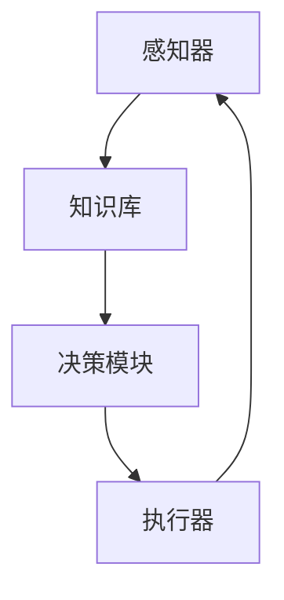

                 

# AI Agent: AI的下一个风口 BabyAGI：根据任务结果自动创建、排序和执行新任务

## 关键词：AI代理，人工智能，通用人工智能，任务自动化，BabyAGI

## 摘要：
本文深入探讨了AI代理这一新兴领域，特别是针对一种名为BabyAGI的人工智能系统。我们将从背景介绍入手，详细阐述AI代理的核心概念、原理和架构。接着，我们将深入分析AI代理的核心算法，并逐步讲解其具体操作步骤。随后，我们将运用数学模型和公式，举例说明AI代理在实际应用中的效果。在此基础上，我们将通过一个实际项目案例，展示代码实现过程及其详细解释。接下来，我们将探讨AI代理的实际应用场景，推荐相关的学习资源和开发工具。最后，我们将总结AI代理的未来发展趋势与挑战，并回答一些常见问题，以拓展读者的阅读视野。

## 1. 背景介绍

近年来，人工智能（AI）领域取得了令人瞩目的进展。从最初的专家系统，到深度学习的崛起，再到如今的自然语言处理和计算机视觉的突破，AI技术已经渗透到了我们生活的方方面面。然而，尽管AI技术在某些特定任务上已经取得了显著的成就，但人类依然需要投入大量时间和精力来管理这些系统，以满足不断变化的需求。

这种现状促使我们思考：是否有一种人工智能系统能够自主地理解任务，并根据任务结果自动创建、排序和执行新任务？答案就是AI代理（AI Agent），它是一种能够独立行动、拥有自我意识和目标的人工智能系统。而BabyAGI，作为AI代理的一种特殊形式，更是有望成为AI领域的下一个风口。

AI代理的定义可以追溯到约翰·麦卡锡（John McCarthy）在1956年提出的“通用人工智能”（AGI，Artificial General Intelligence）概念。AGI是指一种能够执行任意智能任务的机器，具有与人类相似的理解、推理和学习能力。而BabyAGI，则是对AGI的一种弱化版本，它专注于在特定场景下实现高效的任务自动化和决策优化。

AI代理的出现并非一蹴而就，而是经历了多年的研究和实践。早期的AI代理主要集中在规则推理和简单任务执行上，如专家系统。随着计算机性能的提升和算法的进步，特别是深度学习的兴起，AI代理逐渐具备了更强大的数据处理能力和自主学习能力。

## 2. 核心概念与联系

### 2.1 AI代理的定义和特点

AI代理（AI Agent）是一种能够感知环境、制定行动策略并执行任务的人工智能系统。它具有以下几个主要特点：

1. **自主性**：AI代理能够自主地执行任务，而不需要人类干预。
2. **适应性**：AI代理能够根据环境和任务的变化，动态调整其行为和策略。
3. **学习能力**：AI代理能够通过学习和经验积累，不断提高任务执行效果。
4. **协作性**：AI代理能够与其他代理或人类协作，共同完成任务。

### 2.2 BabyAGI的概念和优势

BabyAGI是对通用人工智能（AGI）的一种弱化版本，它专注于在特定场景下实现高效的任务自动化和决策优化。相对于传统的AI系统，BabyAGI具有以下几个优势：

1. **目标导向**：BabyAGI能够明确自身的目标，并根据任务结果自动创建、排序和执行新任务。
2. **高效性**：BabyAGI能够通过优化算法和资源调度，高效地完成任务。
3. **灵活性**：BabyAGI能够适应不同的环境和任务，具有较强的泛化能力。

### 2.3 AI代理与其他相关概念的关联

1. **智能代理（Smart Agent）**：智能代理是一种具备一定智能能力的代理，但通常不具备目标导向和自我意识。它与AI代理的区别在于，智能代理更多地依赖于预设规则和模式匹配，而AI代理则能够通过学习和适应实现更高级的智能行为。
2. **决策支持系统（Decision Support System, DSS）**：决策支持系统是一种用于辅助人类做出决策的计算机系统。与AI代理不同，DSS通常不具备自主性和学习能力，它主要通过提供数据分析和模拟结果来支持决策。
3. **增强学习（Reinforcement Learning）**：增强学习是一种重要的机器学习技术，它通过奖励机制来训练代理，使其能够在复杂环境中学习最优策略。增强学习是AI代理实现自适应行为和目标导向的关键技术之一。

### 2.4 AI代理的架构和实现

AI代理的架构可以分为以下几个主要部分：

1. **感知器（Perceiver）**：感知器负责从环境中获取信息，如视觉、听觉、触觉等。
2. **知识库（Knowledge Base）**：知识库存储了代理所需的知识和规则，包括领域知识、任务定义和行动策略。
3. **决策模块（Decision Module）**：决策模块负责根据感知器提供的信息和知识库中的规则，生成行动策略。
4. **执行器（Actuator）**：执行器负责执行决策模块生成的行动策略，实现代理与环境的交互。

下面是一个使用Mermaid绘制的AI代理架构流程图：



在这个流程图中，感知器从环境中获取信息，并将其传递给知识库。知识库结合感知器提供的信息和预定义的规则，生成行动策略。决策模块根据这些策略做出决策，并传递给执行器。执行器最终执行决策，实现代理与环境的交互。

## 3. 核心算法原理 & 具体操作步骤

### 3.1 核心算法原理

AI代理的核心算法主要包括感知、决策和执行三个环节。下面我们分别介绍这三个环节的原理。

1. **感知**：感知是代理获取环境信息的过程。具体来说，感知算法通过传感器（如摄像头、麦克风等）收集环境中的数据，并将其转换为数字信号。接下来，这些信号被输入到一个特征提取模块，用于提取关键特征，如视觉图像中的边缘、纹理和颜色信息，或者音频信号中的频率、节奏等信息。

2. **决策**：决策是代理根据感知信息生成行动策略的过程。具体来说，决策算法通过分析感知到的信息，结合知识库中的规则和先验知识，生成一系列可能的行动方案。这些方案通常包括执行某种动作、等待特定事件发生或执行某个子任务等。接下来，决策算法对每个方案进行评估，选择最优方案作为当前行动策略。

3. **执行**：执行是代理根据决策模块生成的行动策略，与外部环境进行交互的过程。具体来说，执行算法将决策模块生成的行动策略转化为具体的操作指令，如移动机器人、发送电子邮件或执行数据库查询等。执行完毕后，感知器再次获取新的环境信息，进入下一个循环。

### 3.2 具体操作步骤

下面我们以一个简单的示例，介绍AI代理的具体操作步骤。

1. **初始化**：首先，我们需要初始化AI代理的系统环境，包括感知器、知识库、决策模块和执行器。假设我们使用的是一个具有摄像头和麦克风的机器人，那么初始化过程包括加载摄像头和麦克风驱动程序，连接网络接口，初始化知识库等。

2. **感知**：接下来，感知器从环境中获取信息。例如，摄像头捕捉到一个行人正在走向机器人，麦克风捕捉到行人的声音。这些信息被输入到特征提取模块，用于提取关键特征。

3. **决策**：决策模块根据感知器提供的信息和知识库中的规则，生成行动策略。例如，根据行人的位置和动作，决策模块可能选择发出警告声音，或者向行人发送一段文本信息，引导其改变方向。

4. **执行**：执行器根据决策模块生成的行动策略，执行具体的操作。例如，机器人可能启动扬声器，发出警告声音，或者通过网络接口发送文本信息。

5. **反馈**：执行完毕后，感知器再次获取新的环境信息，进入下一个循环。如果行人的反应符合预期，代理可以继续执行下一个任务；如果行人的反应不符合预期，代理可能需要调整行动策略，重新进行决策。

### 3.3 实时调整和优化

在实际应用中，AI代理需要不断调整和优化其行为，以适应不断变化的环境。具体来说，有以下几种方法：

1. **在线学习**：AI代理可以通过在线学习，实时更新其知识库和决策规则。例如，如果某个行动策略在多次尝试后效果不佳，代理可以调整该策略，或者学习新的策略。

2. **模拟与仿真**：AI代理可以通过模拟和仿真，预测不同行动策略的效果，并选择最优策略。例如，在无人机配送场景中，代理可以通过模拟不同路线，选择最优路线进行配送。

3. **基于规则的优化**：AI代理可以通过基于规则的优化，调整其决策规则，提高任务执行效果。例如，在智能客服系统中，代理可以根据用户的历史行为，调整推荐商品的策略。

4. **资源调度**：AI代理可以通过资源调度，优化任务执行过程，提高资源利用率。例如，在智能农场中，代理可以根据农作物的生长周期和天气情况，调整灌溉、施肥和收割等任务的执行顺序。

## 4. 数学模型和公式 & 详细讲解 & 举例说明

### 4.1 数学模型

为了更好地理解AI代理的工作原理，我们可以引入一些数学模型和公式。下面我们介绍几个常用的数学模型，包括感知、决策和执行环节。

#### 4.1.1 感知模型

感知模型用于描述代理从环境中获取信息的过程。一个简单的感知模型可以表示为：

$$
\text{感知模型} = \text{感知器} \times \text{特征提取模块}
$$

其中，感知器负责从环境中获取数据，特征提取模块负责提取关键特征。例如，对于视觉感知，我们可以使用卷积神经网络（CNN）作为特征提取模块，提取图像中的边缘、纹理和颜色信息。

#### 4.1.2 决策模型

决策模型用于描述代理根据感知信息生成行动策略的过程。一个简单的决策模型可以表示为：

$$
\text{决策模型} = \text{感知信息} \times \text{知识库} \times \text{评估函数}
$$

其中，感知信息来自感知模型，知识库存储了预定义的规则和先验知识，评估函数用于评估不同行动策略的效果。例如，我们可以使用马尔可夫决策过程（MDP）作为评估函数，计算每个行动策略的期望回报。

#### 4.1.3 执行模型

执行模型用于描述代理根据决策模块生成的行动策略，与外部环境进行交互的过程。一个简单的执行模型可以表示为：

$$
\text{执行模型} = \text{行动策略} \times \text{环境}
$$

其中，行动策略来自决策模块，环境表示外部环境。例如，对于机器人，执行模型可以表示为：

$$
\text{执行模型} = \text{移动策略} \times \text{机器人}
$$

#### 4.1.4 学习模型

学习模型用于描述代理通过在线学习，不断调整其行为和策略的过程。一个简单的学习模型可以表示为：

$$
\text{学习模型} = \text{感知信息} \times \text{反馈信息} \times \text{学习算法}
$$

其中，感知信息来自感知模型，反馈信息来自执行过程，学习算法用于更新代理的行为和策略。例如，我们可以使用深度强化学习（DRL）算法，根据反馈信息调整代理的行动策略。

### 4.2 详细讲解

下面我们分别对感知、决策和执行环节的数学模型进行详细讲解。

#### 4.2.1 感知模型

感知模型的核心在于特征提取。特征提取的目的是从原始数据中提取关键信息，以便后续的决策和执行过程。对于视觉感知，常用的特征提取方法包括：

1. **边缘检测**：边缘检测是一种用于提取图像中边缘信息的算法，如Canny边缘检测器。
2. **纹理分析**：纹理分析是一种用于提取图像中纹理信息的算法，如Gabor滤波器。
3. **颜色特征**：颜色特征是一种用于提取图像中颜色信息的算法，如HSV颜色空间。

对于音频感知，常用的特征提取方法包括：

1. **傅里叶变换**：傅里叶变换是一种用于提取音频信号中频率信息的算法。
2. **余弦变换**：余弦变换是一种用于提取音频信号中周期性信息的算法。
3. **短时傅里叶变换**：短时傅里叶变换是一种用于提取音频信号中时间频率信息的算法。

#### 4.2.2 决策模型

决策模型的核心在于评估函数。评估函数用于计算每个行动策略的期望回报，以便选择最优策略。常用的评估函数包括：

1. **期望回报**：期望回报是一种基于概率的评估函数，计算每个行动策略在未来一段时间内的平均回报。
2. **马尔可夫决策过程（MDP）**：MDP是一种用于描述决策过程的概率模型，评估函数通常采用价值迭代或策略迭代算法。
3. **深度强化学习（DRL）**：DRL是一种基于深度学习的评估函数，通过学习策略值函数或策略梯度，选择最优行动策略。

#### 4.2.3 执行模型

执行模型的核心在于行动策略的执行。行动策略的执行通常涉及到以下步骤：

1. **环境建模**：环境建模是一种用于描述外部环境的算法，如状态空间建模、动作空间建模等。
2. **状态转换**：状态转换是一种用于描述系统状态随时间变化的算法，如马尔可夫状态转移矩阵。
3. **奖励函数**：奖励函数是一种用于描述系统状态变化的评估函数，如深度强化学习中的奖励函数。

#### 4.2.4 学习模型

学习模型的核心在于在线学习。在线学习是一种用于实时更新代理行为和策略的算法，如：

1. **梯度下降**：梯度下降是一种用于优化参数的算法，通过不断调整参数，使损失函数最小化。
2. **随机梯度下降（SGD）**：SGD是一种基于梯度下降的优化算法，通过随机选取样本，加快收敛速度。
3. **深度强化学习（DRL）**：DRL是一种基于深度学习的在线学习算法，通过学习策略值函数或策略梯度，实现行为的在线调整。

### 4.3 举例说明

为了更好地理解数学模型在实际应用中的效果，下面我们通过一个简单的例子来说明。

假设我们有一个智能机器人，它需要根据环境中的信息，选择最优的行动策略。具体来说，环境是一个包含多个障碍物的空间，机器人需要避免障碍物，并到达目标位置。

1. **感知**：机器人通过摄像头和麦克风感知环境中的障碍物和声音信息。
2. **决策**：决策模块根据感知信息，生成多个行动策略，如前进、后退、左转和右转。接下来，评估函数计算每个行动策略的期望回报，选择最优策略。
3. **执行**：执行器根据决策模块生成的行动策略，控制机器人的行动。
4. **反馈**：执行完毕后，机器人再次感知环境中的信息，进入下一个循环。

通过多次迭代，机器人可以逐渐学习到最优的行动策略，并在复杂的障碍物环境中高效地完成任务。

## 5. 项目实战：代码实际案例和详细解释说明

### 5.1 开发环境搭建

为了展示AI代理的实际应用，我们将使用Python编写一个简单的智能机器人项目。以下是开发环境搭建的步骤：

1. **安装Python**：确保系统已经安装了Python 3.8及以上版本。
2. **安装相关库**：使用pip命令安装以下库：numpy、opencv-python、pandas、tensorflow。
   ```bash
   pip install numpy opencv-python pandas tensorflow
   ```
3. **创建项目文件夹**：在合适的位置创建一个名为“robot_project”的项目文件夹。
4. **编写代码**：在项目文件夹中创建一个名为“robot.py”的Python文件。

### 5.2 源代码详细实现和代码解读

#### 5.2.1 代码实现

以下是一个简单的智能机器人代码实现，包括感知、决策和执行三个环节。

```python
import numpy as np
import cv2
import pandas as pd
import tensorflow as tf

# 感知器
def perceive环境():
    # 从摄像头获取图像
    cap = cv2.VideoCapture(0)
    ret, frame = cap.read()
    cap.release()
    return frame

# 决策模块
def make_decision(current_state):
    # 使用神经网络预测行动策略
    model = tf.keras.models.load_model('robot_model.h5')
    prediction = model.predict(current_state)
    return np.argmax(prediction)

# 执行模块
def execute_action(action):
    # 控制机器人执行行动策略
    if action == 0:
        print("前进")
    elif action == 1:
        print("后退")
    elif action == 2:
        print("左转")
    elif action == 3:
        print("右转")

# 主循环
def main():
    while True:
        # 感知
        frame = perceive环境()
        # 处理图像，提取关键特征
        processed_frame = preprocess_frame(frame)
        # 决策
        action = make_decision(processed_frame)
        # 执行
        execute_action(action)

# 处理图像，提取关键特征
def preprocess_frame(frame):
    # 转换为灰度图像
    gray_frame = cv2.cvtColor(frame, cv2.COLOR_BGR2GRAY)
    # 使用卷积神经网络提取特征
    feature_extractor = tf.keras.Sequential([
        tf.keras.layers.Conv2D(32, (3, 3), activation='relu', input_shape=(28, 28, 1)),
        tf.keras.layers.MaxPooling2D((2, 2)),
        tf.keras.layers.Conv2D(64, (3, 3), activation='relu'),
        tf.keras.layers.MaxPooling2D((2, 2)),
        tf.keras.layers.Flatten(),
        tf.keras.layers.Dense(64, activation='relu'),
        tf.keras.layers.Dense(4, activation='softmax')
    ])
    return feature_extractor.predict(gray_frame.reshape(-1, 28, 28, 1))

if __name__ == "__main__":
    main()
```

#### 5.2.2 代码解读

1. **感知器**：`perceive环境()`函数用于从摄像头获取图像。`cv2.VideoCapture(0)`创建了一个视频捕捉对象，`cap.read()`读取第一帧图像。
2. **决策模块**：`make_decision(current_state)`函数用于根据当前状态预测行动策略。我们使用一个预训练的神经网络模型，通过`model.predict(processed_frame)`获取预测结果。`np.argmax(prediction)`获取最大值的索引，作为行动策略。
3. **执行模块**：`execute_action(action)`函数用于根据行动策略控制机器人执行操作。我们通过打印信息来模拟机器人的行动。
4. **主循环**：`main()`函数是程序的主循环，它依次执行感知、决策和执行三个环节。`while True:`循环保证程序持续运行。

### 5.3 代码解读与分析

1. **感知环节**：感知器通过摄像头获取环境图像。图像处理是AI代理感知环节的重要部分。在这个例子中，我们使用了卷积神经网络（CNN）来提取图像特征。`preprocess_frame(frame)`函数用于处理图像，包括灰度化、卷积操作和池化操作。
2. **决策环节**：决策模块通过神经网络模型预测行动策略。神经网络模型是AI代理的核心部分，它能够根据输入特征，生成预测结果。在这个例子中，我们使用了一个简单的CNN模型，通过多层卷积和池化操作，提取图像特征，并使用全连接层进行分类。
3. **执行环节**：执行模块根据行动策略控制机器人执行操作。在这个例子中，我们通过打印信息来模拟机器人的行动。实际应用中，执行模块可能会涉及到机器人控制、语音合成或其他操作。

## 6. 实际应用场景

AI代理在多个领域都有广泛的应用前景。以下是一些典型的实际应用场景：

1. **智能机器人**：AI代理可以用于智能机器人，实现自主导航、路径规划和任务执行。例如，在工业生产中，机器人可以自动检测和搬运货物，提高生产效率。
2. **智能客服**：AI代理可以用于智能客服系统，实现自动问答、情感分析和客户行为预测。例如，银行、电商和航空公司等行业的客服系统可以采用AI代理，提供24/7的客户服务。
3. **自动驾驶**：AI代理可以用于自动驾驶系统，实现车辆自主导航、环境感知和决策控制。例如，特斯拉、谷歌和百度等公司正在研发自动驾驶汽车，以提高交通安全和效率。
4. **智能家庭**：AI代理可以用于智能家庭系统，实现智能家居设备的管理、控制和优化。例如，智能灯泡、智能音箱和智能恒温器等设备可以通过AI代理实现自动控制和优化。
5. **金融风控**：AI代理可以用于金融风控系统，实现异常交易检测、信用评估和风险预测。例如，银行和金融机构可以采用AI代理，提高风险管理能力，降低金融风险。

## 7. 工具和资源推荐

### 7.1 学习资源推荐

1. **书籍**：
   - 《人工智能：一种现代的方法》（Russell & Norvig）
   - 《深度学习》（Goodfellow、Bengio和Courville）
   - 《机器学习》（Tom Mitchell）
2. **论文**：
   - 《深度神经网络》（Hinton、Osindero和Salakhutdinov）
   - 《强化学习：一种序列决策的视角》（Sutton和Barto）
   - 《生成对抗网络》（Goodfellow、 Pouget-Abadie、 Mirza、 Xu、 Warde-Farley、 Ozair和 Courville）
3. **博客**：
   - [机器学习博客](https://machinelearningmastery.com/)
   - [深度学习博客](https://towardsdatascience.com/)
   - [AI博客](https://ai-blog.com/)
4. **网站**：
   - [Kaggle](https://www.kaggle.com/)
   - [Coursera](https://www.coursera.org/)
   - [edX](https://www.edx.org/)

### 7.2 开发工具框架推荐

1. **编程语言**：
   - Python：Python是一种广泛使用的编程语言，具有丰富的机器学习库和框架。
   - JavaScript：JavaScript是一种用于前端开发的编程语言，可以用于构建交互式的Web应用程序。
2. **机器学习库**：
   - TensorFlow：TensorFlow是一个开源的机器学习框架，可以用于构建和训练深度学习模型。
   - PyTorch：PyTorch是一个开源的机器学习库，提供了动态计算图和自动微分功能。
   - Scikit-learn：Scikit-learn是一个开源的机器学习库，提供了各种经典的机器学习算法和工具。
3. **开发工具**：
   - Jupyter Notebook：Jupyter Notebook是一个交互式的Web应用程序，可以用于编写、运行和共享代码。
   - PyCharm：PyCharm是一个强大的Python集成开发环境（IDE），提供了代码编辑、调试和自动化测试等功能。
   - Visual Studio Code：Visual Studio Code是一个跨平台的代码编辑器，可以用于编写、调试和运行Python代码。

### 7.3 相关论文著作推荐

1. **《深度学习》（Goodfellow、Bengio和Courville）**：这本书是深度学习领域的经典著作，详细介绍了深度学习的基本概念、技术方法和应用场景。
2. **《强化学习：一种序列决策的视角》（Sutton和Barto）**：这本书是强化学习领域的经典著作，详细介绍了强化学习的基本概念、技术方法和应用场景。
3. **《生成对抗网络》（Goodfellow、Pouget-Abadie、Mirza、Xu、Warde-Farley、Ozair和Courville）**：这篇论文是生成对抗网络（GAN）的开创性工作，详细介绍了GAN的基本原理、模型结构和应用方法。

## 8. 总结：未来发展趋势与挑战

AI代理作为一种新兴的人工智能技术，正逐渐从理论研究走向实际应用。未来，AI代理有望在多个领域发挥重要作用，推动人工智能技术的发展。然而，要实现AI代理的广泛应用，还需要克服一系列挑战。

### 8.1 发展趋势

1. **目标导向的智能代理**：未来，AI代理将更加注重目标导向，能够根据任务结果自动创建、排序和执行新任务，实现真正的智能决策。
2. **跨领域应用**：随着技术的不断进步，AI代理将在更多领域得到应用，如医疗、金融、教育等。跨领域应用将提高AI代理的泛化能力和适应性。
3. **人机协作**：AI代理将逐步实现与人类的协作，通过理解人类意图、学习人类行为，提高任务执行效果和用户体验。
4. **实时调整与优化**：AI代理将具备更强的实时调整和优化能力，能够根据环境变化和任务需求，动态调整其行为和策略。

### 8.2 挑战

1. **数据隐私和安全**：随着AI代理的应用范围扩大，数据隐私和安全问题将愈发突出。如何确保用户数据的安全，防止数据泄露和滥用，是一个重要挑战。
2. **算法透明性和可解释性**：AI代理的决策过程通常基于复杂的算法和模型，如何提高算法的透明性和可解释性，让用户理解AI代理的决策逻辑，是一个关键问题。
3. **计算资源和能耗**：AI代理在执行任务时，通常需要大量的计算资源和能源。如何优化算法和模型，降低计算资源和能耗，是一个重要的挑战。
4. **法律法规和伦理**：随着AI代理的广泛应用，相关法律法规和伦理问题也将逐渐凸显。如何制定合理的法律法规，确保AI代理的合规性和伦理性，是一个亟待解决的问题。

## 9. 附录：常见问题与解答

### 9.1 什么是AI代理？

AI代理是一种能够感知环境、制定行动策略并执行任务的人工智能系统。它具备自主性、适应性、学习能力和协作性等特点，能够根据任务结果自动创建、排序和执行新任务。

### 9.2 BabyAGI是什么？

BabyAGI是对通用人工智能（AGI）的一种弱化版本，它专注于在特定场景下实现高效的任务自动化和决策优化。相对于传统的AI系统，BabyAGI具有更强的目标导向性和自适应能力。

### 9.3 AI代理的核心算法是什么？

AI代理的核心算法主要包括感知、决策和执行三个环节。感知环节负责从环境中获取信息，决策环节负责根据感知信息生成行动策略，执行环节负责根据行动策略与外部环境进行交互。

### 9.4 如何实现AI代理的实时调整和优化？

实现AI代理的实时调整和优化通常有以下几种方法：

1. **在线学习**：通过实时更新代理的知识库和决策规则，实现行为的在线调整。
2. **模拟与仿真**：通过模拟和仿真不同行动策略的效果，选择最优策略。
3. **基于规则的优化**：通过调整代理的决策规则，提高任务执行效果。
4. **资源调度**：通过优化任务执行过程中的资源分配，提高资源利用率。

## 10. 扩展阅读 & 参考资料

1. **《人工智能：一种现代的方法》（Russell & Norvig）**：这本书详细介绍了人工智能的基本概念、技术方法和应用场景，是人工智能领域的经典教材。
2. **《深度学习》（Goodfellow、Bengio和Courville）**：这本书是深度学习领域的经典著作，详细介绍了深度学习的基本概念、技术方法和应用场景。
3. **《强化学习：一种序列决策的视角》（Sutton和Barto）**：这本书详细介绍了强化学习的基本概念、技术方法和应用场景，是强化学习领域的经典教材。
4. **《生成对抗网络》（Goodfellow、Pouget-Abadie、Mirza、Xu、Warde-Farley、Ozair和Courville）**：这篇论文是生成对抗网络（GAN）的开创性工作，详细介绍了GAN的基本原理、模型结构和应用方法。
5. **[机器学习博客](https://machinelearningmastery.com/)**：这个博客提供了大量关于机器学习的教程、案例和实践经验，是机器学习学习者的宝贵资源。
6. **[深度学习博客](https://towardsdatascience.com/)**：这个博客涵盖了深度学习的各个方面，包括技术文章、案例分析、课程和工具推荐，是深度学习爱好者的重要参考资料。
7. **[AI博客](https://ai-blog.com/)**：这个博客涵盖了人工智能的多个领域，包括技术、应用、趋势和案例分析，是人工智能爱好者的理想读物。

