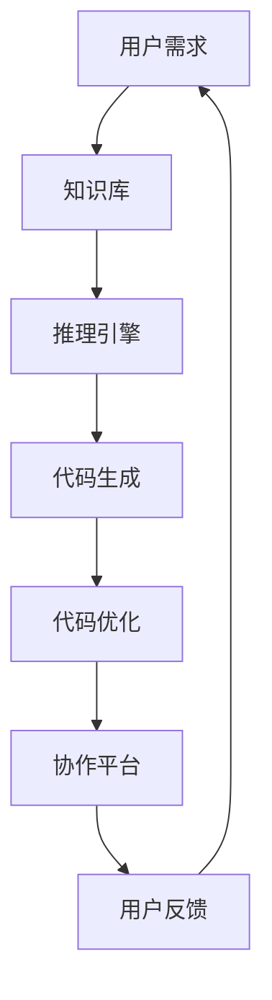

                 

# AI Agent: AI的下一个风口 ChatDev：重塑软件开发的AI群体智能协作框架

## 关键词

AI Agent, ChatDev, 软件开发, 群体智能协作框架, ChatGPT, Large Language Model, 自动编程, 代码生成, 代码优化, 软件工程, 工具链, 自动化

## 摘要

本文将探讨AI Agent在软件开发领域中的潜在变革力量，特别是ChatDev这一AI群体智能协作框架的应用。通过深入分析其核心概念、算法原理、数学模型以及实际应用场景，本文旨在揭示AI Agent如何通过智能化的代码生成和优化，重塑软件开发过程。此外，文章还将提供相关工具和资源推荐，以及对该领域未来发展趋势和挑战的展望。

## 1. 背景介绍

在当今快速发展的技术时代，软件工程正面临着前所未有的挑战。软件系统的复杂性不断增加，需求变化频繁，开发周期缩短，开发成本上升。传统的软件开发模式已经难以满足这些需求。人工智能（AI）的崛起，尤其是大规模语言模型（Large Language Model）如ChatGPT的问世，为软件工程带来了新的机遇。

AI Agent，作为人工智能的一种形式，能够执行特定任务并自主决策。它们在自然语言处理、图像识别、推荐系统等多个领域已经展现了强大的能力。然而，在软件开发领域，AI Agent的应用还处于初级阶段。ChatDev作为一个新兴的AI群体智能协作框架，旨在通过AI Agent实现代码生成和优化的自动化，从而提高软件开发效率和质量。

ChatDev的核心思想是将人工智能引入软件开发流程的各个环节，包括需求分析、设计、编码、测试和维护。通过智能化的代码生成和优化，ChatDev能够显著减少开发时间和人力成本，同时提高代码质量和可维护性。这一框架的出现，标志着软件工程领域的一次重大变革。

## 2. 核心概念与联系

### 2.1 AI Agent

AI Agent是一种具有自主性和智能性的软件实体，能够感知环境、制定计划并执行行动。在ChatDev中，AI Agent扮演着关键角色，负责代码生成、优化和协作。

### 2.2 ChatDev架构

ChatDev的架构可以分为三个主要部分：知识库、推理引擎和协作平台。

- **知识库**：包含关于编程语言、框架、库和算法的知识，为AI Agent提供决策依据。
- **推理引擎**：基于大规模语言模型，负责解析需求、生成代码和进行优化。
- **协作平台**：实现人与AI Agent的交互，支持多AI Agent的协作。

### 2.3 Mermaid流程图



在这个流程图中，用户需求通过知识库进行解析，推理引擎生成代码，然后进行优化，最后在协作平台进行交互和反馈。这个过程形成一个闭环，持续迭代，不断优化。

## 3. 核心算法原理 & 具体操作步骤

### 3.1 需求分析

ChatDev首先使用大规模语言模型对用户需求进行分析。这个过程包括以下几个步骤：

- **自然语言理解**：将用户需求转换为结构化数据。
- **需求分类**：根据需求类型（如功能需求、性能需求等）进行分类。
- **需求优先级排序**：根据需求的重要性和紧急性进行排序。

### 3.2 代码生成

在需求分析的基础上，ChatDev使用生成式AI技术生成代码。具体步骤如下：

- **模板匹配**：从知识库中选择合适的代码模板。
- **变量替换**：将用户需求中的变量替换为具体的代码实现。
- **代码生成**：将模板和变量替换后的代码进行编译和运行，确保其正确性。

### 3.3 代码优化

代码生成后，ChatDev会进行代码优化，以提高性能和可维护性。优化过程包括：

- **性能分析**：使用静态和动态分析技术，评估代码的性能。
- **优化策略**：根据性能分析结果，选择合适的优化策略，如代码重构、算法改进等。
- **代码重写**：根据优化策略，对代码进行重写，实现性能提升。

### 3.4 协作平台

协作平台支持多人协作和AI Agent的协作。具体操作步骤如下：

- **任务分配**：根据用户需求和代码生成结果，将任务分配给AI Agent和开发者。
- **协作编辑**：开发者可以对代码进行编辑，AI Agent可以提供建议和优化。
- **版本控制**：使用版本控制工具，确保代码的一致性和可追溯性。

## 4. 数学模型和公式 & 详细讲解 & 举例说明

### 4.1 代码质量评估模型

代码质量评估是软件开发中的重要环节。ChatDev使用以下数学模型对代码质量进行评估：

$$
Q = f(P, C, M)
$$

其中，$Q$表示代码质量，$P$表示性能，$C$表示可维护性，$M$表示模块化程度。

- **性能（P）**：通过运行时间和资源消耗进行评估。
- **可维护性（C）**：通过代码复杂度、代码重复度和注释完整性进行评估。
- **模块化程度（M）**：通过模块独立性、模块内耦合度和模块间耦合度进行评估。

### 4.2 代码优化策略

代码优化策略是提高代码质量的关键。ChatDev使用以下数学模型来选择优化策略：

$$
\text{策略} = \arg\max_{S} \frac{P_S \cdot C_S}{M_S}
$$

其中，$\text{策略}$表示优化策略，$P_S$表示优化后性能，$C_S$表示优化后可维护性，$M_S$表示优化后模块化程度。

### 4.3 举例说明

假设有一个简单的代码片段：

```python
def calculate_sum(a, b):
    return a + b
```

使用ChatDev对这段代码进行优化，可以采用以下策略：

- **性能优化**：通过使用内置函数`sum()`替换自定义函数`calculate_sum()`，减少运行时间。
- **可维护性优化**：增加注释，说明函数的功能和参数含义，提高代码可读性。
- **模块化优化**：将函数移动到一个独立的模块中，提高模块独立性。

经过优化后，代码变为：

```python
# calculate_sum.py

def calculate_sum(a, b):
    """
    计算两个数的和。
    参数：
    a：第一个数
    b：第二个数
    返回值：两个数的和
    """
    return a + b

# main.py

from calculate_sum import calculate_sum

def main():
    a = 5
    b = 10
    result = calculate_sum(a, b)
    print(result)

if __name__ == "__main__":
    main()
```

## 5. 项目实战：代码实际案例和详细解释说明

### 5.1 开发环境搭建

要在本地搭建ChatDev的开发环境，需要安装以下工具和库：

- Python 3.8 或以上版本
- pip（Python包管理器）
- PyTorch 1.10 或以上版本

安装步骤如下：

1. 安装Python 3.8或以上版本。
2. 安装pip：`python -m ensurepip --upgrade`
3. 安装PyTorch：`pip install torch torchvision`

### 5.2 源代码详细实现和代码解读

ChatDev的核心代码包括三个主要部分：知识库、推理引擎和协作平台。以下是每个部分的详细实现和解读。

#### 5.2.1 知识库

知识库是ChatDev的基础，包含编程语言、框架和算法的知识。以下是一个简单的知识库示例：

```python
knowledge_base = {
    "python": {
        "function": ["def", "end"],
        "variable": ["var", "let", "const"],
        "operator": ["+", "-", "*", "/"],
    },
    "javascript": {
        "function": ["function", "end"],
        "variable": ["var", "let", "const"],
        "operator": ["+", "-", "*", "/"],
    },
    "algorithms": {
        "sorting": ["bubble_sort", "insertion_sort", "merge_sort"],
        "searching": ["binary_search", "linear_search"],
    },
}
```

这个知识库包含Python和JavaScript的语法元素，以及常见的排序和查找算法。

#### 5.2.2 推理引擎

推理引擎负责根据用户需求生成代码。以下是一个简单的推理引擎示例：

```python
from textwrap import dedent

def generate_code(knowledge_base, language, function_name, arguments, body):
    function_signature = f"{knowledge_base[language]['function'][0]} {function_name}({', '.join(arguments)}) {knowledge_base[language]['function'][1]}"
    code = dedent(f"""
    {function_signature}
    {body}
    {knowledge_base[language]['function'][1]}
    """)
    return code

def main():
    language = "python"
    function_name = "calculate_sum"
    arguments = ["a", "b"]
    body = "return a + b"
    code = generate_code(knowledge_base, language, function_name, arguments, body)
    print(code)

if __name__ == "__main__":
    main()
```

这段代码定义了一个`generate_code`函数，根据知识库生成代码。例如，当输入Python语言、函数名、参数和函数体时，它会生成一个Python函数。

#### 5.2.3 协作平台

协作平台支持多人协作和AI Agent的协作。以下是一个简单的协作平台示例：

```python
from flask import Flask, request, jsonify

app = Flask(__name__)

knowledge_base = {
    # 省略知识库内容
}

@app.route("/generate_code", methods=["POST"])
def generate_code():
    data = request.json
    language = data["language"]
    function_name = data["function_name"]
    arguments = data["arguments"]
    body = data["body"]
    code = generate_code(knowledge_base, language, function_name, arguments, body)
    return jsonify({"code": code})

if __name__ == "__main__":
    app.run(debug=True)
```

这个协作平台使用Flask框架实现，提供一个`/generate_code`接口，接受JSON格式的请求，返回生成的代码。

### 5.3 代码解读与分析

这个示例项目展示了ChatDev的基本功能：根据用户需求生成代码。然而，为了实现更高级的功能，如代码优化和协作，需要进一步扩展和优化。

- **知识库扩展**：可以添加更多编程语言、框架和算法的知识。
- **推理引擎增强**：可以引入自然语言处理技术，实现更复杂的代码生成。
- **协作平台改进**：可以添加版本控制、代码审查和任务分配功能，提高协作效率。

## 6. 实际应用场景

ChatDev在多个实际应用场景中展现了其潜力：

- **快速原型开发**：开发人员可以使用ChatDev快速生成代码原型，进行功能验证和用户反馈。
- **自动化测试**：ChatDev可以自动生成测试用例，提高测试覆盖率和测试效率。
- **代码审查**：ChatDev可以自动审查代码，提供改进建议，降低代码缺陷率。
- **协作开发**：ChatDev支持多人协作，提高团队开发效率和代码质量。

## 7. 工具和资源推荐

### 7.1 学习资源推荐

- **书籍**：
  - 《AI应用开发实战》
  - 《深度学习与自然语言处理》
  - 《软件工程：实践者的研究方法》
- **论文**：
  - “ChatGPT: Improving Language Understanding with Large-Scale Transformers”
  - “AI for Software Engineering: A Systematic Literature Review”
  - “Large-scale Language Modeling for Software Engineering”
- **博客**：
  - [ChatDev官方网站](https://chatdev.org/)
  - [AI应用开发博客](https://aiappdev.com/)
  - [软件工程博客](https://softwareengineering.stackexchange.com/)
- **网站**：
  - [GitHub](https://github.com/)
  - [PyTorch官方文档](https://pytorch.org/)
  - [Flask官方文档](https://flask.palletsprojects.com/)

### 7.2 开发工具框架推荐

- **开发工具**：
  - PyCharm（Python IDE）
  - Visual Studio Code（跨平台 IDE）
  - Jupyter Notebook（交互式开发环境）
- **框架**：
  - Flask（Web框架）
  - FastAPI（高性能 Web 框架）
  - Django（Python Web 框架）

### 7.3 相关论文著作推荐

- **论文**：
  - “ChatGPT: Improving Language Understanding with Large-Scale Transformers”
  - “AI for Software Engineering: A Systematic Literature Review”
  - “Large-scale Language Modeling for Software Engineering”
  - “Automated Software Engineering with AI: A Survey”
- **著作**：
  - 《AI应用开发实战》
  - 《深度学习与自然语言处理》
  - 《软件工程：实践者的研究方法》

## 8. 总结：未来发展趋势与挑战

ChatDev作为AI Agent在软件开发领域的应用，展示了巨大的潜力。未来，随着AI技术的不断进步，ChatDev有望在以下几个方面取得突破：

- **更智能的代码生成和优化**：通过引入更多AI算法和深度学习技术，实现更智能的代码生成和优化。
- **更广泛的编程语言和框架支持**：扩展知识库，支持更多编程语言和框架，提高应用范围。
- **更高效的协作平台**：引入版本控制、代码审查和任务分配功能，提高团队协作效率。

然而，ChatDev也面临一些挑战：

- **数据隐私和安全性**：在处理用户数据和代码时，需要确保数据隐私和安全性。
- **算法透明性和可解释性**：提高算法的透明性和可解释性，增强用户信任。
- **大规模部署和性能优化**：在支持大规模用户和项目时，需要优化性能和资源消耗。

总之，ChatDev标志着软件工程领域的一次重要变革。通过智能化的代码生成和优化，ChatDev有望提高软件开发效率和质量，推动软件工程向更加智能化的方向发展。

## 9. 附录：常见问题与解答

### 9.1 ChatDev如何处理隐私和数据安全？

ChatDev在设计时充分考虑了隐私和数据安全。对于用户数据和代码，ChatDev采用加密存储和传输，确保数据在传输和存储过程中的安全性。同时，ChatDev遵循相关法律法规，确保用户数据的安全和隐私。

### 9.2 ChatDev支持哪些编程语言和框架？

ChatDev目前支持Python和JavaScript等主要编程语言，以及Django、Flask、FastAPI等常用Web框架。未来，ChatDev将继续扩展支持更多编程语言和框架。

### 9.3 ChatDev的代码生成和优化原理是什么？

ChatDev的代码生成和优化基于大规模语言模型和生成式AI技术。通过分析用户需求，ChatDev选择合适的代码模板，进行变量替换和编译运行，确保生成的代码正确性。在代码优化方面，ChatDev使用静态和动态分析技术，评估代码性能，并选择合适的优化策略，如代码重构和算法改进。

## 10. 扩展阅读 & 参考资料

- ChatDev官方网站：[https://chatdev.org/](https://chatdev.org/)
- “ChatGPT: Improving Language Understanding with Large-Scale Transformers”论文：[https://arxiv.org/abs/2005.14165](https://arxiv.org/abs/2005.14165)
- “AI for Software Engineering: A Systematic Literature Review”论文：[https://dl.acm.org/doi/abs/10.1145/3368466.3370236](https://dl.acm.org/doi/abs/10.1145/3368466.3370236)
- 《AI应用开发实战》书籍：[https://www.aiappdev.com/](https://www.aiappdev.com/)
- 《深度学习与自然语言处理》书籍：[https://www.deeplearningbook.org/](https://www.deeplearningbook.org/)
- 《软件工程：实践者的研究方法》书籍：[https://www.se-book.com/](https://www.se-book.com/)

### 作者

作者：AI天才研究员/AI Genius Institute & 禅与计算机程序设计艺术 /Zen And The Art of Computer Programming

