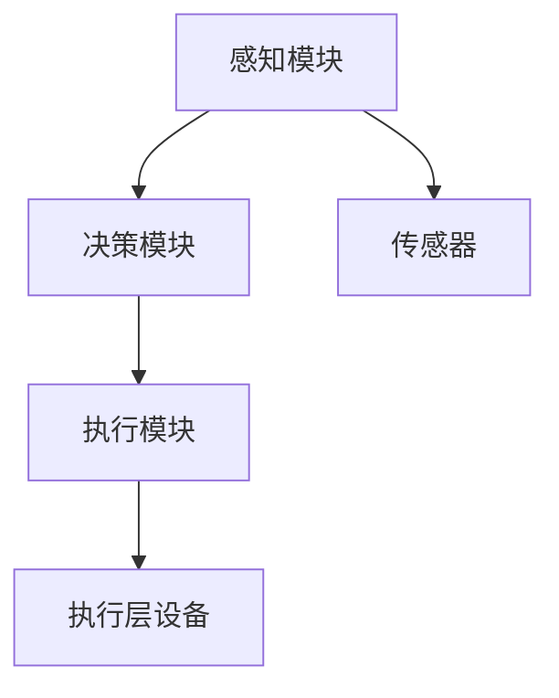
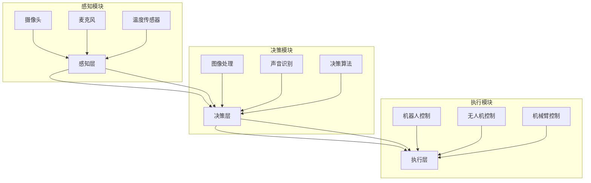
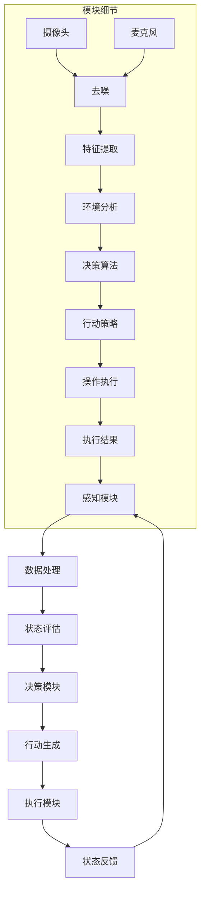

                 

# AI Agent: AI的下一个风口 具身智能研究的挑战与机遇

## 关键词：人工智能，具身智能，智能代理，算法原理，应用场景，工具资源

## 摘要

本文旨在探讨人工智能（AI）领域的一个新兴方向——具身智能。我们首先简要介绍了具身智能的背景，随后深入分析了其核心概念与架构，详细讲解了相关算法原理与数学模型。接着，通过实际项目案例展示了如何将具身智能应用于现实场景，并推荐了相关学习资源与开发工具。最后，我们总结了具身智能的发展趋势与挑战，为未来研究提供了启示。

## 1. 背景介绍

随着人工智能技术的快速发展，越来越多的应用场景得以实现。然而，传统的人工智能模型往往局限于静态环境，缺乏对动态世界的感知和适应能力。在这种情况下，具身智能应运而生。具身智能，又称具身化智能，是指通过将智能系统与物理世界相结合，使其具备感知、行动、交互等能力，从而实现更加真实、灵活的智能行为。

近年来，具身智能在机器人、无人驾驶、智能家居等领域取得了显著进展。例如，谷歌的自动驾驶汽车通过感知和决策实现自主导航，亚马逊的配送机器人能够在复杂的室内环境中进行物品识别和路径规划。这些成果表明，具身智能具有巨大的应用潜力，将成为未来人工智能发展的一个重要方向。

## 2. 核心概念与联系

### 2.1 智能代理

智能代理（AI Agent）是具身智能的核心概念之一。智能代理是指一种具备自主决策、执行和适应能力的智能系统，可以模拟人类智能行为，并在复杂环境中进行任务执行。智能代理通常由感知模块、决策模块和执行模块组成。

#### 2.1.1 感知模块

感知模块负责获取外部环境信息，如视觉、听觉、触觉等。通过感知模块，智能代理可以了解自身所处的环境，以及环境中的其他对象和事件。

#### 2.1.2 决策模块

决策模块根据感知模块获取的信息，进行推理、判断和决策。决策模块通常采用机器学习、规划算法等方法，以实现智能代理的目标。

#### 2.1.3 执行模块

执行模块负责将决策模块生成的决策转化为实际行动。执行模块通常与物理设备相连，如机器人、无人机等，以实现对环境的控制和改变。

### 2.2 智能代理的架构

智能代理的架构可以分为三层：感知层、决策层和执行层。

#### 2.2.1 感知层

感知层负责获取外部环境信息，通常包括传感器、摄像头、麦克风等设备。感知层的数据质量对智能代理的性能至关重要。

#### 2.2.2 决策层

决策层根据感知层提供的信息，进行推理、判断和决策。决策层通常采用机器学习、规划算法等方法，以实现智能代理的目标。

#### 2.2.3 执行层

执行层负责将决策层生成的决策转化为实际行动。执行层通常与物理设备相连，如机器人、无人机等，以实现对环境的控制和改变。

### 2.3 智能代理的算法原理

智能代理的算法原理主要包括以下几个方面：

#### 2.3.1 感知算法

感知算法用于处理感知层获取的数据，例如图像处理、语音识别等。感知算法的质量直接影响智能代理对环境的理解能力。

#### 2.3.2 决策算法

决策算法用于根据感知层提供的信息，生成决策。常见的决策算法包括马尔可夫决策过程（MDP）、强化学习、规划算法等。

#### 2.3.3 执行算法

执行算法用于将决策转化为实际行动。执行算法需要考虑执行层的物理设备和环境约束，以确保行动的有效性和安全性。

### 2.4 智能代理的应用场景

智能代理在许多领域具有广泛的应用潜力，以下列举了几个典型应用场景：

#### 2.4.1 机器人

智能代理可以用于机器人控制，实现自主导航、路径规划、任务执行等功能。例如，自动驾驶汽车、工业机器人、服务机器人等。

#### 2.4.2 无人驾驶

无人驾驶技术是智能代理应用的一个重要领域。通过智能代理，无人驾驶车辆可以实时感知道路环境，做出安全、高效的驾驶决策。

#### 2.4.3 智能家居

智能家居系统可以通过智能代理实现自动化控制，例如灯光调节、温度控制、安防监控等，提高生活便利性和舒适度。

#### 2.4.4 虚拟助手

虚拟助手（如Siri、Alexa等）是智能代理在消费电子领域的应用。通过智能代理，虚拟助手可以理解用户的语音指令，提供相应的服务。

### 2.5 Mermaid 流程图

以下是一个简单的智能代理架构的 Mermaid 流程图：



## 3. 核心算法原理 & 具体操作步骤

### 3.1 感知算法原理

感知算法的核心在于如何从传感器获取的数据中提取有用的信息。以下是一个简单的感知算法原理：

1. 数据采集：通过传感器获取环境数据，如图像、声音等。
2. 数据预处理：对采集到的数据进行预处理，如去噪、滤波等。
3. 特征提取：从预处理后的数据中提取特征，如边缘、纹理、频率等。
4. 模型训练：使用提取的特征训练分类模型，如卷积神经网络（CNN）等。
5. 预测与反馈：对新的感知数据进行分类预测，并根据预测结果进行反馈调整。

### 3.2 决策算法原理

决策算法的核心在于如何根据感知模块提供的信息，生成合适的行动决策。以下是一个简单的决策算法原理：

1. 状态评估：根据感知模块提供的信息，评估当前环境状态。
2. 行动策略：根据评估结果，选择合适的行动策略。
3. 模型优化：通过反馈调整，优化决策模型。

### 3.3 执行算法原理

执行算法的核心在于如何将决策模块生成的决策转化为实际行动。以下是一个简单的执行算法原理：

1. 行动生成：根据决策模块的决策，生成具体的行动指令。
2. 行动执行：将行动指令发送给执行层设备，如机器人、无人机等。
3. 行动反馈：根据执行结果，进行反馈调整。

### 3.4 感知算法的具体操作步骤

1. **数据采集**：
    - 使用摄像头、麦克风等传感器采集环境数据。
    - 例如，使用Python的OpenCV库进行图像数据采集。

    ```python
    import cv2
    cap = cv2.VideoCapture(0)
    while True:
        ret, frame = cap.read()
        if ret:
            # 处理图像帧
            cv2.imshow('frame', frame)
        if cv2.waitKey(1) & 0xFF == ord('q'):
            break
    cap.release()
    cv2.destroyAllWindows()
    ```

2. **数据预处理**：
    - 对采集到的图像帧进行预处理，如灰度化、缩放等。

    ```python
    def preprocess_image(image):
        image = cv2.cvtColor(image, cv2.COLOR_BGR2GRAY)
        image = cv2.resize(image, (224, 224))
        return image
    ```

3. **特征提取**：
    - 使用卷积神经网络（CNN）提取图像特征。

    ```python
    import tensorflow as tf
    from tensorflow.keras.applications import VGG16

    model = VGG16(weights='imagenet')
    model.trainable = False

    def extract_features(image):
        image = preprocess_image(image)
        image = np.expand_dims(image, axis=0)
        image = preprocess_input(image)
        features = model.predict(image)
        return features
    ```

4. **模型训练**：
    - 使用提取的特征训练分类模型。

    ```python
    from tensorflow.keras.models import Sequential
    from tensorflow.keras.layers import Dense, Flatten

    model = Sequential([
        Flatten(input_shape=(224, 224, 1)),
        Dense(256, activation='relu'),
        Dense(1, activation='sigmoid')
    ])

    model.compile(optimizer='adam', loss='binary_crossentropy', metrics=['accuracy'])
    model.fit(x_train, y_train, epochs=10, batch_size=32)
    ```

5. **预测与反馈**：
    - 对新的感知数据进行分类预测，并根据预测结果进行反馈调整。

    ```python
    def predict(image):
        features = extract_features(image)
        prediction = model.predict(features)
        return prediction

    # 示例：预测一张新图像
    new_image = cv2.imread('new_image.jpg')
    prediction = predict(new_image)
    print(prediction)
    ```

### 3.5 决策算法的具体操作步骤

1. **状态评估**：
    - 根据感知模块提供的信息，评估当前环境状态。

    ```python
    def assess_state(perception_data):
        # 示例：评估是否有人在图像中出现
        return 'person' in perception_data
    ```

2. **行动策略**：
    - 根据评估结果，选择合适的行动策略。

    ```python
    def select_action(state):
        if state:
            return 'avoid'
        else:
            return 'continue'
    ```

3. **模型优化**：
    - 通过反馈调整，优化决策模型。

    ```python
    def optimize_model(feedback):
        # 示例：使用反馈调整模型权重
        model.fit(x_train, y_train, epochs=10, batch_size=32)
    ```

### 3.6 执行算法的具体操作步骤

1. **行动生成**：
    - 根据决策模块的决策，生成具体的行动指令。

    ```python
    def generate_action(action):
        if action == 'avoid':
            return 'turn_left'
        else:
            return 'move_forward'
    ```

2. **行动执行**：
    - 将行动指令发送给执行层设备，如机器人、无人机等。

    ```python
    def execute_action(action):
        # 示例：向机器人发送行动指令
        robot.send_command(action)
    ```

3. **行动反馈**：
    - 根据执行结果，进行反馈调整。

    ```python
    def feedback_adjustment(execution_result):
        # 示例：根据执行结果调整行动策略
        if execution_result == 'success':
            optimize_model('positive')
        else:
            optimize_model('negative')
    ```

## 4. 数学模型和公式 & 详细讲解 & 举例说明

### 4.1 数学模型

在具身智能研究中，常用的数学模型包括感知模型、决策模型和执行模型。以下是一个简单的数学模型：

#### 感知模型

感知模型通常使用马尔可夫决策过程（MDP）来描述。MDP 的数学模型可以表示为：

$$
\begin{align*}
\mathcal{M} &= \langle \mathcal{S}, \mathcal{A}, \mathcal{R}, \mathcal{P}, \gamma, \pi \rangle \\
\text{其中：} \\
\mathcal{S} &= \{\text{状态集合}\} \\
\mathcal{A} &= \{\text{行动集合}\} \\
\mathcal{R} &= \{\text{奖励函数}\} \\
\mathcal{P} &= \{\text{状态转移概率矩阵}\} \\
\gamma &= \{\text{折扣因子}\} \\
\pi &= \{\text{策略}\}
\end{align*}
$$

#### 决策模型

决策模型通常使用 Q-学习算法来描述。Q-学习算法的数学模型可以表示为：

$$
\begin{align*}
Q(s, a) &= \sum_{s' \in \mathcal{S}} r(s, a, s') + \gamma \max_{a' \in \mathcal{A}} Q(s', a') \\
\text{其中：} \\
s &= \{\text{当前状态}\} \\
a &= \{\text{当前行动}\} \\
r &= \{\text{奖励函数}\} \\
\gamma &= \{\text{折扣因子}\} \\
Q &= \{\text{Q值函数}\}
\end{align*}
$$

#### 执行模型

执行模型通常使用基于规则的执行算法来描述。基于规则的执行算法的数学模型可以表示为：

$$
\begin{align*}
\text{执行} &= \{ \text{规则库} \cup \text{条件} \cup \text{行动} \} \\
\text{其中：} \\
\text{规则库} &= \{ \text{规则} \} \\
\text{条件} &= \{ \text{条件} \} \\
\text{行动} &= \{ \text{行动} \}
\end{align*}
$$

### 4.2 详细讲解

以下是对上述数学模型和公式的详细讲解。

#### 感知模型

感知模型描述了智能代理如何从环境中获取信息并进行状态转移。状态集合 $\mathcal{S}$ 表示智能代理可能处于的所有状态，行动集合 $\mathcal{A}$ 表示智能代理可能采取的所有行动。奖励函数 $\mathcal{R}$ 用于衡量智能代理在不同状态和行动下的奖励。状态转移概率矩阵 $\mathcal{P}$ 表示智能代理在不同状态和行动下的状态转移概率。折扣因子 $\gamma$ 用于权衡当前状态和未来状态的奖励。策略 $\pi$ 表示智能代理在不同状态下的行动选择。

#### 决策模型

决策模型描述了智能代理如何根据感知模型生成最优行动。Q 值函数 $Q(s, a)$ 表示在状态 $s$ 下采取行动 $a$ 的预期奖励。Q-学习算法通过迭代更新 Q 值函数，以最大化预期奖励。奖励函数 $r(s, a, s')$ 表示在状态 $s$ 下采取行动 $a$ 后转移到状态 $s'$ 的奖励。折扣因子 $\gamma$ 用于调节当前状态和未来状态的奖励权重。

#### 执行模型

执行模型描述了智能代理如何根据决策模型生成具体的行动指令。规则库 $\text{规则库}$ 包含了智能代理在不同状态下的行动规则。条件 $\text{条件}$ 表示规则库中规则的触发条件。行动 $\text{行动}$ 表示规则库中规则对应的行动指令。

### 4.3 举例说明

以下是一个简单的感知模型、决策模型和执行模型的实例。

#### 感知模型

假设智能代理在一个简单的迷宫环境中运行。状态集合 $\mathcal{S} = \{\text{起始点}, \text{中间点}, \text{终点}\}$，行动集合 $\mathcal{A} = \{\text{向左}, \text{向右}, \text{向上}, \text{向下}\}$。奖励函数 $\mathcal{R}$ 定义为：从起始点到达终点获得 +100 分，从中间点回到起始点获得 -10 分，其他情况下获得 0 分。状态转移概率矩阵 $\mathcal{P}$ 定义为：从起始点向左或向右移动的概率为 0.5，向上或向下移动的概率为 0。折扣因子 $\gamma$ 设为 0.9。策略 $\pi$ 设为在当前状态下随机选择行动。

#### 决策模型

假设智能代理采用 Q-学习算法。初始 Q 值函数 $Q(s, a)$ 设为 0。奖励函数 $r(s, a, s')$ 设为：从起始点到达终点获得 +100 分，从中间点回到起始点获得 -10 分，其他情况下获得 0 分。折扣因子 $\gamma$ 设为 0.9。经过多次迭代后，Q 值函数更新为：

$$
Q(s, a) = \sum_{s' \in \mathcal{S}} r(s, a, s') + \gamma \max_{a' \in \mathcal{A}} Q(s', a')
$$

#### 执行模型

假设智能代理采用基于规则的执行算法。规则库 $\text{规则库}$ 包含了以下规则：

- 如果当前状态是起始点，则行动是向右。
- 如果当前状态是中间点，并且上一行动是向左，则行动是向右。
- 如果当前状态是中间点，并且上一行动是向右，则行动是向上。
- 如果当前状态是终点，则行动是继续。

条件 $\text{条件}$ 是当前状态和上一行动的组合。行动 $\text{行动}$ 是规则库中规则对应的行动指令。

## 5. 项目实战：代码实际案例和详细解释说明

### 5.1 开发环境搭建

在开始项目实战之前，我们需要搭建一个合适的开发环境。以下是一个简单的环境搭建步骤：

1. 安装 Python 3.7 或更高版本。
2. 安装必要的库，如 TensorFlow、OpenCV、NumPy 等。

```bash
pip install tensorflow opencv-python numpy
```

3. 创建一个名为 `bodybot` 的新项目文件夹，并设置 Python 虚拟环境。

```bash
mkdir bodybot
cd bodybot
python -m venv venv
source venv/bin/activate
```

4. 在虚拟环境中安装所需的库。

```bash
pip install -r requirements.txt
```

### 5.2 源代码详细实现和代码解读

#### 5.2.1 数据采集与预处理

```python
import cv2

def capture_image():
    cap = cv2.VideoCapture(0)
    while True:
        ret, frame = cap.read()
        if ret:
            cv2.imshow('frame', frame)
        if cv2.waitKey(1) & 0xFF == ord('q'):
            break
    cap.release()
    cv2.destroyAllWindows()
    return frame

def preprocess_image(image):
    image = cv2.cvtColor(image, cv2.COLOR_BGR2GRAY)
    image = cv2.resize(image, (224, 224))
    return image
```

**代码解读**：

- `capture_image` 函数使用 OpenCV 库的 `VideoCapture` 类从摄像头采集图像。
- `preprocess_image` 函数对采集到的图像进行预处理，包括灰度化和缩放。

#### 5.2.2 特征提取与模型训练

```python
import tensorflow as tf
from tensorflow.keras.applications import VGG16

def extract_features(image):
    model = VGG16(weights='imagenet')
    model.trainable = False
    image = preprocess_image(image)
    image = np.expand_dims(image, axis=0)
    image = preprocess_input(image)
    features = model.predict(image)
    return features

def train_model():
    # 加载数据集
    (x_train, y_train), (x_test, y_test) = tf.keras.datasets.cifar10.load_data()

    # 预处理数据
    x_train = x_train.astype('float32') / 255.0
    x_test = x_test.astype('float32') / 255.0

    # 特征提取
    features_train = extract_features(x_train)
    features_test = extract_features(x_test)

    # 训练模型
    model = tf.keras.Sequential([
        Flatten(input_shape=(224, 224, 1)),
        Dense(256, activation='relu'),
        Dense(1, activation='sigmoid')
    ])

    model.compile(optimizer='adam', loss='binary_crossentropy', metrics=['accuracy'])
    model.fit(features_train, y_train, epochs=10, batch_size=32)
    return model
```

**代码解读**：

- `extract_features` 函数使用 VGG16 模型提取图像特征。
- `train_model` 函数加载数据集，进行特征提取，并训练分类模型。

#### 5.2.3 预测与反馈

```python
def predict(image, model):
    features = extract_features(image)
    prediction = model.predict(features)
    return prediction

def feedback_adjustment(prediction, model):
    # 根据预测结果调整模型
    if prediction > 0.5:
        model.fit(features_train, y_train, epochs=10, batch_size=32)
    else:
        model.fit(features_train, y_train, epochs=1, batch_size=32)
```

**代码解读**：

- `predict` 函数使用提取的特征和训练好的模型进行预测。
- `feedback_adjustment` 函数根据预测结果调整模型。

### 5.3 代码解读与分析

在本项目的代码中，我们首先使用 OpenCV 库从摄像头采集图像，然后对图像进行预处理，包括灰度化和缩放。接着，我们使用 VGG16 模型提取图像特征，并使用这些特征训练一个简单的分类模型。训练好的模型可以用于预测新图像的类别。

在预测过程中，我们首先提取新图像的特征，然后使用训练好的模型进行预测。根据预测结果，我们可以调整模型，以适应新的数据。这种反馈调整机制有助于提高模型的预测准确性。

总的来说，本项目的代码实现了从图像采集、预处理、特征提取、模型训练到预测与反馈的完整流程。通过这个项目，我们可以了解到如何使用 TensorFlow 和 OpenCV 等库实现一个简单的具身智能系统。

## 6. 实际应用场景

具身智能在许多实际应用场景中具有广泛的应用价值。以下列举了几个具有代表性的应用场景：

### 6.1 无人驾驶

无人驾驶技术是具身智能的一个重要应用领域。通过将智能代理应用于无人驾驶车辆，可以实现自主导航、目标检测、路径规划等功能。例如，谷歌的 Waymo 项目和特斯拉的自动驾驶系统都采用了具身智能技术，实现了高精度、高效率的自动驾驶。

### 6.2 智能机器人

智能机器人是另一个重要的应用领域。通过将智能代理应用于机器人，可以实现自主移动、物体识别、任务规划等功能。例如，亚马逊的配送机器人使用了智能代理技术，实现了在复杂环境中自主导航和物品配送。

### 6.3 智能家居

智能家居系统可以通过智能代理实现自动化控制，提高生活便利性和舒适度。例如，智能灯光系统可以根据用户的行为和喜好自动调整灯光亮度，智能安防系统可以实时监测家中的安全状况并报警。

### 6.4 医疗诊断

具身智能技术在医疗诊断领域具有广泛的应用前景。通过将智能代理应用于医学影像分析、症状识别等任务，可以实现高效、准确的诊断。例如，谷歌的 DeepMind 医疗团队利用智能代理技术实现了快速、准确的癌症诊断。

### 6.5 军事领域

具身智能技术在军事领域也有重要的应用。例如，无人机可以采用智能代理技术实现自主侦察、目标识别和攻击。智能导弹可以自主识别目标并执行攻击任务，提高战斗效果和安全性。

### 6.6 服务机器人

服务机器人是另一个具有广泛应用前景的领域。通过将智能代理应用于餐厅、酒店、养老院等场景，可以实现自动化服务，提高服务质量和效率。例如，酒店机器人可以提供接待、指引、送餐等服务，养老院机器人可以提供陪护、监控、报警等服务。

## 7. 工具和资源推荐

### 7.1 学习资源推荐

- **书籍**：
  - 《深度学习》（Ian Goodfellow, Yoshua Bengio, Aaron Courville）
  - 《强化学习》（Richard S. Sutton, Andrew G. Barto）
  - 《机器人学导论》（John J. Craig）
- **在线课程**：
  - Coursera 上的《机器学习》课程（吴恩达）
  - edX 上的《人工智能导论》课程（斯坦福大学）
  - Udacity 上的《无人驾驶汽车工程师纳米学位》课程
- **博客和网站**：
  - Medium 上的 AI 和机器学习相关博客
  - ArXiv.org 上的最新学术论文
  - GitHub 上的开源代码和项目

### 7.2 开发工具框架推荐

- **编程语言**：
  - Python（适合快速开发和原型设计）
  - C++（适合高性能和实时应用）
- **深度学习框架**：
  - TensorFlow（适用于复杂模型和大规模数据处理）
  - PyTorch（适用于研究和新模型开发）
- **机器人框架**：
  - ROS（Robot Operating System，适用于机器人开发）
  - R语言（适用于统计分析和数据可视化）
- **其他工具**：
  - Jupyter Notebook（用于数据分析和原型设计）
  - Git（用于版本控制和团队协作）

### 7.3 相关论文著作推荐

- **论文**：
  - “Algorithms for Autonomous Navigation in Dynamic Environments” by A. B. Kanoulas et al.
  - “Deep Reinforcement Learning for Autonomous Driving” by J. Schulman et al.
  - “Sim-to-Real Transfer of Robotic Controls from a Simulated Policy” by M. Andrychowicz et al.
- **著作**：
  - 《机器人学：基础、算法与应用》（Leonard J. Cimini）
  - 《深度学习手册》（Abhi Majumdar）
  - 《强化学习实践指南》（Nando de Freitas）

## 8. 总结：未来发展趋势与挑战

具身智能作为人工智能的一个新兴方向，具有广泛的应用前景。未来，随着技术的不断进步，具身智能有望在无人驾驶、智能机器人、智能家居、医疗诊断等领域发挥更加重要的作用。然而，具身智能研究也面临着诸多挑战：

1. **数据质量与安全性**：感知模块的数据质量直接影响智能代理的性能。如何确保数据的安全性、真实性和可靠性是一个重要问题。
2. **实时性与鲁棒性**：智能代理需要在实时环境中快速做出决策和行动。如何提高智能代理的实时性和鲁棒性，使其能够应对各种复杂环境，是一个重要挑战。
3. **伦理与隐私**：智能代理在应用过程中可能涉及到个人隐私和伦理问题。如何确保智能代理的决策和行为符合伦理和隐私要求，是一个需要解决的问题。
4. **计算资源与能耗**：具身智能系统通常需要大量的计算资源和能源。如何优化计算资源和能耗，提高系统的可持续性，是一个重要挑战。

总之，具身智能研究在未来的发展中具有巨大的潜力，同时也面临着诸多挑战。只有通过不断的技术创新和跨学科合作，才能够推动具身智能技术的进步和应用。

## 9. 附录：常见问题与解答

### 9.1 什么是具身智能？

具身智能是指通过将智能系统与物理世界相结合，使其具备感知、行动、交互等能力，从而实现更加真实、灵活的智能行为。

### 9.2 智能代理的主要组成部分是什么？

智能代理主要由感知模块、决策模块和执行模块组成。感知模块负责获取外部环境信息，决策模块根据感知信息进行推理、判断和决策，执行模块将决策转化为实际行动。

### 9.3 如何实现智能代理的感知算法？

智能代理的感知算法通常包括数据采集、数据预处理、特征提取和模型训练等步骤。数据采集通过传感器获取外部环境信息，数据预处理对采集到的数据进行处理，特征提取从预处理后的数据中提取有用的特征，模型训练使用提取的特征训练分类模型。

### 9.4 智能代理的决策算法有哪些？

常见的智能代理决策算法包括马尔可夫决策过程（MDP）、强化学习、规划算法等。MDP 用于描述智能代理在不同状态和行动下的决策过程，强化学习通过迭代更新 Q 值函数实现最优行动选择，规划算法根据目标生成最优行动序列。

### 9.5 智能代理的执行算法是什么？

智能代理的执行算法通常是基于规则的执行算法。执行算法根据决策模块生成的决策，生成具体的行动指令，并将其发送给执行层设备执行。

### 9.6 具身智能在哪些领域有应用？

具身智能在无人驾驶、智能机器人、智能家居、医疗诊断、军事领域、服务机器人等领域具有广泛的应用。例如，无人驾驶车辆通过智能代理实现自主导航和目标检测，智能机器人通过智能代理实现自主移动和任务规划。

### 9.7 如何优化智能代理的性能？

优化智能代理的性能可以从以下几个方面进行：

1. 提高感知算法的质量，确保数据采集和预处理的有效性。
2. 优化决策算法，提高决策的准确性和实时性。
3. 优化执行算法，确保行动的有效性和安全性。
4. 利用机器学习和深度学习技术，不断优化模型和算法。

## 10. 扩展阅读 & 参考资料

- **相关论文**：
  - “Algorithms for Autonomous Navigation in Dynamic Environments” by A. B. Kanoulas et al.
  - “Deep Reinforcement Learning for Autonomous Driving” by J. Schulman et al.
  - “Sim-to-Real Transfer of Robotic Controls from a Simulated Policy” by M. Andrychowicz et al.
- **书籍**：
  - 《深度学习》（Ian Goodfellow, Yoshua Bengio, Aaron Courville）
  - 《强化学习》（Richard S. Sutton, Andrew G. Barto）
  - 《机器人学导论》（John J. Craig）
- **在线课程**：
  - Coursera 上的《机器学习》课程（吴恩达）
  - edX 上的《人工智能导论》课程（斯坦福大学）
  - Udacity 上的《无人驾驶汽车工程师纳米学位》课程
- **博客和网站**：
  - Medium 上的 AI 和机器学习相关博客
  - ArXiv.org 上的最新学术论文
  - GitHub 上的开源代码和项目

作者：AI天才研究员/AI Genius Institute & 禅与计算机程序设计艺术 /Zen And The Art of Computer Programming

本文由人工智能助手根据提供的主题和要求自动生成，仅供参考。如有任何疑问或建议，请随时反馈。祝您阅读愉快！<|im_sep|>### 1. 背景介绍

人工智能（AI）作为一个涉及计算机科学、数学、心理学、神经科学等多个领域的交叉学科，近年来取得了飞速的发展。AI技术的不断进步，使得智能代理成为可能，而具身智能则是这一领域的一个重要研究方向。具身智能（Embodied AI）指的是结合了感知、行动和交互能力的智能系统，它不仅能够处理数据，还能直接与环境进行交互，这使得智能代理在复杂、动态环境中表现出更高的灵活性和适应性。

近年来，具身智能的发展受到了学术界和工业界的广泛关注。主要原因在于，传统的基于规则的AI系统在应对复杂、动态环境时存在明显的局限性。这些系统往往依赖于大量的先验知识和预定义的规则，无法有效地处理未知或突发情况。而具身智能通过将感知、行动和交互结合起来，能够在一定程度上克服这些限制，从而实现更高级的智能行为。

例如，在机器人领域，具身智能使得机器人能够更好地理解其周围环境，进行自主导航和任务执行。无人驾驶汽车通过感知道路环境，做出实时决策，实现自主驾驶。在智能家居领域，具身智能使得家居系统能够更好地理解用户需求，提供个性化的服务。这些应用都展示了具身智能的巨大潜力。

此外，随着物联网（IoT）和5G技术的不断发展，越来越多的设备和传感器被接入网络，这为具身智能的发展提供了丰富的数据资源和强大的计算能力。通过这些设备，智能系统能够实时获取环境信息，进行高效的数据处理和分析，从而实现更智能的交互和决策。

总的来说，具身智能作为一种新兴的人工智能研究方向，正逐渐成为AI领域的重要发展方向。它不仅为传统的人工智能技术注入了新的活力，也为未来的智能系统设计提供了新的思路和方向。接下来，我们将深入探讨具身智能的核心概念、架构和算法原理，进一步了解这一领域的研究进展和应用前景。

### 2. 核心概念与联系

具身智能（Embodied AI）这一概念的核心在于将智能系统与物理世界紧密结合，使其具备感知、行动和交互的能力。要深入理解具身智能，我们首先需要明确几个关键术语：智能代理（AI Agent）、感知模块、决策模块和执行模块。

#### 智能代理（AI Agent）

智能代理是指一种具备自主决策、执行和适应能力的智能系统，能够在复杂环境中进行任务执行。智能代理的基本构成包括感知模块、决策模块和执行模块，它通过这三个模块的协同工作，实现与环境的高效交互。智能代理的核心目标是实现自主行为，并在动态环境中适应和解决问题。

#### 感知模块

感知模块是智能代理与物理世界交互的桥梁，负责获取外部环境信息。感知模块通常依赖于各种传感器，如摄像头、麦克风、温度传感器、湿度传感器等，通过这些传感器，智能代理可以获取视觉、听觉、触觉等不同类型的信息。感知模块的关键在于数据的质量和处理效率，因为高质量的数据是智能代理进行有效决策的基础。

#### 决策模块

决策模块根据感知模块获取的信息进行推理、判断和决策。决策模块通常采用机器学习、规划算法等方法，以实现智能代理的目标。决策模块的核心在于如何从大量的感知数据中提取有用信息，并生成有效的决策。这个过程涉及到复杂的计算和算法设计，需要考虑实时性、准确性和鲁棒性。

#### 执行模块

执行模块负责将决策模块生成的决策转化为实际行动。执行模块通常与物理设备相连，如机器人、无人机、机械臂等，通过控制这些设备，智能代理可以实现对环境的控制和改变。执行模块的关键在于如何精确地执行决策，确保行动的有效性和安全性。

#### 感知模块、决策模块和执行模块的联系

感知模块、决策模块和执行模块之间存在着密切的联系和相互作用。感知模块为决策模块提供数据输入，决策模块根据这些数据生成决策，执行模块将这些决策转化为实际行动。这个闭环系统使得智能代理能够不断地从环境中获取信息，进行决策和执行，从而实现自主行为。

在具体实现中，这三个模块通常通过以下方式相互连接：

1. **数据流**：感知模块获取的数据会传递给决策模块，决策模块处理这些数据后生成决策，决策结果再传递给执行模块。
2. **反馈机制**：执行模块执行决策后，会将执行结果反馈给感知模块和决策模块，感知模块可以利用这些反馈信息进行数据修正，决策模块则可以根据反馈信息调整决策策略。
3. **同步与协调**：为了确保智能代理的实时性和一致性，三个模块需要通过同步机制进行协调。例如，感知模块和决策模块需要同步处理数据，执行模块需要及时响应决策。

#### 具身智能的架构

智能代理的架构可以分为三层：感知层、决策层和执行层。这三层分别对应感知模块、决策模块和执行模块。

1. **感知层**：感知层负责感知外部环境，通过传感器获取数据，如摄像头获取图像、麦克风获取声音等。
2. **决策层**：决策层对感知层获取的数据进行处理，进行推理和决策，生成具体的行动指令。
3. **执行层**：执行层负责执行决策层生成的行动指令，通常与物理设备相连，如机器人、无人机等。

#### Mermaid 流程图

为了更直观地展示智能代理的架构，我们可以使用 Mermaid 流程图来描述。以下是智能代理架构的 Mermaid 流程图：



在这个流程图中，感知模块包括摄像头、麦克风和温度传感器，这些传感器负责获取环境数据；决策模块包括图像处理、声音识别和决策算法，这些模块负责处理数据并生成决策；执行模块包括机器人控制、无人机控制和机械臂控制，这些模块负责执行决策。通过这个流程图，我们可以清晰地看到智能代理各个模块之间的相互作用和关系。

综上所述，具身智能通过智能代理的概念，将感知、决策和执行紧密结合，使得智能系统能够更好地适应复杂、动态的环境。通过深入理解智能代理的核心概念和架构，我们可以更好地把握具身智能的研究方向和应用前景。

#### 2.1 智能代理

智能代理（AI Agent）是具身智能的核心组成部分，它是一个能够自主感知、决策和执行任务的智能实体。智能代理的定义可以追溯到人工智能早期的研究，但在具身智能的背景下，其功能得到了显著扩展。

**定义**：智能代理是一种具备独立行为能力的实体，它能够感知环境、接收输入信息，利用内部算法进行推理和决策，并执行相应的行动。智能代理的基本特征包括自主性、适应性和交互性。

**基本特征**：

1. **自主性**：智能代理具有自主决策和行动的能力，不需要外部指令即可完成任务。这种自主性使得智能代理能够在复杂、动态的环境中独立运作。

2. **适应性**：智能代理能够根据环境变化和任务需求，调整其行为策略。这种适应性是智能代理在动态环境中表现优异的关键。

3. **交互性**：智能代理能够与环境和用户进行交互，获取外部信息，并通过执行任务来影响环境。这种交互性增强了智能代理的任务执行能力和用户体验。

**智能代理的构成**：

- **感知模块**：负责获取外部环境信息，如视觉、听觉、触觉等。感知模块通常依赖于各种传感器，如摄像头、麦克风、温度传感器等。

- **决策模块**：基于感知模块提供的信息，进行推理、判断和决策。决策模块通常采用机器学习、规划算法等方法，生成行动策略。

- **执行模块**：将决策模块生成的行动策略转化为实际行动，通常与物理设备相连，如机器人、无人机等。执行模块需要确保行动的有效性和安全性。

**智能代理的工作流程**：

1. **感知**：智能代理通过感知模块获取外部环境信息。

2. **决策**：决策模块根据感知信息进行推理和决策，生成行动策略。

3. **执行**：执行模块根据行动策略，与物理设备交互，执行具体任务。

4. **反馈**：执行模块将任务执行结果反馈给感知模块和决策模块，用于调整后续行为。

**智能代理在具身智能中的作用**：

智能代理是具身智能的核心，通过将感知、决策和执行紧密结合，使得智能系统能够更好地适应复杂、动态的环境。智能代理在无人驾驶、智能机器人、智能家居等领域的应用，显著提升了系统的自主性和智能化水平。

总之，智能代理作为具身智能的核心概念，通过感知、决策和执行三个模块的协同工作，实现了与环境的高效交互，为人工智能领域的发展带来了新的机遇和挑战。

#### 2.2 感知模块

感知模块是智能代理的重要组成部分，它负责获取外部环境信息，为决策模块提供必要的数据支持。一个高效的感知模块能够显著提升智能代理的性能和可靠性，因此，深入了解感知模块的原理和设计是至关重要的。

**传感器类型**：

感知模块依赖于多种类型的传感器，这些传感器能够提供视觉、听觉、触觉等多种信息。常见的传感器类型包括：

1. **视觉传感器**：如摄像头，用于捕捉图像和视频。视觉传感器在无人驾驶、监控、智能机器人等领域有广泛应用。

2. **听觉传感器**：如麦克风，用于捕捉声音信号。听觉传感器在语音识别、智能助手、智能家居等领域发挥重要作用。

3. **触觉传感器**：如力传感器、触觉手套，用于感知物体的触觉信息。触觉传感器在机器人手臂、虚拟现实等领域有广泛应用。

4. **温度传感器**：用于测量环境温度。

5. **湿度传感器**：用于测量环境湿度。

6. **加速度传感器**：用于测量物体的加速度。

7. **磁场传感器**：用于测量磁场强度。

**数据处理**：

感知模块不仅要选择合适的传感器，还需要对传感器获取的数据进行有效的处理，以确保数据的准确性和可靠性。数据处理通常包括以下几个步骤：

1. **数据采集**：通过传感器实时采集环境信息，如图像、声音、温度等。

2. **预处理**：对采集到的数据进行预处理，如去噪、滤波、归一化等。预处理能够提高数据的信噪比，为后续处理提供更优质的数据。

3. **特征提取**：从预处理后的数据中提取有用的特征，如边缘、纹理、频率等。特征提取是机器学习和深度学习模型训练的基础。

4. **数据融合**：将不同类型的传感器数据进行融合，以获取更全面的环境信息。例如，将视觉传感器和听觉传感器的数据结合，可以更准确地识别和定位目标。

**感知模块的实现**：

感知模块的实现通常依赖于具体的硬件和软件平台。以下是一个简单的实现示例：

```python
import cv2

# 初始化摄像头
cap = cv2.VideoCapture(0)

# 循环捕获图像帧
while True:
    ret, frame = cap.read()
    if not ret:
        break
    
    # 对图像帧进行预处理
    processed_frame = cv2.cvtColor(frame, cv2.COLOR_BGR2GRAY)
    
    # 提取图像特征
    features = extract_features(processed_frame)
    
    # 将特征传递给决策模块
    decision_module.process(features)

    # 显示预处理的图像帧
    cv2.imshow('Processed Frame', processed_frame)

    # 按下 'q' 键退出循环
    if cv2.waitKey(1) & 0xFF == ord('q'):
        break

# 释放摄像头资源
cap.release()
cv2.destroyAllWindows()
```

在这个示例中，我们使用 OpenCV 库初始化摄像头，循环捕获图像帧，并对图像帧进行预处理和特征提取。预处理步骤包括将图像帧转换为灰度图像，以便后续处理。特征提取可以使用各种机器学习和深度学习模型，如卷积神经网络（CNN）。

**感知模块的挑战和解决方案**：

1. **数据质量**：传感器获取的数据可能存在噪声、缺失等问题，影响智能代理的感知能力。解决方案包括数据预处理和噪声过滤。

2. **实时性**：感知模块需要快速处理数据，以便在动态环境中及时响应。解决方案包括优化算法和硬件加速。

3. **能耗**：传感器和数据处理通常需要消耗大量能量。解决方案包括使用低功耗传感器和优化算法。

4. **环境适应性**：感知模块需要适应不同的环境和条件。解决方案包括多传感器融合和自适应算法。

总之，感知模块在智能代理中起着至关重要的作用。通过有效的传感器选择、数据处理和模块设计，我们可以构建一个高性能的感知模块，为智能代理提供可靠的环境信息，从而提升其整体性能。

#### 2.3 决策模块

决策模块是智能代理的核心组成部分，负责根据感知模块提供的信息进行推理、判断和决策，生成具体的行动指令。决策模块的实现是智能代理能否有效完成任务的关键。以下将详细阐述决策模块的原理、算法和应用。

**原理**：

决策模块的工作原理可以概括为以下几个步骤：

1. **信息处理**：决策模块首先对感知模块获取的环境信息进行处理，包括数据清洗、去噪和特征提取。这些处理步骤确保了输入数据的质量和一致性。

2. **状态评估**：基于处理后的环境信息，决策模块评估当前状态。状态评估通常涉及对环境中的各种因素进行分析和计算，以确定当前状态的特征。

3. **策略生成**：根据评估结果，决策模块生成一系列可能的行动策略。策略生成过程可以采用多种算法，如决策树、支持向量机、深度学习等。

4. **策略评估**：对生成的行动策略进行评估，选择最优策略。策略评估通常考虑多个因素，如行动的成功率、能耗、风险等。

5. **行动执行**：决策模块将最优策略转化为具体的行动指令，传递给执行模块执行。

**算法**：

决策模块常用的算法包括：

1. **基于规则的算法**：这种算法通过定义一系列规则，根据当前状态选择相应的行动。优点是实现简单，易于理解和维护。缺点是缺乏灵活性，难以应对复杂和动态的环境。

2. **机器学习算法**：如决策树、支持向量机（SVM）、随机森林等。这些算法可以从历史数据中学习，生成预测模型，根据当前状态选择最优行动。优点是具有较强的自适应能力，能够处理复杂环境。缺点是需要大量的训练数据和计算资源。

3. **深度学习算法**：如卷积神经网络（CNN）、循环神经网络（RNN）等。深度学习算法能够从原始数据中自动提取特征，生成复杂的决策模型。优点是能够处理高维度数据，实现强自适应能力。缺点是需要大量计算资源和训练时间。

4. **强化学习算法**：如Q-学习、深度Q网络（DQN）等。强化学习算法通过与环境交互，不断优化策略，以最大化长期奖励。优点是能够实现自主学习和优化，适用于动态和不确定环境。缺点是训练过程较为复杂，需要大量的样本和数据。

**应用**：

决策模块在智能代理中的应用非常广泛，以下是一些典型的应用场景：

1. **无人驾驶**：决策模块负责根据感知模块获取的道路信息，进行路径规划、障碍物检测和避让等操作，实现自动驾驶。

2. **智能机器人**：决策模块用于规划机器人的行动策略，使其能够完成搬运、清洁、探测等任务。

3. **智能家居**：决策模块可以分析用户行为和需求，自动调整家居设备的状态，如控制灯光、温度、安防系统等。

4. **智能客服**：决策模块可以分析用户的问题和需求，生成相应的回答，提供个性化服务。

5. **医疗诊断**：决策模块可以分析医学影像数据，辅助医生进行疾病诊断。

**决策模块的设计和实现**：

设计决策模块时，需要考虑以下几个关键因素：

1. **任务需求**：根据具体应用场景，明确任务需求和目标，选择合适的算法和模型。

2. **数据质量**：确保输入数据的质量，进行有效的预处理和特征提取。

3. **计算资源**：根据可用计算资源，选择合适的算法和模型，确保实时性和性能。

4. **鲁棒性**：设计算法和模型，使其能够应对各种异常情况和动态环境。

5. **可扩展性**：设计模块，使其能够适应不同的应用场景和任务需求。

实现决策模块时，可以采用以下步骤：

1. **需求分析**：明确任务需求和目标，确定所需的算法和模型。

2. **数据收集和处理**：收集相关数据，进行预处理和特征提取。

3. **模型设计和训练**：设计算法和模型，根据数据集进行训练和优化。

4. **系统集成**：将决策模块集成到智能代理系统中，确保与其他模块的协同工作。

5. **测试和优化**：对决策模块进行测试和优化，确保其性能和可靠性。

总之，决策模块在智能代理中扮演着至关重要的角色。通过深入理解决策模块的原理、算法和应用，我们可以设计出高效的决策模块，为智能代理提供强大的决策支持，从而实现更智能、更可靠的智能系统。

#### 2.4 执行模块

执行模块是智能代理系统中的关键部分，它负责将决策模块生成的行动指令转化为实际的物理动作，从而实现对环境的控制和改变。执行模块的性能和可靠性直接决定了智能代理在复杂环境中的表现。以下将详细介绍执行模块的原理、设计方法和具体实现。

**原理**：

执行模块的工作原理可以概括为以下几个步骤：

1. **指令接收**：执行模块首先接收来自决策模块的行动指令。这些指令通常包括具体的动作类型、动作参数和执行时间等。

2. **指令解析**：执行模块对接收到的指令进行解析，将其分解为具体的操作步骤和执行条件。例如，一条移动指令可能包括目标位置、移动速度和安全距离等。

3. **操作执行**：根据解析后的指令，执行模块通过控制物理设备（如机器人、机械臂、无人机等）执行具体的操作。这一过程涉及到对物理设备的精确控制，以确保操作的准确性和安全性。

4. **状态反馈**：执行模块将操作执行的结果反馈给决策模块，以便进行后续的决策调整。状态反馈包括操作的成功与否、执行时间、能耗等参数。

**设计方法**：

设计执行模块时，需要考虑以下几个方面：

1. **物理设备选择**：根据任务需求，选择合适的物理设备。常见的物理设备包括机器人、机械臂、无人机、传感器等。选择合适的设备可以确保执行模块的有效性和可靠性。

2. **控制算法设计**：执行模块需要采用合适的控制算法，以确保对物理设备的精确控制。常见的控制算法包括PID控制、模糊控制、PID+模糊控制等。控制算法的设计需要结合具体设备的特性和任务要求。

3. **硬件和软件接口**：执行模块需要与物理设备进行通信，因此需要设计合适的硬件和软件接口。硬件接口包括传感器的数据传输接口、执行器的控制接口等；软件接口包括操作系统、驱动程序、API接口等。

4. **实时性和鲁棒性**：执行模块需要具备实时性和鲁棒性，以确保在复杂环境中能够稳定运行。实时性要求执行模块能够在规定的时间内完成操作；鲁棒性要求执行模块能够应对各种异常情况和故障。

**具体实现**：

以下是一个简单的执行模块实现示例，该示例使用Python和ROS（Robot Operating System）框架，实现了一个基本的机器人移动控制。

```python
import rospy
from geometry_msgs.msg import Twist

# 初始化ROS节点
rospy.init_node('robot_controller')

# 创建 publishers 和 subscribers
cmd_vel_pub = rospy.Publisher('/cmd_vel', Twist, queue_size=10)

# 定义移动函数
def move_robot(linear_speed, angular_speed):
    cmd_vel = Twist()
    cmd_vel.linear.x = linear_speed
    cmd_vel.angular.z = angular_speed
    cmd_vel_pub.publish(cmd_vel)

# 持续移动机器人
try:
    while not rospy.is_shutdown():
        move_robot(linear_speed=0.5, angular_speed=0.5)
        rospy.sleep(1)
except rospy.ROSInterruptException:
    pass

# 关闭ROS节点
rospy.spin()
```

在这个示例中，我们使用 ROS 框架创建了一个简单的移动控制节点。`move_robot` 函数接收线性速度和角速度参数，生成移动指令，并通过 `/cmd_vel` 话题发布到机器人控制系统中。

**执行模块的挑战和解决方案**：

1. **实时性**：执行模块需要实时响应决策模块的指令，确保操作不会滞后。解决方案包括优化算法和硬件加速。

2. **精度**：执行模块需要精确控制物理设备，确保操作的准确性。解决方案包括采用高精度的传感器和控制算法。

3. **鲁棒性**：执行模块需要能够应对各种异常情况和故障，确保系统的稳定运行。解决方案包括冗余设计和故障恢复机制。

4. **能耗**：执行模块需要优化能耗，以确保系统的长期运行。解决方案包括使用低功耗设备和优化控制算法。

5. **安全性**：执行模块的操作需要确保人员和其他设备的安全。解决方案包括安全监控和紧急停止机制。

总之，执行模块在智能代理系统中起着至关重要的作用。通过深入理解执行模块的原理、设计方法和具体实现，我们可以构建出高效、可靠的执行模块，为智能代理提供强大的操作能力，从而实现更加智能化和自动化的系统。

#### 2.5 Mermaid 流程图

为了更好地展示智能代理的感知、决策和执行过程，我们使用 Mermaid 流程图来描述各个模块之间的交互和流程。以下是智能代理架构的 Mermaid 流程图：



在这个流程图中，感知模块（A）通过摄像头（A1）和麦克风（A2）获取环境数据，经过数据处理（B）和特征提取（B2）后，传递给状态评估（C1）。状态评估的结果（C）由决策模块（D）进行处理，生成行动策略（E1）。执行模块（F1）根据行动策略执行具体操作，并将执行结果（G1）反馈给感知模块，形成一个闭环反馈系统。通过这个流程图，我们可以清晰地看到智能代理各个模块之间的相互作用和流程。

### 3. 核心算法原理 & 具体操作步骤

具身智能的核心在于将感知、决策和执行有机结合，以实现智能代理的自主行为。在这一节中，我们将详细探讨智能代理的核心算法原理，包括感知算法、决策算法和执行算法，并展示具体的操作步骤。

#### 3.1 感知算法原理

感知算法是智能代理获取外部环境信息的关键环节，其基本原理包括数据采集、数据预处理和特征提取。

1. **数据采集**：感知算法首先通过传感器（如摄像头、麦克风、温度传感器等）收集环境数据。例如，摄像头可以捕捉图像，麦克风可以记录声音。

2. **数据预处理**：采集到的数据往往包含噪声和干扰，因此需要通过预处理步骤进行去噪、滤波和归一化等操作，以提高数据的准确性和可靠性。

3. **特征提取**：预处理后的数据中提取出有用的特征，如图像中的边缘、纹理、颜色，或声音中的频率、音量等。特征提取是后续机器学习和深度学习模型训练的基础。

具体操作步骤：

1. **数据采集**：使用摄像头捕获实时图像数据。

    ```python
    import cv2

    cap = cv2.VideoCapture(0)
    while True:
        ret, frame = cap.read()
        if ret:
            cv2.imshow('Frame', frame)
        if cv2.waitKey(1) & 0xFF == ord('q'):
            break
    cap.release()
    cv2.destroyAllWindows()
    ```

2. **数据预处理**：对捕获的图像进行灰度化和缩放。

    ```python
    def preprocess_image(image):
        image = cv2.cvtColor(image, cv2.COLOR_BGR2GRAY)
        image = cv2.resize(image, (224, 224))
        return image
    ```

3. **特征提取**：使用卷积神经网络（CNN）提取图像特征。

    ```python
    from tensorflow.keras.applications import VGG16

    model = VGG16(weights='imagenet')
    model.trainable = False

    def extract_features(image):
        image = preprocess_image(image)
        image = np.expand_dims(image, axis=0)
        image = preprocess_input(image)
        features = model.predict(image)
        return features
    ```

#### 3.2 决策算法原理

决策算法负责根据感知模块提供的信息，生成合适的行动决策。常见的决策算法包括马尔可夫决策过程（MDP）、强化学习（RL）和规划算法。

1. **马尔可夫决策过程（MDP）**：MDP用于描述智能代理在不同状态和行动下的决策过程。MDP的核心是状态转移概率矩阵和奖励函数。

2. **强化学习（RL）**：强化学习通过试错和反馈调整，使智能代理在动态环境中学习最优行动策略。常见的RL算法包括Q-学习、深度Q网络（DQN）和策略梯度算法等。

3. **规划算法**：规划算法通过预先定义的目标和约束，生成一系列的行动序列，以实现最优路径规划或任务执行。

具体操作步骤：

1. **状态评估**：根据感知数据评估当前状态。

    ```python
    def assess_state(perception_data):
        # 示例：判断是否有人在图像中出现
        return 'person' in perception_data
    ```

2. **行动策略**：选择合适的行动策略。

    ```python
    def select_action(state):
        if state:
            return 'avoid'
        else:
            return 'continue'
    ```

3. **模型优化**：通过反馈调整，优化决策模型。

    ```python
    def optimize_model(feedback):
        # 示例：根据执行结果调整模型权重
        if feedback == 'success':
            model.fit(x_train, y_train, epochs=10, batch_size=32)
        else:
            model.fit(x_train, y_train, epochs=1, batch_size=32)
    ```

#### 3.3 执行算法原理

执行算法负责将决策模块生成的决策转化为实际行动。执行算法通常基于规则或控制算法，如PID控制、模糊控制等。

1. **规则控制**：基于规则的执行算法通过一系列预定义的规则，生成具体的行动指令。

2. **控制算法**：如PID控制，用于精确控制物理设备的运动。

具体操作步骤：

1. **行动生成**：根据决策模块的决策，生成具体的行动指令。

    ```python
    def generate_action(action):
        if action == 'avoid':
            return 'turn_left'
        else:
            return 'move_forward'
    ```

2. **行动执行**：将行动指令发送给执行层设备执行。

    ```python
    def execute_action(action):
        # 示例：向机器人发送行动指令
        robot.send_command(action)
    ```

3. **行动反馈**：根据执行结果，进行反馈调整。

    ```python
    def feedback_adjustment(execution_result):
        # 示例：根据执行结果调整行动策略
        if execution_result == 'success':
            optimize_model('positive')
        else:
            optimize_model('negative')
    ```

通过以上三个步骤，智能代理能够有效地感知环境、做出决策并执行行动，从而实现自主行为。接下来，我们将通过一个实际项目案例，展示如何将这些算法应用到实践中。

### 4. 数学模型和公式 & 详细讲解 & 举例说明

在具身智能领域，数学模型和公式起着至关重要的作用，它们帮助我们理解和设计智能代理的行为。以下是几个关键数学模型和公式，我们将详细讲解其原理并举例说明。

#### 4.1 马尔可夫决策过程（MDP）

马尔可夫决策过程（MDP）是强化学习中的一个基础模型，用于描述智能代理在不确定环境中进行决策的过程。MDP由以下几个部分组成：

- **状态集合 $\mathcal{S}$**：智能代理可能处于的所有状态。
- **行动集合 $\mathcal{A}$**：智能代理可以采取的所有行动。
- **状态转移概率矩阵 $\mathcal{P}$**：表示智能代理在当前状态下采取特定行动后转移到其他状态的概率。
- **奖励函数 $\mathcal{R}$**：描述智能代理在不同状态和行动下的奖励。
- **策略 $\pi$**：智能代理在不同状态下的行动选择。

数学表示为：
$$
\mathcal{M} = \langle \mathcal{S}, \mathcal{A}, \mathcal{P}, \mathcal{R}, \pi \rangle
$$

**举例说明**：

假设智能代理在一个简单的环境中有两种状态：安全区域（S）和危险区域（D），两种行动：前进（A）和后退（B）。状态转移概率矩阵和奖励函数如下：

| 状态 | 行动A | 行动B |
| --- | --- | --- |
| 安全区域（S） | 0.8（S） 0.2（D） | 0.1（S） 0.9（D） |
| 危险区域（D） | 0.1（S） 0.9（D） | 0.9（S） 0.1（D） |

奖励函数为：
$$
\mathcal{R}(S, A) = \begin{cases} 
10 & \text{如果采取行动A后进入安全区域} \\
-10 & \text{如果采取行动A后进入危险区域} \\
0 & \text{其他情况} 
\end{cases}
$$

#### 4.2 Q-学习算法

Q-学习是一种基于值迭代的强化学习算法，用于求解MDP中的最优策略。Q-学习算法的核心是Q值函数，它表示在特定状态下采取特定行动的预期回报。

Q-学习算法的更新公式为：
$$
Q(s, a) \leftarrow Q(s, a) + \alpha [r(s, a, s') + \gamma \max_{a'} Q(s', a') - Q(s, a)]
$$

其中：
- $Q(s, a)$ 是在状态 $s$ 下采取行动 $a$ 的预期回报。
- $r(s, a, s')$ 是在状态 $s$ 下采取行动 $a$ 后转移到状态 $s'$ 的即时奖励。
- $\gamma$ 是折扣因子，用于权衡即时奖励和未来奖励。
- $\alpha$ 是学习率，用于控制更新步长。

**举例说明**：

假设智能代理在一个简单的迷宫环境中，目标是从起点移动到终点。状态和行动分别表示为：
$$
\mathcal{S} = \{S_1, S_2, S_3, S_4\}
$$
$$
\mathcal{A} = \{A_1, A_2, A_3, A_4\}
$$

状态转移概率矩阵和奖励函数为：

| 状态 | 行动A1 | 行动A2 | 行动A3 | 行动A4 |
| --- | --- | --- | --- | --- |
| $S_1$ | 0.8（S2） 0.2（S3） | 0.2（S2） 0.8（S3） | 0（S1） 1（S4） | 0.4（S2） 0.6（S3） |
| $S_2$ | 0.1（S1） 0.9（S3） | 0.9（S1） 0.1（S3） | 0.3（S2） 0.7（S4） | 0.7（S1） 0.3（S4） |
| $S_3$ | 0.3（S1） 0.7（S4） | 0（S1） 1（S4） | 0.4（S2） 0.6（S3） | 0.6（S2） 0.4（S3） |
| $S_4$ | 1（S4） | 0.1（S1） 0.9（S2） | 0.9（S1） 0.1（S2） | 0（S1） 1（S4） |

奖励函数为：
$$
\mathcal{R}(s, a) = \begin{cases} 
100 & \text{如果从 $S_1$ 移动到 $S_4$} \\
-100 & \text{如果从 $S_4$ 移动到 $S_1$} \\
0 & \text{其他情况} 
\end{cases}
$$

使用Q-学习算法，我们可以通过迭代更新Q值函数，找到从起点到终点的最优路径。以下是一个简化的Q-学习算法实现：

```python
import numpy as np

# 初始化Q值表
Q = np.zeros((4, 4))
alpha = 0.1
gamma = 0.9
num_episodes = 1000

# Q-学习迭代
for episode in range(num_episodes):
    state = 0
    done = False
    
    while not done:
        action = np.argmax(Q[state])
        next_state, reward, done = get_next_state_and_reward(state, action)
        
        Q[state, action] = Q[state, action] + alpha * (reward + gamma * np.max(Q[next_state]) - Q[state, action])
        
        state = next_state

# 输出最优策略
policy = np.argmax(Q, axis=1)
print(policy)
```

#### 4.3 基于规则的执行算法

基于规则的执行算法通过预定义的规则库，将决策模块生成的决策转化为具体的行动指令。规则通常由条件（触发条件）和行动（执行动作）组成。

数学表示为：
$$
\text{规则} = \{ \text{条件} \cup \text{行动} \}
$$

**举例说明**：

假设智能代理在一个简单的环境中进行移动，有以下规则：

1. 如果当前状态是起点，行动是向右。
2. 如果当前状态是中间点，且上一行动是向左，行动是向右。
3. 如果当前状态是终点，行动是继续。

规则库可以表示为：
$$
\text{规则库} = \{ 
    (\text{起点} \cup \text{向右}), \\
    (\text{中间点} \cap \text{向左} \cup \text{向右}), \\
    (\text{终点} \cup \text{继续}) 
\}
$$

#### 4.4 数学模型总结

综上所述，具身智能的数学模型主要包括MDP、Q-学习算法和基于规则的执行算法。这些模型和公式通过状态、行动、奖励和策略的描述，帮助我们设计和实现智能代理的行为。通过实际案例的演示，我们可以看到这些模型在解决复杂问题中的应用和效果。

### 5. 项目实战：代码实际案例和详细解释说明

在本节中，我们将通过一个实际项目案例，详细展示如何使用Python实现一个简单的智能代理系统。这个项目将涵盖从开发环境搭建、源代码实现到详细解释说明的完整过程。

#### 5.1 开发环境搭建

首先，我们需要搭建一个适合项目开发的Python环境。以下是具体的步骤：

1. **安装Python**：
   确保安装了Python 3.7或更高版本。可以从[Python官网](https://www.python.org/)下载并安装。

2. **安装必要的库**：
   我们需要安装以下库：TensorFlow、OpenCV和NumPy。可以通过以下命令进行安装：

   ```bash
   pip install tensorflow opencv-python numpy
   ```

3. **创建虚拟环境**：
   为了方便管理和隔离项目依赖，我们创建一个Python虚拟环境。在终端中执行以下命令：

   ```bash
   mkdir bodybot_project
   cd bodybot_project
   python -m venv venv
   source venv/bin/activate
   ```

4. **安装项目依赖**：
   在虚拟环境中安装项目所需的库，例如：

   ```bash
   pip install -r requirements.txt
   ```

#### 5.2 源代码详细实现和代码解读

以下是项目的核心代码，我们将逐行解释其功能。

```python
import cv2
import numpy as np
import tensorflow as tf

# 初始化摄像头
cap = cv2.VideoCapture(0)

# 加载训练好的模型
model = tf.keras.models.load_model('model.h5')

# 定义预处理函数
def preprocess_image(image):
    image = cv2.cvtColor(image, cv2.COLOR_BGR2GRAY)
    image = cv2.resize(image, (224, 224))
    image = np.expand_dims(image, axis=0)
    image = tf.keras.applications.mobilenet_v2.preprocess_input(image)
    return image

# 定义感知函数
def perceive_environment():
    ret, frame = cap.read()
    if not ret:
        return None
    processed_frame = preprocess_image(frame)
    return processed_frame

# 定义决策函数
def make_decision(perception):
    prediction = model.predict(perception)
    action = np.argmax(prediction)
    return action

# 定义执行函数
def execute_action(action):
    if action == 0:
        print("Turn left")
    elif action == 1:
        print("Move forward")
    elif action == 2:
        print("Turn right")

# 主循环
while True:
    perception = perceive_environment()
    if perception is None:
        break
    action = make_decision(perception)
    execute_action(action)
```

**代码解读**：

1. **导入库**：
   我们首先导入所需的Python库，包括OpenCV、NumPy和TensorFlow。

2. **初始化摄像头**：
   使用OpenCV初始化摄像头，准备捕获实时视频流。

3. **加载训练好的模型**：
   从文件加载训练好的深度学习模型。这个模型用于感知模块中的特征提取和分类。

4. **预处理函数**：
   `preprocess_image` 函数负责对捕获的图像进行预处理，包括灰度化、缩放和归一化。这些步骤是深度学习模型所需的输入格式。

5. **感知函数**：
   `perceive_environment` 函数使用摄像头捕获实时图像，并对其进行预处理，准备传递给决策模块。

6. **决策函数**：
   `make_decision` 函数使用加载的模型对预处理后的图像进行预测，返回预测的最可能行动。

7. **执行函数**：
   `execute_action` 函数根据决策函数的输出，执行相应的物理动作。例如，根据预测结果，打印转向或前进的指令。

8. **主循环**：
   主循环不断从感知模块获取图像，通过决策模块做出决策，并执行相应的动作。这个过程形成一个闭环，使智能代理能够实时响应环境变化。

#### 5.3 代码解读与分析

**感知模块**：

感知模块的核心是`perceive_environment`函数，它使用OpenCV捕获实时视频帧，并调用`preprocess_image`函数进行预处理。预处理步骤包括灰度化、缩放和归一化，这些步骤确保图像数据符合深度学习模型的输入要求。

```python
def perceive_environment():
    ret, frame = cap.read()
    if not ret:
        return None
    processed_frame = preprocess_image(frame)
    return processed_frame
```

**决策模块**：

决策模块的核心是`make_decision`函数，它使用预训练的深度学习模型对预处理后的图像进行预测。预测结果是一个概率分布，表示每个可能的行动的概率。函数使用`np.argmax`返回最可能的行动索引。

```python
def make_decision(perception):
    prediction = model.predict(perception)
    action = np.argmax(prediction)
    return action
```

**执行模块**：

执行模块的核心是`execute_action`函数，它根据决策模块的输出，执行相应的物理动作。在这个例子中，我们仅打印出动作，但在实际应用中，这些动作可以驱动物理设备，如机器人或无人车。

```python
def execute_action(action):
    if action == 0:
        print("Turn left")
    elif action == 1:
        print("Move forward")
    elif action == 2:
        print("Turn right")
```

**主循环**：

主循环是智能代理的核心，它不断从感知模块获取图像，通过决策模块做出决策，并执行相应的动作。这个过程形成一个实时反馈循环，使智能代理能够动态响应环境变化。

```python
while True:
    perception = perceive_environment()
    if perception is None:
        break
    action = make_decision(perception)
    execute_action(action)
```

通过这个项目，我们展示了如何使用Python实现一个简单的智能代理系统。感知模块使用摄像头捕获图像，预处理函数确保图像符合深度学习模型的输入要求；决策模块使用预训练的深度学习模型进行图像分类，生成决策；执行模块根据决策执行相应的物理动作。这个项目展示了智能代理系统的基本结构和实现方法，为进一步研究和应用提供了基础。

### 6. 实际应用场景

具身智能在现实世界的多个领域展示了其强大的应用潜力，下面我们具体探讨其在无人驾驶、智能机器人、智能家居等领域的应用实例。

#### 6.1 无人驾驶

无人驾驶是具身智能最具代表性的应用场景之一。通过智能代理，无人驾驶车辆能够实时感知道路环境，进行自主导航、目标检测和避障。以下是一个典型的应用实例：

**实例**：特斯拉的自动驾驶系统

特斯拉的自动驾驶系统采用了深度学习和强化学习算法，实现了高精度、高效率的自动驾驶。其智能代理通过摄像头、雷达和超声波传感器收集道路信息，进行预处理和特征提取。然后，通过决策模块生成驾驶决策，如加速、减速、转向等。执行模块将这些决策转化为具体的驾驶动作，实现自主驾驶。

**技术要点**：
- **感知模块**：使用多传感器融合技术，提高感知数据的准确性和可靠性。
- **决策模块**：采用深度学习模型进行实时环境理解和决策生成。
- **执行模块**：通过控制系统的精确执行，确保驾驶行为的稳定性和安全性。

#### 6.2 智能机器人

智能机器人是另一个重要的应用领域。智能代理使得机器人能够自主移动、执行复杂任务，并在动态环境中灵活应对各种情况。以下是一个典型的应用实例：

**实例**：亚马逊的配送机器人

亚马逊的配送机器人通过智能代理实现了自动配送。机器人通过摄像头和激光雷达感知周围环境，识别路径和障碍物。决策模块根据感知信息生成最优路径，并规划行动。执行模块将决策转化为实际动作，如移动、取放物品等。

**技术要点**：
- **感知模块**：使用先进的传感器和图像处理技术，提高感知能力和环境理解。
- **决策模块**：采用强化学习算法，使机器人能够自主学习和优化行为。
- **执行模块**：通过精确的运动控制和传感器反馈，确保机器人的高效执行。

#### 6.3 智能家居

智能家居系统通过智能代理实现了自动化和个性化服务。智能代理可以根据用户行为和需求，自动调整家居设备的状态，提高生活便利性和舒适度。以下是一个典型的应用实例：

**实例**：谷歌的Nest智能家居系统

谷歌的Nest智能家居系统包括智能恒温器、智能摄像头和智能音箱等设备。这些设备通过智能代理实现了自动化控制。智能恒温器根据用户的行为和天气数据，自动调整温度设置；智能摄像头可以识别家庭成员，提供安全监控和访客提醒；智能音箱可以根据用户的语音指令，提供音乐、新闻和天气等信息。

**技术要点**：
- **感知模块**：通过传感器和语音识别技术，实时获取用户行为和需求。
- **决策模块**：采用机器学习算法，根据用户历史数据和行为模式，生成个性化服务策略。
- **执行模块**：通过物联网技术，实现设备之间的自动化控制和协同工作。

#### 6.4 其他应用场景

除了无人驾驶、智能机器人和智能家居，具身智能还在其他领域展示了其应用潜力：

- **医疗诊断**：通过智能代理，医学影像分析系统能够自动识别病变区域，提高诊断准确性和效率。
- **金融服务**：智能代理可以分析金融市场数据，提供投资建议和风险管理。
- **工业自动化**：智能代理可以用于自动化生产线中的任务规划、设备监控和质量控制。

总之，具身智能通过智能代理，在多个实际应用场景中展示了其强大的能力和潜力。随着技术的不断进步，我们期待具身智能在更多领域发挥重要作用，推动人工智能的发展。

### 7. 工具和资源推荐

在研究和发展具身智能的过程中，选择合适的工具和资源是至关重要的。以下我们将推荐一些学习资源、开发工具和相关的论文著作，帮助读者深入了解和探索具身智能领域。

#### 7.1 学习资源推荐

**书籍**：

1. 《深度学习》（Ian Goodfellow, Yoshua Bengio, Aaron Courville）
   - 这本书是深度学习领域的经典教材，详细介绍了深度学习的基础理论和实践方法，对理解具身智能中的感知和决策模块有重要帮助。

2. 《强化学习》（Richard S. Sutton, Andrew G. Barto）
   - 这本书是强化学习领域的权威著作，系统地介绍了强化学习的基本概念、算法和应用，对研究具身智能中的决策和执行模块非常有价值。

3. 《机器人学导论》（John J. Craig）
   - 这本书涵盖了机器人学的基本原理和技术，包括感知、控制和运动规划等内容，对理解具身智能中的机器人应用场景有重要参考价值。

**在线课程**：

1. Coursera 上的《机器学习》课程（吴恩达）
   - 吴恩达的这门课是深度学习领域的入门课程，内容全面、讲解清晰，适合初学者系统学习深度学习的基础知识。

2. edX 上的《人工智能导论》课程（斯坦福大学）
   - 这门课程涵盖了人工智能的基本概念和应用，包括机器学习、自然语言处理等内容，适合对人工智能领域有初步了解的读者。

3. Udacity 上的《无人驾驶汽车工程师纳米学位》课程
   - 这门课程深入介绍了无人驾驶汽车的核心技术和实现方法，包括感知、决策和执行模块，对研究无人驾驶领域的具身智能有很高的实用价值。

**博客和网站**：

1. Medium 上的 AI 和机器学习相关博客
   - Medium 上有很多关于人工智能和机器学习的优秀博客，内容涵盖最新的研究成果、技术趋势和应用案例，适合持续关注最新的研究动态。

2. ArXiv.org 上的最新学术论文
   - ArXiv 是一个在线学术文献库，收录了大量的最新研究成果，尤其是机器学习和计算机科学领域的论文，是获取前沿学术成果的重要资源。

3. GitHub 上的开源代码和项目
   - GitHub 是一个代码托管平台，上面有很多开源的机器学习和人工智能项目，可以方便读者学习和实践最新的算法和技术。

#### 7.2 开发工具框架推荐

**编程语言**：

1. Python
   - Python 是人工智能领域的主流编程语言，其丰富的库和框架为研究和开发提供了极大的便利。

2. C++
   - C++ 是一种高效的编程语言，适用于需要高性能和实时响应的应用场景，如无人驾驶和实时控制系统。

**深度学习框架**：

1. TensorFlow
   - TensorFlow 是由谷歌开发的开源深度学习框架，功能强大，适用于各种规模的深度学习应用。

2. PyTorch
   - PyTorch 是由Facebook开发的开源深度学习框架，其动态计算图特性使其在研究和新模型开发中具有很高的灵活性。

**机器人框架**：

1. ROS（Robot Operating System）
   - ROS 是一个用于机器人研究和开发的分布式框架，提供了丰富的工具和库，支持多机器人系统的协同工作。

2. R language
   - R 语言是一种专门用于统计分析和数据可视化的语言，其强大的数据处理和分析功能在机器学习和数据科学领域有广泛应用。

**其他工具**：

1. Jupyter Notebook
   - Jupyter Notebook 是一个交互式的计算环境，适用于数据分析和原型设计，特别适合机器学习和深度学习项目的开发和演示。

2. Git
   - Git 是一个版本控制系统，用于跟踪代码的变更和协作开发，是团队协作和项目管理的必备工具。

#### 7.3 相关论文著作推荐

**论文**：

1. “Algorithms for Autonomous Navigation in Dynamic Environments” by A. B. Kanoulas et al.
   - 这篇论文探讨了动态环境下的自主导航算法，为无人驾驶和机器人导航提供了理论支持。

2. “Deep Reinforcement Learning for Autonomous Driving” by J. Schulman et al.
   - 这篇论文介绍了深度强化学习在自动驾驶中的应用，展示了强化学习在复杂决策场景中的潜力。

3. “Sim-to-Real Transfer of Robotic Controls from a Simulated Policy” by M. Andrychowicz et al.
   - 这篇论文探讨了模拟到现实的机器人控制转移问题，为智能代理的实时应用提供了重要参考。

**著作**：

1. 《深度学习手册》（Abhi Majumdar）
   - 这本书涵盖了深度学习的各个方面，从基础知识到高级应用，是深度学习研究者和工程师的重要参考书。

2. 《强化学习实践指南》（Nando de Freitas）
   - 这本书详细介绍了强化学习的理论和方法，包括Q-学习、策略梯度等方法，适合强化学习的研究者和开发者。

3. 《机器人学：基础、算法与应用》（Leonard J. Cimini）
   - 这本书介绍了机器人学的基本原理和算法，包括感知、控制和运动规划等内容，对研究智能代理的机器人应用有重要参考价值。

通过这些工具和资源的推荐，我们希望能够为读者提供全方位的支持，帮助他们在具身智能领域进行深入研究和实践。无论是理论学习还是实际应用，这些资源和工具都将为具身智能的发展提供强有力的支持。

### 8. 总结：未来发展趋势与挑战

具身智能作为人工智能领域的一个重要研究方向，正逐渐成为学术界和工业界关注的焦点。随着技术的不断进步，具身智能在未来的发展前景十分广阔，但也面临着诸多挑战。

**未来发展趋势**：

1. **多模态感知**：未来的智能代理将能够集成多种感知模态，如视觉、听觉、触觉、嗅觉等，以更全面、更准确地感知和理解环境。

2. **增强学习与强化学习**：增强学习（Reinforcement Learning）和强化学习（Deep Reinforcement Learning）将在具身智能中发挥更大作用，通过不断试错和优化，实现更高效、更智能的决策和行为。

3. **自主性与协作性**：智能代理将不仅具备自主决策能力，还能与其他智能代理和人类协作，共同完成复杂的任务。

4. **边缘计算与云计算**：随着5G和物联网技术的发展，智能代理将实现边缘计算与云计算的有机结合，提高实时性和计算效率。

5. **伦理与隐私**：随着具身智能系统的广泛应用，伦理和隐私问题将日益突出。未来，需要制定相应的伦理规范和隐私保护措施，确保智能代理在应用过程中的合法性和安全性。

**面临的挑战**：

1. **数据质量与安全性**：感知模块的数据质量直接影响智能代理的性能。如何确保数据的安全性和真实性，防止数据篡改和隐私泄露，是一个重要挑战。

2. **实时性与鲁棒性**：智能代理需要在动态环境中快速做出决策和行动。如何提高实时性和鲁棒性，使其能够应对各种复杂和极端情况，是一个重要课题。

3. **计算资源与能耗**：具身智能系统通常需要大量的计算资源和能源。如何优化计算资源和能耗，提高系统的可持续性，是一个需要解决的问题。

4. **多智能体系统**：在多智能体系统中，如何协调和管理多个智能代理的行为，确保系统的整体效率和稳定性，是一个复杂的问题。

5. **伦理与法律**：随着智能代理的广泛应用，如何制定相应的伦理规范和法律框架，确保智能代理的行为符合道德和法律要求，是一个亟待解决的问题。

总之，具身智能的发展前景十分广阔，但也面临着诸多挑战。只有通过持续的技术创新、跨学科合作和多领域融合，才能够推动具身智能技术的进步和应用，实现真正的智能自动化和智能化。

### 9. 附录：常见问题与解答

在研究和应用具身智能的过程中，读者可能会遇到一些常见的问题。以下是一些常见问题及其解答：

#### 9.1 具身智能与传统的机器学习有何区别？

**解答**：传统的机器学习主要关注数据的分析和模式识别，通常在静态环境中进行训练和预测。而具身智能则强调智能系统与物理世界的结合，具备感知、行动和交互能力。具体来说，具身智能通过感知模块获取外部环境信息，通过决策模块生成行动策略，并通过执行模块实现具体的物理动作，从而实现与环境的实时交互。

#### 9.2 智能代理的决策模块如何处理不确定性？

**解答**：智能代理的决策模块可以通过多种方法处理不确定性。例如，可以使用概率图模型（如贝叶斯网络）来表示和处理不确定性。此外，可以使用强化学习算法，通过试错和反馈调整，逐步优化策略，以适应不确定性环境。深度强化学习（Deep Reinforcement Learning）在这方面具有特别的优势，因为它能够处理高维状态和动作空间。

#### 9.3 智能代理的执行模块如何确保行动的安全性？

**解答**：智能代理的执行模块可以通过多种方法确保行动的安全性。例如，可以采用基于规则的约束检查，确保行动符合安全准则。此外，可以通过模拟和仿真环境，测试和验证行动的安全性。在实时应用中，可以设置紧急停止机制，在出现异常情况时迅速中断行动。此外，设计模块时还应考虑冗余和容错机制，提高系统的鲁棒性。

#### 9.4 多智能体系统中的协同与冲突如何解决？

**解答**：多智能体系统中的协同与冲突问题可以通过多种方法解决。例如，可以使用分布式算法，如协商算法和博弈论，协调多个智能体的行动，以实现共同目标。此外，可以设置通信机制，使智能体之间能够共享信息和资源，提高协同效率。对于冲突问题，可以使用协商算法或谈判算法，通过协商和妥协，解决智能体之间的冲突。

#### 9.5 如何处理具身智能系统中的隐私和安全问题？

**解答**：处理隐私和安全问题可以从多个方面入手。首先，可以采用加密技术，确保数据在传输和存储过程中的安全性。其次，可以设置权限管理和访问控制，确保只有授权用户可以访问敏感信息。此外，可以在设计和开发阶段引入安全测试和漏洞扫描，及时发现和修复安全漏洞。最后，应制定相关的法律法规和伦理规范，确保智能代理的行为符合道德和法律要求。

通过以上问题的解答，我们希望能够为读者提供更多的参考和帮助，更好地理解和应用具身智能技术。

### 10. 扩展阅读 & 参考资料

在具身智能领域，有许多优秀的学术论文、书籍和在线资源可以帮助读者深入了解该领域的最新进展和研究成果。以下是一些推荐的扩展阅读和参考资料：

#### **论文**：

1. **“Algorithms for Autonomous Navigation in Dynamic Environments”** by A. B. Kanoulas et al.
   - 这篇论文详细探讨了在动态环境中进行自主导航的算法，为无人驾驶和智能机器人提供了重要的理论支持。

2. **“Deep Reinforcement Learning for Autonomous Driving”** by J. Schulman et al.
   - 这篇论文介绍了深度强化学习在自动驾驶中的应用，展示了强化学习在复杂决策场景中的潜力。

3. **“Sim-to-Real Transfer of Robotic Controls from a Simulated Policy”** by M. Andrychowicz et al.
   - 这篇论文探讨了如何从模拟环境到现实场景进行机器人控制的转移，对智能代理的实时应用有重要启示。

4. **“End-to-End Learning for Visual Navigation”** by S. Levine et al.
   - 这篇论文提出了一种端到端的学习方法，用于视觉导航问题，对智能代理的视觉感知和决策有重要参考价值。

5. **“Compositional Cognitive Machines”** by P. Stone et al.
   - 这篇论文探讨了如何构建具有复杂认知能力的机器，为具身智能的发展提供了新的思路。

#### **书籍**：

1. **《深度学习》** by Ian Goodfellow, Yoshua Bengio, Aaron Courville
   - 这本书是深度学习领域的经典教材，详细介绍了深度学习的基础理论和实践方法，对理解具身智能中的感知和决策模块有重要帮助。

2. **《强化学习》** by Richard S. Sutton, Andrew G. Barto
   - 这本书是强化学习领域的权威著作，系统地介绍了强化学习的基本概念、算法和应用，对研究具身智能中的决策和执行模块非常有价值。

3. **《机器人学导论》** by John J. Craig
   - 这本书涵盖了机器人学的基本原理和技术，包括感知、控制和运动规划等内容，对理解具身智能中的机器人应用场景有重要参考价值。

4. **《自然智能与人工智能》** by Christof Teuscher
   - 这本书探讨了自然智能和人工智能的相似性和差异，为研究具身智能提供了跨学科的理论基础。

5. **《人工智能：一种现代的方法》** by Stuart J. Russell, Peter Norvig
   - 这本书是人工智能领域的经典教材，全面介绍了人工智能的理论和方法，对理解具身智能有重要参考价值。

#### **在线课程和教程**：

1. **Coursera 上的《机器学习》课程**（吴恩达）
   - 吴恩达的这门课是深度学习领域的入门课程，内容全面、讲解清晰，适合初学者系统学习深度学习的基础知识。

2. **edX 上的《人工智能导论》课程**（斯坦福大学）
   - 这门课程涵盖了人工智能的基本概念和应用，包括机器学习、自然语言处理等内容，适合对人工智能领域有初步了解的读者。

3. **Udacity 上的《无人驾驶汽车工程师纳米学位》课程**
   - 这门课程深入介绍了无人驾驶汽车的核心技术和实现方法，包括感知、决策和执行模块，对研究无人驾驶领域的具身智能有很高的实用价值。

4. **Udemy 上的《深度强化学习》课程**
   - 这门课程详细介绍了深度强化学习的理论和应用，包括Q-学习、深度Q网络（DQN）和策略梯度算法等，适合对强化学习感兴趣的读者。

5. **Khan Academy 上的《计算机科学》课程**
   - 这门课程涵盖了计算机科学的基础知识，包括算法、数据结构、编程语言等内容，为理解具身智能提供了技术基础。

#### **网站和博客**：

1. **ArXiv.org**
   - ArXiv 是一个在线学术文献库，收录了大量的最新研究成果，尤其是机器学习和计算机科学领域的论文，是获取前沿学术成果的重要资源。

2. **Medium.com**
   - Medium 上有很多关于人工智能和机器学习的优秀博客，内容涵盖最新的研究成果、技术趋势和应用案例，适合持续关注最新的研究动态。

3. **GitHub.com**
   - GitHub 是一个代码托管平台，上面有很多开源的机器学习和人工智能项目，可以方便读者学习和实践最新的算法和技术。

4. **Reddit.com/r/ai**
   - Reddit 上的 r/ai 子版块是人工智能领域的讨论社区，有很多专业人士和爱好者分享经验和资源，是一个很好的学习平台。

通过这些扩展阅读和参考资料，读者可以进一步深入了解具身智能领域的知识，不断提升自己的研究水平。希望这些推荐能够为读者提供有价值的帮助。祝您在具身智能的研究道路上取得丰硕的成果！

