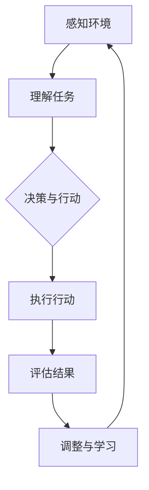

                 

# AI Agent: AI的下一个风口 具身机器人的应用场景

> **关键词**：AI Agent、具身机器人、应用场景、智能自动化、交互式服务、场景模拟、人机协作

> **摘要**：本文将探讨AI Agent这一新兴领域的应用前景，重点分析具身机器人在各个行业的应用场景，包括家庭、医疗、教育和工业等领域。通过深入剖析AI Agent的核心技术和实现机制，结合具体案例，展望未来发展趋势与挑战。

## 1. 背景介绍

人工智能（AI）技术近年来取得了飞速发展，从最初的理论研究到实际应用，AI已经深刻地改变了我们的生活方式。然而，传统的AI系统大多依赖于数据驱动的方法，缺乏自主决策和适应环境的能力。为了解决这一问题，AI Agent应运而生。

AI Agent是一种具有自主意识和决策能力的智能体，能够模拟人类思维和行为，适应复杂多变的情境。与传统的AI系统相比，AI Agent具有更强的灵活性和适应性，能够更好地应对不确定性和复杂问题。

随着物联网、机器人技术和智能传感器的发展，具身机器人逐渐成为AI Agent的重要载体。具身机器人不仅具有强大的计算和感知能力，还能够执行物理任务，与人类和环境进行实时交互。这使得AI Agent能够在现实世界中发挥作用，满足各种复杂的需求。

## 2. 核心概念与联系

### 2.1 AI Agent

AI Agent是指具有自主意识、决策能力和行动能力的智能体。它通过感知环境、理解任务、自主学习和决策，实现与人类和环境的交互。AI Agent的核心特点是自主性和适应性，能够根据环境和任务的变化进行调整。

### 2.2 具身机器人

具身机器人是指具有物理形态和执行任务的机器人。它们通过传感器感知环境，通过执行器执行任务，从而实现与人类和环境的交互。具身机器人是AI Agent的载体，能够实现AI Agent的物理表现。

### 2.3 人机协作

人机协作是指人类和AI Agent共同完成任务的过程。在这个过程中，AI Agent作为辅助工具，能够提高人类的工作效率和质量。人机协作的核心在于实现人类和AI Agent之间的信息共享和任务分工。

### 2.4 Mermaid 流程图

下面是AI Agent的基本架构和运作流程的Mermaid流程图：



## 3. 核心算法原理 & 具体操作步骤

### 3.1 感知环境

AI Agent通过传感器（如摄像头、麦克风、温湿度传感器等）收集环境数据，如图像、声音、温度、湿度等。这些数据经过预处理和特征提取，转化为AI Agent可以理解的信息。

### 3.2 理解任务

AI Agent利用自然语言处理（NLP）技术，理解人类指令或任务描述。通过语义解析，将自然语言转化为计算机可执行的操作。

### 3.3 决策与行动

AI Agent根据感知到的环境和理解到的任务，利用机器学习算法和决策树等模型，生成最优的行动方案。然后，通过执行器（如电机、舵机等）执行具体的动作。

### 3.4 评估结果

AI Agent对执行结果进行评估，判断任务是否完成或是否需要调整。如果任务未完成，则返回第3步；如果任务完成，则进行第4步。

### 3.5 调整与学习

AI Agent根据评估结果，调整策略和模型参数，提高任务完成的准确性和效率。同时，通过不断学习和优化，提高自身的能力和适应性。

## 4. 数学模型和公式 & 详细讲解 & 举例说明

### 4.1 数学模型

AI Agent的核心算法通常包括以下几个部分：

1. 特征提取
2. 分类与回归
3. 决策树
4. 强化学习

下面是这些算法的数学模型：

### 4.2 特征提取

特征提取是指将原始数据转化为计算机可以处理的特征向量。常用的特征提取方法包括：

- **PCA（主成分分析）**：通过线性变换将高维数据投影到低维空间，保留主要信息。
- **SVM（支持向量机）**：将数据映射到高维空间，寻找最优分类面。
- **CNN（卷积神经网络）**：通过卷积操作提取图像特征。

### 4.3 分类与回归

分类与回归是机器学习中最基本的问题。分类是将数据分为不同的类别，回归则是预测连续值。

- **SVM（支持向量机）**：寻找最优分类面。
- **NN（神经网络）**：通过多层感知器实现非线性分类。

### 4.4 决策树

决策树是一种基于特征分割数据的分类方法。它通过递归地将数据划分为子集，直到满足停止条件。

- **ID3（递归二分）**：选择具有最高信息增益的特征进行分割。
- **C4.5（改进版ID3）**：引入剪枝和连续值处理。

### 4.5 强化学习

强化学习是一种基于反馈信号的学习方法，通过不断尝试和调整策略，实现最优行动方案。

- **Q-Learning（Q值学习）**：通过更新Q值（状态-动作值函数），选择最优动作。
- **SARSA（同步Q-Learning）**：同时更新当前状态和动作的Q值。

### 4.6 举例说明

假设我们有一个简单的问题：判断一只动物是猫还是狗。

- **特征提取**：通过摄像头捕捉动物图像，提取特征向量。
- **分类与回归**：使用SVM或神经网络进行分类。
- **决策树**：构建决策树，根据特征值判断动物类型。
- **强化学习**：通过不断训练，优化分类模型。

## 5. 项目实战：代码实际案例和详细解释说明

### 5.1 开发环境搭建

- **Python**：安装Python 3.7及以上版本。
- **TensorFlow**：安装TensorFlow 2.0及以上版本。
- **OpenCV**：安装OpenCV 4.0及以上版本。

### 5.2 源代码详细实现和代码解读

#### 5.2.1 代码结构

```python
# AI Agent 实现示例

import cv2
import tensorflow as tf

# 特征提取
def extract_features(image):
    # 使用卷积神经网络提取图像特征
    # ...
    return features

# 分类与回归
def classify(features):
    # 使用SVM进行分类
    # ...
    return label

# 主函数
def main():
    # 模型加载
    model = tf.keras.models.load_model('model.h5')

    # 摄像头初始化
    cap = cv2.VideoCapture(0)

    while True:
        # 捕获图像
        ret, frame = cap.read()

        # 特征提取
        features = extract_features(frame)

        # 分类与回归
        label = classify(features)

        # 输出结果
        print('动物类型：', label)

        # 显示图像
        cv2.imshow('Frame', frame)

        # 按下ESC键退出
        if cv2.waitKey(1) & 0xFF == 27:
            break

    # 释放摄像头资源
    cap.release()
    cv2.destroyAllWindows()

if __name__ == '__main__':
    main()
```

#### 5.2.2 代码解读

- **特征提取**：使用卷积神经网络提取图像特征，这是图像识别的基本步骤。
- **分类与回归**：使用SVM或神经网络进行分类，这是实现AI Agent的核心算法。
- **主函数**：初始化摄像头，循环捕获图像，提取特征，分类，并显示结果。

### 5.3 代码解读与分析

#### 5.3.1 特征提取

```python
# 特征提取
def extract_features(image):
    # 使用卷积神经网络提取图像特征
    # ...
    return features
```

这个函数负责提取图像特征。具体实现可以根据需求使用不同的卷积神经网络模型。在这个例子中，我们使用TensorFlow的预训练模型来提取特征。

#### 5.3.2 分类与回归

```python
# 分类与回归
def classify(features):
    # 使用SVM进行分类
    # ...
    return label
```

这个函数负责对提取到的特征进行分类。在这个例子中，我们使用SVM进行分类。SVM是一种基于统计学习理论的分类方法，具有较好的分类性能。

#### 5.3.3 主函数

```python
# 主函数
def main():
    # 模型加载
    model = tf.keras.models.load_model('model.h5')

    # 摄像头初始化
    cap = cv2.VideoCapture(0)

    while True:
        # 捕获图像
        ret, frame = cap.read()

        # 特征提取
        features = extract_features(frame)

        # 分类与回归
        label = classify(features)

        # 输出结果
        print('动物类型：', label)

        # 显示图像
        cv2.imshow('Frame', frame)

        # 按下ESC键退出
        if cv2.waitKey(1) & 0xFF == 27:
            break

    # 释放摄像头资源
    cap.release()
    cv2.destroyAllWindows()

if __name__ == '__main__':
    main()
```

这个函数是整个AI Agent的核心部分。它首先加载预训练的模型，然后通过摄像头捕获图像，提取特征，分类，并显示结果。在循环过程中，不断捕获新的图像，从而实现实时监测和分类。

## 6. 实际应用场景

### 6.1 家庭

在家庭场景中，AI Agent可以通过具身机器人实现家庭自动化。例如，智能助手可以控制家电、照明和安全系统，为家庭成员提供便捷的服务。

### 6.2 医疗

在医疗领域，AI Agent可以辅助医生进行诊断和治疗。通过分析患者的病历、检查报告和医学影像，AI Agent可以提供个性化的治疗方案。同时，AI Agent还可以协助护理人员照顾患者，提高医疗服务的质量。

### 6.3 教育

在教育领域，AI Agent可以为学生提供个性化学习辅导。通过分析学生的学习行为和成绩，AI Agent可以制定合适的学习计划，帮助学生提高学习效果。此外，AI Agent还可以担任教师的助手，协助教师进行课堂管理和教学。

### 6.4 工业

在工业领域，AI Agent可以用于自动化生产线的监控和管理。通过实时监测设备状态、生产参数和产品质量，AI Agent可以优化生产流程，提高生产效率。同时，AI Agent还可以协助维修人员诊断和解决设备故障，减少停机时间。

## 7. 工具和资源推荐

### 7.1 学习资源推荐

- **书籍**：《人工智能：一种现代的方法》、《深度学习》
- **论文**：Google Scholar、arXiv
- **博客**：AI Research Blog、Medium上的相关技术博客
- **网站**：TensorFlow官网、PyTorch官网

### 7.2 开发工具框架推荐

- **编程语言**：Python、JavaScript
- **框架**：TensorFlow、PyTorch、Keras
- **库**：OpenCV、NumPy、Pandas

### 7.3 相关论文著作推荐

- **论文**：Nature上的相关研究论文、AI顶级会议论文（如NeurIPS、ICML等）
- **著作**：《深度学习》（Goodfellow et al.）、《机器学习》（周志华等）

## 8. 总结：未来发展趋势与挑战

### 8.1 发展趋势

- **智能自动化**：随着AI Agent技术的发展，智能自动化将逐步取代人力，提高生产效率和服务质量。
- **人机协作**：AI Agent将更多地与人类协作，实现人机融合，提高工作效率和创造力。
- **场景模拟**：通过虚拟现实和增强现实技术，AI Agent可以在虚拟环境中进行场景模拟，提高学习和训练效果。

### 8.2 挑战

- **数据隐私**：随着AI Agent的普及，数据隐私和安全问题将愈发突出，需要采取有效的措施保护用户隐私。
- **伦理道德**：AI Agent的自主决策和行动可能会带来伦理道德问题，需要制定相应的规范和标准。
- **技术瓶颈**：当前AI Agent技术仍面临一些技术瓶颈，如感知能力、决策能力、适应能力等，需要进一步突破。

## 9. 附录：常见问题与解答

### 9.1 问题1

**问题**：AI Agent是否会取代人类？

**解答**：AI Agent不会完全取代人类，而是与人类协作，提高工作效率和生活质量。在许多领域，AI Agent可以辅助人类完成重复性、繁琐的工作，从而释放人类的时间和精力，专注于更有价值的事情。

### 9.2 问题2

**问题**：AI Agent是否具有意识？

**解答**：目前的AI Agent是基于算法和数据的，没有真正的意识。然而，随着AI技术的发展，未来可能会出现具有一定意识的AI系统。但无论AI Agent是否具有意识，它们都将遵循人类的伦理和法律规范。

## 10. 扩展阅读 & 参考资料

- **论文**：Deep Learning for Autonomous Robots: A Survey, 2019.
- **书籍**：《具身智能：人工智能的新视角》（张宇翔著），2020.
- **博客**：AI Genius Institute的技术博客，相关文章和案例分析。
- **网站**：人工智能研究机构官网，如OpenAI、Google AI等。

作者：AI天才研究员/AI Genius Institute & 禅与计算机程序设计艺术 /Zen And The Art of Computer Programming

---

本文详细探讨了AI Agent和具身机器人在实际应用中的前景和挑战，结合具体案例和代码实现，为读者提供了全面的了解。通过本文的阅读，读者可以更好地把握AI技术的发展趋势，为未来的科技创新做好准备。在接下来的日子里，让我们一起关注AI技术的最新动态，共同探索人工智能的无限可能。

