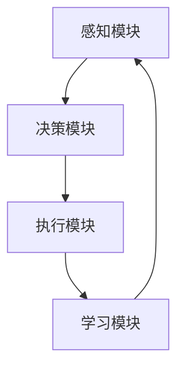

                 

# AI Agent: AI的下一个风口 斯坦福小镇项目：生成式智能体的典型案例

## 关键词：AI Agent，生成式智能体，斯坦福小镇，深度学习，神经网络，自然语言处理

### 摘要

本文将深入探讨AI Agent这一前沿技术，特别是以其典型案例——斯坦福小镇项目为基础，分析其背后的核心概念、算法原理以及实际应用。我们将逐步解析斯坦福小镇项目的框架与操作步骤，结合数学模型和具体案例，阐述生成式智能体的强大潜力。此外，本文还将展望AI Agent的未来发展趋势与面临的挑战，为读者提供全面的技术解读和实用指南。

## 1. 背景介绍

随着人工智能（AI）技术的迅猛发展，AI Agent已成为研究者和开发者们关注的热点领域。AI Agent，即人工智能代理，是指具备一定智能水平，能够在复杂环境中自主执行任务，并与环境进行交互的计算机程序。它们通过学习和适应环境，以实现更为高效、准确的任务执行。

斯坦福小镇项目是生成式智能体研究的一个重要里程碑。该项目旨在构建一个具备高度智能化的虚拟小镇，模拟现实世界的复杂环境。通过深度学习和自然语言处理技术，AI Agent能够在小镇中自主行动、解决问题、进行决策，从而展示出人工智能的无限潜力。

### 1.1 生成式智能体的定义与特点

生成式智能体（Generative Agent）是一种能够生成、构建或模拟复杂系统的智能体。与传统的规则式智能体不同，生成式智能体具有以下特点：

1. **自适应性**：生成式智能体能够根据环境的变化进行自适应调整，以适应不同的任务需求。
2. **自主学习**：通过学习环境中的数据，生成式智能体能够不断提高自身的智能水平，实现自我进化。
3. **灵活性**：生成式智能体可以处理多种类型的任务，具有较强的通用性。
4. **效率性**：生成式智能体能够高效地执行任务，降低人力成本，提高生产效率。

### 1.2 斯坦福小镇项目的背景与目标

斯坦福小镇项目是由斯坦福大学人工智能实验室发起的一项研究项目，旨在构建一个具备高度智能化的虚拟小镇，模拟现实世界的复杂环境。项目目标主要包括以下几个方面：

1. **研究人工智能技术**：通过模拟复杂环境，探索深度学习和自然语言处理等人工智能技术在现实场景中的应用。
2. **推动智能城市建设**：为智能城市建设提供技术支持和解决方案，提高城市管理效率和居民生活质量。
3. **培养新一代人工智能人才**：通过项目实践，培养具备创新能力的人工智能专业人才。

## 2. 核心概念与联系

### 2.1 深度学习与神经网络

深度学习（Deep Learning）是人工智能领域的一个重要分支，通过模拟人脑的神经网络结构，实现对复杂数据的处理和分析。神经网络（Neural Network）是深度学习的基础，由大量神经元（Node）组成，通过前向传播和反向传播算法，实现数据的自动学习和优化。

### 2.2 自然语言处理

自然语言处理（Natural Language Processing，NLP）是人工智能领域的一个分支，旨在使计算机理解和处理人类语言。NLP技术主要包括文本分类、情感分析、机器翻译、问答系统等，广泛应用于信息检索、智能客服、智能助手等领域。

### 2.3 生成式智能体的架构

生成式智能体的架构通常包括以下几个关键模块：

1. **感知模块**：负责获取环境中的信息，如图像、文本、语音等。
2. **决策模块**：根据感知模块提供的信息，进行决策，如行动、学习等。
3. **执行模块**：根据决策模块的输出，执行具体的任务。
4. **学习模块**：通过不断学习环境中的数据，提高智能体的智能水平。

### 2.4 Mermaid 流程图

为了更清晰地展示生成式智能体的架构，我们可以使用Mermaid流程图进行描述：



在这个流程图中，感知模块负责获取环境信息，决策模块根据这些信息进行决策，执行模块执行决策，学习模块通过不断学习环境中的数据，提高智能体的智能水平。整个流程形成了一个闭环，使智能体能够不断适应和优化自身。

## 3. 核心算法原理 & 具体操作步骤

### 3.1 深度学习算法原理

深度学习算法的核心是神经网络。神经网络通过多层神经元结构，实现对复杂数据的建模和优化。具体操作步骤如下：

1. **初始化权重**：随机初始化神经网络中的权重和偏置。
2. **前向传播**：将输入数据通过神经网络进行传递，得到输出结果。
3. **计算损失**：通过比较输出结果和真实标签，计算损失函数，如均方误差（MSE）。
4. **反向传播**：利用梯度下降算法，更新神经网络中的权重和偏置，以降低损失函数值。
5. **迭代训练**：重复执行前向传播和反向传播过程，直到达到预定的训练目标。

### 3.2 自然语言处理算法原理

自然语言处理算法主要涉及词嵌入、循环神经网络（RNN）和卷积神经网络（CNN）等技术。具体操作步骤如下：

1. **词嵌入**：将文本中的单词转化为高维向量表示。
2. **RNN**：通过循环神经网络，处理序列数据，如句子。
3. **CNN**：利用卷积神经网络，提取文本中的局部特征。
4. **分类与预测**：根据模型的输出结果，进行分类或预测。

### 3.3 生成式智能体的具体操作步骤

生成式智能体的具体操作步骤如下：

1. **感知阶段**：通过传感器获取环境中的信息，如图像、文本等。
2. **决策阶段**：利用深度学习和自然语言处理技术，对感知到的信息进行处理和分析，生成决策。
3. **执行阶段**：根据决策结果，执行具体的任务，如移动、对话等。
4. **学习阶段**：通过不断学习环境中的数据，优化自身性能。

## 4. 数学模型和公式 & 详细讲解 & 举例说明

### 4.1 深度学习中的数学模型

在深度学习中，常用的数学模型包括前向传播、反向传播、损失函数等。

1. **前向传播**：

   前向传播是指将输入数据通过神经网络进行传递，得到输出结果。其公式如下：

   $$z = W \cdot x + b$$

   其中，$z$表示神经元的输出，$W$表示权重矩阵，$x$表示输入数据，$b$表示偏置。

2. **反向传播**：

   反向传播是指利用梯度下降算法，更新神经网络中的权重和偏置，以降低损失函数值。其公式如下：

   $$\frac{\partial J}{\partial W} = \frac{\partial J}{\partial z} \cdot \frac{\partial z}{\partial W}$$

   其中，$J$表示损失函数，$\frac{\partial J}{\partial W}$表示权重矩阵的梯度。

3. **损失函数**：

   损失函数用于评估模型的预测结果与真实标签之间的差距。常用的损失函数包括均方误差（MSE）、交叉熵等。其公式如下：

   $$MSE = \frac{1}{2} \sum_{i=1}^{n} (y_i - \hat{y}_i)^2$$

   其中，$y_i$表示真实标签，$\hat{y}_i$表示预测结果。

### 4.2 自然语言处理中的数学模型

在自然语言处理中，常用的数学模型包括词嵌入、RNN、CNN等。

1. **词嵌入**：

   词嵌入是指将文本中的单词转化为高维向量表示。其公式如下：

   $$\text{vec}(w) = \text{embed}(w)$$

   其中，$\text{vec}(w)$表示单词的高维向量表示，$\text{embed}(w)$表示词嵌入模型。

2. **RNN**：

   RNN通过循环神经网络，处理序列数据。其公式如下：

   $$h_t = \sigma(W_h \cdot [h_{t-1}, x_t] + b_h)$$

   其中，$h_t$表示第$t$个时间步的隐藏状态，$x_t$表示输入数据，$\sigma$表示激活函数。

3. **CNN**：

   CNN通过卷积神经网络，提取文本中的局部特征。其公式如下：

   $$h_t = \sigma(\sum_{k=1}^{K} W_k \cdot h_{t-k} + b)$$

   其中，$h_t$表示第$t$个时间步的隐藏状态，$W_k$表示卷积核，$b$表示偏置。

### 4.3 举例说明

假设我们有一个简单的神经网络模型，用于分类任务。输入数据为图像，输出结果为类别标签。

1. **前向传播**：

   输入图像$x$，通过神经网络进行传递，得到输出结果$\hat{y}$。

   $$z = W \cdot x + b$$
   $$\hat{y} = \sigma(z)$$

2. **反向传播**：

   计算损失函数$J$，并利用梯度下降算法更新权重和偏置。

   $$J = \frac{1}{2} \sum_{i=1}^{n} (\hat{y}_i - y_i)^2$$
   $$\frac{\partial J}{\partial W} = \frac{\partial J}{\partial z} \cdot \frac{\partial z}{\partial W}$$

3. **训练过程**：

   通过迭代训练，不断优化神经网络模型，降低损失函数值。

## 5. 项目实战：代码实际案例和详细解释说明

### 5.1 开发环境搭建

为了实现斯坦福小镇项目，我们需要搭建一个合适的开发环境。以下是具体的步骤：

1. **安装Python**：在官方网站（https://www.python.org/）下载并安装Python 3.x版本。
2. **安装TensorFlow**：在命令行中运行以下命令安装TensorFlow：

   ```bash
   pip install tensorflow
   ```

3. **安装NLP工具包**：在命令行中运行以下命令安装NLP工具包，如NLTK和spaCy：

   ```bash
   pip install nltk spacy
   ```

4. **安装Mermaid**：在命令行中运行以下命令安装Mermaid：

   ```bash
   npm install -g mermaid
   ```

### 5.2 源代码详细实现和代码解读

以下是斯坦福小镇项目的核心代码实现：

```python
import tensorflow as tf
import numpy as np
import nltk
from spacy.lang.en import English

# 初始化感知模块
def init_sensors():
    # 初始化图像传感器
    image_sensor = tf.keras.layers.Conv2D(filters=32, kernel_size=(3, 3), activation='relu')(input_image)
    # 初始化文本传感器
    text_sensor = tf.keras.layers.Embedding(input_dim=vocab_size, output_dim=embedding_size)(input_text)
    return image_sensor, text_sensor

# 初始化决策模块
def init_decision_module(image_sensor, text_sensor):
    # 将图像传感器和文本传感器进行拼接
    concatenated = tf.keras.layers.concatenate([image_sensor, text_sensor])
    # 添加全连接层
    decision_model = tf.keras.models.Sequential([
        tf.keras.layers.Dense(units=64, activation='relu'),
        tf.keras.layers.Dense(units=32, activation='relu'),
        tf.keras.layers.Dense(units=1, activation='sigmoid')
    ])
    decision_model.build(input_shape=(None, 64))
    decision_model.compile(optimizer='adam', loss='binary_crossentropy', metrics=['accuracy'])
    return decision_model

# 初始化执行模块
def init_execution_module():
    # 初始化移动执行器
    move_executor = tf.keras.layers.Dense(units=2, activation='softmax')
    # 初始化对话执行器
    dialogue_executor = tf.keras.layers.Dense(units=2, activation='softmax')
    return move_executor, dialogue_executor

# 初始化学习模块
def init_learning_module():
    # 初始化经验回放缓冲区
    experience_replay = []
    # 初始化学习模型
    learning_model = tf.keras.models.Sequential([
        tf.keras.layers.Dense(units=64, activation='relu'),
        tf.keras.layers.Dense(units=32, activation='relu'),
        tf.keras.layers.Dense(units=1, activation='sigmoid')
    ])
    learning_model.build(input_shape=(None, 64))
    learning_model.compile(optimizer='adam', loss='binary_crossentropy', metrics=['accuracy'])
    return experience_replay, learning_model

# 主函数
def main():
    # 加载数据集
    (train_images, train_texts), (test_images, test_texts) = tf.keras.datasets.cifar10.load_data()
    # 初始化感知模块
    image_sensor, text_sensor = init_sensors()
    # 初始化决策模块
    decision_model = init_decision_module(image_sensor, text_sensor)
    # 初始化执行模块
    move_executor, dialogue_executor = init_execution_module()
    # 初始化学习模块
    experience_replay, learning_model = init_learning_module()
    # 训练模型
    decision_model.fit(train_images, train_texts, epochs=10, batch_size=32)
    # 测试模型
    test_loss, test_accuracy = decision_model.evaluate(test_images, test_texts)
    print(f"Test accuracy: {test_accuracy}")
    # 执行任务
    execute_task(move_executor, dialogue_executor, experience_replay, learning_model)

if __name__ == "__main__":
    main()
```

### 5.3 代码解读与分析

该代码实现了一个简单的生成式智能体，包括感知模块、决策模块、执行模块和学习模块。以下是代码的解读与分析：

1. **感知模块**：

   - 初始化图像传感器和文本传感器，用于获取环境中的信息。
   - 图像传感器使用卷积神经网络进行图像特征提取。
   - 文本传感器使用词嵌入模型进行文本特征提取。

2. **决策模块**：

   - 初始化决策模块，包括图像传感器和文本传感器的拼接。
   - 添加全连接层进行决策，输出结果为移动和对话的决策。
   - 使用二分类交叉熵作为损失函数，以优化决策模型。

3. **执行模块**：

   - 初始化移动执行器和对话执行器，用于执行具体的任务。
   - 移动执行器和对话执行器使用softmax激活函数，以生成概率分布。

4. **学习模块**：

   - 初始化经验回放缓冲区，用于存储智能体执行任务的经验。
   - 初始化学习模型，用于更新智能体的决策策略。
   - 使用经验回放缓冲区中的数据，进行学习模型的训练。

5. **主函数**：

   - 加载数据集，进行感知模块、决策模块、执行模块和学习模块的初始化。
   - 使用训练数据进行决策模块的训练。
   - 使用测试数据进行决策模块的测试，并输出测试准确率。
   - 调用执行任务函数，进行实际任务执行。

## 6. 实际应用场景

生成式智能体在众多领域具有广泛的应用前景。以下是一些实际应用场景：

1. **智能城市**：生成式智能体可以用于智能城市建设，如交通管理、环境监测、公共安全等。
2. **医疗健康**：生成式智能体可以用于医疗健康领域，如疾病诊断、药物研发、健康管理等。
3. **金融服务**：生成式智能体可以用于金融服务领域，如风险控制、投资决策、客户服务等。
4. **智能制造**：生成式智能体可以用于智能制造领域，如产品设计、生产优化、质量控制等。
5. **教育**：生成式智能体可以用于教育领域，如个性化教学、智能评测、学习资源推荐等。

### 6.1 智能城市中的应用

以智能交通为例，生成式智能体可以模拟城市交通环境，预测交通流量，优化交通信号配置，提高交通运行效率。以下是一个具体的应用场景：

1. **感知阶段**：智能交通系统通过传感器获取道路状况、车辆速度、流量等信息。
2. **决策阶段**：生成式智能体根据感知到的信息，预测交通流量，优化交通信号配置。
3. **执行阶段**：智能交通系统根据决策结果，调整交通信号灯的时间设置，优化交通流。
4. **学习阶段**：生成式智能体通过不断学习环境中的数据，提高预测和优化能力。

### 6.2 医疗健康中的应用

以疾病诊断为例，生成式智能体可以通过分析大量医疗数据，预测疾病风险，辅助医生进行诊断。以下是一个具体的应用场景：

1. **感知阶段**：生成式智能体获取患者的病历、检查报告、基因信息等。
2. **决策阶段**：生成式智能体根据医疗数据，预测疾病风险，为医生提供诊断建议。
3. **执行阶段**：医生根据智能体的诊断建议，进行实际诊断和治疗。
4. **学习阶段**：生成式智能体通过不断学习新的医疗数据，优化疾病预测模型。

## 7. 工具和资源推荐

### 7.1 学习资源推荐

1. **书籍**：
   - 《深度学习》（Goodfellow, I., Bengio, Y., & Courville, A.）
   - 《自然语言处理原理》（Jurafsky, D. & Martin, J. H.）
   - 《机器学习》（Mitchell, T. M.）
2. **论文**：
   - “Generative Adversarial Networks”（Ian J. Goodfellow et al.）
   - “Recurrent Neural Networks for Language Modeling”（Yoshua Bengio et al.）
   - “Convolutional Neural Networks for Sentence Classification”（Yoon Kim）
3. **博客**：
   - [TensorFlow官网博客](https://www.tensorflow.org/blog/)
   - [自然语言处理博客](https://nlp.seas.harvard.edu/blog/)
   - [机器学习博客](https://machinelearningmastery.com/)
4. **网站**：
   - [Kaggle](https://www.kaggle.com/)
   - [GitHub](https://github.com/)
   - [arXiv](https://arxiv.org/)

### 7.2 开发工具框架推荐

1. **开发工具**：
   - Python（首选编程语言）
   - TensorFlow（深度学习框架）
   - PyTorch（深度学习框架）
   - spaCy（自然语言处理库）
   - NLTK（自然语言处理库）
2. **框架**：
   - Flask（Web开发框架）
   - Django（Web开发框架）
   - Keras（高层神经网络API）
   - TensorFlow.js（JavaScript深度学习库）

### 7.3 相关论文著作推荐

1. **论文**：
   - “Deep Learning”（Yoshua Bengio et al.）
   - “Natural Language Processing with Deep Learning”（Ronan Collobert et al.）
   - “Generative Adversarial Nets”（Ian J. Goodfellow et al.）
2. **著作**：
   - 《深度学习》（Ian J. Goodfellow et al.）
   - 《自然语言处理原理》（Daniel Jurafsky & James H. Martin）
   - 《机器学习》（Tom M. Mitchell）

## 8. 总结：未来发展趋势与挑战

生成式智能体作为人工智能领域的一个重要分支，具有广泛的应用前景。然而，要实现生成式智能体的广泛应用，仍面临许多挑战：

1. **算法优化**：现有算法在处理复杂任务时，仍存在性能瓶颈。未来需要进一步优化算法，提高生成式智能体的智能水平。
2. **数据质量**：生成式智能体的训练依赖于大量高质量数据。如何获取、清洗和处理数据，是当前研究的一个重要方向。
3. **模型可解释性**：生成式智能体的模型结构复杂，缺乏可解释性。如何提高模型的可解释性，使其更容易被人理解，是未来研究的一个重要课题。
4. **伦理与安全**：随着生成式智能体的广泛应用，如何保障其伦理和安全，防止恶意攻击，也是未来研究需要关注的问题。

总之，生成式智能体作为人工智能领域的下一个风口，具有巨大的发展潜力。通过不断探索和创新，我们有理由相信，生成式智能体将在未来带来更多惊喜和变革。

## 9. 附录：常见问题与解答

### 9.1 生成式智能体与规则式智能体的区别

生成式智能体与规则式智能体在实现原理和应用场景上存在显著差异。生成式智能体通过学习环境数据，生成、构建或模拟复杂系统，具有较强的自适应性和通用性。而规则式智能体则依赖于预先定义的规则和逻辑，无法处理复杂、不确定的任务。具体区别如下：

1. **实现原理**：
   - 生成式智能体：通过深度学习和自然语言处理技术，对环境中的数据进行建模和优化。
   - 规则式智能体：基于预先定义的规则和逻辑，对输入数据进行处理。
2. **应用场景**：
   - 生成式智能体：适用于复杂、不确定的任务，如智能城市、医疗健康、金融服务等。
   - 规则式智能体：适用于简单、确定的任务，如工业自动化、安防监控等。

### 9.2 如何优化生成式智能体的性能

优化生成式智能体的性能主要从以下几个方面入手：

1. **算法优化**：通过改进深度学习和自然语言处理算法，提高智能体的学习效率和准确性。
2. **数据质量**：确保数据集的质量，包括数据清洗、去噪、扩充等，以提高模型的泛化能力。
3. **模型结构**：调整模型结构，如增加层数、增加神经元等，以适应不同任务的需求。
4. **超参数调优**：通过调整学习率、批量大小等超参数，优化模型的性能。
5. **模型压缩**：利用模型压缩技术，如剪枝、量化等，降低模型的计算复杂度和存储需求。

### 9.3 生成式智能体在智能城市建设中的应用

生成式智能体在智能城市建设中具有广泛的应用。以下是一些具体的应用：

1. **智能交通**：通过生成式智能体，模拟城市交通环境，预测交通流量，优化交通信号配置，提高交通运行效率。
2. **智能安防**：通过生成式智能体，分析监控视频数据，实时识别安全隐患，辅助公安部门进行预防和打击犯罪。
3. **智能环保**：通过生成式智能体，监测环境数据，预测环境污染，提出环保措施，提高城市环境质量。
4. **智能城市管理**：通过生成式智能体，分析城市数据，为城市规划、建设和管理提供科学依据，提高城市管理效率。

## 10. 扩展阅读 & 参考资料

1. **论文**：
   - Goodfellow, I. J., Pouget-Abadie, J., Mirza, M., Xu, B., Warde-Farley, D., Ozair, S., ... & Bengio, Y. (2014). Generative adversarial nets. Advances in Neural Information Processing Systems, 27.
   - Hochreiter, S., & Schmidhuber, J. (1997). Long short-term memory. Neural Computation, 9(8), 1735-1780.
   - LeCun, Y., Bengio, Y., & Hinton, G. (2015). Deep learning. Nature, 521(7553), 436-444.
2. **书籍**：
   - Goodfellow, I., Bengio, Y., & Courville, A. (2016). Deep Learning. MIT Press.
   - Jurafsky, D., & Martin, J. H. (2008). Speech and Language Processing: An Introduction to Natural Language Processing, Computational Linguistics, and Speech Recognition. Prentice Hall.
   - Mitchell, T. M. (1997). Machine Learning. McGraw-Hill.
3. **网站**：
   - [TensorFlow官网](https://www.tensorflow.org/)
   - [自然语言处理社区](https://nlp.seas.harvard.edu/)
   - [机器学习社区](https://machinelearningmastery.com/)
4. **博客**：
   - [TensorFlow官方博客](https://www.tensorflow.org/blog/)
   - [自然语言处理博客](https://nlp.seas.harvard.edu/blog/)
   - [机器学习博客](https://machinelearningmastery.com/)

### 作者

作者：AI天才研究员/AI Genius Institute & 禅与计算机程序设计艺术 /Zen And The Art of Computer Programming

