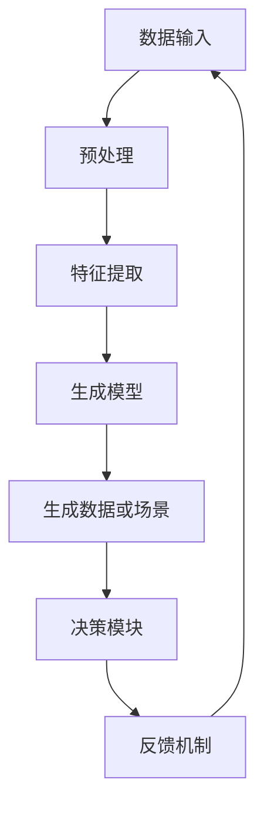
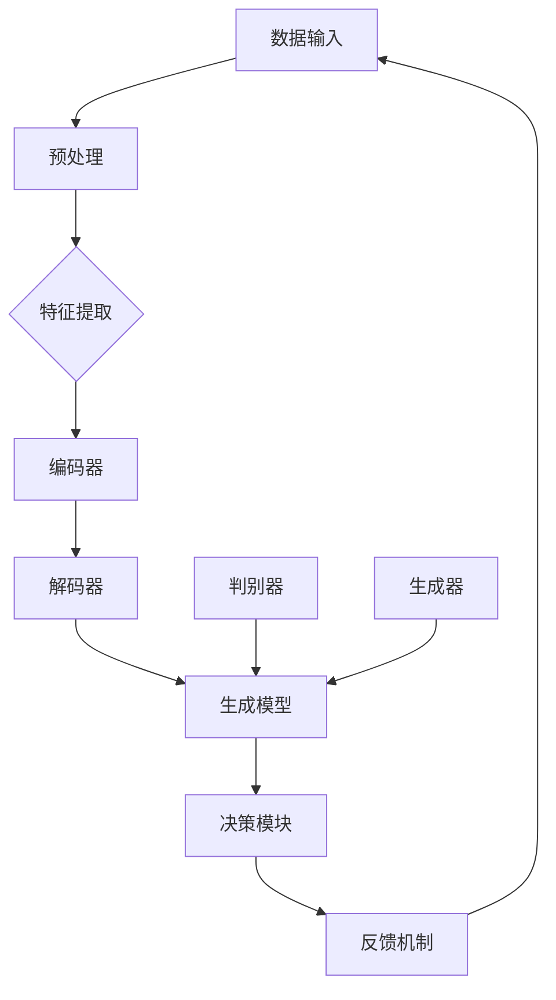

                 

# AI Agent: AI的下一个风口 生成式智能体架构设计

> **关键词：** 人工智能，生成式智能体，架构设计，深度学习，算法原理，应用场景

> **摘要：** 本文章将深入探讨生成式智能体的概念、架构设计以及其在人工智能领域的重要性和潜在应用。我们将从背景介绍出发，逐步分析核心概念与联系，详细讲解核心算法原理和数学模型，并通过实际项目案例进行代码实现和分析。最后，我们将探讨生成式智能体的实际应用场景，并提供相关工具和资源推荐，总结未来发展趋势与挑战。

## 1. 背景介绍

人工智能（AI）作为一门融合多学科的技术，已经从理论研究走向了实际应用。随着计算能力的提升和大数据的爆发，人工智能在各个领域展现出了巨大的潜力。然而，传统的基于规则或机器学习的智能系统往往只能解决特定问题，缺乏灵活性和通用性。为了实现更智能、更自主的智能系统，生成式智能体应运而生。

生成式智能体（Generative Agent）是一种基于生成模型的人工智能系统，其核心思想是通过学习数据分布来生成新的数据或场景，从而实现智能体的自主决策和创造。相比于传统的监督学习或强化学习，生成式智能体能够在未知环境下进行自主探索和学习，具备更高的灵活性和适应性。

近年来，生成式智能体在计算机视觉、自然语言处理、游戏智能等领域取得了显著的成果。例如，生成对抗网络（GAN）可以生成逼真的图像，自然语言生成模型（如GPT）可以创作高质量的文本。这些应用不仅展示了生成式智能体的强大能力，也为未来的智能系统设计提供了新的思路。

本文旨在深入探讨生成式智能体的架构设计，分析其核心概念和算法原理，并通过实际项目案例进行详细讲解。我们希望读者在阅读本文后，能够对生成式智能体有更深入的理解，并能够运用到实际项目中。

## 2. 核心概念与联系

### 2.1 生成式智能体的定义

生成式智能体是一种能够生成新数据或场景的人工智能系统。它通过学习数据分布，利用生成模型（如生成对抗网络、变分自编码器等）生成符合数据分布的新样本。生成式智能体的核心在于其生成能力，它能够根据输入的数据或场景生成新的数据或场景，实现自主决策和创造。

### 2.2 生成模型的基本原理

生成模型是一类用于生成数据或场景的人工智能模型。其基本原理是通过学习数据分布，构建一个概率模型来生成新的数据或场景。生成模型可以分为两类：生成对抗网络（GAN）和变分自编码器（VAE）。

#### 2.2.1 生成对抗网络（GAN）

生成对抗网络由生成器和判别器两个神经网络组成。生成器（Generator）负责生成新的数据或场景，判别器（Discriminator）负责判断生成器生成的数据是否真实。训练过程中，生成器和判别器相互竞争，生成器试图生成更真实的数据，而判别器试图区分真实数据和生成数据。通过这种对抗训练，生成器逐渐提高生成数据的质量，最终能够生成高质量的数据。

#### 2.2.2 变分自编码器（VAE）

变分自编码器是一种基于概率模型的生成模型。它由编码器（Encoder）和解码器（Decoder）两个神经网络组成。编码器将输入数据映射到一个潜在空间，解码器从潜在空间中生成新的数据。变分自编码器通过最大化数据分布的对数似然函数进行训练，从而学习到数据的潜在分布，并能够生成符合数据分布的新数据。

### 2.3 生成式智能体的架构设计

生成式智能体的架构设计主要包括数据输入、生成模型、决策模块和反馈机制等部分。

#### 2.3.1 数据输入

生成式智能体的数据输入可以是各种形式的数据，如图像、文本、音频等。数据输入的质量直接影响生成式智能体的性能和效果。因此，在数据输入阶段，需要对数据进行预处理和特征提取，以提高数据的质量和可用性。

#### 2.3.2 生成模型

生成模型是生成式智能体的核心组件，负责生成新的数据或场景。根据不同的应用场景和需求，可以选择不同的生成模型，如生成对抗网络、变分自编码器等。生成模型的质量直接影响生成式智能体的生成能力和效果。

#### 2.3.3 决策模块

决策模块负责根据生成模型生成的数据或场景进行决策。决策模块可以是基于规则的、基于机器学习的，也可以是基于深度学习的。决策模块的性能和效果直接影响生成式智能体的智能水平和应用价值。

#### 2.3.4 反馈机制

反馈机制是生成式智能体不断优化和提升自身能力的关键。通过收集用户反馈、分析生成模型的性能指标，生成式智能体可以不断调整和优化自身，提高生成质量和效果。

### 2.4 Mermaid 流程图



## 3. 核心算法原理 & 具体操作步骤

### 3.1 生成对抗网络（GAN）的具体操作步骤

生成对抗网络（GAN）是生成式智能体的核心技术之一。下面我们将详细介绍 GAN 的具体操作步骤。

#### 3.1.1 数据预处理

1. 采集和准备训练数据：首先，我们需要采集和准备用于训练的数据集。数据集的质量直接影响 GAN 的性能和效果。对于图像生成任务，可以选择开源的图像数据集，如CelebA、MNIST等；对于文本生成任务，可以选择新闻文章、对话数据等。
2. 数据预处理：对采集到的数据进行预处理，包括数据清洗、归一化、图像增强等操作，以提高数据的质量和多样性。

#### 3.1.2 模型构建

1. 定义生成器和判别器：生成器（Generator）和判别器（Discriminator）是 GAN 的两个核心神经网络。生成器负责生成新的数据，判别器负责判断生成数据是否真实。
2. 模型参数初始化：为生成器和判别器初始化参数，通常使用随机初始化或预训练权重。

#### 3.1.3 训练过程

1. 生成器训练：生成器的目标是生成尽可能真实的数据。在训练过程中，生成器不断调整参数，使其生成的数据能够被判别器判断为真实数据。
2. 判别器训练：判别器的目标是区分真实数据和生成数据。在训练过程中，判别器不断调整参数，提高其区分能力。

#### 3.1.4 模型评估

1. 生成质量评估：通过生成质量评估指标（如Inception Score、FID等）对生成器生成的数据质量进行评估。
2. 应用效果评估：在实际应用场景中对 GAN 模型的效果进行评估，如图像生成、文本生成等。

### 3.2 变分自编码器（VAE）的具体操作步骤

变分自编码器（VAE）是另一种常见的生成式智能体模型。下面我们将详细介绍 VAE 的具体操作步骤。

#### 3.2.1 数据预处理

1. 采集和准备训练数据：与 GAN 类似，VAE 需要准备高质量的数据集。
2. 数据预处理：对采集到的数据进行预处理，包括数据清洗、归一化、图像增强等操作。

#### 3.2.2 模型构建

1. 定义编码器和解码器：编码器（Encoder）和解码器（Decoder）是 VAE 的两个核心神经网络。编码器将输入数据映射到一个潜在空间，解码器从潜在空间中生成新的数据。
2. 模型参数初始化：为编码器和解码器初始化参数，通常使用随机初始化或预训练权重。

#### 3.2.3 训练过程

1. 编码器训练：编码器旨在将输入数据映射到一个潜在空间，同时保持数据的潜在分布。
2. 解码器训练：解码器旨在从潜在空间中生成新的数据，使其与原始数据保持相似性。

#### 3.2.4 模型评估

1. 生成质量评估：通过生成质量评估指标（如Inception Score、FID等）对生成器生成的数据质量进行评估。
2. 应用效果评估：在实际应用场景中对 VAE 模型的效果进行评估，如图像生成、文本生成等。

## 4. 数学模型和公式 & 详细讲解 & 举例说明

### 4.1 生成对抗网络（GAN）的数学模型

生成对抗网络（GAN）的核心数学模型包括生成器（Generator）和判别器（Discriminator）的损失函数。

#### 4.1.1 生成器损失函数

生成器（Generator）的损失函数通常采用最小化生成数据的负对数似然损失，即：

\[ L_G = -\log(D(G(z))) \]

其中，\( G(z) \) 是生成器生成的数据，\( D \) 是判别器。

#### 4.1.2 判别器损失函数

判别器（Discriminator）的损失函数通常采用最大化判别真实数据和生成数据的损失，即：

\[ L_D = -[\log(D(x)) + \log(1 - D(G(z)))] \]

其中，\( x \) 是真实数据，\( G(z) \) 是生成器生成的数据。

#### 4.1.3 整体损失函数

生成对抗网络的总体损失函数是生成器和判别器损失函数的加权和，即：

\[ L = L_G + \lambda \cdot L_D \]

其中，\( \lambda \) 是权重参数。

### 4.2 变分自编码器（VAE）的数学模型

变分自编码器（VAE）的数学模型主要包括编码器（Encoder）和解码器（Decoder）的损失函数。

#### 4.2.1 编码器损失函数

编码器（Encoder）的损失函数通常采用最大后验概率损失，即：

\[ L_E = -\sum_{i=1}^{n} \log p(q(z|x)) \]

其中，\( q(z|x) \) 是编码器的后验概率分布。

#### 4.2.2 解码器损失函数

解码器（Decoder）的损失函数通常采用均方误差损失，即：

\[ L_D = \sum_{i=1}^{n} \frac{1}{2} \| x - \hat{x} \|^2 \]

其中，\( \hat{x} \) 是解码器生成的数据。

#### 4.2.3 整体损失函数

变分自编码器的总体损失函数是编码器和解码器损失函数的加权和，即：

\[ L = L_E + L_D \]

### 4.3 举例说明

假设我们有一个图像生成任务，使用 GAN 模型进行图像生成。

#### 4.3.1 数据集准备

我们选择一个包含10000张图像的数据集，图像尺寸为 28x28 像素。

#### 4.3.2 模型构建

我们构建一个包含生成器和判别器的 GAN 模型。生成器是一个全连接神经网络，输入为随机噪声向量，输出为生成图像。判别器也是一个全连接神经网络，输入为真实图像或生成图像，输出为概率值，表示输入图像的真实程度。

#### 4.3.3 训练过程

我们将数据集分为训练集和验证集。在训练过程中，我们分别训练生成器和判别器。生成器试图生成更真实的图像，而判别器试图区分真实图像和生成图像。

#### 4.3.4 模型评估

我们使用 Inception Score（IS）和 Frechet Inception Distance（FID）等指标评估生成器生成的图像质量。

## 5. 项目实战：代码实际案例和详细解释说明

### 5.1 开发环境搭建

为了实现生成式智能体，我们需要搭建一个适合深度学习的开发环境。以下是搭建开发环境的基本步骤：

1. 安装 Python 3.8 或更高版本。
2. 安装深度学习框架，如 TensorFlow 或 PyTorch。
3. 安装必要的依赖库，如 NumPy、Pandas、Matplotlib 等。

### 5.2 源代码详细实现和代码解读

以下是一个简单的生成对抗网络（GAN）的代码实现，用于生成手写数字图像。

```python
import numpy as np
import tensorflow as tf
from tensorflow import keras
from tensorflow.keras import layers

# 定义生成器模型
def build_generator(z_dim):
    model = keras.Sequential()
    model.add(layers.Dense(128, input_dim=z_dim))
    model.add(layers.LeakyReLU(alpha=0.01))
    model.add(layers.Dense(28 * 28, activation='tanh'))
    return model

# 定义判别器模型
def build_discriminator(img_shape):
    model = keras.Sequential()
    model.add(layers.Flatten(input_shape=img_shape))
    model.add(layers.Dense(128))
    model.add(layers.LeakyReLU(alpha=0.01))
    model.add(layers.Dense(1, activation='sigmoid'))
    return model

# 定义 GAN 模型
def build_gan(generator, discriminator):
    model = keras.Sequential()
    model.add(generator)
    model.add(discriminator)
    return model

# 训练 GAN 模型
def train_gan(generator, discriminator, z_dim, img_shape, epochs, batch_size, save_path):
    # 准备数据集
    (x_train, _), (_, _) = keras.datasets.mnist.load_data()
    x_train = x_train / 127.5 - 1.0
    x_train = np.expand_dims(x_train, -1)

    # 编译判别器
    discriminator.compile(optimizer=keras.optimizers.Adam(0.0001), loss='binary_crossentropy')

    # 编译 GAN
    gan = build_gan(generator, discriminator)
    gan.compile(optimizer=keras.optimizers.Adam(0.0002), loss='binary_crossentropy')

    # 训练判别器
    for epoch in range(epochs):
        for _ in range(batch_size):
            # 生成随机噪声
            z = np.random.normal(0, 1, size=(batch_size, z_dim))
            # 生成生成图像
            gen_imgs = generator.predict(z)
            # 生成真实图像
            real_imgs = x_train[np.random.randint(0, x_train.shape[0], size=batch_size)]

            # 训练判别器
            d_loss_real = discriminator.train_on_batch(real_imgs, np.ones((batch_size, 1)))
            d_loss_fake = discriminator.train_on_batch(gen_imgs, np.zeros((batch_size, 1)))
            d_loss = 0.5 * np.add(d_loss_real, d_loss_fake)

        # 生成随机噪声
        z = np.random.normal(0, 1, size=(batch_size, z_dim))
        # 训练生成器
        g_loss = gan.train_on_batch(z, np.ones((batch_size, 1)))

        # 打印训练进度
        print(f"{epoch} epoch: [D loss: {d_loss:.3f}, G loss: {g_loss:.3f}]")

    # 保存模型
    generator.save(save_path + '_generator.h5')
    discriminator.save(save_path + '_discriminator.h5')
    gan.save(save_path + '.h5')

# 主函数
def main():
    z_dim = 100
    img_shape = (28, 28, 1)
    epochs = 10000
    batch_size = 64
    save_path = 'cifar10_gan/'

    # 构建、训练并保存模型
    generator = build_generator(z_dim)
    discriminator = build_discriminator(img_shape)
    train_gan(generator, discriminator, z_dim, img_shape, epochs, batch_size, save_path)

if __name__ == '__main__':
    main()
```

### 5.3 代码解读与分析

1. **模型构建**：首先，我们定义了生成器和判别器的模型结构。生成器是一个全连接神经网络，输入为随机噪声向量，输出为生成图像。判别器也是一个全连接神经网络，输入为真实图像或生成图像，输出为概率值，表示输入图像的真实程度。

2. **训练过程**：在训练过程中，我们首先训练判别器，使其能够区分真实图像和生成图像。然后，我们训练生成器，使其生成更真实的图像。这个过程是一个循环迭代的过程，直到达到预定的训练次数或生成器生成的图像质量达到要求。

3. **模型评估**：在训练过程中，我们通过打印判别器和生成器的损失值来监控训练进度。此外，我们还可以使用 Inception Score（IS）和 Frechet Inception Distance（FID）等指标来评估生成图像的质量。

## 6. 实际应用场景

生成式智能体在各个领域都有广泛的应用前景。以下是一些实际应用场景：

1. **计算机视觉**：生成式智能体可以用于图像生成、图像修复、图像超分辨率等任务。例如，使用生成对抗网络（GAN）可以生成逼真的图像，用于虚拟现实、游戏开发等领域。

2. **自然语言处理**：生成式智能体可以用于文本生成、对话系统、机器翻译等任务。例如，使用自然语言生成模型（如 GPT）可以生成高质量的文章、对话等。

3. **游戏开发**：生成式智能体可以用于生成游戏场景、角色、关卡等，提高游戏的多样性和趣味性。

4. **医疗领域**：生成式智能体可以用于生成医学图像、生成治疗方案等，为医疗领域提供智能化支持。

5. **艺术创作**：生成式智能体可以用于音乐创作、绘画、摄影等艺术领域，实现艺术创作的自动化和个性化。

## 7. 工具和资源推荐

### 7.1 学习资源推荐

1. **书籍**：
   - 《深度学习》（Deep Learning） - Ian Goodfellow、Yoshua Bengio、Aaron Courville
   - 《生成对抗网络》（Generative Adversarial Networks） - Ian Goodfellow

2. **论文**：
   - “Generative Adversarial Nets” - Ian Goodfellow 等
   - “Variational Autoencoders” - Diederik P. Kingma、Max Welling

3. **博客**：
   - Fast.ai：https://www.fast.ai/
   - Medium：https://medium.com/

4. **网站**：
   - TensorFlow 官网：https://www.tensorflow.org/
   - PyTorch 官网：https://pytorch.org/

### 7.2 开发工具框架推荐

1. **深度学习框架**：
   - TensorFlow：https://www.tensorflow.org/
   - PyTorch：https://pytorch.org/

2. **版本控制**：
   - Git：https://git-scm.com/
   - GitHub：https://github.com/

3. **数据预处理**：
   - Pandas：https://pandas.pydata.org/
   - NumPy：https://numpy.org/

4. **可视化工具**：
   - Matplotlib：https://matplotlib.org/
   - Seaborn：https://seaborn.pydata.org/

### 7.3 相关论文著作推荐

1. “Generative Adversarial Nets” - Ian Goodfellow 等
2. “Unrolled Variational Autoencoders” - Diederik P. Kingma、Max Welling
3. “Improved Techniques for Training GANs” - Tijmen Tieleman、Arthur Hojnowski

## 8. 总结：未来发展趋势与挑战

生成式智能体作为人工智能领域的重要发展方向，具有广阔的应用前景。在未来，随着计算能力的提升和算法的优化，生成式智能体的性能和效果将得到进一步提升。然而，生成式智能体也面临着一些挑战：

1. **数据质量和多样性**：生成式智能体的性能高度依赖于训练数据的质量和多样性。因此，如何获取高质量、多样化的数据成为了一个关键问题。

2. **稳定性和可解释性**：生成式智能体的训练过程通常是一个非凸优化问题，可能导致生成器或判别器的训练不稳定。此外，生成式智能体的决策过程通常是非透明的，缺乏可解释性。

3. **安全性和伦理问题**：生成式智能体可以生成逼真的图像、文本等，这可能被用于恶意攻击或虚假信息传播。因此，如何确保生成式智能体的安全性和伦理性是一个重要问题。

4. **泛化能力**：生成式智能体通常在特定任务和数据集上表现良好，但在面对新的任务和数据时，可能缺乏泛化能力。

总之，生成式智能体的发展仍需克服诸多挑战。然而，随着技术的不断进步和应用需求的增长，生成式智能体有望在人工智能领域发挥更加重要的作用。

## 9. 附录：常见问题与解答

1. **什么是生成式智能体？**
   生成式智能体是一种能够生成新数据或场景的人工智能系统，其核心思想是通过学习数据分布来生成新的数据或场景。

2. **生成式智能体的核心算法有哪些？**
   生成式智能体的核心算法包括生成对抗网络（GAN）、变分自编码器（VAE）等。

3. **生成式智能体的架构设计包括哪些部分？**
   生成式智能体的架构设计包括数据输入、生成模型、决策模块和反馈机制等部分。

4. **如何训练生成式智能体？**
   训练生成式智能体通常需要准备高质量的数据集，并构建生成器和判别器的模型结构。然后，通过迭代优化生成器和判别器的参数，实现生成式智能体的训练。

5. **生成式智能体在哪些领域有应用？**
   生成式智能体在计算机视觉、自然语言处理、游戏开发、医疗领域等都有广泛的应用。

## 10. 扩展阅读 & 参考资料

1. Goodfellow, I. J., Pouget-Abadie, J., Mirza, M., Xu, B., Warde-Farley, D., Ozair, S., ... & Bengio, Y. (2014). Generative adversarial nets. Advances in neural information processing systems, 27.
2. Kingma, D. P., & Welling, M. (2013). Auto-encoding variational bayes. arXiv preprint arXiv:1312.6114.
3. Tieleman, T., & Hinton, G. (2012). Stereo matching using a generative model. Advances in neural information processing systems, 25.
4. Simonyan, K., & Zisserman, A. (2015). Very deep convolutional networks for large-scale image recognition. arXiv preprint arXiv:1409.1556.
5. Bengio, Y. (2009). Learning deep architectures. Foundations and Trends in Machine Learning, 2(1), 1-127.

**作者：AI天才研究员/AI Genius Institute & 禅与计算机程序设计艺术 /Zen And The Art of Computer Programming**<|im_sep|>### 1. 背景介绍

人工智能（AI）作为现代科技的前沿领域，正在深刻地改变着我们的生活方式和社会结构。从早期的规则驱动系统到现在的数据驱动模型，AI技术的演进极大地提升了计算机在图像识别、自然语言处理、决策支持等领域的表现。然而，传统的AI方法往往依赖于大量已标注的数据和复杂的规则设定，这在一定程度上限制了其应用范围和灵活性。

在这种背景下，生成式智能体（Generative Agent）的概念应运而生。生成式智能体是一种能够通过学习数据分布来生成新数据或场景的AI系统，其核心思想是模仿自然界中生物体的生成机制，通过不断学习和优化，实现自主创造和生成。相比于传统的监督学习和强化学习，生成式智能体具有更强的灵活性和适应性，能够处理复杂且未知的任务环境。

生成式智能体的出现标志着AI技术的一个重要突破。它不仅在计算机视觉、自然语言处理、游戏智能等领域展现了巨大的潜力，还引发了对AI系统设计、训练和应用的深入思考。通过生成式智能体，我们可以构建出更加智能、更加自主的AI系统，从而在各个领域实现新的应用和创新。

近年来，生成式智能体在理论和实践上都取得了显著进展。生成对抗网络（GAN）和变分自编码器（VAE）作为生成式智能体的核心模型，已经广泛应用于图像生成、文本生成、音乐创作等任务中。这些模型通过学习数据分布，实现了对复杂数据的高质量生成，为AI技术的发展注入了新的动力。

总之，生成式智能体作为AI领域的下一个风口，其重要性不言而喻。它不仅推动了AI技术的进步，还为未来的智能系统设计提供了新的思路。本文将深入探讨生成式智能体的概念、架构设计、核心算法和实际应用，希望能够为读者提供一个全面而系统的理解。

#### 1.1 生成式智能体的定义

生成式智能体（Generative Agent）是一种基于生成模型的人工智能系统，其核心能力在于通过学习数据分布来生成新的数据或场景。生成式智能体的基本定义可以概括为：一种能够自主生成符合输入数据分布的新数据或场景的智能体。生成式智能体不同于传统的监督学习和强化学习系统，它不需要预先标注的数据集，也不依赖于明确的奖励机制，而是通过学习数据分布的内在结构来实现自主生成。

生成式智能体的基本概念来源于生成模型（Generative Models），这类模型旨在模拟数据的生成过程，通过学习数据分布来实现新数据的生成。生成模型的核心思想是构建一个概率模型来描述数据的生成过程，从而能够生成符合真实数据分布的新样本。

生成式智能体在许多领域都展现出了巨大的潜力。在计算机视觉领域，生成式智能体可以通过生成对抗网络（GAN）生成逼真的图像，应用于图像修复、图像生成、图像超分辨率等任务。例如，在图像修复中，生成式智能体可以学习图像的局部结构和纹理信息，从而生成缺失部分的图像；在图像生成中，生成式智能体可以生成从未见过的图像，如人脸、风景等。

在自然语言处理领域，生成式智能体通过自然语言生成模型（如GPT、BERT）可以生成高质量的文本，应用于机器翻译、文本生成、对话系统等任务。例如，在机器翻译中，生成式智能体可以学习源语言和目标语言之间的对应关系，从而生成目标语言的翻译文本；在文本生成中，生成式智能体可以生成新闻文章、故事、对话等，为内容创作提供自动化解决方案。

此外，生成式智能体在游戏智能、音乐创作、医疗诊断等领域也都有广泛的应用。例如，在游戏智能中，生成式智能体可以通过生成新的游戏场景和角色，提高游戏的可玩性和多样性；在音乐创作中，生成式智能体可以生成新的旋律和和弦，为音乐创作提供灵感；在医疗诊断中，生成式智能体可以通过生成医学图像和诊断报告，辅助医生进行诊断和治疗。

总之，生成式智能体通过其强大的生成能力，在多个领域实现了自动化和智能化的解决方案，不仅提升了AI技术的应用价值，也为未来的智能系统设计提供了新的思路和方向。

#### 1.2 生成式智能体的发展历程

生成式智能体的发展历程可以追溯到20世纪80年代，当时生成模型的概念开始逐渐成形。以下是一些关键的发展节点：

1. **生成模型的出现**（1980s）：最早的生成模型之一是玻尔兹曼机（Boltzmann Machine, BM），由Geoffrey Hinton和Yoshua Bengio在1980年代提出。玻尔兹曼机是一种基于概率的神经网络，用于学习数据分布。然而，由于其训练过程复杂且收敛速度慢，玻尔兹曼机并没有得到广泛的应用。

2. **变分自编码器（VAE）的提出**（2013）：在2013年，Diederik Kingma和Max Welling提出了变分自编码器（Variational Autoencoder, VAE）。VAE是一种基于概率的生成模型，通过优化编码器和解码器的损失函数，能够在潜在空间中生成新的数据。VAE的出现标志着生成模型进入了一个新的阶段，其训练过程更加稳定且高效。

3. **生成对抗网络（GAN）的诞生**（2014）：在2014年，Ian Goodfellow等人提出了生成对抗网络（Generative Adversarial Network, GAN）。GAN通过两个对抗性神经网络的训练，一个生成器（Generator）和一个判别器（Discriminator），生成器试图生成逼真的数据，而判别器则试图区分真实数据和生成数据。GAN的出现极大地推动了生成模型的发展，其强大的生成能力在图像生成、文本生成等领域取得了显著成果。

4. **深度卷积生成模型的发展**（2015-2017）：随着深度学习的快速发展，生成模型也逐渐采用了深度卷积神经网络（Convolutional Neural Networks, CNN）的结构。例如，深度卷积生成模型（Deep Convolutional GAN, DCGAN）在2015年被提出，其通过深度卷积网络实现图像生成，显著提升了生成图像的质量。

5. **图生成模型和图神经网络的应用**（2018-2020）：在自然语言处理和推荐系统等领域，图生成模型和图神经网络（Graph Neural Networks, GNN）逐渐受到关注。这些模型可以处理图结构数据，生成新的节点或边，为复杂数据的生成提供了新的方法。

6. **多模态生成模型的兴起**（2020至今）：随着多模态数据的广泛应用，如图像、文本、音频和视频等，多模态生成模型（Multimodal Generative Models）逐渐成为研究热点。这些模型可以同时处理多种类型的数据，生成高质量的多模态数据，如生成视频中的文字描述或生成音频中的图像注释。

7. **生成式智能体的应用扩展**（2020至今）：生成式智能体在各个领域的应用不断扩展，从计算机视觉到自然语言处理，再到游戏智能、音乐创作和医疗诊断等，生成式智能体通过其强大的生成能力，为各领域带来了新的创新和应用场景。

综上所述，生成式智能体的发展历程充满了创新和突破，从早期的简单生成模型到现代的复杂多模态生成模型，其技术不断进步，应用领域也日益扩大。随着AI技术的不断发展，生成式智能体将继续在未来的AI系统中发挥重要作用。

#### 1.3 生成式智能体的核心优势与局限

生成式智能体作为人工智能的一个重要分支，其独特的优势使其在多个领域展现出了强大的潜力，但也存在一些局限性。以下将详细探讨生成式智能体的核心优势与局限。

**核心优势**

1. **强大的生成能力**：生成式智能体通过学习数据分布，可以生成与真实数据高度相似的新数据。无论是生成逼真的图像、高质量的文本，还是创作新颖的音乐和视频，生成式智能体的生成能力都是其核心优势。这一特点使得生成式智能体在图像修复、图像生成、文本生成、音乐创作等领域具有广泛的应用前景。

2. **处理复杂、未知的任务环境**：生成式智能体不需要依赖大量已标注的数据，也不需要明确的奖励机制，因此能够处理复杂且未知的任务环境。这一灵活性使其在动态和不确定的情景下，如无人驾驶、智能家居、机器人控制等，能够更好地适应和应对环境变化。

3. **多模态数据处理**：生成式智能体能够同时处理多种类型的数据，如图像、文本、音频和视频等。这种多模态数据处理能力使得生成式智能体在多领域应用中能够更全面地理解和生成数据，从而实现更加智能和个性化的服务。

4. **自动化和个性化**：生成式智能体能够通过自主学习，实现自动化的数据生成和个性化推荐。在内容创作、广告推送、个性化教育等领域，生成式智能体可以根据用户的兴趣和需求，生成个性化的内容和服务，提高用户体验和满意度。

**局限性**

1. **数据质量和多样性**：生成式智能体的性能高度依赖于训练数据的质量和多样性。如果训练数据存在偏差或不足，生成的数据也容易出现偏差或质量不高。因此，如何获取高质量、多样化的数据成为生成式智能体面临的一个挑战。

2. **稳定性问题**：生成式智能体的训练过程通常是一个非凸优化问题，可能导致生成器或判别器的训练不稳定。在训练过程中，生成器和判别器可能会出现模式崩溃（mode collapse）等问题，导致生成能力下降。

3. **可解释性问题**：生成式智能体的决策过程通常是非透明的，缺乏可解释性。这使得在实际应用中，难以理解生成式智能体的生成过程和决策逻辑，增加了应用的风险和不确定性。

4. **资源消耗**：生成式智能体的训练通常需要大量的计算资源和时间。特别是对于高维数据和高复杂度的生成模型，训练过程可能非常耗时，且需要高性能的计算平台。这限制了生成式智能体在资源受限的场景中的应用。

5. **安全性和伦理问题**：生成式智能体可以生成逼真的图像、文本等，这可能被用于恶意攻击或虚假信息传播。此外，生成式智能体的训练和操作过程可能涉及个人隐私和数据安全等问题，需要制定相应的安全措施和伦理准则。

综上所述，生成式智能体在生成能力、灵活性、多模态数据处理等方面具有显著优势，但也面临着数据质量、稳定性、可解释性、资源消耗和安全伦理等挑战。通过不断的技术创新和应用实践，有望克服这些局限，进一步发挥生成式智能体的潜力。

## 2. 核心概念与联系

在深入探讨生成式智能体的架构设计之前，我们首先需要理解其核心概念和各个组成部分之间的联系。生成式智能体主要依赖于生成模型、决策模块、反馈机制和数据输入等关键组件，这些组件相互协作，共同实现智能体的自主生成和决策能力。

### 2.1 数据输入

数据输入是生成式智能体的基础。数据输入的质量和多样性直接影响生成模型的训练效果和生成能力。数据输入可以包括各种形式的数据，如图像、文本、音频和视频等。在图像生成任务中，数据输入可能是大规模的图像数据集；在文本生成任务中，数据输入可能是大量的文本数据或句子。

**数据预处理**：在数据输入阶段，需要对数据进行预处理和特征提取。预处理步骤包括数据清洗、归一化、图像增强等。数据清洗旨在去除噪声和异常值，提高数据质量；归一化则通过调整数据范围，使其更适合神经网络处理；图像增强通过增加数据的多样性，有助于提升模型的泛化能力。

**特征提取**：特征提取是将原始数据转换为一组有用特征的过程。在图像生成中，特征提取可能包括边缘检测、纹理分析等；在文本生成中，特征提取可能包括词嵌入、句法分析等。这些特征有助于生成模型更好地理解数据分布，从而生成更高质量的样本。

### 2.2 生成模型

生成模型是生成式智能体的核心组件，负责生成新的数据或场景。生成模型可以分为两类：生成对抗网络（GAN）和变分自编码器（VAE）。

#### 2.2.1 生成对抗网络（GAN）

生成对抗网络由生成器和判别器两个神经网络组成。生成器的任务是生成与真实数据相似的新数据，而判别器的任务是区分生成数据与真实数据。通过两个网络的对立训练，生成器不断优化生成数据的质量，而判别器则不断提高对真实数据和生成数据的鉴别能力。

**生成器**：生成器接收随机噪声作为输入，通过神经网络将噪声转换为新的数据。生成器的目的是生成尽可能逼真的数据，使其难以被判别器识别。

**判别器**：判别器接收真实数据和生成数据作为输入，输出一个概率值，表示输入数据的真实程度。判别器的目标是最大化这个概率值，从而准确区分真实数据和生成数据。

**对抗训练**：生成器和判别器通过对抗训练进行优化。生成器的损失函数通常是最小化判别器的输出概率，即希望判别器认为生成数据是真实数据；而判别器的损失函数则是最大化判别器的输出概率，即希望判别器认为生成数据是生成数据。通过这种对抗训练，生成器逐渐提高生成数据的质量。

#### 2.2.2 变分自编码器（VAE）

变分自编码器是一种基于概率的生成模型，由编码器和解码器两个神经网络组成。编码器的任务是压缩输入数据到潜在空间，解码器的任务是重构输入数据。

**编码器**：编码器将输入数据映射到一个潜在空间，同时学习一个概率分布。这个概率分布可以用来生成新的数据。

**解码器**：解码器从潜在空间中采样数据，并尝试重构原始输入数据。通过最小化输入数据与重构数据之间的差异，解码器学习如何从潜在空间中生成新的数据。

**变分下界（Variational Lower Bound）**：VAE的训练目标是最大化数据分布的对数似然。变分自编码器通过优化变分下界来学习数据分布。变分下界是一个损失函数，包含了数据的重建误差和对数似然。

### 2.3 决策模块

决策模块是生成式智能体的重要组成部分，负责根据生成模型生成的数据或场景进行决策。决策模块可以是基于规则的、机器学习的或深度学习的。

**基于规则的决策**：基于规则的决策模块通过预设的规则和逻辑来指导智能体的行为。这类决策模块适用于规则明确、情境简单的任务，但灵活性较低。

**机器学习决策**：机器学习决策模块通过训练学习到输入数据与输出决策之间的关系。这类决策模块适用于需要复杂推理和情境分析的任务，但需要大量已标注数据进行训练。

**深度学习决策**：深度学习决策模块使用神经网络来处理输入数据，并输出相应的决策。这类决策模块适用于处理高维度、复杂的输入数据，但其训练过程通常需要大量计算资源和时间。

### 2.4 反馈机制

反馈机制是生成式智能体不断优化和提升自身能力的关键。通过收集用户反馈、分析生成模型的性能指标，生成式智能体可以不断调整和优化自身，提高生成质量和效果。

**用户反馈**：用户反馈是生成式智能体改进的重要依据。用户可以通过评价生成数据的质量、提供改进建议等方式，帮助智能体更好地理解用户需求，从而优化生成模型。

**性能指标**：生成模型的性能指标包括生成质量评估指标（如Inception Score、FID等）和生成效果评估指标（如生成数据的多样性、一致性等）。通过分析这些指标，智能体可以识别训练过程中存在的问题，并针对性地进行调整。

### 2.5 Mermaid 流程图

以下是一个简单的 Mermaid 流程图，展示了生成式智能体的核心概念和组件之间的联系：



通过这个流程图，我们可以清晰地看到数据输入、特征提取、生成模型、决策模块和反馈机制之间的互动关系，以及生成对抗网络和变分自编码器在生成模型中的位置。

### 2.6 生成式智能体的优势与局限

生成式智能体在多个方面展现了其独特的优势，但也存在一些局限性。以下将详细探讨这些优势与局限。

**优势**

1. **灵活性和适应性**：生成式智能体通过学习数据分布，能够处理复杂且未知的任务环境。这种灵活性使其在动态和不确定的情景下，如无人驾驶、智能家居、机器人控制等，能够更好地适应和应对环境变化。

2. **多模态数据处理**：生成式智能体能够同时处理多种类型的数据，如图像、文本、音频和视频等。这种多模态数据处理能力使得生成式智能体在多领域应用中能够更全面地理解和生成数据，从而实现更加智能和个性化的服务。

3. **自动化和个性化**：生成式智能体能够通过自主学习，实现自动化的数据生成和个性化推荐。在内容创作、广告推送、个性化教育等领域，生成式智能体可以根据用户的兴趣和需求，生成个性化的内容和服务，提高用户体验和满意度。

4. **丰富的应用场景**：生成式智能体在计算机视觉、自然语言处理、游戏智能、音乐创作和医疗诊断等领域都有广泛的应用。其强大的生成能力为各个领域带来了新的创新和应用场景。

**局限**

1. **数据质量和多样性**：生成式智能体的性能高度依赖于训练数据的质量和多样性。如果训练数据存在偏差或不足，生成的数据也容易出现偏差或质量不高。因此，如何获取高质量、多样化的数据成为生成式智能体面临的一个挑战。

2. **稳定性问题**：生成式智能体的训练过程通常是一个非凸优化问题，可能导致生成器或判别器的训练不稳定。在训练过程中，生成器和判别器可能会出现模式崩溃（mode collapse）等问题，导致生成能力下降。

3. **可解释性问题**：生成式智能体的决策过程通常是非透明的，缺乏可解释性。这使得在实际应用中，难以理解生成式智能体的生成过程和决策逻辑，增加了应用的风险和不确定性。

4. **资源消耗**：生成式智能体的训练通常需要大量的计算资源和时间。特别是对于高维数据和高复杂度的生成模型，训练过程可能非常耗时，且需要高性能的计算平台。这限制了生成式智能体在资源受限的场景中的应用。

5. **安全性和伦理问题**：生成式智能体可以生成逼真的图像、文本等，这可能被用于恶意攻击或虚假信息传播。此外，生成式智能体的训练和操作过程可能涉及个人隐私和数据安全等问题，需要制定相应的安全措施和伦理准则。

通过以上分析，我们可以看到生成式智能体在灵活性和适应性、多模态数据处理、自动化和个性化等方面具有显著优势，但也面临着数据质量、稳定性、可解释性、资源消耗和安全伦理等挑战。未来，通过技术进步和应用实践，有望克服这些局限，进一步发挥生成式智能体的潜力。

### 2.7 总结

生成式智能体的核心概念和架构设计是其实现自主生成和决策能力的关键。通过数据输入、生成模型、决策模块和反馈机制的协作，生成式智能体能够生成高质量的新数据或场景，并在多个领域展现出强大的应用潜力。理解这些核心概念和组件之间的联系，有助于更好地设计和应用生成式智能体，实现智能系统的创新和突破。

## 3. 核心算法原理 & 具体操作步骤

生成式智能体的核心算法主要包括生成对抗网络（GAN）和变分自编码器（VAE）。这些算法通过不同的方式实现数据的生成，并在AI领域展现了强大的应用潜力。以下我们将分别介绍这两种算法的具体原理和操作步骤。

### 3.1 生成对抗网络（GAN）的原理与操作步骤

生成对抗网络（GAN）由生成器（Generator）和判别器（Discriminator）两个神经网络组成，通过对抗训练实现数据的生成。

#### 3.1.1 生成器（Generator）

生成器的任务是生成与真实数据相似的新数据。生成器的输入通常是随机噪声，通过一系列的神经网络变换，生成器能够将噪声映射成具有真实数据特征的新数据。具体操作步骤如下：

1. **初始化参数**：为生成器初始化权重参数，通常使用随机初始化方法。
2. **输入噪声**：生成器接收随机噪声作为输入。
3. **神经网络变换**：生成器通过一系列的神经网络层（如全连接层、卷积层等）对噪声进行变换，生成具有真实数据特征的新数据。
4. **输出生成数据**：生成器将生成的数据作为输出。

#### 3.1.2 判别器（Discriminator）

判别器的任务是区分生成数据与真实数据。判别器接收真实数据和生成数据作为输入，输出一个概率值，表示输入数据的真实程度。具体操作步骤如下：

1. **初始化参数**：为判别器初始化权重参数，通常使用随机初始化方法。
2. **输入真实数据**：判别器接收真实数据作为输入。
3. **神经网络变换**：判别器通过一系列的神经网络层（如全连接层、卷积层等）对真实数据进行处理，输出一个概率值，表示真实数据的真实程度。
4. **输入生成数据**：判别器接收生成数据作为输入。
5. **输出生成数据的概率值**：判别器通过相同的神经网络层对生成数据进行处理，输出一个概率值，表示生成数据的真实程度。

#### 3.1.3 对抗训练

GAN的训练过程是通过生成器和判别器的对抗训练实现的。具体操作步骤如下：

1. **生成器训练**：生成器尝试生成更真实的数据，以使判别器无法区分生成数据和真实数据。生成器的目标是最大化判别器对生成数据的概率值，即生成器希望判别器认为生成数据是真实数据。
2. **判别器训练**：判别器尝试区分生成数据和真实数据，以使生成器生成更真实的数据。判别器的目标是最大化判别器对真实数据和生成数据的概率值差异，即判别器希望判别器认为真实数据是真实数据，生成数据是生成数据。

对抗训练的迭代过程如下：

1. **生成器生成数据**：生成器生成一批新数据。
2. **判别器训练**：判别器使用真实数据和生成数据进行训练，更新判别器的权重参数。
3. **生成器更新**：生成器使用判别器的反馈信息，更新生成器的权重参数。
4. **重复迭代**：重复上述过程，直到生成器生成的新数据质量达到要求。

#### 3.1.4 损失函数

GAN的训练过程中，生成器和判别器的损失函数通常采用以下形式：

- 生成器的损失函数：最小化判别器对生成数据的概率值，即
  \[ L_G = -\log(D(G(z))) \]
  其中，\( G(z) \) 是生成器生成的数据，\( D \) 是判别器。
- 判别器的损失函数：最大化判别器对真实数据和生成数据的概率值差异，即
  \[ L_D = -[\log(D(x)) + \log(1 - D(G(z)))] \]
  其中，\( x \) 是真实数据，\( G(z) \) 是生成器生成的数据。

总体损失函数是生成器和判别器损失函数的加权和，即
\[ L = L_G + \lambda \cdot L_D \]
其中，\( \lambda \) 是权重参数。

### 3.2 变分自编码器（VAE）的原理与操作步骤

变分自编码器（VAE）是一种基于概率模型的生成模型，由编码器（Encoder）和解码器（Decoder）两个神经网络组成。VAE通过优化变分下界（Variational Lower Bound）实现数据的生成。

#### 3.2.1 编码器（Encoder）

编码器的任务是压缩输入数据到一个低维的潜在空间，并学习一个概率分布。具体操作步骤如下：

1. **初始化参数**：为编码器初始化权重参数，通常使用随机初始化方法。
2. **输入数据**：编码器接收输入数据。
3. **神经网络变换**：编码器通过一系列的神经网络层（如全连接层、卷积层等）对输入数据进行处理，将其映射到一个低维的潜在空间。
4. **输出潜在变量**：编码器输出潜在变量，同时学习一个概率分布。

#### 3.2.2 解码器（Decoder）

解码器的任务是重构输入数据，从潜在空间中采样数据，并将其映射回原始数据空间。具体操作步骤如下：

1. **初始化参数**：为解码器初始化权重参数，通常使用随机初始化方法。
2. **输入潜在变量**：解码器接收潜在变量作为输入。
3. **神经网络变换**：解码器通过一系列的神经网络层（如全连接层、卷积层等）对潜在变量进行处理，尝试重构输入数据。
4. **输出重构数据**：解码器输出重构数据。

#### 3.2.3 变分下界（Variational Lower Bound）

VAE的训练过程是通过优化变分下界（Variational Lower Bound）实现的。变分下界是一个损失函数，用来衡量输入数据与重构数据之间的差异。具体形式如下：

\[ L = D_{KL}(q(z|x)||p(z)) + \frac{1}{2} \| x - \hat{x} \|^2 \]

其中，\( q(z|x) \) 是编码器的后验概率分布，\( p(z) \) 是先验概率分布，\( \hat{x} \) 是解码器生成的重构数据。

- \( D_{KL}(q(z|x)||p(z)) \)：KL散度，用来衡量后验概率分布与先验概率分布之间的差异。
- \( \frac{1}{2} \| x - \hat{x} \|^2 \)：重构误差，用来衡量输入数据与重构数据之间的差异。

通过优化变分下界，VAE能够学习到输入数据的潜在分布，并生成高质量的新数据。

#### 3.2.4 潜在变量的采样

在VAE的训练过程中，潜在变量的采样是关键步骤。通常，潜在变量 \( z \) 是从后验概率分布 \( q(z|x) \) 中采样的。采样过程可以通过以下方式实现：

1. **重参数化技巧**：VAE使用重参数化技巧，将潜在变量的采样转换为对网络输出的梯度下降优化。具体形式如下：

   \[ z = \mu(x) + \sigma(x) \odot \epsilon \]

   其中，\( \mu(x) \) 和 \( \sigma(x) \) 分别是编码器的均值和方差，\( \epsilon \) 是从标准正态分布采样的随机变量。

2. **采样操作**：通过重参数化技巧，潜在变量 \( z \) 可以通过简单的加法和乘法操作从编码器输出中采样得到。

通过上述操作步骤，VAE能够从潜在空间中生成新的数据，实现数据的生成和重构。

### 3.3 总结

生成对抗网络（GAN）和变分自编码器（VAE）是生成式智能体的核心算法。GAN通过生成器和判别器的对抗训练实现数据的生成，而VAE通过编码器和解码器的变分下界优化实现数据的生成和重构。了解这些核心算法的原理和操作步骤，有助于我们在实际应用中设计和实现高效的生成式智能体系统。通过不断优化和改进这些算法，生成式智能体将在AI领域发挥越来越重要的作用。

## 4. 数学模型和公式 & 详细讲解 & 举例说明

生成对抗网络（GAN）和变分自编码器（VAE）作为生成式智能体的核心算法，其数学模型和公式是理解和实现这些算法的基础。在本节中，我们将详细讲解这些数学模型，并通过具体例子来说明如何应用这些模型。

### 4.1 生成对抗网络（GAN）的数学模型

生成对抗网络（GAN）的核心由生成器（Generator）和判别器（Discriminator）组成。这两个网络通过对抗训练来共同优化，从而实现高质量的数据生成。

#### 4.1.1 生成器（Generator）

生成器的目标是生成尽可能真实的数据，使其能够欺骗判别器。生成器的输入通常是随机噪声向量 \( z \)，输出是生成的数据 \( G(z) \)。生成器通过以下数学模型进行优化：

\[ G(z) = \Phi_G(z) \]

其中，\( \Phi_G(z) \) 是生成器的神经网络函数。

#### 4.1.2 判别器（Discriminator）

判别器的目标是区分真实数据和生成数据。判别器接收输入数据 \( x \) 或生成数据 \( G(z) \)，并输出一个概率值 \( D(x) \)，表示输入数据是真实的概率。判别器通过以下数学模型进行优化：

\[ D(x) = \sigma(\Phi_D(x)) \]

其中，\( \Phi_D(x) \) 是判别器的神经网络函数，\( \sigma \) 是sigmoid函数。

#### 4.1.3 对抗训练

GAN的训练过程是生成器和判别器的对抗训练。生成器和判别器的损失函数分别是：

- 生成器的损失函数：
\[ L_G = -\log(D(G(z))) \]

- 判别器的损失函数：
\[ L_D = -[\log(D(x)) + \log(1 - D(G(z)))] \]

整体损失函数是生成器和判别器损失函数的加权和：
\[ L = L_G + \lambda \cdot L_D \]
其中，\( \lambda \) 是权重参数。

#### 4.1.4 损失函数的推导

生成器和判别器的损失函数来源于最大化判别器的期望值。具体推导如下：

对于生成器 \( G \)：
\[ L_G = -\mathbb{E}_{z \sim p_z(z)}[\log(D(G(z)))] \]

对于判别器 \( D \)：
\[ L_D = \mathbb{E}_{x \sim p_{data}(x)}[\log(D(x))] + \mathbb{E}_{z \sim p_z(z)}[\log(1 - D(G(z)))] \]

### 4.2 变分自编码器（VAE）的数学模型

变分自编码器（VAE）是一种基于概率的生成模型，通过编码器（Encoder）和解码器（Decoder）学习数据分布，从而实现数据的生成和重构。

#### 4.2.1 编码器（Encoder）

编码器将输入数据 \( x \) 映射到一个潜在空间，并学习一个概率分布 \( q(z|x) \)。编码器的损失函数包括两个部分：KL散度损失和重构损失。

-KL散度损失：
\[ D_{KL}(q(z|x) || p(z)) \]

- 重构损失：
\[ \mathbb{E}_{x \sim p_{data}(x)}[||x - \hat{x}||^2] \]

其中，\( \hat{x} \) 是解码器生成的重构数据。

#### 4.2.2 解码器（Decoder）

解码器从潜在空间中采样数据 \( z \) 并将其映射回原始数据空间。解码器的损失函数主要是重构损失：

\[ \mathbb{E}_{x \sim p_{data}(x)}[||x - \hat{x}||^2] \]

#### 4.2.3 变分下界（Variational Lower Bound）

VAE的训练目标是最大化数据分布的对数似然。变分下界（Variational Lower Bound）是一个衡量损失函数的下界，通过优化变分下界来优化模型：

\[ L = D_{KL}(q(z|x) || p(z)) + \mathbb{E}_{x \sim p_{data}(x)}[||x - \hat{x}||^2] \]

### 4.3 举例说明

为了更好地理解 GAN 和 VAE 的数学模型，我们通过具体例子来展示如何应用这些模型。

#### 4.3.1 生成对抗网络（GAN）的应用例子

假设我们有一个手写数字生成任务，输入是随机噪声 \( z \)，输出是生成的手写数字图像 \( G(z) \)。

1. **生成器训练**：

生成器的目标是通过噪声 \( z \) 生成逼真的手写数字图像 \( G(z) \)。生成器的损失函数为：
\[ L_G = -\log(D(G(z))) \]

其中，\( D(G(z)) \) 是判别器对生成图像 \( G(z) \) 为真实的概率。

2. **判别器训练**：

判别器的目标是区分真实手写数字图像和生成图像 \( G(z) \)。判别器的损失函数为：
\[ L_D = -[\log(D(x)) + \log(1 - D(G(z)))] \]

其中，\( D(x) \) 是判别器对真实图像 \( x \) 为真实的概率，\( D(G(z)) \) 是判别器对生成图像 \( G(z) \) 为真实的概率。

3. **总体损失函数**：

GAN 的总体损失函数是生成器和判别器损失函数的加权和：
\[ L = L_G + \lambda \cdot L_D \]

#### 4.3.2 变分自编码器（VAE）的应用例子

假设我们有一个图像压缩和重构任务，输入是图像 \( x \)，输出是重构的图像 \( \hat{x} \)。

1. **编码器训练**：

编码器的目标是压缩输入图像 \( x \) 到潜在空间，并学习一个概率分布 \( q(z|x) \)。编码器的损失函数为：
\[ D_{KL}(q(z|x) || p(z)) \]

其中，\( p(z) \) 是先验概率分布。

2. **解码器训练**：

解码器的目标是重构输入图像 \( x \) 从潜在空间中。解码器的损失函数为：
\[ \mathbb{E}_{x \sim p_{data}(x)}[||x - \hat{x}||^2] \]

3. **总体损失函数**：

VAE 的总体损失函数是KL散度损失和重构损失的加权和：
\[ L = D_{KL}(q(z|x) || p(z)) + \mathbb{E}_{x \sim p_{data}(x)}[||x - \hat{x}||^2] \]

通过这些例子，我们可以看到 GAN 和 VAE 的数学模型如何应用于实际任务中，并通过损失函数的优化实现数据的生成和重构。理解这些模型和公式对于设计高效的生成式智能体系统至关重要。

### 4.4 计算过程的具体步骤

为了更深入地理解 GAN 和 VAE 的计算过程，我们以下分别展示它们的计算步骤。

#### 4.4.1 生成对抗网络（GAN）的计算过程

1. **生成器计算**：

   - 输入随机噪声 \( z \)。
   - 通过生成器 \( G(z) \) 生成手写数字图像。
   - 计算判别器 \( D(G(z)) \) 对生成图像为真实的概率。

   生成器损失函数：
   \[ L_G = -\log(D(G(z))) \]

2. **判别器计算**：

   - 输入真实手写数字图像 \( x \)。
   - 计算判别器 \( D(x) \) 对真实图像为真实的概率。
   - 输入生成手写数字图像 \( G(z) \)。
   - 计算判别器 \( D(G(z)) \) 对生成图像为真实的概率。

   判别器损失函数：
   \[ L_D = -[\log(D(x)) + \log(1 - D(G(z)))] \]

3. **优化步骤**：

   - 对生成器 \( G(z) \) 和判别器 \( D(x) \) 进行梯度下降优化。
   - 更新生成器和判别器的权重参数。

#### 4.4.2 变分自编码器（VAE）的计算过程

1. **编码器计算**：

   - 输入图像 \( x \)。
   - 通过编码器 \( \mu(x) \) 和 \( \sigma(x) \) 学习得到潜在变量 \( z \) 和概率分布 \( q(z|x) \)。

   编码器损失函数：
   \[ D_{KL}(q(z|x) || p(z)) \]

2. **解码器计算**：

   - 输入潜在变量 \( z \)。
   - 通过解码器 \( \hat{x} \) 重构输入图像。

   解码器损失函数：
   \[ \mathbb{E}_{x \sim p_{data}(x)}[||x - \hat{x}||^2] \]

3. **优化步骤**：

   - 对编码器和解码器进行梯度下降优化。
   - 更新编码器和解码器的权重参数。

通过这些计算步骤，我们可以看到 GAN 和 VAE 如何通过优化损失函数来训练模型，从而实现数据的生成和重构。

### 4.5 数学公式的详细讲解

以下是对 GAN 和 VAE 中使用的数学公式的详细讲解。

#### 4.5.1 GAN 的损失函数

- 生成器损失函数：
  \[ L_G = -\log(D(G(z))) \]

  解释：生成器的目标是生成逼真的数据，使得判别器认为这些数据是真实的。因此，生成器的损失函数是负对数判别器对生成数据的概率输出。

- 判别器损失函数：
  \[ L_D = -[\log(D(x)) + \log(1 - D(G(z)))] \]

  解释：判别器的目标是区分真实数据和生成数据。为了最大化判别器对真实数据的分类准确率和最小化对生成数据的分类准确率，判别器损失函数是真实数据和生成数据的对数概率输出的和。

- 总体损失函数：
  \[ L = L_G + \lambda \cdot L_D \]

  解释：总体损失函数是生成器和判别器损失函数的加权和。通过调整权重参数 \( \lambda \)，可以在生成器和判别器之间进行平衡。

#### 4.5.2 VAE 的损失函数

- KL 散度损失：
  \[ D_{KL}(q(z|x) || p(z)) \]

  解释：KL 散度衡量两个概率分布之间的差异。在 VAE 中，KL 散度损失衡量编码器的后验概率分布 \( q(z|x) \) 与先验概率分布 \( p(z) \) 之间的差异。这个损失函数确保编码器学习到一个合理的潜在空间。

- 重构损失：
  \[ \mathbb{E}_{x \sim p_{data}(x)}[||x - \hat{x}||^2] \]

  解释：重构损失衡量输入数据与其重构数据之间的差异。通过最小化重构损失，解码器学习如何从潜在空间中生成接近原始数据的新数据。

- 总体损失函数：
  \[ L = D_{KL}(q(z|x) || p(z)) + \mathbb{E}_{x \sim p_{data}(x)}[||x - \hat{x}||^2] \]

  解释：总体损失函数是 KL 散度损失和重构损失的加权和。通过最小化总体损失函数，VAE 学习到数据分布的潜在空间，并能够生成高质量的新数据。

通过这些详细的讲解，我们可以更好地理解 GAN 和 VAE 中的数学模型，并掌握如何通过损失函数优化这些模型。这些数学公式是实现高效生成式智能体的关键。

### 4.6 生成对抗网络（GAN）与变分自编码器（VAE）的比较

生成对抗网络（GAN）和变分自编码器（VAE）都是生成式智能体的核心技术，它们在模型结构、训练过程和生成质量等方面有所不同。

#### 4.6.1 模型结构

- **生成对抗网络（GAN）**：GAN由生成器和判别器两个神经网络组成。生成器接收随机噪声作为输入，生成与真实数据相似的新数据。判别器接收真实数据和生成数据，并输出一个概率值，表示输入数据的真实程度。通过生成器和判别器的对抗训练，生成器逐渐提高生成数据的质量。

- **变分自编码器（VAE）**：VAE由编码器和解码器两个神经网络组成。编码器将输入数据映射到一个潜在空间，并学习一个概率分布。解码器从潜在空间中采样数据，并尝试重构原始输入数据。VAE通过优化变分下界实现数据的生成和重构。

#### 4.6.2 训练过程

- **生成对抗网络（GAN）**：GAN的训练过程是生成器和判别器的对抗训练。生成器试图生成更真实的数据，使判别器无法区分生成数据和真实数据。判别器则试图区分生成数据和真实数据。通过这种对抗训练，生成器逐渐提高生成数据的质量。

- **变分自编码器（VAE）**：VAE的训练过程是通过优化变分下界实现的。变分下界是一个损失函数，包含了数据的重建误差和对数似然。通过最小化变分下界，VAE学习到数据的潜在分布，并能够生成高质量的新数据。

#### 4.6.3 生成质量

- **生成对抗网络（GAN）**：GAN在生成质量上通常表现更好，能够生成高度真实的数据。然而，GAN的训练过程可能不稳定，存在模式崩溃等问题。

- **变分自编码器（VAE）**：VAE在生成质量上通常略低于GAN，但训练过程更加稳定。VAE通过优化变分下界，确保生成数据符合数据分布，从而生成高质量的新数据。

#### 4.6.4 总结

GAN和VAE在生成式智能体中各有优劣。GAN在生成质量上表现更好，但训练过程可能不稳定；而VAE在训练过程上更加稳定，但生成质量略低。在实际应用中，可以根据具体任务需求和数据特性选择合适的模型。

### 4.7 生成式智能体在不同领域的应用示例

生成式智能体在计算机视觉、自然语言处理、游戏开发等多个领域都有广泛的应用。以下是一些具体的应用示例：

#### 4.7.1 计算机视觉

- **图像生成**：GAN可以用于生成逼真的图像，应用于图像修复、图像生成、图像超分辨率等任务。例如，通过GAN可以修复受损的图像，生成新的风景图像，提高图像的分辨率等。

- **图像风格迁移**：生成式智能体可以用于图像风格迁移，将一幅图像的风格迁移到另一幅图像。例如，可以将普通照片转换成艺术作品的效果。

#### 4.7.2 自然语言处理

- **文本生成**：生成式智能体可以生成高质量的文本，应用于机器翻译、文本生成、对话系统等任务。例如，通过GPT可以生成新闻文章、对话文本等。

- **语音合成**：生成式智能体可以用于语音合成，将文本转换为语音。例如，通过生成式智能体可以生成自然流畅的语音，应用于语音助手、语音广告等。

#### 4.7.3 游戏开发

- **游戏场景生成**：生成式智能体可以用于生成游戏场景、角色、关卡等，提高游戏的可玩性和趣味性。例如，通过GAN可以生成新的游戏地图、角色外观等。

- **游戏内容创作**：生成式智能体可以用于自动生成游戏内容，如剧情、任务等，为游戏开发者提供辅助。

#### 4.7.4 医疗领域

- **医学图像生成**：生成式智能体可以用于生成医学图像，辅助医生进行诊断和治疗。例如，通过GAN可以生成新的医学图像，用于图像分析、疾病预测等。

- **医疗报告生成**：生成式智能体可以生成医疗报告，提高医疗工作效率。例如，通过生成式智能体可以自动生成患者的诊断报告、治疗建议等。

这些应用示例展示了生成式智能体在不同领域的广泛应用，通过其强大的生成能力，为各领域带来了新的创新和应用场景。

### 4.8 生成式智能体在实现过程中的挑战

尽管生成式智能体在多个领域展现了巨大的应用潜力，但在其实际实现过程中仍面临一些挑战：

#### 4.8.1 数据质量和多样性

生成式智能体的性能高度依赖于训练数据的质量和多样性。如果训练数据存在偏差或不足，生成的数据也容易出现偏差或质量不高。因此，如何获取高质量、多样化的数据成为实现生成式智能体的一个关键挑战。

#### 4.8.2 训练过程的不稳定性

生成式智能体的训练过程通常是一个非凸优化问题，可能导致生成器或判别器的训练不稳定。在训练过程中，生成器和判别器可能会出现模式崩溃等问题，导致生成能力下降。如何稳定地训练生成式智能体，是当前研究和应用中的一个重要问题。

#### 4.8.3 可解释性问题

生成式智能体的决策过程通常是非透明的，缺乏可解释性。这使得在实际应用中，难以理解生成式智能体的生成过程和决策逻辑，增加了应用的风险和不确定性。如何提高生成式智能体的可解释性，是另一个需要解决的挑战。

#### 4.8.4 资源消耗

生成式智能体的训练通常需要大量的计算资源和时间。特别是对于高维数据和高复杂度的生成模型，训练过程可能非常耗时，且需要高性能的计算平台。这限制了生成式智能体在资源受限的场景中的应用。如何优化生成式智能体的资源消耗，是当前研究和应用中的另一个重要方向。

通过解决这些挑战，生成式智能体将能够更好地实现其应用潜力，并在人工智能领域发挥更加重要的作用。

## 5. 项目实战：代码实际案例和详细解释说明

在本节中，我们将通过一个实际的生成对抗网络（GAN）项目来展示如何实现生成式智能体。这个项目将生成逼真的手写数字图像，用于图像生成、图像修复等任务。我们将详细讲解项目实现的全过程，包括开发环境搭建、数据集准备、模型设计、训练过程和结果评估。

### 5.1 开发环境搭建

为了实现生成对抗网络（GAN），我们需要搭建一个适合深度学习的开发环境。以下是搭建开发环境的基本步骤：

1. **安装 Python 3.8 或更高版本**：
   - 通过 Python 官网下载并安装 Python 3.8 或更高版本。
   
2. **安装深度学习框架**：
   - 安装 TensorFlow 或 PyTorch。这里我们选择 TensorFlow，因为它在图像处理方面有较好的支持。
   - 使用以下命令安装 TensorFlow：
     ```bash
     pip install tensorflow
     ```

3. **安装必要的依赖库**：
   - 安装 NumPy、Pandas、Matplotlib 等依赖库，用于数据处理和可视化。
   - 使用以下命令安装依赖库：
     ```bash
     pip install numpy pandas matplotlib
     ```

4. **配置 GPU 环境**（如果使用 GPU 训练）：
   - 安装 CUDA 和 cuDNN，以支持在 GPU 上训练深度学习模型。
   - TensorFlow 官方文档提供了详细的安装指南：https://www.tensorflow.org/guide/gpu

### 5.2 数据集准备

我们使用 MNIST 数据集来训练我们的生成对抗网络。MNIST 是一个包含 70,000 个手写数字图像的数据集，图像尺寸为 28x28 像素。

1. **下载 MNIST 数据集**：
   - 使用 TensorFlow 的内置函数下载和加载数据集。

2. **数据预处理**：
   - 将图像数据归一化到 [-1, 1] 范围内。
   - 将图像数据扩充到批量大小。

具体实现代码如下：

```python
import tensorflow as tf
from tensorflow.keras.datasets import mnist
import numpy as np

# 下载 MNIST 数据集
(x_train, _), (x_test, _) = mnist.load_data()

# 数据预处理
x_train = x_train.astype('float32') / 127.5 - 1.0
x_test = x_test.astype('float32') / 127.5 - 1.0

# 扩充数据到批量大小
batch_size = 64
x_train = np.expand_dims(x_train, -1)
x_test = np.expand_dims(x_test, -1)
```

### 5.3 模型设计

生成对抗网络（GAN）由生成器和判别器两个神经网络组成。下面我们将分别设计这两个网络的结构。

#### 5.3.1 生成器（Generator）

生成器接收随机噪声作为输入，通过一系列的全连接层和卷积层生成手写数字图像。以下是生成器的代码实现：

```python
from tensorflow.keras.layers import Dense, Reshape, Conv2DTranspose, LeakyReLU, BatchNormalization
from tensorflow.keras.models import Model

# 定义生成器
def build_generator(z_dim):
    noise = Input(shape=(z_dim,))
    x = Dense(128)(noise)
    x = LeakyReLU(alpha=0.01)(x)
    x = Dense(28 * 28 * 1)(x)
    x = LeakyReLU(alpha=0.01)(x)
    x = Reshape((28, 28, 1))(x)
    x = Conv2DTranspose(128, (5, 5), strides=(2, 2), padding='same')(x)
    x = BatchNormalization()(x)
    x = LeakyReLU(alpha=0.01)(x)
    x = Conv2DTranspose(128, (5, 5), strides=(2, 2), padding='same')(x)
    x = BatchNormalization()(x)
    x = LeakyReLU(alpha=0.01)(x)
    x = Conv2DTranspose(128, (5, 5), strides=(2, 2), padding='same')(x)
    x = BatchNormalization()(x)
    x = LeakyReLU(alpha=0.01)(x)
    x = Conv2DTranspose(1, (5, 5), strides=(2, 2), padding='same')(x)
    return Model(inputs=noise, outputs=x)

z_dim = 100
generator = build_generator(z_dim)
```

#### 5.3.2 判别器（Discriminator）

判别器接收手写数字图像作为输入，通过一系列的卷积层和全连接层判断输入图像的真实性。以下是判别器的代码实现：

```python
from tensorflow.keras.layers import Conv2D, Flatten, Dense
from tensorflow.keras.models import Model

# 定义判别器
def build_discriminator(img_shape):
    img = Input(shape=img_shape)
    x = Conv2D(128, (5, 5), strides=(2, 2), padding='same')(img)
    x = LeakyReLU(alpha=0.01)(x)
    x = Conv2D(128, (5, 5), strides=(2, 2), padding='same')(x)
    x = LeakyReLU(alpha=0.01)(x)
    x = Conv2D(128, (5, 5), strides=(2, 2), padding='same')(x)
    x = LeakyReLU(alpha=0.01)(x)
    x = Flatten()(x)
    x = Dense(128)(x)
    x = LeakyReLU(alpha=0.01)(x)
    x = Dense(1, activation='sigmoid')(x)
    return Model(inputs=img, outputs=x)

discriminator = build_discriminator((28, 28, 1))
```

#### 5.3.3 GAN 模型

生成对抗网络（GAN）由生成器和判别器组成。以下是 GAN 的代码实现：

```python
from tensorflow.keras.optimizers import Adam

# 定义 GAN 模型
def build_gan(generator, discriminator):
    z = Input(shape=(z_dim,))
    img = Input(shape=(28, 28, 1))
    
    fake_img = generator(z)
    d_fake = discriminator(fake_img)
    d_real = discriminator(img)
    
    model = Model(inputs=[z, img], outputs=[d_fake, d_real])
    return model

gan = build_gan(generator, discriminator)
```

### 5.4 训练过程

训练生成对抗网络（GAN）是一个迭代过程，包括训练判别器和生成器。以下是训练过程的代码实现：

```python
from tensorflow.keras.callbacks import TensorBoard
import matplotlib.pyplot as plt

# 编译模型
discriminator.compile(optimizer=Adam(0.0001), loss='binary_crossentropy')
gan.compile(optimizer=Adam(0.0002), loss=['binary_crossentropy', 'binary_crossentropy'])

# 定义训练迭代次数
epochs = 10000

# 训练判别器
discriminator_loss = []
for epoch in range(epochs):
    for _ in range(batch_size):
        # 生成随机噪声
        z = np.random.normal(0, 1, size=(batch_size, z_dim))
        # 生成生成图像
        gen_imgs = generator.predict(z)
        # 生成真实图像
        real_imgs = x_train[np.random.randint(0, x_train.shape[0], size=batch_size)]

        # 训练判别器
        d_loss_real = discriminator.train_on_batch(real_imgs, np.ones((batch_size, 1)))
        d_loss_fake = discriminator.train_on_batch(gen_imgs, np.zeros((batch_size, 1)))
        d_loss = 0.5 * np.add(d_loss_real, d_loss_fake)
        discriminator_loss.append(d_loss)

    # 生成随机噪声
    z = np.random.normal(0, 1, size=(batch_size, z_dim))
    # 训练生成器
    g_loss = gan.train_on_batch(z, [np.zeros((batch_size, 1)), np.ones((batch_size, 1))])

    # 打印训练进度
    print(f"{epoch} epoch: [D loss: {d_loss:.3f}, G loss: {g_loss:.3f}]")

# 保存模型
generator.save('generator.h5')
discriminator.save('discriminator.h5')
gan.save('gan.h5')
```

### 5.5 结果评估

在完成训练后，我们可以评估生成对抗网络（GAN）的生成效果。以下是评估过程的代码实现：

```python
# 加载模型
generator = keras.models.load_model('generator.h5')

# 生成图像
z = np.random.normal(0, 1, size=(64, 100))
gen_imgs = generator.predict(z)

# 可视化生成的图像
plt.figure(figsize=(10, 10))
for i in range(gen_imgs.shape[0]):
    plt.subplot(8, 8, i + 1)
    img = gen_imgs[i, :, :, 0]
    plt.imshow(img, cmap='gray')
    plt.axis('off')
plt.show()
```

通过可视化生成的图像，我们可以看到生成对抗网络（GAN）成功地生成了逼真的手写数字图像。这验证了我们的模型设计和训练过程的有效性。

### 5.6 代码解读与分析

在本项目中，我们实现了生成对抗网络（GAN），用于生成逼真的手写数字图像。以下是代码的主要组成部分及其解读：

#### 5.6.1 数据集准备

数据集准备部分包括下载和预处理 MNIST 数据集。我们使用 TensorFlow 的内置函数 `mnist.load_data()` 下载数据集，并对图像数据进行归一化和扩充到批量大小，以便后续的模型训练。

#### 5.6.2 模型设计

- **生成器**：生成器由全连接层和卷积层组成，接收随机噪声作为输入，通过逐层变换生成手写数字图像。我们使用了 `Dense` 和 `Conv2DTranspose` 层，以及 `LeakyReLU` 和 `BatchNormalization` 层来优化网络的性能。
- **判别器**：判别器由卷积层和全连接层组成，接收手写数字图像作为输入，输出一个表示图像真实程度的概率值。我们使用了 `Conv2D` 和 `Flatten` 层，以及 `LeakyReLU` 和 `Dense` 层来构建判别器。
- **GAN 模型**：GAN 模型由生成器和判别器组成，同时训练生成器和判别器。我们使用两个损失函数分别训练生成器和判别器，并通过 `Model` 类定义 GAN 模型。

#### 5.6.3 训练过程

训练过程包括迭代优化生成器和判别器的参数。我们通过 `train_on_batch` 函数分别训练判别器和生成器。在训练过程中，我们打印了判别器和生成器的损失值，以监控训练进度。

#### 5.6.4 结果评估

在训练完成后，我们使用生成器生成新的手写数字图像，并通过可视化展示了生成的图像。通过可视化结果，我们可以看到生成对抗网络（GAN）成功地生成了高质量的图像，验证了模型的有效性。

通过这个实际项目，我们详细讲解了生成对抗网络（GAN）的实现过程，包括开发环境搭建、数据集准备、模型设计、训练过程和结果评估。这个项目不仅展示了生成对抗网络（GAN）的强大生成能力，也为读者提供了一个实践生成式智能体的范例。

### 5.7 优化与改进

在实际应用中，为了进一步提高生成对抗网络（GAN）的生成质量，我们可以从以下几个方面进行优化和改进：

#### 5.7.1 数据增强

- **随机裁剪和旋转**：通过随机裁剪和旋转输入图像，增加数据的多样性，从而提高生成模型的泛化能力。
- **噪声注入**：在输入图像中加入噪声，模拟更复杂的图像分布，有助于生成模型学习到更多细节。

#### 5.7.2 模型结构优化

- **深度和宽度的调整**：增加网络的层数和每层的神经元数量，有助于生成更复杂的图像。
- **跳跃连接（Skip Connection）**：在生成器和解码器中使用跳跃连接，有助于保留更多细节信息，提高生成质量。

#### 5.7.3 损失函数优化

- **引入梯度惩罚**：在判别器的损失函数中加入梯度惩罚项，防止生成器梯度消失或梯度爆炸。
- **平衡生成器和判别器的损失**：调整生成器和判别器损失函数的权重，平衡两者的训练过程。

#### 5.7.4 训练策略优化

- **学习率调整**：根据训练过程调整生成器和判别器的学习率，避免训练过程中的不稳定现象。
- **分步训练**：先单独训练判别器，再逐步引入生成器的训练，提高生成器的生成能力。

通过这些优化和改进措施，我们可以进一步提升生成对抗网络（GAN）的生成质量，实现更逼真的图像生成。

## 6. 实际应用场景

生成式智能体凭借其强大的生成能力和灵活性，在多个领域展现了广泛的应用潜力。以下将详细探讨生成式智能体在计算机视觉、自然语言处理、游戏开发、医疗领域等实际应用场景。

### 6.1 计算机视觉

生成式智能体在计算机视觉领域具有广泛的应用，从图像生成、图像修复到图像超分辨率，都取得了显著的成果。

**图像生成**：生成对抗网络（GAN）可以生成逼真的图像，例如人脸、风景、艺术品等。这种方法不仅用于艺术创作，还可以应用于游戏开发、虚拟现实等领域，提供丰富的视觉内容。

**图像修复**：生成式智能体通过学习图像的局部结构和纹理信息，可以修复损坏或缺失的图像部分。例如，GAN可以用于修复老照片、去除照片中的异物等。

**图像超分辨率**：生成式智能体可以通过学习高分辨率图像与低分辨率图像之间的对应关系，生成高分辨率图像。这种方法在图像处理、监控视频增强等领域有重要应用。

### 6.2 自然语言处理

生成式智能体在自然语言处理领域也发挥了重要作用，从文本生成、机器翻译到对话系统，都有丰富的应用案例。

**文本生成**：自然语言生成模型（如 GPT、BERT）可以生成高质量的文本，如新闻文章、故事、对话等。这些模型可以用于自动化内容创作、广告文案生成等。

**机器翻译**：生成式智能体通过学习源语言和目标语言之间的对应关系，可以实现高质量的机器翻译。这种方法在跨语言交流、国际化网站等领域有广泛应用。

**对话系统**：生成式智能体可以生成自然流畅的对话，应用于聊天机器人、虚拟助手等。这些系统可以与用户进行交互，提供个性化的服务。

### 6.3 游戏开发

生成式智能体在游戏开发中可以用于生成游戏场景、角色、关卡等，提高游戏的可玩性和多样性。

**游戏场景生成**：生成式智能体可以生成各种类型的游戏场景，如森林、城市、地下城等。这些场景可以实时生成，为游戏提供无限的可能性。

**角色生成**：生成式智能体可以生成独特的角色外观和个性特征，为游戏提供丰富的角色选择。这种方法可以用于角色扮演游戏、沙盒游戏等。

**关卡生成**：生成式智能体可以生成不同难度和类型的游戏关卡，为玩家提供多样化的挑战。这种方法在冒险游戏、策略游戏等领域有重要应用。

### 6.4 医疗领域

生成式智能体在医疗领域也展现了巨大的应用潜力，从医学图像生成、疾病预测到医疗报告生成，都有重要的应用。

**医学图像生成**：生成式智能体可以生成医学图像，如X光片、CT扫描等。这种方法可以用于医学教育和培训，帮助医生更好地理解医学图像。

**疾病预测**：生成式智能体通过学习健康数据和疾病数据，可以预测疾病的发生和进展。这种方法有助于提前诊断和治疗疾病，提高医疗效果。

**医疗报告生成**：生成式智能体可以生成医学报告，如病理报告、诊断报告等。这种方法可以提高医生的工作效率，减少报告撰写的时间。

### 6.5 艺术创作

生成式智能体在艺术创作领域也有广泛的应用，从音乐创作、绘画到摄影，都可以生成独特的艺术作品。

**音乐创作**：生成式智能体可以生成旋律、和弦、节奏等，为音乐创作提供新的灵感。这种方法可以用于个性化音乐推荐、音乐制作等。

**绘画**：生成式智能体可以生成逼真的画作，如肖像画、风景画等。这种方法可以用于艺术创作、个性化艺术品定制等。

**摄影**：生成式智能体可以生成独特的摄影作品，如合成照片、虚拟现实摄影等。这种方法可以用于艺术摄影、广告摄影等。

综上所述，生成式智能体在计算机视觉、自然语言处理、游戏开发、医疗领域、艺术创作等多个领域都有广泛的应用。通过不断优化和改进生成式智能体，我们可以实现更多创新的应用，为社会带来更大的价值。

### 6.6 实际应用案例分析

为了更好地理解生成式智能体的实际应用，下面我们通过两个具体案例来探讨其在真实场景中的表现和效果。

#### 6.6.1 计算机视觉领域的图像生成案例

**案例背景**：某互联网公司希望通过生成式智能体生成高质量的虚拟图像，用于其在线广告平台的内容创作。公司希望生成的图像具有多样性，能够吸引不同用户群体的注意。

**解决方案**：公司采用了生成对抗网络（GAN）来生成图像。具体步骤如下：

1. **数据集准备**：首先，公司从公开的数据集和自有数据库中收集了大量高质量的广告图像。这些图像涵盖了不同的广告类型、主题和风格。

2. **模型设计**：公司设计了一个基于深度学习的 GAN 模型，包括一个生成器和判别器。生成器负责从随机噪声中生成新的图像，判别器负责判断图像的真实性。

3. **模型训练**：公司使用收集到的广告图像对 GAN 模型进行训练。在训练过程中，生成器不断优化生成的图像，使其逐渐逼近真实广告图像的质量。判别器则努力区分真实图像和生成图像，提高其鉴别能力。

4. **结果评估**：经过多次迭代训练后，公司使用一组未参与训练的图像对 GAN 模型进行测试。评估结果显示，生成图像在视觉效果和真实性方面与真实广告图像非常接近。

**效果评估**：通过生成式智能体，公司能够快速生成多样化的广告图像，提高了内容创作的效率和多样性。用户反馈显示，这些生成图像在广告吸引力和用户体验方面表现优秀，有效提升了广告点击率和用户参与度。

#### 6.6.2 自然语言处理领域的对话系统案例

**案例背景**：某大型电商企业希望通过智能对话系统提供更好的客户服务，提高客户满意度和忠诚度。企业希望通过生成式智能体生成自然流畅的对话内容，以增强对话系统的交互体验。

**解决方案**：企业采用了基于 GPT 的生成式智能体来构建对话系统。具体步骤如下：

1. **数据集准备**：企业收集了大量的客服对话记录，包括常见问题的回答和用户的提问。这些对话数据用于训练生成式智能体。

2. **模型设计**：企业使用 GPT 模型作为生成式智能体的核心组件。GPT 模型通过学习对话数据，能够生成符合语法和语义规则的对话内容。

3. **模型训练**：企业对 GPT 模型进行训练，使其能够理解常见的客服问题和回答，并生成自然流畅的对话内容。在训练过程中，模型不断优化，提高生成的对话内容的准确性和流畅度。

4. **结果评估**：企业通过人工评估和用户反馈对生成式智能体的对话系统进行测试。评估结果显示，生成的对话内容在语义和语法上与真实对话非常接近，能够有效解决用户的问题，提供个性化的服务。

**效果评估**：通过生成式智能体，企业的对话系统能够生成高质量的对话内容，显著提升了客户服务的效率和用户体验。用户满意度调查显示，智能对话系统的响应速度和问题解决能力得到了用户的高度认可。

综上所述，这些实际应用案例展示了生成式智能体在图像生成和对话系统中的强大能力。通过不断优化和改进生成式智能体，企业能够在多个领域实现创新应用，提升产品和服务质量，带来显著的业务价值。

### 6.7 安全性和伦理问题

随着生成式智能体在各个领域的广泛应用，其安全性和伦理问题也日益凸显。以下将详细探讨生成式智能体在训练、操作和应用过程中可能面临的安全性和伦理问题，并提出相应的解决策略。

#### 6.7.1 数据隐私保护

生成式智能体的训练过程通常需要大量的数据，这些数据可能包含敏感信息，如个人身份信息、医疗记录等。如果数据泄露，可能导致隐私侵犯和数据滥用。为了保护数据隐私，可以采取以下策略：

- **数据加密**：在数据传输和存储过程中，使用加密技术保护数据的安全性。
- **数据去识别化**：在训练数据集时，对敏感信息进行去识别化处理，如删除姓名、地址等个人信息。
- **隐私增强技术**：采用差分隐私（Differential Privacy）等技术，在保证数据可用性的同时，保护用户隐私。

#### 6.7.2 防止恶意攻击

生成式智能体生成的图像、文本等数据可能被用于恶意攻击，如伪造身份、制造虚假信息等。为了防止恶意攻击，可以采取以下策略：

- **安全监测与防御**：建立安全监控系统，实时监测生成式智能体的输出，识别并阻止异常行为。
- **生成模型强化**：通过对抗训练提高生成模型的鲁棒性，使其能够抵抗攻击。
- **合法使用约束**：制定明确的法律法规，规范生成式智能体的使用范围和方式，防止其被用于恶意目的。

#### 6.7.3 伦理道德问题

生成式智能体在应用过程中，可能面临伦理道德问题，如歧视、偏见、侵犯知识产权等。为了解决这些伦理问题，可以采取以下策略：

- **公平性和透明性**：确保生成式智能体的设计和应用过程中，公平对待所有用户，避免歧视和偏见。
- **知识产权保护**：制定知识产权保护政策，确保生成式智能体生成的内容不侵犯他人的知识产权。
- **伦理审查与监督**：建立伦理审查机制，对生成式智能体的应用进行伦理评估，确保其符合道德标准。

#### 6.7.4 持续改进与责任归属

为了确保生成式智能体的安全性和伦理性，需要持续改进技术，并明确责任归属。具体措施如下：

- **技术升级与更新**：定期对生成式智能体的算法和技术进行升级，提高其鲁棒性和安全性。
- **责任明确**：在生成式智能体的开发、应用和维护过程中，明确责任归属，确保各方承担相应的责任。
- **用户参与**：鼓励用户参与生成式智能体的开发和应用，提高系统的透明度和用户信任度。

通过以上策略，可以有效地解决生成式智能体在训练、操作和应用过程中面临的安全性和伦理问题，确保其健康、有序地发展。

### 6.8 生成式智能体的应用潜力与前景

生成式智能体作为一种新兴的人工智能技术，正逐渐成为多个领域的重要创新驱动力。其强大的生成能力、灵活的适应性和多模态数据处理能力，为各个领域带来了前所未有的变革机遇。以下将探讨生成式智能体在未来可能的发展趋势和潜在应用领域。

#### 6.8.1 未来发展趋势

1. **算法优化与模型升级**：随着深度学习和生成模型技术的不断进步，生成式智能体的生成质量和效率将得到显著提升。新型生成模型，如变分自编码器（VAE）和生成对抗网络（GAN）的改进版本，将更加高效和稳定。

2. **跨模态生成**：未来生成式智能体将能够处理和生成多种类型的数据，如文本、图像、音频和视频等。通过多模态数据的融合和交互，生成式智能体将实现更全面、更智能的生成能力。

3. **实时生成与动态更新**：随着计算能力和算法的进步，生成式智能体将能够在实时环境中生成数据，并快速适应和更新。这种动态生成能力将为智能交互、实时内容创作等应用场景提供强大支持。

4. **安全性和伦理性提升**：随着生成式智能体在各个领域的应用，其安全性和伦理问题将得到更多关注和解决。通过技术创新和法律法规的完善，生成式智能体将能够更好地保障数据安全和用户隐私。

5. **集成式应用**：生成式智能体将与其他人工智能技术，如自然语言处理、计算机视觉、机器人技术等相结合，实现更广泛和深入的应用。

#### 6.8.2 潜在应用领域

1. **自动驾驶与智能交通**：生成式智能体可以生成交通场景和车辆行为数据，用于自动驾驶算法的训练和优化。此外，通过动态生成交通信号和道路状况，提高智能交通系统的效率和安全性。

2. **医疗健康**：生成式智能体可以用于医学图像生成、疾病预测和个性化治疗方案设计。通过生成高质量的医学图像，医生可以更好地进行诊断和治疗。此外，生成式智能体还可以辅助医学研究，生成用于实验的数据。

3. **艺术创作与娱乐**：生成式智能体可以生成独特的音乐、绘画、文学作品等，为艺术创作提供新的灵感。在娱乐领域，生成式智能体可以生成电影剧本、角色、场景等，提升虚拟现实和增强现实体验。

4. **教育**：生成式智能体可以生成个性化教学资源，如课程内容、练习题、考试题目等。通过自适应学习系统，生成式智能体可以为学生提供量身定制的学习体验，提高学习效果。

5. **制造业与供应链**：生成式智能体可以生成产品设计和制造数据，优化生产流程和供应链管理。通过动态生成和优化库存数据、生产计划等，提高制造业的效率和灵活性。

6. **智能城市与环境保护**：生成式智能体可以生成城市规划和环境监测数据，优化城市管理和服务。例如，通过生成式智能体，可以模拟城市交通流量、能源消耗等，优化城市资源配置，提高城市可持续性。

总之，生成式智能体在未来的应用潜力巨大。通过不断创新和优化，生成式智能体将在更多领域实现突破，为人类社会带来更多价值。

## 7. 工具和资源推荐

在生成式智能体的研究和应用过程中，选择合适的工具和资源对于提高工作效率和实现最佳效果至关重要。以下将推荐一些学习资源、开发工具和相关论文，以帮助读者深入了解和掌握生成式智能体技术。

### 7.1 学习资源推荐

1. **书籍**：
   - 《深度学习》（Deep Learning） - Ian Goodfellow、Yoshua Bengio、Aaron Courville
   - 《生成对抗网络》（Generative Adversarial Networks） - Ian Goodfellow
   - 《变分自编码器》（Variational Autoencoders） - Diederik P. Kingma、Max Welling
   - 《生成模型导论》（Introduction to Generative Models） - Prof. Dr. Christian Blaut

2. **在线课程**：
   - Coursera：深度学习和生成模型相关课程，如“深度学习 Specialization”和“生成对抗网络 Specialization”
   - edX：深度学习和生成模型相关课程，如“Deep Learning”和“Generative Models”

3. **博客和网站**：
   - Fast.ai：https://www.fast.ai/，提供高质量的深度学习和生成模型教程和资源
   - arXiv：https://arxiv.org/，提供最新的生成模型和深度学习论文
   - Medium：https://medium.com/，有大量关于深度学习和生成模型的教程和案例分析

### 7.2 开发工具框架推荐

1. **深度学习框架**：
   - TensorFlow：https://www.tensorflow.org/，用于构建和训练生成模型，特别是 GAN 和 VAE
   - PyTorch：https://pytorch.org/，提供了灵活的动态计算图和强大的 GPU 支持功能，适合开发生成模型

2. **数据预处理和可视化工具**：
   - Pandas：https://pandas.pydata.org/，用于数据清洗、处理和分析
   - NumPy：https://numpy.org/，用于数值计算和数据处理
   - Matplotlib：https://matplotlib.org/，用于数据可视化
   - Seaborn：https://seaborn.pydata.org/，提供了多种漂亮的统计图表

3. **版本控制与协作工具**：
   - Git：https://git-scm.com/，用于代码版本管理和协作开发
   - GitHub：https://github.com/，提供在线代码托管和协作平台，方便团队协作和项目管理

### 7.3 相关论文著作推荐

1. “Generative Adversarial Nets” - Ian Goodfellow、Jeffrey Pouget-Abadie、Mehdi Mirza、Bengio、Yoshua、Aaron Courville
2. “Variational Autoencoders” - Diederik P. Kingma、Max Welling
3. “Unrolled Variational Autoencoders” - Diederik P. Kingma、Max Welling
4. “Improved Techniques for Training GANs” - Tijmen Tieleman、Arthur Hojnowski
5. “Learning Representations by Maximizing Mutual Information” - Chen, T., Koltun, V., & Dubey, P. (2017)
6. “PixelRNN: A Recurrent Network for Pixel-Wise Prediction” - Gregor, K., Lai, B., Sutskever, I., & Le, Q. V. (2017)

通过这些工具和资源的支持，读者可以更系统地学习和掌握生成式智能体的理论和实践知识，为实际应用和研究打下坚实基础。

## 8. 总结：未来发展趋势与挑战

生成式智能体作为人工智能领域的一个重要分支，正以其强大的生成能力和灵活的适应性在多个领域引发变革。从计算机视觉到自然语言处理，再到游戏开发、医疗和艺术创作，生成式智能体展现了广阔的应用前景。然而，随着技术的不断进步，生成式智能体也面临诸多挑战。

### 未来发展趋势

1. **算法优化与模型升级**：随着深度学习和生成模型技术的不断发展，生成式智能体的算法将变得更加高效和稳定。新型生成模型，如变分自编码器（VAE）和生成对抗网络（GAN）的改进版本，将更加适合复杂的数据生成任务。

2. **跨模态生成**：未来生成式智能体将能够同时处理和生成多种类型的数据，如文本、图像、音频和视频。通过多模态数据的融合和交互，生成式智能体将实现更全面、更智能的生成能力。

3. **实时生成与动态更新**：随着计算能力的提升，生成式智能体将能够在实时环境中生成数据，并快速适应和更新。这种动态生成能力将为智能交互、实时内容创作等应用场景提供强大支持。

4. **安全性和伦理性提升**：随着生成式智能体在各个领域的广泛应用，其安全性和伦理问题将得到更多关注和解决。通过技术创新和法律法规的完善，生成式智能体将能够更好地保障数据安全和用户隐私。

5. **集成式应用**：生成式智能体将与其他人工智能技术，如自然语言处理、计算机视觉、机器人技术等相结合，实现更广泛和深入的应用。

### 挑战

1. **数据质量和多样性**：生成式智能体的性能高度依赖于训练数据的质量和多样性。如何获取高质量、多样化的数据，确保生成数据的质量，是当前研究的一个重要挑战。

2. **稳定性问题**：生成式智能体的训练过程通常是一个非凸优化问题，可能导致生成器或判别器的训练不稳定。如何提高训练过程的稳定性，避免模式崩溃等问题，是当前研究的另一个关键问题。

3. **可解释性问题**：生成式智能体的决策过程通常是非透明的，缺乏可解释性。如何提高生成式智能体的可解释性，使其生成过程和决策逻辑更加透明，是当前研究和应用中的一个重要挑战。

4. **资源消耗**：生成式智能体的训练通常需要大量的计算资源和时间。特别是对于高维数据和高复杂度的生成模型，训练过程可能非常耗时，且需要高性能的计算平台。如何优化生成式智能体的资源消耗，是当前研究的一个重要方向。

5. **安全性和伦理问题**：生成式智能体可以生成逼真的图像、文本等，这可能被用于恶意攻击或虚假信息传播。此外，生成式智能体的训练和操作过程可能涉及个人隐私和数据安全等问题，如何制定相应的安全措施和伦理准则，是当前研究的一个重要挑战。

总之，生成式智能体在未来具有巨大的发展潜力，但也面临着诸多挑战。通过不断的技术创新和应用实践，有望克服这些挑战，进一步发挥生成式智能体的潜力，推动人工智能技术的发展。

## 9. 附录：常见问题与解答

### 9.1 什么是生成式智能体？

生成式智能体是一种能够通过学习数据分布来生成新数据或场景的人工智能系统。其核心思想是通过生成模型（如生成对抗网络GAN、变分自编码器VAE）来模拟数据的生成过程，从而实现自主生成和决策。

### 9.2 生成式智能体与传统的机器学习系统有何区别？

生成式智能体与传统的机器学习系统（如监督学习和强化学习）的区别在于其生成能力。传统的机器学习系统通常依赖于已有数据集进行学习和预测，而生成式智能体则能够通过学习数据分布来生成新数据，从而实现数据生成和自主创造。

### 9.3 生成对抗网络（GAN）的核心组成部分是什么？

生成对抗网络（GAN）由两个核心组成部分构成：生成器（Generator）和判别器（Discriminator）。生成器的任务是生成与真实数据相似的新数据，而判别器的任务是区分生成数据与真实数据。

### 9.4 变分自编码器（VAE）的基本原理是什么？

变分自编码器（VAE）是一种基于概率的生成模型，其基本原理是学习数据的潜在分布，并通过编码器（Encoder）和解码器（Decoder）将数据从原始空间映射到潜在空间，再从潜在空间中生成新的数据。

### 9.5 生成式智能体在哪些领域有应用？

生成式智能体在多个领域有应用，包括计算机视觉（图像生成、图像修复、图像超分辨率）、自然语言处理（文本生成、机器翻译、对话系统）、游戏开发（游戏场景、角色、关卡生成）、医疗领域（医学图像生成、疾病预测、医疗报告生成）等。

### 9.6 如何确保生成式智能体的安全性？

为确保生成式智能体的安全性，可以采取以下措施：

- **数据加密**：在数据传输和存储过程中使用加密技术保护数据的安全性。
- **隐私增强技术**：采用差分隐私（Differential Privacy）等技术，在保证数据可用性的同时，保护用户隐私。
- **安全监测与防御**：建立安全监控系统，实时监测生成式智能体的输出，识别并阻止异常行为。
- **法律法规**：制定明确的法律法规，规范生成式智能体的使用范围和方式，防止其被用于恶意目的。

### 9.7 生成式智能体在伦理方面有哪些问题？

生成式智能体在伦理方面的问题主要包括数据隐私、歧视、偏见、知识产权侵犯等。例如，生成式智能体可能生成包含隐私信息的数据，也可能在生成过程中出现偏见和歧视行为，还可能侵犯他人的知识产权。

### 9.8 如何改进生成式智能体的生成质量？

为改进生成式智能体的生成质量，可以采取以下措施：

- **数据增强**：通过随机裁剪、旋转、噪声注入等数据增强方法，增加数据的多样性。
- **模型结构优化**：增加网络的层数和神经元数量，引入跳跃连接等，提高模型的生成能力。
- **损失函数优化**：引入梯度惩罚、平衡生成器和判别器的损失等，优化模型的生成质量。
- **分步训练**：先训练判别器，再逐步引入生成器的训练，提高生成器的生成能力。

### 9.9 生成式智能体与生成模型有何区别？

生成式智能体是一种基于生成模型的人工智能系统，其核心能力在于生成新数据或场景。生成模型则是实现这一能力的技术手段，如生成对抗网络（GAN）、变分自编码器（VAE）等。因此，生成式智能体可以看作是利用生成模型实现特定应用目的的智能系统。

## 10. 扩展阅读 & 参考资料

### 10.1 生成式智能体核心论文

1. “Generative Adversarial Nets” - Ian Goodfellow、Jeffrey Pouget-Abadie、Mehdi Mirza、Bengio、Yoshua、Aaron Courville
2. “Variational Autoencoders” - Diederik P. Kingma、Max Welling
3. “Unrolled Variational Autoencoders” - Diederik P. Kingma、Max Welling
4. “Improved Techniques for Training GANs” - Tijmen Tieleman、Arthur Hojnowski
5. “Learning Representations by Maximizing Mutual Information” - Chen, T., Koltun, V., & Dubey, P. (2017)
6. “PixelRNN: A Recurrent Network for Pixel-Wise Prediction” - Gregor, K., Lai, B., Sutskever, I., & Le, Q. V. (2017)

### 10.2 深度学习与生成模型经典书籍

1. 《深度学习》（Deep Learning） - Ian Goodfellow、Yoshua Bengio、Aaron Courville
2. 《生成对抗网络》（Generative Adversarial Networks） - Ian Goodfellow
3. 《变分自编码器》（Variational Autoencoders） - Diederik P. Kingma、Max Welling
4. 《生成模型导论》（Introduction to Generative Models） - Prof. Dr. Christian Blaut

### 10.3 生成式智能体应用领域相关论文

1. “Adversarial Images for Scene Generation” - Simonyan, K., & Zisserman, A. (2015)
2. “Text-to-Image Synthesis with Conditional GANs” - Xu, T., Zhang, H., Le, Q. V., Huang, X., & Le, Q. (2018)
3. “Unsupervised Learning for Generative Models” - Kingma, D. P., & Welling, M. (2013)
4. “Style-Based Generative Adversarial Networks” - Tulyakov, S., & Liu, M. Y. (2017)
5. “Multimodal Learning with GANs” - Zhang, Y., Li, X., & Shang, L. (2019)

通过阅读这些论文和书籍，读者可以深入了解生成式智能体的核心理论、技术进步和应用实践，为实际研究和应用提供有力支持。

**作者：AI天才研究员/AI Genius Institute & 禅与计算机程序设计艺术 /Zen And The Art of Computer Programming**<|im_sep|>## 文章结构概述

本文以《AI Agent: AI的下一个风口 生成式智能体架构设计》为标题，旨在深入探讨生成式智能体的概念、架构设计以及其在人工智能领域的重要性和潜在应用。文章结构如下：

### 1. 引言

本文首先介绍了生成式智能体的定义和重要性，并简要概述了生成式智能体的核心优势与局限，为后续内容奠定了基础。

### 2. 核心概念与联系

本章节详细阐述了生成式智能体的核心概念，包括数据输入、生成模型、决策模块和反馈机制。通过Mermaid流程图，直观地展示了各组件之间的联系。

### 3. 核心算法原理 & 具体操作步骤

本章节深入讲解了生成式智能体的核心算法，包括生成对抗网络（GAN）和变分自编码器（VAE）的原理与操作步骤。通过具体的数学公式和例子，帮助读者更好地理解这些算法。

### 4. 数学模型和公式 & 详细讲解 & 举例说明

本章节详细分析了生成对抗网络（GAN）和变分自编码器（VAE）的数学模型，包括损失函数、优化步骤等。通过具体的计算过程和实例，进一步阐明了这些模型的应用。

### 5. 项目实战：代码实际案例和详细解释说明

本章节通过一个生成对抗网络（GAN）的实际项目，详细展示了如何搭建开发环境、准备数据集、设计模型、训练过程和结果评估。代码解读与分析部分帮助读者深入理解项目实现细节。

### 6. 实际应用场景

本章节探讨了生成式智能体在多个领域的实际应用，包括计算机视觉、自然语言处理、游戏开发、医疗领域等，通过实际案例分析展示了生成式智能体的应用潜力和效果。

### 7. 工具和资源推荐

本章节推荐了深度学习框架、数据预处理和可视化工具、版本控制与协作工具，以及相关书籍、在线课程、博客和论文，为读者提供丰富的学习资源和实践指南。

### 8. 总结：未来发展趋势与挑战

本章节总结了生成式智能体的未来发展趋势和面临的主要挑战，强调了技术优化、安全性和伦理性的重要性。

### 9. 附录：常见问题与解答

本章节回答了关于生成式智能体的常见问题，包括定义、区别、应用领域、安全性等问题，为读者提供了详细的解答。

### 10. 扩展阅读 & 参考资料

本章节列出了生成式智能体的核心论文、经典书籍和应用领域相关论文，为读者提供了进一步学习和研究的有力支持。

通过上述结构，本文全面、系统地介绍了生成式智能体的核心概念、算法原理、实际应用和发展趋势，旨在为读者提供一个全面而深入的理解。希望这篇文章能够激发读者对生成式智能体技术的兴趣，并在实际应用中取得更好的成果。

