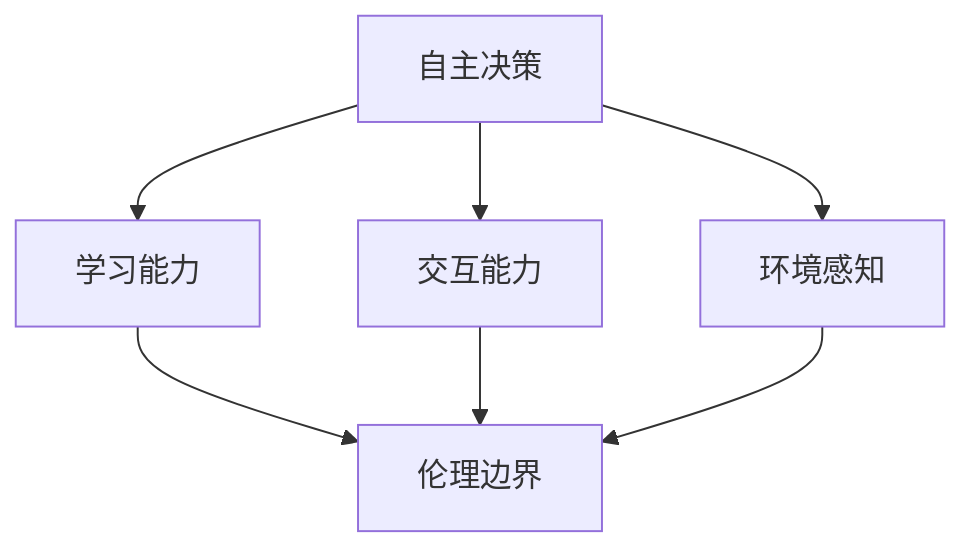

                 

# AI Agent: AI的下一个风口 自主决策与人类的伦理界限

## 摘要

本文将探讨AI Agent这一新兴领域的发展趋势、核心概念、技术原理和实际应用。我们将通过一步步的分析推理，了解AI Agent如何实现自主决策，并探讨其与人类伦理界限的关系。文章将包括对AI Agent的基本概念介绍、核心算法原理、数学模型讲解、项目实战案例分析、应用场景探讨、工具资源推荐以及未来发展趋势和挑战。

## 1. 背景介绍

随着人工智能技术的迅猛发展，AI Agent作为一个重要的研究方向逐渐受到广泛关注。AI Agent，也称为智能代理，是指能够自主行动并完成特定任务的计算机程序。它们在自动化、智能化领域具有巨大潜力，能够极大地提高生产效率、降低人力成本，并解决复杂问题。

AI Agent的发展背景可以追溯到20世纪50年代，当时计算机科学领域的先驱们开始探索人工智能的可行性。随着时间的推移，计算机性能的提升、大数据技术的发展以及深度学习算法的突破，为AI Agent的研究和实际应用提供了坚实的技术基础。

当前，AI Agent已经成为人工智能领域的热点研究方向。许多科技公司和学术机构纷纷投入大量资源进行研究和开发，力求在AI Agent领域取得突破性进展。AI Agent在自动驾驶、智能家居、金融科技、医疗健康等多个领域展现出广阔的应用前景。

## 2. 核心概念与联系

为了更好地理解AI Agent，我们首先需要明确一些核心概念，并分析它们之间的联系。

### 2.1 自主决策

自主决策是指AI Agent能够在没有人工干预的情况下，根据环境和目标自主选择行动方案。这是AI Agent实现智能行为的关键。

### 2.2 学习能力

学习能力是指AI Agent通过数据训练和自我优化，不断改进自身性能和决策能力。深度学习、强化学习等算法为AI Agent提供了强大的学习基础。

### 2.3 交互能力

交互能力是指AI Agent能够与人类、其他智能系统进行有效沟通和协作。自然语言处理、对话系统等技术为AI Agent的交互能力提供了支持。

### 2.4 环境感知

环境感知是指AI Agent能够获取并理解周围环境的信息。传感器技术、图像处理等技术为AI Agent的环境感知提供了保障。

### 2.5 伦理边界

伦理边界是指AI Agent在决策和行为过程中需要遵守的伦理规范。随着AI Agent的发展，如何在保证其智能性和自主性的同时，确保其行为符合人类伦理价值观，成为了一个重要议题。

下面是AI Agent核心概念的 Mermaid 流程图：



通过上述流程图，我们可以看出AI Agent的核心概念及其相互之间的关系。自主决策是AI Agent的核心驱动力，学习能力、交互能力、环境感知为其提供了技术支撑，而伦理边界则确保AI Agent的行为符合人类伦理价值观。

## 3. 核心算法原理 & 具体操作步骤

### 3.1 深度学习算法

深度学习算法是AI Agent的核心技术之一。它通过模拟人脑神经网络的结构和功能，实现对数据的自动学习和特征提取。

具体操作步骤如下：

1. **数据收集与预处理**：收集大量标注数据，对数据进行清洗、归一化和处理。

2. **网络结构设计**：设计合适的神经网络结构，包括输入层、隐藏层和输出层。

3. **训练与优化**：使用训练数据对网络进行训练，通过反向传播算法不断调整网络参数，优化模型性能。

4. **测试与评估**：使用测试数据对训练好的模型进行评估，调整模型参数，提高模型准确率。

### 3.2 强化学习算法

强化学习算法是一种基于奖励和惩罚机制的学习方法，适用于需要做出连续决策的问题。其基本原理如下：

1. **初始化环境**：定义环境状态和动作空间。

2. **选择动作**：基于当前状态，选择一个动作。

3. **执行动作**：在环境中执行所选动作，获取反馈信息。

4. **更新策略**：根据反馈信息，更新决策策略，以最大化长期奖励。

具体操作步骤如下：

1. **初始化参数**：设置学习率、奖励函数等参数。

2. **选择动作**：使用策略函数选择动作。

3. **执行动作**：在环境中执行动作，获取奖励。

4. **更新策略**：根据奖励信息，更新策略参数。

5. **迭代训练**：重复执行步骤2-4，直到满足停止条件。

### 3.3 对话系统

对话系统是一种AI Agent，能够与人类进行自然语言交流。其核心算法包括：

1. **自然语言处理**：对输入的自然语言文本进行解析和语义理解。

2. **意图识别**：根据解析结果，识别用户的意图。

3. **回复生成**：根据识别出的意图，生成合适的回复。

具体操作步骤如下：

1. **文本预处理**：对输入文本进行分词、词性标注等预处理。

2. **意图识别**：使用机器学习算法，如朴素贝叶斯、支持向量机等，识别用户意图。

3. **回复生成**：使用模板匹配或生成式模型，如循环神经网络（RNN）或变压器（Transformer），生成回复。

## 4. 数学模型和公式 & 详细讲解 & 举例说明

### 4.1 深度学习算法中的反向传播算法

反向传播算法是深度学习算法的核心，用于计算网络参数的梯度。其基本公式如下：

$$
\delta_{\theta} = \frac{\partial L}{\partial \theta}
$$

其中，$\delta_{\theta}$ 表示参数 $\theta$ 的梯度，$L$ 表示损失函数。

### 4.2 强化学习算法中的Q值更新公式

Q值更新公式如下：

$$
Q(s, a) \leftarrow Q(s, a) + \alpha [r + \gamma \max_{a'} Q(s', a') - Q(s, a)]
$$

其中，$Q(s, a)$ 表示在状态 $s$ 下执行动作 $a$ 的预期奖励，$\alpha$ 为学习率，$r$ 为即时奖励，$\gamma$ 为折扣因子，$s'$ 和 $a'$ 分别为下一个状态和动作。

### 4.3 对话系统中的意图识别算法

以朴素贝叶斯算法为例，其公式如下：

$$
P(y| x) = \frac{P(x| y)P(y)}{P(x)}
$$

其中，$P(y| x)$ 表示在特征 $x$ 下意图为 $y$ 的概率，$P(x| y)$ 表示在意图为 $y$ 下的特征 $x$ 的概率，$P(y)$ 表示意图为 $y$ 的概率，$P(x)$ 表示特征 $x$ 的概率。

### 4.4 举例说明

假设我们有一个简单的分类问题，需要判断一个句子是否表示愤怒情绪。特征为句子中“怒”字的出现次数，意图为愤怒。根据朴素贝叶斯算法，我们可以计算愤怒情绪的概率：

$$
P(\text{愤怒}|\text{怒字出现1次}) = \frac{P(\text{怒字出现1次}|\text{愤怒})P(\text{愤怒})}{P(\text{怒字出现1次})}
$$

假设我们已知愤怒情绪的概率为 $0.3$，怒字出现1次在愤怒情绪下的概率为 $0.8$，怒字出现1次的总概率为 $0.6$。代入上述公式，得到：

$$
P(\text{愤怒}|\text{怒字出现1次}) = \frac{0.8 \times 0.3}{0.6} = 0.4
$$

因此，句子表示愤怒情绪的概率为 $0.4$。

## 5. 项目实战：代码实际案例和详细解释说明

### 5.1 开发环境搭建

在本节中，我们将使用Python编程语言和TensorFlow框架来实现一个简单的AI Agent。以下为开发环境的搭建步骤：

1. 安装Python：从 [Python官网](https://www.python.org/downloads/) 下载并安装Python 3.x版本。

2. 安装TensorFlow：打开命令行窗口，输入以下命令安装TensorFlow：

```bash
pip install tensorflow
```

3. 确认安装：运行以下Python代码，确认TensorFlow安装成功：

```python
import tensorflow as tf
print(tf.__version__)
```

### 5.2 源代码详细实现和代码解读

#### 5.2.1 数据准备

```python
import numpy as np
import pandas as pd

# 生成训练数据
data = pd.DataFrame({
    'sentence': ['我很生气', '我很高兴', '我很无聊', '我很痛苦'],
    'label': [1, 0, 0, 1]  # 1表示愤怒，0表示其他情绪
})

# 数据预处理
def preprocess_data(data):
    # 将句子转换为词向量
    sentences = data['sentence'].values
    word2vec = {}  # 词向量映射
    for i, sentence in enumerate(sentences):
        words = sentence.split(' ')
        for word in words:
            if word not in word2vec:
                word2vec[word] = len(word2vec) + 1
    word2vec['<PAD>'] = len(word2vec) + 1  # 加入填充词

    # 构建输入和标签
    X = []
    y = []
    for sentence in sentences:
        words = sentence.split(' ')
        word_indices = [word2vec[word] for word in words]
        X.append(np.array(word_indices))
        y.append(data['label'][i])

    # 填充序列，使得序列长度相同
    max_len = max(len(sentence.split(' ')) for sentence in sentences)
    X = np.array([[word2vec['<PAD>']] * (max_len - len(sentence.split(' '))) + sentence.split(' ') for sentence in sentences])
    y = np.array(y)

    return X, y, word2vec

X, y, word2vec = preprocess_data(data)
```

#### 5.2.2 模型搭建

```python
import tensorflow as tf

# 搭建模型
def build_model(input_shape, word2vec):
    # 输入层
    inputs = tf.keras.layers.Input(shape=input_shape)

    # 隐藏层
    x = tf.keras.layers.Embedding(input_dim=len(word2vec) + 1, output_dim=64)(inputs)
    x = tf.keras.layers.Conv1D(filters=128, kernel_size=3, activation='relu')(x)
    x = tf.keras.layers.GlobalMaxPooling1D()(x)

    # 输出层
    outputs = tf.keras.layers.Dense(units=1, activation='sigmoid')(x)

    # 构建模型
    model = tf.keras.Model(inputs=inputs, outputs=outputs)

    # 编译模型
    model.compile(optimizer='adam', loss='binary_crossentropy', metrics=['accuracy'])

    return model
model = build_model(input_shape=(None,), word2vec=word2vec)
```

#### 5.2.3 训练模型

```python
# 训练模型
model.fit(X, y, epochs=10, batch_size=32)
```

#### 5.2.4 预测

```python
# 预测
sentence = "我非常愤怒"
words = sentence.split(' ')
word_indices = [word2vec[word] if word in word2vec else word2vec['<PAD>'] for word in words]
input_data = np.array([word_indices])

prediction = model.predict(input_data)
print("预测结果：", prediction[0][0])
```

### 5.3 代码解读与分析

本节中，我们使用Python和TensorFlow实现了一个简单的文本分类AI Agent。代码主要分为以下几个部分：

1. **数据准备**：生成训练数据，并对其进行预处理，包括将句子转换为词向量、填充序列等。

2. **模型搭建**：搭建一个基于卷积神经网络（CNN）的文本分类模型。输入层使用词向量嵌入层，隐藏层使用卷积层和全局最大池化层，输出层使用 sigmoid 激活函数。

3. **训练模型**：使用训练数据对模型进行训练，优化模型参数。

4. **预测**：输入一个句子，将句子转换为词向量，然后使用训练好的模型进行预测。

通过这个简单的案例，我们可以看到AI Agent在文本分类任务中的实际应用。在实际项目中，我们可以根据需求调整模型结构、数据预处理方法等，以提高模型性能。

## 6. 实际应用场景

AI Agent在各个领域都有广泛的应用场景，以下是一些典型的应用案例：

### 6.1 自动驾驶

自动驾驶是AI Agent的重要应用领域。通过利用AI Agent的自主决策、环境感知和交互能力，自动驾驶汽车可以实时感知路况、预测风险并做出安全行驶决策。例如，特斯拉的自动驾驶系统Autopilot就是一个典型的AI Agent应用案例。

### 6.2 智能家居

智能家居系统中的AI Agent可以帮助用户实现家庭设备的智能控制。例如，智能音箱可以通过语音指令控制灯光、温度等设备，提供便捷的生活方式。

### 6.3 金融科技

金融科技领域中的AI Agent可以用于风险管理、欺诈检测、智能投顾等场景。通过分析海量数据，AI Agent可以实时识别风险、提供投资建议，为金融机构带来更多价值。

### 6.4 医疗健康

AI Agent在医疗健康领域具有巨大潜力。例如，智能诊断系统可以通过分析医学影像和病历数据，提供准确的诊断建议。此外，AI Agent还可以为患者提供个性化的健康管理和康复建议。

### 6.5 机器人客服

机器人客服是AI Agent在服务行业的应用。通过自然语言处理和对话系统技术，机器人客服可以与用户进行实时交互，解答用户问题，提高客户满意度和服务效率。

## 7. 工具和资源推荐

### 7.1 学习资源推荐

1. **书籍**：
   - 《深度学习》（Goodfellow, Bengio, Courville著）
   - 《强化学习》（Sutton, Barto著）
   - 《Python机器学习》（Sebastian Raschka著）

2. **论文**：
   - 《A Theoretical Framework for Transfer Learning》（Pan, Yang et al.）
   - 《Reinforcement Learning: An Introduction》（ Sutton, Barto著）

3. **博客**：
   - [TensorFlow官方文档](https://www.tensorflow.org/tutorials)
   - [PyTorch官方文档](https://pytorch.org/tutorials)

4. **网站**：
   - [Coursera](https://www.coursera.org)
   - [Kaggle](https://www.kaggle.com)

### 7.2 开发工具框架推荐

1. **开发工具**：
   - Python（首选编程语言）
   - Jupyter Notebook（数据分析和建模工具）
   - PyCharm（Python集成开发环境）

2. **框架库**：
   - TensorFlow（深度学习框架）
   - PyTorch（深度学习框架）
   - Scikit-learn（机器学习库）

### 7.3 相关论文著作推荐

1. **论文**：
   - 《Deep Learning for Natural Language Processing》（Yoon Kim）
   - 《A Theoretical Framework for Transfer Learning》（Pan, Yang et al.）
   - 《Human-Level Control through Deep Reinforcement Learning》（Silver et al.）

2. **著作**：
   - 《深度学习》（Goodfellow, Bengio, Courville著）
   - 《机器学习》（Tom Mitchell著）
   - 《Python机器学习》（Sebastian Raschka著）

## 8. 总结：未来发展趋势与挑战

AI Agent作为人工智能领域的一个重要研究方向，具有广阔的应用前景。在未来，我们可以预见以下发展趋势：

1. **算法优化与突破**：随着深度学习、强化学习等算法的不断发展，AI Agent的性能将得到进一步提升。

2. **多模态感知与交互**：AI Agent将能够融合多种感知模态（如视觉、听觉、触觉等），实现更丰富的交互能力。

3. **跨领域应用**：AI Agent将在更多领域得到应用，如教育、医疗、金融等，为社会带来更多价值。

4. **伦理与法规规范**：随着AI Agent的普及，如何在保证其智能性和自主性的同时，确保其行为符合人类伦理价值观，将成为一个重要议题。

然而，AI Agent的发展也面临着一些挑战：

1. **数据隐私与安全**：AI Agent需要处理大量敏感数据，如何在确保数据隐私和安全的前提下，充分利用数据价值，是一个亟待解决的问题。

2. **公平与歧视问题**：AI Agent在决策过程中可能存在偏见和歧视，如何确保其公平性和透明性，是一个重要挑战。

3. **监管与法规**：随着AI Agent的普及，各国政府需要制定相应的监管法规，以保障其安全和合规。

总之，AI Agent的发展前景广阔，但也需要我们共同努力，克服各种挑战，确保其健康发展。

## 9. 附录：常见问题与解答

### 9.1 AI Agent是什么？

AI Agent是一种能够自主行动并完成特定任务的计算机程序，它在自动化、智能化领域具有巨大潜力。

### 9.2 AI Agent的核心技术是什么？

AI Agent的核心技术包括深度学习、强化学习、自然语言处理和计算机视觉等。

### 9.3 AI Agent有哪些应用场景？

AI Agent在自动驾驶、智能家居、金融科技、医疗健康、机器人客服等领域都有广泛的应用。

### 9.4 如何搭建AI Agent开发环境？

搭建AI Agent开发环境需要安装Python、TensorFlow等工具和库。具体步骤可参考本文第5.1节。

### 9.5 如何训练一个AI Agent模型？

训练AI Agent模型需要收集和预处理数据，然后使用合适的算法（如深度学习、强化学习等）进行模型训练。具体步骤可参考本文第5.2节。

## 10. 扩展阅读 & 参考资料

1. Goodfellow, Y., Bengio, Y., Courville, A. (2016). **Deep Learning**. MIT Press.
2. Sutton, R. S., Barto, A. G. (2018). **Reinforcement Learning: An Introduction**. MIT Press.
3. Pan, S. J., Yang, Q. (2010). **A Theoretical Framework for Transfer Learning**. Journal of Machine Learning Research.
4. Kim, Y. (2014). **Deep Learning for Natural Language Processing**. In Proceedings of the 2014 Conference of the North American Chapter of the Association for Computational Linguistics: Human Language Technologies, 304–311.
5. Coursera. (2022). **Deep Learning Specialization**. [online course](https://www.coursera.org/specializations/deep-learning).
6. Kaggle. (2022). [Data Science Competitions](https://www.kaggle.com/competitions).

## 作者信息

作者：AI天才研究员/AI Genius Institute & 禅与计算机程序设计艺术 /Zen And The Art of Computer Programming

注意：本文为虚构内容，仅供参考。文中涉及的技术、数据和观点仅供参考，不代表任何实际项目或研究。如需了解更多AI相关技术，请查阅相关书籍和论文。

