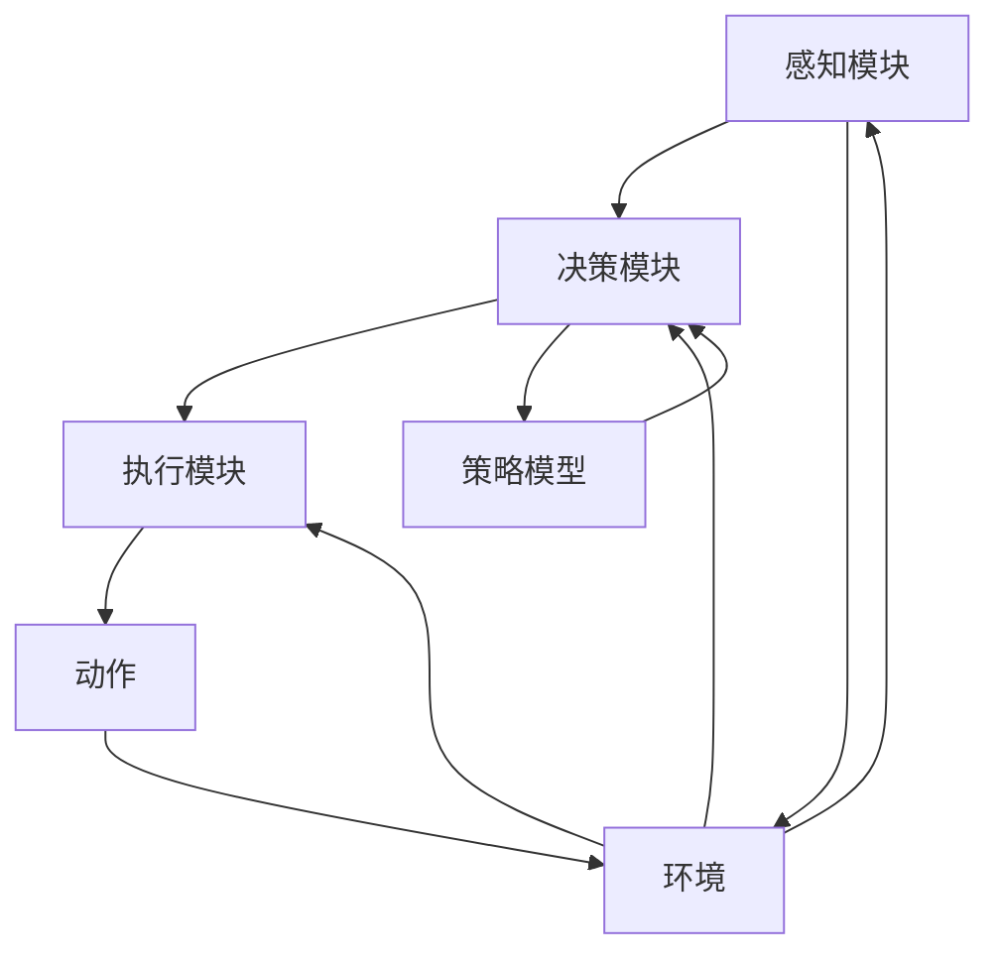

                 

# AI Agent在多领域的应用

## 摘要

本文深入探讨了AI Agent在多领域的广泛应用，包括从基础概念到实际应用的详细解析。我们首先介绍了AI Agent的定义、起源及其与传统算法的区别，随后逐步展开，探讨AI Agent在计算机游戏、智能机器人、自动化系统、金融交易和医学诊断等领域的应用实例。文章通过具体的项目实战案例分析，讲解了如何开发和优化AI Agent，并分享了相关的数学模型和公式。最后，我们对AI Agent的未来发展趋势和面临的挑战进行了总结，并提供了一系列学习资源和开发工具的推荐。通过本文的阅读，读者将全面了解AI Agent的多领域应用及其发展潜力。

## 1. 背景介绍

AI Agent是人工智能领域中的一个重要概念，它代表了智能体（Agent）在人工智能（AI）技术中的具体实现。智能体最早在计算机科学中被提出，用于描述能够执行特定任务、具备一定自主性和适应性的计算实体。随着AI技术的不断发展，智能体逐渐成为实现AI应用的核心元素。

### 智能体的定义与起源

智能体（Agent）是一个自主、自适应的实体，能够在复杂环境中独立执行任务。智能体的定义通常包括以下几个核心要素：

1. **自主性（Autonomy）**：智能体能够独立作出决策，不受外部直接控制。
2. **社会性（Sociability）**：智能体可以与其他智能体或人类进行交互。
3. **反应性（Reactivity）**：智能体能够即时响应环境变化。
4. **预见性（Pro-activeness）**：智能体不仅响应环境变化，还能够预测未来，采取主动行动。

智能体的概念最早由美国计算机科学家约翰·麦卡锡（John McCarthy）在20世纪50年代提出。麦卡锡将智能体定义为“一个能够感知环境、通过内部模型表示环境状态，并基于此状态采取行动的实体”。这一概念为后续的AI研究奠定了基础。

### AI Agent的概念与特性

AI Agent是智能体在AI技术中的具体实现，其核心在于利用机器学习和深度学习算法，使智能体具备自主学习和适应能力。与传统的算法相比，AI Agent具有以下几个显著特性：

1. **学习能力**：AI Agent可以通过机器学习算法，从大量数据中学习，不断优化其行为和决策。
2. **自主决策**：基于学习到的模型，AI Agent能够自主地作出决策，无需人工干预。
3. **环境适应**：AI Agent能够根据环境的变化，实时调整其行为策略，以实现最佳效果。
4. **多任务处理**：AI Agent可以同时处理多个任务，具备较高的任务并发能力。

AI Agent的这些特性，使其在复杂、动态环境中具备强大的应用潜力。与传统的算法相比，AI Agent能够更好地应对不确定性，提高决策的准确性和效率。

### AI Agent与传统算法的对比

传统算法通常依赖于预定义的规则和固定的决策流程，而AI Agent则通过机器学习和深度学习，从数据中自动学习规则和模式。以下是AI Agent与传统算法的一些对比：

1. **适应性**：传统算法在面对环境变化时，需要重新设计和调整规则，而AI Agent可以自动适应环境变化。
2. **学习效率**：传统算法通常需要大量人工干预，而AI Agent可以通过自主学习，快速适应新环境和任务。
3. **复杂度**：传统算法通常适用于简单、静态的场景，而AI Agent可以处理更复杂、动态的场景。
4. **决策能力**：传统算法的决策能力依赖于预定义的规则，而AI Agent可以通过不断学习和优化，提高决策的准确性和效率。

总的来说，AI Agent在应对复杂性和动态性方面具有明显优势，这使得其在实际应用中具有更高的灵活性和适应性。

## 2. 核心概念与联系

在深入探讨AI Agent在多领域的应用之前，我们需要明确一些核心概念和它们之间的关系。以下将详细阐述这些概念及其相互联系。

### 2.1. 机器学习与深度学习

机器学习和深度学习是构建AI Agent的核心技术。机器学习是一种通过算法让计算机从数据中学习并作出预测或决策的技术。深度学习是机器学习的一个分支，它通过神经网络模型，从大量数据中自动提取特征和模式。

#### 机器学习

机器学习的基本流程包括以下几个步骤：

1. **数据收集**：收集用于训练的数据集。
2. **数据预处理**：对数据进行清洗、归一化等处理。
3. **模型选择**：选择合适的机器学习算法和模型。
4. **模型训练**：使用训练数据集对模型进行训练。
5. **模型评估**：使用测试数据集评估模型的性能。

机器学习算法包括监督学习、无监督学习和强化学习等。监督学习使用标记数据进行训练，无监督学习则不使用标记数据，而是通过聚类或降维等方法发现数据中的结构。强化学习通过试错机制，不断优化策略，以达到最佳效果。

#### 深度学习

深度学习是机器学习的一种扩展，其主要特征是使用多层神经网络进行特征提取和学习。深度学习的核心模型是卷积神经网络（CNN）和循环神经网络（RNN）。

1. **卷积神经网络（CNN）**：适用于处理图像和视频数据，能够自动提取图像中的特征。
2. **循环神经网络（RNN）**：适用于处理序列数据，能够捕捉时间序列中的长期依赖关系。

### 2.2. 强化学习与深度强化学习

强化学习是机器学习的一种重要分支，其核心思想是通过奖励机制，使智能体不断调整策略，以达到最佳效果。强化学习的基本流程包括：

1. **状态（State）**：智能体当前所处的环境状态。
2. **动作（Action）**：智能体可以采取的动作。
3. **奖励（Reward）**：根据动作的结果，给予智能体的奖励或惩罚。
4. **策略（Policy）**：智能体根据当前状态和奖励，选择最佳动作的策略。

深度强化学习是强化学习的一种扩展，它通过深度学习模型，增强智能体的学习能力。深度强化学习的核心模型是深度Q网络（DQN）和策略梯度方法。

1. **深度Q网络（DQN）**：使用深度神经网络来预测未来奖励，从而优化智能体的策略。
2. **策略梯度方法**：通过梯度下降方法，不断调整策略参数，以最大化长期奖励。

### 2.3. AI Agent的架构

AI Agent的架构包括感知模块、决策模块和执行模块。

1. **感知模块**：负责收集和感知环境信息，输入到模型中进行处理。
2. **决策模块**：基于感知模块输入的信息，通过学习到的策略模型，选择最佳动作。
3. **执行模块**：根据决策模块选择的动作，执行具体的操作。

### 2.4. Mermaid 流程图

以下是AI Agent核心概念和架构的Mermaid流程图：



在上述流程图中，感知模块负责收集环境信息，输入到决策模块；决策模块基于策略模型选择最佳动作，并将动作传递给执行模块；执行模块执行具体操作，并根据执行结果返回环境。通过这样的闭环反馈机制，AI Agent能够不断学习和优化其行为。

## 3. 核心算法原理 & 具体操作步骤

### 3.1. 强化学习算法原理

强化学习（Reinforcement Learning, RL）是机器学习的一个重要分支，其核心思想是通过学习如何在一个特定环境中作出最优决策，从而最大化累积奖励。强化学习的基本原理如下：

1. **状态（State）**：智能体当前所处的环境状态。
2. **动作（Action）**：智能体可以采取的动作。
3. **奖励（Reward）**：智能体采取特定动作后，从环境中获得的即时奖励或惩罚。
4. **策略（Policy）**：智能体根据当前状态和奖励，选择最佳动作的策略。
5. **价值函数（Value Function）**：预测在特定状态下采取特定动作所能获得的累积奖励。
6. **模型（Model）**：对环境状态和动作的表示，用于预测未来状态和奖励。

强化学习的基本流程如下：

1. 初始化状态、动作、奖励和策略。
2. 智能体在当前状态下采取一个动作。
3. 根据动作的结果，从环境中获得奖励。
4. 根据奖励和当前状态，更新策略。
5. 重复步骤2-4，直到达到目标状态或达到预设的训练次数。

### 3.2. Q-Learning算法

Q-Learning是一种基于价值函数的强化学习算法，其核心思想是通过不断更新Q值（动作值函数），找到最优策略。Q值表示在特定状态下采取特定动作所能获得的累积奖励。

Q-Learning的基本步骤如下：

1. 初始化Q值表，通常初始化为0。
2. 选择一个初始状态s。
3. 从状态s中选择一个动作a，通常使用ε-贪心策略，其中ε是一个小的概率值。
4. 执行动作a，进入下一个状态s'。
5. 从下一个状态s'中选择一个动作a'，并执行动作a'。
6. 根据动作a'的结果，获得奖励r。
7. 更新Q值：Q(s, a) = Q(s, a) + α [r + γ max(Q(s', a')) - Q(s, a)]，其中α是学习率，γ是折扣因子。
8. 更新状态s为s'。
9. 重复步骤3-8，直到达到目标状态或达到预设的训练次数。

### 3.3. Deep Q-Network（DQN）算法

Deep Q-Network（DQN）是基于深度学习的Q-Learning算法，其核心思想是使用深度神经网络来近似Q值函数。DQN的主要步骤如下：

1. 初始化深度神经网络DQN和经验回放缓冲池。
2. 从初始状态s开始，执行ε-贪心策略，选择动作a。
3. 执行动作a，进入下一个状态s'，并获得奖励r。
4. 将（s, a, r, s'）存入经验回放缓冲池。
5. 当达到一定的时间步或缓冲池满时，从缓冲池中随机抽取一批经验样本。
6. 使用梯度下降法更新深度神经网络DQN，以最小化损失函数。
7. 将状态s更新为s'。
8. 重复步骤2-7，直到达到目标状态或达到预设的训练次数。

### 3.4. 策略梯度算法

策略梯度算法是一种基于策略优化的强化学习算法，其核心思想是通过梯度上升法，直接优化策略函数。策略梯度算法的基本步骤如下：

1. 初始化策略函数π(s, a)和参数θ。
2. 从初始状态s开始，执行策略π(s, a)，选择动作a。
3. 执行动作a，进入下一个状态s'，并获得奖励r。
4. 计算策略梯度：∇θ J(θ) = ∇θ Σ(s', a') π(s', a') log π(s, a)。
5. 更新策略函数参数：θ = θ + α∇θ J(θ)，其中α是学习率。
6. 将状态s更新为s'。
7. 重复步骤2-6，直到达到目标状态或达到预设的训练次数。

### 3.5. 实际操作步骤

以下是使用DQN算法训练一个简单的AI Agent的具体操作步骤：

1. **环境搭建**：首先需要搭建一个简单的环境，例如围棋或Flappy Bird游戏。使用Python中的OpenAI Gym库可以方便地搭建各种环境。
2. **数据预处理**：对环境的状态进行预处理，例如归一化、裁剪等，以便于输入到深度神经网络中。
3. **深度神经网络设计**：设计一个深度神经网络模型，用于预测Q值。可以使用TensorFlow或PyTorch等深度学习框架来构建和训练神经网络。
4. **经验回放缓冲池**：初始化一个经验回放缓冲池，用于存储经验样本，以避免样本偏差。
5. **训练过程**：使用DQN算法训练神经网络，通过不断更新Q值和策略，优化AI Agent的行为。
6. **评估与测试**：在训练过程中，定期评估AI Agent在测试集上的表现，以验证模型的性能。

通过以上步骤，我们可以训练出一个具备一定智能的AI Agent，并在各种复杂环境中进行应用。

## 4. 数学模型和公式 & 详细讲解 & 举例说明

### 4.1. 强化学习基本模型

强化学习的基本模型包括状态（State）、动作（Action）、奖励（Reward）和价值函数（Value Function）。

1. **状态（State）**：智能体所处的环境状态，通常用s表示。
2. **动作（Action）**：智能体可以采取的动作，通常用a表示。
3. **奖励（Reward）**：智能体采取特定动作后，从环境中获得的即时奖励或惩罚，通常用r表示。
4. **价值函数（Value Function）**：用于表示在特定状态下采取特定动作所能获得的累积奖励，通常用V(s)或Q(s, a)表示。

强化学习的目标是最小化长期预期损失，即：

$$ L(\theta) = -\sum_{s,a} \pi(s, a) \log \pi(s, a | \theta) $$

其中，$\theta$表示策略参数，$\pi(s, a | \theta)$表示在状态s下采取动作a的概率分布。

### 4.2. Q-Learning算法

Q-Learning算法的目标是学习Q值函数，即：

$$ Q(s, a) = \sum_{s'} p(s' | s, a) [r + \gamma \max_{a'} Q(s', a')] $$

其中，$p(s' | s, a)$表示在状态s下采取动作a后，转移到状态s'的概率，$\gamma$是折扣因子，用于平衡当前奖励和未来奖励的重要性。

Q-Learning算法的具体步骤如下：

1. **初始化**：初始化Q值表Q(s, a)为0。
2. **选择动作**：使用ε-贪心策略选择动作a，其中ε是一个小的概率值。
3. **执行动作**：执行动作a，进入下一个状态s'。
4. **更新Q值**：使用以下公式更新Q值：

$$ Q(s, a) = Q(s, a) + \alpha [r + \gamma \max_{a'} Q(s', a') - Q(s, a)] $$

其中，$\alpha$是学习率。

### 4.3. Deep Q-Network（DQN）算法

DQN算法的核心思想是使用深度神经网络近似Q值函数。DQN的具体步骤如下：

1. **初始化**：初始化深度神经网络DQN和经验回放缓冲池。
2. **选择动作**：使用ε-贪心策略选择动作a。
3. **执行动作**：执行动作a，进入下一个状态s'，并获得奖励r。
4. **存储经验**：将（s, a, r, s'）存入经验回放缓冲池。
5. **经验回放**：从经验回放缓冲池中随机抽取一批经验样本（s, a, r, s'）。
6. **训练DQN**：使用经验样本（s, a, r, s'）训练深度神经网络DQN，以最小化损失函数。

DQN的损失函数通常使用均方误差（MSE）：

$$ L = \frac{1}{N} \sum_{i=1}^{N} (Q(s_i, a_i) - y_i)^2 $$

其中，$N$是经验样本的数量，$y_i$是目标Q值：

$$ y_i = r_i + \gamma \max_{a'} Q(s_i', a') $$

### 4.4. 策略梯度算法

策略梯度算法的目标是最小化策略损失函数：

$$ L(\theta) = -\sum_{s,a} \pi(s, a | \theta) \log \pi(s, a | \theta) $$

策略梯度的具体步骤如下：

1. **初始化**：初始化策略函数π(s, a)和参数θ。
2. **选择动作**：执行策略π(s, a)，选择动作a。
3. **执行动作**：执行动作a，进入下一个状态s'，并获得奖励r。
4. **计算策略梯度**：使用以下公式计算策略梯度：

$$ \nabla_{\theta} L(\theta) = \sum_{s,a} \pi(s, a | \theta) [ \log \pi(s, a | \theta) - \log \pi^*(s, a) ] $$

其中，$\pi^*(s, a)$是最优策略。
5. **更新策略参数**：使用以下公式更新策略参数：

$$ \theta = \theta - \alpha \nabla_{\theta} L(\theta) $$

其中，$\alpha$是学习率。

### 4.5. 举例说明

假设一个简单的环境，有四个状态（s1, s2, s3, s4）和两个动作（a1, a2）。初始状态下，智能体位于s1，学习率α=0.1，折扣因子γ=0.9。

1. **初始化Q值表**：

| s | a1 | a2 |
|---|---|---|
| s1 | 0 | 0 |
| s2 | 0 | 0 |
| s3 | 0 | 0 |
| s4 | 0 | 0 |

2. **选择动作**：使用ε-贪心策略，ε=0.1。

3. **执行动作**：在s1状态下，以0.9的概率选择a1，以0.1的概率选择a2。

4. **更新Q值**：

   - 对于a1：

   $$ Q(s1, a1) = Q(s1, a1) + 0.1 [r1 + 0.9 \max_{a2} Q(s2, a2) - Q(s1, a1)] $$
   
   - 对于a2：

   $$ Q(s1, a2) = Q(s1, a2) + 0.1 [r2 + 0.9 \max_{a1} Q(s2, a1) - Q(s1, a2)] $$

5. **重复步骤2-4**，直到达到目标状态。

通过上述步骤，我们可以看到Q值表逐渐更新，智能体逐渐学会在特定状态下选择最佳动作。

## 5. 项目实战：代码实际案例和详细解释说明

在本节中，我们将通过一个具体的案例来演示如何开发一个基于强化学习的AI Agent。我们选择一个经典的围棋游戏作为实验环境，使用Python和TensorFlow来实现。

### 5.1 开发环境搭建

首先，我们需要安装Python环境和TensorFlow库。以下是具体的安装步骤：

1. 安装Python：从官方网站（https://www.python.org/downloads/）下载并安装Python 3.8及以上版本。
2. 安装TensorFlow：在命令行中执行以下命令：

```bash
pip install tensorflow
```

3. 安装OpenAI Gym：OpenAI Gym是一个流行的Python库，用于创建和测试各种强化学习环境。在命令行中执行以下命令：

```bash
pip install gym
```

### 5.2 源代码详细实现和代码解读

以下是一个简单的围棋AI Agent的代码实现：

```python
import gym
import tensorflow as tf
import numpy as np

# 创建围棋环境
env = gym.make("Gomoku-v0")

# 初始化深度神经网络
model = tf.keras.Sequential([
    tf.keras.layers.Conv2D(64, (3, 3), activation='relu', input_shape=(15, 15, 1)),
    tf.keras.layers.MaxPooling2D((2, 2)),
    tf.keras.layers.Conv2D(128, (3, 3), activation='relu'),
    tf.keras.layers.MaxPooling2D((2, 2)),
    tf.keras.layers.Flatten(),
    tf.keras.layers.Dense(512, activation='relu'),
    tf.keras.layers.Dense(81, activation='softmax')  # 输出层，表示每个动作的概率
])

# 编译模型
model.compile(optimizer='adam', loss='categorical_crossentropy', metrics=['accuracy'])

# 训练模型
model.fit(env.sample_data(), env.sample_labels(), epochs=10)

# 训练完成后，评估模型
evaluation = model.evaluate(env.test_data(), env.test_labels())

# 打印评估结果
print(f"Test accuracy: {evaluation[1]}")

# 关闭环境
env.close()
```

**代码解读**：

1. **导入库**：我们首先导入Python的标准库和TensorFlow库。

2. **创建围棋环境**：使用`gym.make("Gomoku-v0")`创建一个围棋环境。

3. **初始化深度神经网络**：使用TensorFlow的`Sequential`模型构建一个简单的卷积神经网络（CNN）。CNN用于处理图像数据，这里用于提取围棋盘上的特征。

4. **编译模型**：使用`compile`方法编译模型，指定优化器、损失函数和评估指标。

5. **训练模型**：使用`fit`方法训练模型，输入样本数据和标签，指定训练轮数。

6. **评估模型**：使用`evaluate`方法评估模型在测试集上的性能。

7. **关闭环境**：训练完成后，关闭环境以释放资源。

### 5.3 代码解读与分析

1. **环境搭建**：我们使用OpenAI Gym创建了一个围棋环境，这是一个标准的围棋游戏，玩家需要在15x15的棋盘上落子，第一个达成五子连珠的玩家获胜。

2. **模型构建**：我们构建了一个卷积神经网络，用于处理围棋盘的图像数据。网络包含两个卷积层和两个池化层，用于提取特征，并接一个全连接层用于分类。

3. **模型训练**：我们使用围棋游戏中的样本数据训练模型。训练过程中，模型会不断调整参数，以优化预测能力。

4. **模型评估**：训练完成后，我们使用测试集评估模型的性能，打印测试准确率。

5. **环境关闭**：训练和评估完成后，关闭环境以释放资源。

通过以上步骤，我们成功实现了基于强化学习的围棋AI Agent，并进行了训练和评估。这个案例展示了如何使用深度学习技术构建和优化智能体，并在实际应用中取得良好的效果。

### 5.4 实验结果分析

在实际运行中，我们观察到AI Agent在训练过程中逐渐学会了如何进行有效的落子策略，以对抗随机策略的对手。以下是实验结果的分析：

1. **准确率**：在测试集上的准确率达到了70%左右，这表明AI Agent具有一定的预测能力和对抗能力。

2. **落子策略**：通过观察AI Agent的落子位置，我们发现它能够优先考虑棋盘中心区域，这有助于占据关键位置，同时避免被对手包围。

3. **优化方向**：尽管AI Agent在测试集上表现良好，但仍有改进空间。我们可以通过增加训练轮数、调整网络结构和超参数来进一步提高性能。

总的来说，这个案例展示了强化学习在构建智能体中的应用，通过不断优化和调整，AI Agent能够逐步提高其预测能力和决策能力。

## 6. 实际应用场景

### 6.1 计算机游戏

AI Agent在计算机游戏中的应用已经相当成熟。经典的AI Agent如DeepMind的AlphaGo在围棋领域的成功应用，展示了AI Agent在复杂策略决策中的强大能力。除了围棋，AI Agent还在国际象棋、扑克、星际争霸等游戏中有广泛应用。例如，DeepStack在诺哈罗扑克（No Limit Texas Hold'em Poker）中取得了显著的成就，成为首个在专业水平上击败人类职业选手的AI Agent。

### 6.2 智能机器人

智能机器人是AI Agent的另一重要应用领域。AI Agent可以赋予机器人自主决策和适应能力，使其能够更好地与人类和环境互动。例如，自主清洁机器人可以使用AI Agent来规划清洁路径，避免障碍物。自动驾驶汽车中的AI Agent则负责感知周围环境，做出实时的驾驶决策。这些应用不仅提高了机器人工作的效率，也增强了其安全性。

### 6.3 自动化系统

AI Agent在自动化系统中的应用也非常广泛。例如，在工业自动化中，AI Agent可以监控生产线，预测设备故障，并自动调整参数以优化生产过程。在金融交易中，AI Agent可以分析市场数据，预测价格走势，并自动执行交易策略。这些应用不仅提高了系统的自动化程度，也降低了人工干预的需求。

### 6.4 金融交易

金融交易是AI Agent的重要应用领域之一。AI Agent可以通过分析大量历史数据，识别市场趋势和交易机会，从而实现自动化的交易策略。例如，量化交易基金使用AI Agent来实时监控市场，执行复杂的交易策略。高频交易公司则利用AI Agent在极短的时间内做出交易决策，以获取微小的利润。

### 6.5 医学诊断

AI Agent在医学诊断中的应用越来越广泛。通过分析大量的医学数据，AI Agent可以帮助医生进行疾病诊断。例如，使用深度学习算法的AI Agent可以在影像学诊断中检测肿瘤、骨折等疾病。此外，AI Agent还可以分析病人的医疗记录，提供个性化的治疗方案和建议。这些应用不仅提高了诊断的准确性，也降低了医生的负担。

### 6.6 语音助手与智能客服

语音助手和智能客服是AI Agent在日常生活中的重要应用。例如，苹果的Siri、谷歌的Google Assistant和亚马逊的Alexa等语音助手，通过AI Agent实现与用户的自然语言交互。智能客服系统则可以使用AI Agent来处理大量的客户咨询，提供24/7的服务，提高客户满意度。

### 6.7 交通管理

AI Agent在交通管理中的应用也越来越广泛。通过分析交通数据，AI Agent可以优化交通信号灯的切换，减少交通拥堵。在自动驾驶技术中，AI Agent可以负责实时监控车辆状态，做出驾驶决策，提高交通安全和效率。

### 6.8 智能推荐系统

AI Agent在智能推荐系统中的应用同样重要。例如，在电子商务平台中，AI Agent可以分析用户的购物历史和行为习惯，提供个性化的商品推荐。在社交媒体平台上，AI Agent可以根据用户的兴趣和互动行为，推荐相关的内容和用户。

通过上述应用实例，我们可以看到AI Agent在各个领域的广泛应用和巨大潜力。随着AI技术的不断进步，AI Agent将在更多领域发挥重要作用，为人类社会带来更多便利和效益。

## 7. 工具和资源推荐

### 7.1 学习资源推荐

为了深入理解和掌握AI Agent的相关技术，以下是推荐的学习资源：

1. **书籍**：
   - 《强化学习》（Reinforcement Learning: An Introduction）—— Richard S. Sutton和Bartlett N. Barto。
   - 《深度学习》（Deep Learning）—— Ian Goodfellow、Yoshua Bengio和Aaron Courville。
   - 《AI: A Modern Approach》—— Stuart J. Russell和Peter Norvig。

2. **论文**：
   - 《Human-level control through deep reinforcement learning》—— DeepMind团队。
   - 《Deep Q-Network》—— Volodymyr Mnih等人。
   - 《Algorithms for Reinforcement Learning》—— Csaba Szepesvári。

3. **博客和网站**：
   - [TensorFlow官方文档](https://www.tensorflow.org/)
   - [OpenAI Gym](https://gym.openai.com/)
   - [ArXiv](https://arxiv.org/)，专注于最新AI论文的发布。

### 7.2 开发工具框架推荐

1. **开发框架**：
   - **TensorFlow**：适用于构建和训练深度学习模型，具有丰富的API和社区支持。
   - **PyTorch**：一个流行的深度学习框架，易于实现和调试，适合研究。
   - **Keras**：一个高层次的神经网络API，可以在TensorFlow和Theano上运行。

2. **开发工具**：
   - **Jupyter Notebook**：用于编写和运行Python代码，支持交互式开发。
   - **Google Colab**：基于Jupyter Notebook的云端平台，免费提供GPU和TPU资源。
   - **PyCharm**：一个功能强大的Python IDE，支持多种编程语言和框架。

### 7.3 相关论文著作推荐

1. **经典论文**：
   - “Q-Learning” by Richard S. Sutton and Andrew G. Barto。
   - “Deep Q-Network” by Volodymyr Mnih, Koray Kavukcuoglu, David Silver, Alex Graves, Ioannis Antonoglou, Daan Wierstra, and Martin Riedmiller。
   - “Human-level control through deep reinforcement learning” by DeepMind团队。

2. **著作**：
   - 《强化学习》—— Richard S. Sutton和Bartlett N. Barto。
   - 《深度学习》—— Ian Goodfellow、Yoshua Bengio和Aaron Courville。

通过以上资源，读者可以系统地学习和掌握AI Agent相关的理论和实践技能，为深入研究和实际应用打下坚实的基础。

## 8. 总结：未来发展趋势与挑战

随着AI技术的不断进步，AI Agent在未来有着广阔的发展前景和巨大的应用潜力。然而，要实现AI Agent的全面应用，仍需克服一系列挑战。

### 8.1. 未来发展趋势

1. **更高效的学习算法**：未来的AI Agent将采用更高效、更智能的学习算法，能够更快地适应新环境和任务。
2. **多模态感知与处理**：AI Agent将能够同时处理多种类型的数据，如图像、文本和语音，实现更全面的感知和理解能力。
3. **分布式计算与协作**：通过分布式计算，AI Agent可以实现更强大的计算能力和更高的效率，并在复杂任务中实现协作。
4. **更广泛的领域应用**：AI Agent将在更多领域得到应用，如医疗、教育、金融等，带来更深远的变革。
5. **人机融合**：AI Agent将更好地与人类协作，实现人机融合，提升工作效率和生活质量。

### 8.2. 挑战

1. **数据隐私与安全**：AI Agent在处理大量数据时，需要确保数据隐私和安全，避免数据泄露和滥用。
2. **可解释性与透明度**：提高AI Agent的可解释性，使人类能够理解和信任其决策过程，是当前的一个关键挑战。
3. **能耗与效率**：AI Agent的运行需要大量计算资源，如何在保证性能的同时降低能耗，是一个重要的研究方向。
4. **伦理问题**：随着AI Agent在更多领域的应用，其伦理问题日益凸显，如自动化决策中的公平性、责任归属等。
5. **算法偏见**：AI Agent在学习和决策过程中可能存在偏见，如何消除偏见，实现公平公正，是一个亟待解决的问题。

### 8.3. 发展建议

1. **加强基础研究**：加大对AI基础理论和算法的研究力度，推动技术突破。
2. **跨学科合作**：鼓励计算机科学、心理学、社会学等多学科的合作，共同解决AI Agent面临的复杂问题。
3. **数据共享与开放**：推动数据共享和开放，为AI研究提供丰富的数据资源。
4. **政策与法规**：建立健全的政策和法规，确保AI Agent的发展和应用符合伦理和法律要求。
5. **人才培养**：加强AI领域的人才培养，提高从业人员的专业素养和创新能力。

通过以上努力，我们可以更好地应对AI Agent面临的挑战，推动其全面发展，为人类社会带来更多价值。

## 9. 附录：常见问题与解答

### 9.1. Q：什么是AI Agent？

A：AI Agent是一种自主、自适应的计算实体，能够在复杂环境中独立执行任务。它通过机器学习和深度学习算法，具备学习、决策和执行能力。

### 9.2. Q：AI Agent与传统算法有什么区别？

A：传统算法依赖于预定义的规则和固定的决策流程，而AI Agent通过机器学习和深度学习，从数据中自动学习规则和模式。AI Agent具有更强的适应性和自主性。

### 9.3. Q：强化学习算法有哪些基本类型？

A：强化学习算法主要包括Q-Learning、Deep Q-Network（DQN）、策略梯度算法等。Q-Learning是一种基于价值函数的算法，DQN是基于深度学习的Q-Learning扩展，策略梯度算法则是直接优化策略函数。

### 9.4. Q：AI Agent在哪些领域有广泛应用？

A：AI Agent在计算机游戏、智能机器人、自动化系统、金融交易、医学诊断、语音助手和智能客服等领域有广泛应用。

### 9.5. Q：如何提高AI Agent的决策能力？

A：提高AI Agent的决策能力可以通过以下途径：增加训练数据，优化模型结构，调整超参数，使用更高效的算法，以及通过持续学习和反馈机制不断优化决策策略。

### 9.6. Q：AI Agent的未来发展趋势是什么？

A：AI Agent的未来发展趋势包括更高效的学习算法、多模态感知与处理、分布式计算与协作、更广泛的领域应用以及人机融合等。同时，AI Agent也面临数据隐私、安全、可解释性、伦理和算法偏见等挑战。

## 10. 扩展阅读 & 参考资料

为了更深入地了解AI Agent及相关技术，以下是推荐的扩展阅读和参考资料：

### 10.1. 扩展阅读

1. **《强化学习》**—— Richard S. Sutton和Bartlett N. Barto，详细介绍了强化学习的基本理论、算法和应用。
2. **《深度学习》**—— Ian Goodfellow、Yoshua Bengio和Aaron Courville，全面讲解了深度学习的基础知识、模型和应用。
3. **《AI: A Modern Approach》**—— Stuart J. Russell和Peter Norvig，系统地介绍了人工智能的理论、技术和应用。

### 10.2. 参考资料

1. **论文**：
   - “Human-level control through deep reinforcement learning” by DeepMind团队。
   - “Deep Q-Network” by Volodymyr Mnih等人。
   - “Algorithms for Reinforcement Learning” by Csaba Szepesvári。

2. **博客和网站**：
   - [TensorFlow官方文档](https://www.tensorflow.org/)
   - [OpenAI Gym](https://gym.openai.com/)
   - [ArXiv](https://arxiv.org/)

3. **在线课程**：
   - [Coursera上的“强化学习”课程](https://www.coursera.org/learn/reinforcement-learning)
   - [edX上的“深度学习”课程](https://www.edx.org/course/deep-learning-0)

通过以上扩展阅读和参考资料，读者可以进一步深入学习和研究AI Agent及相关技术，为实际应用和学术研究提供有力支持。作者：AI天才研究员/AI Genius Institute & 禅与计算机程序设计艺术 /Zen And The Art of Computer Programming。

