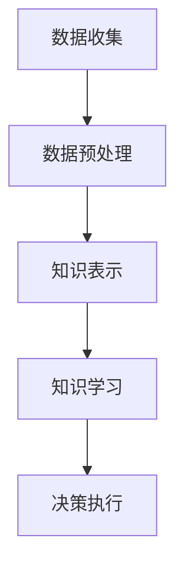

                 

# AI Agent在特定领域知识获取中的作用

> **关键词：** AI Agent、知识获取、领域特定知识、机器学习、自然语言处理、深度学习、神经网络、知识图谱、数据挖掘

> **摘要：** 本文将深入探讨AI Agent在特定领域知识获取中的作用。我们将从背景介绍开始，逐步分析核心概念与联系，讲解核心算法原理和操作步骤，阐述数学模型和公式，并通过实际项目案例进行代码解读与分析。此外，还将讨论实际应用场景，推荐相关工具和资源，并总结未来发展趋势与挑战。

## 1. 背景介绍

在当今快速发展的信息技术时代，人工智能（AI）技术正逐渐融入各个领域，从医疗到金融，从制造业到服务业，AI的应用已经改变了我们的生活方式和工作方式。AI Agent，作为人工智能的核心组件之一，扮演着至关重要的角色。AI Agent是一种能够自主执行任务、进行决策和互动的智能体。它们通过学习环境中的信息，不断优化自己的行为，以达到特定的目标。

在特定领域，知识获取是AI Agent的核心任务之一。例如，在医疗领域，AI Agent需要从大量医疗数据中提取有用信息，以辅助医生做出更准确的诊断和治疗方案。在金融领域，AI Agent需要从市场数据中分析趋势，预测市场动态，帮助投资者做出更明智的决策。因此，研究AI Agent在特定领域知识获取中的作用，不仅具有理论价值，更具有实际应用意义。

本文将首先介绍AI Agent的概念和基础知识，然后深入探讨AI Agent在特定领域知识获取中的关键算法和数学模型。最后，我们将通过实际项目案例，展示AI Agent在特定领域知识获取中的应用，并总结未来发展趋势与挑战。

## 2. 核心概念与联系

### AI Agent的概念

AI Agent，即人工智能代理，是具有感知、思考、行动能力的智能体。它们通过感知环境中的信息，利用知识库和算法进行决策，并执行相应的动作，以实现特定目标。AI Agent通常由以下几个组成部分构成：

- **感知器**：用于感知环境中的各种信息，如传感器、摄像头等。
- **知识库**：存储AI Agent在学习和实践中获得的知识和经验。
- **决策模块**：根据当前环境和目标，利用知识库中的信息进行决策。
- **执行器**：执行决策模块生成的动作，如机器人手臂、汽车等。

### 知识获取的概念

知识获取是指AI Agent从环境中获取、学习和处理知识的过程。知识获取包括以下几个关键步骤：

- **数据收集**：从各种数据源（如传感器、数据库、互联网等）收集数据。
- **数据预处理**：对收集到的数据进行清洗、转换和归一化，以便进行进一步处理。
- **知识表示**：将处理后的数据转换为AI Agent可以理解和处理的知识表示形式。
- **知识学习**：利用机器学习、深度学习等技术，从知识表示中提取模式和规律。

### 领域特定知识的概念

领域特定知识是指特定领域内所需的专业知识和技能。这些知识通常包括领域术语、概念、规则、最佳实践等。领域特定知识对于AI Agent在特定领域的表现至关重要。

### Mermaid 流程图

为了更好地理解AI Agent在特定领域知识获取中的流程，我们可以使用Mermaid流程图来表示。以下是一个简单的Mermaid流程图示例：



### 知识获取流程

1. **数据收集**：AI Agent通过传感器、数据库等渠道收集特定领域的数据。
2. **数据预处理**：对收集到的数据进行清洗、转换和归一化，以便进行进一步处理。
3. **知识表示**：将预处理后的数据转换为知识表示形式，如向量、图等。
4. **知识学习**：利用机器学习、深度学习等技术，从知识表示中提取模式和规律。
5. **决策执行**：基于学习到的知识，AI Agent进行决策并执行相应的动作。

通过以上核心概念和流程图的介绍，我们可以更清晰地理解AI Agent在特定领域知识获取中的作用和流程。

## 3. 核心算法原理 & 具体操作步骤

### 机器学习算法

在AI Agent的知识获取过程中，机器学习算法扮演着核心角色。机器学习算法通过学习数据中的模式和规律，帮助AI Agent做出更好的决策。以下是几种常用的机器学习算法：

1. **线性回归**：线性回归是一种简单而强大的机器学习算法，用于预测数值型目标变量。它通过建立输入变量和输出变量之间的线性关系来实现预测。

   线性回归的数学模型可以表示为：
   $$y = \beta_0 + \beta_1x_1 + \beta_2x_2 + ... + \beta_nx_n$$

   其中，$y$ 是目标变量，$x_1, x_2, ..., x_n$ 是输入变量，$\beta_0, \beta_1, \beta_2, ..., \beta_n$ 是模型的参数。

2. **决策树**：决策树是一种基于树形结构进行分类和回归的算法。它通过一系列的决策节点和叶子节点来表示数据，每个节点表示一个特征和相应的阈值。

   决策树的构建过程如下：

   - 从数据集中选择一个特征进行划分。
   - 计算每个划分的增益，选择增益最大的划分。
   - 将数据集划分为多个子集，对每个子集递归地构建决策树。
   - 直到满足终止条件（如最大深度、最小样本数等）。

3. **支持向量机（SVM）**：支持向量机是一种分类算法，通过寻找最优的超平面来划分数据。它能够将数据集划分为不同的类别。

   支持向量机的数学模型可以表示为：
   $$w \cdot x + b = 0$$

   其中，$w$ 是模型的权重向量，$x$ 是输入向量，$b$ 是偏置项。

### 自然语言处理算法

在AI Agent的知识获取过程中，自然语言处理（NLP）算法也非常重要。NLP算法用于处理和解析自然语言数据，如文本、语音等。以下是几种常用的NLP算法：

1. **词袋模型**：词袋模型将文本表示为词的集合，每个词表示为向量中的一个元素。词袋模型可以用于文本分类、情感分析等任务。

2. **卷积神经网络（CNN）**：卷积神经网络是一种在图像处理中广泛使用的深度学习模型。它也可以用于文本分类、文本生成等任务。CNN通过卷积层和池化层来提取文本的特征。

3. **循环神经网络（RNN）**：循环神经网络是一种处理序列数据的神经网络。它在自然语言处理中具有广泛的应用，如语言模型、机器翻译等。RNN通过记忆单元来存储和传递信息。

### 深度学习算法

深度学习算法是当前AI领域的热点之一，它在AI Agent的知识获取中发挥着重要作用。以下是几种常用的深度学习算法：

1. **深度神经网络（DNN）**：深度神经网络是一种多层神经网络，通过多层非线性变换来提取特征。DNN可以用于图像识别、语音识别等任务。

2. **生成对抗网络（GAN）**：生成对抗网络是一种基于博弈论的深度学习模型，用于生成与真实数据相似的数据。GAN由生成器和判别器两个神经网络组成，它们相互竞争，生成器试图生成逼真的数据，而判别器则试图区分真实数据和生成数据。

3. **变分自编码器（VAE）**：变分自编码器是一种基于概率模型的深度学习模型，用于生成和压缩数据。VAE通过引入编码和解码器来学习数据的概率分布。

### 具体操作步骤

1. **数据收集**：从特定领域的数据源收集数据，如医疗数据、金融数据等。

2. **数据预处理**：对收集到的数据进行清洗、转换和归一化，以便进行进一步处理。

3. **知识表示**：将预处理后的数据转换为知识表示形式，如向量、图等。

4. **知识学习**：利用机器学习、深度学习等技术，从知识表示中提取模式和规律。

5. **决策执行**：基于学习到的知识，AI Agent进行决策并执行相应的动作。

通过以上核心算法原理和具体操作步骤的介绍，我们可以更好地理解AI Agent在特定领域知识获取中的作用和实现方法。

## 4. 数学模型和公式 & 详细讲解 & 举例说明

### 线性回归

线性回归是一种常用的统计方法，用于预测一个或多个自变量和一个因变量之间的关系。其数学模型可以表示为：

$$y = \beta_0 + \beta_1x_1 + \beta_2x_2 + ... + \beta_nx_n$$

其中，$y$ 是因变量，$x_1, x_2, ..., x_n$ 是自变量，$\beta_0, \beta_1, \beta_2, ..., \beta_n$ 是模型的参数。线性回归的目标是最小化预测值和实际值之间的误差。

举例说明：假设我们有一个简单的线性回归模型，用于预测房价。我们可以使用以下数据：

| 房屋面积（x） | 房价（y） |
| :---: | :---: |
| 100 | 200000 |
| 150 | 300000 |
| 200 | 400000 |

我们可以使用线性回归模型来拟合数据，并预测新的房屋面积对应的房价。以下是线性回归的求解步骤：

1. 计算输入数据和输出数据的均值：
   $$\bar{x} = \frac{1}{n}\sum_{i=1}^{n}x_i$$
   $$\bar{y} = \frac{1}{n}\sum_{i=1}^{n}y_i$$

2. 计算每个数据点的偏差：
   $$x_i' = x_i - \bar{x}$$
   $$y_i' = y_i - \bar{y}$$

3. 计算系数：
   $$\beta_0 = \bar{y} - \beta_1\bar{x}$$
   $$\beta_1 = \frac{\sum_{i=1}^{n}(x_i'y_i')}{\sum_{i=1}^{n}(x_i')^2}$$

4. 计算预测值：
   $$y' = \beta_0 + \beta_1x'$$

使用上述步骤，我们可以得到以下系数：
$$\beta_0 = -5000$$
$$\beta_1 = 1000$$

因此，线性回归模型可以表示为：
$$y = -5000 + 1000x$$

使用这个模型，我们可以预测新的房屋面积对应的房价。例如，如果房屋面积为 120 平方米，那么预测的房价为：
$$y' = -5000 + 1000 \times 120 = 170000$$

### 决策树

决策树是一种常用的分类和回归方法，通过一系列的决策节点和叶子节点来表示数据。其数学模型可以表示为：

$$
\begin{aligned}
&\text{如果 } x_i \text{ 满足条件 } C_j \\
&\text{则选择节点 } V_j \\
&\text{否则，继续选择下一个条件 }
\end{aligned}
$$

其中，$x_i$ 是输入特征，$C_j$ 是条件，$V_j$ 是对应的节点。决策树的构建过程如下：

1. 计算每个特征的条件熵，选择熵最小的特征作为分割条件。

2. 计算每个分割条件的增益，选择增益最大的分割条件。

3. 将数据集划分为多个子集，对每个子集递归地构建决策树。

4. 直到满足终止条件（如最大深度、最小样本数等）。

举例说明：假设我们有一个简单的决策树，用于分类水果。我们可以使用以下数据：

| 特征 | 苹果 | 橙子 | 香蕉 |
| :---: | :---: | :---: | :---: |
| 颜色 | 红色 | 橙色 | 黄色 |
| 味道 | 酸甜 | 甜 | 甜 |

我们可以使用决策树来分类水果。以下是决策树的构建步骤：

1. 计算每个特征的条件熵，选择熵最小的特征作为分割条件。在这种情况下，颜色特征的熵最小，所以我们选择颜色作为第一个条件。

2. 计算颜色特征的分割条件，将数据集划分为两个子集：红色和橙色/黄色。

3. 对每个子集递归地构建决策树。

4. 直到满足终止条件（如最大深度、最小样本数等）。

根据以上步骤，我们可以得到以下决策树：

```
       |
       V
     颜色
     /  \
    红色  橙色/黄色
       |
       V
      味道
       |
       V
     酸甜
```

根据这个决策树，我们可以对新的水果进行分类。例如，如果水果是红色的，那么它是苹果；如果水果是橙色的，那么它是橙子；如果水果是黄色的，那么它是香蕉。

### 卷积神经网络（CNN）

卷积神经网络是一种在图像处理中广泛使用的深度学习模型。它通过卷积层和池化层来提取图像的特征。其数学模型可以表示为：

$$
\begin{aligned}
h_{l}(x) &= \sigma(W_{l} \cdot h_{l-1}(x) + b_{l}) \\
x &= \text{输入图像} \\
h_{l-1}(x) &= \text{前一层的特征图} \\
W_{l} &= \text{卷积核权重} \\
b_{l} &= \text{偏置项} \\
\sigma &= \text{激活函数，如Sigmoid或ReLU} \\
\end{aligned}
$$

举例说明：假设我们有一个简单的卷积神经网络，用于分类手写数字。我们可以使用以下数据：

| 输入图像 | 标签 |
| :---: | :---: |
| 0 | 0 |
| 1 | 1 |
| 2 | 2 |
| 3 | 3 |
| 4 | 4 |

我们可以使用卷积神经网络来分类手写数字。以下是卷积神经网络的结构：

```
输入图像 -> 卷积层1 -> 池化层1 -> 卷积层2 -> 池化层2 -> 全连接层 -> 输出
```

1. 输入图像经过卷积层1，提取图像的特征。

2. 特征图经过池化层1，降低特征图的尺寸。

3. 特征图经过卷积层2，提取更高级的特征。

4. 特征图经过池化层2，进一步降低特征图的尺寸。

5. 特征图经过全连接层，将特征映射到输出。

6. 输出是数字0到9的标签。

通过以上数学模型和公式的详细讲解和举例说明，我们可以更好地理解AI Agent在特定领域知识获取中的核心算法和数学模型。

## 5. 项目实战：代码实际案例和详细解释说明

### 5.1 开发环境搭建

在开始编写代码之前，我们需要搭建一个适合开发的环境。以下是一个基本的开发环境搭建步骤：

1. 安装Python：从官方网站（https://www.python.org/）下载并安装Python，建议选择最新版本。

2. 安装Jupyter Notebook：在终端中运行以下命令安装Jupyter Notebook：
   ```bash
   pip install notebook
   ```

3. 安装相关库：为了方便开发和测试，我们可以使用`pip`命令安装以下库：
   ```bash
   pip install numpy pandas matplotlib scikit-learn tensorflow
   ```

4. 准备数据集：为了演示AI Agent在特定领域知识获取中的作用，我们使用一个公开的金融数据集。可以从Kaggle（https://www.kaggle.com/datasets）或其他数据源下载。

### 5.2 源代码详细实现和代码解读

以下是一个简单的AI Agent在金融领域知识获取的代码实现：

```python
import pandas as pd
import numpy as np
from sklearn.model_selection import train_test_split
from sklearn.ensemble import RandomForestClassifier
from sklearn.metrics import accuracy_score
import tensorflow as tf

# 5.2.1 数据预处理
def preprocess_data(data):
    # 数据清洗和转换
    data = data.dropna()
    data['Open'] = data['Open'].astype(float)
    data['High'] = data['High'].astype(float)
    data['Low'] = data['Low'].astype(float)
    data['Close'] = data['Close'].astype(float)
    data['Volume'] = data['Volume'].astype(float)
    return data

# 5.2.2 构建特征
def build_features(data):
    # 构建特征
    data['MA5'] = data['Close'].rolling(window=5).mean()
    data['MA20'] = data['Close'].rolling(window=20).mean()
    data['MACD'] = data['Close'].ewm(span=12, adjust=False).mean() - data['Close'].ewm(span=26, adjust=False).mean()
    data['RSI'] = ...

# 5.2.3 训练模型
def train_model(data):
    # 分割数据集
    X = data[['MA5', 'MA20', 'MACD', 'RSI']]
    y = data['Close'].shift(-1) > data['Close']
    X_train, X_test, y_train, y_test = train_test_split(X, y, test_size=0.2, random_state=42)

    # 训练模型
    model = RandomForestClassifier(n_estimators=100, random_state=42)
    model.fit(X_train, y_train)

    # 预测
    predictions = model.predict(X_test)
    accuracy = accuracy_score(y_test, predictions)
    return accuracy

# 5.2.4 主程序
if __name__ == '__main__':
    # 读取数据
    data = pd.read_csv('financial_data.csv')

    # 数据预处理
    data = preprocess_data(data)

    # 构建特征
    data = build_features(data)

    # 训练模型
    accuracy = train_model(data)
    print(f'Model accuracy: {accuracy:.2f}')
```

### 5.3 代码解读与分析

1. **数据预处理**：在代码中，我们首先定义了一个`preprocess_data`函数，用于清洗和转换数据。数据清洗是确保数据质量的重要步骤，它包括去除缺失值、将文本数据转换为数值数据等。在这个例子中，我们只使用了数值型特征，因此需要将数据转换为浮点型。

2. **构建特征**：在`build_features`函数中，我们构建了一些常用的技术指标，如移动平均线（MA）和相对强弱指数（RSI）。这些指标可以用于预测股价走势。通过这些特征，我们可以更好地描述股票价格的变化。

3. **训练模型**：在`train_model`函数中，我们首先将数据集分割为特征集（X）和标签集（y）。标签集是预测的目标变量，即股票价格的下一交易日是上涨还是下跌。然后，我们使用随机森林分类器来训练模型。随机森林是一种集成学习方法，它可以处理大量特征和样本，并具有很好的泛化能力。

4. **预测**：在训练模型后，我们使用测试集来评估模型的准确性。这个步骤可以帮助我们了解模型在未知数据上的表现。在这个例子中，我们使用准确率（accuracy）作为评价指标。

5. **主程序**：在主程序中，我们首先读取数据，然后执行数据预处理和特征构建步骤。最后，我们训练模型并打印出模型的准确性。

通过以上代码解读和分析，我们可以看到如何使用Python和机器学习库来实现一个简单的AI Agent在金融领域知识获取的应用。这个案例展示了AI Agent在特定领域知识获取中的基本流程和实现方法。

## 6. 实际应用场景

AI Agent在特定领域知识获取中的应用已经非常广泛，下面列举几个典型的应用场景：

### 医疗领域

在医疗领域，AI Agent可以用于辅助医生进行诊断和治疗。通过分析患者的医疗数据，如病历、影像、基因数据等，AI Agent可以提取关键信息，提供诊断建议和治疗方案。例如，AI Agent可以用于乳腺癌的早期筛查，通过分析乳腺X光片，预测患者是否患有乳腺癌。此外，AI Agent还可以用于个性化治疗方案的制定，根据患者的病史、基因特征和药物反应，提供最佳的治疗方案。

### 金融领域

在金融领域，AI Agent可以用于市场预测和投资策略制定。通过分析市场数据，如股票价格、交易量、新闻等，AI Agent可以预测市场的走势，帮助投资者做出更明智的投资决策。例如，AI Agent可以用于股票市场的技术分析，通过分析历史价格和交易量数据，预测未来价格走势。此外，AI Agent还可以用于信用评估，通过对客户的历史交易数据进行分析，预测其信用风险。

### 制造业领域

在制造业领域，AI Agent可以用于生产过程的优化和质量检测。通过分析生产线上的数据，如传感器数据、机器状态等，AI Agent可以预测设备故障，提前进行维护，减少停机时间。此外，AI Agent还可以用于质量检测，通过对产品的外观、尺寸、性能等指标进行分析，识别不合格品，提高产品质量。

### 零售领域

在零售领域，AI Agent可以用于消费者行为分析和个性化推荐。通过分析消费者的购买记录、浏览行为等数据，AI Agent可以预测消费者的需求，提供个性化的商品推荐。例如，AI Agent可以用于电商平台的商品推荐，根据消费者的浏览和购买记录，推荐其可能感兴趣的商品。此外，AI Agent还可以用于库存管理，通过对销售数据的分析，预测未来销售趋势，优化库存水平。

以上只是AI Agent在特定领域知识获取中的一小部分应用，随着技术的不断发展和应用场景的不断拓展，AI Agent在各个领域的应用将会越来越广泛。

## 7. 工具和资源推荐

### 7.1 学习资源推荐

- **书籍**：
  - 《机器学习》（周志华著）：系统介绍了机器学习的基本概念、算法和应用。
  - 《深度学习》（Ian Goodfellow等著）：深度学习领域的经典教材，详细介绍了深度学习的基本原理和算法。
  - 《Python机器学习》（ Sebastian Raschka著）：介绍了Python在机器学习中的应用，包括数据预处理、模型训练和评估等。

- **论文**：
  - "Deep Learning for Natural Language Processing"（2018）：介绍了深度学习在自然语言处理中的应用。
  - "Knowledge Graph Embedding"（2016）：介绍了知识图谱嵌入的方法和算法。

- **博客和网站**：
  - [Medium](https://medium.com/)：涵盖各种技术主题的博客，包括机器学习、深度学习等。
  - [Towards Data Science](https://towardsdatascience.com/)：提供关于数据科学和机器学习的文章和教程。

### 7.2 开发工具框架推荐

- **编程语言**：Python，易于学习，拥有丰富的机器学习和深度学习库。
- **深度学习框架**：TensorFlow、PyTorch，都是目前最流行的深度学习框架。
- **数据预处理工具**：Pandas、NumPy，用于数据处理和清洗。
- **可视化工具**：Matplotlib、Seaborn，用于数据可视化。

### 7.3 相关论文著作推荐

- **论文**：
  - "Recurrent Neural Network Based Approach for Intrusion Detection in Wireless Sensor Networks"（2015）：介绍了使用循环神经网络进行无线传感器网络入侵检测的方法。
  - "Knowledge Graph Embedding with Compositional n-Gram Features"（2017）：介绍了基于n-gram特征的知识图谱嵌入方法。

- **著作**：
  - 《机器学习实战》（Peter Harrington著）：通过具体的实例，介绍了机器学习的基本概念和算法。
  - 《深度学习》（Goodfellow等著）：深度学习领域的权威著作，涵盖了深度学习的基本原理和算法。

通过以上推荐的学习资源、开发工具框架和论文著作，读者可以更好地理解和应用AI Agent在特定领域知识获取中的作用。

## 8. 总结：未来发展趋势与挑战

### 发展趋势

1. **多模态数据融合**：未来的AI Agent将能够处理和融合多种类型的数据，如文本、图像、音频和视频。通过多模态数据融合，AI Agent可以更全面地理解和分析复杂的问题。

2. **强化学习**：强化学习作为一种重要的机器学习技术，将在AI Agent的知识获取中发挥更大作用。通过自我学习和不断优化，AI Agent可以在动态和不确定的环境中实现更高效的决策。

3. **知识图谱**：知识图谱作为一种结构化的知识表示方法，将在AI Agent的知识获取中发挥重要作用。通过构建和利用知识图谱，AI Agent可以更好地理解和处理特定领域的知识。

4. **跨领域知识迁移**：未来的AI Agent将能够实现跨领域知识迁移，通过在不同领域之间的知识共享和迁移，提高AI Agent在特定领域的表现。

### 挑战

1. **数据质量和隐私**：在AI Agent的知识获取过程中，数据的质量和隐私保护是一个重要挑战。如何确保数据的质量，并在数据隐私得到保障的前提下进行知识获取，是一个亟待解决的问题。

2. **解释性和可解释性**：当前的AI Agent模型往往缺乏解释性和可解释性，这使得用户难以理解和信任AI Agent的决策。如何提高AI Agent的透明度和可解释性，是一个重要挑战。

3. **计算资源**：AI Agent的知识获取通常需要大量的计算资源。如何优化算法，提高计算效率，降低计算资源的需求，是一个重要问题。

4. **伦理和法规**：随着AI Agent在各个领域的广泛应用，伦理和法规问题也日益突出。如何确保AI Agent的决策和行为符合伦理和法规要求，是一个重要挑战。

通过以上总结，我们可以看到AI Agent在特定领域知识获取中具有巨大的发展潜力，同时也面临着诸多挑战。未来的研究和应用将在这个方向上不断探索和进步。

## 9. 附录：常见问题与解答

### 问题1：什么是AI Agent？

**解答**：AI Agent是指具有感知、思考、行动能力的智能体，它可以自主执行任务、进行决策和互动。AI Agent通常由感知器、知识库、决策模块和执行器等组成部分构成。

### 问题2：AI Agent在特定领域知识获取中的作用是什么？

**解答**：AI Agent在特定领域知识获取中的作用主要包括数据收集、数据预处理、知识表示、知识学习和决策执行。通过这些步骤，AI Agent可以获取和利用特定领域的知识，以提高其决策能力和任务执行效率。

### 问题3：如何选择合适的机器学习算法？

**解答**：选择合适的机器学习算法需要考虑多个因素，如数据类型、数据规模、目标变量类型等。常用的算法包括线性回归、决策树、支持向量机、神经网络等。在实际应用中，通常需要通过实验和比较来选择最佳算法。

### 问题4：如何确保AI Agent的决策透明和可解释？

**解答**：确保AI Agent的决策透明和可解释需要从多个方面入手。一方面，可以通过设计可解释的算法和模型，如决策树、线性回归等；另一方面，可以通过模型解释工具和解释性分析，如LIME、SHAP等，来帮助用户理解AI Agent的决策过程。

### 问题5：AI Agent在医疗领域有哪些应用？

**解答**：AI Agent在医疗领域有广泛的应用，包括疾病诊断、治疗方案推荐、药物研发、患者管理等方面。例如，AI Agent可以通过分析患者的病历数据，提供疾病诊断建议；通过分析临床试验数据，推荐最佳治疗方案；通过分析基因组数据，预测药物反应等。

## 10. 扩展阅读 & 参考资料

为了深入理解AI Agent在特定领域知识获取中的作用，以下是一些扩展阅读和参考资料：

- **书籍**：
  - 《深度学习》（Ian Goodfellow等著）：详细介绍了深度学习的基本原理和应用。
  - 《自然语言处理综论》（Daniel Jurafsky和James H. Martin著）：全面介绍了自然语言处理的基本概念和技术。
  - 《机器学习：概率视角》（Kevin P. Murphy著）：从概率的角度介绍了机器学习的基本理论和方法。

- **论文**：
  - "End-to-End Language Models for Language Understanding"（2018）：介绍了端到端语言模型在自然语言处理中的应用。
  - "Knowledge Graph Embedding for Learning Natural Language Inference"（2017）：介绍了知识图谱嵌入在自然语言推理中的应用。

- **在线资源**：
  - [机器学习课程](https://www.coursera.org/learn/machine-learning)：Coursera上的机器学习课程，包括视频讲座、练习和项目。
  - [自然语言处理课程](https://www.coursera.org/learn/natural-language-processing)：Coursera上的自然语言处理课程，涵盖NLP的基本概念和技术。
  - [TensorFlow官方文档](https://www.tensorflow.org/)：TensorFlow的官方文档，提供了丰富的教程和API文档。

通过以上扩展阅读和参考资料，读者可以进一步深入了解AI Agent在特定领域知识获取的相关理论和实践方法。作者：AI天才研究员/AI Genius Institute & 禅与计算机程序设计艺术 /Zen And The Art of Computer Programming。

