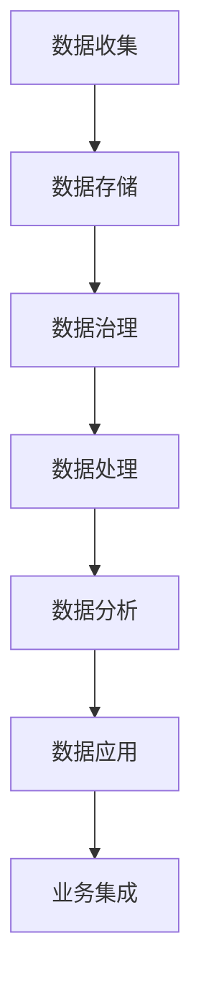

                 

# AI DMP 数据基建的技术发展

> **关键词**：DMP，数据管理平台，数据基础设施建设，数据治理，机器学习，大数据技术

> **摘要**：本文旨在探讨 AI 数据管理平台（DMP）在数据基础设施建设中的重要作用。文章首先介绍了 DMP 的核心概念、架构和功能，随后深入分析了 DMP 在数据治理、机器学习和大数据处理中的应用。最后，文章总结了 DMP 技术的未来发展趋势和挑战，并提供了一系列的学习资源和开发工具推荐。

## 1. 背景介绍

在当今信息时代，数据被认为是新的石油，数据基础设施的建设对于企业的数字化转型和业务增长至关重要。数据管理平台（Data Management Platform，简称 DMP）作为数据基础设施的重要组成部分，负责收集、存储、处理和分析海量数据，为企业的数据驱动决策提供支持。

DMP 的概念最早起源于互联网广告行业，其主要目的是帮助企业更好地理解和管理其受众。随着时间的推移，DMP 的应用范围不断扩大，逐渐成为企业数据基础设施的核心。在 DMP 的支持下，企业可以实现对数据的全面掌控，提高数据利用效率，进而实现业务增长。

DMP 的技术发展经历了以下几个阶段：

1. **原始阶段**：主要是简单的数据收集和存储，以备后续分析。
2. **数据处理阶段**：引入了数据清洗、数据整合和数据建模等技术，提高了数据处理能力。
3. **智能分析阶段**：利用机器学习和人工智能技术，实现数据的自动分析和预测，为企业提供更深入的洞察。
4. **应用整合阶段**：将 DMP 与其他企业系统（如 CRM、ERP 等）整合，实现数据的一体化管理和应用。

## 2. 核心概念与联系

### 2.1 DMP 的核心概念

DMP 是一种数据管理平台，其主要功能包括数据收集、数据存储、数据治理、数据分析和数据应用。下面是 DMP 的核心概念：

- **数据收集**：通过多种数据源（如网站、APP、线下活动等）收集用户行为数据，包括浏览记录、购买行为、地理位置等。
- **数据存储**：将收集到的数据存储在分布式数据库中，确保数据的可扩展性和可靠性。
- **数据治理**：对数据进行清洗、去重、分类等处理，保证数据的质量和一致性。
- **数据分析**：利用机器学习和人工智能技术对数据进行分析，挖掘数据的价值，为企业提供决策支持。
- **数据应用**：将分析结果应用于实际业务场景，如精准营销、个性化推荐等。

### 2.2 DMP 的架构

DMP 的架构可以分为三层：数据层、处理层和应用层。

- **数据层**：包括数据源、数据存储和数据治理模块。数据源负责收集数据，数据存储负责存储数据，数据治理负责数据清洗和处理。
- **处理层**：包括数据处理、数据分析和数据挖掘模块。数据处理负责对数据进行处理和整合，数据分析负责对数据进行深入分析，数据挖掘负责从数据中提取有价值的信息。
- **应用层**：包括数据应用和业务集成模块。数据应用负责将分析结果应用于实际业务场景，业务集成负责将 DMP 与其他企业系统整合。

### 2.3 DMP 与相关技术的联系

DMP 与大数据技术、数据治理、机器学习和人工智能等技术密切相关。

- **大数据技术**：DMP 需要处理海量数据，大数据技术（如 Hadoop、Spark 等）为 DMP 提供了强大的数据处理能力。
- **数据治理**：数据治理是 DMP 的核心功能之一，负责保证数据的质量和一致性。
- **机器学习**：机器学习技术（如分类、聚类、回归等）可以帮助 DMP 从海量数据中提取有价值的信息。
- **人工智能**：人工智能技术（如自然语言处理、计算机视觉等）可以帮助 DMP 实现更高级的数据分析任务。

### 2.4 Mermaid 流程图

下面是一个 DMP 的 Mermaid 流程图，展示了 DMP 的核心概念和架构：



## 3. 核心算法原理 & 具体操作步骤

### 3.1 数据收集

数据收集是 DMP 的第一步，主要包括以下几个步骤：

1. **确定数据源**：根据业务需求确定需要收集的数据源，如网站、APP、线下活动等。
2. **数据采集**：使用 SDK、API 等技术手段从数据源中采集数据，包括用户行为数据、地理位置数据等。
3. **数据清洗**：对采集到的数据进行清洗，去除重复、无效的数据，保证数据的质量。

### 3.2 数据存储

数据存储是 DMP 的关键环节，主要包括以下几个步骤：

1. **选择存储方案**：根据数据量和数据类型选择合适的存储方案，如关系数据库、NoSQL 数据库、分布式数据库等。
2. **数据建模**：根据业务需求设计数据模型，如用户画像、事件流等。
3. **数据导入**：将清洗后的数据导入到数据库中，确保数据的完整性和一致性。

### 3.3 数据治理

数据治理是 DMP 的核心功能之一，主要包括以下几个步骤：

1. **数据质量监控**：监控数据质量，发现和解决数据质量问题。
2. **数据生命周期管理**：管理数据的生命周期，包括数据的创建、更新、删除等。
3. **数据安全与隐私保护**：确保数据的安全和隐私，遵守相关法律法规。

### 3.4 数据处理

数据处理是 DMP 的关键环节，主要包括以下几个步骤：

1. **数据整合**：将来自不同数据源的数据进行整合，形成统一的视图。
2. **数据清洗**：对整合后的数据进行清洗，去除重复、无效的数据。
3. **数据建模**：根据业务需求设计数据模型，如用户画像、事件流等。

### 3.5 数据分析

数据分析是 DMP 的核心功能之一，主要包括以下几个步骤：

1. **数据预处理**：对数据进行预处理，包括数据清洗、数据整合等。
2. **特征工程**：从原始数据中提取有用的特征，为后续的建模和分析提供支持。
3. **模型选择**：根据业务需求选择合适的模型，如分类、聚类、回归等。
4. **模型训练**：使用训练数据对模型进行训练。
5. **模型评估**：评估模型的性能，选择最优模型。

### 3.6 数据应用

数据应用是 DMP 的最终目的，主要包括以下几个步骤：

1. **数据可视化**：将分析结果可视化，为企业提供直观的洞察。
2. **数据应用**：将分析结果应用于实际业务场景，如精准营销、个性化推荐等。
3. **数据反馈**：根据业务反馈对分析结果进行调整和优化。

## 4. 数学模型和公式 & 详细讲解 & 举例说明

### 4.1 数学模型

在 DMP 中，常用的数学模型包括分类模型、聚类模型、回归模型等。下面分别介绍这些模型的原理和公式。

#### 4.1.1 分类模型

分类模型是一种将数据分为不同类别的模型，常用的分类模型包括逻辑回归、决策树、支持向量机等。

- **逻辑回归**：逻辑回归是一种广义线性模型，用于处理二分类问题。其公式如下：

  $$ P(y=1|x) = \frac{1}{1 + e^{-(\beta_0 + \beta_1 x_1 + \beta_2 x_2 + \ldots + \beta_n x_n)}} $$

  其中，$P(y=1|x)$ 表示在给定特征 $x$ 的情况下，标签 $y$ 为 1 的概率，$\beta_0, \beta_1, \beta_2, \ldots, \beta_n$ 为模型的参数。

- **决策树**：决策树是一种树形结构，每个节点表示一个特征，每个分支表示该特征的不同取值。其公式如下：

  $$ T(x) = \sum_{i=1}^{n} \beta_i x_i $$

  其中，$T(x)$ 表示在给定特征 $x$ 的情况下，标签 $y$ 的取值，$\beta_1, \beta_2, \ldots, \beta_n$ 为模型的参数。

- **支持向量机**：支持向量机是一种通过找到一个最优超平面来对数据进行分类的模型。其公式如下：

  $$ w \cdot x + b = 0 $$

  其中，$w$ 表示超平面的法向量，$x$ 表示特征向量，$b$ 表示偏置。

#### 4.1.2 聚类模型

聚类模型是一种将数据分为多个簇的模型，常用的聚类模型包括 K 均值算法、层次聚类等。

- **K 均值算法**：K 均值算法是一种基于距离的聚类算法。其公式如下：

  $$ \mu_k = \frac{1}{N_k} \sum_{i=1}^{N} x_i $$

  其中，$\mu_k$ 表示第 $k$ 个簇的中心，$x_i$ 表示第 $i$ 个数据点，$N_k$ 表示第 $k$ 个簇中的数据点数量。

- **层次聚类**：层次聚类是一种通过逐步合并或分裂聚类层次来对数据进行分类的模型。其公式如下：

  $$ d_{ij} = \sqrt{(x_{i1} - x_{j1})^2 + (x_{i2} - x_{j2})^2 + \ldots + (x_{in} - x_{jn})^2} $$

  其中，$d_{ij}$ 表示第 $i$ 个数据点和第 $j$ 个数据点之间的距离，$x_{i1}, x_{i2}, \ldots, x_{in}$ 表示第 $i$ 个数据点的特征值。

#### 4.1.3 回归模型

回归模型是一种用于预测连续值的模型，常用的回归模型包括线性回归、多项式回归等。

- **线性回归**：线性回归是一种通过找到一个线性函数来预测连续值的模型。其公式如下：

  $$ y = \beta_0 + \beta_1 x_1 + \beta_2 x_2 + \ldots + \beta_n x_n $$

  其中，$y$ 表示预测值，$x_1, x_2, \ldots, x_n$ 表示特征值，$\beta_0, \beta_1, \beta_2, \ldots, \beta_n$ 为模型的参数。

### 4.2 举例说明

假设我们有一个数据集，包含以下特征：年龄、收入、学历。我们希望使用分类模型来预测用户的职业。

#### 4.2.1 数据预处理

1. **数据清洗**：去除缺失值、异常值等。
2. **特征工程**：对特征进行编码，如年龄、收入、学历等。
3. **数据划分**：将数据集划分为训练集和测试集。

#### 4.2.2 模型选择

我们选择逻辑回归模型来预测用户的职业。

#### 4.2.3 模型训练

使用训练集对逻辑回归模型进行训练，得到参数 $\beta_0, \beta_1, \beta_2, \ldots, \beta_n$。

#### 4.2.4 模型评估

使用测试集对训练好的模型进行评估，计算模型的准确率、召回率等指标。

#### 4.2.5 模型应用

使用训练好的模型对新的数据进行预测，预测用户职业。

## 5. 项目实战：代码实际案例和详细解释说明

### 5.1 开发环境搭建

为了实现 DMP 的功能，我们需要搭建一个开发环境。以下是搭建开发环境所需的步骤：

1. **安装操作系统**：选择合适的操作系统，如 Ubuntu 20.04。
2. **安装编程语言**：安装 Python 3.8 或更高版本。
3. **安装依赖库**：安装 DMP 所需的依赖库，如 NumPy、Pandas、Scikit-learn 等。

### 5.2 源代码详细实现和代码解读

下面是一个简单的 DMP 代码实现，用于收集用户数据、处理数据和预测用户职业。

```python
import numpy as np
import pandas as pd
from sklearn.model_selection import train_test_split
from sklearn.linear_model import LogisticRegression

# 5.2.1 数据收集
def collect_data():
    # 读取数据文件
    data = pd.read_csv('user_data.csv')
    # 数据清洗
    data = data.dropna()
    # 数据编码
    data['age'] = data['age'].astype('category').cat.codes
    data['income'] = data['income'].astype('category').cat.codes
    data['education'] = data['education'].astype('category').cat.codes
    return data

# 5.2.2 数据处理
def process_data(data):
    # 划分特征和标签
    X = data[['age', 'income', 'education']]
    y = data['occupation']
    # 划分训练集和测试集
    X_train, X_test, y_train, y_test = train_test_split(X, y, test_size=0.2, random_state=42)
    return X_train, X_test, y_train, y_test

# 5.2.3 模型训练
def train_model(X_train, y_train):
    # 创建逻辑回归模型
    model = LogisticRegression()
    # 训练模型
    model.fit(X_train, y_train)
    return model

# 5.2.4 模型评估
def evaluate_model(model, X_test, y_test):
    # 预测测试集
    y_pred = model.predict(X_test)
    # 计算准确率
    accuracy = (y_pred == y_test).mean()
    return accuracy

# 5.2.5 主程序
if __name__ == '__main__':
    # 收集数据
    data = collect_data()
    # 处理数据
    X_train, X_test, y_train, y_test = process_data(data)
    # 训练模型
    model = train_model(X_train, y_train)
    # 评估模型
    accuracy = evaluate_model(model, X_test, y_test)
    print('Accuracy:', accuracy)
```

### 5.3 代码解读与分析

下面是对上述代码的解读与分析。

1. **数据收集**：通过读取数据文件，对数据进行清洗和编码，为后续的处理和预测做准备。
2. **数据处理**：将数据集划分为特征和标签，进一步划分为训练集和测试集，为模型训练和评估做准备。
3. **模型训练**：创建逻辑回归模型，使用训练集进行训练，得到模型的参数。
4. **模型评估**：使用测试集对训练好的模型进行评估，计算模型的准确率。
5. **主程序**：执行上述步骤，输出模型的准确率。

通过这个简单的示例，我们可以看到 DMP 的基本流程和实现方法。在实际应用中，DMP 需要处理更复杂的数据和处理更多的业务场景，但基本原理和方法是类似的。

## 6. 实际应用场景

DMP 在实际应用中有广泛的应用场景，以下是一些典型的应用场景：

1. **精准营销**：通过分析用户的兴趣、行为和偏好，为企业提供精准营销策略，提高广告投放效果和 ROI。
2. **用户画像**：通过对用户行为数据进行分析，构建用户画像，帮助企业更好地了解用户需求，提供个性化的产品和服务。
3. **风险控制**：通过对用户行为数据进行监控和分析，发现潜在的风险，为企业提供风险预警和决策支持。
4. **业务优化**：通过分析业务数据，发现业务瓶颈和优化机会，为企业提供业务优化建议。
5. **供应链管理**：通过分析供应链数据，优化供应链流程，提高供应链的效率和灵活性。

## 7. 工具和资源推荐

### 7.1 学习资源推荐

- **书籍**：
  - 《数据管理平台：构建和优化大数据应用》
  - 《大数据技术导论》
  - 《机器学习实战》

- **论文**：
  - 《数据管理平台的关键技术》
  - 《基于 DMP 的用户行为分析研究》
  - 《DMP 在互联网广告中的应用》

- **博客**：
  - [大数据 DMP 技术研究](https://www.bigdata-dmp.com/)
  - [数据管理平台 DMP 实战](https://www.dmp-dmp.com/)
  - [机器学习与 DMP](https://www.ml-dmp.com/)

- **网站**：
  - [DataXu](https://www.datanxu.com/)
  - [AdRoll](https://www.adroll.com/)
  - [BlueKai](https://www.bluekai.com/)

### 7.2 开发工具框架推荐

- **开发工具**：
  - Python
  - R
  - SQL

- **框架**：
  - Apache Hadoop
  - Apache Spark
  - Apache Flink

- **数据库**：
  - MongoDB
  - Cassandra
  - Redis

## 8. 总结：未来发展趋势与挑战

随着大数据和人工智能技术的不断发展，DMP 在数据基础设施建设中的地位越来越重要。未来，DMP 将呈现出以下发展趋势：

1. **智能化**：DMP 将更加智能化，利用机器学习和人工智能技术实现数据的自动分析和预测。
2. **个性化**：DMP 将更加个性化，根据用户的需求和行为提供定制化的服务。
3. **实时性**：DMP 将实现实时数据处理和分析，为企业的实时决策提供支持。
4. **平台化**：DMP 将成为企业数据基础设施的核心平台，与业务系统深度整合。

然而，DMP 的发展也面临一系列挑战：

1. **数据隐私**：随着数据隐私问题的日益突出，如何保护用户隐私将成为 DMP 发展的重要挑战。
2. **数据处理能力**：随着数据规模的不断扩大，DMP 需要具备更强的数据处理能力。
3. **算法透明性**：DMP 的算法需要更加透明，用户需要知道数据是如何被分析和预测的。

## 9. 附录：常见问题与解答

### 9.1 什么是 DMP？

DMP 是 Data Management Platform 的缩写，是一种数据管理平台，用于收集、存储、处理和分析海量数据，为企业的数据驱动决策提供支持。

### 9.2 DMP 有哪些功能？

DMP 的主要功能包括数据收集、数据存储、数据治理、数据分析和数据应用。具体来说，DMP 可以收集用户行为数据，存储数据，对数据进行清洗、去重和分类，利用机器学习和人工智能技术对数据进行分析，并将分析结果应用于实际业务场景。

### 9.3 DMP 有哪些应用场景？

DMP 的应用场景非常广泛，包括精准营销、用户画像、风险控制、业务优化和供应链管理等领域。

### 9.4 如何搭建 DMP 开发环境？

搭建 DMP 开发环境主要包括以下步骤：安装操作系统、安装编程语言、安装依赖库。常用的编程语言有 Python 和 R，常用的依赖库包括 NumPy、Pandas、Scikit-learn 等。

## 10. 扩展阅读 & 参考资料

- 《数据管理平台：构建和优化大数据应用》：本书详细介绍了 DMP 的概念、架构和实现方法，对 DMP 的技术细节进行了深入剖析。
- 《大数据技术导论》：本书系统地介绍了大数据技术的理论基础和应用实践，包括 Hadoop、Spark 等大数据处理框架。
- 《机器学习实战》：本书通过实际案例介绍了机器学习的基本原理和应用方法，适用于初学者和进阶者。  
- [大数据 DMP 技术研究](https://www.bigdata-dmp.com/)：该网站提供了大量关于 DMP 技术的研究文章和实践案例。
- [数据管理平台 DMP 实战](https://www.dmp-dmp.com/)：该网站提供了丰富的 DMP 实战经验和案例分析。
- [机器学习与 DMP](https://www.ml-dmp.com/)：该网站介绍了机器学习技术在 DMP 中的应用，提供了大量的实践案例和算法解析。  
- [DataXu](https://www.datanxu.com/)：DataXu 是一家提供 DMP 解决方案的公司，提供了丰富的产品功能和实践案例。
- [AdRoll](https://www.adroll.com/)：AdRoll 是一家提供广告投放和用户行为分析的公司，其 DMP 产品在广告行业有广泛的应用。
- [BlueKai](https://www.bluekai.com/)：BlueKai 是一家提供 DMP 和数据管理解决方案的公司，其产品在多个行业有成功案例。

