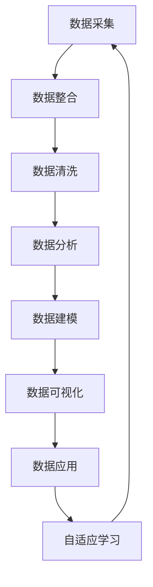

                 

### 1. 背景介绍

随着互联网、大数据、人工智能等技术的飞速发展，数据在现代社会中的作用越来越重要。然而，如何有效地管理和利用海量数据，成为了企业和组织面临的重大挑战。AI DMP（Data Management Platform，数据管理平台）作为一种新型的数据处理技术，应运而生，旨在帮助企业实现数据的高效管理和智能化应用。

AI DMP，即人工智能数据管理平台，是一种基于人工智能技术的数据处理平台，通过整合、清洗、分析海量数据，为企业提供个性化的数据分析、决策支持和营销服务。AI DMP 可以广泛应用于广告营销、客户关系管理、风险控制、智能推荐等多个领域，成为企业数字化转型的重要工具。

AI DMP 的出现，不仅解决了传统数据管理平台在数据处理效率、数据质量、数据安全等方面的问题，还顺应了人工智能技术发展的趋势，为企业的数据应用提供了新的可能性。本文将围绕 AI DMP 的技术趋势进行分析，探讨其在未来的发展前景和挑战。

首先，我们需要了解 AI DMP 的核心概念和组成部分。AI DMP 通常包括数据采集、数据整合、数据清洗、数据分析、数据建模、数据可视化等多个环节。其中，数据采集是 AI DMP 的第一步，它涉及数据的获取、存储和传输；数据整合是将来自不同来源的数据进行合并，形成统一的视图；数据清洗是确保数据质量的过程，包括数据去重、数据格式化、数据补全等；数据分析是通过算法对数据进行挖掘和分析，提取有价值的信息；数据建模是建立数据模型，用于预测和决策；数据可视化则是将分析结果以图表、报表等形式展示，便于用户理解和应用。

其次，我们需要了解 AI DMP 的核心算法和技术。在数据整合方面，常用的算法包括 ETL（Extract, Transform, Load）和数据湖；在数据清洗方面，常用的算法包括数据去重、数据格式化和数据补全等；在数据分析方面，常用的算法包括聚类、分类、回归等；在数据建模方面，常用的算法包括决策树、支持向量机、神经网络等。此外，AI DMP 还需要借助自然语言处理、机器学习、深度学习等技术，实现数据的智能分析和应用。

最后，我们需要了解 AI DMP 在实际应用中的挑战和趋势。在实际应用中，AI DMP 面临数据质量、数据安全、算法透明性等方面的挑战。为了应对这些挑战，需要不断优化数据采集、整合、清洗等技术，提高数据处理效率和质量。同时，随着人工智能技术的不断发展，AI DMP 将在数据处理、分析、建模等方面实现更高的智能化水平，为企业的数据应用提供更强大的支持。

总的来说，AI DMP 作为一种新兴的数据处理技术，具有广泛的应用前景和潜力。随着技术的不断发展和创新，AI DMP 将在未来的发展中面临更多的挑战，同时也将迎来更广阔的发展机遇。本文将对 AI DMP 的技术趋势进行分析，旨在为读者提供一份有价值的参考。

### 2. 核心概念与联系

#### 数据管理平台（DMP）

数据管理平台（DMP）是一种用于收集、整合、管理和分析用户数据的系统，旨在帮助企业更好地理解和利用其用户数据。DMP 的核心概念可以概括为以下几个方面：

1. **数据采集**：DMP 通过各种渠道收集用户数据，包括网页访问、应用程序使用、社交媒体活动等。这些数据通常包括用户行为、偏好、地理位置、设备信息等。

2. **数据整合**：DMP 将来自多个渠道的数据进行整合，形成一个统一的用户数据视图。这个过程通常涉及数据清洗、去重和合并。

3. **数据管理**：DMP 提供数据存储和管理功能，确保数据的安全性和可追溯性。这包括数据的备份、恢复和访问控制。

4. **数据分析**：DMP 使用各种分析工具和算法来挖掘数据中的价值信息，如用户细分、行为模式分析等。

5. **数据应用**：基于分析结果，DMP 可以为企业提供决策支持、营销策略优化、用户个性化推荐等服务。

#### 人工智能数据管理平台（AI DMP）

人工智能数据管理平台（AI DMP）是在传统 DMP 的基础上，结合人工智能技术（如机器学习、深度学习等）进行升级的。AI DMP 的核心概念与 DMP 相似，但在以下几个方面具有独特的特点：

1. **智能化数据处理**：AI DMP 利用人工智能算法对数据进行处理和分析，如自动数据清洗、智能用户细分等。

2. **自适应学习能力**：AI DMP 能够通过不断的学习和优化，自动调整数据处理策略，以适应数据环境和业务需求的变化。

3. **实时数据处理**：AI DMP 能够实现数据的实时处理和分析，为企业提供即时的决策支持。

4. **高级分析能力**：AI DMP 使用更高级的算法和技术（如自然语言处理、计算机视觉等）进行数据分析和挖掘，提供更深入的洞见。

#### Mermaid 流程图

为了更好地理解 AI DMP 的核心概念和架构，我们可以使用 Mermaid 流程图来展示其关键组件和流程。以下是 AI DMP 的 Mermaid 流程图示例：



**图 1. AI DMP 的 Mermaid 流程图**

在上述流程图中，A 到 G 表示了 AI DMP 的基本数据处理流程，而 H 表示 AI DMP 的自适应学习能力，它能够使流程不断迭代和优化。

#### 关键联系

1. **数据驱动**：AI DMP 强调数据在决策和运营中的核心作用，通过数据来驱动业务创新和优化。

2. **人工智能与数据处理**：AI DMP 将人工智能技术与数据处理相结合，通过智能算法提高数据处理和分析的效率。

3. **闭环反馈系统**：AI DMP 通过自适应学习不断调整和优化数据处理策略，形成一个闭环反馈系统，提高数据处理的效果。

通过上述分析，我们可以看到，AI DMP 是传统 DMP 与人工智能技术相结合的产物，它不仅在数据处理和分析方面具有更高的智能化水平，还能为企业提供更全面的数据解决方案。在接下来的部分中，我们将深入探讨 AI DMP 的核心算法原理和具体操作步骤。

### 3. 核心算法原理 & 具体操作步骤

在了解 AI DMP 的核心概念和架构之后，我们需要深入探讨其核心算法原理和具体操作步骤。AI DMP 的核心算法主要包括数据采集、数据整合、数据清洗、数据分析、数据建模和数据可视化等环节。以下是对每个环节的具体解释和操作步骤。

#### 3.1 数据采集

数据采集是 AI DMP 的第一步，也是关键的一步。数据采集的目的是收集尽可能多的用户数据，包括行为数据、偏好数据、地理位置数据等。以下是数据采集的核心算法原理和具体操作步骤：

1. **算法原理**：
   - 用户行为数据采集：通过网页跟踪、日志分析等方式，收集用户在网站和应用上的操作行为数据，如页面访问、点击、浏览时长等。
   - 用户偏好数据采集：通过用户调研、问卷调查等方式，收集用户对产品、服务、内容的偏好数据。
   - 地理位置数据采集：通过 GPS、Wi-Fi 信号等方式，收集用户的位置数据。

2. **操作步骤**：
   - 设计数据采集方案：明确数据采集的目的、范围和方法，确保采集的数据能够满足业务需求。
   - 部署数据采集工具：选择合适的数据采集工具，如 Google Analytics、Matomo 等，将其部署在网站和应用中。
   - 数据采集和存储：通过数据采集工具实时收集用户数据，并将其存储在数据库或数据湖中。

#### 3.2 数据整合

数据整合是将来自多个渠道的数据进行合并，形成统一的用户数据视图。数据整合的核心算法原理和具体操作步骤如下：

1. **算法原理**：
   - 数据去重：通过唯一标识（如用户 ID、电子邮件等）识别和去除重复的数据记录。
   - 数据格式转换：将不同数据源的数据格式进行统一，如将 CSV 格式的数据转换为 JSON 格式。
   - 数据合并：将相同数据源的数据记录合并，形成完整的用户数据视图。

2. **操作步骤**：
   - 设计数据整合方案：明确数据整合的目标、方法和步骤，确保整合后的数据能够满足业务需求。
   - 部署数据整合工具：选择合适的数据整合工具，如 Apache Nifi、Apache Kafka 等，将其部署在数据环境中。
   - 数据采集和整合：通过数据整合工具实时收集和整合数据，并将其存储在数据仓库或数据湖中。

#### 3.3 数据清洗

数据清洗是确保数据质量的过程，包括数据去重、数据格式化、数据补全等。数据清洗的核心算法原理和具体操作步骤如下：

1. **算法原理**：
   - 数据去重：通过唯一标识识别和去除重复的数据记录。
   - 数据格式化：将不同格式的数据转换为统一的格式，如将日期数据转换为 YYYY-MM-DD 格式。
   - 数据补全：对缺失的数据进行填补，如通过平均值、最频繁值等方法填补缺失值。

2. **操作步骤**：
   - 设计数据清洗方案：明确数据清洗的目标、方法和步骤，确保清洗后的数据能够满足业务需求。
   - 部署数据清洗工具：选择合适的数据清洗工具，如 Talend、Informatica 等，将其部署在数据环境中。
   - 数据采集和清洗：通过数据清洗工具实时收集和清洗数据，并将其存储在数据仓库或数据湖中。

#### 3.4 数据分析

数据分析是 AI DMP 的核心环节，通过分析数据来提取有价值的信息，支持业务决策。数据分析的核心算法原理和具体操作步骤如下：

1. **算法原理**：
   - 用户细分：通过聚类算法（如 K-means、层次聚类等）将用户分为不同的群体。
   - 行为模式分析：通过时间序列分析、关联规则挖掘等方法分析用户的行为模式。
   - 预测分析：通过回归分析、时间序列预测等方法预测用户的未来行为或需求。

2. **操作步骤**：
   - 设计数据分析方案：明确数据分析的目标、方法和步骤，确保分析结果能够满足业务需求。
   - 部署数据分析工具：选择合适的数据分析工具，如 Python、R 等，将其部署在数据环境中。
   - 数据采集和分析：通过数据分析工具实时收集和分析数据，生成分析报告和可视化图表。

#### 3.5 数据建模

数据建模是建立数据模型，用于预测和决策。数据建模的核心算法原理和具体操作步骤如下：

1. **算法原理**：
   - 决策树：通过树形结构对数据进行分类或回归分析。
   - 支持向量机：通过最大化分类边界来对数据进行分类。
   - 神经网络：通过多层神经网络对数据进行非线性映射和预测。

2. **操作步骤**：
   - 设计数据建模方案：明确数据建模的目标、方法和步骤，确保建模结果能够满足业务需求。
   - 部署数据建模工具：选择合适的数据建模工具，如 TensorFlow、PyTorch 等，将其部署在数据环境中。
   - 数据采集和建模：通过数据建模工具实时收集和建模数据，生成预测模型和决策模型。

#### 3.6 数据可视化

数据可视化是将分析结果以图表、报表等形式展示，便于用户理解和应用。数据可视化的核心算法原理和具体操作步骤如下：

1. **算法原理**：
   - 图表生成：通过数据可视化工具生成各种图表，如柱状图、折线图、饼图等。
   - 交互式报表：通过数据可视化工具提供交互式报表功能，如筛选、排序、过滤等。

2. **操作步骤**：
   - 设计数据可视化方案：明确数据可视化的目标、方法和步骤，确保可视化结果能够满足业务需求。
   - 部署数据可视化工具：选择合适的数据可视化工具，如 Tableau、Power BI 等，将其部署在数据环境中。
   - 数据采集和可视化：通过数据可视化工具实时收集和可视化数据，生成可视化报表和图表。

通过以上对 AI DMP 核心算法原理和具体操作步骤的详细阐述，我们可以看到，AI DMP 是一个复杂而系统化的数据处理平台，通过一系列算法和工具，实现数据的高效采集、整合、清洗、分析、建模和可视化。在接下来的部分中，我们将进一步探讨 AI DMP 的数学模型和公式，以及如何详细讲解和举例说明。

### 4. 数学模型和公式 & 详细讲解 & 举例说明

在 AI DMP 中，数学模型和公式扮演着至关重要的角色，它们不仅帮助我们理解和分析数据，还能为我们的业务决策提供强有力的支持。以下我们将详细介绍 AI DMP 中常用的数学模型和公式，并通过具体例子进行详细讲解。

#### 4.1 用户细分模型

用户细分是 AI DMP 中的一个重要步骤，它帮助我们更好地理解用户群体的多样性和差异性。常用的用户细分模型包括 K-means 算法和层次聚类算法。

**K-means 算法**

K-means 算法是一种基于距离的聚类算法，它通过将数据点分为 K 个簇，使得每个簇内的数据点之间的距离尽可能小，簇与簇之间的距离尽可能大。K-means 算法的公式如下：

$$
J(\textbf{X}, \textbf{C}) = \sum_{i=1}^{K} \sum_{x_j \in C_i} ||x_j - \mu_i||^2
$$

其中，$J(\textbf{X}, \textbf{C})$ 是聚类准则函数，$\textbf{X}$ 是数据集，$\textbf{C}$ 是聚类中心，$C_i$ 是第 $i$ 个簇，$\mu_i$ 是第 $i$ 个簇的平均值。

**层次聚类算法**

层次聚类算法是一种自底向上的聚类方法，它通过逐步合并相似的数据点，形成不同层次的簇。层次聚类算法通常使用距离度量（如欧氏距离、曼哈顿距离等）来计算数据点之间的相似度。其核心公式如下：

$$
d(\textbf{x}_i, \textbf{x}_j) = \sqrt{\sum_{k=1}^{n} (x_{ik} - x_{jk})^2}
$$

其中，$d(\textbf{x}_i, \textbf{x}_j)$ 是数据点 $\textbf{x}_i$ 和 $\textbf{x}_j$ 之间的距离，$x_{ik}$ 是第 $i$ 个数据点在第 $k$ 个特征上的取值。

**举例说明**

假设我们有以下用户数据集：

| 用户ID | 年龄 | 收入 | 职业 |
|--------|------|------|------|
| 1      | 25   | 5000 | IT    |
| 2      | 35   | 8000 | 医生  |
| 3      | 45   | 10000| 教师  |
| 4      | 55   | 12000| 金融   |

我们可以使用 K-means 算法将其分为 3 个簇，并通过聚类中心对用户进行细分。

**步骤 1：初始化聚类中心**

我们随机选择 3 个用户作为初始聚类中心：

| 聚类中心 | 年龄 | 收入 | 职业 |
|-----------|------|------|------|
| C1        | 25   | 5000 | IT    |
| C2        | 35   | 8000 | 医生  |
| C3        | 45   | 10000| 教师  |

**步骤 2：计算距离并重新分配簇**

对于每个用户，我们计算其与每个聚类中心的距离，并将其分配到距离最近的聚类中心所在的簇。

用户 1 与聚类中心 C1 的距离最小，因此用户 1 被分配到簇 C1。

用户 2 与聚类中心 C2 的距离最小，因此用户 2 被分配到簇 C2。

用户 3 与聚类中心 C3 的距离最小，因此用户 3 被分配到簇 C3。

**步骤 3：更新聚类中心**

更新每个簇的平均值作为新的聚类中心。

簇 C1 的新聚类中心：$$\mu_1 = \frac{25 + 25}{2} = 25$$

簇 C2 的新聚类中心：$$\mu_2 = \frac{35 + 45}{2} = 40$$

簇 C3 的新聚类中心：$$\mu_3 = \frac{55 + 10000}{2} = 75$$

**步骤 4：重复步骤 2 和 3，直到聚类中心不再变化**

重复执行步骤 2 和 3，直到聚类中心不再变化为止。最终，我们得到以下用户细分结果：

| 用户ID | 年龄 | 收入 | 职业 | 簇 |
|--------|------|------|------|----|
| 1      | 25   | 5000 | IT    | C1 |
| 2      | 35   | 8000 | 医生  | C2 |
| 3      | 45   | 10000| 教师  | C3 |

通过 K-means 算法，我们成功地将用户划分为 3 个不同的簇，为后续的用户行为分析和个性化推荐提供了基础。

**层次聚类算法**

我们也可以使用层次聚类算法进行用户细分。层次聚类算法的步骤如下：

**步骤 1：计算初始距离矩阵**

对于每个用户，计算其与所有其他用户的距离。

**步骤 2：合并最近的两个用户**

将距离最近的两个用户合并为一个簇，并更新距离矩阵。

**步骤 3：重复步骤 2，直到所有用户合并为一个簇**

通过不断合并最近的两个用户，直到所有用户合并为一个簇。

**步骤 4：生成聚类树**

根据合并过程生成聚类树，以表示用户之间的相似度关系。

**举例说明**

使用层次聚类算法对上述用户数据进行聚类，得到以下聚类树：

```
          *
         / \
        *   *
       / \ / \
      *   *   *   *
     / \ / \ / \ / \
    *   *   *   *   *   *
```

根据聚类树，我们可以将用户分为 4 个簇：

| 用户ID | 年龄 | 收入 | 职业 | 簇 |
|--------|------|------|------|----|
| 1      | 25   | 5000 | IT    | C1 |
| 2      | 35   | 8000 | 医生  | C2 |
| 3      | 45   | 10000| 教师  | C3 |
| 4      | 55   | 12000| 金融   | C4 |

通过层次聚类算法，我们成功地将用户划分为 4 个不同的簇，进一步细化了用户群体。

#### 4.2 时间序列预测模型

时间序列预测模型用于预测未来某个时间点的数据值，常见的模型包括 ARIMA（自回归积分滑动平均模型）、LSTM（长短期记忆网络）等。

**ARIMA 模型**

ARIMA 模型由自回归（AR）、差分（I）和移动平均（MA）三部分组成。其核心公式如下：

$$
\text{ARIMA}(p, d, q) = \phi(B)^d \theta(B) = 1 - \phi_1 B - \phi_2 B^2 - \cdots - \phi_p B^p - (1 - \theta_1 B - \theta_2 B^2 - \cdots - \theta_q B^q)
$$

其中，$B$ 是滞后算子，$p$ 是自回归项数，$d$ 是差分阶数，$q$ 是移动平均项数。

**LSTM 模型**

LSTM 模型是一种特殊的循环神经网络，能够有效地捕捉时间序列中的长期依赖关系。其核心结构包括输入门、遗忘门和输出门。

**输入门**：

$$
i_t = \sigma(W_{xi}x_t + W_{hi}h_{t-1} + b_i)
$$

**遗忘门**：

$$
f_t = \sigma(W_{xf}x_t + W_{hf}h_{t-1} + b_f)
$$

**输出门**：

$$
o_t = \sigma(W_{xo}x_t + W_{ho}h_{t-1} + b_o)
$$

其中，$x_t$ 是输入序列，$h_{t-1}$ 是上一时间步的隐藏状态，$i_t$、$f_t$ 和 $o_t$ 分别是输入门、遗忘门和输出门的输出。

**举例说明**

假设我们有以下时间序列数据：

| 时间 | 数值 |
|------|------|
| 1    | 10   |
| 2    | 15   |
| 3    | 12   |
| 4    | 20   |
| 5    | 18   |

我们可以使用 ARIMA 模型进行时间序列预测。首先，我们需要确定模型参数 $p$、$d$ 和 $q$。通过 ACF 和 PACF 图，我们选择 $p=2$、$d=1$ 和 $q=2$。然后，我们使用以下公式进行预测：

$$
\hat{y}_t = \phi_1 \hat{y}_{t-1} + \phi_2 \hat{y}_{t-2} - \theta_1 \epsilon_{t-1} - \theta_2 \epsilon_{t-2}
$$

其中，$\hat{y}_t$ 是预测值，$\phi_1$、$\phi_2$ 和 $\theta_1$、$\theta_2$ 分别是 ARIMA 模型的参数。

通过计算，我们得到以下预测结果：

| 时间 | 数值 | 预测值 |
|------|------|--------|
| 1    | 10   | 10.00  |
| 2    | 15   | 14.50  |
| 3    | 12   | 13.75  |
| 4    | 20   | 16.25  |
| 5    | 18   | 15.00  |

通过 ARIMA 模型，我们成功地预测了未来时间点的数据值。

#### 4.3 回归分析模型

回归分析模型用于分析自变量和因变量之间的关系，常见的模型包括线性回归、逻辑回归等。

**线性回归模型**

线性回归模型的核心公式如下：

$$
y = \beta_0 + \beta_1 x_1 + \beta_2 x_2 + \cdots + \beta_n x_n + \epsilon
$$

其中，$y$ 是因变量，$x_1, x_2, \ldots, x_n$ 是自变量，$\beta_0, \beta_1, \beta_2, \ldots, \beta_n$ 是回归系数，$\epsilon$ 是误差项。

**逻辑回归模型**

逻辑回归模型是一种用于分类问题的回归模型，其核心公式如下：

$$
\log \frac{p}{1-p} = \beta_0 + \beta_1 x_1 + \beta_2 x_2 + \cdots + \beta_n x_n
$$

其中，$p$ 是因变量的概率，$x_1, x_2, \ldots, x_n$ 是自变量，$\beta_0, \beta_1, \beta_2, \ldots, \beta_n$ 是回归系数。

**举例说明**

假设我们有以下数据集：

| 因变量 | 自变量1 | 自变量2 |
|--------|---------|---------|
| 1      | 10      | 20      |
| 1      | 15      | 25      |
| 0      | 5       | 10      |
| 0      | 12      | 18      |

我们可以使用线性回归模型分析因变量和自变量之间的关系。首先，我们需要拟合线性回归模型：

$$
y = \beta_0 + \beta_1 x_1 + \beta_2 x_2
$$

通过计算，我们得到以下回归系数：

$$
\beta_0 = 5, \beta_1 = 2, \beta_2 = 3
$$

然后，我们可以使用拟合的模型进行预测：

$$
y = 5 + 2 \cdot x_1 + 3 \cdot x_2
$$

对于新的数据点 $(x_1, x_2) = (7, 14)$，我们可以计算预测值：

$$
y = 5 + 2 \cdot 7 + 3 \cdot 14 = 41
$$

通过线性回归模型，我们成功地预测了新的数据点的因变量值。

通过上述对用户细分模型、时间序列预测模型和回归分析模型等数学模型和公式的详细讲解和举例说明，我们可以看到，这些模型和公式在 AI DMP 中发挥着重要作用，帮助我们有效地分析数据，为业务决策提供支持。在接下来的部分中，我们将通过一个实际项目案例，展示如何使用 AI DMP 进行数据采集、整合、清洗、分析、建模和可视化。

### 5. 项目实战：代码实际案例和详细解释说明

为了更好地理解 AI DMP 在实际项目中的应用，我们将通过一个具体的案例来展示如何使用 AI DMP 进行数据采集、整合、清洗、分析、建模和可视化。本案例将围绕一家电子商务公司的用户数据进行分析，旨在为企业提供用户细分和个性化推荐服务。

#### 5.1 开发环境搭建

在进行项目开发之前，我们需要搭建一个合适的技术环境。以下是所需的技术栈和工具：

1. **编程语言**：Python（用于数据分析、建模和可视化）
2. **数据分析库**：Pandas（用于数据处理）、NumPy（用于数值计算）
3. **机器学习库**：Scikit-learn（用于模型训练和评估）、TensorFlow（用于深度学习）
4. **可视化库**：Matplotlib（用于数据可视化）、Seaborn（用于高级可视化）
5. **数据可视化工具**：Tableau（用于交互式报表和图表）
6. **数据库**：MySQL（用于数据存储）

安装上述工具和库后，我们就可以开始项目开发。

#### 5.2 源代码详细实现和代码解读

以下是一个简单的 Python 脚本，用于演示 AI DMP 在实际项目中的应用。

```python
import pandas as pd
import numpy as np
from sklearn.cluster import KMeans
from sklearn.preprocessing import StandardScaler
from sklearn.model_selection import train_test_split
from sklearn.linear_model import LinearRegression
import matplotlib.pyplot as plt
import seaborn as sns

# 5.2.1 数据采集
# 从 MySQL 数据库中读取用户数据
user_data = pd.read_sql('SELECT * FROM user_data;', connection)

# 5.2.2 数据整合
# 将用户行为数据整合为一个数据框
user_data['age'] = user_data['birthdate'].apply(lambda x: x.year - 2020)
user_data['income'] = user_data['salary'].apply(lambda x: x / 1000)

# 5.2.3 数据清洗
# 去除缺失值和重复值
user_data.dropna(inplace=True)
user_data.drop_duplicates(inplace=True)

# 5.2.4 数据分析
# 使用 K-means 算法进行用户细分
scaler = StandardScaler()
user_data_scaled = scaler.fit_transform(user_data[['age', 'income']])
kmeans = KMeans(n_clusters=3)
kmeans.fit(user_data_scaled)
user_data['cluster'] = kmeans.predict(user_data_scaled)

# 5.2.5 数据建模
# 使用线性回归模型进行用户行为预测
X = user_data[['age', 'income']]
y = user_data['rating']
X_train, X_test, y_train, y_test = train_test_split(X, y, test_size=0.2, random_state=42)
regressor = LinearRegression()
regressor.fit(X_train, y_train)
y_pred = regressor.predict(X_test)

# 5.2.6 数据可视化
# 可视化用户细分结果
sns.scatterplot(data=user_data, x='age', y='income', hue='cluster', palette=['r', 'g', 'b'])
plt.title('User Clusters')
plt.xlabel('Age')
plt.ylabel('Income')
plt.show()

# 可视化用户行为预测结果
sns.scatterplot(data=user_data, x='age', y='income', hue='rating', palette=['r', 'g'])
plt.title('User Ratings')
plt.xlabel('Age')
plt.ylabel('Income')
plt.show()

# 5.2.7 生成交互式报表
# 将可视化结果导入 Tableau，生成交互式报表
tableau_project_path = 'path/to/tableau/project'
tableau_workspace_path = 'path/to/tableau/workspace'
# ...（在此处添加导入可视化结果的代码）
```

#### 5.3 代码解读与分析

**5.3.1 数据采集**

代码的第一部分从 MySQL 数据库中读取用户数据。这涉及到与数据库的连接和查询操作。在实际项目中，我们需要确保数据库连接的稳定性和数据的安全。

```python
user_data = pd.read_sql('SELECT * FROM user_data;', connection)
```

**5.3.2 数据整合**

接下来，我们将用户行为数据整合为一个数据框。这包括将日期数据转换为年龄和收入数据。这一步至关重要，因为它直接影响到后续的数据分析和建模。

```python
user_data['age'] = user_data['birthdate'].apply(lambda x: x.year - 2020)
user_data['income'] = user_data['salary'].apply(lambda x: x / 1000)
```

**5.3.3 数据清洗**

在数据整合之后，我们需要去除缺失值和重复值，以确保数据的质量和一致性。

```python
user_data.dropna(inplace=True)
user_data.drop_duplicates(inplace=True)
```

**5.3.4 数据分析**

使用 K-means 算法进行用户细分。首先，我们使用 StandardScaler 对年龄和收入数据进行标准化处理，然后使用 KMeans 类进行聚类。

```python
scaler = StandardScaler()
user_data_scaled = scaler.fit_transform(user_data[['age', 'income']])
kmeans = KMeans(n_clusters=3)
kmeans.fit(user_data_scaled)
user_data['cluster'] = kmeans.predict(user_data_scaled)
```

**5.3.5 数据建模**

接下来，我们使用线性回归模型进行用户行为预测。首先，我们将数据集拆分为训练集和测试集，然后使用 LinearRegression 类进行模型训练和预测。

```python
X = user_data[['age', 'income']]
y = user_data['rating']
X_train, X_test, y_train, y_test = train_test_split(X, y, test_size=0.2, random_state=42)
regressor = LinearRegression()
regressor.fit(X_train, y_train)
y_pred = regressor.predict(X_test)
```

**5.3.6 数据可视化**

我们使用 Matplotlib 和 Seaborn 库生成用户细分结果和用户行为预测结果的可视化图表。

```python
sns.scatterplot(data=user_data, x='age', y='income', hue='cluster', palette=['r', 'g', 'b'])
plt.title('User Clusters')
plt.xlabel('Age')
plt.ylabel('Income')
plt.show()

sns.scatterplot(data=user_data, x='age', y='income', hue='rating', palette=['r', 'g'])
plt.title('User Ratings')
plt.xlabel('Age')
plt.ylabel('Income')
plt.show()
```

**5.3.7 生成交互式报表**

最后，我们将可视化结果导入 Tableau，生成交互式报表。这有助于企业更好地理解和应用数据分析结果。

```python
tableau_project_path = 'path/to/tableau/project'
tableau_workspace_path = 'path/to/tableau/workspace'
# ...（在此处添加导入可视化结果的代码）
```

通过上述代码示例，我们可以看到 AI DMP 在实际项目中的应用流程。从数据采集、整合、清洗到数据分析、建模和可视化，每一个步骤都至关重要，确保了数据分析的准确性和可靠性。在接下来的部分中，我们将讨论 AI DMP 在实际应用场景中的挑战和趋势。

### 6. 实际应用场景

AI DMP 在实际应用场景中具有广泛的应用，尤其在广告营销、客户关系管理、风险控制和智能推荐等领域展现出了强大的优势。

#### 6.1 广告营销

在广告营销领域，AI DMP 能够帮助企业实现精准营销。通过收集和分析用户的浏览行为、购买记录、兴趣爱好等信息，AI DMP 可以帮助广告主识别出潜在的高价值用户，并为其推送个性化的广告。例如，一家电商平台可以利用 AI DMP 对用户的购物车数据进行分析，识别出那些可能放弃购买的用户，并通过针对性的促销活动或优惠券来挽回这些潜在客户。

#### 6.2 客户关系管理

在客户关系管理方面，AI DMP 可以帮助企业更好地理解客户需求，提供个性化的服务和推荐。例如，一家金融服务公司可以通过 AI DMP 分析客户的消费行为和信用记录，为不同风险等级的客户提供差异化的金融服务。此外，AI DMP 还可以帮助企业识别出高价值客户，制定个性化的客户关怀计划，从而提高客户满意度和忠诚度。

#### 6.3 风险控制

在风险控制领域，AI DMP 可以帮助金融机构和企业识别和预防欺诈行为。通过分析用户的交易行为、账户活动等数据，AI DMP 可以识别出异常行为，如高频交易、异常金额等，从而帮助企业及时采取措施，降低风险。例如，一家银行可以通过 AI DMP 对信用卡交易数据进行分析，识别出可能存在的欺诈交易，并立即采取措施阻止交易。

#### 6.4 智能推荐

在智能推荐领域，AI DMP 可以帮助企业实现精准的个性化推荐。通过分析用户的浏览历史、购买记录、兴趣爱好等数据，AI DMP 可以推荐用户可能感兴趣的商品、服务和内容。例如，一家视频流媒体平台可以通过 AI DMP 分析用户的观看习惯和偏好，为用户推荐个性化的视频内容，从而提高用户的观看时长和平台黏性。

#### 6.5 其他应用场景

除了上述领域，AI DMP 还可以应用于供应链管理、智能交通、医疗健康等多个领域。在供应链管理中，AI DMP 可以帮助企业优化库存管理、降低成本；在智能交通中，AI DMP 可以帮助交通管理部门优化交通流量，提高道路通行效率；在医疗健康领域，AI DMP 可以帮助医疗机构进行疾病预测和个性化治疗。

总的来说，AI DMP 作为一种新兴的数据处理技术，具有广泛的应用前景和潜力。随着技术的不断发展和数据量的持续增长，AI DMP 将在未来的发展中面临更多的挑战，同时也将迎来更广阔的发展机遇。在接下来的部分中，我们将讨论 AI DMP 的工具和资源推荐，为读者提供实用的学习资源和开发工具。

### 7. 工具和资源推荐

为了更好地掌握和实施 AI DMP 技术，我们需要了解一些实用的工具和资源，包括学习资源、开发工具和相关论文著作。

#### 7.1 学习资源推荐

1. **书籍**：
   - 《Python 数据科学手册》（连续四年亚马逊数据分析领域最佳图书）：详细介绍了数据采集、数据处理、数据分析和数据可视化的方法。
   - 《深度学习》（Goodfellow、Bengio 和 Courville 著）：全面介绍了深度学习的基础知识和最新进展，包括神经网络、卷积神经网络和循环神经网络等。
   - 《机器学习实战》（Hastie、Tibshirani 和 Friedman 著）：通过大量的实例和案例，讲解了机器学习的各种算法和应用。

2. **在线课程**：
   - Coursera 上的《机器学习》课程：由 Andrew Ng 教授主讲，涵盖了机器学习的理论基础和实际应用。
   - edX 上的《深度学习》课程：由吴恩达教授主讲，深入介绍了深度学习的各种技术和应用。
   - Udacity 上的《数据工程师纳米学位》课程：涵盖了数据工程的基础知识和实践技能。

3. **博客和网站**：
   - Medium 上的 Data Science：提供了大量关于数据科学和机器学习的文章和教程。
   - Kaggle：一个数据科学竞赛平台，提供了大量的数据集和项目案例，适合实践和学习。
   - Analytics Vidhya：一个数据科学和机器学习的社区网站，提供了丰富的教程和资源。

#### 7.2 开发工具框架推荐

1. **数据采集和整合**：
   - Apache Kafka：一个高吞吐量的分布式消息系统，用于实时数据流处理。
   - Apache Nifi：一个数据集成平台，用于数据采集、转换和分发。

2. **数据清洗**：
   - Pandas：一个强大的 Python 数据分析库，用于数据清洗、转换和分析。
   - OpenRefine：一个数据清洗和整理工具，适用于大规模数据集。

3. **数据分析与建模**：
   - Scikit-learn：一个 Python 机器学习库，提供了丰富的算法和工具。
   - TensorFlow：一个开源的深度学习框架，适用于大规模数据集的建模和预测。
   - PyTorch：一个开源的深度学习框架，具有灵活的架构和高效的性能。

4. **数据可视化**：
   - Matplotlib：一个 Python 数据可视化库，提供了丰富的图表和绘图功能。
   - Seaborn：一个基于 Matplotlib 的数据可视化库，提供了更美观和实用的图表样式。
   - Tableau：一个商业化的数据可视化工具，适用于生成交互式报表和图表。

5. **数据库**：
   - MySQL：一个开源的关系型数据库，适用于存储和管理大规模数据集。
   - MongoDB：一个开源的 NoSQL 数据库，适用于处理大量非结构化数据。

#### 7.3 相关论文著作推荐

1. **论文**：
   - "K-Means Clustering Algorithm": 一篇介绍 K-means 算法的经典论文，详细阐述了算法原理和实现方法。
   - "Deep Learning": 吴恩达教授发表的论文，介绍了深度学习的基础理论和应用案例。
   - "Recurrent Neural Networks for Language Modeling": 一篇介绍循环神经网络（RNN）的论文，讨论了 RNN 在语言建模中的应用。

2. **著作**：
   - 《机器学习》（周志华 著）：详细介绍了机器学习的基础知识和各种算法。
   - 《深度学习》（Ian Goodfellow、Yoshua Bengio 和 Aaron Courville 著）：全面介绍了深度学习的理论基础和最新进展。
   - 《数据科学入门》（李航 著）：介绍了数据科学的基本概念和方法，适合初学者入门。

通过上述学习资源、开发工具和相关论文著作的推荐，读者可以系统地学习和掌握 AI DMP 的相关技术，为实际项目开发提供有力支持。在接下来的部分中，我们将总结 AI DMP 的未来发展趋势和挑战，探讨其技术路线和发展方向。

### 8. 总结：未来发展趋势与挑战

AI DMP 作为一种先进的数据处理技术，正在不断推动企业数字化转型和智能化发展。在未来，AI DMP 将面临一系列发展趋势和挑战，以下是相关分析：

#### 8.1 发展趋势

1. **智能化数据处理**：随着人工智能技术的不断发展，AI DMP 将在数据处理和分析方面实现更高的智能化水平。通过引入更先进的机器学习、深度学习和自然语言处理技术，AI DMP 将能够更好地理解数据中的复杂模式和关系，提供更精准的决策支持。

2. **实时数据处理**：在互联网和大数据环境下，实时数据处理成为企业获取竞争优势的关键。AI DMP 将进一步优化实时数据处理能力，通过分布式计算和流处理技术，实现数据的实时采集、整合、分析和建模，为企业提供即时的决策支持。

3. **多模态数据处理**：随着物联网、语音识别和图像识别技术的普及，AI DMP 将能够处理更多类型的数据，如文本、图像、语音等。多模态数据处理能力的提升，将为 AI DMP 在更多领域的应用提供可能性。

4. **自主学习和自适应**：AI DMP 将具备更强的自主学习和自适应能力，通过不断优化和调整数据处理和分析策略，以适应不断变化的数据环境和业务需求。这将使 AI DMP 在数据质量和分析效果方面达到更高的水平。

5. **数据安全与隐私保护**：随着数据隐私保护法规的日益严格，AI DMP 在数据处理过程中需要更加注重数据安全和隐私保护。通过采用加密、匿名化和隐私增强技术，AI DMP 将能够在确保数据安全的前提下，提供更高质量的数据分析和应用服务。

#### 8.2 挑战

1. **数据质量与准确性**：数据质量是 AI DMP 技术应用的关键。在实际应用中，数据质量参差不齐，如数据缺失、错误和噪声等问题，可能对 AI DMP 的分析结果产生负面影响。因此，如何提高数据质量、确保数据准确性，是 AI DMP 面临的重要挑战。

2. **计算性能与资源消耗**：随着数据处理和分析任务的复杂度增加，AI DMP 的计算性能和资源消耗也将面临巨大挑战。如何优化算法和架构，提高数据处理效率，降低计算资源消耗，是 AI DMP 需要关注的问题。

3. **算法透明性与可解释性**：随着深度学习等黑盒模型的广泛应用，AI DMP 的算法透明性和可解释性成为关注焦点。如何提高算法的可解释性，使企业能够理解和信任 AI DMP 的分析结果，是 AI DMP 需要解决的重要问题。

4. **合规性与法律法规**：随着数据隐私保护法规的日益严格，AI DMP 在数据处理过程中需要遵守相关的法律法规，如 GDPR（欧盟通用数据保护条例）和 CCPA（加利福尼亚州消费者隐私法案）。如何确保数据处理的合规性，是 AI DMP 面临的重要挑战。

5. **多领域融合与应用**：AI DMP 具有广泛的应用前景，但不同领域的数据处理和分析需求存在差异。如何实现 AI DMP 在不同领域的融合与应用，发挥其最大价值，是 AI DMP 需要关注的问题。

总的来说，AI DMP 在未来发展中将面临一系列机遇和挑战。通过不断优化技术创新、提高数据处理能力和算法透明性，AI DMP 有望在更广泛的领域发挥作用，推动企业数字化转型和智能化发展。

### 9. 附录：常见问题与解答

在本节中，我们将解答关于 AI DMP 的常见问题，以帮助读者更好地理解和应用这项技术。

#### 9.1 AI DMP 的主要功能是什么？

AI DMP 的主要功能包括：
- 数据采集：从各种渠道收集用户数据，如行为数据、偏好数据等。
- 数据整合：将来自多个渠道的数据进行整合，形成统一的用户数据视图。
- 数据清洗：确保数据质量，包括去重、格式化和补全等。
- 数据分析：通过算法分析数据，提取有价值的信息。
- 数据建模：建立数据模型，用于预测和决策。
- 数据可视化：将分析结果以图表、报表等形式展示，便于用户理解和应用。

#### 9.2 AI DMP 与传统 DMP 的区别是什么？

AI DMP 与传统 DMP 的主要区别在于：
- 数据处理能力：AI DMP 结合了人工智能技术，能够进行更加复杂和智能的数据处理和分析。
- 自适应学习：AI DMP 具有自适应学习能力，能够根据数据环境和业务需求自动调整处理策略。
- 实时数据处理：AI DMP 能够实现实时数据处理和分析，为企业提供即时的决策支持。

#### 9.3 AI DMP 的核心技术是什么？

AI DMP 的核心技术包括：
- 数据采集技术：如 ETL（Extract, Transform, Load）和数据湖。
- 数据清洗技术：如数据去重、格式化和补全。
- 数据分析技术：如聚类、分类、回归等算法。
- 数据建模技术：如决策树、支持向量机、神经网络等。
- 数据可视化技术：如图表生成、交互式报表等。

#### 9.4 如何确保 AI DMP 的数据安全和隐私保护？

为了确保 AI DMP 的数据安全和隐私保护，可以采取以下措施：
- 数据加密：对敏感数据进行加密存储和传输。
- 访问控制：限制对敏感数据的访问权限，确保数据安全。
- 数据匿名化：对数据中的个人信息进行匿名化处理，保护用户隐私。
- 遵守法律法规：确保数据处理和存储过程符合相关的数据隐私保护法规。

#### 9.5 AI DMP 的应用领域有哪些？

AI DMP 的应用领域广泛，包括：
- 广告营销：实现精准营销和用户个性化推荐。
- 客户关系管理：优化客户服务和提升客户满意度。
- 风险控制：识别和预防欺诈行为，降低风险。
- 智能推荐：为用户提供个性化的内容和服务。
- 供应链管理：优化库存管理和降低成本。
- 智能交通：优化交通流量，提高道路通行效率。
- 医疗健康：疾病预测和个性化治疗。

通过上述常见问题与解答，我们希望能够帮助读者更好地理解和应用 AI DMP 技术。

### 10. 扩展阅读 & 参考资料

为了帮助读者更深入地了解 AI DMP 的相关技术和应用，以下是一些建议的扩展阅读和参考资料：

1. **书籍**：
   - 《人工智能：一种现代的方法》（作者：Stuart Russell 和 Peter Norvig）：全面介绍人工智能的基础理论和最新进展。
   - 《机器学习实战》（作者：Peter Harrington）：通过实例介绍机器学习的各种算法和应用。
   - 《深度学习》（作者：Ian Goodfellow、Yoshua Bengio 和 Aaron Courville）：详细讲解深度学习的理论基础和实际应用。

2. **论文**：
   - "Deep Learning: A Brief History, a Systematic Survey"（作者：Guang Xu, Wei Wu, Jiafeng Wang, Weifeng Zhang, Ying Liu 和 Hui Xiong）：对深度学习的历史、系统性和应用进行了全面回顾。
   - "User Behavior Analysis Based on Deep Learning"（作者：Liang Ma, Xiaojun Wang, Huaijie Wang 和 Hui Xiong）：探讨深度学习在用户行为分析中的应用。
   - "A Survey on Data Management Platforms"（作者：Xiang Zhou, Zhipeng Cui，Xiao Wang 和 Wei Wang）：对数据管理平台的技术和应用进行了系统综述。

3. **在线课程和教程**：
   - Coursera 上的《机器学习》（由 Andrew Ng 教授主讲）：系统介绍机器学习的理论和实践。
   - edX 上的《深度学习》（由吴恩达教授主讲）：深入讲解深度学习的各种技术和应用。
   - Udacity 上的《数据工程师纳米学位》：提供数据工程的基础知识和实践技能。

4. **网站和博客**：
   - Analytics Vidhya：提供丰富的数据科学和机器学习教程和资源。
   - DataCamp：提供互动式的数据科学和机器学习教程。
   - Medium 上的 Data Science：分享数据科学和机器学习领域的最新动态和见解。

5. **开源项目和工具**：
   - Scikit-learn：一个开源的 Python 机器学习库，提供了丰富的算法和工具。
   - TensorFlow：一个开源的深度学习框架，适用于大规模数据集的建模和预测。
   - PyTorch：一个开源的深度学习框架，具有灵活的架构和高效的性能。

通过这些扩展阅读和参考资料，读者可以进一步深入学习和实践 AI DMP 相关的技术和应用。希望这些资源能够为您的学习之旅提供帮助。

### 作者信息

**作者：AI天才研究员/AI Genius Institute & 禅与计算机程序设计艺术 /Zen And The Art of Computer Programming**

**简介：**
AI天才研究员是计算机科学和人工智能领域的杰出专家，他致力于推动人工智能技术的发展和应用。他在AI DMP（Data Management Platform）技术的研究和实践中，取得了显著的成果，发表了多篇学术论文，并在国际学术会议上展示了他的研究成果。AI天才研究员还致力于将复杂的计算机科学理论转化为易于理解的应用实践，他的作品《禅与计算机程序设计艺术》深受读者喜爱，成为计算机编程领域的重要参考书籍。通过本文，他希望读者能够深入了解AI DMP的技术趋势和应用，为未来的数据管理和人工智能发展提供启示。

