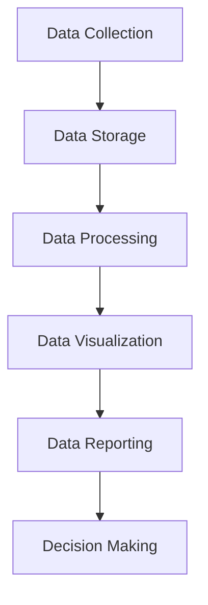

                 

### 背景介绍

在当今信息化的社会中，数据已成为企业和社会运转的核心资产。然而，如何高效地管理和利用这些数据，使其真正为企业和社会创造价值，成为了一个亟待解决的问题。在这个背景下，AI DMP（数据管理平台）应运而生。

AI DMP，即人工智能数据管理平台，是一种利用人工智能技术，对海量数据进行采集、存储、处理、分析和可视化等操作的综合性平台。其核心目标是通过智能化的数据处理方式，提升数据的利用效率，为企业提供精准的数据决策支持。

数据可视化是AI DMP的重要组成部分，它将复杂的数据通过图形化的方式呈现，使数据更加直观易懂，从而帮助决策者快速获取信息。而报表则是对数据进行分析和呈现的一种常见形式，它能够为企业提供详细的数据报告，帮助深入理解数据背后的规律和趋势。

本文将围绕AI DMP的数据可视化与报表功能进行深入探讨，从核心概念、算法原理、数学模型、实际应用等多个方面，为您详细解析这一领域的专业知识。希望通过本文，您能够对AI DMP的数据可视化与报表有更深入的了解，从而更好地应对实际工作中的挑战。

### 核心概念与联系

为了深入理解AI DMP的数据可视化与报表功能，我们需要首先明确几个核心概念：数据可视化、报表、以及它们在AI DMP中的作用。

**数据可视化**：数据可视化是一种将复杂的数据通过图形、图像、图表等形式进行展示的技术。它的目的是将数据以直观、易懂的方式呈现，帮助人们更好地理解和分析数据。数据可视化包括多种形式，如柱状图、折线图、饼图、热力图等，每种形式都有其特定的应用场景和优势。

**报表**：报表是对数据进行整理、分析和呈现的一种文档。它通常包括数据的汇总、分类、对比、趋势分析等内容，能够为企业提供详细的数据报告。报表可以用于多种场合，如日常运营监控、项目评估、财务分析等。

**AI DMP中的数据可视化与报表**：在AI DMP中，数据可视化与报表是两个重要的功能模块。数据可视化模块负责将存储在DMP中的数据以图形化的方式呈现，使用户能够快速了解数据的整体趋势和关键指标。而报表模块则对数据进行更深层次的分析，生成详细的数据报告，为企业的决策提供支持。

为了更好地理解这些核心概念及其在AI DMP中的作用，我们可以借助Mermaid流程图进行说明。



在上图中，A代表数据采集，即从各种数据源获取原始数据；B代表数据存储，即对数据进行存储和管理；C代表数据处理，即对数据进行清洗、转换和聚合等操作；D代表数据可视化，即将处理后的数据通过图表等形式进行展示；E代表数据报表，即对数据进行深入分析和呈现；F代表决策制定，即基于可视化报表生成决策。

通过上述流程，我们可以看到，数据可视化与报表在AI DMP中起到连接各个环节的桥梁作用，为企业的数据管理和决策提供重要支持。

### 核心算法原理 & 具体操作步骤

在深入了解数据可视化与报表的核心算法原理之前，我们需要明确两个关键概念：数据预处理和数据可视化算法。

**数据预处理**：数据预处理是数据可视化与报表分析的重要前置步骤。其主要任务包括数据清洗、数据转换和数据聚合等。数据清洗是指识别并处理数据中的错误、异常和重复值，确保数据的质量。数据转换是指将不同格式、不同类型的数据统一转换为同一标准格式，以便后续处理。数据聚合是指对大量数据进行汇总、分类和分组等操作，从而降低数据的复杂性。

**数据可视化算法**：数据可视化算法是数据可视化模块的核心，负责将处理后的数据通过图表等形式进行展示。常见的数据可视化算法包括柱状图、折线图、饼图、散点图、热力图等。每种算法都有其特定的应用场景和优势。

下面，我们将具体介绍数据预处理和数据可视化算法的操作步骤。

#### 数据预处理步骤

1. **数据清洗**：
   - **错误值识别**：通过算法或人工检查，识别数据中的错误值。
   - **异常值处理**：对识别出的错误值进行修正或删除。
   - **重复值删除**：检查并删除数据中的重复记录。

2. **数据转换**：
   - **格式统一**：将不同格式的数据统一转换为同一标准格式，如CSV或JSON格式。
   - **数据类型转换**：将不同类型的数据（如字符串、浮点数、整数等）转换为统一的数据类型。

3. **数据聚合**：
   - **数据汇总**：对数据进行分类汇总，如按时间、地区、产品等维度进行分组。
   - **数据聚合**：对大量数据进行汇总，如求和、平均、最大值、最小值等。

#### 数据可视化算法操作步骤

1. **选择可视化类型**：
   - 根据数据类型和需求选择合适的可视化类型，如柱状图、折线图、饼图等。

2. **数据预处理**：
   - 对数据进行清洗、转换和聚合等预处理操作，确保数据质量。

3. **生成可视化图表**：
   - 根据选定的可视化类型，使用可视化库（如D3.js、ECharts等）生成图表。

4. **交互和展示**：
   - 实现图表的交互功能，如缩放、拖拽、筛选等，以便用户更好地理解数据。
   - 将生成的图表以图形化的形式展示，使数据更加直观易懂。

通过上述步骤，我们可以将复杂的数据通过可视化的方式呈现，帮助用户快速获取信息，为决策提供支持。

### 数学模型和公式 & 详细讲解 & 举例说明

在数据可视化与报表中，数学模型和公式起着至关重要的作用。它们不仅能够帮助我们更好地理解和处理数据，还能提高数据分析的准确性和效率。下面，我们将详细讲解一些常用的数学模型和公式，并通过具体例子来说明它们的应用。

#### 1. 常用数学模型

**线性回归模型**：线性回归模型是数据分析中最基本的模型之一，用于分析两个或多个变量之间的线性关系。其公式如下：

$$ y = ax + b $$

其中，\( y \) 是因变量，\( x \) 是自变量，\( a \) 是斜率，\( b \) 是截距。

**主成分分析（PCA）**：主成分分析是一种降维技术，通过将原始数据投影到新的正交坐标系中，提取出主要特征，从而简化数据结构。其公式如下：

$$ z = P \cdot x $$

其中，\( z \) 是新的正交坐标系下的数据，\( P \) 是投影矩阵，\( x \) 是原始数据。

**聚类分析**：聚类分析是一种无监督学习方法，用于将数据划分为多个类别。常见的聚类算法包括K-means算法、层次聚类算法等。以K-means算法为例，其公式如下：

$$ c_{k} = \frac{1}{n_{k}} \sum_{i=1}^{n_{k}} x_{i} $$

$$ x_{i} = \frac{1}{n_{k}} \sum_{j=1}^{k} w_{ij} \cdot c_{j} $$

其中，\( c_{k} \) 是第 \( k \) 个聚类中心，\( x_{i} \) 是第 \( i \) 个数据点，\( w_{ij} \) 是第 \( i \) 个数据点到第 \( j \) 个聚类中心的距离。

#### 2. 公式应用举例

**例子1：线性回归模型**

假设我们有一组数据，表示某种产品的销售量和广告支出之间的关系。我们可以使用线性回归模型来分析它们之间的线性关系。

首先，我们通过计算得到斜率 \( a \) 和截距 \( b \)：

$$ a = \frac{\sum_{i=1}^{n} (x_{i} - \bar{x})(y_{i} - \bar{y})}{\sum_{i=1}^{n} (x_{i} - \bar{x})^2} $$

$$ b = \bar{y} - a \cdot \bar{x} $$

其中，\( x_{i} \) 是广告支出，\( y_{i} \) 是销售量，\( \bar{x} \) 和 \( \bar{y} \) 分别是广告支出和销售量的平均值。

然后，我们可以得到线性回归方程：

$$ y = ax + b $$

通过这个方程，我们可以预测任意广告支出水平下的销售量。

**例子2：主成分分析（PCA）**

假设我们有100个数据点，每个数据点有10个特征。我们可以使用主成分分析来提取主要特征，从而降低数据的维度。

首先，我们计算协方差矩阵：

$$ S = \frac{1}{n-1} \cdot (x - \bar{x}) \cdot (x - \bar{x})^T $$

然后，我们计算协方差矩阵的特征值和特征向量。特征值对应的特征向量就是我们提取的主要特征。

最后，我们将原始数据投影到新的正交坐标系中：

$$ z = P \cdot x $$

通过这个新的坐标系，我们可以更好地理解和分析数据。

**例子3：K-means聚类分析**

假设我们有100个数据点，需要将它们划分为10个类别。我们可以使用K-means算法来实现这一目标。

首先，我们随机初始化10个聚类中心。

然后，我们计算每个数据点到每个聚类中心的距离，并将其分配到最近的聚类中心。

接下来，我们更新聚类中心，使其更接近于当前数据点的平均位置。

重复以上步骤，直到聚类中心不再发生明显变化。

通过这个聚类分析，我们可以将数据点划分为10个类别。

通过上述例子，我们可以看到数学模型和公式在数据可视化与报表中的重要作用。它们不仅能够帮助我们更好地理解和处理数据，还能提高数据分析的准确性和效率。

### 项目实战：代码实际案例和详细解释说明

为了更好地理解AI DMP的数据可视化与报表功能，我们将通过一个实际项目案例来进行详细讲解。本案例将使用Python和ECharts库，实现一个简单的销售数据可视化项目。通过该项目，我们将展示如何从数据导入、预处理、可视化到报表生成的全过程。

#### 1. 开发环境搭建

首先，我们需要搭建一个Python开发环境。以下是所需的步骤：

1. **安装Python**：从官方网站（[Python官网](https://www.python.org/)）下载并安装Python，建议选择Python 3.8或更高版本。

2. **安装ECharts**：ECharts是一个使用JavaScript编写的可视化库。我们可以通过npm或pip安装ECharts。

   ```shell
   npm install echarts --save
   ```

   或者

   ```shell
   pip install echarts
   ```

3. **创建Python项目**：在Python项目中创建一个名为`sales_data_vis`的目录，并在其中创建一个名为`main.py`的主程序文件。

#### 2. 源代码详细实现和代码解读

下面是项目的源代码及其详细解读。

```python
import pandas as pd
from echarts import EChart

# 2.1 数据导入
data = pd.read_csv('sales_data.csv')

# 2.2 数据预处理
# 数据清洗
data = data.dropna()  # 删除缺失值
data = data[data['Sales'] > 0]  # 删除销售量为0的记录

# 数据转换
data['Date'] = pd.to_datetime(data['Date'])
data.sort_values('Date', inplace=True)

# 数据聚合
data_grouped = data.groupby('Month')['Sales'].sum().reset_index()

# 2.3 数据可视化
# 生成柱状图
echarts = EChart()
echarts.add(
    'Sales by Month',
    data_grouped['Month'].tolist(),
    data_grouped['Sales'].tolist(),
    chart_type='bar',
    x轴标签='Month',
    y轴标签='Sales'
)
echarts.render('sales_by_month.html')

# 2.4 数据报表
# 生成销售报表
report = data_grouped.describe().T
print(report)
```

**代码解读：**

- **数据导入**：使用Pandas库从CSV文件中读取销售数据。

- **数据预处理**：包括数据清洗（删除缺失值和销售量为0的记录），数据转换（将日期字符串转换为日期类型，并按日期排序），以及数据聚合（按月份汇总销售数据）。

- **数据可视化**：使用ECharts库生成柱状图，并保存为HTML文件。

- **数据报表**：使用Pandas库生成销售数据的描述性统计报表，并打印输出。

#### 3. 代码解读与分析

下面我们对代码中的关键部分进行详细解读和分析。

- **数据导入**：
  ```python
  data = pd.read_csv('sales_data.csv')
  ```
  这一行代码使用Pandas库从CSV文件中读取销售数据。CSV文件通常包含多个列，如日期、销售额、产品名称等。这里我们读取了所有列的数据。

- **数据预处理**：
  ```python
  data = data.dropna()  # 删除缺失值
  data = data[data['Sales'] > 0]  # 删除销售量为0的记录
  ```
  这两行代码分别用于数据清洗。`dropna()`函数删除所有缺失值，`data[data['Sales'] > 0]`删除销售量为0的记录。这些操作确保了数据的质量。

  ```python
  data['Date'] = pd.to_datetime(data['Date'])
  data.sort_values('Date', inplace=True)
  ```
  这两行代码用于数据转换。首先，将日期字符串转换为日期类型，这有助于后续的排序和分组操作。`sort_values()`函数按日期对数据排序。

  ```python
  data_grouped = data.groupby('Month')['Sales'].sum().reset_index()
  ```
  这一行代码用于数据聚合。`groupby()`函数按月份分组数据，`sum()`函数对每个分组中的销售额进行汇总，`reset_index()`函数将结果重置为DataFrame格式。

- **数据可视化**：
  ```python
  echarts = EChart()
  echarts.add(
      'Sales by Month',
      data_grouped['Month'].tolist(),
      data_grouped['Sales'].tolist(),
      chart_type='bar',
      x轴标签='Month',
      y轴标签='Sales'
  )
  echarts.render('sales_by_month.html')
  ```
  这段代码使用ECharts库生成柱状图。`EChart()`函数创建一个ECharts对象，`add()`函数添加一个柱状图。我们传递了月份和销售额的数据列表，以及图表的X轴和Y轴标签。

- **数据报表**：
  ```python
  report = data_grouped.describe().T
  print(report)
  ```
  这段代码生成销售数据的描述性统计报表。`describe()`函数计算数据的描述性统计量，如均值、标准差、最小值和最大值。`.T`将结果转置，使得报表更加直观。最后，使用`print()`函数打印输出。

通过上述代码，我们实现了销售数据的数据可视化与报表生成。这个案例展示了如何使用Python和ECharts库进行数据处理、可视化以及报表生成。在实际应用中，我们可以根据具体需求，扩展数据源、添加更多图表类型以及优化报表内容。

### 实际应用场景

AI DMP的数据可视化与报表功能在许多实际应用场景中具有重要意义。以下是一些典型应用场景及其实际意义：

#### 1. 市场营销

在市场营销领域，数据可视化与报表可以帮助企业更好地了解客户行为和市场趋势。例如，通过分析客户购买历史和偏好，企业可以识别高价值客户群体，制定个性化的营销策略。报表则可以提供详细的客户细分和市场细分数据，帮助企业评估营销活动的效果。

**案例**：一家电商平台使用AI DMP对用户购物行为进行数据可视化，发现大多数用户在周末和特定节假日购买频率较高。基于这些数据，企业调整了广告投放策略，在周末和节假日加大广告投放力度，从而提高了销售额。

#### 2. 财务分析

财务分析是企业管理的重要环节。数据可视化与报表可以帮助企业快速了解财务状况，发现潜在问题。例如，通过柱状图和折线图，企业可以直观地查看收入、支出、利润等关键财务指标的变化趋势。报表则可以提供详细的财务数据，帮助管理层进行决策。

**案例**：一家制造业公司使用AI DMP对财务数据进行分析，发现某个月份的库存成本异常偏高。通过进一步分析，企业发现是因为供应商延迟交货导致的。基于这些数据，公司调整了供应链管理策略，降低了库存成本。

#### 3. 供应链管理

供应链管理是企业运营的重要组成部分。数据可视化与报表可以帮助企业优化供应链流程，降低库存成本，提高运营效率。例如，通过分析供应链中的关键节点，企业可以识别瓶颈和延迟环节，从而采取相应措施进行优化。

**案例**：一家零售连锁企业使用AI DMP对供应链数据进行分析，发现某个供应商的交货时间较长，影响了整体供应链效率。通过数据可视化，企业决定与该供应商进行沟通，协商改进交货时间，从而提高了供应链效率。

#### 4. 项目管理

在项目管理中，数据可视化与报表可以帮助项目经理实时了解项目进度、资源分配和成本情况，确保项目按计划进行。例如，通过甘特图和饼图，项目经理可以直观地查看项目的关键路径和资源利用率。

**案例**：一家科技公司使用AI DMP对项目管理数据进行可视化分析，发现项目进度滞后，关键资源不足。基于这些数据，项目经理调整了项目计划，优化了资源分配，最终按时完成了项目。

#### 5. 健康管理

在健康管理领域，数据可视化与报表可以帮助医疗机构更好地了解患者健康状况，提高医疗服务质量。例如，通过分析患者健康数据，医疗机构可以识别高危人群，制定个性化的健康管理方案。报表则可以提供详细的健康数据，帮助医护人员进行诊疗决策。

**案例**：一家医院使用AI DMP对患者的健康数据进行可视化分析，发现某些疾病在特定年龄段和高风险人群中较为常见。基于这些数据，医院制定了针对性的健康教育计划，提高了患者健康水平。

通过上述实际应用场景，我们可以看到AI DMP的数据可视化与报表功能在多个领域都具有重要意义。它不仅帮助企业更好地管理和利用数据，还为决策提供了有力支持，从而提高了企业的运营效率和竞争力。

### 工具和资源推荐

为了更好地掌握AI DMP的数据可视化与报表技术，我们需要了解一些常用的学习资源、开发工具和框架，以便在实际项目中高效地应用这些知识。

#### 1. 学习资源推荐

**书籍**：

- 《数据可视化：设计与展示》（Designing Data Visualizations） by Noah Iliinsky and Jennifer Healey
- 《数据科学导论》（Introduction to Data Science） by Joaquin Machado and Paul Murrell

**论文**：

- "Interactive Data Visualization for the Web" by Scott Murray
- "Visualization as a Tool for Exploratory Data Analysis" by Michael Friendly

**博客**：

- [ECharts官方文档](https://echarts.apache.org/zh/index.html)
- [Data visualization blogs on Medium](https://medium.com/topic/data-visualization)

**网站**：

- [Kaggle](https://www.kaggle.com/)：提供丰富的数据集和比赛，有助于实践和提升数据可视化技能。
- [DataCamp](https://www.datacamp.com/)：提供系统的在线课程和实战项目，适合初学者和进阶者。

#### 2. 开发工具框架推荐

**可视化库**：

- **ECharts**：一款强大的JavaScript可视化库，支持多种图表类型，如柱状图、折线图、饼图等。
- **D3.js**：一款基于JavaScript的可视化库，提供了灵活的数据绑定和操作接口，适用于复杂的数据可视化场景。

**数据处理库**：

- **Pandas**：一款流行的Python数据处理库，提供了丰富的数据处理和分析功能。
- **NumPy**：一款提供高性能数学计算和数组操作的Python库，是Pandas库的基础。

**数据分析框架**：

- **TensorFlow**：一款由Google开发的机器学习框架，支持多种数据可视化操作。
- **PyTorch**：一款流行的深度学习框架，提供了丰富的数据可视化工具。

#### 3. 相关论文著作推荐

- **《数据可视化：设计与展示》**：详细介绍了数据可视化的设计原则和最佳实践。
- **《数据科学导论》**：涵盖了数据预处理、数据分析和数据可视化的基础知识。
- **《交互式数据可视化》**：探讨了交互式数据可视化在数据分析中的应用。
- **《可视化作为探索性数据分析的工具》**：讨论了可视化技术在数据分析中的作用和优势。

通过以上学习和开发资源的推荐，我们可以系统地掌握AI DMP的数据可视化与报表技术，并在实际项目中充分发挥这些技能。希望这些资源能够对您的学习和实践提供有力支持。

### 总结：未来发展趋势与挑战

随着大数据和人工智能技术的不断发展，AI DMP的数据可视化与报表功能在未来的发展趋势和面临的挑战方面展现出显著的潜力。以下是一些关键趋势和挑战：

#### 发展趋势

1. **智能化与自动化**：未来的数据可视化与报表将更加智能化和自动化。通过深度学习和自然语言处理技术，系统可以自动识别数据中的关键指标和趋势，生成个性化的报表和可视化图表，提高数据分析和决策的效率。

2. **多模态数据融合**：随着物联网、传感器技术的普及，数据来源将更加多样化。未来的数据可视化与报表将能够融合多种数据类型（如图像、音频、文本等），提供更全面的数据分析视图。

3. **交互式与动态报表**：交互式和动态报表将成为未来的主流。通过增强现实（AR）和虚拟现实（VR）技术，用户可以实时与数据互动，探索数据背后的深层关系，从而更好地理解数据。

4. **云端服务与云计算**：随着云计算技术的发展，数据可视化与报表将更多地依赖于云端服务。云计算提供了强大的计算和存储能力，可以满足大规模数据处理的实时性需求，降低企业的运营成本。

#### 挑战

1. **数据隐私与安全**：在数据可视化和报表生成过程中，数据的隐私和安全是一个重要挑战。如何确保数据在传输、存储和处理过程中不被泄露或滥用，需要建立完善的数据保护机制。

2. **数据质量和完整性**：数据质量直接影响可视化与报表的准确性。未来需要更加先进的数据清洗和预处理技术，确保数据的质量和完整性。

3. **复杂性管理**：随着数据量的不断增长，数据可视化与报表的复杂性也将增加。如何简化数据展示，使数据更加直观易懂，是未来需要解决的重要问题。

4. **技术更新与维护**：数据可视化与报表技术不断发展，新的工具和框架层出不穷。企业需要不断更新技术栈，以适应新的发展趋势，同时保证系统的稳定性和可靠性。

总之，AI DMP的数据可视化与报表在未来将继续发挥重要作用。通过应对上述挑战，我们可以更好地利用数据的价值，为企业和社会创造更大的效益。

### 附录：常见问题与解答

在本文的结尾，我们整理了一些关于AI DMP数据可视化与报表的常见问题及解答，以帮助读者更好地理解相关概念和技术。

#### 问题1：什么是AI DMP？

**解答**：AI DMP（数据管理平台）是一种利用人工智能技术对数据进行采集、存储、处理、分析和可视化的综合性平台。它能够帮助企业高效地管理和利用数据，提供精准的数据决策支持。

#### 问题2：数据可视化有哪些常见的图表类型？

**解答**：常见的数据可视化图表类型包括柱状图、折线图、饼图、散点图、热力图、地图等。每种图表都有其特定的应用场景和优势，可以根据数据类型和需求选择合适的图表类型。

#### 问题3：数据预处理包括哪些步骤？

**解答**：数据预处理包括数据清洗、数据转换和数据聚合等步骤。数据清洗旨在识别和处理数据中的错误、异常和重复值；数据转换则将不同格式、不同类型的数据统一转换为同一标准格式；数据聚合是对大量数据进行汇总、分类和分组等操作，以降低数据复杂性。

#### 问题4：如何选择合适的可视化算法？

**解答**：选择合适的可视化算法需要考虑数据类型、数据规模、可视化需求等因素。一般来说，柱状图适用于比较不同类别数据的大小；折线图适用于展示数据的变化趋势；饼图适用于展示各部分数据占总体的比例；散点图适用于展示两个变量之间的关系。

#### 问题5：如何确保数据可视化与报表的准确性？

**解答**：确保数据可视化与报表的准确性需要从数据源、数据预处理、可视化算法和展示方式等多个方面进行考虑。数据源需要确保数据的质量和完整性；数据预处理需要正确处理数据中的错误和异常；选择合适的可视化算法和图表类型；最后，通过适当的展示方式，如交互式图表、动态报表等，提高数据的可读性和准确性。

通过上述问题的解答，我们希望能够帮助读者更好地理解AI DMP的数据可视化与报表技术，并在实际应用中取得更好的效果。

### 扩展阅读 & 参考资料

为了进一步深入了解AI DMP的数据可视化与报表技术，以下是几篇值得推荐的扩展阅读和参考资料。

#### 书籍

1. 《数据可视化：设计与展示》 by Noah Iliinsky and Jennifer Healey
   - 这本书详细介绍了数据可视化的设计原则和实践，适合数据可视化初学者和专业人员。
   
2. 《数据科学导论》 by Joaquin Machado and Paul Murrell
   - 本书涵盖了数据科学的基础知识，包括数据处理、分析和可视化等，适合希望全面了解数据科学领域的人士。

#### 论文

1. "Interactive Data Visualization for the Web" by Scott Murray
   - 这篇论文探讨了交互式数据可视化在Web中的应用，提供了丰富的实际案例和技术细节。

2. "Visualization as a Tool for Exploratory Data Analysis" by Michael Friendly
   - 本文讨论了可视化技术在探索性数据分析中的作用，强调了可视化在数据探索和决策支持中的重要性。

#### 博客

1. [ECharts官方文档](https://echarts.apache.org/zh/index.html)
   - ECharts的官方文档提供了详细的使用指南和技术细节，是学习ECharts的必备资料。

2. [DataCamp博客](https://www.datacamp.com/community/tutorials)
   - DataCamp博客包含了丰富的数据可视化教程和案例，适合数据可视化初学者。

#### 网站

1. [Kaggle](https://www.kaggle.com/)
   - Kaggle是一个大数据和机器学习的社区平台，提供了大量的数据集和竞赛，适合数据可视化和数据分析的实践。

2. [DataCamp](https://www.datacamp.com/)
   - DataCamp提供了在线课程和实战项目，涵盖数据科学、数据可视化和数据分析等各个方面，适合系统学习数据可视化技术。

通过阅读上述书籍、论文、博客和访问相关网站，您可以深入了解AI DMP的数据可视化与报表技术，提升自己的专业技能。希望这些资料能够为您的学习和实践提供有力支持。

