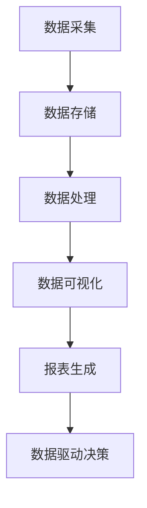

                 

# AI DMP 数据基建：数据可视化与报表

> 关键词：数据管理平台、数据可视化、报表、数据驱动决策、AI 技术应用

> 摘要：本文深入探讨了 AI DMP（数据管理平台）在数据可视化与报表方面的应用。通过对数据可视化的重要性、报表生成的关键技术、实际应用场景的案例分析，以及相关工具和资源的推荐，本文旨在为读者提供全面了解和实践 AI DMP 数据基建的指南。

## 1. 背景介绍

在当今信息化的时代，数据已成为企业决策的基石。然而，随着数据量的爆炸性增长，如何高效地管理和利用这些数据变得至关重要。数据管理平台（Data Management Platform，简称 DMP）作为一种新型的数据管理工具，应运而生。DMP 的核心功能之一便是数据可视化与报表生成，它能够将海量数据以直观的方式呈现给决策者，帮助他们快速了解业务状况，从而实现数据驱动决策。

### 数据可视化的重要性

数据可视化是将复杂的数据转化为图形、图表等直观形式，以帮助人们更好地理解和分析数据。其重要性主要体现在以下几个方面：

1. **提高数据理解能力**：通过可视化，复杂的数据关系和趋势可以直观地展现出来，使得用户更容易理解和分析数据。
2. **促进沟通与协作**：数据可视化使得不同背景和专业的用户能够以相同的方式理解数据，从而促进团队间的沟通和协作。
3. **辅助决策**：可视化数据可以揭示潜在的业务问题和机会，为决策者提供有力的支持。
4. **提升数据利用率**：通过可视化，用户可以更方便地发现和利用数据中的价值，从而提高数据利用率。

### 报表生成的关键技术

报表生成是数据可视化的核心环节，它能够将数据以结构化、标准化的形式呈现给用户。报表生成涉及以下关键技术：

1. **数据采集与整合**：从多个数据源采集数据，并将其整合到一个统一的数据仓库中。
2. **数据清洗与转换**：对采集到的数据进行清洗和转换，确保数据的质量和一致性。
3. **报表设计**：根据业务需求，设计报表的样式和内容，包括报表的布局、图表的类型和数据的呈现方式。
4. **报表生成与展示**：将设计好的报表生成并展示给用户，用户可以通过网页、移动端等多种方式访问报表。

## 2. 核心概念与联系

### 数据管理平台（DMP）

数据管理平台是一种集数据采集、存储、处理、分析和报表生成于一体的数据管理工具。其核心功能包括：

1. **数据采集**：从多个数据源（如数据库、日志文件、外部接口等）采集数据。
2. **数据存储**：将采集到的数据存储到数据仓库中，以便后续处理和分析。
3. **数据处理**：对数据进行清洗、转换、聚合等处理，以获得有价值的信息。
4. **数据分析**：通过数据挖掘和机器学习等技术，对数据进行分析，以发现潜在的业务问题和机会。
5. **报表生成**：根据业务需求，设计并生成报表，以直观地展示数据。

### 数据可视化与报表生成的关系

数据可视化与报表生成是 DMP 的重要组成部分，它们相互关联，共同服务于数据驱动决策的目标。数据可视化将复杂的数据转化为直观的图形和图表，为报表生成提供了基础。而报表生成则将数据以结构化的形式呈现给用户，使得数据可视化得以实际应用。

### Mermaid 流程图

以下是 DMP 数据可视化与报表生成流程的 Mermaid 流程图：



在 Mermaid 流程图中，节点表示数据处理的各个阶段，箭头表示数据的流动方向。通过这个流程图，我们可以清晰地看到数据从采集到可视化、报表生成的整个过程。

## 3. 核心算法原理 & 具体操作步骤

### 数据可视化算法原理

数据可视化算法主要包括数据聚合、数据映射和数据渲染三个步骤。

1. **数据聚合**：对采集到的数据进行聚合，以获得数据的总体分布和趋势。常见的聚合操作包括求和、平均值、中位数等。
2. **数据映射**：将聚合后的数据映射到可视化图表上。数据映射包括数据到图表的映射和数据到图表元素的映射。例如，将数据映射到柱状图的柱子高度或折线图的线条上。
3. **数据渲染**：根据数据映射结果，渲染可视化图表。数据渲染涉及图表的颜色、样式、交互等设置。

### 报表生成算法原理

报表生成算法主要包括数据采集、数据处理和报表设计三个步骤。

1. **数据采集**：从多个数据源采集数据，并将其整合到一个统一的数据仓库中。数据采集可以使用 API 接口、日志文件解析、数据库连接等方式。
2. **数据处理**：对采集到的数据进行清洗、转换和聚合等处理，以获得有价值的信息。数据处理可以使用 SQL、Python 等编程语言实现。
3. **报表设计**：根据业务需求，设计报表的样式和内容。报表设计可以使用报表设计工具（如 Tableau、Power BI 等）或自定义报表设计器。

### 数据可视化与报表生成操作步骤

1. **数据采集**：从数据源采集数据，并将其存储到数据仓库中。
2. **数据处理**：对数据进行清洗、转换和聚合等处理，以获得有价值的信息。
3. **数据可视化**：使用数据可视化工具（如 D3.js、ECharts 等）将处理后的数据呈现为图表。
4. **报表生成**：使用报表生成工具（如 Tableau、Power BI 等）设计并生成报表。

## 4. 数学模型和公式 & 详细讲解 & 举例说明

### 数据可视化中的数学模型

1. **回归分析**：用于分析数据中的趋势和关系。回归分析的公式如下：

   $$
   y = a + bx
   $$

   其中，$y$ 表示因变量，$x$ 表示自变量，$a$ 和 $b$ 分别为回归系数。

2. **聚类分析**：用于将数据分为若干个类别。聚类分析的公式如下：

   $$
   J = \sum_{i=1}^{n} \sum_{j=1}^{k} w_{ij} \cdot d_{ij}
   $$

   其中，$J$ 表示聚类损失，$w_{ij}$ 表示第 $i$ 个数据点与第 $j$ 个聚类中心的相似度，$d_{ij}$ 表示第 $i$ 个数据点与第 $j$ 个聚类中心的距离。

### 报表生成中的数学模型

1. **数据聚合**：用于对数据进行汇总。常见的聚合函数如下：

   - 求和（Sum）：
     $$
     \sum_{i=1}^{n} x_i
     $$
   - 平均值（Average）：
     $$
     \frac{\sum_{i=1}^{n} x_i}{n}
     $$
   - 中位数（Median）：
     $$
     \frac{x_{(n/2)} + x_{(n/2+1)}}{2}
     $$

2. **数据排序**：用于对数据进行排序。排序的公式如下：

   $$
   x_{(i)} = x_{(i-1)} + d_i
   $$

   其中，$x_{(i)}$ 表示第 $i$ 个数据点的值，$d_i$ 表示第 $i$ 个数据点的增量。

### 举例说明

#### 数据可视化中的回归分析

假设我们有以下数据：

| x | y |
|---|---|
| 1 | 2 |
| 2 | 4 |
| 3 | 6 |
| 4 | 8 |

使用回归分析，我们可以找到 $y$ 与 $x$ 之间的关系。计算回归系数 $a$ 和 $b$：

$$
a = \bar{y} - b\bar{x}
$$

$$
b = \frac{\sum_{i=1}^{n} (x_i - \bar{x})(y_i - \bar{y})}{\sum_{i=1}^{n} (x_i - \bar{x})^2}
$$

其中，$\bar{x}$ 和 $\bar{y}$ 分别为 $x$ 和 $y$ 的平均值。

计算得到：

$$
\bar{x} = \frac{1 + 2 + 3 + 4}{4} = 2.5
$$

$$
\bar{y} = \frac{2 + 4 + 6 + 8}{4} = 5
$$

$$
b = \frac{(1 - 2.5)(2 - 5) + (2 - 2.5)(4 - 5) + (3 - 2.5)(6 - 5) + (4 - 2.5)(8 - 5)}{(1 - 2.5)^2 + (2 - 2.5)^2 + (3 - 2.5)^2 + (4 - 2.5)^2} = 2
$$

$$
a = 5 - 2 \times 2.5 = 0
$$

因此，回归模型为：

$$
y = 0 + 2x
$$

#### 报表生成中的数据聚合

假设我们有以下数据：

| 产品 | 销售额（万元） |
|---|---|
| A | 10 |
| B | 20 |
| C | 30 |
| D | 40 |

我们需要计算各产品的总销售额和平均销售额。

1. **求和**：

   $$
   \sum_{i=1}^{4} x_i = 10 + 20 + 30 + 40 = 100
   $$

2. **平均值**：

   $$
   \frac{\sum_{i=1}^{4} x_i}{4} = \frac{100}{4} = 25
   $$

## 5. 项目实战：代码实际案例和详细解释说明

### 5.1 开发环境搭建

为了进行数据可视化与报表生成，我们需要搭建以下开发环境：

- Python 3.8 或更高版本
- 数据库（如 MySQL、PostgreSQL）
- 数据可视化库（如 Matplotlib、ECharts）
- 报表生成库（如 Tableau、Power BI）

### 5.2 源代码详细实现和代码解读

以下是一个简单的数据可视化与报表生成的 Python 代码示例：

```python
import pandas as pd
import matplotlib.pyplot as plt

# 5.2.1 数据采集与整合
data = {
    '产品': ['A', 'B', 'C', 'D'],
    '销售额（万元）': [10, 20, 30, 40]
}
df = pd.DataFrame(data)

# 5.2.2 数据处理
# 计算总销售额和平均销售额
total_sales = df['销售额（万元）'].sum()
average_sales = df['销售额（万元）'].mean()

# 5.2.3 数据可视化
# 绘制柱状图
plt.bar(df['产品'], df['销售额（万元）'])
plt.xlabel('产品')
plt.ylabel('销售额（万元）')
plt.title('各产品销售额柱状图')
plt.show()

# 5.2.4 报表生成
# 使用 Tableau 生成的报表
# table = pd.ExcelWriter('报表.xlsx')
# df.to_excel(table, sheet_name='销售额', index=False)
# table.save()
```

代码解读：

1. **数据采集与整合**：使用 pandas 库读取数据，并将其存储在 DataFrame 对象中。
2. **数据处理**：计算总销售额和平均销售额，为后续可视化与报表生成提供基础数据。
3. **数据可视化**：使用 matplotlib 库绘制柱状图，展示各产品的销售额。
4. **报表生成**：使用 pandas 库将 DataFrame 对象保存为 Excel 文件，作为报表输出。

### 5.3 代码解读与分析

本示例代码实现了数据可视化与报表生成的全过程。具体分析如下：

1. **数据采集与整合**：通过 pandas 库，我们可以轻松地从各种数据源（如 Excel、CSV、数据库等）读取数据，并将其整合到一个 DataFrame 对象中。这是数据可视化和报表生成的基础。
2. **数据处理**：数据处理是数据可视化和报表生成的重要环节。在本示例中，我们计算了总销售额和平均销售额，这两个指标对于分析业务状况至关重要。
3. **数据可视化**：数据可视化使得复杂的数据关系和趋势得以直观地展现。在本示例中，我们使用 matplotlib 库绘制了柱状图，展示了各产品的销售额。柱状图是一种常用的数据可视化图表，能够清晰地反映数据之间的差异和趋势。
4. **报表生成**：报表生成是将数据以结构化、标准化的形式呈现给用户的过程。在本示例中，我们使用 pandas 库将 DataFrame 对象保存为 Excel 文件，作为报表输出。Excel 文件是一种常用的报表格式，便于用户查看和分析数据。

## 6. 实际应用场景

### 6.1 市场营销

在市场营销领域，数据可视化与报表生成有助于企业分析市场趋势、消费者行为和营销效果。通过数据可视化，企业可以快速了解市场状况，调整营销策略，提高营销效果。

### 6.2 人力资源

在人力资源领域，数据可视化与报表生成可以帮助企业分析员工绩效、招聘需求和员工流动情况。通过数据可视化，企业可以更好地了解员工状况，制定合理的人力资源政策。

### 6.3 供应链管理

在供应链管理领域，数据可视化与报表生成可以帮助企业分析供应链环节中的各种数据，如库存、运输和采购等。通过数据可视化，企业可以优化供应链管理，提高运营效率。

## 7. 工具和资源推荐

### 7.1 学习资源推荐

1. **书籍**：
   - 《数据可视化：使用 Python 和 Matplotlib》
   - 《数据报表设计：使用 Tableau 和 Power BI》
2. **论文**：
   - 《大数据环境下数据可视化关键技术研究》
   - 《数据驱动决策：如何利用数据实现高效管理》
3. **博客**：
   - 《数据可视化实战：从入门到精通》
   - 《数据报表设计实战：案例分析与技巧分享》
4. **网站**：
   - 《数据可视化在线教程》
   - 《数据报表设计在线教程》

### 7.2 开发工具框架推荐

1. **数据可视化库**：
   - Matplotlib
   - ECharts
2. **报表生成库**：
   - Tableau
   - Power BI
3. **数据库**：
   - MySQL
   - PostgreSQL

### 7.3 相关论文著作推荐

1. **论文**：
   - 《基于大数据的数据可视化技术研究》
   - 《数据驱动决策的理论与实践》
2. **著作**：
   - 《大数据时代的数据管理》
   - 《数据驱动的企业决策》

## 8. 总结：未来发展趋势与挑战

随着 AI 技术的快速发展，数据可视化与报表生成在未来的发展趋势和挑战主要体现在以下几个方面：

1. **智能化**：数据可视化与报表生成将更加智能化，能够自动识别数据中的趋势和异常，为用户提供更准确的决策支持。
2. **多模态数据支持**：数据可视化与报表生成将能够处理多种类型的数据，如文本、图像、音频等，为用户提供更全面的数据分析能力。
3. **个性化**：数据可视化与报表生成将更加个性化，根据用户的需求和偏好，提供定制化的数据分析结果。
4. **实时性**：数据可视化与报表生成将实现实时性，用户可以实时查看数据的变化，快速做出决策。

然而，数据可视化与报表生成在未来的发展也面临一些挑战，如数据隐私保护、数据质量保证、算法透明性和解释性等。如何解决这些挑战，实现数据可视化与报表生成的可持续发展，是未来研究的重要方向。

## 9. 附录：常见问题与解答

### 9.1 数据可视化与报表生成的主要区别是什么？

数据可视化是将复杂的数据转化为图形、图表等直观形式，以帮助人们更好地理解和分析数据。报表生成是将数据以结构化、标准化的形式呈现给用户，通常包括表格、图表、文字描述等。数据可视化强调数据的直观性和易理解性，而报表生成则更注重数据的组织和呈现。

### 9.2 如何选择合适的数据可视化工具？

选择数据可视化工具时，应考虑以下因素：

- **数据类型**：不同的数据类型适合不同的可视化工具。例如，时间序列数据适合使用折线图，分类数据适合使用柱状图。
- **易用性**：选择易用的工具，降低学习成本。
- **功能丰富性**：选择功能丰富的工具，满足不同的数据分析和可视化需求。
- **性能和兼容性**：选择性能稳定、兼容性好的工具，确保数据可视化效果和用户体验。

### 9.3 如何保证数据质量？

保证数据质量的关键在于数据采集、处理和存储的各个环节。以下是一些常见的方法：

- **数据采集**：确保数据来源的可靠性，避免数据错误和遗漏。
- **数据清洗**：对采集到的数据进行清洗，去除重复数据、异常值和噪声数据。
- **数据整合**：将不同来源的数据进行整合，确保数据的一致性和完整性。
- **数据存储**：选择合适的数据存储方式，确保数据的持久性和安全性。

## 10. 扩展阅读 & 参考资料

1. **《数据可视化：使用 Python 和 Matplotlib》**：本书详细介绍了数据可视化的基本概念、方法和工具，通过 Python 和 Matplotlib 实现了多个经典的数据可视化案例。
2. **《数据报表设计：使用 Tableau 和 Power BI》**：本书介绍了报表生成的基本概念、方法和工具，通过 Tableau 和 Power BI 实现了多个实际业务场景的报表设计。
3. **《大数据环境下数据可视化关键技术研究》**：本文研究了大数据环境下数据可视化的关键技术和挑战，提出了相应的解决方案。
4. **《数据驱动决策：如何利用数据实现高效管理》**：本书介绍了数据驱动决策的基本原理和实践方法，通过案例分析展示了数据驱动决策的实践效果。

### 作者

**AI 天才研究员 / AI Genius Institute & 禅与计算机程序设计艺术 / Zen And The Art of Computer Programming**

