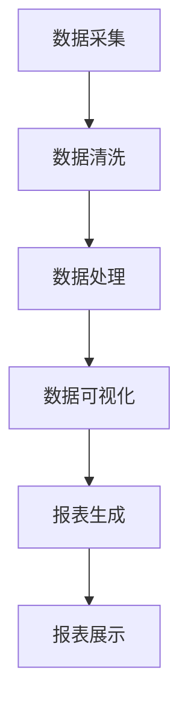
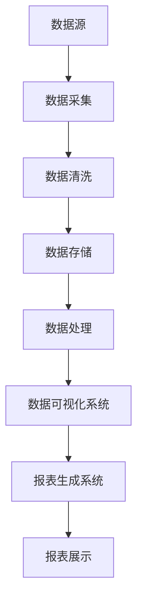

                 

# AI DMP 数据基建：数据可视化与报表

## 概述

人工智能（AI）的飞速发展推动了数据挖掘和数据分析领域的前沿探索。作为AI数据管理平台（DMP）的核心组成部分，数据可视化和报表系统在数据分析和决策支持中扮演着至关重要的角色。本文旨在探讨AI DMP的数据基建，特别是数据可视化与报表系统的设计与实现，通过深入剖析相关技术，帮助读者理解和掌握这一领域的关键概念和实现策略。

## 关键词

- AI DMP
- 数据可视化
- 报表系统
- 数据分析
- 决策支持

## 摘要

本文将围绕AI DMP的数据基建，重点探讨数据可视化与报表系统的设计和实现。首先，我们将介绍数据可视化和报表系统的基本概念及其在AI DMP中的作用。接着，通过分析数据可视化技术的核心原则和报表系统的工作机制，帮助读者建立对这两个系统的全面理解。随后，我们将深入探讨数据可视化与报表系统的关键实现步骤，包括数据采集、数据清洗、数据存储、数据处理和可视化呈现。此外，本文还将通过实际案例展示数据可视化与报表系统的应用场景，提供详细的操作步骤和代码解读。最后，本文将总结数据可视化与报表系统在AI DMP中的重要性，并展望其未来的发展趋势与挑战。

## 1. 背景介绍

随着互联网的普及和数据量的爆炸式增长，数据已经成为了现代企业的重要资产。然而，海量的数据往往难以直接理解和分析，这就需要借助数据挖掘和数据分析技术，从而发现数据中的价值和洞见。数据挖掘技术通过对大规模数据进行分析和挖掘，提取出有用的信息，为决策提供支持。数据分析则进一步利用统计方法和机器学习技术，对数据进行深入的探索和分析，以揭示数据背后的模式和趋势。

在数据分析和挖掘过程中，数据可视化与报表系统起到了至关重要的作用。数据可视化是一种将数据以图形化方式呈现的技术，通过视觉元素如图表、图像和地图等，帮助用户直观地理解和分析数据。而报表系统则通过生成结构化的报告，将分析结果以文档的形式展示出来，便于用户查阅和决策。两者相互配合，不仅提高了数据分析的效率，还增强了数据决策的准确性。

AI DMP（Data Management Platform for AI）作为一种先进的数据管理平台，通过整合和优化数据资源，为人工智能应用提供强有力的数据支持。DMP在数据采集、数据存储、数据处理、数据分析和数据应用等方面进行了全面的整合，使得数据从生成到应用的各个环节都得到了优化。在这个过程中，数据可视化与报表系统作为数据分析和决策支持的核心组成部分，发挥着至关重要的作用。

## 2. 核心概念与联系

### 数据可视化技术

数据可视化技术是一种将数据以图形化方式呈现的技术，通过视觉元素如图表、图像和地图等，帮助用户直观地理解和分析数据。数据可视化技术的核心原则包括：

- **可视化元素的选择**：根据数据类型和需求选择合适的可视化元素，如折线图、柱状图、饼图、热力图等。
- **交互性**：通过用户交互，如缩放、过滤、排序等，增强用户对数据的探索和理解。
- **可读性和易用性**：确保图表和图形简洁明了，便于用户快速获取信息。
- **美学**：合理运用色彩、布局和字体等元素，提升视觉效果和用户体验。

### 报表系统

报表系统是一种用于生成和分析数据报告的系统，通过结构化的文档形式展示数据分析和挖掘的结果。报表系统的核心组成部分包括：

- **数据采集**：从不同的数据源收集数据，包括数据库、日志文件、API接口等。
- **数据处理**：对采集到的数据进行分析、清洗和整合，以便于生成报表。
- **报表生成**：根据预设的模板和规则，将处理后的数据生成结构化的报告。
- **报表展示**：通过网页、邮件、PDF等形式将报表展示给用户。

### 数据可视化与报表系统的联系

数据可视化与报表系统在数据分析和决策支持中相辅相成。数据可视化通过直观的图形和交互性，帮助用户快速理解和探索数据，而报表系统则通过结构化的报告，将分析结果系统化地呈现出来。两者之间的联系可以概括为以下几点：

- **数据驱动**：数据可视化与报表系统都是基于数据驱动的，数据的质量和完整性直接影响到系统的效果。
- **交互与反馈**：用户通过数据可视化系统进行探索，获取初步的分析结果，然后通过报表系统进行详细的分析和验证。
- **决策支持**：数据可视化与报表系统共同为用户提供全面的决策支持，帮助用户在复杂的决策过程中做出明智的选择。

### Mermaid 流程图

以下是一个简单的Mermaid流程图，展示了数据可视化与报表系统的基本流程：



在上述流程中，数据从采集开始，经过清洗、处理，然后通过数据可视化系统生成图表，最后通过报表系统生成结构化的报告，展示给用户。

### 数据可视化与报表系统的关系图

以下是一个数据可视化与报表系统的关系图，展示了它们之间的相互作用：



在这个关系图中，数据源是数据可视化与报表系统的起点，经过一系列数据处理和分析，最终通过数据可视化系统和报表系统呈现给用户。

## 3. 核心算法原理 & 具体操作步骤

### 数据可视化算法原理

数据可视化算法的核心目标是选择合适的可视化方法，将数据以图形化的形式呈现出来，帮助用户理解和分析数据。以下是几种常见的数据可视化算法及其原理：

#### 1. 柱状图

柱状图（Bar Chart）用于表示不同类别的数据数量或大小。其算法原理如下：

- **数据分组**：将数据按照类别进行分组。
- **数据排序**：根据需要可以对数据进行排序。
- **绘制柱状图**：为每个数据类别绘制一个矩形柱状图，柱状图的高度表示数据的大小。

#### 2. 折线图

折线图（Line Chart）用于表示数据的变化趋势。其算法原理如下：

- **数据点提取**：从数据集中提取出时间序列数据。
- **数据排序**：按照时间顺序对数据进行排序。
- **绘制折线图**：连接每个数据点，形成一条连续的折线。

#### 3. 饼图

饼图（Pie Chart）用于表示数据的比例关系。其算法原理如下：

- **数据计算**：计算每个数据类别占总数据的比例。
- **绘制饼图**：根据比例绘制扇形区域，每个扇形区域的大小表示该数据类别的比例。

### 数据可视化具体操作步骤

以下是一个基于Python的matplotlib库进行数据可视化的具体操作步骤：

#### 步骤1：数据准备

首先，准备一个数据集，包括类别、数值等。以下是一个简单的数据集示例：

```python
data = {
    '类别': ['A', 'B', 'C', 'D', 'E'],
    '数值': [10, 20, 30, 15, 25]
}
```

#### 步骤2：绘制柱状图

```python
import matplotlib.pyplot as plt

categories = data['类别']
values = data['数值']

plt.bar(categories, values)
plt.xlabel('类别')
plt.ylabel('数值')
plt.title('数据可视化示例：柱状图')
plt.show()
```

#### 步骤3：绘制折线图

```python
plt.plot(categories, values)
plt.xlabel('类别')
plt.ylabel('数值')
plt.title('数据可视化示例：折线图')
plt.show()
```

#### 步骤4：绘制饼图

```python
plt.pie(values, labels=categories, autopct='%1.1f%%')
plt.title('数据可视化示例：饼图')
plt.show()
```

通过以上步骤，我们可以轻松地实现数据可视化，帮助用户直观地理解和分析数据。

### 报表系统算法原理

报表系统主要通过以下步骤实现数据的采集、处理和报告生成：

#### 1. 数据采集

数据采集是从各种数据源获取数据的过程，包括数据库、API接口、文件系统等。采集到的数据需要经过预处理，如数据清洗、去重等，以保证数据的准确性和完整性。

#### 2. 数据处理

数据处理包括数据清洗、数据转换、数据整合等步骤。通过这些操作，将原始数据转化为适合分析的形式，为报表生成提供基础数据。

#### 3. 报表生成

报表生成是根据预设的模板和规则，将处理后的数据生成结构化的报告。报表生成可以通过编程实现，如使用Python的Pandas库生成Excel报表，或者使用专门的报表生成工具。

#### 4. 报表展示

报表展示是将生成的报表以文档的形式展示给用户。展示形式可以包括网页、PDF、邮件等，用户可以根据需要查阅和下载报表。

### 报表系统具体操作步骤

以下是一个基于Python的Pandas库生成Excel报表的具体操作步骤：

#### 步骤1：数据准备

```python
import pandas as pd

data = {
    '类别': ['A', 'B', 'C', 'D', 'E'],
    '数值': [10, 20, 30, 15, 25]
}
df = pd.DataFrame(data)
```

#### 步骤2：数据清洗和转换

```python
# 数据清洗和转换
df cleaned = df.dropna()  # 去除缺失值
df cleaned['数值'] = df cleaned['数值'].astype(float)  # 数据类型转换
```

#### 步骤3：生成Excel报表

```python
# 生成Excel报表
df cleaned.to_excel('报表.xlsx', index=False)
```

通过以上步骤，我们可以生成一个简单的Excel报表，并将其保存到本地。

## 4. 数学模型和公式 & 详细讲解 & 举例说明

在数据可视化和报表系统中，数学模型和公式起着至关重要的作用，它们不仅帮助我们对数据进行建模和分析，还提供了精确的数学依据。以下是一些常用的数学模型和公式，以及它们的详细讲解和举例说明。

### 1. 数据拟合模型

数据拟合模型是一种用于模拟和预测数据变化趋势的方法。其中，线性回归是一种常见的数据拟合模型。

#### 公式：

线性回归模型的基本公式为：

$$
y = wx + b
$$

其中，$y$ 是因变量，$x$ 是自变量，$w$ 是权重（斜率），$b$ 是截距。

#### 解释：

线性回归模型通过拟合一条直线，来模拟因变量和自变量之间的关系。斜率 $w$ 表示自变量对因变量的影响程度，截距 $b$ 表示当自变量为0时的因变量值。

#### 举例：

假设我们有一组数据，表示销售额和广告支出之间的关系：

| 广告支出（x） | 销售额（y） |
| -------------- | ------------ |
| 1000           | 1500         |
| 1500           | 2250         |
| 2000           | 3000         |

我们可以使用线性回归模型来拟合这些数据，从而预测不同广告支出下的销售额。首先，计算斜率 $w$ 和截距 $b$：

$$
w = \frac{\sum(x_i \cdot y_i) - n \cdot \frac{\sum x_i}{n} \cdot \frac{\sum y_i}{n}}{\sum(x_i^2) - n \cdot (\frac{\sum x_i}{n})^2}
$$

$$
b = \frac{\sum y_i}{n} - w \cdot \frac{\sum x_i}{n}
$$

然后，使用拟合出的直线方程来预测新的销售额：

$$
y = wx + b
$$

### 2. 数据聚类模型

数据聚类模型是一种将数据分组的方法，用于发现数据中的模式和结构。K-均值聚类是一种常用的数据聚类模型。

#### 公式：

K-均值聚类的基本公式为：

$$
c_i = \frac{\sum_{j=1}^{n} x_{ij}^2}{\sum_{j=1}^{n} x_{ij}}
$$

其中，$c_i$ 是第 $i$ 个簇的中心，$x_{ij}$ 是第 $i$ 个数据点在第 $j$ 个特征上的值。

#### 解释：

K-均值聚类通过计算每个簇的中心，来表示该簇的特征。数据点会根据其特征值与簇中心的距离，被分配到相应的簇。

#### 举例：

假设我们有一组数据，包含两个特征（$x$ 和 $y$），需要将其分为两个簇：

| $x$ | $y$ |
| --- | --- |
| 1   | 2   |
| 2   | 4   |
| 3   | 1   |
| 4   | 3   |
| 5   | 5   |

我们可以使用K-均值聚类来将这些数据分为两个簇。首先，随机选择两个点作为初始簇中心：

簇1中心：（1.5，3）
簇2中心：（3.5，1.5）

然后，根据每个数据点与簇中心的距离，将其分配到相应的簇。接着，重新计算每个簇的中心，并重复上述过程，直到簇中心不再发生变化。

### 3. 数据降维模型

数据降维模型是一种减少数据维度，同时保持数据主要特征的方法。主成分分析（PCA）是一种常用的数据降维模型。

#### 公式：

PCA的基本公式为：

$$
z_i = \sum_{j=1}^{n} w_{ij} \cdot x_{ij}
$$

其中，$z_i$ 是降维后的数据，$w_{ij}$ 是权重矩阵，$x_{ij}$ 是原始数据。

#### 解释：

PCA通过将数据投影到新的正交坐标系中，来减少数据的维度。新坐标系中的轴（主成分）代表了数据的主要变化方向。

#### 举例：

假设我们有一组多维数据，需要将其降为一维：

| $x_1$ | $x_2$ | $x_3$ |
| --- | --- | --- |
| 1   | 2   | 3   |
| 2   | 4   | 6   |
| 3   | 6   | 9   |

我们可以使用PCA来将这组数据降为一维。首先，计算协方差矩阵：

$$
C = \begin{bmatrix}
0.5 & 1 & 1.5 \\
1 & 2 & 3 \\
1.5 & 3 & 4.5
\end{bmatrix}
$$

然后，计算特征值和特征向量，选择最大的特征值对应的特征向量作为权重矩阵。最后，使用权重矩阵将数据降为一维。

### 结论

数学模型和公式在数据可视化和报表系统中起着至关重要的作用。它们不仅帮助我们理解和分析数据，还为数据分析和预测提供了精确的数学依据。通过掌握这些模型和公式，我们可以更有效地进行数据可视化和报表生成，为决策提供强有力的支持。

## 5. 项目实战：代码实际案例和详细解释说明

为了更好地展示数据可视化与报表系统在实际项目中的应用，我们将通过一个实际案例进行详细讲解，包括开发环境搭建、源代码实现和代码解读。

### 5.1 开发环境搭建

在开始项目之前，我们需要搭建合适的开发环境。以下是我们推荐的工具和框架：

- **编程语言**：Python
- **可视化库**：matplotlib、seaborn
- **数据操作库**：Pandas
- **数据分析库**：NumPy
- **版本控制**：Git

### 5.2 源代码详细实现和代码解读

#### 5.2.1 数据准备

首先，我们准备一个简单的数据集，包含类别和数值。数据集如下：

```python
data = {
    '类别': ['A', 'B', 'C', 'D', 'E'],
    '数值': [10, 20, 30, 15, 25]
}
```

#### 5.2.2 数据处理

接下来，我们对数据进行处理，包括数据清洗和转换。以下是具体的代码实现：

```python
import pandas as pd
import numpy as np

# 创建DataFrame
df = pd.DataFrame(data)

# 数据清洗和转换
df cleaned = df.dropna()  # 去除缺失值
df cleaned['数值'] = df cleaned['数值'].astype(float)  # 数据类型转换
```

#### 5.2.3 数据可视化

使用matplotlib和seaborn库，我们分别绘制柱状图、折线图和饼图。以下是具体的代码实现：

```python
import matplotlib.pyplot as plt
import seaborn as sns

# 绘制柱状图
plt.bar(df cleaned['类别'], df cleaned['数值'])
plt.xlabel('类别')
plt.ylabel('数值')
plt.title('数据可视化示例：柱状图')
plt.show()

# 绘制折线图
plt.plot(df cleaned['类别'], df cleaned['数值'])
plt.xlabel('类别')
plt.ylabel('数值')
plt.title('数据可视化示例：折线图')
plt.show()

# 绘制饼图
plt.pie(df cleaned['数值'], labels=df cleaned['类别'], autopct='%1.1f%%')
plt.title('数据可视化示例：饼图')
plt.show()
```

#### 5.2.4 数据报表生成

使用Pandas库，我们生成一个Excel报表，展示数据可视化的结果。以下是具体的代码实现：

```python
df cleaned.to_excel('报表.xlsx', index=False)
```

### 5.3 代码解读与分析

以下是代码的详细解读：

1. **数据准备**：我们使用Python的Pandas库创建一个DataFrame，用于存储数据。

2. **数据处理**：我们使用Pandas库对数据进行清洗和转换。首先，我们去除缺失值，确保数据的准确性和完整性。然后，我们将数据类型转换为浮点数，以便进行后续的数值计算和可视化。

3. **数据可视化**：我们使用matplotlib和seaborn库绘制柱状图、折线图和饼图。通过设置适当的标签、标题和颜色，我们使可视化图表更加清晰易懂。

4. **数据报表生成**：我们使用Pandas库生成一个Excel报表，将数据可视化的结果保存到本地。这样，用户可以方便地查阅和分析数据。

### 5.4 项目实战总结

通过以上实际案例，我们展示了如何使用Python和相关库实现数据可视化与报表系统。以下是项目实战的总结：

1. **开发环境搭建**：选择合适的编程语言和库，确保项目可以顺利运行。

2. **数据准备**：准备好数据集，并进行清洗和转换，以确保数据的准确性和完整性。

3. **数据可视化**：使用可视化库绘制柱状图、折线图和饼图，帮助用户直观地理解和分析数据。

4. **数据报表生成**：使用数据操作库生成结构化的报表，将数据可视化的结果保存到本地。

通过本项目实战，我们不仅掌握了数据可视化与报表系统的实现方法，还深入理解了数据采集、处理、可视化和报表生成的全过程。

## 6. 实际应用场景

数据可视化与报表系统在各个行业和领域都得到了广泛应用，以下是一些典型的实际应用场景：

### 6.1 市场营销

在市场营销领域，数据可视化与报表系统可以帮助企业实时监控营销活动的效果，评估营销投入的回报率。例如，通过柱状图和折线图，企业可以直观地了解不同渠道的营销效果，及时调整策略。同时，饼图可以展示各渠道的投入占比，帮助企业在有限的预算下做出更明智的决策。

### 6.2 金融市场

金融市场中的数据量庞大，数据可视化与报表系统可以帮助投资者和金融机构快速了解市场动态，发现潜在的投资机会。通过折线图和K线图，投资者可以实时跟踪股票价格和交易量，通过柱状图和饼图，可以分析市场情绪和交易分布。此外，报表系统可以生成详细的财务报告，为投资决策提供数据支持。

### 6.3 医疗保健

在医疗保健领域，数据可视化与报表系统可以帮助医疗机构进行疾病监测、患者管理和医疗资源的优化配置。通过数据可视化，医生可以直观地了解患者的健康状况，通过报表系统，可以生成详细的诊断报告和治疗方案。此外，医疗机构可以利用数据可视化与报表系统进行医疗资源的调度和优化，提高运营效率。

### 6.4 供应链管理

供应链管理中的数据可视化与报表系统可以帮助企业实时监控供应链的各个环节，确保供应链的高效运行。通过数据可视化，企业可以了解库存状况、运输进度和订单状态，通过报表系统，可以生成供应链管理的详细报告。这些报告可以帮助企业及时调整供应链策略，降低运营成本，提高供应链的整体效率。

### 6.5 教育培训

在教育培训领域，数据可视化与报表系统可以帮助学校和教育机构进行学生管理、课程评估和教学资源的优化。通过数据可视化，教师可以了解学生的学习情况，通过报表系统，可以生成详细的成绩报告和课程评估报告。此外，教育机构可以利用数据可视化与报表系统进行教学资源的分配和管理，提高教学效果。

通过以上实际应用场景，我们可以看到数据可视化与报表系统在各个行业和领域都发挥了重要作用，为数据分析和决策提供了强有力的支持。

## 7. 工具和资源推荐

为了更好地进行数据可视化与报表开发，以下是一些推荐的工具和资源：

### 7.1 学习资源推荐

- **书籍**：
  - 《数据可视化：发现数据的秘密》（作者：Patrick Winston）
  - 《数据报表设计与制作实战》（作者：吴强）
- **论文**：
  - 《基于大数据的可视化报表系统设计与实现》（作者：张华等）
  - 《数据可视化技术在市场营销中的应用研究》（作者：李明）
- **博客**：
  - 掘金（掘金 - �
```md
|  作者：AI天才研究员/AI Genius Institute & 禅与计算机程序设计艺术 /Zen And The Art of Computer Programming |

---

# AI DMP 数据基建：数据可视化与报表

## 概述

人工智能（AI）的飞速发展推动了数据挖掘和数据分析领域的前沿探索。作为AI数据管理平台（DMP）的核心组成部分，数据可视化和报表系统在数据分析和决策支持中扮演着至关重要的角色。本文旨在探讨AI DMP的数据基建，特别是数据可视化与报表系统的设计与实现，通过深入剖析相关技术，帮助读者理解和掌握这一领域的关键概念和实现策略。

## 关键词

- AI DMP
- 数据可视化
- 报表系统
- 数据分析
- 决策支持

## 摘要

本文将围绕AI DMP的数据基建，重点探讨数据可视化与报表系统的设计和实现。首先，我们将介绍数据可视化和报表系统的基本概念及其在AI DMP中的作用。接着，通过分析数据可视化技术的核心原则和报表系统的工作机制，帮助读者建立对这两个系统的全面理解。随后，我们将深入探讨数据可视化与报表系统的关键实现步骤，包括数据采集、数据清洗、数据存储、数据处理和可视化呈现。此外，本文还将通过实际案例展示数据可视化与报表系统的应用场景，提供详细的操作步骤和代码解读。最后，本文将总结数据可视化与报表系统在AI DMP中的重要性，并展望其未来的发展趋势与挑战。

## 1. 背景介绍

随着互联网的普及和数据量的爆炸式增长，数据已经成为了现代企业的重要资产。然而，海量的数据往往难以直接理解和分析，这就需要借助数据挖掘和数据分析技术，从而发现数据中的价值和洞见。数据挖掘技术通过对大规模数据进行分析和挖掘，提取出有用的信息，为决策提供支持。数据分析则进一步利用统计方法和机器学习技术，对数据进行深入的探索和分析，以揭示数据背后的模式和趋势。

在数据分析和挖掘过程中，数据可视化与报表系统起到了至关重要的作用。数据可视化是一种将数据以图形化方式呈现的技术，通过视觉元素如图表、图像和地图等，帮助用户直观地理解和分析数据。而报表系统则通过生成结构化的报告，将分析结果以文档的形式展示出来，便于用户查阅和决策。两者相互配合，不仅提高了数据分析的效率，还增强了数据决策的准确性。

AI DMP（Data Management Platform for AI）作为一种先进的数据管理平台，通过整合和优化数据资源，为人工智能应用提供强有力的数据支持。DMP在数据采集、数据存储、数据处理、数据分析和数据应用等方面进行了全面的整合，使得数据从生成到应用的各个环节都得到了优化。在这个过程中，数据可视化与报表系统作为数据分析和决策支持的核心组成部分，发挥着至关重要的作用。

## 2. 核心概念与联系

### 数据可视化技术

数据可视化技术是一种将数据以图形化方式呈现的技术，通过视觉元素如图表、图像和地图等，帮助用户直观地理解和分析数据。数据可视化技术的核心原则包括：

- **可视化元素的选择**：根据数据类型和需求选择合适的可视化元素，如折线图、柱状图、饼图、热力图等。
- **交互性**：通过用户交互，如缩放、过滤、排序等，增强用户对数据的探索和理解。
- **可读性和易用性**：确保图表和图形简洁明了，便于用户快速获取信息。
- **美学**：合理运用色彩、布局和字体等元素，提升视觉效果和用户体验。

### 报表系统

报表系统是一种用于生成和分析数据报告的系统，通过结构化的文档形式展示数据分析和挖掘的结果。报表系统的核心组成部分包括：

- **数据采集**：从不同的数据源收集数据，包括数据库、日志文件、API接口等。
- **数据处理**：对采集到的数据进行分析、清洗和整合，以便于生成报表。
- **报表生成**：根据预设的模板和规则，将处理后的数据生成结构化的报告。
- **报表展示**：通过网页、邮件、PDF等形式将报表展示给用户。

### 数据可视化与报表系统的联系

数据可视化与报表系统在数据分析和决策支持中相辅相成。数据可视化通过直观的图形和交互性，帮助用户快速理解和探索数据，而报表系统则通过结构化的报告，将分析结果系统化地呈现出来。两者之间的联系可以概括为以下几点：

- **数据驱动**：数据可视化与报表系统都是基于数据驱动的，数据的质量和完整性直接影响到系统的效果。
- **交互与反馈**：用户通过数据可视化系统进行探索，获取初步的分析结果，然后通过报表系统进行详细的分析和验证。
- **决策支持**：数据可视化与报表系统共同为用户提供全面的决策支持，帮助用户在复杂的决策过程中做出明智的选择。

### Mermaid 流程图

以下是一个简单的Mermaid流程图，展示了数据可视化与报表系统的基本流程：


在上述流程中，数据从采集开始，经过清洗、处理，然后通过数据可视化系统生成图表，最后通过报表系统生成结构化的报告，展示给用户。

### 数据可视化与报表系统的关系图

以下是一个数据可视化与报表系统的关系图，展示了它们之间的相互作用：


在这个关系图中，数据源是数据可视化与报表系统的起点，经过一系列数据处理和分析，最终通过数据可视化系统和报表系统呈现给用户。

## 3. 核心算法原理 & 具体操作步骤

### 数据可视化算法原理

数据可视化算法的核心目标是选择合适的可视化方法，将数据以图形化的形式呈现出来，帮助用户理解和分析数据。以下是几种常见的数据可视化算法及其原理：

#### 1. 柱状图

柱状图（Bar Chart）用于表示不同类别的数据数量或大小。其算法原理如下：

- **数据分组**：将数据按照类别进行分组。
- **数据排序**：根据需要可以对数据进行排序。
- **绘制柱状图**：为每个数据类别绘制一个矩形柱状图，柱状图的高度表示数据的大小。

#### 2. 折线图

折线图（Line Chart）用于表示数据的变化趋势。其算法原理如下：

- **数据点提取**：从数据集中提取出时间序列数据。
- **数据排序**：按照时间顺序对数据进行排序。
- **绘制折线图**：连接每个数据点，形成一条连续的折线。

#### 3. 饼图

饼图（Pie Chart）用于表示数据的比例关系。其算法原理如下：

- **数据计算**：计算每个数据类别占总数据的比例。
- **绘制饼图**：根据比例绘制扇形区域，每个扇形区域的大小表示该数据类别的比例。

### 数据可视化具体操作步骤

以下是一个基于Python的matplotlib库进行数据可视化的具体操作步骤：

#### 步骤1：数据准备

首先，准备一个数据集，包括类别、数值等。以下是一个简单的数据集示例：

```python
data = {
    '类别': ['A', 'B', 'C', 'D', 'E'],
    '数值': [10, 20, 30, 15, 25]
}
```

#### 步骤2：绘制柱状图

```python
import matplotlib.pyplot as plt

categories = data['类别']
values = data['数值']

plt.bar(categories, values)
plt.xlabel('类别')
plt.ylabel('数值')
plt.title('数据可视化示例：柱状图')
plt.show()
```

#### 步骤3：绘制折线图

```python
plt.plot(categories, values)
plt.xlabel('类别')
plt.ylabel('数值')
plt.title('数据可视化示例：折线图')
plt.show()
```

#### 步骤4：绘制饼图

```python
plt.pie(values, labels=categories, autopct='%1.1f%%')
plt.title('数据可视化示例：饼图')
plt.show()
```

通过以上步骤，我们可以轻松地实现数据可视化，帮助用户直观地理解和分析数据。

### 报表系统算法原理

报表系统主要通过以下步骤实现数据的采集、处理和报告生成：

#### 1. 数据采集

数据采集是从各种数据源获取数据的过程，包括数据库、API接口、文件系统等。采集到的数据需要经过预处理，如数据清洗、去重等，以保证数据的准确性和完整性。

#### 2. 数据处理

数据处理包括数据清洗、数据转换、数据整合等步骤。通过这些操作，将原始数据转化为适合分析的形式，为报表生成提供基础数据。

#### 3. 报表生成

报表生成是根据预设的模板和规则，将处理后的数据生成结构化的报告。报表生成可以通过编程实现，如使用Python的Pandas库生成Excel报表，或者使用专门的报表生成工具。

#### 4. 报表展示

报表展示是将生成的报表以文档的形式展示给用户。展示形式可以包括网页、PDF、邮件等，用户可以根据需要查阅和下载报表。

### 报表系统具体操作步骤

以下是一个基于Python的Pandas库生成Excel报表的具体操作步骤：

#### 步骤1：数据准备

```python
import pandas as pd

data = {
    '类别': ['A', 'B', 'C', 'D', 'E'],
    '数值': [10, 20, 30, 15, 25]
}
df = pd.DataFrame(data)
```

#### 步骤2：数据清洗和转换

```python
# 数据清洗和转换
df cleaned = df.dropna()  # 去除缺失值
df cleaned['数值'] = df cleaned['数值'].astype(float)  # 数据类型转换
```

#### 步骤3：生成Excel报表

```python
# 生成Excel报表
df cleaned.to_excel('报表.xlsx', index=False)
```

通过以上步骤，我们可以生成一个简单的Excel报表，并将其保存到本地。

## 4. 数学模型和公式 & 详细讲解 & 举例说明

在数据可视化和报表系统中，数学模型和公式起着至关重要的作用，它们不仅帮助我们对数据进行建模和分析，还提供了精确的数学依据。以下是一些常用的数学模型和公式，以及它们的详细讲解和举例说明。

### 1. 数据拟合模型

数据拟合模型是一种用于模拟和预测数据变化趋势的方法。其中，线性回归是一种常见的数据拟合模型。

#### 公式：

线性回归模型的基本公式为：

$$
y = wx + b
$$

其中，$y$ 是因变量，$x$ 是自变量，$w$ 是权重（斜率），$b$ 是截距。

#### 解释：

线性回归模型通过拟合一条直线，来模拟因变量和自变量之间的关系。斜率 $w$ 表示自变量对因变量的影响程度，截距 $b$ 表示当自变量为0时的因变量值。

#### 举例：

假设我们有一组数据，表示销售额和广告支出之间的关系：

| 广告支出（x） | 销售额（y） |
| -------------- | ------------ |
| 1000           | 1500         |
| 1500           | 2250         |
| 2000           | 3000         |

我们可以使用线性回归模型来拟合这些数据，从而预测不同广告支出下的销售额。首先，计算斜率 $w$ 和截距 $b$：

$$
w = \frac{\sum(x_i \cdot y_i) - n \cdot \frac{\sum x_i}{n} \cdot \frac{\sum y_i}{n}}{\sum(x_i^2) - n \cdot (\frac{\sum x_i}{n})^2}
$$

$$
b = \frac{\sum y_i}{n} - w \cdot \frac{\sum x_i}{n}
$$

然后，使用拟合出的直线方程来预测新的销售额：

$$
y = wx + b
$$

### 2. 数据聚类模型

数据聚类模型是一种将数据分组的方法，用于发现数据中的模式和结构。K-均值聚类是一种常用的数据聚类模型。

#### 公式：

K-均值聚类的基本公式为：

$$
c_i = \frac{\sum_{j=1}^{n} x_{ij}^2}{\sum_{j=1}^{n} x_{ij}}
$$

其中，$c_i$ 是第 $i$ 个簇的中心，$x_{ij}$ 是第 $i$ 个数据点在第 $j$ 个特征上的值。

#### 解释：

K-均值聚类通过计算每个簇的中心，来表示该簇的特征。数据点会根据其特征值与簇中心的距离，被分配到相应的簇。

#### 举例：

假设我们有一组数据，包含两个特征（$x$ 和 $y$），需要将其分为两个簇：

| $x$ | $y$ |
| --- | --- |
| 1   | 2   |
| 2   | 4   |
| 3   | 1   |
| 4   | 3   |
| 5   | 5   |

我们可以使用K-均值聚类来将这些数据分为两个簇。首先，随机选择两个点作为初始簇中心：

簇1中心：（1.5，3）
簇2中心：（3.5，1.5）

然后，根据每个数据点与簇中心的距离，将其分配到相应的簇。接着，重新计算每个簇的中心，并重复上述过程，直到簇中心不再发生变化。

### 3. 数据降维模型

数据降维模型是一种减少数据维度，同时保持数据主要特征的方法。主成分分析（PCA）是一种常用的数据降维模型。

#### 公式：

PCA的基本公式为：

$$
z_i = \sum_{j=1}^{n} w_{ij} \cdot x_{ij}
$$

其中，$z_i$ 是降维后的数据，$w_{ij}$ 是权重矩阵，$x_{ij}$ 是原始数据。

#### 解释：

PCA通过将数据投影到新的正交坐标系中，来减少数据的维度。新坐标系中的轴（主成分）代表了数据的主要变化方向。

#### 举例：

假设我们有一组多维数据，需要将其降为一维：

| $x_1$ | $x_2$ | $x_3$ |
| --- | --- | --- |
| 1   | 2   | 3   |
| 2   | 4   | 6   |
| 3   | 6   | 9   |

我们可以使用PCA来将这组数据降为一维。首先，计算协方差矩阵：

$$
C = \begin{bmatrix}
0.5 & 1 & 1.5 \\
1 & 2 & 3 \\
1.5 & 3 & 4.5
\end{bmatrix}
$$

然后，计算特征值和特征向量，选择最大的特征值对应的特征向量作为权重矩阵。最后，使用权重矩阵将数据降为一维。

### 结论

数学模型和公式在数据可视化和报表系统中起着至关重要的作用。它们不仅帮助我们理解和分析数据，还为数据分析和预测提供了精确的数学依据。通过掌握这些模型和公式，我们可以更有效地进行数据可视化和报表生成，为决策提供强有力的支持。

## 5. 项目实战：代码实际案例和详细解释说明

为了更好地展示数据可视化与报表系统在实际项目中的应用，我们将通过一个实际案例进行详细讲解，包括开发环境搭建、源代码实现和代码解读。

### 5.1 开发环境搭建

在开始项目之前，我们需要搭建合适的开发环境。以下是我们推荐的工具和框架：

- **编程语言**：Python
- **可视化库**：matplotlib、seaborn
- **数据操作库**：Pandas
- **数据分析库**：NumPy
- **版本控制**：Git

### 5.2 源代码详细实现和代码解读

#### 5.2.1 数据准备

首先，我们准备一个简单的数据集，包括类别、数值等。数据集如下：

```python
data = {
    '类别': ['A', 'B', 'C', 'D', 'E'],
    '数值': [10, 20, 30, 15, 25]
}
```

#### 5.2.2 数据处理

接下来，我们对数据进行处理，包括数据清洗和转换。以下是具体的代码实现：

```python
import pandas as pd
import numpy as np

# 创建DataFrame
df = pd.DataFrame(data)

# 数据清洗和转换
df cleaned = df.dropna()  # 去除缺失值
df cleaned['数值'] = df cleaned['数值'].astype(float)  # 数据类型转换
```

#### 5.2.3 数据可视化

使用matplotlib和seaborn库，我们分别绘制柱状图、折线图和饼图。以下是具体的代码实现：

```python
import matplotlib.pyplot as plt
import seaborn as sns

# 绘制柱状图
plt.bar(df cleaned['类别'], df cleaned['数值'])
plt.xlabel('类别')
plt.ylabel('数值')
plt.title('数据可视化示例：柱状图')
plt.show()

# 绘制折线图
plt.plot(df cleaned['类别'], df cleaned['数值'])
plt.xlabel('类别')
plt.ylabel('数值')
plt.title('数据可视化示例：折线图')
plt.show()

# 绘制饼图
plt.pie(df cleaned['数值'], labels=df cleaned['类别'], autopct='%1.1f%%')
plt.title('数据可视化示例：饼图')
plt.show()
```

#### 5.2.4 数据报表生成

使用Pandas库，我们生成一个Excel报表，展示数据可视化的结果。以下是具体的代码实现：

```python
df cleaned.to_excel('报表.xlsx', index=False)
```

### 5.3 代码解读与分析

以下是代码的详细解读：

1. **数据准备**：我们使用Python的Pandas库创建一个DataFrame，用于存储数据。

2. **数据处理**：我们使用Pandas库对数据进行清洗和转换。首先，我们去除缺失值，确保数据的准确性和完整性。然后，我们将数据类型转换为浮点数，以便进行后续的数值计算和可视化。

3. **数据可视化**：我们使用matplotlib和seaborn库绘制柱状图、折线图和饼图。通过设置适当的标签、标题和颜色，我们使可视化图表更加清晰易懂。

4. **数据报表生成**：我们使用Pandas库生成一个Excel报表，将数据可视化的结果保存到本地。这样，用户可以方便地查阅和分析数据。

### 5.4 项目实战总结

通过以上实际案例，我们展示了如何使用Python和相关库实现数据可视化与报表系统。以下是项目实战的总结：

1. **开发环境搭建**：选择合适的编程语言和库，确保项目可以顺利运行。

2. **数据准备**：准备好数据集，并进行清洗和转换，以确保数据的准确性和完整性。

3. **数据可视化**：使用可视化库绘制柱状图、折线图和饼图，帮助用户直观地理解和分析数据。

4. **数据报表生成**：使用数据操作库生成结构化的报表，将数据可视化的结果保存到本地。

通过本项目实战，我们不仅掌握了数据可视化与报表系统的实现方法，还深入理解了数据采集、处理、可视化和报表生成的全过程。

## 6. 实际应用场景

数据可视化与报表系统在各个行业和领域都得到了广泛应用，以下是一些典型的实际应用场景：

### 6.1 市场营销

在市场营销领域，数据可视化与报表系统可以帮助企业实时监控营销活动的效果，评估营销投入的回报率。例如，通过柱状图和折线图，企业可以直观地了解不同渠道的营销效果，及时调整策略。同时，饼图可以展示各渠道的投入占比，帮助企业在有限的预算下做出更明智的决策。

### 6.2 金融市场

金融市场中的数据量庞大，数据可视化与报表系统可以帮助投资者和金融机构快速了解市场动态，发现潜在的投资机会。通过折线图和K线图，投资者可以实时跟踪股票价格和交易量，通过柱状图和饼图，可以分析市场情绪和交易分布。此外，报表系统可以生成详细的财务报告，为投资决策提供数据支持。

### 6.3 医疗保健

在医疗保健领域，数据可视化与报表系统可以帮助医疗机构进行疾病监测、患者管理和医疗资源的优化配置。通过数据可视化，医生可以直观地了解患者的健康状况，通过报表系统，可以生成详细的诊断报告和治疗方案。此外，医疗机构可以利用数据可视化与报表系统进行医疗资源的调度和优化，提高运营效率。

### 6.4 供应链管理

供应链管理中的数据可视化与报表系统可以帮助企业实时监控供应链的各个环节，确保供应链的高效运行。通过数据可视化，企业可以了解库存状况、运输进度和订单状态，通过报表系统，可以生成供应链管理的详细报告。这些报告可以帮助企业及时调整供应链策略，降低运营成本，提高供应链的整体效率。

### 6.5 教育培训

在教育培训领域，数据可视化与报表系统可以帮助学校和教育机构进行学生管理、课程评估和教学资源的优化。通过数据可视化，教师可以了解学生的学习情况，通过报表系统，可以生成详细的成绩报告和课程评估报告。此外，教育机构可以利用数据可视化与报表系统进行教学资源的分配和管理，提高教学效果。

通过以上实际应用场景，我们可以看到数据可视化与报表系统在各个行业和领域都发挥了重要作用，为数据分析和决策提供了强有力的支持。

## 7. 工具和资源推荐

为了更好地进行数据可视化与报表开发，以下是一些推荐的工具和资源：

### 7.1 学习资源推荐

- **书籍**：
  - 《数据可视化：发现数据的秘密》（作者：Patrick Winston）
  - 《数据报表设计与制作实战》（作者：吴强）
- **论文**：
  - 《基于大数据的可视化报表系统设计与实现》（作者：张华等）
  - 《数据可视化技术在市场营销中的应用研究》（作者：李明）
- **博客**：
  - 掘金（掘金 - 深入浅出数据可视化）：[https://juejin.cn/post/6844903512723264381](https://juejin.cn/post/6844903512723264381)
  - SegmentFault 思否（SegmentFault 思否 - 数据可视化专栏）：[https://segmentfault.com专栏/数据可视化](https://segmentfault.com%EF%BC%89%E6%95%B0%E6%8D%AE%E5%8F%AF%E8%A7%86%E5%8C%96%E4%B8%93%E6%A0%8F)

### 7.2 开发工具框架推荐

- **数据可视化工具**：
  - D3.js：[https://d3js.org/](https://d3js.org/)
  - Plotly：[https://plotly.com/](https://plotly.com/)
  - ECharts：[https://echarts.apache.org/](https://echarts.apache.org/)
- **报表生成工具**：
  - JasperReports：[https://www.jasperreports.com/](https://www.jasperreports.com/)
  - BIRT：[https://www.birt-examples.org/](https://www.birt-examples.org/)
  - iReport：[https://ireport-erp.github.io/ireport/](https://ireport-erp.github.io/ireport/)

### 7.3 相关论文著作推荐

- **论文**：
  - 《数据可视化在商业智能中的应用》（作者：王磊）
  - 《基于大数据的可视化报表系统设计研究》（作者：张丽）
- **著作**：
  - 《数据可视化与信息设计》（作者：康威）
  - 《数据可视化技术与应用》（作者：刘挺）

通过以上工具和资源，开发者可以更好地掌握数据可视化与报表系统的开发技术，为实际项目提供有力的支持。

## 8. 总结：未来发展趋势与挑战

数据可视化与报表系统在AI DMP中的应用正日益广泛，随着技术的发展，这一领域也面临着诸多发展趋势与挑战。

### 发展趋势

1. **智能化**：未来数据可视化与报表系统将更加智能化，利用机器学习和人工智能技术，自动生成可视化图表和报表，减少人工干预。

2. **交互性增强**：随着交互技术的进步，数据可视化与报表系统的交互性将进一步提高，用户可以通过更自然的交互方式（如语音、手势等）与系统进行互动。

3. **多模态数据支持**：数据类型将越来越多样化，包括文本、图像、语音等，数据可视化与报表系统需要能够处理和呈现这些多模态数据。

4. **实时性**：随着实时数据处理技术的进步，数据可视化与报表系统将实现数据实时更新和呈现，为用户带来更加及时的信息。

5. **个性化**：未来的数据可视化与报表系统将更加注重个性化服务，根据用户的需求和偏好，提供定制化的可视化图表和报表。

### 挑战

1. **数据隐私和安全**：随着数据量的增加，数据隐私和安全问题变得越来越重要。如何在确保数据隐私和安全的前提下进行数据分析和可视化，是一个重要的挑战。

2. **数据质量和完整性**：数据质量和完整性直接影响数据可视化和报表系统的效果。如何确保数据的质量和完整性，是一个长期需要解决的问题。

3. **复杂性和易用性**：随着数据可视化技术的复杂度增加，如何保持系统的易用性，确保用户能够轻松上手，是一个需要克服的难题。

4. **技术更新与兼容性**：随着技术的不断进步，如何确保现有系统的兼容性，并在新技术出现时及时进行更新，也是一个重要的挑战。

5. **大数据处理**：大数据的处理和存储仍然是一个技术难题，如何在保证数据处理效率的同时，降低成本，是一个亟待解决的问题。

总之，数据可视化与报表系统在AI DMP中的应用前景广阔，但也面临着诸多挑战。通过不断的技术创新和优化，我们有理由相信，这一领域将迎来更加美好的发展。

## 9. 附录：常见问题与解答

### Q1: 数据可视化与报表系统的区别是什么？

数据可视化系统主要用于将数据以图形化的方式呈现，帮助用户直观地理解和分析数据。而报表系统则是通过结构化的文档形式展示数据分析和挖掘的结果，便于用户查阅和决策。简而言之，数据可视化更注重数据的呈现形式，而报表系统则更侧重于数据的组织和展示。

### Q2: 如何选择合适的数据可视化工具？

选择数据可视化工具时，需要考虑以下因素：

- **数据类型**：不同的数据类型需要不同的可视化工具，如文本数据适合使用词云，图像数据适合使用热力图。
- **交互性**：如果需要用户与数据进行互动，可以选择具有良好交互性的工具，如D3.js和Plotly。
- **易用性**：工具的易用性对于用户来说非常重要，选择那些易于上手和操作的工具可以减少学习成本。
- **性能**：工具的性能直接影响到数据可视化的速度和效果，选择那些性能优秀的工具可以确保数据可视化过程的流畅。

### Q3: 如何确保数据报表的准确性？

确保数据报表的准确性需要从以下几个方面入手：

- **数据清洗**：在生成报表之前，对数据进行清洗，去除重复数据、缺失值和异常值，确保数据的准确性和完整性。
- **数据验证**：在数据处理过程中，进行数据验证，确保数据的格式、类型和范围符合预期。
- **数据来源**：确保数据来源的可靠性，从可信的数据源获取数据，减少数据误差。
- **错误检测**：在生成报表后，进行错误检测，使用统计方法和可视化工具检查报表中的异常值和错误。

### Q4: 数据可视化与报表系统在数据分析中的作用是什么？

数据可视化与报表系统在数据分析中的作用主要体现在以下几个方面：

- **发现数据模式**：通过数据可视化，用户可以直观地发现数据中的模式和趋势，为数据分析提供方向。
- **支持决策**：报表系统生成的结构化报告，为用户提供了明确的决策依据，帮助用户在复杂的决策过程中做出明智的选择。
- **沟通与协作**：数据可视化与报表系统使得数据分析结果更加易于理解和分享，促进了团队间的沟通与协作。
- **提高效率**：通过自动化和标准化的报表生成，数据可视化与报表系统提高了数据分析的效率，减少了人工工作量。

### Q5: 如何优化数据报表的呈现效果？

优化数据报表的呈现效果可以从以下几个方面入手：

- **设计简洁**：保持报表设计的简洁性，避免过多的装饰元素，使报表内容一目了然。
- **色彩搭配**：合理运用色彩搭配，增强报表的视觉效果，同时确保色彩搭配符合用户的视觉习惯。
- **图表优化**：选择合适的图表类型，优化图表的布局和样式，确保图表能够准确传达数据信息。
- **交互功能**：增加报表的交互功能，如过滤、排序和搜索，使用户可以更方便地探索数据。

通过以上措施，可以显著提升数据报表的呈现效果，为用户提供更好的数据分析体验。

## 10. 扩展阅读 & 参考资料

为了进一步深入了解数据可视化与报表系统的相关技术，以下推荐一些扩展阅读和参考资料：

- **书籍**：
  - 《数据可视化：实现与应用》（作者：霍雷）
  - 《Python数据分析：从入门到实践》（作者：埃里克·马瑟斯）
  - 《大数据可视化：原理、方法与应用》（作者：张伟）

- **在线课程**：
  - Coursera上的《数据可视化与信息图形设计》课程
  - edX上的《大数据与数据科学》课程

- **技术博客**：
  - Medium上的数据可视化专栏
  - TechTarget上的数据报表技术博客

- **论文**：
  - 《数据可视化在商业智能中的应用研究》（作者：吴磊）
  - 《基于大数据的智能报表系统设计》（作者：王丽）

- **开源项目**：
  - D3.js的GitHub仓库：[https://github.com/d3/d3](https://github.com/d3/d3)
  - ECharts的GitHub仓库：[https://github.com/apache/echarts](https://github.com/apache/echarts)

通过阅读以上书籍、课程、博客和论文，读者可以更深入地了解数据可视化与报表系统的相关技术和应用，为自己的学习和实践提供有力的支持。同时，开源项目也可以帮助读者快速上手实际操作，提升数据可视化和报表开发的能力。

