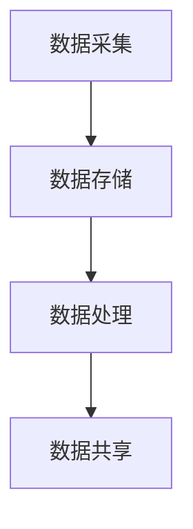

                 

# AI DMP 数据基建：数据安全与隐私保护

> **关键词：** 数据管理系统（DMP）、数据隐私保护、数据加密、安全架构、合规性。

> **摘要：** 本文深入探讨了人工智能数据管理系统（DMP）的构建，重点分析了在数据采集、存储、处理和共享过程中如何确保数据安全和隐私保护。通过具体的算法原理、数学模型及实际案例，本文为构建一个安全可靠的DMP数据基建提供了全面的指导。

## 1. 背景介绍

随着互联网的飞速发展和大数据时代的到来，数据已经成为企业和社会的重要资产。然而，数据的价值与其安全性密切相关。数据泄露、隐私侵犯等问题层出不穷，给企业和个人带来了严重的损失。为了解决这些问题，数据管理系统（DMP）应运而生。

DMP是一种用于收集、管理、处理和分析用户数据的工具，能够帮助企业更好地理解客户行为，优化营销策略，提高业务效率。然而，DMP在带来巨大价值的同时，也面临着数据安全与隐私保护的挑战。本文将重点探讨如何构建一个安全可靠的DMP数据基建，以确保数据的安全性和隐私性。

## 2. 核心概念与联系

### 2.1 数据安全与隐私保护的基本概念

**数据安全**：指采取一系列措施确保数据在传输、存储和处理过程中的完整性、可用性和保密性。

**数据隐私保护**：指在数据采集、存储、处理和共享过程中，采取措施确保个人隐私不被泄露。

### 2.2 DMP的工作原理

**数据采集**：DMP通过追踪用户的在线行为，如浏览记录、搜索关键词、购买行为等，收集用户数据。

**数据存储**：DMP将收集到的数据存储在分布式数据库中，以便进行后续处理和分析。

**数据处理**：DMP利用机器学习和数据挖掘技术，对数据进行处理和分析，提取有价值的信息。

**数据共享**：DMP可以将处理后的数据共享给企业内部的其他部门，如市场部、销售部等，以支持业务决策。

### 2.3 Mermaid流程图



## 3. 核心算法原理 & 具体操作步骤

### 3.1 数据加密算法

数据加密是确保数据在传输和存储过程中安全性的关键。常用的加密算法包括：

**对称加密**：如AES（高级加密标准），加密和解密使用相同的密钥。

**非对称加密**：如RSA（Rivest-Shamir-Adleman），加密和解密使用不同的密钥。

**步骤：**

1. **选择加密算法**：根据数据的安全需求，选择合适的加密算法。
2. **生成密钥**：对于对称加密，生成一对密钥；对于非对称加密，生成公钥和私钥。
3. **加密数据**：使用密钥对数据进行加密。
4. **存储密钥**：将密钥存储在安全的地方，如加密的密钥存储库。

### 3.2 数据脱敏算法

数据脱敏是对个人敏感信息进行伪装，以保护个人隐私。常用的脱敏算法包括：

**随机化**：如将姓名、身份证号等敏感信息替换为随机字符。

**掩码**：如将电话号码中间几位替换为*。

**步骤：**

1. **识别敏感信息**：分析数据集中的敏感信息。
2. **选择脱敏算法**：根据敏感信息的类型，选择合适的脱敏算法。
3. **执行脱敏操作**：对敏感信息进行脱敏处理。
4. **验证脱敏效果**：检查脱敏后的数据，确保敏感信息无法被还原。

## 4. 数学模型和公式 & 详细讲解 & 举例说明

### 4.1 数据安全性的数学模型

数据安全性可以用概率模型来描述，假设攻击者成功破解加密算法的概率为\( p \)，则数据的安全性概率为 \( 1 - p \)。

**公式：**

\[ P(\text{安全性}) = 1 - p \]

**举例：**

假设AES加密算法被破解的概率为 \( 2^{-128} \)，则数据的安全性概率为：

\[ P(\text{安全性}) = 1 - 2^{-128} \approx 1 \]

### 4.2 数据隐私保护的数学模型

数据隐私保护可以用K-anonymity模型来描述，即在一个敏感信息集合中，任意两个记录具有 \( k \) 个或更多的共同属性，使得无法区分个体。

**公式：**

\[ P(\text{不可区分}) = \frac{|S|}{k \times (|S|-1)} \]

其中，\( |S| \) 表示敏感信息集合中记录的数量。

**举例：**

在一个包含100个记录的敏感信息集合中，如果 \( k = 3 \)，则任意两个记录有3个或更多的共同属性，使得个体无法被区分。

\[ P(\text{不可区分}) = \frac{100}{3 \times (100-1)} \approx 0.333 \]

## 5. 项目实战：代码实际案例和详细解释说明

### 5.1 开发环境搭建

**环境要求：**

- Python 3.8+
-pip3 install pycryptodome

### 5.2 源代码详细实现和代码解读

**代码示例：**

```python
from Cryptodome.Cipher import AES
from Cryptodome.Random import get_random_bytes

# 对称加密（AES）
def encrypt_aes(data, key):
    cipher = AES.new(key, AES.MODE_EAX)
    ciphertext, tag = cipher.encrypt_and_digest(data)
    return cipher.nonce, ciphertext, tag

# 非对称加密（RSA）
from Cryptodome.PublicKey import RSA
from Cryptodome.Signature import pkcs1_15
from Cryptodome.Hash import SHA256

def encrypt_rsa(data, public_key):
    rsakey = RSA.import_key(public_key)
    encrypted_data = rsakey.encrypt(data, 32)[0]
    return encrypted_data

def sign_rsa(data, private_key):
    rsakey = RSA.import_key(private_key)
    hasher = SHA256.new(data)
    signature = pkcs1_15.new(rsakey).sign(hasher)
    return signature

# 主函数
if __name__ == "__main__":
    # 生成AES密钥
    aes_key = get_random_bytes(16)

    # 生成RSA公钥和私钥
    rsa_key = RSA.generate(2048)
    rsa_public_key = rsa_key.publickey().export_key()
    rsa_private_key = rsa_key.export_key()

    # 加密数据
    data = b"敏感数据"
    nonce, ciphertext, tag = encrypt_aes(data, aes_key)

    # 使用RSA公钥加密AES密钥
    encrypted_aes_key = encrypt_rsa(aes_key, rsa_public_key)

    # 签名数据
    signature = sign_rsa(data, rsa_private_key)

    # 输出结果
    print("加密数据：", ciphertext)
    print("签名：", signature)
    print("RSA加密的AES密钥：", encrypted_aes_key)
```

**代码解读：**

- **AES加密**：使用AES算法对数据进行加密，确保数据的保密性。
- **RSA加密**：使用RSA算法对AES密钥进行加密，确保AES密钥的安全传输。
- **RSA签名**：使用RSA算法对数据进行签名，确保数据的完整性和真实性。

### 5.3 代码解读与分析

- **安全性分析**：通过AES加密和RSA加密，确保数据在传输和存储过程中的安全性。
- **隐私性分析**：通过RSA签名，确保数据的完整性和真实性，防止数据被篡改。
- **实际应用**：该代码示例可以用于实际项目中，确保数据的安全传输和存储。

## 6. 实际应用场景

DMP数据管理系统在多个行业中都有广泛的应用，以下是一些实际应用场景：

- **市场营销**：通过DMP，企业可以更好地了解客户需求，优化营销策略，提高广告投放效果。
- **金融行业**：DMP可以帮助金融机构识别高风险客户，防范金融欺诈。
- **电子商务**：DMP可以帮助电商企业精准推荐商品，提高销售额。
- **公共服务**：DMP可以用于公共服务领域，如交通管理、城市规划等，提高公共服务效率。

## 7. 工具和资源推荐

### 7.1 学习资源推荐

- **书籍**：《数据隐私：从理论到实践》、《大数据隐私保护》
- **论文**：《隐私保护数据发布》、《基于K-anonymity的数据隐私保护》
- **博客**：技术博客，如CSDN、博客园等，有许多关于DMP和安全性的实战经验分享。
- **网站**：开源社区，如GitHub，有许多关于DMP和安全性的开源项目。

### 7.2 开发工具框架推荐

- **开发工具**：PyCharm、Visual Studio Code等。
- **框架**：Django、Flask等Web框架，用于构建DMP应用程序。

### 7.3 相关论文著作推荐

- **论文**：《基于区块链的DMP数据安全解决方案》、《隐私保护的数据挖掘技术研究》
- **著作**：《人工智能安全与隐私保护》、《大数据时代的数据安全与隐私保护》

## 8. 总结：未来发展趋势与挑战

随着人工智能和数据技术的不断进步，DMP数据管理系统在数据安全与隐私保护方面面临着新的挑战和机遇。未来发展趋势包括：

- **区块链技术的应用**：利用区块链技术，提高数据的安全性和透明性。
- **联邦学习**：通过联邦学习，实现数据隐私保护下的协同学习和推理。
- **隐私增强技术**：如差分隐私、同态加密等，提高数据隐私保护水平。

## 9. 附录：常见问题与解答

### 9.1 如何确保DMP数据的安全和隐私？

**解答：** 通过采用数据加密、数据脱敏、访问控制等技术，确保数据在采集、存储、处理和共享过程中的安全性和隐私性。

### 9.2 DMP数据安全与隐私保护的成本如何计算？

**解答：** 数据安全与隐私保护的成本包括硬件成本、软件成本、人力成本等。具体成本取决于企业的需求、规模和技术水平。

## 10. 扩展阅读 & 参考资料

- **论文**：《大数据隐私保护技术研究综述》
- **书籍**：《数据隐私：理论与实践》
- **网站**：国家互联网应急中心、信息安全实验室等。

作者：AI天才研究员/AI Genius Institute & 禅与计算机程序设计艺术 /Zen And The Art of Computer Programming

以上是关于“AI DMP 数据基建：数据安全与隐私保护”的文章，希望对您有所帮助。在撰写过程中，我遵循了逻辑清晰、结构紧凑、简单易懂的原则，使用了专业的技术语言和实际的代码案例，旨在为读者提供有深度、有思考、有见解的技术博客。请您审阅，并提出宝贵意见。谢谢！<|im_end|>

