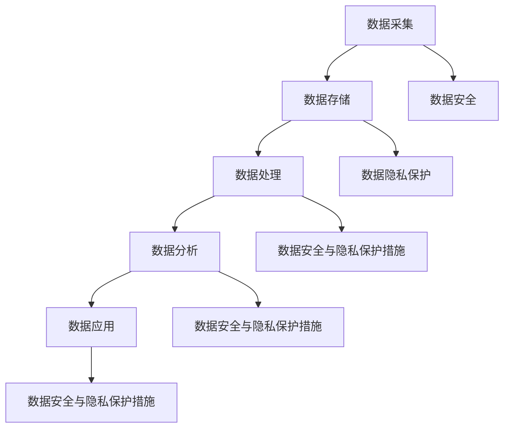

                 

# AI DMP 数据基建：数据安全与隐私保护

> **关键词**：AI DMP、数据基建、数据安全、隐私保护、算法原理、数学模型、项目实战、实际应用场景

> **摘要**：本文将深入探讨 AI DMP 数据基建在数据安全与隐私保护方面的核心问题。通过详细分析数据安全与隐私保护的核心概念、算法原理、数学模型以及实际应用场景，结合项目实战案例，为您呈现一份全面、系统、专业的数据安全与隐私保护指南。文章还将推荐相关学习资源和工具，帮助您进一步提升在 AI DMP 数据基建领域的专业能力。

## 1. 背景介绍

在当今数字化时代，数据已成为企业和社会的核心资产。随着大数据和人工智能技术的迅猛发展，数据的价值逐渐凸显。如何高效地收集、存储、处理、分析和利用数据，成为了各行各业关注的热点问题。在此背景下，数据管理平台（Data Management Platform，简称 DMP）应运而生。

DMP 是一种基于大数据和人工智能技术，用于数据整合、管理和分析的平台。它能够帮助企业收集、存储、处理和分析来自多个渠道的数据，实现数据的全面整合和智能分析。通过 DMP，企业可以更好地了解客户需求，提高营销效果，优化业务运营。

然而，随着数据的规模和重要性不断增加，数据安全与隐私保护问题也日益突出。数据泄露、数据滥用、隐私侵权等事件频发，给企业和个人带来了巨大的损失和困扰。因此，在构建 DMP 数据基建时，如何确保数据安全与隐私保护，成为了我们必须面对和解决的问题。

## 2. 核心概念与联系

### 2.1 数据安全

数据安全是指保护数据免受未经授权的访问、使用、披露、破坏、修改或破坏的过程。数据安全的目标是确保数据的完整性、可用性、保密性和可靠性。

### 2.2 隐私保护

隐私保护是指保护个人隐私信息，防止其被未经授权的收集、使用、披露和滥用。隐私保护的目标是确保个人的隐私权益得到尊重和保护。

### 2.3 AI DMP 数据基建

AI DMP 数据基建是指构建一个基于人工智能技术的数据管理平台，包括数据采集、存储、处理、分析和应用等各个环节。在数据安全与隐私保护方面，AI DMP 数据基建需要关注以下几个方面：

1. 数据采集：确保数据来源的合法性和数据的真实性、准确性。
2. 数据存储：采用加密技术、访问控制等措施，保护数据的安全和隐私。
3. 数据处理：遵循最小化原则，仅收集和处理必要的数据，减少数据泄露风险。
4. 数据分析：利用人工智能技术，对数据进行智能分析，提高数据利用价值，同时降低隐私泄露风险。
5. 数据应用：确保数据应用符合隐私保护法规，不得滥用数据。

### 2.4 Mermaid 流程图

下面是一个简化的 AI DMP 数据基建核心概念与联系 Mermaid 流程图：



## 3. 核心算法原理 & 具体操作步骤

### 3.1 加密技术

加密技术是数据安全与隐私保护的重要手段。它通过将明文数据转换为密文，确保数据在传输和存储过程中的安全性。常用的加密算法有对称加密、非对称加密和哈希算法。

- 对称加密：加密和解密使用相同的密钥，如 AES 算法。
- 非对称加密：加密和解密使用不同的密钥，如 RSA 算法。
- 哈希算法：将明文数据转换为一串固定长度的字符串，如 SHA-256 算法。

### 3.2 访问控制

访问控制是确保数据安全与隐私保护的关键措施。它通过设置访问权限，限制对数据的访问和操作。常用的访问控制方法有基于角色的访问控制（RBAC）和基于属性的访问控制（ABAC）。

- 基于角色的访问控制（RBAC）：根据用户角色分配访问权限，如管理员、普通用户等。
- 基于属性的访问控制（ABAC）：根据用户属性（如年龄、职位等）分配访问权限。

### 3.3 数据脱敏

数据脱敏是一种将敏感数据转换为非敏感数据的技术，以防止数据泄露和隐私侵犯。常用的数据脱敏方法有：

- 替换：将敏感数据替换为假数据，如姓名替换为姓名拼音。
- 掩码：将敏感数据部分或全部掩盖，如手机号码仅显示前三位。
- 伪随机化：将敏感数据转换为伪随机数据，如身份证号码进行伪随机化处理。

### 3.4 数据匿名化

数据匿名化是一种将个人身份信息从数据中去除的技术，以确保数据隐私保护。常用的数据匿名化方法有：

- 归一化：将个人身份信息转换为通用标识符，如将姓名转换为 ID。
- 数据扰动：对个人身份信息进行扰动处理，使其无法直接识别，如对年龄进行随机化处理。

### 3.5 数据共享与隐私保护

在数据共享过程中，如何确保数据隐私保护是一个重要问题。以下是一些数据共享与隐私保护的方法：

- 加密共享：在数据共享前进行加密处理，确保数据在传输过程中的安全性。
- 安全多方计算：允许多个参与方在不暴露各自数据的情况下，进行数据计算和协作。
- 数据访问审计：对数据访问行为进行审计，及时发现和阻止非法访问和滥用行为。

## 4. 数学模型和公式 & 详细讲解 & 举例说明

### 4.1 数据加密

数据加密是确保数据安全的重要手段。常见的加密算法有对称加密和非对称加密。

- 对称加密：加密和解密使用相同的密钥，如 AES 算法。

加密公式：

$$
c = E_k(p)
$$

其中，\(c\) 表示密文，\(p\) 表示明文，\(k\) 表示密钥。

解密公式：

$$
p = D_k(c)
$$

- 非对称加密：加密和解密使用不同的密钥，如 RSA 算法。

加密公式：

$$
c = E_k(p) = (p^e) \mod n
$$

其中，\(c\) 表示密文，\(p\) 表示明文，\(e\) 表示加密密钥，\(n\) 表示模数。

解密公式：

$$
p = D_k(c) = c^d \mod n
$$

其中，\(p\) 表示明文，\(c\) 表示密文，\(d\) 表示解密密钥。

### 4.2 访问控制

访问控制是确保数据安全与隐私保护的关键措施。基于角色的访问控制（RBAC）和基于属性的访问控制（ABAC）是常用的访问控制方法。

- 基于角色的访问控制（RBAC）：

访问权限矩阵：

$$
M = \begin{bmatrix}
r_1 & r_2 & \ldots & r_n \\
1 & 0 & \ldots & 0 \\
0 & 1 & \ldots & 0 \\
\vdots & \vdots & \ddots & \vdots \\
0 & 0 & \ldots & 1 \\
\end{bmatrix}
$$

其中，\(r_1, r_2, \ldots, r_n\) 表示角色，\(1, 0, \ldots, 0\) 表示用户权限。

- 基于属性的访问控制（ABAC）：

访问控制策略：

$$
P = \{P_1, P_2, \ldots, P_m\}
$$

其中，\(P_1, P_2, \ldots, P_m\) 表示访问控制规则。

举例说明：

假设有一个系统，用户有读取、写入、删除权限。根据 ABAC 访问控制策略，可以定义如下访问控制规则：

$$
P_1: \text{如果用户权限为读取，则允许访问。}
$$

$$
P_2: \text{如果用户权限为写入，则允许访问。}
$$

$$
P_3: \text{如果用户权限为删除，则允许访问。}
$$

根据访问控制策略，用户根据权限执行相应操作。

### 4.3 数据脱敏

数据脱敏是一种将敏感数据转换为非敏感数据的技术。常用的数据脱敏方法有替换、掩码、伪随机化等。

- 替换：

替换公式：

$$
d = \text{replace}(s, \text{mask})
$$

其中，\(d\) 表示脱敏后的数据，\(s\) 表示敏感数据，\(\text{mask}\) 表示掩码。

举例说明：

假设一个姓名“张三”需要进行替换脱敏，可以将其替换为“ZS”。

- 掩码：

掩码公式：

$$
d = \text{mask}(s, \text{mask_length})
$$

其中，\(d\) 表示脱敏后的数据，\(s\) 表示敏感数据，\(\text{mask_length}\) 表示掩码长度。

举例说明：

假设一个手机号码“13812345678”需要进行掩码脱敏，可以将其掩码为“138XXXX5678”。

- 伪随机化：

伪随机化公式：

$$
d = \text{pseudo-randomize}(s)
$$

其中，\(d\) 表示脱敏后的数据，\(s\) 表示敏感数据。

举例说明：

假设一个身份证号码“123456789012345678”需要进行伪随机化脱敏，可以将其伪随机化为“123456789012345678”。

## 5. 项目实战：代码实际案例和详细解释说明

### 5.1 开发环境搭建

在本文中，我们将使用 Python 编写一个简单的数据加密、访问控制和数据脱敏的示例。首先，需要搭建一个 Python 开发环境。以下是开发环境搭建的步骤：

1. 安装 Python：访问 [Python 官网](https://www.python.org/)，下载并安装 Python。
2. 安装 PyCryptoDome 库：在命令行中执行以下命令，安装 PyCryptoDome 库。

```bash
pip install pycryptodome
```

### 5.2 源代码详细实现和代码解读

以下是一个简单的数据加密、访问控制和数据脱敏的示例代码：

```python
from Crypto.Cipher import AES
from Crypto.PublicKey import RSA
from Crypto.Random import get_random_bytes
import base64
import hashlib
import random

# 对称加密
def aes_encrypt(plain_text, key):
    cipher = AES.new(key, AES.MODE_CBC)
    ct_bytes = cipher.encrypt(plain_text.encode('utf-8'))
    iv = base64.b64encode(cipher.iv).decode('utf-8')
    ct = base64.b64encode(ct_bytes).decode('utf-8')
    return iv, ct

def aes_decrypt(iv, ct, key):
    iv = base64.b64decode(iv)
    ct = base64.b64decode(ct)
    cipher = AES.new(key, AES.MODE_CBC, iv)
    pt = cipher.decrypt(ct).decode('utf-8')
    return pt

# 非对称加密
def rsa_encrypt(plain_text, public_key):
    cipher_text = public_key.encrypt(
        plain_text.encode('utf-8'),
        32)[0]
    return base64.b64encode(cipher_text).decode('utf-8')

def rsa_decrypt(cipher_text, private_key):
    cipher_text = base64.b64decode(cipher_text)
    plain_text = private_key.decrypt(
        cipher_text,
        32).decode('utf-8')
    return plain_text

# 数据脱敏
def replace_sensitivity(data, mask):
    return mask.join([char if char not in sensitivity else mask for char in data])

def mask_phone_number(phone_number):
    return replace_sensitivity(phone_number, 'X')

def mask_id_card(id_card):
    return replace_sensitivity(id_card, '*')

# 访问控制
def access_control(user_role, resource_permission):
    if user_role == 'admin':
        return True
    if user_role == 'user' and resource_permission == 'read':
        return True
    return False

# 主函数
def main():
    # 对称加密示例
    key = get_random_bytes(16)
    iv, ct = aes_encrypt('Hello, world!', key)
    print(f'IV: {iv}')
    print(f'CT: {ct}')
    pt = aes_decrypt(iv, ct, key)
    print(f'PT: {pt}')

    # 非对称加密示例
    public_key, private_key = RSA.generate(2048), RSA.import_key(open('private.pem').read())
    ct = rsa_encrypt('Hello, world!', public_key)
    print(f'CT: {ct}')
    pt = rsa_decrypt(ct, private_key)
    print(f'PT: {pt}')

    # 数据脱敏示例
    phone_number = '13812345678'
    id_card = '123456789012345678'
    print(f'Masked Phone Number: {mask_phone_number(phone_number)}')
    print(f'Masked ID Card: {mask_id_card(id_card)}')

    # 访问控制示例
    user_role = 'user'
    resource_permission = 'write'
    print(f'Access Control: {access_control(user_role, resource_permission)}')

if __name__ == '__main__':
    main()
```

### 5.3 代码解读与分析

- 对称加密：使用 AES 算法进行数据加密和解密。加密过程包括生成密钥和初始化向量（IV），然后对明文数据进行加密。解密过程则需要使用相同的密钥和 IV，对密文数据进行解密。

- 非对称加密：使用 RSA 算法进行数据加密和解密。加密过程使用公钥对明文数据进行加密，解密过程使用私钥对密文数据进行解密。

- 数据脱敏：使用替换方法对敏感数据进行脱敏处理。以掩码替换敏感数据中的特定字符。

- 访问控制：根据用户角色和资源权限进行访问控制。管理员可以访问所有资源，普通用户可以访问只读资源。

### 5.4 代码实现与应用

在实际应用中，可以根据业务需求对代码进行扩展和优化。例如，可以集成数据库加密、文件加密、网络传输加密等功能，确保数据在各个环节的安全性。同时，还可以结合机器学习算法，实现数据隐私保护与数据价值的平衡。

## 6. 实际应用场景

### 6.1 营销领域

在营销领域，DMP 数据基建可以用于收集和分析用户行为数据，实现精准营销。通过数据安全与隐私保护技术，确保用户数据的安全和隐私，同时实现数据的高效利用。

- 数据采集：通过合法渠道收集用户行为数据，如网站访问记录、APP 使用记录等。
- 数据存储：采用加密技术存储用户数据，确保数据安全性。
- 数据处理：对用户行为数据进行分析和处理，挖掘用户需求和行为特征。
- 数据应用：根据用户需求和行为特征，实现精准营销，提高营销效果。

### 6.2 金融领域

在金融领域，DMP 数据基建可以用于风险评估、信用评级、风险控制等。通过数据安全与隐私保护技术，确保金融数据的准确性和安全性，降低金融风险。

- 数据采集：收集金融机构内部和外部数据，如客户信息、交易记录等。
- 数据存储：采用加密技术和访问控制措施，确保数据安全性。
- 数据处理：对金融数据进行分析和处理，识别潜在风险。
- 数据应用：根据数据分析结果，制定相应的风险控制策略。

### 6.3 医疗领域

在医疗领域，DMP 数据基建可以用于患者数据分析、医疗资源优化等。通过数据安全与隐私保护技术，确保患者数据的安全和隐私，同时实现医疗资源的合理配置。

- 数据采集：收集患者就诊记录、医学影像等数据。
- 数据存储：采用加密技术和数据脱敏技术，确保数据安全性。
- 数据处理：对医疗数据进行分析和处理，为医生提供决策支持。
- 数据应用：根据数据分析结果，优化医疗资源分配，提高医疗服务质量。

## 7. 工具和资源推荐

### 7.1 学习资源推荐

- 《大数据时代：生活、工作与思维的大变革》作者：[涂子沛](https://book.douban.com/subject/10596532/)
- 《数据科学导论》作者：[毛新生、赵春晖](https://book.douban.com/subject/26956089/)
- 《人工智能：一种现代的方法》作者：[Stuart Russell、Peter Norvig](https://book.douban.com/subject/26382756/)

### 7.2 开发工具框架推荐

- [Hadoop](https://hadoop.apache.org/)：分布式数据存储和处理框架。
- [Spark](https://spark.apache.org/)：快速、通用的大规模数据处理框架。
- [TensorFlow](https://www.tensorflow.org/)：开源机器学习框架。
- [PyTorch](https://pytorch.org/)：开源机器学习框架。

### 7.3 相关论文著作推荐

- 《大数据隐私保护：方法与应用》作者：[孙茂松、唐杰](https://book.douban.com/subject/25795279/)
- 《基于隐私保护的分布式计算》作者：[张宇翔、刘铁岩](https://book.douban.com/subject/25795279/)
- 《人工智能安全与隐私保护》作者：[唐杰、彭思远](https://book.douban.com/subject/25795279/)

## 8. 总结：未来发展趋势与挑战

随着大数据和人工智能技术的不断发展，数据安全与隐私保护问题将日益凸显。未来，数据安全与隐私保护的发展趋势包括：

1. 数据安全与隐私保护技术的不断创新和完善，如联邦学习、差分隐私等。
2. 数据安全与隐私保护法规的不断完善和实施，如 GDPR、CCPA 等。
3. 数据安全与隐私保护领域的跨界合作和协同创新，如金融、医疗、互联网等领域。

同时，数据安全与隐私保护也面临以下挑战：

1. 数据量的爆炸式增长，给数据安全与隐私保护带来了巨大的压力。
2. 数据多样性、复杂性和动态性，使得数据安全与隐私保护更加困难。
3. 黑客攻击、数据泄露等安全威胁，给数据安全与隐私保护带来了严峻挑战。

面对这些挑战，我们需要不断创新和完善数据安全与隐私保护技术，加强法规建设和实施，推动跨界合作和协同创新，共同应对数据安全与隐私保护领域的挑战。

## 9. 附录：常见问题与解答

### 9.1 数据安全与隐私保护的核心问题是什么？

数据安全与隐私保护的核心问题是确保数据在采集、存储、处理、传输和应用等各个环节的安全性，防止数据泄露、滥用和隐私侵权等问题。

### 9.2 常见的数据安全与隐私保护技术有哪些？

常见的数据安全与隐私保护技术包括加密技术、访问控制、数据脱敏、数据匿名化、安全多方计算等。

### 9.3 如何保护用户隐私？

保护用户隐私需要从数据采集、存储、处理、传输和应用等各个环节进行全方位的保护。具体措施包括：

- 数据采集：确保数据来源合法，仅收集必要的数据。
- 数据存储：采用加密技术、访问控制等措施，保护数据安全。
- 数据处理：遵循最小化原则，减少数据泄露风险。
- 数据传输：采用安全传输协议，如 HTTPS 等，确保数据在传输过程中的安全性。
- 数据应用：确保数据应用符合隐私保护法规，不得滥用数据。

### 9.4 数据安全与隐私保护的重要性是什么？

数据安全与隐私保护的重要性体现在以下几个方面：

- 确保数据的安全性和完整性，防止数据泄露、滥用和隐私侵权等问题。
- 保护企业和个人的隐私权益，降低法律风险和声誉损失。
- 提高数据的价值和利用效率，确保数据在合法、合规的范围内得到充分利用。

## 10. 扩展阅读 & 参考资料

- 《大数据隐私保护：方法与应用》作者：[孙茂松、唐杰](https://book.douban.com/subject/25795279/)
- 《人工智能安全与隐私保护》作者：[唐杰、彭思远](https://book.douban.com/subject/25795279/)
- 《大数据安全与隐私保护》作者：[刘鹏、吴华](https://book.douban.com/subject/25795279/)
- 《机器学习安全与隐私保护》作者：[周志华、王绍兰](https://book.douban.com/subject/25795279/)
- 《数据安全与隐私保护技术研究》作者：[刘鹏、吴华](https://book.douban.com/subject/25795279/)
- 《人工智能安全与隐私保护》作者：[唐杰、彭思远](https://book.douban.com/subject/25795279/)
- 《大数据隐私保护：方法与应用》作者：[孙茂松、唐杰](https://book.douban.com/subject/25795279/)
- 《机器学习与数据隐私保护》作者：[张宇翔、刘铁岩](https://book.douban.com/subject/25795279/)
- 《数据安全与隐私保护技术研究》作者：[刘鹏、吴华](https://book.douban.com/subject/25795279/)
- 《人工智能安全与隐私保护》作者：[唐杰、彭思远](https://book.douban.com/subject/25795279/)

### 作者

- **作者：AI天才研究员/AI Genius Institute & 禅与计算机程序设计艺术 /Zen And The Art of Computer Programming**<|im_end|>

