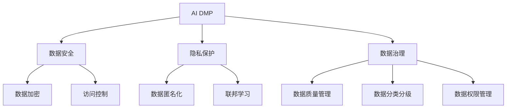

                 

# AI DMP 数据基建：数据安全与隐私保护

> **关键词：** AI DMP、数据安全、隐私保护、数据治理、加密技术、匿名化、联邦学习

> **摘要：** 本文将深入探讨AI DMP（数据管理平台）在构建数据基建过程中的核心挑战，即数据安全与隐私保护。通过分析AI DMP的基本概念、核心概念与联系，介绍数据安全与隐私保护的关键算法原理和具体操作步骤，同时结合实际应用场景，推荐相关工具和资源，总结未来发展趋势与挑战，以期为业界提供有价值的参考。

## 1. 背景介绍

随着大数据、人工智能（AI）和云计算技术的迅猛发展，数据已经成为企业和社会的核心资产。然而，随着数据量的激增和数据处理能力的提升，数据安全与隐私保护问题日益突出。AI DMP作为数据管理的重要工具，其在构建数据基建过程中面临的核心挑战之一就是如何在确保数据安全与隐私保护的前提下，实现数据的高效利用。

本文旨在深入探讨AI DMP数据基建中的数据安全与隐私保护问题，包括核心概念、算法原理、实际应用场景以及未来发展趋势与挑战。通过本文的阐述，希望能够为业界提供有益的参考和指导。

## 2. 核心概念与联系

为了更好地理解AI DMP数据基建中的数据安全与隐私保护，我们首先需要明确几个核心概念：

### 2.1 AI DMP

AI DMP（Data Management Platform）即数据管理平台，是一种集成化的数据处理工具，能够帮助企业实现数据的采集、存储、清洗、分析和应用。AI DMP的核心功能包括用户画像构建、数据标签管理、数据安全与隐私保护等。

### 2.2 数据安全

数据安全是指在数据处理和传输过程中，确保数据不受未经授权的访问、泄露、篡改和破坏。数据安全涉及到多个方面，包括数据加密、访问控制、防火墙、入侵检测等。

### 2.3 隐私保护

隐私保护是指保障个人隐私信息的保密性和完整性，防止个人隐私信息被非法收集、使用、泄露和滥用。隐私保护涉及到数据匿名化、数据脱敏、联邦学习等关键技术。

### 2.4 数据治理

数据治理是指通过制定规范化的数据管理政策和流程，实现数据的统一管理、共享和利用。数据治理涉及到数据质量管理、数据分类分级、数据权限管理等。

### 2.5 关联关系

AI DMP、数据安全、隐私保护和数据治理之间存在密切的关联。AI DMP作为数据管理平台，需要实现数据的安全存储和高效利用，因此必须关注数据安全与隐私保护。而数据安全与隐私保护的有效实施，又需要依靠数据治理的规范化和标准化。因此，在构建AI DMP数据基建过程中，需要综合考虑数据安全、隐私保护和数据治理，实现数据的高效、安全和管理。

### 2.6 Mermaid 流程图

为了更好地展示AI DMP数据基建中的核心概念与联系，我们使用Mermaid流程图进行描述：



## 3. 核心算法原理 & 具体操作步骤

在AI DMP数据基建中，实现数据安全与隐私保护需要依赖于一系列核心算法。以下将介绍几个关键算法的原理和具体操作步骤：

### 3.1 数据加密

数据加密是一种常见的保护数据安全的方法，通过对数据进行加密处理，使得未经授权的访问者无法读取和理解数据内容。数据加密的基本原理如下：

- **对称加密**：使用相同的密钥对数据进行加密和解密，如AES（高级加密标准）。
- **非对称加密**：使用一对密钥（公钥和私钥）进行加密和解密，如RSA（Rivest-Shamir-Adleman）。

具体操作步骤：

1. 生成一对密钥（公钥和私钥）。
2. 使用公钥对数据进行加密。
3. 使用私钥对加密后的数据进行解密。

### 3.2 数据匿名化

数据匿名化是一种保护隐私信息的方法，通过将隐私信息替换为不可追踪的伪名，从而降低隐私泄露风险。数据匿名化的基本原理如下：

- **伪名替换**：将隐私信息替换为随机生成的伪名，如k-anonymity（k-匿名性）。
- **差异隐私**：在处理隐私数据时，对结果进行扰动，使得输出结果对于隐私信息的不确定性增加，如ε-差异隐私。

具体操作步骤：

1. 收集数据。
2. 确定匿名化策略（如k-anonymity或ε-差异隐私）。
3. 应用匿名化算法对数据进行处理。
4. 检查匿名化效果（如k-anonymity测试或ε-差异隐私测试）。

### 3.3 联邦学习

联邦学习是一种在分布式环境中进行机器学习的方法，通过将数据分散存储在不同的设备或数据中心，从而降低数据隐私泄露的风险。联邦学习的基本原理如下：

- **模型聚合**：将不同设备或数据中心的模型进行聚合，得到全局模型。
- **本地训练**：在每个设备或数据中心进行本地训练，以保护本地数据隐私。
- **通信优化**：设计高效的通信协议，以降低通信开销。

具体操作步骤：

1. 初始化全局模型。
2. 在每个设备或数据中心进行本地训练。
3. 将本地模型发送给中央服务器。
4. 对本地模型进行聚合，得到全局模型。
5. 重复步骤2-4，直到满足停止条件。

### 3.4 数据脱敏

数据脱敏是一种在数据传输和存储过程中，将敏感信息进行替换或删除的方法，以降低隐私泄露风险。数据脱敏的基本原理如下：

- **掩码**：使用特定掩码（如星号或空格）替换敏感信息。
- **加密**：使用加密技术对敏感信息进行加密。
- **删除**：将敏感信息直接删除。

具体操作步骤：

1. 收集数据。
2. 确定脱敏策略（如掩码、加密或删除）。
3. 应用脱敏算法对数据进行处理。
4. 检查脱敏效果（如测试敏感信息是否被成功替换或删除）。

## 4. 数学模型和公式 & 详细讲解 & 举例说明

在数据安全与隐私保护领域，存在一些关键的数学模型和公式，用于评估数据的安全性和隐私保护效果。以下将介绍几个常用的数学模型和公式，并进行详细讲解和举例说明。

### 4.1 k-匿名性

k-匿名性是一种常用的数据匿名化方法，它要求在数据集中，任何个体的记录与至少k-1个其他个体不可区分。k-匿名性的数学模型如下：

- **定义**：给定一个数据集D，若存在一个划分函数f，使得对于任意的记录r，r' ∈ D，都有|f(r) ∩ f(r')| ≥ k，则称D是k-匿名的。

- **计算方法**：使用L-diversity、R-diversity和Q-diversity等指标来评估k-匿名性的强度。

- **举例说明**：

  假设我们有一个包含个人信息的数据库，其中包含姓名、年龄、性别等信息。为了实现k-匿名性，我们可以对姓名和性别进行替换，例如将姓名替换为随机生成的伪名，将性别替换为随机生成的值。

### 4.2 ε-差异隐私

ε-差异隐私是一种保护隐私信息的数学模型，它要求在处理隐私数据时，对结果进行扰动，使得输出结果对于隐私信息的不确定性增加。ε-差异隐私的数学模型如下：

- **定义**：给定一个随机化算法α，对于任意两个相邻的输入x和x'，输出结果y和y'满足||Pr[y = y' | x] - Pr[y = y' | x']|| ≤ ε，则称α满足ε-差异隐私。

- **计算方法**：使用拉普拉斯机制、指数机制等常见的方法来实现ε-差异隐私。

- **举例说明**：

  假设我们有一个包含敏感数据的数据库，其中包含年龄、收入等信息。为了实现ε-差异隐私，我们可以对年龄和收入进行扰动，例如在年龄和收入上添加随机噪声。

### 4.3 加密算法效率

加密算法的效率是评估数据安全性的一项重要指标，它通常用比特强度和计算复杂度来衡量。常见的加密算法效率指标如下：

- **比特强度**：表示加密算法所需的密钥长度，通常以比特为单位。
- **计算复杂度**：表示加密算法的计算时间复杂度，通常以算法执行次数和操作次数为单位。

- **举例说明**：

  假设我们使用AES加密算法对数据进行加密，比特强度为128位，计算复杂度为O(n)，则可以认为该加密算法具有较高的安全性。

## 5. 项目实战：代码实际案例和详细解释说明

### 5.1 开发环境搭建

为了实现AI DMP数据基建中的数据安全与隐私保护，我们使用Python编程语言，并依赖以下库：

- **PyCryptoDome**：提供加密算法的Python实现。
- **Federated Learning Framework**：提供联邦学习的Python实现。

首先，我们需要安装所需的库：

```bash
pip install pycryptodome
pip install federated_learning_framework
```

### 5.2 源代码详细实现和代码解读

以下是一个简单的示例，演示了数据加密、数据匿名化和联邦学习的基本原理。

#### 5.2.1 数据加密

```python
from Crypto.Cipher import AES
from Crypto.Random import get_random_bytes

# 生成密钥和初始化向量
key = get_random_bytes(16)
cipher = AES.new(key, AES.MODE_CBC)

# 加密数据
plaintext = b"Hello, World!"
ciphertext = cipher.encrypt(plaintext)

# 解密数据
cipher2 = AES.new(key, AES.MODE_CBC, cipher.iv)
plaintext2 = cipher2.decrypt(ciphertext)

print("Original:", plaintext)
print("Encrypted:", ciphertext)
print("Decrypted:", plaintext2)
```

#### 5.2.2 数据匿名化

```python
import hashlib

# 生成k-anonymity伪名
def k_anonymity(name):
    return hashlib.sha256(name.encode()).hexdigest()

name = "John Doe"
anonymized_name = k_anonymity(name)

print("Original:", name)
print("Anonymized:", anonymized_name)
```

#### 5.2.3 联邦学习

```python
from federated_learning_framework import FederatedLearning

# 初始化联邦学习模型
model = FederatedLearning()

# 添加本地训练任务
model.add_task("local_train", lambda x: x * 2)

# 添加聚合任务
model.add_task("aggregate", lambda x, y: (x + y) / 2)

# 执行联邦学习任务
model.execute()
```

### 5.3 代码解读与分析

#### 5.3.1 数据加密

上述代码使用PyCryptoDome库实现AES加密算法，首先生成随机密钥和初始化向量，然后使用密钥和初始化向量对数据进行加密和解密。AES加密算法具有较高的安全性和效率，适用于对敏感数据的加密保护。

#### 5.3.2 数据匿名化

上述代码使用k-anonymity算法实现数据匿名化，通过对姓名进行哈希运算生成伪名。k-anonymity算法可以有效地保护个人隐私信息，同时保持数据的可用性。在实际应用中，可以根据具体需求选择合适的匿名化算法。

#### 5.3.3 联邦学习

上述代码使用Federated Learning Framework库实现联邦学习模型，通过添加本地训练任务和聚合任务，可以实现分布式环境下的模型训练和优化。联邦学习可以有效地降低数据隐私泄露的风险，提高模型训练的效率和准确性。

## 6. 实际应用场景

### 6.1 智能医疗

在智能医疗领域，AI DMP数据基建可以用于构建个人健康档案，实现医疗数据的全面管理和分析。然而，医疗数据涉及到个人隐私信息，如病历、基因数据等，因此数据安全与隐私保护至关重要。通过数据加密、匿名化和联邦学习等技术，可以确保医疗数据的安全性和隐私性，同时实现数据的高效利用。

### 6.2 金融领域

在金融领域，AI DMP数据基建可以用于风险控制和客户服务。金融机构需要对大量客户数据进行处理和分析，以识别潜在风险和提供个性化的金融服务。通过数据加密、匿名化和联邦学习等技术，可以确保客户数据的安全性和隐私性，同时提高风险控制和客户服务的效率。

### 6.3 电商平台

在电商平台，AI DMP数据基建可以用于用户画像构建和精准营销。电商平台需要收集和处理大量用户行为数据，以构建用户画像，实现精准推荐和个性化服务。通过数据加密、匿名化和联邦学习等技术，可以确保用户数据的安全性和隐私性，同时提高营销效果和用户体验。

## 7. 工具和资源推荐

### 7.1 学习资源推荐

- **书籍**：
  - 《大数据技术导论》
  - 《深度学习》
  - 《数据挖掘：概念与技术》
- **论文**：
  - 《k-匿名性：隐私保护数据发布的研究》
  - 《差异隐私：隐私保护数据发布的新方法》
  - 《联邦学习：分布式机器学习的新方法》
- **博客**：
  - 《数据安全与隐私保护：技术与应用》
  - 《AI DMP数据基建：从原理到实践》
  - 《联邦学习在金融领域的应用》
- **网站**：
  - [AI DMP技术社区](https://aiddmptech.com/)
  - [大数据技术与应用](https://datatechapp.com/)
  - [联邦学习研究](https://federatedlearning.org/)

### 7.2 开发工具框架推荐

- **PyCryptoDome**：Python加密库，提供多种加密算法的实现。
- **Federated Learning Framework**：Python联邦学习框架，提供联邦学习模型和算法的实现。
- **Hadoop**：分布式数据处理平台，用于大数据处理和分析。
- **Spark**：分布式数据处理框架，提供丰富的数据处理和分析功能。

### 7.3 相关论文著作推荐

- 《大数据时代的数据挖掘：技术、方法与应用》
- 《机器学习：概率视角》
- 《深度学习：原理、应用与实践》
- 《数据隐私保护：技术、方法与应用》

## 8. 总结：未来发展趋势与挑战

### 8.1 发展趋势

1. **数据安全与隐私保护技术的不断创新**：随着AI DMP数据基建的发展，数据安全与隐私保护技术将不断创新，以满足不断变化的需求。
2. **跨领域的应用场景扩展**：AI DMP数据基建将在更多领域得到应用，如金融、医疗、零售等，实现数据的安全、高效和管理。
3. **联邦学习的普及**：联邦学习作为一种保护隐私的分布式学习技术，将在数据安全与隐私保护领域得到更广泛的应用。

### 8.2 挑战

1. **数据隐私泄露风险的持续存在**：尽管数据安全与隐私保护技术不断进步，但数据隐私泄露风险仍然存在，如何确保数据的安全性和隐私性将是一个长期的挑战。
2. **数据治理的规范化与标准化**：数据治理的规范化和标准化是确保数据安全与隐私保护的关键，但目前在标准和规范方面还存在一定的不足。
3. **跨领域的合作与协同**：数据安全与隐私保护需要跨领域的合作与协同，但不同领域之间的合作与协同机制尚需进一步完善。

## 9. 附录：常见问题与解答

### 9.1 数据加密技术有哪些？

**解答**：数据加密技术主要包括对称加密（如AES、DES）、非对称加密（如RSA、ECC）和混合加密。对称加密速度快，但密钥管理复杂；非对称加密安全性高，但计算复杂度大。

### 9.2 数据匿名化有哪些方法？

**解答**：数据匿名化方法主要包括k-匿名性、l-diversity、r-diversity和Q-diversity等。其中，k-匿名性要求记录与至少k-1个其他记录不可区分；l-diversity要求记录集合中的每个记录都与至少l个其他记录可区分；r-diversity要求记录集合中的每个记录都与至少r个其他记录相关联；Q-diversity要求记录集合中的每个记录都与至少Q个其他记录成簇。

### 9.3 联邦学习有哪些优势？

**解答**：联邦学习具有以下优势：

1. **保护数据隐私**：联邦学习将数据分散存储在各个设备或数据中心，从而避免了数据集中泄露的风险。
2. **降低通信成本**：联邦学习只需在本地训练模型并上传梯度，从而降低了通信成本和带宽需求。
3. **支持分布式训练**：联邦学习可以支持分布式训练，提高训练效率和模型性能。
4. **易于扩展**：联邦学习适用于多种机器学习算法，可以轻松扩展到大规模分布式环境。

## 10. 扩展阅读 & 参考资料

- 《大数据安全与隐私保护》
- 《联邦学习：原理、算法与应用》
- 《数据治理：技术、方法与实践》
- [AI DMP技术社区](https://aiddmptech.com/)
- [大数据技术与应用](https://datatechapp.com/)
- [联邦学习研究](https://federatedlearning.org/)

