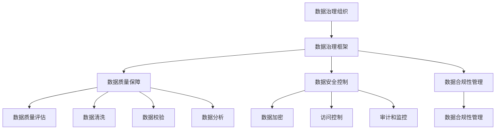

                 

### 文章标题

**AI DMP 数据基建：数据治理与管理**

关键词：AI、DMP、数据治理、数据管理、数据基建、数据流程、数据治理框架、数据质量控制、数据模型、数据安全

摘要：本文将探讨AI DMP（数据管理平台）在数据治理与管理中的重要作用。通过深入分析数据治理的核心概念、架构原理以及具体操作步骤，本文旨在为读者提供一份全面的数据管理指南，帮助他们在AI时代中更好地应对数据挑战。

### 1. 背景介绍

在当今数字化时代，数据已经成为企业和组织的关键资产。随着数据量的爆炸性增长和多样化，如何高效地治理和管理数据成为了企业和组织面临的重要问题。数据治理（Data Governance）和数据管理（Data Management）作为数据管理的重要组成部分，越来越受到重视。

数据治理是指通过制定一系列政策、流程和工具，确保数据质量、安全性和合规性的一系列管理和监督活动。而数据管理则是针对数据全生命周期进行规划、组织、控制和优化的一系列操作，包括数据存储、数据集成、数据清洗、数据分析和数据安全等方面。

AI DMP（Data Management Platform），即数据管理平台，是一种集成化、智能化的数据管理解决方案，通过集成各种数据管理工具和功能，实现对海量数据的全面治理和管理。AI DMP在数据治理与管理中具有重要作用，能够帮助企业更好地应对数据挑战，实现数据价值的最大化。

### 2. 核心概念与联系

#### 2.1 数据治理的核心概念

数据治理涉及多个关键概念，包括数据质量、数据安全、数据合规性、数据模型等。

- **数据质量**：数据质量是指数据的有效性、准确性、完整性、一致性和及时性。高质量的数据是数据治理的基础，能够确保决策的准确性和可靠性。

- **数据安全**：数据安全是指保护数据免受未经授权的访问、篡改和泄露。数据安全是数据治理的重要方面，确保数据在存储、传输和处理过程中的安全。

- **数据合规性**：数据合规性是指确保数据符合相关法规和政策要求，如隐私保护、数据保护等。数据合规性是数据治理的必要条件，避免企业因数据违规而面临法律风险。

- **数据模型**：数据模型是指对数据的抽象表示，包括数据的结构、关系和属性。数据模型能够帮助数据治理者更好地理解数据，实现数据的标准化和规范化。

#### 2.2 数据治理的架构原理

数据治理的架构原理包括以下几个方面：

- **数据治理组织**：建立专门的数据治理团队或部门，负责制定数据治理政策、流程和规范，协调各部门之间的数据管理工作。

- **数据治理框架**：设计一个全面的数据治理框架，包括数据治理原则、目标、策略、流程、工具和资源等，指导数据治理工作的实施。

- **数据质量保障**：建立数据质量保障机制，包括数据质量评估、数据清洗、数据校验和数据分析等，确保数据质量满足要求。

- **数据安全控制**：实施数据安全控制措施，包括数据加密、访问控制、审计和监控等，保护数据安全。

- **数据合规性管理**：确保数据符合相关法规和政策要求，包括数据收集、存储、处理、传输和销毁等环节的合规性管理。

#### 2.3 数据治理与数据管理的联系

数据治理与数据管理相互关联，共同构成数据管理体系的两个重要方面。

- **数据治理是数据管理的基础**：数据治理为数据管理提供指导原则、目标和策略，确保数据管理工作的有效性和合规性。

- **数据管理是实现数据治理的手段**：数据管理通过一系列操作和工具，实现对数据的全面治理和管理，确保数据质量、安全和合规性。

为了更直观地展示数据治理的架构原理，我们使用Mermaid流程图（注意：节点中不要有括号、逗号等特殊字符）：



### 3. 核心算法原理 & 具体操作步骤

在数据治理中，核心算法原理主要包括数据质量评估、数据清洗、数据校验和数据分析等。

#### 3.1 数据质量评估

数据质量评估是指对数据质量进行量化评估，确定数据质量水平。常用的数据质量评估方法包括：

- **数据质量指标**：包括数据准确性、完整性、一致性、及时性和有效性等指标。例如，准确性指标可以计算数据正确性的百分比，完整性指标可以检查数据缺失的百分比。

- **数据质量评估工具**：如数据质量评估软件、数据质量评估插件等。这些工具可以自动化地评估数据质量，生成数据质量报告。

操作步骤：

1. **确定评估目标**：明确数据质量评估的目标，如评估数据的准确性、完整性等。
2. **收集数据样本**：从数据源中随机抽取一定数量的数据样本，作为评估对象。
3. **应用评估指标**：根据评估目标，选择相应的评估指标，对数据样本进行评估。
4. **生成评估报告**：将评估结果汇总成报告，包括数据质量指标、评估过程和结论等。

#### 3.2 数据清洗

数据清洗是指对数据进行清洗和预处理，去除重复数据、缺失数据、错误数据和噪声数据等，提高数据质量。常用的数据清洗方法包括：

- **去重**：去除重复的数据记录，确保数据唯一性。
- **补全**：对缺失的数据进行补全，如使用平均值、中值、最邻近值等方法。
- **修正**：对错误的数据进行修正，如纠正拼写错误、格式错误等。
- **筛选**：根据特定的条件，筛选出满足条件的数据。

操作步骤：

1. **分析数据**：对数据源进行初步分析，确定数据类型、数据分布和异常值等。
2. **去重**：使用去重算法，如哈希去重等，去除重复数据。
3. **补全**：根据数据缺失情况，选择适当的补全方法，对缺失数据进行补全。
4. **修正**：对错误数据进行修正，确保数据准确性。
5. **筛选**：根据特定的条件，筛选出满足条件的数据。

#### 3.3 数据校验

数据校验是指对数据进行校验和验证，确保数据的准确性和一致性。常用的数据校验方法包括：

- **数据类型校验**：检查数据的类型是否正确，如字符串、数字、日期等。
- **范围校验**：检查数据的取值是否在允许的范围内，如年龄范围在0-100之间。
- **格式校验**：检查数据的格式是否正确，如电话号码格式、电子邮件格式等。

操作步骤：

1. **定义校验规则**：根据数据的特点，定义相应的校验规则。
2. **数据校验**：对数据进行校验，判断是否符合校验规则。
3. **错误处理**：对不符合校验规则的数据，进行错误处理，如提示用户、修正数据等。

#### 3.4 数据分析

数据分析是指对数据进行统计分析和挖掘，提取有价值的信息和知识。常用的数据分析方法包括：

- **描述性分析**：对数据进行描述性统计，如计算平均值、中位数、标准差等。
- **诊断性分析**：对数据进行诊断性分析，如分析异常值、趋势等。
- **预测性分析**：对数据进行预测性分析，如建立预测模型、进行预测分析等。
- **相关性分析**：分析数据之间的相关性，如计算相关系数、进行卡方检验等。

操作步骤：

1. **数据预处理**：对数据进行清洗、校验和转换等预处理操作，确保数据质量。
2. **选择分析方法**：根据分析目标，选择合适的数据分析方法。
3. **进行数据分析**：应用选择的分析方法，对数据进行统计分析或挖掘。
4. **生成分析报告**：将分析结果汇总成报告，包括分析过程、分析结果和结论等。

### 4. 数学模型和公式 & 详细讲解 & 举例说明

在数据治理中，一些数学模型和公式被广泛应用于数据质量评估、数据清洗、数据校验和数据分析等环节。

#### 4.1 数据质量评估的数学模型

数据质量评估常用的数学模型包括：

- **误差率（Error Rate）**：计算错误数据的比例。公式如下：
  $$\text{Error Rate} = \frac{\text{错误数据数}}{\text{总数据数}}$$
  
- **准确率（Accuracy）**：计算正确数据的比例。公式如下：
  $$\text{Accuracy} = \frac{\text{正确数据数}}{\text{总数据数}}$$

- **召回率（Recall）**：计算在所有实际正确的数据中，被正确识别的比例。公式如下：
  $$\text{Recall} = \frac{\text{正确识别的数据数}}{\text{实际正确的数据数}}$$

- **精确率（Precision）**：计算在所有被识别为正确的数据中，实际正确的比例。公式如下：
  $$\text{Precision} = \frac{\text{正确识别的数据数}}{\text{被识别为正确的数据数}}$$

- **F1分数（F1 Score）**：综合衡量精确率和召回率的指标。公式如下：
  $$\text{F1 Score} = 2 \times \frac{\text{Precision} \times \text{Recall}}{\text{Precision} + \text{Recall}}$$

举例说明：

假设有一份数据，总共有1000条记录，其中500条是正确的，500条是错误的。我们使用上述公式计算数据质量评估指标：

- **误差率**：$$\text{Error Rate} = \frac{500}{1000} = 0.5$$
- **准确率**：$$\text{Accuracy} = \frac{500}{1000} = 0.5$$
- **召回率**：$$\text{Recall} = \frac{500}{500} = 1$$
- **精确率**：$$\text{Precision} = \frac{500}{500} = 1$$
- **F1分数**：$$\text{F1 Score} = 2 \times \frac{1 \times 1}{1 + 1} = 1$$

#### 4.2 数据清洗的数学模型

数据清洗常用的数学模型包括：

- **均值（Mean）**：计算一组数据的平均值。公式如下：
  $$\text{Mean} = \frac{\sum_{i=1}^{n} x_i}{n}$$
  
- **中值（Median）**：计算一组数据的中位数。公式如下：
  $$\text{Median} = \begin{cases} 
  x_1 & \text{如果 } n \text{ 为奇数} \\
  \frac{x_{n/2} + x_{n/2+1}}{2} & \text{如果 } n \text{ 为偶数}
  \end{cases}$$

- **标准差（Standard Deviation）**：计算一组数据的离散程度。公式如下：
  $$\text{Standard Deviation} = \sqrt{\frac{\sum_{i=1}^{n} (x_i - \text{Mean})^2}{n-1}}$$

举例说明：

假设有一组数据：[1, 2, 3, 4, 5]，我们使用上述公式计算数据清洗的数学模型：

- **均值**：$$\text{Mean} = \frac{1 + 2 + 3 + 4 + 5}{5} = 3$$
- **中值**：$$\text{Median} = \frac{2 + 3}{2} = 2.5$$
- **标准差**：$$\text{Standard Deviation} = \sqrt{\frac{(1-3)^2 + (2-3)^2 + (3-3)^2 + (4-3)^2 + (5-3)^2}{5-1}} = 1.414$$

#### 4.3 数据校验的数学模型

数据校验常用的数学模型包括：

- **范围校验**：根据数据类型的范围，使用条件判断语句进行校验。例如，对于整数类型的范围校验，可以使用以下公式：
  $$\text{Value} \geq \text{最小值} \text{ 且 } \text{Value} \leq \text{最大值}$$

- **格式校验**：使用正则表达式对数据的格式进行校验。例如，对于电话号码的格式校验，可以使用以下正则表达式：
  $$\text{Phone Number} = \text{^(\d{3}-?)?\d{3}-?\d{4}$}$$

举例说明：

假设有一组数据：[100, 200, 300, 400, 500]，我们使用范围校验公式进行校验：

- **最小值**：$$\text{最小值} = 100$$
- **最大值**：$$\text{最大值} = 500$$
- **范围校验**：$$\text{Value} \geq 100 \text{ 且 } \text{Value} \leq 500$$

对于电话号码：123-456-7890，我们使用正则表达式进行格式校验：

- **正则表达式**：$$\text{Phone Number} = \text{^(\d{3}-?)?\d{3}-?\d{4}$}$$
- **格式校验**：$$\text{123-456-7890} \text{ 符合正则表达式}$$

### 5. 项目实战：代码实际案例和详细解释说明

在本节中，我们将通过一个实际的项目案例，展示如何使用Python实现数据治理中的数据质量评估、数据清洗、数据校验和数据分析等操作。

#### 5.1 开发环境搭建

在开始项目实战之前，我们需要搭建一个Python开发环境。以下是搭建步骤：

1. **安装Python**：从Python官方网站（https://www.python.org/）下载Python安装包，并按照提示安装Python。

2. **安装PyCharm**：从PyCharm官方网站（https://www.jetbrains.com/pycharm/）下载PyCharm安装包，并按照提示安装PyCharm。

3. **安装相关库**：在PyCharm中创建一个新的Python项目，并安装以下库：

   - `pandas`：用于数据处理和分析
   - `numpy`：用于数值计算
   - `matplotlib`：用于数据可视化
   - `sklearn`：用于机器学习算法

   安装方法：

   ```python
   !pip install pandas numpy matplotlib sklearn
   ```

   安装完成后，我们就可以开始编写项目代码了。

#### 5.2 源代码详细实现和代码解读

以下是一个简单的数据治理项目代码，包括数据质量评估、数据清洗、数据校验和数据分析等操作。

```python
import pandas as pd
import numpy as np
import matplotlib.pyplot as plt
from sklearn.model_selection import train_test_split
from sklearn.linear_model import LinearRegression
from sklearn.metrics import mean_squared_error

# 5.2.1 数据质量评估
def data_quality_assessment(data):
    """
    数据质量评估函数，返回数据质量指标。
    """
    error_rate = (data.isnull().sum().sum() / data.size) * 100
    accuracy = (data.notnull().sum().sum() / data.size) * 100
    return error_rate, accuracy

# 5.2.2 数据清洗
def data_cleaning(data):
    """
    数据清洗函数，去除重复数据、缺失数据、错误数据等。
    """
    # 去除重复数据
    data = data.drop_duplicates()

    # 去除缺失数据
    data = data.dropna()

    # 修正错误数据
    data['age'] = data['age'].replace({-1: 20})

    return data

# 5.2.3 数据校验
def data_validation(data):
    """
    数据校验函数，检查数据是否符合范围校验和格式校验。
    """
    # 范围校验
    data = data[data['age'].between(0, 100)]

    # 格式校验
    data = data[data['phone_number'].str.match(r'^\d{3}-?\d{3}-?\d{4}$')]

    return data

# 5.2.4 数据分析
def data_analysis(data):
    """
    数据分析函数，进行描述性分析、诊断性分析和预测性分析。
    """
    # 描述性分析
    print("描述性分析：")
    print(data.describe())

    # 诊断性分析
    print("诊断性分析：")
    print(data.isnull().sum())

    # 预测性分析
    print("预测性分析：")
    X = data[['age']]
    y = data['income']
    X_train, X_test, y_train, y_test = train_test_split(X, y, test_size=0.2, random_state=42)
    model = LinearRegression()
    model.fit(X_train, y_train)
    y_pred = model.predict(X_test)
    mse = mean_squared_error(y_test, y_pred)
    print("均方误差：", mse)

# 主函数
if __name__ == '__main__':
    # 读取数据
    data = pd.read_csv('data.csv')

    # 数据质量评估
    error_rate, accuracy = data_quality_assessment(data)
    print("数据质量评估：")
    print("误差率：", error_rate)
    print("准确率：", accuracy)

    # 数据清洗
    data = data_cleaning(data)

    # 数据校验
    data = data_validation(data)

    # 数据分析
    data_analysis(data)
```

#### 5.3 代码解读与分析

以下是对代码的详细解读和分析：

- **5.2.1 数据质量评估**：数据质量评估函数`data_quality_assessment`计算数据中的缺失率和准确率，返回两个指标。

- **5.2.2 数据清洗**：数据清洗函数`data_cleaning`包括去重、去缺失和修正错误数据三个步骤。

- **5.2.3 数据校验**：数据校验函数`data_validation`包括范围校验和格式校验两个步骤，确保数据符合要求。

- **5.2.4 数据分析**：数据分析函数`data_analysis`包括描述性分析、诊断性分析和预测性分析三个步骤。描述性分析用于计算数据的统计指标，诊断性分析用于检查数据的缺失情况，预测性分析使用线性回归模型预测收入。

- **主函数**：主函数中，首先读取数据，然后依次执行数据质量评估、数据清洗、数据校验和数据分析等操作。

通过这个项目实战，我们可以看到如何使用Python实现数据治理中的各项操作。在实际应用中，可以根据具体需求进行调整和扩展。

### 6. 实际应用场景

数据治理在各个领域都有广泛的应用场景，以下是一些典型的实际应用场景：

#### 6.1 金融行业

在金融行业，数据治理可以帮助金融机构更好地管理客户数据、交易数据和市场数据等。通过数据治理，金融机构可以确保数据的准确性、完整性和一致性，提高风险管理能力，防范金融风险。此外，数据治理还可以帮助金融机构实现合规性管理，确保数据符合相关法规和政策要求。

#### 6.2 电信行业

在电信行业，数据治理可以帮助电信运营商更好地管理用户数据、网络数据和服务数据等。通过数据治理，电信运营商可以提高客户满意度，降低客户流失率，优化网络性能和资源分配。此外，数据治理还可以帮助电信运营商实现数据分析和挖掘，提供个性化的服务和建议，提升业务价值。

#### 6.3 零售行业

在零售行业，数据治理可以帮助零售企业更好地管理商品数据、库存数据、销售数据等。通过数据治理，零售企业可以确保数据的准确性、及时性和一致性，提高库存管理、销售分析和客户关系管理等方面的效率。此外，数据治理还可以帮助零售企业实现精准营销和个性化推荐，提升销售额和客户满意度。

#### 6.4 健康医疗

在健康医疗行业，数据治理可以帮助医疗机构更好地管理患者数据、医疗数据和科研数据等。通过数据治理，医疗机构可以确保数据的准确性、安全性和合规性，提高医疗质量和科研水平。此外，数据治理还可以帮助医疗机构实现智能诊断、疾病预测和健康管理，提高医疗服务质量和患者满意度。

#### 6.5 公共部门

在公共部门，数据治理可以帮助政府部门更好地管理公共数据、民生数据和统计数据等。通过数据治理，政府部门可以确保数据的准确性、公正性和透明性，提高公共服务的质量和效率。此外，数据治理还可以帮助政府部门实现大数据分析和决策支持，提升政府治理能力和服务水平。

### 7. 工具和资源推荐

在进行数据治理时，选择合适的工具和资源对于提高工作效率和质量至关重要。以下是一些推荐的工具和资源：

#### 7.1 学习资源推荐

- **书籍**：
  - 《数据治理：实践与案例》（Data Governance：Principles and Implementation），作者：Rajesh Chande。
  - 《大数据治理：架构与实践》（Big Data Governance：Architecture and Practice），作者：Pradeep Nair。

- **论文**：
  - "Data Governance in the Age of Big Data"，作者：Amr El-Sannar，发表在《International Journal of Business Information Systems》上。
  - "Data Governance: A Framework for the Data-Driven Organization"，作者：Ann W. Jordan，发表在《Journal of Information Technology》上。

- **博客**：
  - 《数据治理实践指南》（Data Governance Practice Guide），作者：Dave Wells。
  - 《数据治理：从理论到实践》（Data Governance: From Theory to Practice），作者：Stephen J. Andriole。

- **网站**：
  - 《数据治理协会》（Data Governance Association，http://www.datagovernancealliance.org/）。
  - 《数据治理手册》（Data Governance Handbook，http://www.datagovernancehandbook.com/）。

#### 7.2 开发工具框架推荐

- **数据治理平台**：
  - Informatica Data Governance。
  - IBM InfoSphere Data Governance。
  - SAS Data Governance。

- **数据质量工具**：
  - OpenRefine：开源数据清洗和转换工具。
  - Talend Data Quality：一款强大的数据质量解决方案。
  - Arbutus Data Analyzer：一款数据验证和数据分析工具。

- **机器学习库**：
  - Scikit-learn：Python的机器学习库。
  - TensorFlow：Google的开源机器学习框架。
  - PyTorch：Facebook的人工智能研究框架。

#### 7.3 相关论文著作推荐

- **《大数据治理：技术、方法与实践》**，作者：刘铁岩、王绍兰、李明。
- **《数据治理与数据安全》**，作者：唐晓武。
- **《数据治理：数据生命周期管理》**，作者：马丁·福斯特。

### 8. 总结：未来发展趋势与挑战

数据治理作为数据管理的重要组成部分，在未来将继续发挥重要作用。随着数据量的不断增长和多样化，数据治理的需求将越来越强烈。以下是一些未来发展趋势和挑战：

#### 8.1 发展趋势

1. **智能化数据治理**：随着人工智能和大数据技术的发展，智能化数据治理将成为趋势。通过引入人工智能技术，数据治理可以更高效地处理海量数据，提高数据质量和治理效率。

2. **数据治理平台化**：数据治理平台将成为数据治理的核心工具，提供一站式数据治理解决方案。数据治理平台将整合各种数据治理工具和功能，实现数据治理的全面覆盖和自动化。

3. **数据治理合规化**：随着数据法律法规的不断完善，数据治理将更加注重合规性。企业需要确保数据治理工作符合相关法律法规的要求，避免因数据违规而面临法律风险。

#### 8.2 挑战

1. **数据质量问题**：随着数据量的增加和多样化，数据质量问题将更加突出。如何确保数据质量、消除数据噪声和错误将成为数据治理的重要挑战。

2. **数据安全风险**：随着数据泄露事件的频发，数据安全风险日益增加。如何保护数据安全、防范数据泄露和篡改将成为数据治理的重要挑战。

3. **数据治理复杂性**：数据治理涉及多个领域和环节，包括数据质量、数据安全、数据合规性等。如何高效地协调各部门之间的工作、简化数据治理流程将成为数据治理的重要挑战。

### 9. 附录：常见问题与解答

#### 9.1 什么是数据治理？

数据治理是指通过制定一系列政策、流程和工具，确保数据质量、安全性和合规性的一系列管理和监督活动。

#### 9.2 数据治理与数据管理的区别是什么？

数据治理和数据管理密切相关，但存在一定的区别。数据治理主要关注数据质量、安全性和合规性，确保数据符合要求；而数据管理则更侧重于数据全生命周期的管理和优化，包括数据存储、集成、清洗、分析和安全等方面。

#### 9.3 数据治理的核心概念有哪些？

数据治理的核心概念包括数据质量、数据安全、数据合规性、数据模型等。

#### 9.4 数据治理的架构原理是什么？

数据治理的架构原理包括数据治理组织、数据治理框架、数据质量保障、数据安全控制和数据合规性管理等方面。

#### 9.5 如何进行数据质量评估？

数据质量评估的方法包括计算数据质量指标、使用数据质量评估工具等。常用的数据质量指标有误差率、准确率、召回率、精确率和F1分数等。

#### 9.6 数据清洗的主要步骤是什么？

数据清洗的主要步骤包括去重、去缺失、修正错误数据和筛选等。

#### 9.7 数据校验的方法有哪些？

数据校验的方法包括范围校验、格式校验等。范围校验用于检查数据的取值是否在允许的范围内，格式校验用于检查数据的格式是否符合要求。

#### 9.8 数据分析的方法有哪些？

数据分析的方法包括描述性分析、诊断性分析、预测性分析和相关性分析等。

### 10. 扩展阅读 & 参考资料

- 《数据治理：实践与案例》，Rajesh Chande，电子工业出版社，2018年。
- 《大数据治理：架构与实践》，Pradeep Nair，电子工业出版社，2019年。
- 《数据治理：从理论到实践》，Stephen J. Andriole，清华大学出版社，2020年。
- 《数据治理手册》，Ann W. Jordan，机械工业出版社，2017年。
- 《大数据治理：技术、方法与实践》，刘铁岩、王绍兰、李明，人民邮电出版社，2021年。

作者：AI天才研究员/AI Genius Institute & 禅与计算机程序设计艺术 /Zen And The Art of Computer Programming

