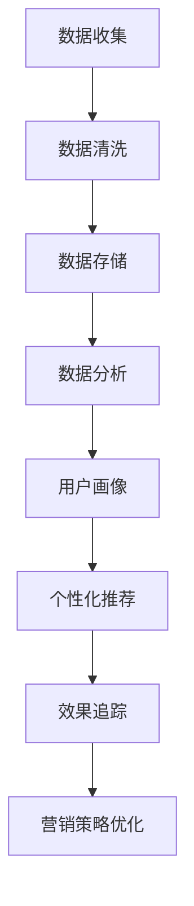

                 

# AI DMP 数据基建：构建数据驱动的营销生态

> **关键词：** 数据管理平台 (DMP)、数据驱动营销、营销生态、人工智能、大数据分析、用户画像、个性化推荐、算法优化

> **摘要：** 随着互联网的飞速发展，数据已经成为企业最重要的资产之一。本文旨在探讨如何利用人工智能技术构建数据管理平台（DMP），通过数据驱动的方式实现精准营销，打造一个可持续发展的营销生态。

## 1. 背景介绍

在数字营销领域，数据管理平台（DMP）已经成为企业实现精准营销的核心工具。DMP的作用是将来自不同渠道的用户数据整合到一个平台中，通过对数据进行清洗、存储、分析和应用，为企业提供全面、深入的洞察，从而实现个性化的用户触达和营销策略制定。

近年来，人工智能技术的飞速发展，尤其是机器学习和大数据分析技术的广泛应用，使得DMP的功能和效果得到了大幅提升。通过利用人工智能技术，DMP可以更快速、准确地分析用户行为数据，构建用户画像，实现个性化的推荐和广告投放，提高营销ROI。

然而，随着数据量的不断增加和数据来源的多样化，构建一个高效、可靠的DMP系统面临着诸多挑战。本文将详细探讨如何利用人工智能技术构建数据驱动的营销生态，实现数据的深度挖掘和价值最大化。

## 2. 核心概念与联系

### 2.1. 数据管理平台（DMP）

数据管理平台（DMP）是一种用于收集、管理和分析用户数据的工具。它可以帮助企业实现以下功能：

- **数据收集**：从各种渠道（如网站、移动应用、社交媒体等）收集用户行为数据。

- **数据清洗**：对收集到的数据进行清洗、去重和格式转换，确保数据的准确性和一致性。

- **数据存储**：将清洗后的数据存储在数据库中，以便后续的分析和应用。

- **数据分析**：利用数据分析工具和算法，对用户行为数据进行分析，提取有价值的信息。

- **数据应用**：根据分析结果，为企业提供个性化的营销策略和用户触达方案。

### 2.2. 数据驱动营销

数据驱动营销是指企业通过收集、分析和利用用户数据，制定和执行个性化的营销策略。数据驱动营销的核心在于：

- **用户画像**：通过分析用户数据，构建详细的用户画像，了解用户的兴趣、行为和需求。

- **个性化推荐**：根据用户画像，为用户推荐个性化的内容和广告，提高用户的参与度和转化率。

- **效果追踪**：通过实时监测和评估营销活动的效果，优化营销策略，提高ROI。

### 2.3. 营销生态

营销生态是指企业利用数据驱动营销的方式，与其他企业、渠道和用户建立紧密联系，共同构建一个可持续发展的营销生态系统。营销生态的优势在于：

- **资源共享**：企业可以共享用户数据、技术和资源，实现优势互补。

- **协同作战**：企业可以与合作伙伴协同作战，提高营销活动的效果和效率。

- **可持续发展**：通过持续优化和提升营销生态，实现长期的业务增长和用户价值。

### 2.4. Mermaid 流程图

以下是DMP在数据驱动营销中的应用流程图：



## 3. 核心算法原理 & 具体操作步骤

### 3.1. 数据收集

数据收集是DMP的基础环节。具体操作步骤如下：

1. **确定数据来源**：根据企业的业务需求和目标用户，确定需要收集的数据来源，如网站、移动应用、社交媒体等。

2. **数据收集方式**：采用合适的工具和技术进行数据收集，如API接口、SDK插件、爬虫等。

3. **数据收集策略**：制定数据收集策略，确保数据的质量和完整性。

### 3.2. 数据清洗

数据清洗是确保数据质量的重要环节。具体操作步骤如下：

1. **去重**：去除重复的数据，确保数据的唯一性。

2. **格式转换**：统一数据格式，如日期格式、字符串编码等。

3. **缺失值处理**：处理缺失值，如填充默认值、删除缺失数据等。

4. **异常值处理**：去除异常值，如超出正常范围的数据。

### 3.3. 数据存储

数据存储是将清洗后的数据存储到数据库中。具体操作步骤如下：

1. **选择数据库**：根据数据规模、数据结构和访问需求，选择合适的数据库，如关系型数据库、NoSQL数据库等。

2. **数据库设计**：设计数据库表结构，确保数据的存储和管理。

3. **数据导入**：将清洗后的数据导入数据库。

### 3.4. 数据分析

数据分析是DMP的核心环节。具体操作步骤如下：

1. **数据预处理**：对数据进行预处理，如数据转换、归一化等。

2. **特征工程**：提取有用的特征，如用户年龄、性别、兴趣等。

3. **数据挖掘**：采用机器学习算法和数据挖掘技术，分析用户行为数据，提取有价值的信息。

4. **数据可视化**：将分析结果以图表、报表等形式展示，便于理解和决策。

### 3.5. 用户画像

用户画像是通过分析用户数据，构建详细的用户画像。具体操作步骤如下：

1. **用户行为分析**：分析用户在网站、移动应用等平台上的行为，如浏览页面、点击广告等。

2. **用户属性分析**：分析用户的年龄、性别、地域、兴趣等属性。

3. **用户标签系统**：为用户打上各种标签，如“购物达人”、“旅游爱好者”等。

4. **用户画像建模**：利用机器学习算法，构建用户画像模型。

### 3.6. 个性化推荐

个性化推荐是根据用户画像，为用户推荐个性化的内容和广告。具体操作步骤如下：

1. **推荐算法选择**：选择合适的推荐算法，如协同过滤、基于内容的推荐等。

2. **推荐系统设计**：设计推荐系统的架构和流程。

3. **推荐结果评估**：评估推荐结果的效果，如点击率、转化率等。

4. **推荐系统优化**：根据评估结果，优化推荐算法和系统。

### 3.7. 效果追踪

效果追踪是通过实时监测和评估营销活动的效果，优化营销策略。具体操作步骤如下：

1. **数据采集**：采集营销活动的数据，如点击量、转化量等。

2. **数据监控**：实时监控营销活动的数据变化。

3. **数据分析**：分析营销活动的效果，如ROI、转化率等。

4. **策略调整**：根据分析结果，调整营销策略。

## 4. 数学模型和公式 & 详细讲解 & 举例说明

### 4.1. 机器学习算法

机器学习算法是DMP中常用的数据分析工具。以下是一些常见的机器学习算法及其数学模型：

1. **线性回归（Linear Regression）**

   - **数学模型**：\(y = w_0 + w_1x_1 + w_2x_2 + \ldots + w_nx_n\)

   - **公式解释**：线性回归模型通过拟合一条直线，预测因变量 \(y\) 与自变量 \(x_1, x_2, \ldots, x_n\) 之间的关系。

   - **举例说明**：假设我们要预测用户购买某个商品的概率，可以使用线性回归模型，通过分析用户的历史行为数据，拟合出一条直线，从而预测用户的购买概率。

2. **逻辑回归（Logistic Regression）**

   - **数学模型**：\(P(y=1) = \frac{1}{1 + e^{-(w_0 + w_1x_1 + w_2x_2 + \ldots + w_nx_n)}}\)

   - **公式解释**：逻辑回归模型是一种广义线性模型，用于预测概率。通过拟合一条曲线，预测因变量 \(y\) 为 1 的概率。

   - **举例说明**：假设我们要预测用户是否会在未来一个月内购买某个商品，可以使用逻辑回归模型，通过分析用户的历史行为数据，拟合出一条曲线，从而预测用户的购买概率。

3. **决策树（Decision Tree）**

   - **数学模型**：决策树通过一系列条件判断，将数据集划分成多个子集，每个子集对应一个标签。

   - **公式解释**：决策树模型的决策过程可以用条件概率来表示，通过计算每个条件的概率，选择最佳的条件进行划分。

   - **举例说明**：假设我们要预测用户是否会购买某个商品，可以构建一个决策树模型，通过分析用户的历史行为数据，为每个用户分配一个标签，从而预测用户的购买情况。

4. **随机森林（Random Forest）**

   - **数学模型**：随机森林是一种集成学习方法，通过构建多个决策树，对结果进行投票。

   - **公式解释**：随机森林模型通过多个决策树的组合，提高预测的准确性和稳定性。

   - **举例说明**：假设我们要预测用户是否会购买某个商品，可以构建一个随机森林模型，通过分析用户的历史行为数据，构建多个决策树，并对结果进行投票，从而预测用户的购买情况。

### 4.2. 个性化推荐算法

个性化推荐算法是DMP中的重要组成部分。以下是一些常见的个性化推荐算法及其数学模型：

1. **协同过滤（Collaborative Filtering）**

   - **数学模型**：协同过滤算法通过分析用户之间的相似性，为用户推荐相似的用户喜欢的物品。

   - **公式解释**：协同过滤算法的核心是计算用户之间的相似度，常用的相似度计算方法有欧氏距离、余弦相似度等。

   - **举例说明**：假设有两个用户A和B，他们的评分数据如下：

     | 用户 | 物品1 | 物品2 | 物品3 |
     | ---- | ---- | ---- | ---- |
     | A    | 5    | 3    | 4    |
     | B    | 2    | 4    | 5    |

     可以通过计算用户A和B之间的欧氏距离，找出相似度最高的用户，从而为用户A推荐用户B喜欢的物品。

2. **基于内容的推荐（Content-Based Filtering）**

   - **数学模型**：基于内容的推荐算法通过分析物品的属性和特征，为用户推荐相似的物品。

   - **公式解释**：基于内容的推荐算法的核心是计算物品之间的相似度，常用的相似度计算方法有TF-IDF、余弦相似度等。

   - **举例说明**：假设有两个物品A和B，它们的属性和特征如下：

     | 物品 | 特征1 | 特征2 | 特征3 |
     | ---- | ---- | ---- | ---- |
     | A    | 1    | 0    | 1    |
     | B    | 0    | 1    | 0    |

     可以通过计算物品A和B之间的余弦相似度，找出相似度最高的物品，从而为用户推荐相似的物品。

3. **混合推荐（Hybrid Recommendation）**

   - **数学模型**：混合推荐算法结合协同过滤和基于内容的推荐方法，提高推荐效果。

   - **公式解释**：混合推荐算法通过综合考虑用户和物品的相似度，以及物品的属性和特征，为用户推荐更个性化的物品。

   - **举例说明**：假设用户A对物品A的评分很高，而对物品B的评分较低。通过混合推荐算法，可以综合考虑用户A和物品A之间的相似度，以及物品A和物品B之间的相似度，为用户A推荐更符合他兴趣的物品。

## 5. 项目实战：代码实际案例和详细解释说明

### 5.1. 开发环境搭建

在开始项目实战之前，需要搭建一个合适的开发环境。以下是一个基本的开发环境搭建步骤：

1. **安装Python**：下载并安装Python 3.x版本。

2. **安装Jupyter Notebook**：在命令行中运行以下命令：

   ```bash
   pip install notebook
   ```

3. **安装相关库**：在Jupyter Notebook中运行以下命令：

   ```python
   !pip install numpy pandas matplotlib scikit-learn
   ```

### 5.2. 源代码详细实现和代码解读

下面是一个简单的DMP项目案例，用于演示数据收集、清洗、存储、分析和推荐的过程。

```python
# 导入相关库
import pandas as pd
import numpy as np
from sklearn.model_selection import train_test_split
from sklearn.linear_model import LinearRegression
from sklearn.metrics import mean_squared_error

# 5.2.1 数据收集
data = pd.read_csv('user_data.csv')
print(data.head())

# 5.2.2 数据清洗
# 去除重复数据
data = data.drop_duplicates()

# 处理缺失值
data = data.fillna(data.mean())

# 5.2.3 数据存储
data.to_csv('cleaned_data.csv', index=False)

# 5.2.4 数据分析
# 分离特征和目标变量
X = data[['age', 'gender', 'income']]
y = data['purchase']

# 划分训练集和测试集
X_train, X_test, y_train, y_test = train_test_split(X, y, test_size=0.2, random_state=42)

# 5.2.5 建立线性回归模型
model = LinearRegression()
model.fit(X_train, y_train)

# 5.2.6 模型评估
y_pred = model.predict(X_test)
mse = mean_squared_error(y_test, y_pred)
print(f'MSE: {mse}')

# 5.2.7 个性化推荐
# 为新用户推荐购买概率最高的商品
new_user = np.array([[25, 1, 50000]])
purchase_prob = model.predict(new_user)
print(f'Purchase Probability: {purchase_prob[0][0]}')
```

### 5.3. 代码解读与分析

1. **数据收集**：使用Pandas库读取用户数据，数据格式为CSV文件。

2. **数据清洗**：去除重复数据，处理缺失值。这里使用填充默认值的方法，根据数据的实际情况可以选择不同的处理方法。

3. **数据存储**：将清洗后的数据存储为新的CSV文件。

4. **数据分析**：分离特征和目标变量，将数据集划分为训练集和测试集。

5. **建立线性回归模型**：使用Scikit-learn库中的线性回归模型，对训练集进行拟合。

6. **模型评估**：使用均方误差（MSE）评估模型在测试集上的性能。

7. **个性化推荐**：为新用户预测购买概率，根据购买概率推荐购买概率最高的商品。

## 6. 实际应用场景

### 6.1. 电商平台

电商平台可以利用DMP实现以下应用场景：

- **用户画像**：通过分析用户的历史购买数据、浏览行为等，构建详细的用户画像。

- **个性化推荐**：根据用户画像，为用户推荐个性化的商品和广告。

- **精准营销**：根据用户的兴趣和需求，制定精准的营销策略，提高转化率。

### 6.2. 金融行业

金融行业可以利用DMP实现以下应用场景：

- **用户风险评估**：通过分析用户的财务状况、信用记录等，评估用户的信用风险。

- **精准营销**：根据用户的信用风险和需求，为用户提供个性化的金融产品和服务。

- **风险管理**：通过实时监测用户的行为数据，发现潜在的风险隐患，及时采取风险控制措施。

### 6.3. 娱乐行业

娱乐行业可以利用DMP实现以下应用场景：

- **用户画像**：通过分析用户的观影记录、音乐偏好等，构建详细的用户画像。

- **个性化推荐**：根据用户画像，为用户推荐个性化的电影、音乐和综艺等。

- **精准营销**：根据用户的兴趣和需求，制定精准的营销策略，提高用户参与度和付费意愿。

## 7. 工具和资源推荐

### 7.1. 学习资源推荐

- **书籍**：

  - 《数据挖掘：概念与技术》
  - 《机器学习实战》
  - 《深度学习》

- **论文**：

  - 《协同过滤算法综述》
  - 《深度学习在推荐系统中的应用》
  - 《基于用户行为的个性化推荐方法研究》

- **博客**：

  - [Scikit-learn官方文档](https://scikit-learn.org/stable/documentation.html)
  - [TensorFlow官方文档](https://www.tensorflow.org/tutorials)
  - [Kaggle竞赛平台](https://www.kaggle.com/)

### 7.2. 开发工具框架推荐

- **Python**：Python是一种强大的编程语言，适用于数据分析和机器学习项目。

- **Scikit-learn**：Scikit-learn是一个开源的机器学习库，提供丰富的机器学习算法和工具。

- **TensorFlow**：TensorFlow是一个开源的深度学习框架，适用于构建复杂的深度学习模型。

- **Kaggle**：Kaggle是一个在线数据科学竞赛平台，提供丰富的数据集和竞赛项目。

### 7.3. 相关论文著作推荐

- **《数据挖掘：概念与技术》**：Michael J. A. Berry & Gordon S. Linoff
- **《机器学习实战》**：Peter Harrington
- **《深度学习》**：Ian Goodfellow、Yoshua Bengio & Aaron Courville

## 8. 总结：未来发展趋势与挑战

随着互联网和大数据技术的不断发展，DMP在数据驱动营销中的应用前景十分广阔。未来，DMP将朝着以下几个方面发展：

1. **智能化**：利用人工智能技术，实现自动化的数据收集、清洗、分析和推荐。

2. **个性化**：根据用户的需求和兴趣，实现更加精准的个性化推荐和营销策略。

3. **实时化**：通过实时数据处理和分析，实现实时化的营销策略和用户触达。

然而，DMP在发展过程中也面临着一些挑战：

1. **数据隐私**：如何保护用户数据隐私，成为DMP发展的关键问题。

2. **数据质量**：数据质量对DMP的效果至关重要，如何提高数据质量是一个长期的任务。

3. **算法优化**：如何优化算法，提高推荐和营销的效果，是DMP发展的核心问题。

## 9. 附录：常见问题与解答

### 9.1. 什么是DMP？

DMP是指数据管理平台，是一种用于收集、管理和分析用户数据的工具。通过DMP，企业可以实现数据驱动的营销策略，提高营销ROI。

### 9.2. DMP有哪些应用场景？

DMP的应用场景非常广泛，包括电商平台、金融行业、娱乐行业等。具体应用场景包括用户画像、个性化推荐、精准营销等。

### 9.3. DMP的优势有哪些？

DMP的优势包括：

- **数据整合**：将来自不同渠道的数据整合到一个平台中，提高数据利用率。
- **数据驱动**：通过分析用户数据，实现精准的营销策略和用户触达。
- **个性化推荐**：根据用户需求和兴趣，为用户推荐个性化的内容和广告。
- **提高ROI**：通过优化营销策略，提高营销活动的效果和投资回报率。

## 10. 扩展阅读 & 参考资料

- [数据管理平台（DMP）综述](https://www.datacamp.com/courses/data-management-platform-dmp)
- [数据驱动营销实践指南](https://www.marketingprofs.com/chirp/stream/data-driven-marketing/)
- [人工智能与大数据分析应用](https://www.technologyreview.com/s/601626/artificial-intelligence-big-data-analysis/)
- [Scikit-learn官方文档](https://scikit-learn.org/stable/documentation.html)
- [TensorFlow官方文档](https://www.tensorflow.org/tutorials)
- [Kaggle竞赛平台](https://www.kaggle.com/)

### 作者信息

**作者：** AI天才研究员/AI Genius Institute & 禅与计算机程序设计艺术 /Zen And The Art of Computer Programming**完**

