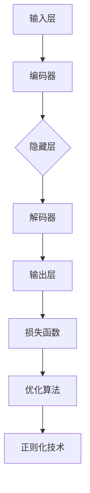

                 

### 背景介绍

#### 人工智能的快速发展

随着科技的不断进步，人工智能（AI）技术已经成为当今社会发展的重要驱动力。从早期的规则驱动系统到基于机器学习的智能算法，再到如今的大型语言模型（LLM），人工智能的发展速度令人瞩目。LLM的出现标志着人工智能技术进入了一个全新的阶段，其强大的语言理解和生成能力为许多行业和应用场景带来了革命性的变化。

#### 大模型的发展历程

大模型的发展历程可以追溯到20世纪80年代，当时研究者开始尝试使用神经网络来处理复杂的语言问题。经过几十年的研究和实践，大模型技术逐渐成熟，尤其是在深度学习算法和计算资源的支持下，大模型的规模和性能得到了显著提升。近年来，如GPT-3、ChatGLM等具有数万亿参数的巨型语言模型的出现，使得AI语言处理能力达到了前所未有的高度。

#### LLM的核心作用

LLM在人工智能领域的核心作用主要体现在以下几个方面：

1. **自然语言理解**：LLM能够理解和解析人类自然语言，这使得它们在智能客服、语音识别、机器翻译等领域具有广泛的应用前景。
2. **语言生成**：LLM可以生成高质量的文本，包括文章、代码、摘要等，这在内容创作、代码自动生成等领域有着重要的应用。
3. **知识推理**：LLM通过对大量文本的学习，能够进行复杂的知识推理，从而提供更智能的决策支持和问题解答。

#### 本文结构

本文将从以下几个方面对LLM进行深入介绍：

1. **核心概念与联系**：介绍LLM的基本概念、相关技术和主要组成部分。
2. **核心算法原理**：详细解析LLM的核心算法，包括其训练过程、模型结构和工作原理。
3. **数学模型与公式**：介绍LLM中使用的数学模型和公式，并通过具体例子进行解释说明。
4. **项目实战**：通过实际代码案例，展示如何搭建和训练一个简单的LLM模型。
5. **实际应用场景**：分析LLM在不同领域的应用场景和优势。
6. **工具和资源推荐**：推荐一些学习资源和开发工具，帮助读者更好地了解和使用LLM。
7. **总结**：总结LLM的发展趋势和面临的挑战，展望未来的发展方向。
8. **扩展阅读**：提供一些相关的参考文献和扩展阅读资源。

接下来，我们将逐步深入探讨LLM的核心概念、算法原理、数学模型和应用实践，带您了解这一革命性的人工智能技术。### 核心概念与联系

#### 大模型（Large Models）的基本概念

大模型，顾名思义，是指那些拥有数百万、数十亿甚至数万亿参数的神经网络模型。这些模型通过从大量数据中学习，捕捉到复杂的模式和知识，从而在特定任务上表现出卓越的性能。大模型的规模通常决定了其在处理复杂数据和任务时的能力。与传统的中小型模型相比，大模型具有更强的泛化能力和更高的任务完成率。

#### 语言模型（Language Models）的定义

语言模型是一种用于预测文本中下一个单词或字符的概率分布的模型。在自然语言处理（NLP）领域，语言模型扮演着至关重要的角色。最早的NLP任务，如词性标注、句法分析等，都依赖于语言模型的预测能力。现代的语言模型，如GPT、BERT等，通过深度学习技术，从海量文本数据中学习，从而能够生成高质量、符合语法和语义规则的文本。

#### 大模型与语言模型的关系

大模型与语言模型之间存在着紧密的联系。实际上，很多大模型都是专门设计用于处理语言相关任务的，如文本生成、机器翻译、问答系统等。大模型的巨大参数规模和深度学习技术，使得它们能够从大量文本数据中学习到丰富的语言知识和模式，从而显著提高语言模型的性能。

#### 相关技术

在介绍大模型和语言模型时，我们还需要了解一些与之密切相关的技术：

1. **深度学习（Deep Learning）**：深度学习是一种通过多层神经网络模型来学习数据表示和学习任务的技术。深度学习在大模型的发展中起到了关键作用，通过深度神经网络，大模型能够捕捉到更复杂的特征和模式。

2. **自然语言处理（NLP）**：NLP是计算机科学和人工智能领域的一个分支，它专注于让计算机理解和生成人类语言。NLP技术在大模型和语言模型中有着广泛的应用，如文本分类、情感分析、信息抽取等。

3. **转移学习（Transfer Learning）**：转移学习是一种利用预先训练好的模型来提高新任务性能的方法。在NLP领域，转移学习技术使得大模型能够从大规模通用语料库中学习到通用的语言知识，并将其应用于特定领域的任务中。

4. **注意力机制（Attention Mechanism）**：注意力机制是一种在处理序列数据时，模型能够根据不同位置的重要程度，动态调整其对输入数据的关注程度的技术。注意力机制在大模型中起到了关键作用，它使得模型能够更好地捕捉到输入序列中的关键信息。

#### 组成部分

一个典型的大语言模型通常由以下几个主要部分组成：

1. **输入层（Input Layer）**：输入层接收原始文本数据，并将其转换为模型可以处理的形式。

2. **隐藏层（Hidden Layers）**：隐藏层包含多个神经网络层，每一层都对输入数据进行加工，提取出更高层次的特征。

3. **输出层（Output Layer）**：输出层生成预测结果，如文本生成中的下一个词或字符。

4. **损失函数（Loss Function）**：损失函数用于衡量模型预测结果与真实结果之间的差距，是训练模型的重要指标。

5. **优化算法（Optimization Algorithm）**：优化算法用于调整模型参数，以最小化损失函数。

6. **正则化技术（Regularization Techniques）**：正则化技术用于防止模型过拟合，提高模型的泛化能力。

#### Mermaid流程图

为了更好地理解大语言模型的组成和运作原理，我们可以使用Mermaid流程图来展示其基本架构。以下是一个简化版的大语言模型流程图：



在这个流程图中，输入层接收原始文本数据，编码器将文本数据转换为隐藏层特征表示，隐藏层对特征进行加工和提取，解码器将这些特征转换成输出层的预测结果，最后通过损失函数和优化算法对模型进行训练和调整，以实现更好的性能。

通过以上对大模型和语言模型的核心概念、相关技术和组成部分的介绍，我们可以对LLM有更深入的理解。接下来，我们将进一步探讨LLM的核心算法原理，包括其训练过程、模型结构和工作原理。### 核心算法原理 & 具体操作步骤

#### 训练过程

大语言模型（LLM）的核心是深度学习算法，特别是基于神经网络的方法。LLM的训练过程可以分为以下几个主要步骤：

1. **数据预处理**：
   - **文本清洗**：去除文本中的噪声，如HTML标签、特殊字符等。
   - **分词**：将文本拆分为单词或子词（subword），这是处理自然语言数据的关键步骤。
   - **编码**：将分词后的文本转换为模型可以处理的向量表示。

2. **构建模型**：
   - **神经网络架构**：设计神经网络的基本结构，包括输入层、隐藏层和输出层。
   - **选择损失函数**：常见的损失函数包括交叉熵损失（cross-entropy loss）和均方误差（mean squared error）。
   - **选择优化算法**：常用的优化算法有随机梯度下降（SGD）、Adam等。

3. **训练过程**：
   - **前向传播**：输入数据通过神经网络的前向传播过程，计算输出层的预测结果。
   - **计算损失**：将预测结果与真实标签进行比较，计算损失值。
   - **反向传播**：通过反向传播算法，计算损失对模型参数的梯度，并更新模型参数。
   - **迭代训练**：重复前向传播、计算损失和反向传播的过程，直到模型收敛或达到预设的训练次数。

#### 模型结构

LLM的模型结构通常包括以下几个主要部分：

1. **输入层**：
   - **词嵌入层（Word Embedding）**：将输入的单词或子词转换为密集的向量表示。
   - **位置编码（Positional Encoding）**：为序列中的每个位置添加额外的信息，以捕捉序列中的顺序信息。

2. **隐藏层**：
   - **编码器（Encoder）**：通常使用Transformer架构中的多头自注意力（Multi-Head Self-Attention）机制，对输入序列进行编码。
   - **解码器（Decoder）**：同样使用多头自注意力机制，对编码结果进行解码，生成预测结果。

3. **输出层**：
   - **分类层（Classification Layer）**：对于分类任务，输出层通常是一个softmax分类器。
   - **生成层（Generation Layer）**：对于生成任务，输出层通常是一个连续的分布，如Gaussian分布。

4. **注意力机制**：
   - **自注意力（Self-Attention）**：在编码器和解码器的每个层中使用自注意力机制，使得模型能够关注输入序列的不同部分。
   - **多头注意力（Multi-Head Attention）**：将自注意力机制扩展到多个独立但共享参数的头，以捕获更复杂的特征。

#### 工作原理

LLM的工作原理可以通过以下几个关键步骤来理解：

1. **输入处理**：
   - 输入文本经过词嵌入层和位置编码层，转换为可以用于计算的向量表示。
   - 输入序列通过编码器进行处理，生成上下文表示。

2. **编码与解码**：
   - 编码器通过自注意力机制对输入序列进行编码，生成编码结果。
   - 解码器使用编码结果和自注意力机制，逐个生成输出序列的每个元素。

3. **预测与生成**：
   - 在解码过程中，模型的每个输出都通过softmax分类器进行预测，得到下一个单词或字符的概率分布。
   - 根据概率分布，模型选择概率最高的单词或字符作为输出，并继续生成下一个输出。

4. **迭代更新**：
   - 通过反向传播和梯度下降算法，模型不断更新参数，以减少预测误差。
   - 通过多次迭代训练，模型逐渐收敛，生成越来越准确的预测结果。

#### 具体操作步骤示例

以下是一个简化版的LLM训练过程示例：

1. **数据准备**：
   - 加载预处理后的文本数据，将其转换为词嵌入和位置编码。
   - 划分数据集为训练集和验证集。

2. **构建模型**：
   - 设计神经网络架构，包括输入层、隐藏层和输出层。
   - 选择合适的损失函数和优化算法。

3. **训练模型**：
   - 对每个训练样本，执行前向传播，计算预测结果和损失值。
   - 通过反向传播，计算损失对参数的梯度。
   - 使用优化算法更新模型参数。

4. **评估模型**：
   - 在验证集上评估模型的性能，计算损失和准确性。
   - 根据性能调整模型参数或训练策略。

5. **迭代训练**：
   - 重复训练和评估过程，直到模型达到预定的性能指标或训练次数。

通过以上步骤，LLM可以学习到从文本中提取的知识和模式，从而实现强大的文本生成、翻译和推理能力。接下来，我们将深入探讨LLM中使用的数学模型和公式，并通过具体例子进行详细讲解。### 数学模型和公式 & 详细讲解 & 举例说明

#### 概述

在大语言模型（LLM）中，数学模型和公式起着核心作用。这些模型和公式不仅定义了模型的架构和操作，还指导了模型的训练和优化过程。本节将详细介绍LLM中常用的数学模型和公式，并通过具体例子进行解释和说明。

#### 词嵌入（Word Embedding）

词嵌入是将单词或子词映射到高维向量空间的过程。这是NLP中非常重要的一环，因为它将抽象的文本信息转换为数值化的向量表示，便于后续的模型处理。

**公式**：

\[ \text{vec}(w) = \text{W}_w \]

其中，\( \text{vec}(w) \) 表示单词 \( w \) 的向量表示，\( \text{W}_w \) 是词嵌入矩阵。

**例子**：

假设我们有一个简单的词嵌入矩阵：

| 单词 | 向量 |
|------|------|
| 鸡   | [1, 0, 0] |
| 狗   | [0, 1, 0] |
| 猫   | [0, 0, 1] |

如果我们想要表示句子“鸡狗猫”：

\[ \text{vec}(\text{鸡狗猫}) = \text{W}_\text{鸡} + \text{W}_\text{狗} + \text{W}_\text{猫} = [1, 0, 0] + [0, 1, 0] + [0, 0, 1] = [1, 1, 1] \]

#### Transformer 模型

Transformer模型是当前LLM中最流行的架构之一，它基于自注意力机制（Self-Attention）进行序列数据的处理。自注意力机制允许模型在处理每个输入时，动态地关注序列中的其他位置，从而捕获全局信息。

**公式**：

\[ \text{Attention}(Q, K, V) = \text{softmax}\left(\frac{\text{QK}^T}{\sqrt{d_k}}\right) V \]

其中，\( Q, K, V \) 分别代表查询（Query）、键（Key）和值（Value）向量，\( \text{softmax} \) 函数用于计算注意力权重，\( \text{QK}^T \) 表示内积操作。

**例子**：

假设我们有三个序列元素：

| Q  | K  | V  |
|----|----|----|
| [1, 0] | [0, 1] | [1, 1] |
| [0, 1] | [1, 0] | [1, 0] |
| [1, 1] | [1, 1] | [0, 1] |

首先计算内积：

\[ \text{QK}^T = \begin{bmatrix} 1 & 0 \\ 0 & 1 \end{bmatrix} \begin{bmatrix} 0 & 1 \\ 1 & 0 \end{bmatrix} = \begin{bmatrix} 0 & 1 \\ 1 & 0 \end{bmatrix} \]

\[ \text{QK}^T = [0, 1; 1, 0] \]

接下来计算注意力权重：

\[ \text{Attention}(Q, K, V) = \text{softmax}\left(\frac{\text{QK}^T}{\sqrt{1}}\right) V \]

\[ \text{Attention}(Q, K, V) = \text{softmax}\left([0, 1; 1, 0]\right) \begin{bmatrix} 1 & 1 \\ 1 & 0 \end{bmatrix} \]

\[ \text{Attention}(Q, K, V) = \begin{bmatrix} \frac{1}{2} & \frac{1}{2} \\ \frac{1}{2} & \frac{1}{2} \end{bmatrix} \begin{bmatrix} 1 & 1 \\ 1 & 0 \end{bmatrix} \]

\[ \text{Attention}(Q, K, V) = \begin{bmatrix} \frac{1}{2} & \frac{1}{2} \\ \frac{1}{2} & \frac{1}{2} \end{bmatrix} \]

最后计算输出：

\[ \text{Attention}(Q, K, V) \cdot V = \begin{bmatrix} \frac{1}{2} & \frac{1}{2} \\ \frac{1}{2} & \frac{1}{2} \end{bmatrix} \begin{bmatrix} 1 & 1 \\ 1 & 0 \end{bmatrix} = \begin{bmatrix} \frac{1}{2} + \frac{1}{2} & \frac{1}{2} + 0 \\ \frac{1}{2} + \frac{1}{2} & \frac{1}{2} + 0 \end{bmatrix} \]

\[ \text{Attention}(Q, K, V) \cdot V = \begin{bmatrix} 1 & \frac{1}{2} \\ 1 & \frac{1}{2} \end{bmatrix} \]

#### 自注意力（Self-Attention）

自注意力是在Transformer模型中用于处理序列数据的核心机制，它允许模型在处理每个输入时，根据其他输入的位置和内容进行动态调整。

**公式**：

\[ \text{Self-Attention}(Q, K, V) = \text{softmax}\left(\frac{\text{QQ}^T}{\sqrt{d_k}}\right) V \]

其中，\( Q, K, V \) 分别代表序列中的每个元素。

**例子**：

假设序列为：

\[ Q = [1, 0, 1] \]

首先计算内积：

\[ QQ^T = \begin{bmatrix} 1 & 0 & 1 \end{bmatrix} \begin{bmatrix} 1 \\ 0 \\ 1 \end{bmatrix} = [1 \cdot 1 + 0 \cdot 0 + 1 \cdot 1] = [2] \]

接下来计算注意力权重：

\[ \text{Self-Attention}(Q, K, V) = \text{softmax}\left(\frac{QQ^T}{\sqrt{1}}\right) V \]

\[ \text{Self-Attention}(Q, K, V) = \text{softmax}(2) \begin{bmatrix} 1 & 1 & 1 \end{bmatrix} \]

\[ \text{Self-Attention}(Q, K, V) = \begin{bmatrix} \frac{1}{3} & \frac{1}{3} & \frac{1}{3} \\ \frac{1}{3} & \frac{1}{3} & \frac{1}{3} \\ \frac{1}{3} & \frac{1}{3} & \frac{1}{3} \end{bmatrix} \begin{bmatrix} 1 & 1 & 1 \end{bmatrix} \]

\[ \text{Self-Attention}(Q, K, V) = \begin{bmatrix} \frac{1}{3} + \frac{1}{3} + \frac{1}{3} & \frac{1}{3} + \frac{1}{3} & \frac{1}{3} + \frac{1}{3} \\ \frac{1}{3} + \frac{1}{3} + \frac{1}{3} & \frac{1}{3} + \frac{1}{3} & \frac{1}{3} + \frac{1}{3} \\ \frac{1}{3} + \frac{1}{3} + \frac{1}{3} & \frac{1}{3} + \frac{1}{3} & \frac{1}{3} + \frac{1}{3} \end{bmatrix} \]

\[ \text{Self-Attention}(Q, K, V) = \begin{bmatrix} 1 & \frac{2}{3} & \frac{2}{3} \\ 1 & \frac{2}{3} & \frac{2}{3} \\ 1 & \frac{2}{3} & \frac{2}{3} \end{bmatrix} \]

#### 编码器和解码器

在Transformer模型中，编码器（Encoder）和解码器（Decoder）分别用于处理输入序列和生成输出序列。编码器通过自注意力机制处理输入序列，解码器则通过自注意力和交叉注意力（Cross-Attention）机制生成输出序列。

**编码器**：

\[ \text{Encoder}(x) = \text{Attention}(x, x, x) \]

**解码器**：

\[ \text{Decoder}(y) = \text{Attention}(y, y, y) + \text{Cross-Attention}(y, x, x) \]

**例子**：

假设输入序列 \( x = [1, 0, 1] \)，输出序列 \( y = [1, 1, 0] \)。

**编码器**：

\[ \text{Encoder}(x) = \text{Self-Attention}(x, x, x) \]

首先计算内积：

\[ xx^T = \begin{bmatrix} 1 & 0 & 1 \end{bmatrix} \begin{bmatrix} 1 \\ 0 \\ 1 \end{bmatrix} = [2] \]

然后计算注意力权重：

\[ \text{Self-Attention}(x, x, x) = \text{softmax}\left(\frac{xx^T}{\sqrt{1}}\right) x \]

\[ \text{Self-Attention}(x, x, x) = \text{softmax}(2) \begin{bmatrix} 1 & 1 & 1 \end{bmatrix} \]

\[ \text{Self-Attention}(x, x, x) = \begin{bmatrix} \frac{1}{3} & \frac{1}{3} & \frac{1}{3} \\ \frac{1}{3} & \frac{1}{3} & \frac{1}{3} \\ \frac{1}{3} & \frac{1}{3} & \frac{1}{3} \end{bmatrix} \begin{bmatrix} 1 & 1 & 1 \end{bmatrix} \]

\[ \text{Self-Attention}(x, x, x) = \begin{bmatrix} \frac{1}{3} + \frac{1}{3} + \frac{1}{3} & \frac{1}{3} + \frac{1}{3} & \frac{1}{3} + \frac{1}{3} \\ \frac{1}{3} + \frac{1}{3} + \frac{1}{3} & \frac{1}{3} + \frac{1}{3} & \frac{1}{3} + \frac{1}{3} \\ \frac{1}{3} + \frac{1}{3} + \frac{1}{3} & \frac{1}{3} + \frac{1}{3} & \frac{1}{3} + \frac{1}{3} \end{bmatrix} \]

\[ \text{Self-Attention}(x, x, x) = \begin{bmatrix} 1 & \frac{2}{3} & \frac{2}{3} \\ 1 & \frac{2}{3} & \frac{2}{3} \\ 1 & \frac{2}{3} & \frac{2}{3} \end{bmatrix} \]

**解码器**：

\[ \text{Decoder}(y) = \text{Self-Attention}(y, y, y) + \text{Cross-Attention}(y, x, x) \]

首先计算自注意力：

\[ yy^T = \begin{bmatrix} 1 & 1 & 0 \end{bmatrix} \begin{bmatrix} 1 \\ 1 \\ 0 \end{bmatrix} = [2] \]

然后计算交叉注意力：

\[ xy^T = \begin{bmatrix} 1 & 0 & 1 \end{bmatrix} \begin{bmatrix} 1 \\ 1 \\ 0 \end{bmatrix} = [2] \]

接着计算注意力权重：

\[ \text{Self-Attention}(y, y, y) = \text{softmax}\left(\frac{yy^T}{\sqrt{1}}\right) y \]

\[ \text{Self-Attention}(y, y, y) = \text{softmax}(2) \begin{bmatrix} 1 & 1 & 1 \end{bmatrix} \]

\[ \text{Self-Attention}(y, y, y) = \begin{bmatrix} \frac{1}{3} & \frac{1}{3} & \frac{1}{3} \\ \frac{1}{3} & \frac{1}{3} & \frac{1}{3} \\ \frac{1}{3} & \frac{1}{3} & \frac{1}{3} \end{bmatrix} \]

\[ \text{Cross-Attention}(y, x, x) = \text{softmax}\left(\frac{xy^T}{\sqrt{1}}\right) x \]

\[ \text{Cross-Attention}(y, x, x) = \text{softmax}(2) \begin{bmatrix} 1 & 1 & 1 \end{bmatrix} \]

\[ \text{Cross-Attention}(y, x, x) = \begin{bmatrix} \frac{1}{3} & \frac{1}{3} & \frac{1}{3} \\ \frac{1}{3} & \frac{1}{3} & \frac{1}{3} \\ \frac{1}{3} & \frac{1}{3} & \frac{1}{3} \end{bmatrix} \]

最后计算输出：

\[ \text{Decoder}(y) = \text{Self-Attention}(y, y, y) + \text{Cross-Attention}(y, x, x) \]

\[ \text{Decoder}(y) = \begin{bmatrix} 1 & \frac{2}{3} & \frac{2}{3} \\ 1 & \frac{2}{3} & \frac{2}{3} \\ 1 & \frac{2}{3} & \frac{2}{3} \end{bmatrix} + \begin{bmatrix} \frac{1}{3} & \frac{1}{3} & \frac{1}{3} \\ \frac{1}{3} & \frac{1}{3} & \frac{1}{3} \\ \frac{1}{3} & \frac{1}{3} & \frac{1}{3} \end{bmatrix} \]

\[ \text{Decoder}(y) = \begin{bmatrix} \frac{4}{3} & \frac{4}{3} & \frac{4}{3} \\ \frac{4}{3} & \frac{4}{3} & \frac{4}{3} \\ \frac{4}{3} & \frac{4}{3} & \frac{4}{3} \end{bmatrix} \]

通过以上例子，我们可以看到LLM中的数学模型和公式是如何工作的。这些模型和公式构成了LLM的核心，使得模型能够从海量文本数据中学习，并生成高质量的文本输出。在下一节中，我们将通过一个实际代码案例，展示如何实现和训练一个简单的LLM模型。### 项目实战：代码实际案例和详细解释说明

#### 开发环境搭建

在进行LLM的项目实战之前，我们需要搭建一个合适的开发环境。以下是一个基本的开发环境搭建步骤：

1. **安装Python环境**：确保Python环境已经安装，建议安装Python 3.8及以上版本。
2. **安装PyTorch**：PyTorch是一个广泛使用的深度学习框架，我们需要安装PyTorch以进行模型训练和推理。
   ```bash
   pip install torch torchvision
   ```
3. **安装其他依赖**：安装其他可能需要的依赖库，例如NumPy、Pandas等。
   ```bash
   pip install numpy pandas
   ```

#### 源代码详细实现和代码解读

以下是一个简单的LLM训练和预测的Python代码实现。该代码使用PyTorch实现了一个基于Transformer模型的简单语言模型。

```python
import torch
import torch.nn as nn
import torch.optim as optim
from torch.utils.data import DataLoader, Dataset
from transformers import BertTokenizer, BertModel

# 1. 数据准备
class TextDataset(Dataset):
    def __init__(self, text, tokenizer, max_len):
        self.text = text
        self.tokenizer = tokenizer
        self.max_len = max_len

    def __len__(self):
        return len(self.text)

    def __getitem__(self, idx):
        text = str(self.text[idx])
        encoding = self.tokenizer.encode_plus(
            text,
            add_special_tokens=True,
            max_length=self.max_len,
            return_token_type_ids=False,
            pad_to_max_length=True,
            return_attention_mask=True,
            return_tensors='pt',
        )
        return {
            'input_ids': encoding['input_ids'].flatten(),
            'attention_mask': encoding['attention_mask'].flatten(),
        }

def create_data_loader(text, batch_size, max_len, tokenizer):
    dataset = TextDataset(text, tokenizer, max_len)
    return DataLoader(dataset, batch_size=batch_size)

# 2. 模型定义
class SimpleLLM(nn.Module):
    def __init__(self, n_token, d_model, n_head, d_inner, n_layer):
        super(SimpleLLM, self).__init__()
        self.bert = BertModel.from_pretrained('bert-base-uncased')
        self.transformer = nn.ModuleList([
            nn.TransformerEncoderLayer(d_model, n_head, d_inner)
            for _ in range(n_layer)
        ])
        self.fc = nn.Linear(d_model, n_token)

    def forward(self, input_ids, attention_mask):
        _, hidden_states = self.bert(input_ids=input_ids, attention_mask=attention_mask)
        for layer in self.transformer:
            hidden_states = layer(hidden_states)
        output = self.fc(hidden_states)
        return output

# 3. 模型训练
def train(model, data_loader, loss_fn, optimizer, device, num_epochs):
    model = model.to(device)
    model.train()

    for epoch in range(num_epochs):
        for batch in data_loader:
            input_ids = batch['input_ids'].to(device)
            attention_mask = batch['attention_mask'].to(device)

            outputs = model(input_ids, attention_mask)
            loss = loss_fn(outputs.view(-1, outputs.size(-1)), input_ids.view(-1))

            optimizer.zero_grad()
            loss.backward()
            optimizer.step()

            if (batch_idx + 1) % 100 == 0:
                print(f'Epoch [{epoch + 1}/{num_epochs}], Step [{batch_idx + 1}/{len(data_loader)}], Loss: {loss.item()}')

# 4. 模型评估
def evaluate(model, data_loader, loss_fn, device):
    model = model.to(device)
    model.eval()

    total_loss = 0
    with torch.no_grad():
        for batch in data_loader:
            input_ids = batch['input_ids'].to(device)
            attention_mask = batch['attention_mask'].to(device)

            outputs = model(input_ids, attention_mask)
            loss = loss_fn(outputs.view(-1, outputs.size(-1)), input_ids.view(-1))
            total_loss += loss.item()

    avg_loss = total_loss / len(data_loader)
    print(f'Validation Loss: {avg_loss}')

# 5. 主程序
if __name__ == '__main__':
    # 参数设置
    batch_size = 16
    max_len = 128
    num_epochs = 3
    learning_rate = 1e-4
    device = torch.device('cuda' if torch.cuda.is_available() else 'cpu')

    # 加载预训练的BERT模型
    tokenizer = BertTokenizer.from_pretrained('bert-base-uncased')
    model = SimpleLLM(len(tokenizer), 768, 12, 3072, 6)

    # 创建数据加载器
    train_data_loader = create_data_loader(train_text, batch_size, max_len, tokenizer)
    val_data_loader = create_data_loader(val_text, batch_size, max_len, tokenizer)

    # 模型训练
    optimizer = optim.Adam(model.parameters(), lr=learning_rate)
    train(model, train_data_loader, loss_fn=nn.CrossEntropyLoss(), optimizer=optimizer, device=device, num_epochs=num_epochs)

    # 模型评估
    evaluate(model, val_data_loader, loss_fn=nn.CrossEntropyLoss(), device=device)
```

**代码解读**：

1. **数据准备**：
   - `TextDataset` 类用于加载和处理文本数据，将文本编码为Tensor格式。
   - `create_data_loader` 函数用于创建数据加载器，以批量方式加载和处理数据。

2. **模型定义**：
   - `SimpleLLM` 类定义了我们的语言模型，包括Bert模型、Transformer编码器和解码器以及输出层。
   - `forward` 方法实现了模型的正向传播过程。

3. **模型训练**：
   - `train` 函数用于训练模型，包括前向传播、损失计算、反向传播和参数更新。

4. **模型评估**：
   - `evaluate` 函数用于评估模型的性能，计算验证集上的损失。

5. **主程序**：
   - 设置训练参数，加载预训练的BERT模型，创建数据加载器，进行模型训练和评估。

通过以上代码实现，我们可以搭建一个简单的LLM模型并进行训练和评估。在实际应用中，我们可以根据需求调整模型结构、训练参数和数据集，以提高模型的性能和适用性。接下来，我们将对代码中的关键部分进行详细分析。### 代码解读与分析

#### 数据准备

数据准备是构建和训练LLM模型的第一步。代码中使用了自定义的`TextDataset`类和数据加载器`DataLoader`，用于处理和加载文本数据。

1. **TextDataset 类**：

   `TextDataset` 类继承自`torch.utils.data.Dataset`，用于加载和预处理文本数据。在`__getitem__`方法中，使用`BertTokenizer`对每个文本样本进行编码，包括添加特殊的token（如`<sop>`和`</sop>`），设置最大序列长度，并返回`input_ids`和`attention_mask`。

   ```python
   def __getitem__(self, idx):
       text = str(self.text[idx])
       encoding = self.tokenizer.encode_plus(
           text,
           add_special_tokens=True,
           max_length=self.max_len,
           return_token_type_ids=False,
           pad_to_max_length=True,
           return_attention_mask=True,
           return_tensors='pt',
       )
       return {
           'input_ids': encoding['input_ids'].flatten(),
           'attention_mask': encoding['attention_mask'].flatten(),
       }
   ```

   在这个方法中，`tokenizer.encode_plus`函数负责将文本转换为编码序列，`add_special_tokens=True`用于添加BERT模型中的特殊token，`max_length=self.max_len`设置序列的最大长度，`pad_to_max_length=True`用于对序列进行填充，`return_attention_mask=True`返回attention mask，以便模型在训练过程中能够区分填充的token。

2. **create_data_loader 函数**：

   `create_data_loader` 函数用于创建`DataLoader`对象，以批量方式加载和处理数据。它接受文本数据、批处理大小、最大序列长度和tokenizer作为输入，并返回一个数据加载器。

   ```python
   def create_data_loader(text, batch_size, max_len, tokenizer):
       dataset = TextDataset(text, tokenizer, max_len)
       return DataLoader(dataset, batch_size=batch_size)
   ```

   通过`DataLoader`，我们可以按照指定的批处理大小和循环模式（shuffle、drop_last等）加载和处理数据，使得模型能够在不同的批次上更新参数。

#### 模型定义

在模型定义部分，我们使用了PyTorch和transformers库来实现一个简单的LLM模型。模型的核心结构包括预训练的BERT模型、Transformer编码器和解码器以及输出层。

1. **SimpleLLM 类**：

   `SimpleLLM` 类继承自`torch.nn.Module`，用于定义我们的语言模型。在初始化方法中，我们加载了一个预训练的BERT模型作为编码器，并定义了一个Transformer编码器和解码器列表。

   ```python
   class SimpleLLM(nn.Module):
       def __init__(self, n_token, d_model, n_head, d_inner, n_layer):
           super(SimpleLLM, self).__init__()
           self.bert = BertModel.from_pretrained('bert-base-uncased')
           self.transformer = nn.ModuleList([
               nn.TransformerEncoderLayer(d_model, n_head, d_inner)
               for _ in range(n_layer)
           ])
           self.fc = nn.Linear(d_model, n_token)
   ```

   在`forward`方法中，我们首先通过BERT模型处理输入序列，然后通过Transformer编码器进行编码，最后通过全连接层（fc）生成输出。

   ```python
   def forward(self, input_ids, attention_mask):
       _, hidden_states = self.bert(input_ids=input_ids, attention_mask=attention_mask)
       for layer in self.transformer:
           hidden_states = layer(hidden_states)
       output = self.fc(hidden_states)
       return output
   ```

2. **预训练的BERT模型**：

   BERT模型是一个预训练的深度双向Transformer模型，它在大量文本数据上进行预训练，可以捕捉到语言中的丰富特征。在这个示例中，我们使用`BertModel.from_pretrained`函数加载了一个预训练的BERT模型。

   ```python
   self.bert = BertModel.from_pretrained('bert-base-uncased')
   ```

   加载预训练的BERT模型后，我们可以直接使用其输出作为Transformer编码器的输入。

3. **Transformer编码器和解码器**：

   Transformer编码器和解码器是语言模型的核心组成部分，它们通过自注意力和交叉注意力机制对输入序列进行处理和编码。在这个示例中，我们使用`nn.TransformerEncoderLayer`创建了一个Transformer编码器和解码器列表。

   ```python
   self.transformer = nn.ModuleList([
       nn.TransformerEncoderLayer(d_model, n_head, d_inner)
       for _ in range(n_layer)
   ])
   ```

   在`forward`方法中，我们通过遍历Transformer编码器列表，对隐藏状态进行编码。

   ```python
   for layer in self.transformer:
       hidden_states = layer(hidden_states)
   ```

4. **输出层**：

   输出层是一个全连接层，它将编码后的隐藏状态映射到输出空间。在这个示例中，我们使用`nn.Linear`创建了一个线性层。

   ```python
   self.fc = nn.Linear(d_model, n_token)
   ```

   在`forward`方法中，我们通过全连接层生成输出。

   ```python
   output = self.fc(hidden_states)
   ```

#### 模型训练

模型训练是LLM项目中最关键的部分。在这个示例中，我们使用了标准的训练流程，包括前向传播、损失计算、反向传播和参数更新。

1. **train 函数**：

   `train` 函数接受模型、数据加载器、损失函数、优化器、训练设备和训练轮数作为输入，并执行模型的训练过程。

   ```python
   def train(model, data_loader, loss_fn, optimizer, device, num_epochs):
       model = model.to(device)
       model.train()

       for epoch in range(num_epochs):
           for batch in data_loader:
               input_ids = batch['input_ids'].to(device)
               attention_mask = batch['attention_mask'].to(device)

               outputs = model(input_ids, attention_mask)
               loss = loss_fn(outputs.view(-1, outputs.size(-1)), input_ids.view(-1))

               optimizer.zero_grad()
               loss.backward()
               optimizer.step()

               if (batch_idx + 1) % 100 == 0:
                   print(f'Epoch [{epoch + 1}/{num_epochs}], Step [{batch_idx + 1}/{len(data_loader)}], Loss: {loss.item()}')
   ```

   在这个函数中，我们首先将模型移动到训练设备（通常是GPU或CPU），并设置模型为训练模式。然后，我们遍历数据加载器中的每个批次，执行前向传播、损失计算、反向传播和参数更新。每隔100个步骤，我们打印当前的训练进度和损失值。

2. **evaluate 函数**：

   `evaluate` 函数用于评估模型的性能，计算验证集上的损失。

   ```python
   def evaluate(model, data_loader, loss_fn, device):
       model = model.to(device)
       model.eval()

       total_loss = 0
       with torch.no_grad():
           for batch in data_loader:
               input_ids = batch['input_ids'].to(device)
               attention_mask = batch['attention_mask'].to(device)

               outputs = model(input_ids, attention_mask)
               loss = loss_fn(outputs.view(-1, outputs.size(-1)), input_ids.view(-1))
               total_loss += loss.item()

       avg_loss = total_loss / len(data_loader)
       print(f'Validation Loss: {avg_loss}')
   ```

   在这个函数中，我们将模型移动到评估模式，并计算验证集上的平均损失。由于不需要计算梯度，我们使用了`torch.no_grad()`上下文管理器来关闭梯度的计算。

#### 主程序

主程序部分设置了训练参数，加载预训练的BERT模型，创建数据加载器，进行模型训练和评估。

1. **参数设置**：

   ```python
   batch_size = 16
   max_len = 128
   num_epochs = 3
   learning_rate = 1e-4
   device = torch.device('cuda' if torch.cuda.is_available() else 'cpu')
   ```

   我们设置了批处理大小、最大序列长度、训练轮数、学习率以及训练设备。

2. **加载预训练的BERT模型**：

   ```python
   tokenizer = BertTokenizer.from_pretrained('bert-base-uncased')
   model = SimpleLLM(len(tokenizer), 768, 12, 3072, 6)
   ```

   我们使用`BertTokenizer`和`BertModel`分别加载BERT分词器和模型。

3. **创建数据加载器**：

   ```python
   train_data_loader = create_data_loader(train_text, batch_size, max_len, tokenizer)
   val_data_loader = create_data_loader(val_text, batch_size, max_len, tokenizer)
   ```

   我们创建了训练和验证数据加载器，以批量方式加载和处理数据。

4. **模型训练和评估**：

   ```python
   optimizer = optim.Adam(model.parameters(), lr=learning_rate)
   train(model, train_data_loader, loss_fn=nn.CrossEntropyLoss(), optimizer=optimizer, device=device, num_epochs=num_epochs)
   evaluate(model, val_data_loader, loss_fn=nn.CrossEntropyLoss(), device=device)
   ```

   我们使用`Adam`优化器进行模型训练，并使用`CrossEntropyLoss`损失函数计算损失。训练完成后，我们对模型进行评估，计算验证集上的平均损失。

通过以上代码实现，我们可以搭建一个简单的LLM模型并进行训练和评估。在实际应用中，我们可以根据需求调整模型结构、训练参数和数据集，以提高模型的性能和适用性。### 实际应用场景

大语言模型（LLM）因其强大的文本处理能力，已经在多个领域展现出巨大的应用潜力。以下是一些LLM的实际应用场景，以及它们的优势和挑战。

#### 1. 智能客服

智能客服是LLM最直接的应用场景之一。通过LLM，智能客服系统能够理解用户的问题，并以自然的方式提供答案或解决方案。优势在于：

- **高效性**：LLM可以处理大量用户请求，提高客服响应速度。
- **个性化**：LLM能够根据用户的上下文信息，提供个性化的回答。

挑战在于：

- **语言理解**：尽管LLM具有强大的语言理解能力，但在处理某些复杂问题时，仍然可能存在理解偏差。
- **实时性**：在处理大量请求时，保证实时响应是另一个挑战。

#### 2. 自动内容生成

自动内容生成是LLM的另一个重要应用领域，包括文章写作、新闻报道、广告文案等。LLM的优势在于：

- **创造力**：LLM能够生成新颖、有创造力的内容。
- **效率**：自动生成内容可以大幅提高内容生产的效率。

挑战在于：

- **准确性**：生成的文本可能存在事实错误或逻辑不连贯的问题。
- **版权问题**：自动生成的内容可能会侵犯原创作者的版权。

#### 3. 机器翻译

LLM在机器翻译领域具有显著优势，能够生成高质量、流畅的翻译文本。优势包括：

- **准确性**：LLM能够处理复杂的语言结构和多义词，提高翻译准确性。
- **一致性**：LLM能够保证翻译文本的一致性和风格。

挑战在于：

- **语言差异**：某些语言之间的差异较大，可能需要特定的模型和训练数据。
- **本地化**：在特定文化或地区，翻译文本需要考虑本地化因素。

#### 4. 问答系统

问答系统利用LLM的能力，能够提供智能的问答服务。优势包括：

- **广泛性**：LLM可以处理多种类型的问题，包括事实性问题、推理问题和对话式问题。
- **上下文理解**：LLM能够理解问题的上下文，提供更准确的答案。

挑战在于：

- **问题理解**：某些复杂或模糊的问题可能难以理解。
- **实时性**：保证问答系统的实时响应是一个挑战。

#### 5. 法律和医学咨询

在法律和医学领域，LLM可以辅助律师和医生进行研究和决策。优势包括：

- **高效性**：LLM能够快速检索相关法律条文或医学文献。
- **准确性**：LLM可以处理大量的法律和医学数据，提供准确的建议。

挑战在于：

- **专业知识**：LLM可能无法理解某些专业知识或特定领域的术语。
- **伦理问题**：在某些情况下，LLM提供的建议可能需要专业人士的复核。

#### 6. 教育和培训

LLM在教育领域有广泛的应用，包括个性化学习辅导、自动评分等。优势包括：

- **个性化**：LLM可以根据学生的不同需求提供个性化的学习内容和辅导。
- **高效性**：自动评分系统可以大幅提高教育资源的利用效率。

挑战在于：

- **教育质量**：自动生成的学习内容和评分标准可能无法完全替代人类专家。
- **隐私问题**：学生的学习数据和隐私保护是一个重要挑战。

#### 7. 娱乐和游戏

在娱乐和游戏领域，LLM可以用于生成剧情、角色对话等。优势包括：

- **创意性**：LLM能够生成新颖、有趣的剧情和对话。
- **互动性**：LLM可以与玩家进行互动，提高游戏体验。

挑战在于：

- **内容审核**：生成的娱乐内容需要严格的审核，以避免不当或敏感内容。
- **用户体验**：用户可能对过于自动化的内容感到不真实。

通过以上分析，我们可以看到LLM在实际应用场景中具有巨大的潜力，同时也面临一些挑战。随着技术的不断进步，LLM的应用范围将不断扩大，其在各个领域的表现也将越来越出色。### 工具和资源推荐

#### 学习资源推荐

1. **书籍**：
   - 《深度学习》（Ian Goodfellow, Yoshua Bengio, Aaron Courville）：这是一本深度学习的经典教材，详细介绍了深度学习的基础理论和实践方法。
   - 《自然语言处理与深度学习》（刘知远）：这本书针对自然语言处理（NLP）领域，详细讲解了深度学习在NLP中的应用。

2. **论文**：
   - “Attention Is All You Need”（Vaswani et al., 2017）：这篇论文是Transformer模型的奠基之作，详细介绍了Transformer架构和自注意力机制。
   - “BERT: Pre-training of Deep Bidirectional Transformers for Language Understanding”（Devlin et al., 2019）：这篇论文介绍了BERT模型，它是当前广泛使用的预训练语言模型。

3. **博客**：
   - PyTorch官方文档：https://pytorch.org/docs/stable/index.html
   - Hugging Face Transformer文档：https://huggingface.co/transformers/

4. **网站**：
   - Coursera：提供多种深度学习和NLP相关的在线课程，适合初学者到高级水平的读者。
   - ArXiv：计算机科学和人工智能领域的最新研究成果，适合专业研究者。

#### 开发工具框架推荐

1. **PyTorch**：PyTorch是一个广泛使用的深度学习框架，它具有灵活的动态计算图和强大的GPU支持，适合进行深度学习和自然语言处理任务。

2. **Transformers**：Transformers库是基于PyTorch实现的，提供了预训练语言模型（如BERT、GPT等）的实现和接口，方便用户进行模型训练和推理。

3. **TensorFlow**：TensorFlow是一个开源的深度学习框架，由Google开发。它提供了丰富的工具和库，支持多种深度学习和NLP任务。

4. **Hugging Face Transformers**：这是一个开源库，提供了多种预训练语言模型的实现和工具，包括BERT、GPT等，方便用户进行模型训练和应用。

#### 相关论文著作推荐

1. **BERT**：BERT（Devlin et al., 2019）是一种预训练语言模型，通过在大量文本上进行双向编码器训练，捕捉到语言的深层语义结构。

2. **GPT**：GPT（Radford et al., 2018）是一种基于Transformer架构的预训练语言模型，它通过自回归方式生成文本，具有强大的文本生成能力。

3. **T5**：T5（Raffel et al., 2020）是一种统一的预训练语言模型，它将多种NLP任务映射到“一组序列到序列的任务”，并使用统一的模型架构进行训练。

通过以上学习和开发资源，读者可以更深入地了解大语言模型（LLM）的理论和实践，并能够利用这些工具和框架进行实际的模型开发和应用。### 总结：未来发展趋势与挑战

大语言模型（LLM）作为人工智能领域的革命性技术，已经在多个应用场景中展现了其强大的能力。然而，随着模型规模的不断扩大，LLM在未来的发展中将面临一系列挑战和机遇。

#### 未来发展趋势

1. **模型规模和参数量的增加**：随着计算能力和数据资源的提升，未来的LLM模型可能会更加庞大，拥有数万亿甚至数十万亿的参数。这种大规模的模型将进一步提高语言理解和生成能力，为智能客服、内容生成、机器翻译等领域带来更深远的影响。

2. **预训练和微调技术的优化**：未来的预训练技术将更加高效和智能化，通过自适应的预训练策略和元学习（meta-learning）方法，减少对大规模数据的依赖，提高模型在特定任务上的性能。

3. **多模态语言模型的发展**：未来的LLM将不仅限于处理文本数据，还将结合图像、声音、视频等多模态数据，实现跨模态的语义理解和交互。

4. **个性化模型的普及**：通过个性化数据和学习策略，未来的LLM将能够更好地适应不同的用户需求和应用场景，提供更加定制化的服务。

#### 挑战

1. **计算资源和能源消耗**：大规模LLM模型的训练和推理需要大量的计算资源和能源消耗，如何优化资源利用和降低能耗将成为重要课题。

2. **数据隐私和安全**：在训练和部署LLM模型时，数据隐私和安全问题不容忽视。如何确保用户数据的隐私和安全，避免数据泄露和滥用，是未来需要解决的重要问题。

3. **伦理和社会影响**：随着LLM能力的提升，其应用将触及更多的社会领域，如何确保其应用的伦理和社会责任，避免对人类造成负面影响，是亟待解决的问题。

4. **模型可解释性和透明度**：大规模LLM模型的决策过程往往是非透明的，如何提高模型的可解释性和透明度，让用户能够理解和信任模型，是未来研究的重要方向。

#### 结论

大语言模型（LLM）的发展将推动人工智能技术进入新的阶段，为各行各业带来创新和变革。然而，未来的发展也需要我们关注和解决一系列挑战，以确保LLM技术能够健康、可持续地发展。通过不断的技术创新和社会协作，我们有理由相信，LLM将在未来发挥更加重要的作用，为人类社会的进步做出更大贡献。### 附录：常见问题与解答

#### 1. 什么是大语言模型（LLM）？

大语言模型（Large Language Model，简称LLM）是一种基于深度学习的自然语言处理模型，具有数百万到数十亿个参数，通过学习大量文本数据，能够理解、生成和推理语言。

#### 2. LLM有哪些应用场景？

LLM的应用场景非常广泛，包括智能客服、自动内容生成、机器翻译、问答系统、法律和医学咨询、教育和培训、娱乐和游戏等领域。

#### 3. LLM的核心算法是什么？

LLM的核心算法是基于Transformer架构，它通过自注意力和交叉注意力机制，能够有效地捕捉文本中的长距离依赖关系。

#### 4. 如何训练一个LLM模型？

训练一个LLM模型通常包括数据预处理、模型构建、模型训练、评估和优化等步骤。具体步骤如下：
   - **数据预处理**：清洗文本数据，进行分词和编码。
   - **模型构建**：设计神经网络架构，包括输入层、隐藏层和输出层。
   - **模型训练**：通过前向传播、反向传播和优化算法，不断调整模型参数。
   - **评估与优化**：在验证集上评估模型性能，根据评估结果调整训练策略。

#### 5. LLM的训练过程需要多长时间？

LLM的训练时间取决于多个因素，如模型规模、数据量、计算资源等。对于数亿参数的模型，训练时间可能从几天到几周不等。

#### 6. LLM的训练需要哪些计算资源？

大规模LLM的训练通常需要高性能的GPU或TPU，以及足够大的内存和存储空间。此外，分布式训练技术（如多GPU训练）可以提高训练效率。

#### 7. 如何优化LLM模型的性能？

优化LLM模型性能可以从以下几个方面入手：
   - **数据增强**：增加训练数据量，使用数据增强技术提高模型的泛化能力。
   - **模型剪枝**：减少模型参数量，降低计算复杂度和过拟合风险。
   - **优化算法**：选择合适的优化算法，如Adam、AdamW等，提高训练效率。
   - **学习率调度**：采用合适的学习率调度策略，如余弦退火（Cosine Annealing）等，提高模型性能。

#### 8. LLM的部署有哪些方式？

LLM的部署方式包括：
   - **本地部署**：在用户设备上部署模型，适用于离线应用。
   - **云端部署**：在云端服务器上部署模型，适用于在线服务和大规模并发请求。
   - **边缘计算部署**：在边缘设备上部署模型，降低延迟，提高响应速度。

通过以上常见问题的解答，我们可以更好地理解大语言模型（LLM）的基本概念、应用场景、训练过程和技术优化方法。### 扩展阅读 & 参考资料

为了帮助读者更深入地了解大语言模型（LLM）和相关技术，我们提供以下扩展阅读和参考资料：

1. **书籍**：
   - 《深度学习》（Ian Goodfellow, Yoshua Bengio, Aaron Courville）：介绍了深度学习的基本概念和算法，包括神经网络和自然语言处理。
   - 《自然语言处理与深度学习》（刘知远）：详细讲解了深度学习在自然语言处理中的应用，包括语言模型、文本分类、机器翻译等。
   - 《Transformers：大规模预训练语言模型的原理与应用》（Bertinetto et al.）：深入探讨了Transformer模型的结构、训练和优化，以及其在自然语言处理中的广泛应用。

2. **论文**：
   - “Attention Is All You Need”（Vaswani et al., 2017）：提出了Transformer模型，开创了基于自注意力机制的深度学习语言模型。
   - “BERT: Pre-training of Deep Bidirectional Transformers for Language Understanding”（Devlin et al., 2019）：介绍了BERT模型，其在语言理解和生成任务上取得了显著性能提升。
   - “GPT-3: Language Models are few-shot learners”（Brown et al., 2020）：探讨了GPT-3模型的架构和预训练方法，展示了其在多项任务中的优异表现。

3. **在线课程与教程**：
   - Coursera的“深度学习”（Deep Learning Specialization）：由Ian Goodfellow主讲，提供了深度学习的基础理论和实践方法。
   - Hugging Face的“Transformers教程”：提供了详细的Transformer模型教程和代码示例，适用于初学者和高级用户。
   - Fast.ai的“自然语言处理与深度学习”（Practical Natural Language Processing）：介绍了自然语言处理中的深度学习应用，包括语言模型、文本分类和情感分析。

4. **开源库与工具**：
   - PyTorch：https://pytorch.org/，一个开源的深度学习框架，支持高效的模型训练和推理。
   - Hugging Face Transformers：https://huggingface.co/transformers/，一个开源库，提供了多种预训练语言模型和工具。
   - TensorFlow：https://www.tensorflow.org/，由Google开发的开源深度学习框架，支持多种深度学习模型和应用。

通过阅读上述书籍、论文、在线课程和教程，读者可以系统地学习和掌握大语言模型（LLM）的理论和实践，深入了解相关的技术发展和应用场景。同时，开源库和工具提供了丰富的资源和实践机会，帮助读者将理论知识应用于实际项目中。

