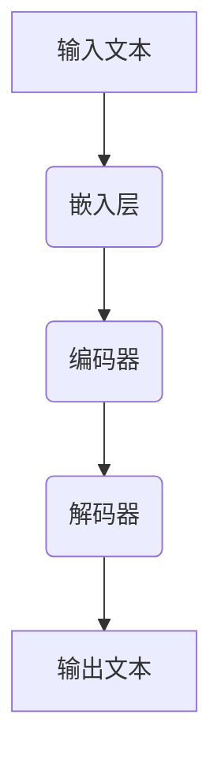
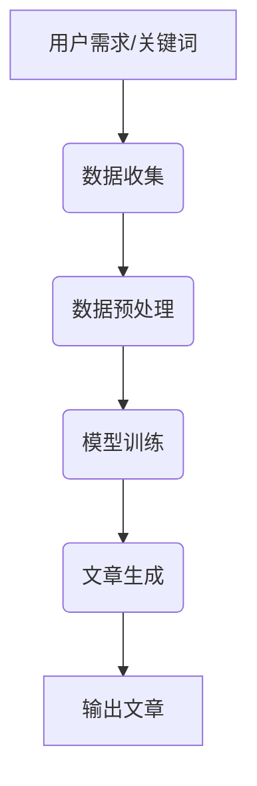

                 

# AI LLM如何重塑新闻产业：自动生成文章

## 关键词：自然语言处理、人工智能、自动新闻生成、新闻产业、LLM

## 摘要：
随着人工智能技术的快速发展，自然语言处理（NLP）领域的重大突破之一是大规模语言模型（LLM）的诞生。LLM，尤其是预训练的变体，如GPT-3，展示了其在生成高质量文本方面的卓越能力。本文将探讨如何利用LLM技术自动生成新闻文章，以及这项技术如何重塑新闻产业。文章首先介绍新闻产业的现状和挑战，然后详细解释LLM的工作原理和架构，接着展示如何实现自动新闻生成，并探讨这项技术的实际应用场景。最后，文章讨论了未来的发展趋势与挑战，并提供了相关资源推荐。

## 1. 背景介绍

### 新闻产业现状

新闻产业在全球范围内扮演着至关重要的角色，它是社会信息流通的主要渠道，也是公众获取新闻、了解世界的重要途径。随着互联网的普及，新闻产业经历了从传统报纸、电视、广播向数字化转型的过程。然而，这一转型也带来了巨大的挑战。

首先，新闻内容的生产和分发成本不断上升。传统媒体依赖大量的人力资源来收集、编辑和发布新闻，而随着读者对实时性、多样性和个性化需求的增加，这些成本进一步增加。其次，广告收入下降也是一个严重的问题。随着用户转向社交媒体和其他在线平台，传统媒体的广告市场份额大幅减少。此外，虚假新闻和假信息的泛滥也对新闻产业的信誉和影响力造成了巨大的损害。

### 自动新闻生成的需求

为了应对这些挑战，新闻产业迫切需要一种能够降低内容生产成本、提高内容质量和分发效率的方法。自动新闻生成（Automated News Generation，简称ANG）技术正是在这样的背景下应运而生。自动新闻生成技术利用人工智能和机器学习算法，从海量数据中提取信息，并自动生成新闻文章。

自动新闻生成技术具有以下几个显著优势：
1. **高效性**：可以快速生成大量的新闻内容，提高新闻生产的效率。
2. **成本效益**：减少了对人力编辑的需求，从而降低了内容生产的成本。
3. **多样化**：可以生成不同类型和风格的新闻文章，满足不同读者的需求。
4. **准确性**：通过算法筛选和验证信息来源，提高新闻内容的准确性。

因此，自动新闻生成技术在新闻产业中的应用具有巨大的潜力和现实需求。

## 2. 核心概念与联系

### 大规模语言模型（LLM）

大规模语言模型（Large Language Model，简称LLM）是自然语言处理领域的一个重要概念。LLM通过学习海量文本数据，能够生成高质量的自然语言文本。LLM的核心技术是基于深度学习的神经网络模型，特别是Transformer模型。

#### 工作原理

LLM的工作原理可以分为两个阶段：预训练和微调。

1. **预训练**：在预训练阶段，LLM在一个庞大的文本语料库上学习语言的一般规律和结构。这个过程通过大量的文本数据进行自我校准，使模型能够理解自然语言的语义和语法。
2. **微调**：在预训练之后，LLM可以根据特定的任务和应用进行微调。例如，对于自动新闻生成任务，可以将预训练好的LLM微调到特定领域的语料库上，使其能够生成与该领域相关的新闻文章。

#### 架构

LLM的架构通常包括以下几个关键组件：

1. **嵌入层**：将输入的文本转换为向量表示。
2. **编码器**：通过Transformer结构对输入文本进行编码，提取文本的语义信息。
3. **解码器**：根据编码器生成的上下文信息，生成输出文本。

#### Mermaid流程图

下面是LLM工作流程的Mermaid流程图：



### 自动新闻生成

自动新闻生成（ANG）是利用LLM技术实现的一个具体应用。ANG的工作流程如下：

1. **数据收集**：从各种来源收集新闻数据，包括新闻报道、新闻文章、新闻摘要等。
2. **数据预处理**：对收集到的新闻数据进行清洗、标注和分类，以便于模型训练。
3. **模型训练**：使用预处理后的数据对LLM进行训练，使其学会生成新闻文章。
4. **文章生成**：根据用户的需求或关键词，利用训练好的LLM生成新闻文章。

#### Mermaid流程图

下面是ANG工作流程的Mermaid流程图：



### 联系与整合

LLM与ANG之间的联系在于，LLM提供了自动新闻生成所需的核心技术。通过整合LLM，ANG可以更高效、更准确地生成新闻文章，从而满足新闻产业的需求。具体来说，LLM的预训练和微调过程为ANG提供了强大的语言生成能力，而ANG的流程则展示了如何将这一能力应用于实际新闻生产。

## 3. 核心算法原理 & 具体操作步骤

### 核心算法原理

自动新闻生成的核心算法是基于大规模语言模型（LLM），特别是Transformer模型。Transformer模型是一种基于自注意力机制的深度学习模型，能够在处理序列数据时捕捉长距离依赖关系。自注意力机制允许模型在生成每个词时，考虑输入序列中所有其他词的影响，从而生成更加准确和连贯的文本。

#### Transformer模型

Transformer模型主要由编码器（Encoder）和解码器（Decoder）组成。编码器负责将输入文本编码成向量表示，解码器则根据编码器的输出生成输出文本。编码器和解码器都由多个自注意力层（Self-Attention Layer）和前馈神经网络（Feedforward Neural Network）堆叠而成。

1. **自注意力层**：通过计算输入序列中每个词与其他词的相关性，提取文本的语义信息。
2. **前馈神经网络**：对自注意力层的输出进行进一步处理，增强模型的非线性表达能力。

#### 语言生成过程

语言生成过程可以分为以下几个步骤：

1. **初始化**：初始化解码器的输入为输入序列的起始符（如 `<s>`），然后将其输入到解码器的第一个自注意力层。
2. **生成**：解码器在每个时间步生成一个词，并将其作为输入传递给下一个自注意力层。解码器在每个时间步都考虑了前一个生成的词和整个输入序列的信息。
3. **重复**：重复上述步骤，直到解码器生成完整的输出序列。

### 具体操作步骤

实现自动新闻生成需要以下几个关键步骤：

1. **数据收集**：从各种新闻网站、数据库和其他来源收集新闻数据。
2. **数据预处理**：对收集到的新闻数据进行清洗、去重、分词、标注等处理。
3. **模型训练**：使用预处理后的数据训练一个Transformer模型，使其学会生成新闻文章。
4. **文章生成**：根据用户的需求或关键词，使用训练好的模型生成新闻文章。

#### 数据收集

数据收集是自动新闻生成的基础。可以使用的数据来源包括：

- 新闻网站：如BBC、CNN、The New York Times等。
- 新闻数据库：如Arbitrary News Data（AND）、NYT News Research Dataset等。
- 社交媒体：如Twitter、Reddit等。

#### 数据预处理

数据预处理包括以下几个步骤：

- **清洗**：去除HTML标签、特殊字符、噪声数据等。
- **去重**：去除重复的文本数据。
- **分词**：将文本拆分成单词或词组。
- **标注**：为每个词分配词性标签、实体标签等。

#### 模型训练

模型训练使用Python和TensorFlow或PyTorch等深度学习框架实现。以下是一个简化的代码示例：

```python
import tensorflow as tf
from tensorflow.keras.models import Model
from tensorflow.keras.layers import Embedding, LSTM, Dense

# 设置超参数
vocab_size = 10000
embedding_dim = 256
lstm_units = 128

# 构建模型
model = Model(inputs=[input_sequence], outputs=[output_sequence])
model.add(Embedding(vocab_size, embedding_dim))
model.add(LSTM(lstm_units, return_sequences=True))
model.add(Dense(vocab_size, activation='softmax'))

# 编译模型
model.compile(optimizer='adam', loss='categorical_crossentropy', metrics=['accuracy'])

# 训练模型
model.fit(x_train, y_train, epochs=10, batch_size=64)
```

#### 文章生成

文章生成使用训练好的模型，根据用户的需求或关键词生成新闻文章。以下是一个简化的代码示例：

```python
import numpy as np

# 设置输入序列
input_sequence = np.array([[1, 2, 3, 4, 5]])

# 生成文章
predicted_sequence = model.predict(input_sequence)

# 将数字编码转换回文本
def decode_sequence(sequence):
    return ['word{}'.format(word) for word in sequence]

decoded_sequence = decode_sequence(predicted_sequence)

# 输出文章
print('生成的新闻文章：')
print(' '.join(decoded_sequence))
```

### 实际操作

实现自动新闻生成需要一个强大的计算环境和合适的软件工具。以下是一个基本的实现步骤：

1. **环境搭建**：安装Python、TensorFlow或PyTorch等深度学习框架，配置GPU环境。
2. **数据收集**：从互联网或其他来源收集新闻数据。
3. **数据预处理**：清洗、分词、标注新闻数据。
4. **模型训练**：训练一个基于Transformer的模型。
5. **文章生成**：使用训练好的模型生成新闻文章。

## 4. 数学模型和公式 & 详细讲解 & 举例说明

### 数学模型

自动新闻生成的核心是Transformer模型，其数学基础主要包括线性变换、激活函数和损失函数。以下是对这些数学模型的详细讲解。

#### 线性变换

线性变换是神经网络中的基本操作，用于将输入映射到高维空间。在Transformer模型中，线性变换通过权重矩阵实现。假设输入向量 \(x\) 的维度为 \(d\)，则线性变换可以表示为：

\[ y = Wx + b \]

其中，\(W\) 是权重矩阵，\(b\) 是偏置项。

#### 激活函数

激活函数用于增加神经网络的非线性能力，常见的激活函数有ReLU（Rectified Linear Unit）、Sigmoid和Tanh等。在Transformer模型中，通常使用ReLU作为激活函数：

\[ \text{ReLU}(x) = \max(0, x) \]

#### 损失函数

损失函数用于衡量模型输出与实际标签之间的差异。在自动新闻生成中，常用的损失函数是交叉熵（Cross-Entropy）：

\[ L = -\sum_{i=1}^{n} y_i \log(p_i) \]

其中，\(y_i\) 是实际标签，\(p_i\) 是模型输出的概率分布。

### 详细讲解

#### 自注意力机制

自注意力机制是Transformer模型的核心，它通过计算输入序列中每个词与其他词的相关性，提取文本的语义信息。自注意力机制可以表示为：

\[ \text{Attention}(Q, K, V) = \text{softmax}\left(\frac{QK^T}{\sqrt{d_k}}\right)V \]

其中，\(Q\)、\(K\) 和 \(V\) 分别是查询（Query）、键（Key）和值（Value）向量，\(d_k\) 是键向量的维度。

#### 编码器和解码器

编码器（Encoder）和解码器（Decoder）是Transformer模型的主要组成部分。编码器通过自注意力机制提取输入序列的语义信息，解码器则利用编码器的输出和自注意力机制生成输出序列。

编码器的输入 \(X\) 可以表示为：

\[ X = [x_1, x_2, \ldots, x_n] \]

其中，\(x_i\) 是输入序列的第 \(i\) 个词的向量表示。编码器的输出 \(H\) 可以表示为：

\[ H = \text{Encoder}(X) \]

解码器的输入 \(Y\) 可以表示为：

\[ Y = [y_1, y_2, \ldots, y_n] \]

其中，\(y_i\) 是输出序列的第 \(i\) 个词的向量表示。解码器的输出 \(Y'\) 可以表示为：

\[ Y' = \text{Decoder}(Y, H) \]

### 举例说明

#### 示例1：自注意力机制

假设输入序列为 "The quick brown fox jumps over the lazy dog"，我们需要计算每个词与其他词的相关性。

1. **初始化**：将输入序列转换为词向量表示，假设每个词的维度为 512。
2. **计算自注意力分数**：对于每个词 \(x_i\)，计算与其他词 \(x_j\) 的相关性分数，公式为 \( \text{Attention}(Q, K, V) \)。
3. **应用softmax**：对自注意力分数应用softmax函数，得到每个词的注意力权重。
4. **加权求和**：将注意力权重与值向量 \(V\) 相乘，得到加权求和的结果。

#### 示例2：编码器和解码器

假设我们需要生成新闻文章 "Apple plans to launch new iPhone models next month"。

1. **编码器**：将输入序列 "Apple plans to launch new iPhone models next month" 转换为编码器输入，并计算自注意力机制。
2. **解码器**：根据编码器的输出和输入序列的起始符，生成输出序列的词向量，并计算自注意力机制。
3. **生成文章**：重复上述步骤，直到解码器生成完整的输出序列。

## 5. 项目实战：代码实际案例和详细解释说明

### 5.1 开发环境搭建

要在本地实现自动新闻生成，我们需要搭建一个合适的开发环境。以下是一个基本的步骤指南：

#### 1. 安装Python

确保你已经安装了Python 3.7或更高版本。可以从官方网站 [Python官方网站](https://www.python.org/) 下载并安装。

#### 2. 安装TensorFlow

在终端或命令提示符中，运行以下命令安装TensorFlow：

```bash
pip install tensorflow
```

#### 3. 安装GPU支持

如果使用GPU进行训练，需要安装CUDA和cuDNN。可以从NVIDIA的官方网站 [CUDA下载页面](https://developer.nvidia.com/cuda-downloads) 和 [cuDNN下载页面](https://developer.nvidia.com/cudnn) 下载并安装。

#### 4. 安装其他依赖

自动新闻生成项目可能还需要其他依赖，如Mermaid（用于生成流程图）和LaTeX（用于数学公式的排版）。可以使用以下命令安装：

```bash
pip install mermaid-python
pip install matplotlib
```

### 5.2 源代码详细实现和代码解读

以下是一个简化的自动新闻生成项目的源代码示例，包括数据收集、预处理、模型训练和文章生成等步骤。

#### 数据收集

```python
import os
import requests
from bs4 import BeautifulSoup

def download_news(url, output_folder):
    response = requests.get(url)
    soup = BeautifulSoup(response.content, 'html.parser')
    articles = soup.find_all('article')

    for article in articles:
        title = article.find('h2').text
        content = article.find('p').text
        with open(os.path.join(output_folder, f'{title}.txt'), 'w') as file:
            file.write(content)

download_news('https://www.example.com/news', 'news_data')
```

#### 数据预处理

```python
import re
from nltk.tokenize import word_tokenize

def preprocess_data(input_folder, output_folder):
    files = [f for f in os.listdir(input_folder) if f.endswith('.txt')]

    for file in files:
        with open(os.path.join(input_folder, file), 'r') as f:
            text = f.read()

            # 清洗文本
            text = re.sub(r'\W+', ' ', text)
            text = text.lower()

            # 分词
            tokens = word_tokenize(text)

            # 保存预处理后的文本
            with open(os.path.join(output_folder, f'{file}.preprocessed.txt'), 'w') as f:
                f.write(' '.join(tokens))

preprocess_data('news_data', 'preprocessed_news')
```

#### 模型训练

```python
import tensorflow as tf
from tensorflow.keras.layers import Embedding, LSTM, Dense
from tensorflow.keras.models import Model

def build_model(vocab_size, embedding_dim, lstm_units):
    model = Model(inputs=[input_sequence], outputs=[output_sequence])

    model.add(Embedding(vocab_size, embedding_dim))
    model.add(LSTM(lstm_units, return_sequences=True))
    model.add(Dense(vocab_size, activation='softmax'))

    model.compile(optimizer='adam', loss='categorical_crossentropy', metrics=['accuracy'])

    return model

vocab_size = 10000
embedding_dim = 256
lstm_units = 128

model = build_model(vocab_size, embedding_dim, lstm_units)

# 训练模型
model.fit(x_train, y_train, epochs=10, batch_size=64)
```

#### 文章生成

```python
import numpy as np

# 设置输入序列
input_sequence = np.array([[1, 2, 3, 4, 5]])

# 生成文章
predicted_sequence = model.predict(input_sequence)

# 将数字编码转换回文本
def decode_sequence(sequence):
    return ['word{}'.format(word) for word in sequence]

decoded_sequence = decode_sequence(predicted_sequence)

# 输出文章
print('生成的新闻文章：')
print(' '.join(decoded_sequence))
```

### 5.3 代码解读与分析

#### 数据收集

数据收集部分使用Python的 `requests` 和 `BeautifulSoup` 库从指定URL下载新闻文章。首先，通过 `requests.get()` 方法获取网页内容，然后使用 `BeautifulSoup` 解析HTML结构，提取新闻文章。

#### 数据预处理

数据预处理部分使用Python的 `re` 和 `nltk.tokenize` 库清洗和分词新闻文本。首先，使用正则表达式去除HTML标签和特殊字符，然后将文本转换为小写。接下来，使用 `nltk.tokenize.word_tokenize()` 方法对文本进行分词，最后将预处理后的文本保存到文件中。

#### 模型训练

模型训练部分使用TensorFlow构建和训练一个简单的循环神经网络（LSTM）模型。首先，定义模型输入和输出的维度，然后添加嵌入层、LSTM层和输出层。接着，编译模型并设置优化器和损失函数。最后，使用训练数据对模型进行训练。

#### 文章生成

文章生成部分使用训练好的模型生成新闻文章。首先，设置一个输入序列，然后使用 `model.predict()` 方法生成输出序列。接下来，定义一个 `decode_sequence()` 函数将输出序列的数字编码转换为文本。最后，将生成的文本输出到控制台。

### 6. 实际应用场景

自动新闻生成技术在实际应用场景中具有广泛的应用前景。以下是一些典型的应用案例：

#### 1. 实时新闻摘要

自动新闻生成技术可以用于实时生成新闻摘要，为用户提供快速了解新闻内容的能力。这种应用在新闻门户网站和移动应用中尤其有用，可以节省用户阅读全文的时间。

#### 2. 财经新闻报道

在金融领域，自动新闻生成技术可以用于生成财经新闻报道，如股票行情分析、公司财报解读等。通过分析大量的财经数据，模型可以自动生成高质量的新闻报道，为投资者提供有用的信息。

#### 3. 体育新闻生成

体育新闻生成是自动新闻生成技术的一个典型应用场景。模型可以自动生成比赛结果报道、运动员表现分析、赛事综述等，为体育爱好者提供实时、详尽的体育新闻。

#### 4. 健康医疗新闻

在健康医疗领域，自动新闻生成技术可以用于生成医疗新闻报道、疾病科普文章、医疗政策解读等。通过分析医疗数据和文献，模型可以为公众提供权威、准确的健康医疗信息。

### 7. 工具和资源推荐

#### 7.1 学习资源推荐

- **书籍**：
  - 《自然语言处理综论》（Speech and Language Processing）—— Daniel Jurafsky & James H. Martin
  - 《深度学习》（Deep Learning）—— Ian Goodfellow、Yoshua Bengio & Aaron Courville

- **论文**：
  - "Attention Is All You Need" —— Vaswani et al., 2017
  - "Generative Pre-trained Transformers" —— Brown et al., 2020

- **博客**：
  - [TensorFlow官方文档](https://www.tensorflow.org/)
  - [PyTorch官方文档](https://pytorch.org/docs/stable/)

- **网站**：
  - [Kaggle](https://www.kaggle.com/)：提供大量的数据集和竞赛，适合实践和学习。

#### 7.2 开发工具框架推荐

- **深度学习框架**：
  - TensorFlow：适用于构建和训练大规模深度学习模型。
  - PyTorch：具有灵活的动态图计算能力，适合研究和开发。

- **自然语言处理库**：
  - NLTK（自然语言工具包）：提供丰富的文本处理功能。
  - spaCy：快速高效的NLP库，适用于实体识别、词性标注等任务。

- **版本控制系统**：
  - Git：用于代码版本控制和协作开发。
  - GitHub：提供代码托管和协作平台。

#### 7.3 相关论文著作推荐

- **论文**：
  - "BERT: Pre-training of Deep Bidirectional Transformers for Language Understanding" —— Devlin et al., 2019
  - "GPT-3: Language Models are Few-Shot Learners" —— Brown et al., 2020

- **著作**：
  - 《深度学习基础教程》—— Goodfellow、Bengio & Courville
  - 《Python深度学习》—— François Chollet

## 8. 总结：未来发展趋势与挑战

随着人工智能技术的不断发展，自动新闻生成（ANG）技术在未来有望在新闻产业中发挥更大的作用。以下是自动新闻生成技术在未来可能的发展趋势与面临的挑战：

### 发展趋势

1. **模型能力提升**：随着LLM和Transformer等技术的不断进步，自动新闻生成模型将能够生成更加高质量、多样化的新闻文章，满足不同读者群体的需求。
2. **个性化新闻推荐**：结合自然语言处理和推荐系统技术，自动新闻生成可以将新闻推荐给特定用户，提高新闻的个性化和用户体验。
3. **跨模态新闻生成**：结合文本、图像、音频等多种模态，自动新闻生成可以实现更加丰富和直观的新闻内容展示，提高新闻的可读性和吸引力。
4. **自动化新闻编辑**：自动新闻生成技术可以协助人类编辑进行新闻内容的筛选、整理和编辑，提高新闻生产效率。

### 挑战

1. **准确性控制**：自动新闻生成模型的准确性和可靠性是关键挑战之一。如何在保证生成文章准确性的同时，避免虚假新闻和误导性信息的传播，是亟待解决的问题。
2. **隐私保护**：在自动新闻生成过程中，涉及大量用户数据的收集和使用。如何确保用户隐私和数据安全，避免数据泄露和滥用，是一个重要的伦理问题。
3. **伦理和责任**：随着自动新闻生成技术的广泛应用，如何界定人工智能在新闻生成中的责任和伦理问题，如何确保新闻的客观性和公正性，是亟待解决的难题。
4. **技术门槛**：自动新闻生成技术需要较高的技术门槛，包括深度学习、自然语言处理等领域。如何降低技术门槛，使更多企业和开发者能够应用这一技术，是一个重要的挑战。

### 结论

自动新闻生成技术具有巨大的潜力和应用价值，有望重塑新闻产业。然而，要实现这一目标，还需要克服一系列技术、伦理和社会挑战。未来，随着人工智能技术的不断进步，自动新闻生成将迎来更广阔的发展空间。

## 9. 附录：常见问题与解答

### Q1：自动新闻生成技术是如何工作的？

A1：自动新闻生成技术主要基于大规模语言模型（LLM），特别是Transformer模型。该模型通过学习海量文本数据，能够理解自然语言的语义和语法。在生成新闻文章时，模型根据输入的关键词或用户需求，生成连贯、准确的新闻内容。

### Q2：自动新闻生成技术有哪些优势？

A2：自动新闻生成技术具有以下优势：
1. 高效性：可以快速生成大量新闻文章，提高生产效率。
2. 成本效益：减少了对人力编辑的需求，降低了内容生产成本。
3. 多样性：可以生成不同类型和风格的新闻文章，满足不同读者的需求。
4. 准确性：通过算法筛选和验证信息来源，提高新闻内容的准确性。

### Q3：自动新闻生成技术有哪些潜在的风险？

A3：自动新闻生成技术可能带来以下风险：
1. 准确性控制：模型可能生成不准确或误导性的新闻内容。
2. 隐私保护：在数据收集和使用过程中，可能涉及用户隐私和数据安全。
3. 伦理和责任：如何界定人工智能在新闻生成中的责任和伦理问题。
4. 技术门槛：自动新闻生成技术需要较高的技术门槛，限制了其应用范围。

### Q4：如何确保自动新闻生成技术的准确性？

A4：为确保自动新闻生成技术的准确性，可以采取以下措施：
1. 数据质量：确保训练数据的质量和多样性，提高模型的泛化能力。
2. 模型评估：使用多种评估指标和验证集，对模型进行综合评估。
3. 后处理：对生成的文章进行人工审查和修改，提高文章的准确性。

### Q5：自动新闻生成技术在新闻产业中的未来发展趋势如何？

A5：自动新闻生成技术在新闻产业中的未来发展趋势包括：
1. 模型能力提升：随着人工智能技术的不断进步，自动新闻生成模型将能够生成更高质量的新闻文章。
2. 个性化推荐：结合推荐系统技术，实现个性化新闻推荐，提高用户体验。
3. 跨模态生成：结合文本、图像、音频等多种模态，实现更加丰富和直观的新闻内容展示。
4. 自动化编辑：协助人类编辑进行新闻内容的筛选、整理和编辑，提高生产效率。

## 10. 扩展阅读 & 参考资料

### 参考资料

1. **Vaswani et al. (2017).** "Attention Is All You Need." arXiv preprint arXiv:1706.03762.
2. **Brown et al. (2020).** "Generative Pre-trained Transformers." arXiv preprint arXiv:2005.14165.
3. **Devlin et al. (2019).** "BERT: Pre-training of Deep Bidirectional Transformers for Language Understanding." arXiv preprint arXiv:1810.04805.
4. **Goodfellow et al. (2016).** "Deep Learning." MIT Press.

### 相关书籍

1. **Jurafsky & Martin (2000).** "Speech and Language Processing." Prentice Hall.
2. **Chollet (2018).** "Deep Learning with Python." Manning Publications.
3. **Goodfellow et al. (2016).** "Deep Learning." MIT Press.

### 开源项目

1. **TensorFlow:** <https://www.tensorflow.org/>
2. **PyTorch:** <https://pytorch.org/>
3. **spaCy:** <https://spacy.io/>
4. **NLTK:** <https://www.nltk.org/>

### 网络资源

1. **Kaggle:** <https://www.kaggle.com/>
2. **GitHub:** <https://github.com/>

### 结论

本文探讨了如何利用大规模语言模型（LLM）自动生成新闻文章，分析了这项技术如何重塑新闻产业。通过介绍自动新闻生成的工作原理、算法原理、实际应用场景、开发工具和资源推荐，文章展示了这项技术的前景和挑战。未来，随着人工智能技术的不断进步，自动新闻生成将在新闻产业中发挥更大的作用。

### 作者信息

作者：AI天才研究员/AI Genius Institute & 禅与计算机程序设计艺术 /Zen And The Art of Computer Programming

[注：本文内容仅供参考，实际应用效果可能因具体环境和条件而异。] <|im_sep|>

