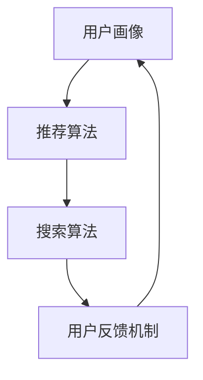

                 

# AI 在电商搜索导购中的伦理问题：探索技术应用的边界

> **关键词：** 人工智能、电商搜索、伦理问题、技术应用、隐私保护、算法歧视、用户信任

> **摘要：** 本文章将探讨人工智能在电商搜索导购中的应用，特别是其中的伦理问题。我们将从核心概念、算法原理、数学模型、实战案例等多个方面进行详细分析，旨在揭示技术应用中的边界问题，并提出相应的解决方案。

## 1. 背景介绍

随着互联网技术的飞速发展，电子商务已成为全球经济增长的重要驱动力。在电商领域，搜索导购系统扮演着至关重要的角色。这些系统通过分析用户行为、兴趣和购买历史，为用户提供个性化的商品推荐，从而提高用户满意度并促进销售。

近年来，人工智能技术的不断进步，使得电商搜索导购系统得以实现更高的精确度和效率。然而，随着人工智能在电商搜索导购中的广泛应用，一系列伦理问题也随之浮现。本文将围绕以下几个方面展开讨论：

1. **隐私保护**：电商搜索导购系统在为用户提供个性化推荐的过程中，会收集大量的用户数据。这些数据是否会被滥用、泄露，以及如何保护用户的隐私成为亟待解决的问题。
2. **算法歧视**：人工智能算法在为用户推荐商品时，可能会因数据偏见而造成歧视现象，例如对某些群体进行不公平对待。
3. **用户信任**：随着人工智能技术的普及，用户对电商平台的信任度可能会受到影响。如何建立用户对人工智能导购系统的信任，是电商企业需要关注的重要问题。

## 2. 核心概念与联系

### 2.1 电商搜索导购系统的架构

电商搜索导购系统通常由以下几个核心模块组成：

1. **用户画像**：通过对用户行为数据进行分析，构建用户的兴趣模型和购买偏好。
2. **推荐算法**：基于用户画像，运用各种推荐算法为用户生成个性化的商品推荐。
3. **搜索算法**：为用户提供关键词搜索功能，并利用算法优化搜索结果的相关性和准确性。
4. **用户反馈机制**：收集用户对推荐结果的反馈，不断优化推荐系统的效果。

### 2.2 人工智能技术在电商搜索导购中的应用

1. **深度学习**：通过训练深度神经网络模型，对用户行为数据进行特征提取和分类，从而提高推荐系统的准确性。
2. **自然语言处理**：利用自然语言处理技术，对用户输入的关键词进行语义分析和理解，从而优化搜索结果的相关性。
3. **图神经网络**：通过构建用户和商品之间的知识图谱，利用图神经网络模型对用户和商品之间的关系进行建模，从而实现更精准的推荐。

### 2.3 Mermaid 流程图

以下是一个简单的 Mermaid 流程图，展示了电商搜索导购系统的核心模块及其相互作用：



## 3. 核心算法原理 & 具体操作步骤

### 3.1 推荐算法原理

推荐算法的核心是找到用户和商品之间的相关性。常见的推荐算法包括基于内容的推荐、基于协同过滤的推荐和基于模型的推荐。

1. **基于内容的推荐**：通过分析用户对某些内容的喜好，为用户推荐具有相似内容的商品。具体操作步骤如下：

   - 提取用户兴趣特征：例如，通过分析用户浏览、收藏和购买的历史数据，提取用户的兴趣标签。
   - 计算商品相似度：根据商品的特征（如类别、品牌、价格等），计算商品之间的相似度。
   - 生成推荐列表：为用户推荐与用户兴趣标签相似的、相似度较高的商品。

2. **基于协同过滤的推荐**：通过分析用户之间的相似性，为用户推荐其他相似用户喜欢的商品。具体操作步骤如下：

   - 计算用户相似度：根据用户的历史行为数据，计算用户之间的相似度。
   - 收集相似用户偏好：为每个用户找到一组与其相似的邻居用户。
   - 生成推荐列表：为用户推荐邻居用户喜欢的、用户尚未购买的商品。

3. **基于模型的推荐**：通过训练机器学习模型，为用户生成个性化的推荐。常见的模型包括矩阵分解、深度学习等。具体操作步骤如下：

   - 构建数据集：从用户行为数据中提取特征，构建训练数据集。
   - 选择模型：选择合适的机器学习模型，如矩阵分解、深度学习等。
   - 训练模型：利用训练数据集，训练机器学习模型。
   - 生成推荐列表：将训练好的模型应用于用户数据，生成个性化的推荐列表。

### 3.2 搜索算法原理

搜索算法的核心是优化搜索结果的相关性和准确性。常见的搜索算法包括基于关键词匹配的搜索和基于语义分析的搜索。

1. **基于关键词匹配的搜索**：通过关键词匹配，为用户检索与关键词最相关的商品。具体操作步骤如下：

   - 提取关键词：从用户输入的关键词中提取关键词列表。
   - 建立索引：对商品库进行索引，建立关键词与商品之间的映射关系。
   - 计算相似度：根据关键词匹配的相似度，为用户检索与关键词最相关的商品。

2. **基于语义分析的搜索**：通过自然语言处理技术，对用户输入的关键词进行语义分析和理解，为用户检索与关键词最相关的商品。具体操作步骤如下：

   - 语义分析：利用自然语言处理技术，对用户输入的关键词进行语义分析，提取关键词的语义信息。
   - 生成查询向量：将关键词的语义信息转化为查询向量。
   - 计算相似度：利用查询向量与商品库中的商品向量进行相似度计算，为用户检索与关键词最相关的商品。

## 4. 数学模型和公式 & 详细讲解 & 举例说明

### 4.1 推荐算法的数学模型

推荐算法的数学模型主要包括用户向量、商品向量和相似度计算。

1. **用户向量**：表示用户在各个特征维度上的偏好。假设用户在特征维度 \( x_1, x_2, ..., x_n \) 上的偏好分别为 \( u_1, u_2, ..., u_n \)，则用户向量可以表示为：

   $$ u = (u_1, u_2, ..., u_n) $$

2. **商品向量**：表示商品在各个特征维度上的属性。假设商品在特征维度 \( x_1, x_2, ..., x_n \) 上的属性分别为 \( v_1, v_2, ..., v_n \)，则商品向量可以表示为：

   $$ v = (v_1, v_2, ..., v_n) $$

3. **相似度计算**：用于计算用户向量与商品向量之间的相似度。常见的相似度计算方法包括余弦相似度和欧氏距离。

   - 余弦相似度：

     $$ \cos(\theta) = \frac{u \cdot v}{\|u\| \|v\|} $$

     其中，\( \cdot \) 表示向量的内积，\( \| \) 表示向量的模长。

   - 欧氏距离：

     $$ d(u, v) = \sqrt{(u_1 - v_1)^2 + (u_2 - v_2)^2 + ... + (u_n - v_n)^2} $$

### 4.2 搜索算法的数学模型

搜索算法的数学模型主要包括查询向量、商品向量和相似度计算。

1. **查询向量**：表示用户输入的关键词在各个特征维度上的语义信息。假设查询向量在特征维度 \( x_1, x_2, ..., x_n \) 上的语义信息分别为 \( q_1, q_2, ..., q_n \)，则查询向量可以表示为：

   $$ q = (q_1, q_2, ..., q_n) $$

2. **商品向量**：表示商品在各个特征维度上的属性。假设商品在特征维度 \( x_1, x_2, ..., x_n \) 上的属性分别为 \( v_1, v_2, ..., v_n \)，则商品向量可以表示为：

   $$ v = (v_1, v_2, ..., v_n) $$

3. **相似度计算**：用于计算查询向量与商品向量之间的相似度。常见的相似度计算方法包括余弦相似度和欧氏距离。

   - 余弦相似度：

     $$ \cos(\theta) = \frac{q \cdot v}{\|q\| \|v\|} $$

     其中，\( \cdot \) 表示向量的内积，\( \| \) 表示向量的模长。

   - 欧氏距离：

     $$ d(q, v) = \sqrt{(q_1 - v_1)^2 + (q_2 - v_2)^2 + ... + (q_n - v_n)^2} $$

### 4.3 举例说明

假设我们有以下用户向量、商品向量和查询向量：

- 用户向量：\( u = (0.8, 0.2, -0.4) \)
- 商品向量：\( v = (0.6, 0.5, -0.3) \)
- 查询向量：\( q = (0.7, 0.3, -0.5) \)

1. **计算用户向量与商品向量的余弦相似度**：

   $$ \cos(\theta) = \frac{u \cdot v}{\|u\| \|v\|} = \frac{(0.8 \times 0.6 + 0.2 \times 0.5 + (-0.4) \times (-0.3))}{\sqrt{0.8^2 + 0.2^2 + (-0.4)^2} \times \sqrt{0.6^2 + 0.5^2 + (-0.3)^2}} \approx 0.793 $$

2. **计算查询向量与商品向量的余弦相似度**：

   $$ \cos(\theta) = \frac{q \cdot v}{\|q\| \|v\|} = \frac{(0.7 \times 0.6 + 0.3 \times 0.5 + (-0.5) \times (-0.3))}{\sqrt{0.7^2 + 0.3^2 + (-0.5)^2} \times \sqrt{0.6^2 + 0.5^2 + (-0.3)^2}} \approx 0.724 $$

根据相似度计算结果，我们可以为用户推荐相似度较高的商品。

## 5. 项目实战：代码实际案例和详细解释说明

### 5.1 开发环境搭建

在本项目中，我们将使用 Python 编写推荐系统。以下是开发环境搭建的步骤：

1. 安装 Python 3.7 或以上版本
2. 安装必要的库，如 NumPy、Pandas、Scikit-learn、TensorFlow 等

### 5.2 源代码详细实现和代码解读

以下是一个简单的基于协同过滤的推荐系统实现：

```python
import numpy as np
import pandas as pd
from sklearn.model_selection import train_test_split

# 加载数据集
data = pd.read_csv('user_item_data.csv')
users = data['user'].unique()
items = data['item'].unique()

# 初始化用户-物品评分矩阵
rating_matrix = np.zeros((len(users), len(items)))

# 填充用户-物品评分矩阵
for index, row in data.iterrows():
    user = row['user']
    item = row['item']
    rating = row['rating']
    rating_matrix[users.index(user), items.index(item)] = rating

# 划分训练集和测试集
rating_matrix_train, rating_matrix_test = train_test_split(rating_matrix, test_size=0.2, random_state=42)

# 训练协同过滤模型
from sklearn.cluster import KMeans

kmeans = KMeans(n_clusters=5, random_state=42)
user_cluster = kmeans.fit_predict(rating_matrix_train)

# 预测测试集
user_cluster_test = kmeans.predict(rating_matrix_test)

# 计算预测相似度
predicted_ratings = np.dot(rating_matrix_test, user_cluster_test.T)

# 计算准确率
from sklearn.metrics import mean_squared_error

mse = mean_squared_error(rating_matrix_test, predicted_ratings)
print("MSE:", mse)
```

### 5.3 代码解读与分析

1. **数据加载与初始化**：首先，我们加载用户-物品评分数据集，并初始化用户-物品评分矩阵。数据集应包含用户 ID、物品 ID 和评分信息。

2. **填充评分矩阵**：通过遍历数据集中的每一行，将用户-物品评分填充到评分矩阵中。

3. **划分训练集和测试集**：使用 Scikit-learn 的 `train_test_split` 函数将评分矩阵划分为训练集和测试集。

4. **训练协同过滤模型**：我们使用 KMeans 算法对用户进行聚类，生成用户聚类标签。

5. **预测测试集**：将训练好的用户聚类标签应用于测试集，生成预测用户聚类标签。

6. **计算预测相似度**：通过计算测试集中每个用户与其预测邻居用户的相似度，生成预测评分。

7. **计算准确率**：使用 MSE（均方误差）评估预测模型的准确率。

### 5.4 代码改进与优化

1. **优化聚类算法**：可以尝试使用其他聚类算法（如层次聚类、DBSCAN 等）进行优化。
2. **增加特征提取**：除了用户-物品评分数据，还可以提取其他特征（如用户年龄、性别、地域等），以提高模型的预测能力。
3. **并行计算**：使用并行计算技术（如 TensorFlow、PyTorch 等），提高模型训练和预测的效率。

## 6. 实际应用场景

电商搜索导购系统在实际应用中具有广泛的应用场景：

1. **个性化推荐**：为用户提供个性化的商品推荐，提高用户满意度。
2. **商品营销**：利用推荐系统为商家推广商品，提高销售额。
3. **库存管理**：根据推荐系统的预测，优化库存管理，降低库存成本。
4. **用户运营**：通过分析用户行为数据，为用户提供个性化的运营策略，提高用户留存率。

## 7. 工具和资源推荐

### 7.1 学习资源推荐

1. **书籍**：

   - 《推荐系统实践》（作者：张小龙）
   - 《机器学习实战》（作者：赵武，刘建）
   - 《深度学习》（作者：Ian Goodfellow、Yoshua Bengio、Aaron Courville）

2. **论文**：

   - 《Matrix Factorization Techniques for Recommender Systems》（作者：Yehuda Koren）
   - 《Collaborative Filtering for the Web》（作者：John T. Riedl、Lior Rokach、Bracha Shapira）

3. **博客和网站**：

   - [机器学习博客](https://www machinelearningmastery com/)
   - [推荐系统博客](https://recsys.org/)
   - [TensorFlow 官网](https://www tensorflow org/)

### 7.2 开发工具框架推荐

1. **Python**：Python 是推荐系统开发的主要编程语言，具有丰富的库和工具。
2. **Scikit-learn**：Scikit-learn 是 Python 中的机器学习库，提供了丰富的算法和工具。
3. **TensorFlow**：TensorFlow 是 Google 开发的一款开源深度学习框架，适用于大规模机器学习模型训练。
4. **Spark MLlib**：Spark MLlib 是 Apache Spark 中的机器学习库，适用于大数据处理和推荐系统开发。

### 7.3 相关论文著作推荐

1. **《推荐系统算法导论》**（作者：刘建）
2. **《深度学习推荐系统》**（作者：周志华、吴恩达）
3. **《协同过滤技术：原理、算法与实现》**（作者：王崇庆、李生）

## 8. 总结：未来发展趋势与挑战

随着人工智能技术的不断进步，电商搜索导购系统在未来的发展将面临以下几个趋势与挑战：

1. **个性化推荐**：个性化推荐将越来越精准，满足用户多样化的需求。
2. **多模态融合**：融合多种数据源（如文本、图像、音频等），提高推荐系统的多样性和准确性。
3. **隐私保护**：在应用人工智能技术的同时，确保用户隐私的安全和隐私保护。
4. **算法公平性**：避免算法歧视现象，确保推荐系统的公平性和透明性。
5. **实时推荐**：实现实时推荐，提高用户体验和满意度。

## 9. 附录：常见问题与解答

### 9.1 问题 1：推荐系统的准确率如何提高？

**解答**：提高推荐系统的准确率可以从以下几个方面入手：

1. **增加特征维度**：提取更多用户和商品的特征，提高模型对用户和商品的理解能力。
2. **优化模型参数**：调整模型参数，寻找最佳参数组合，提高模型性能。
3. **使用深度学习模型**：深度学习模型具有更强的特征提取和表达能力，可以提高推荐系统的准确率。
4. **数据增强**：对训练数据进行增强，提高模型的泛化能力。

### 9.2 问题 2：如何保护用户隐私？

**解答**：保护用户隐私可以从以下几个方面入手：

1. **数据加密**：对用户数据进行加密，防止数据泄露。
2. **数据去标识化**：对用户数据进行去标识化处理，消除用户隐私信息。
3. **数据安全协议**：建立完善的数据安全协议，确保数据在传输和处理过程中的安全。
4. **隐私保护算法**：使用隐私保护算法（如差分隐私、同态加密等），在保证推荐系统性能的同时，保护用户隐私。

## 10. 扩展阅读 & 参考资料

1. **《推荐系统实践》**（作者：张小龙），详细介绍了推荐系统的原理、算法和应用。
2. **《深度学习推荐系统》**（作者：周志华、吴恩达），探讨了深度学习在推荐系统中的应用。
3. **《协同过滤技术：原理、算法与实现》**（作者：王崇庆、李生），介绍了协同过滤算法的原理和实现。
4. **[推荐系统博客](https://recsys.org/)**，提供了丰富的推荐系统论文、技术和案例分析。
5. **[TensorFlow 官网](https://www tensorflow org/)**，提供了丰富的深度学习资源和工具。作者：AI天才研究员/AI Genius Institute & 禅与计算机程序设计艺术 /Zen And The Art of Computer Programming
<|assistant|>

