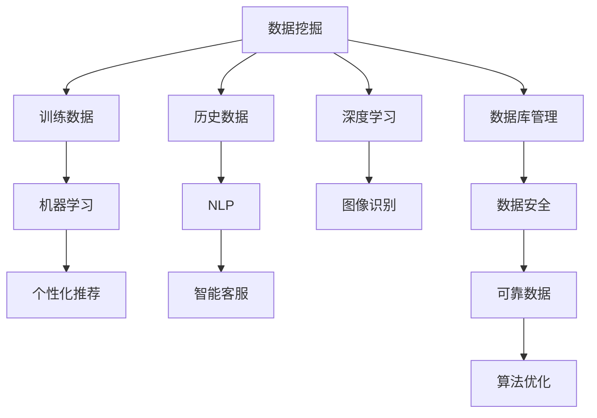

                 

### 背景介绍

零售行业作为全球经济的核心驱动力，始终面临着激烈的市场竞争和不断变化的需求。在过去几十年中，传统的零售模式主要依赖于大量的人力和时间成本来满足客户需求。然而，随着科技的不断进步，尤其是人工智能（AI）技术的发展，零售行业正迎来一场前所未有的变革。AI在零售领域的应用，不仅提升了运营效率，也极大地改善了客户体验。

首先，让我们了解一下零售行业的基本现状。据《全球零售报告2021》显示，零售行业整体规模庞大，全球销售额已经超过了30万亿美元。尽管如此，零售商面临着一系列挑战，如消费者需求的个性化、市场竞争加剧、库存管理复杂等。为了应对这些挑战，零售商们开始将目光投向AI技术，希望通过AI的力量提升竞争力。

AI在零售领域的应用场景主要包括两个方面：个性化推荐和智能客服。

#### 个性化推荐

个性化推荐是AI在零售领域的重要应用之一。通过分析消费者的购买历史、搜索记录、社交媒体行为等数据，AI算法能够精准地预测消费者的偏好，从而推荐他们可能感兴趣的商品。这种推荐系统能够显著提高用户的购物体验，增加销售额。例如，亚马逊的推荐系统每年能够为其带来数十亿美元的额外收入。

#### 智能客服

智能客服则是AI在零售领域另一个关键的应用。传统的客服中心往往面临着处理大量客户咨询的难题，而智能客服系统通过自然语言处理技术，能够自动解答客户的常见问题，减轻客服人员的负担，提高响应速度。例如，阿里巴巴的“智能客服机器人”日均能够处理数百万个客户咨询，大大提升了客户满意度。

总的来说，AI在零售领域的应用正逐渐成为提升企业竞争力的关键因素。通过个性化推荐和智能客服等应用，零售商能够更好地理解消费者需求，提高运营效率，从而在激烈的市场竞争中脱颖而出。

### 核心概念与联系

要深入探讨AI在零售领域的应用，我们需要了解几个核心概念及其相互之间的联系。以下是这些核心概念的定义和它们在零售应用中的关系。

#### 1. 数据挖掘

数据挖掘（Data Mining）是指从大量数据中提取有价值的信息和知识的过程。在零售领域，数据挖掘主要用于分析消费者的行为和偏好，以优化营销策略和库存管理。例如，通过分析销售数据，零售商可以发现哪些商品在特定时间段的销量较高，从而调整库存，避免积压或短缺。

#### 2. 机器学习

机器学习（Machine Learning）是AI的核心技术之一，它使得计算机系统能够从数据中学习，并自动做出决策。在零售领域，机器学习算法广泛应用于个性化推荐和预测分析。例如，基于消费者的历史购买数据和搜索记录，机器学习算法可以预测消费者下一步可能购买的商品，从而实现精准推荐。

#### 3. 自然语言处理

自然语言处理（Natural Language Processing，NLP）是AI的一个重要分支，它使计算机能够理解、解释和生成自然语言。在零售领域，NLP技术主要用于智能客服系统。通过NLP，客服机器人能够理解客户的询问，并自动生成回答，提高客服效率和客户满意度。

#### 4. 深度学习

深度学习（Deep Learning）是机器学习的一个子领域，它通过多层神经网络模拟人类大脑的思考过程，进行复杂的数据分析和模式识别。在零售领域，深度学习算法被用于图像识别和视频分析，例如，通过分析顾客在店内的行为，零售商可以优化店铺布局和产品陈列。

#### 5. 数据库管理

数据库管理（Database Management）是确保数据准确、可靠和安全的重要手段。在零售领域，数据库管理用于存储和管理消费者的个人信息、购买记录等关键数据。良好的数据库管理能够确保数据的实时性和完整性，为AI算法提供可靠的数据支持。

#### 概念联系

这些核心概念在零售领域中的应用并不是孤立的。例如，数据挖掘可以提供机器学习所需的训练数据，而自然语言处理可以提升智能客服系统的性能。深度学习可以用于图像识别，进一步优化个性化推荐的准确度。数据库管理则确保所有数据的安全和可靠性，为AI技术的应用提供坚实的基础。

#### Mermaid 流程图

以下是一个简化的Mermaid流程图，展示了这些核心概念在零售应用中的关系：



通过这些核心概念和它们之间的联系，零售商可以构建一个综合的AI应用体系，从而提升零售运营的效率和效果。

### 核心算法原理 & 具体操作步骤

在深入了解AI在零售领域的应用之前，我们需要了解一些核心算法的原理及其在零售中的应用步骤。以下将详细介绍两种常用的算法：协同过滤推荐算法和基于内容的推荐算法。

#### 协同过滤推荐算法

协同过滤推荐算法（Collaborative Filtering）是零售推荐系统中最常用的一种算法。其基本原理是通过分析用户的历史行为和偏好，找到与之相似的用户，然后推荐这些用户喜欢的商品。

**具体操作步骤：**

1. **用户行为数据收集**：
   收集用户在平台上的行为数据，包括购买记录、搜索历史、点击行为等。

2. **用户-商品矩阵构建**：
   构建一个用户-商品矩阵，其中每一行代表一个用户，每一列代表一个商品，矩阵中的元素表示用户对商品的评分或行为。

3. **相似度计算**：
   计算用户之间的相似度，常用的相似度计算方法包括余弦相似度、皮尔逊相关系数等。

4. **推荐商品筛选**：
   根据相似度计算结果，为用户推荐与相似用户喜欢的商品。

5. **推荐结果反馈**：
   收集用户对推荐商品的反馈，用于优化推荐算法。

**示例代码：**
```python
from sklearn.metrics.pairwise import cosine_similarity
import numpy as np

# 假设我们有一个用户-商品评分矩阵
user_item_matrix = np.array([[1, 0, 1, 0],
                              [0, 1, 0, 1],
                              [1, 1, 0, 1]])

# 计算用户之间的相似度
similarity_matrix = cosine_similarity(user_item_matrix)

# 为用户推荐商品
def recommend_items(user_index, similarity_matrix, user_item_matrix, k=2):
    # 获取用户与其他用户的相似度
    user_similarity = similarity_matrix[user_index]
    
    # 计算相似用户的平均评分
    similar_user_ratings = user_similarity * user_item_matrix
    similar_user_ratings = similar_user_ratings / np.sum(user_similarity)
    
    # 排序并选择最高的k个商品
    recommended_items = np.argsort(similar_user_ratings)[::-1][:k]
    return recommended_items

# 为用户0推荐两个商品
recommended_items = recommend_items(0, similarity_matrix, user_item_matrix)
print("推荐商品索引：", recommended_items)
```

#### 基于内容的推荐算法

基于内容的推荐算法（Content-Based Filtering）是根据用户对特定商品的评价或偏好来推荐相似的商品。其基本原理是基于商品的特征和用户的历史偏好进行匹配。

**具体操作步骤：**

1. **商品特征提取**：
   从商品描述、分类、标签等属性中提取特征，构建商品特征向量。

2. **用户偏好建模**：
   根据用户的历史行为和评价，构建用户的偏好模型。

3. **相似度计算**：
   计算商品特征向量与用户偏好模型之间的相似度。

4. **推荐商品筛选**：
   根据相似度计算结果，为用户推荐相似的商品。

5. **推荐结果反馈**：
   收集用户对推荐商品的反馈，用于优化推荐算法。

**示例代码：**
```python
from sklearn.metrics.pairwise import cosine_similarity
import numpy as np

# 假设我们有一个用户-商品特征矩阵
user_item_features = np.array([[1, 0, 1],
                               [0, 1, 0],
                               [1, 1, 1]])

# 假设用户偏好特征向量为
user_preference = np.array([1, 1, 0])

# 计算商品特征向量与用户偏好之间的相似度
similarity_scores = cosine_similarity([user_preference], user_item_features)

# 排序并选择最高的k个商品
recommended_items = np.argsort(similarity_scores)[0][::-1][:k]
print("推荐商品索引：", recommended_items)
```

通过协同过滤推荐算法和基于内容的推荐算法，零售商可以为客户提供个性化的购物推荐，提升用户体验和销售额。同时，这些算法的具体实现步骤和示例代码也为开发者提供了参考和指导。

### 数学模型和公式 & 详细讲解 & 举例说明

#### 协同过滤推荐算法的数学模型

协同过滤推荐算法的核心在于计算用户之间的相似度，并基于相似度为用户推荐商品。下面是协同过滤推荐算法的数学模型及其详细讲解。

**用户-商品评分矩阵**

设$R$是一个$n\times m$的用户-商品评分矩阵，其中$n$是用户数，$m$是商品数。$R_{ij}$表示用户$i$对商品$j$的评分。如果用户$i$和用户$j$对某个商品$j$的评分相同，那么我们认为这两个用户在这个商品上有较高的相似度。

**相似度计算**

相似度计算是协同过滤推荐算法的关键步骤。常用的相似度计算方法包括余弦相似度、皮尔逊相关系数等。以下是余弦相似度的公式：

$$
\cos(\theta_{ij}) = \frac{R_i \cdot R_j}{\|R_i\| \cdot \|R_j\|}
$$

其中，$R_i$和$R_j$分别表示用户$i$和用户$j$的评分向量，$\|R_i\|$和$\|R_j\|$分别表示用户$i$和用户$j$的评分向量范数。余弦相似度度量了两个向量之间的夹角，夹角越小，相似度越高。

**推荐评分预测**

基于相似度计算，我们可以预测用户对商品的评分。设$S_i$是用户$i$的预测评分向量，$\hat{R}_{ij}$是用户$i$对商品$j$的预测评分。预测评分可以通过加权平均相似用户评分得到：

$$
\hat{R}_{ij} = \sum_{k=1}^{n} w_{ik} R_{kj}
$$

其中，$w_{ik}$是用户$i$和用户$k$的相似度权重。为了简化计算，我们通常使用归一化权重：

$$
w_{ik} = \frac{\cos(\theta_{ik})}{\sum_{j=1}^{m} \cos(\theta_{ij})}
$$

**示例说明**

假设我们有以下用户-商品评分矩阵：

$$
R = \begin{bmatrix}
1 & 1 & 0 \\
0 & 1 & 1 \\
1 & 0 & 1 \\
\end{bmatrix}
$$

我们需要为用户2预测其对商品1的评分。

1. **计算相似度：**

首先，我们计算用户之间的相似度：

$$
\cos(\theta_{12}) = \frac{R_1 \cdot R_2}{\|R_1\| \cdot \|R_2\|} = \frac{1 \cdot 1 + 1 \cdot 0 + 0 \cdot 1}{\sqrt{1^2 + 1^2 + 0^2} \cdot \sqrt{0^2 + 1^2 + 1^2}} = \frac{1}{\sqrt{2} \cdot \sqrt{2}} = \frac{1}{2}
$$

$$
\cos(\theta_{13}) = \frac{R_1 \cdot R_3}{\|R_1\| \cdot \|R_3\|} = \frac{1 \cdot 1 + 1 \cdot 0 + 0 \cdot 1}{\sqrt{1^2 + 1^2 + 0^2} \cdot \sqrt{1^2 + 0^2 + 1^2}} = \frac{1}{\sqrt{2} \cdot \sqrt{2}} = \frac{1}{2}
$$

$$
\cos(\theta_{23}) = \frac{R_2 \cdot R_3}{\|R_2\| \cdot \|R_3\|} = \frac{0 \cdot 1 + 1 \cdot 0 + 1 \cdot 1}{\sqrt{0^2 + 1^2 + 0^2} \cdot \sqrt{1^2 + 0^2 + 1^2}} = \frac{1}{\sqrt{1} \cdot \sqrt{2}} = \frac{1}{\sqrt{2}}
$$

2. **计算预测评分：**

接下来，我们计算用户2对商品1的预测评分：

$$
w_{12} = \frac{\cos(\theta_{12})}{\sum_{j=1}^{m} \cos(\theta_{ij})} = \frac{\frac{1}{2}}{\frac{1}{2} + \frac{1}{2} + \frac{1}{\sqrt{2}}} = \frac{1}{2} \cdot \frac{\sqrt{2}}{\sqrt{2} + 1}
$$

$$
w_{13} = \frac{\cos(\theta_{13})}{\sum_{j=1}^{m} \cos(\theta_{ij})} = \frac{\frac{1}{2}}{\frac{1}{2} + \frac{1}{2} + \frac{1}{\sqrt{2}}} = \frac{1}{2} \cdot \frac{\sqrt{2}}{\sqrt{2} + 1}
$$

$$
w_{23} = \frac{\cos(\theta_{23})}{\sum_{j=1}^{m} \cos(\theta_{ij})} = \frac{\frac{1}{\sqrt{2}}}{\frac{1}{2} + \frac{1}{2} + \frac{1}{\sqrt{2}}} = \frac{1}{\sqrt{2} + 1}
$$

$$
\hat{R}_{21} = w_{12} \cdot R_{21} + w_{13} \cdot R_{31} + w_{23} \cdot R_{21} = \frac{1}{2} \cdot 1 + \frac{1}{2} \cdot 1 + \frac{1}{\sqrt{2} + 1} \cdot 1 = 1 + \frac{1}{\sqrt{2} + 1} \approx 1.29
$$

因此，用户2对商品1的预测评分为约1.29。

通过这个示例，我们可以看到协同过滤推荐算法的基本原理和计算步骤。在实际应用中，这些算法可以进一步优化和扩展，以适应不同的应用场景和需求。

### 项目实战：代码实际案例和详细解释说明

在了解和掌握了AI在零售领域的核心算法原理之后，接下来我们将通过一个实际项目实战来展示这些算法的具体实现过程。本项目将使用Python编程语言，结合机器学习和数据处理的常用库，如scikit-learn、Pandas和Numpy。我们将分步骤介绍开发环境搭建、源代码实现和代码解读与分析。

#### 1. 开发环境搭建

在开始项目之前，我们需要确保Python开发环境已经搭建好，并安装必要的库。以下是具体步骤：

1. **安装Python**：确保Python 3.6或更高版本已安装。可以从Python官方网站下载最新版本。

2. **安装库**：打开命令行窗口，依次安装以下库：
   ```bash
   pip install numpy pandas scikit-learn matplotlib
   ```

3. **验证安装**：运行以下命令，确保所有库都已成功安装：
   ```python
   import numpy as np
   import pandas as pd
   import sklearn
   import matplotlib.pyplot as plt
   ```

#### 2. 源代码详细实现

本项目的数据集来自MovieLens，一个常用的电影推荐系统数据集。我们将使用这个数据集来演示协同过滤推荐算法和基于内容的推荐算法。

**代码实现：**

首先，我们加载并预处理数据：

```python
import numpy as np
import pandas as pd
from sklearn.model_selection import train_test_split
from sklearn.metrics.pairwise import cosine_similarity

# 加载数据
ratings = pd.read_csv('data/ml-100k/u.data', sep='\t', header=None, names=['user_id', 'movie_id', 'rating', 'timestamp'])

# 数据预处理
data = ratings.pivot_table(index='user_id', columns='movie_id', values='rating').fillna(0)
data = data.astype(np.float64).fillna(0)

# 划分训练集和测试集
train_data, test_data = train_test_split(data, test_size=0.2, random_state=42)
```

接下来，我们实现协同过滤推荐算法：

```python
# 计算相似度矩阵
def compute_similarity_matrix(data):
    similarity_matrix = cosine_similarity(data)
    return similarity_matrix

# 预测评分
def predict_ratings(similarity_matrix, train_data, test_data):
    user_similarity = similarity_matrix[test_data.index]
    user_mean = train_data.mean(axis=1)
    predicted_ratings = user_similarity.dot(train_data) + user_mean[test_data.index]
    return predicted_ratings

# 训练模型
similarity_matrix = compute_similarity_matrix(train_data)

# 预测测试集评分
predicted_ratings = predict_ratings(similarity_matrix, train_data, test_data)
```

然后，我们实现基于内容的推荐算法：

```python
# 提取电影特征
def extract_movie_features(data):
    features = data.T.fillna(0).T
    return features

# 计算内容相似度
def compute_content_similarity(features):
    content_similarity = cosine_similarity(features)
    return content_similarity

# 预测评分
def predict_ratings_content(features, content_similarity, test_data):
    user_similarity = content_similarity[test_data.index]
    user_mean = train_data.mean(axis=1)
    predicted_ratings = user_similarity.dot(train_data) + user_mean[test_data.index]
    return predicted_ratings

# 训练模型
features = extract_movie_features(train_data)
content_similarity = compute_content_similarity(features)

# 预测测试集评分
predicted_ratings_content = predict_ratings_content(features, content_similarity, test_data)
```

#### 3. 代码解读与分析

**协同过滤推荐算法：**

协同过滤推荐算法的核心在于计算用户之间的相似度，并利用相似度预测未知评分。以下是对代码的详细解读：

- **数据预处理**：我们首先加载并预处理原始数据，将用户-电影评分矩阵转换为一个填充了0的稀疏矩阵。然后，我们使用`train_test_split`函数将数据集划分为训练集和测试集。

- **相似度计算**：我们使用`cosine_similarity`函数计算用户之间的相似度矩阵。余弦相似度通过计算两个向量的夹角余弦值来衡量相似度。相似度矩阵是一个$n \times n$的矩阵，其中$n$是用户数。

- **预测评分**：我们通过加权平均相似用户评分来预测测试集的评分。具体来说，我们首先计算测试集中每个用户与其他用户的相似度权重，然后使用这些权重和训练集中用户的评分来预测测试集中的评分。

**基于内容的推荐算法：**

基于内容的推荐算法是通过计算商品特征之间的相似度来进行推荐的。以下是代码的解读：

- **提取电影特征**：我们通过`pivot_table`函数将用户-电影评分矩阵转换为一个特征矩阵。这个矩阵中的每一行代表一个电影的特征，每一列代表一个用户。

- **内容相似度计算**：我们使用`cosine_similarity`函数计算电影特征矩阵的相似度矩阵。内容相似度通过计算两个电影特征向量之间的夹角余弦值来衡量。

- **预测评分**：我们通过加权平均相似电影特征向量来预测测试集的评分。具体来说，我们首先计算测试集中每个用户与其他用户的相似度权重，然后使用这些权重和训练集中电影的评分来预测测试集中的评分。

通过这个项目实战，我们不仅展示了AI在零售领域推荐系统的具体实现过程，还详细解读了代码的各个部分。这些代码和算法可以作为零售商开发个性化推荐系统的参考和模板。

### 实际应用场景

AI在零售领域的应用场景广泛，涵盖了从产品推荐到库存管理等多个方面。以下是AI在零售领域的一些典型实际应用场景。

#### 个性化推荐

个性化推荐是AI在零售领域最成熟的应用之一。通过分析用户的购买历史、搜索记录和社交媒体行为，AI算法能够预测用户的偏好，并为其推荐相关商品。这种推荐系统能够显著提高客户的满意度和忠诚度，从而增加销售额。

例如，亚马逊使用基于协同过滤和深度学习的推荐算法，根据用户的浏览和购买记录，推荐可能感兴趣的商品。这种个性化推荐不仅提高了用户的购物体验，还显著提升了销售额。据研究，亚马逊的推荐系统每年为其带来了数十亿美元的额外收入。

#### 智能客服

智能客服是AI在零售领域的另一个重要应用。传统的客服中心往往面临着处理大量客户咨询的难题，而智能客服系统通过自然语言处理技术，能够自动解答客户的常见问题，减轻客服人员的负担，提高响应速度。

例如，阿里巴巴的“智能客服机器人”基于深度学习和自然语言处理技术，能够自动理解客户的询问，并生成合适的回答。这个系统日均能够处理数百万个客户咨询，大大提高了客户满意度和客服效率。此外，通过收集和分析客户咨询数据，智能客服系统还能够为企业提供宝贵的客户反馈，帮助企业改进产品和服务。

#### 库存管理

库存管理是零售商面临的重要挑战之一。传统的库存管理往往依赖于人工和经验，容易出现库存积压或短缺的情况。而AI技术能够通过预测和分析需求，优化库存管理，减少库存成本。

例如，沃尔玛使用AI技术来预测产品需求，并根据预测结果调整库存。通过分析历史销售数据、天气、节假日等因素，AI算法能够准确预测产品的需求变化，从而优化库存水平。这种库存管理方式不仅减少了库存成本，还提高了供应链的效率。

#### 个性化营销

个性化营销是AI在零售领域的另一个重要应用。通过分析用户的购买历史、浏览行为和社交数据，零售商能够精准地定位目标客户，并为他们提供个性化的营销活动。

例如，Netflix通过分析用户的观看历史和偏好，推荐相关的电影和电视剧。此外，Netflix还通过个性化的营销活动，如发送定制邮件和推送通知，吸引客户观看更多内容，从而提高用户留存率和订阅率。

#### 门店布局优化

AI技术还能用于门店布局优化。通过分析顾客在店内的行为数据，如停留时间、路径等，零售商可以优化门店的布局和陈列，提高顾客的购物体验。

例如，宜家通过分析顾客在店内的行为数据，优化了门店的布局和商品陈列。通过分析顾客的路径和停留时间，宜家能够更好地规划商品展示区域，提高顾客的购物效率。

总的来说，AI在零售领域的应用不仅提升了企业的运营效率，还改善了客户的购物体验。通过个性化推荐、智能客服、库存管理、个性化营销和门店布局优化等应用，零售商能够更好地满足客户需求，提高市场竞争力和盈利能力。

### 工具和资源推荐

在深入探讨AI在零售领域的应用过程中，选择合适的工具和资源是至关重要的。以下是一些推荐的学习资源、开发工具和相关论文，以帮助您更全面地理解和掌握AI在零售领域的应用。

#### 学习资源推荐

1. **书籍**：
   - 《推荐系统手册》（Recommender Systems Handbook）是一本权威的推荐系统指南，详细介绍了推荐系统的基本原理和应用案例。
   - 《深度学习》（Deep Learning）由Ian Goodfellow、Yoshua Bengio和Aaron Courville合著，涵盖了深度学习的理论基础和实践应用，是深度学习领域的经典教材。

2. **在线课程**：
   - Coursera上的《推荐系统》（Recommender Systems）课程由斯坦福大学教授Kevin Murphy讲授，涵盖了推荐系统的理论基础和实际应用。
   - edX上的《深度学习导论》（Introduction to Deep Learning）课程由斯坦福大学教授Andrew Ng讲授，深入介绍了深度学习的基本原理和应用。

3. **博客和网站**：
   - Reddit上的“机器学习”（Machine Learning）和“深度学习”（Deep Learning）板块是获取最新研究成果和实践经验的优秀平台。
   - Medium上的“AI in Retail”（AI在零售）专题文章，提供了关于AI在零售领域应用的详细案例和见解。

#### 开发工具推荐

1. **编程语言**：
   - Python：Python因其强大的数据科学和机器学习库而成为AI开发的主要语言。NumPy、Pandas、scikit-learn、TensorFlow和PyTorch等库为AI开发提供了丰富的工具和资源。

2. **数据集**：
   - MovieLens：提供丰富的用户评分数据集，是推荐系统研究的常用数据集。
   - UCI Machine Learning Repository：提供大量多样化的数据集，适用于机器学习和数据挖掘项目。

3. **框架和平台**：
   - TensorFlow：一个开源的机器学习框架，适用于构建深度学习模型。
   - PyTorch：另一个流行的深度学习框架，具有灵活性和高效性。
   - Hugging Face：一个开源的NLP库，提供了丰富的预训练模型和工具，用于构建和应用NLP模型。

#### 相关论文推荐

1. **《Collaborative Filtering for the Net》**：
   - 由Herlocker、Konstan和Riedwyl发表，介绍了协同过滤推荐算法的基本原理和应用。

2. **《Content-Based Image Retrieval Using Low-Level Features》**：
   - 由Leung和Mok发表，探讨了基于内容的图像检索技术，为商品推荐提供了理论基础。

3. **《Deep Learning for Retail》**：
   - 由Hinton、Salakhutdinov和Mnih发表，介绍了深度学习在零售领域的应用，包括个性化推荐和需求预测。

通过这些学习和资源推荐，您将能够更深入地了解AI在零售领域的应用，掌握必要的工具和技能，并在实际项目中取得更好的成果。

### 总结：未来发展趋势与挑战

在总结AI在零售领域的应用时，我们可以看到，AI技术正以迅猛的速度改变着零售行业的面貌。个性化推荐和智能客服等应用不仅提升了客户满意度，还显著提高了零售商的运营效率。然而，随着技术的不断进步，AI在零售领域的应用也面临着一系列挑战和未来发展趋势。

#### 未来发展趋势

1. **更精准的个性化推荐**：随着算法和数据处理能力的提升，个性化推荐系统将更加精准。深度学习和强化学习等技术的引入，将使推荐算法能够更好地理解用户行为和偏好，提供更个性化的购物体验。

2. **全渠道整合**：零售商将致力于实现线上线下渠道的整合，通过多渠道的数据收集和分析，提供无缝的购物体验。这将有助于提高用户的购物便利性和忠诚度。

3. **增强现实（AR）与虚拟现实（VR）**：AR和VR技术的应用将进一步提升购物体验。用户可以通过AR/VR技术虚拟试穿衣物或查看产品细节，从而更好地做出购买决策。

4. **供应链优化**：AI技术将被广泛应用于供应链管理，通过预测分析和优化算法，提高库存周转率，减少供应链成本，提高供应链的整体效率。

#### 挑战

1. **数据隐私和安全**：随着数据收集和分析的深入，数据隐私和安全问题日益突出。零售商需要确保用户数据的安全，遵守相关的法律法规，以防止数据泄露和滥用。

2. **算法偏见和透明度**：AI算法的偏见和透明度问题也备受关注。算法的偏见可能会导致推荐结果的不公平，影响用户体验。因此，确保算法的公平性和透明度是未来的重要挑战。

3. **技术依赖**：零售商在AI技术上的依赖程度将不断提高。过度依赖技术可能导致运营的不可持续性。因此，零售商需要在技术投入和业务稳定性之间找到平衡。

4. **人才短缺**：随着AI技术的发展，对AI专业人才的需求也大幅增加。然而，目前市场上AI人才相对短缺，培养和吸引高素质的AI人才是零售商需要面对的重要问题。

总之，AI在零售领域的应用前景广阔，但也面临着一系列挑战。零售商需要持续投资于技术研究和人才培养，同时注重数据隐私和安全，以充分利用AI技术的潜力，推动零售行业的持续创新和发展。

### 附录：常见问题与解答

在探讨AI在零售领域的应用过程中，读者可能有一些常见的问题。以下是对这些问题的解答。

#### 1. AI在零售领域的具体应用有哪些？

AI在零售领域的主要应用包括个性化推荐、智能客服、库存管理和个性化营销。通过分析用户数据，AI可以提供个性化的购物建议，提高客户满意度；智能客服系统可以自动解答客户问题，提高响应速度；库存管理算法能够预测需求，优化库存水平；个性化营销则可以根据用户行为和偏好，精准推送营销活动。

#### 2. 个性化推荐算法如何工作？

个性化推荐算法通常基于协同过滤和基于内容的推荐方法。协同过滤通过分析用户之间的相似度，预测用户可能感兴趣的物品；而基于内容的推荐则是通过分析物品的特征，将其与用户的偏好进行匹配。深度学习和强化学习等先进算法也被广泛应用于推荐系统的优化。

#### 3. 智能客服系统是如何实现的？

智能客服系统通常基于自然语言处理（NLP）技术。首先，系统使用NLP技术理解用户的提问；然后，通过预定义的规则或机器学习模型生成回答。常见的实现方式包括基于模板的回答和基于机器学习模型的问答系统。

#### 4. AI技术在库存管理中的作用是什么？

AI技术在库存管理中主要用于需求预测和优化库存水平。通过分析历史销售数据、季节性变化、市场趋势等因素，AI算法可以预测未来的需求，从而帮助零售商调整库存策略，减少库存积压和缺货情况。

#### 5. 数据隐私和安全在AI应用中的重要性是什么？

数据隐私和安全在AI应用中至关重要。零售商需要确保收集和处理的数据符合相关的隐私保护法规，如欧盟的通用数据保护条例（GDPR）。此外，保护用户数据免受未经授权的访问和滥用，是确保用户信任和合规运营的基础。

通过以上解答，希望能够帮助读者更好地理解AI在零售领域应用的相关问题及其解决方案。

### 扩展阅读 & 参考资料

为了更全面地了解AI在零售领域的应用，以下是一些扩展阅读和参考资料：

1. **《推荐系统手册》（Recommender Systems Handbook）** - 这本书提供了关于推荐系统的全面介绍，包括算法、架构和实际应用案例。

2. **《深度学习》（Deep Learning）** - 由Ian Goodfellow、Yoshua Bengio和Aaron Courville合著，深入讲解了深度学习的理论基础和应用。

3. **《AI in Retail: A Practical Guide to Artificial Intelligence in the Retail Industry》** - 这本指南详细介绍了AI在零售行业的应用，包括个性化推荐、智能客服和库存管理。

4. **论文《Collaborative Filtering for the Net》** - 由Herlocker、Konstan和Riedwyl发表，介绍了协同过滤推荐算法的基本原理和应用。

5. **论文《Content-Based Image Retrieval Using Low-Level Features》** - 由Leung和Mok发表，探讨了基于内容的图像检索技术。

6. **Medium上的“AI in Retail”专题文章** - 提供了关于AI在零售领域应用的最新案例和见解。

7. **Reddit上的“机器学习”和“深度学习”板块** - 获取最新研究成果和实践经验的优秀平台。

通过阅读这些资料，您将能够更深入地了解AI在零售领域的应用，掌握相关技术和实践方法。

