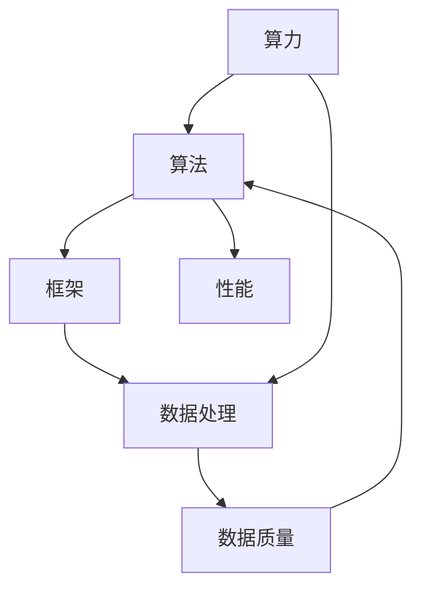

                 

# AI 基础设施建设：算力、数据、算法、框架

> 关键词：人工智能、算力、数据、算法、框架、基础设施

> 摘要：本文旨在深入探讨人工智能基础设施建设的核心要素：算力、数据、算法和框架。通过逻辑清晰、结构紧凑的分析，本文将帮助读者理解这些要素在AI技术发展中的重要作用，并展望未来可能面临的挑战和趋势。

## 1. 背景介绍

人工智能（AI）作为当今科技领域的前沿方向，已经取得了显著的进展。从最初的专家系统，到如今的深度学习和强化学习，AI技术在各个领域展现出强大的潜力。然而，AI技术的发展并非一蹴而就，其背后依赖于复杂的基础设施建设。

### 算力的重要性

随着AI算法的复杂度不断增加，对算力的需求也日益增长。算力是衡量计算机系统处理数据的能力，其重要性在AI时代尤为突出。无论是图像识别、自然语言处理，还是复杂决策的生成，都离不开强大的计算支持。

### 数据的基石作用

数据是AI的燃料，没有高质量的数据，AI模型难以达到理想的性能。数据的质量、多样性和规模直接影响AI系统的表现。因此，数据基础设施的建设至关重要。

### 算法的核心地位

算法是AI技术的灵魂，决定了AI系统能够完成哪些任务，以及完成这些任务的效率和质量。优秀的算法能够大幅提升AI系统的性能，推动技术进步。

### 框架的整合作用

框架为AI系统的开发和部署提供了统一的接口和工具集，简化了开发流程，提高了开发效率。框架的作用不仅限于代码层面的整合，还包括数据管理、模型训练、评估和部署等各个环节。

## 2. 核心概念与联系

### 算力

**定义：** 算力是指计算机系统在单位时间内处理数据的数量和能力。它通常以浮点运算每秒（FLOPS）为单位进行衡量。

**影响因子：** 算力的大小直接影响到AI模型的训练时间和效果。高性能的算力可以加速模型训练，缩短研发周期。

**技术发展：** 算力的发展经历了从单核CPU到多核CPU，再到GPU和TPU的演进。当前，量子计算等新型计算技术正在探索中，有望在未来进一步提升算力。

### 数据

**定义：** 数据是AI系统的核心资产，包括结构化数据和非结构化数据。结构化数据如数据库，非结构化数据如文本、图像、音频等。

**影响因子：** 数据的质量、多样性和规模对AI系统的性能有着决定性影响。高质量的数据可以提高模型的泛化能力，而大规模的数据则为模型提供了足够的训练样本。

**数据管理：** 数据管理包括数据的采集、存储、处理和共享等环节。数据治理和数据安全是确保数据质量和安全的重要手段。

### 算法

**定义：** 算法是解决问题的方法或步骤。在AI领域，算法是用于模拟人类智能行为的一系列规则或指令。

**影响因子：** 算法的复杂度、效率和可扩展性是评估其优劣的关键指标。优秀的算法能够显著提升AI系统的性能。

**算法分类：** AI算法可以分为监督学习、无监督学习、强化学习等不同类型，每种算法都有其适用的场景。

### 框架

**定义：** 框架是一组预定义的软件组件和工具，用于简化软件开发过程，提高开发效率。

**影响因子：** 框架提供了标准的接口和工具集，使得开发者可以专注于算法的实现，而无需关注底层细节。

**框架类型：** 常见的AI框架包括TensorFlow、PyTorch、Keras等，它们各有特色，适用于不同的开发需求。

### Mermaid 流程图



## 3. 核心算法原理 & 具体操作步骤

### 深度学习算法

**原理：** 深度学习是一种基于多层神经网络的结构，用于自动从数据中学习特征表示。其主要原理是通过反向传播算法优化网络权重，以最小化预测误差。

**操作步骤：**

1. **数据预处理：** 数据清洗、归一化等。
2. **构建网络：** 设计并构建神经网络结构。
3. **训练模型：** 使用训练数据训练模型，通过反向传播算法更新权重。
4. **评估模型：** 使用验证集和测试集评估模型性能。
5. **部署模型：** 将训练好的模型部署到生产环境中。

### 强化学习算法

**原理：** 强化学习是一种通过与环境交互来学习最优策略的算法。其原理是使用奖励和惩罚信号来调整策略，以达到最大化长期回报。

**操作步骤：**

1. **定义环境：** 确定学习环境的规则和状态空间。
2. **构建模型：** 设计并构建强化学习模型。
3. **训练模型：** 通过与环境交互，不断调整策略。
4. **评估策略：** 使用评估指标评估策略的优劣。
5. **优化策略：** 根据评估结果调整策略。

## 4. 数学模型和公式 & 详细讲解 & 举例说明

### 深度学习中的反向传播算法

**数学模型：** 反向传播算法是深度学习训练过程中用于更新网络权重的一种优化方法。其核心公式如下：

$$
\delta_{ij} = \frac{\partial C}{\partial z_j} \cdot \sigma'(z_j)
$$

$$
\Delta W_{ij} = \eta \cdot \delta_{ij} \cdot a_{j-1}
$$

其中，$\delta_{ij}$表示第$i$层第$j$个神经元的误差，$C$表示损失函数，$z_j$表示第$j$个神经元的激活值，$\sigma'$表示激活函数的导数，$\eta$表示学习率，$W_{ij}$表示第$i$层第$j$个神经元的权重，$a_{j-1}$表示前一层神经元的激活值。

**举例说明：**

假设我们有一个简单的神经网络，包含两层：输入层和输出层。输入层有3个神经元，输出层有1个神经元。激活函数为ReLU函数，学习率为0.1。

1. **数据预处理：** 对输入数据进行归一化处理。
2. **构建网络：** 设计网络结构，并初始化权重。
3. **训练模型：** 使用训练数据，通过反向传播算法更新权重。
4. **评估模型：** 使用验证集评估模型性能。

假设在一次训练过程中，输出层的激活值为7，损失函数的值为5。ReLU函数的导数为1（当输入大于0时）。根据上述公式，可以计算出每个神经元的误差和权重的更新。

$$
\delta_1 = \frac{\partial C}{\partial z_1} \cdot \sigma'(z_1) = 5 \cdot 1 = 5
$$

$$
\Delta W_{11} = \eta \cdot \delta_1 \cdot a_{0} = 0.1 \cdot 5 \cdot 1 = 0.5
$$

同理，可以计算出其他神经元的误差和权重的更新。

## 5. 项目实战：代码实际案例和详细解释说明

### 项目背景

假设我们有一个图像识别项目，需要使用深度学习算法对猫和狗的图片进行分类。

### 开发环境搭建

1. 安装Python环境。
2. 安装深度学习框架TensorFlow。
3. 准备训练数据集。

### 源代码详细实现和代码解读

```python
import tensorflow as tf
from tensorflow.keras.models import Sequential
from tensorflow.keras.layers import Conv2D, MaxPooling2D, Flatten, Dense

# 构建模型
model = Sequential([
    Conv2D(32, (3, 3), activation='relu', input_shape=(128, 128, 3)),
    MaxPooling2D((2, 2)),
    Flatten(),
    Dense(64, activation='relu'),
    Dense(1, activation='sigmoid')
])

# 编译模型
model.compile(optimizer='adam', loss='binary_crossentropy', metrics=['accuracy'])

# 训练模型
model.fit(train_images, train_labels, epochs=10, validation_split=0.2)

# 评估模型
test_loss, test_acc = model.evaluate(test_images, test_labels)
print(f"Test accuracy: {test_acc}")
```

**代码解读：**

1. 导入所需模块。
2. 构建序列模型，包含卷积层、池化层、全连接层等。
3. 编译模型，指定优化器和损失函数。
4. 训练模型，使用训练数据。
5. 评估模型，使用测试数据。

### 代码解读与分析

1. **模型构建：** 通过构建序列模型，定义了网络的层次结构。卷积层用于提取图像特征，全连接层用于分类。
2. **编译模型：** 指定了优化器（用于更新权重）和损失函数（用于评估模型性能）。
3. **训练模型：** 使用训练数据训练模型，通过多次迭代更新权重。
4. **评估模型：** 使用测试数据评估模型性能，以验证模型泛化能力。

## 6. 实际应用场景

### 医疗诊断

AI技术在医疗诊断领域具有广泛的应用。通过深度学习算法，AI系统能够对医疗影像进行自动分析，提高诊断准确率。例如，使用AI算法对肺癌进行早期筛查，可以显著降低误诊率。

### 自动驾驶

自动驾驶是AI技术的另一个重要应用领域。通过深度学习和强化学习算法，自动驾驶系统能够实时感知环境、做出决策，提高行车安全。自动驾驶技术的发展有望改变人们的出行方式。

### 金融服务

在金融服务领域，AI技术被广泛应用于风险控制、智能投顾、信用评估等方面。通过大数据分析和机器学习算法，金融服务机构能够更准确地评估风险，提供个性化的金融服务。

### 语音识别

语音识别是AI技术的经典应用之一。通过深度学习算法，AI系统能够将语音信号转换为文本，实现人机交互。语音识别技术被广泛应用于智能助手、语音搜索、电话客服等领域。

## 7. 工具和资源推荐

### 学习资源推荐

1. **书籍：**
   - 《深度学习》（Goodfellow, Bengio, Courville）
   - 《Python机器学习》（Sebastian Raschka）
2. **论文：**
   - "Deep Learning"（Ian Goodfellow et al.）
   - "Reinforcement Learning: An Introduction"（Richard S. Sutton and Andrew G. Barto）
3. **博客：**
   - Medium（深度学习相关文章）
   - AI博客（技术分享和教程）
4. **网站：**
   - TensorFlow官网（https://www.tensorflow.org/）
   - PyTorch官网（https://pytorch.org/）

### 开发工具框架推荐

1. **深度学习框架：**
   - TensorFlow
   - PyTorch
   - Keras
2. **数据处理工具：**
   - Pandas
   - NumPy
   - SciPy
3. **版本控制工具：**
   - Git
   - GitHub
   - GitLab

### 相关论文著作推荐

1. "Deep Learning"（Ian Goodfellow et al.）
2. "Reinforcement Learning: An Introduction"（Richard S. Sutton and Andrew G. Barto）
3. "Artificial Intelligence: A Modern Approach"（Stuart Russell and Peter Norvig）

## 8. 总结：未来发展趋势与挑战

### 发展趋势

1. **算力提升：** 随着量子计算等新型计算技术的发展，算力将进一步提升，为AI技术的进步提供强大支持。
2. **算法创新：** 不断有新的算法被提出，例如生成对抗网络（GAN）、变分自编码器（VAE）等，为AI应用带来更多可能性。
3. **数据驱动：** 数据质量对AI系统性能的影响愈发突出，数据驱动的发展模式将成为主流。
4. **跨领域融合：** AI技术与生物医学、金融、制造等领域的融合，将推动各行业的技术创新。

### 挑战

1. **数据隐私：** 随着数据规模的不断扩大，数据隐私保护成为一大挑战。如何在保护隐私的同时充分利用数据，是一个亟待解决的问题。
2. **算法伦理：** AI算法的决策过程可能存在偏见，如何确保算法的公平性和透明性，是伦理和法律层面的重要挑战。
3. **算力消耗：** 高性能计算设备能耗巨大，如何降低能耗、提高能源利用效率，是可持续发展的重要议题。

## 9. 附录：常见问题与解答

### 问题1：如何选择深度学习框架？

**解答：** 选择深度学习框架主要考虑以下几点：

1. **需求：** 根据项目需求选择合适的框架，例如，如果需要高性能计算，可以选择TensorFlow或PyTorch。
2. **社区支持：** 选择社区活跃、资源丰富的框架，有助于解决开发过程中遇到的问题。
3. **学习曲线：** 考虑自己的编程经验和学习能力，选择适合的框架，以降低学习成本。

### 问题2：如何处理大量数据？

**解答：** 处理大量数据可以采取以下策略：

1. **分布式计算：** 使用分布式计算框架，如Apache Spark，将数据处理任务分布在多台机器上。
2. **数据抽样：** 对于大数据集，可以选择进行抽样处理，以降低计算复杂度。
3. **数据预处理：** 对数据进行清洗、归一化等预处理，以提高数据质量。

## 10. 扩展阅读 & 参考资料

1. **扩展阅读：**
   - "深度学习入门：基于Python的理论与实现"（斋藤康毅）
   - "强化学习导论"（李宏毅）
2. **参考资料：**
   - TensorFlow官方文档（https://www.tensorflow.org/）
   - PyTorch官方文档（https://pytorch.org/）

## 附录：作者信息

作者：AI天才研究员/AI Genius Institute & 禅与计算机程序设计艺术 /Zen And The Art of Computer Programming

