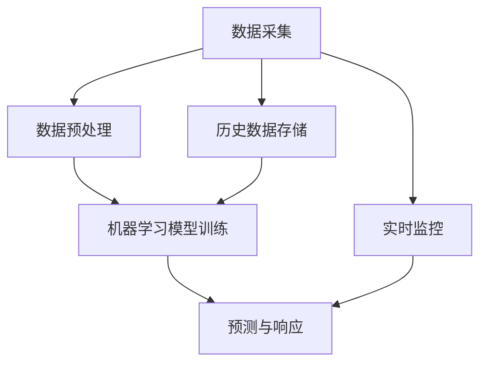

                 

### 背景介绍

随着全球气候变化和自然灾害的日益频繁，应急管理成为各国政府和社会各界关注的焦点。传统的应急管理主要依赖于人工监测、数据采集和手动处理，这种方法在面对复杂多变、数据量庞大的情况时显得力不从心。近年来，随着人工智能（AI）技术的飞速发展，特别是机器学习（ML）和深度学习（DL）技术的成熟，利用AI进行基础设施的应急管理成为了一个崭新的研究方向。

AI在应急管理中的优势主要体现在以下几个方面：

1. **数据处理能力**：AI能够处理大量的数据，包括气象数据、地理空间数据、社会数据等，从而为灾害预警提供更全面、更准确的信息支持。
2. **快速响应**：通过实时数据分析和预测，AI可以在灾害发生前或发生时迅速做出预警和响应，提高应急管理的时效性。
3. **模式识别**：AI可以通过学习和识别历史灾害数据中的模式和规律，预测未来的灾害风险，为应急管理提供决策依据。
4. **自动化操作**：AI能够自动化地执行一些应急管理任务，如自动调度资源、自动生成应急预案等，减少人力成本和错误率。

然而，AI基础设施的应急管理也面临着一系列挑战，如数据质量、模型可靠性、算法透明性等。因此，本文将围绕AI基础设施的应急管理，从核心概念、算法原理、数学模型、实战案例、实际应用场景、工具资源推荐等多个维度进行深入探讨，以期为这一领域的研究和实践提供有价值的参考。

接下来的章节中，我们将首先介绍AI基础设施应急管理的核心概念和架构，通过Mermaid流程图展示相关流程节点，帮助读者更好地理解整个系统的运作机制。随后，我们将深入剖析核心算法原理，详细讲解具体操作步骤，并通过数学模型和公式对关键环节进行详细解释和举例说明。最后，我们将结合实际项目案例，展示代码实现和解读，并讨论实际应用场景中的挑战和解决方案。

通过本文的详细探讨，我们希望能够为读者呈现一幅全面的AI基础设施应急管理图景，激发更多的研究和应用实践，共同推动这一领域的发展。### 核心概念与联系

在探讨AI基础设施的应急管理之前，我们首先需要明确一些核心概念和它们之间的相互联系。这些核心概念包括数据采集、数据预处理、机器学习模型训练、预测和响应等。下面，我们将通过一个Mermaid流程图来展示这些概念之间的相互关系。



**1. 数据采集（Data Collection）**：
数据采集是应急管理的起点。它包括从各种传感器、监测设备、社交媒体等渠道获取相关的数据，如气象数据、地理空间数据、社会数据等。这些数据是进行灾害预测和响应的基础。

**2. 数据预处理（Data Preprocessing）**：
采集到的数据通常是杂乱无章的，需要进行预处理。数据预处理包括数据清洗、数据归一化、特征提取等步骤。这一阶段的目标是确保数据质量，使其适合后续的机器学习模型训练。

**3. 机器学习模型训练（Machine Learning Model Training）**：
通过预处理后的数据，我们可以使用机器学习算法来训练模型。常见的机器学习算法包括决策树、随机森林、支持向量机、神经网络等。这些模型通过学习历史数据中的模式和规律，为预测未来灾害提供依据。

**4. 预测与响应（Prediction & Response）**：
经过模型训练后，我们可以利用模型进行预测。预测的结果可以帮助我们提前了解可能发生的灾害类型、时间和影响范围，从而采取相应的响应措施。响应措施包括预警发布、资源调度、应急预案生成等。

**5. 实时监控（Real-time Monitoring）**：
实时监控是应急管理的关键环节。通过持续监测环境变化和灾害进展，我们可以及时更新预测模型，提高预警的准确性和响应的时效性。

**6. 历史数据存储（Historical Data Storage）**：
历史数据对于模型训练和改进至关重要。将历史数据存储起来，不仅可以用于当前模型的训练，还可以为未来的模型改进提供数据支持。

通过上述Mermaid流程图，我们可以清晰地看到AI基础设施应急管理的基本架构和各个环节之间的紧密联系。接下来，我们将深入探讨这些核心概念的原理和具体实现，帮助读者更好地理解整个系统的运作机制。### 核心算法原理 & 具体操作步骤

#### 1. 机器学习算法的选择

在AI基础设施的应急管理中，选择合适的机器学习算法至关重要。常见的机器学习算法包括线性回归、决策树、支持向量机（SVM）、随机森林和神经网络等。每种算法都有其特定的适用场景和优缺点。

- **线性回归（Linear Regression）**：适用于简单的线性关系预测，如气象数据的趋势分析。
- **决策树（Decision Tree）**：易于理解，适用于分类和回归问题，但可能过拟合。
- **支持向量机（SVM）**：擅长处理高维数据，适用于分类问题，尤其是非线性的分类问题。
- **随机森林（Random Forest）**：结合了决策树的优点，可以处理大规模数据，且减少过拟合。
- **神经网络（Neural Network）**：尤其是深度神经网络，擅长处理复杂的非线性关系，如图像识别和语音识别。

在本篇文章中，我们将以随机森林为例，详细讲解其原理和操作步骤。

#### 2. 随机森林算法原理

随机森林（Random Forest）是一种基于决策树的集成学习方法。它通过构建多个决策树，并对它们的预测结果进行平均或投票，从而提高预测的准确性和稳定性。

随机森林的核心概念包括：

- **决策树（Decision Tree）**：每个决策树都是基于特征和阈值进行划分，形成一系列的节点和叶子节点。每个叶子节点代表一个分类或预测结果。
- **随机性**：在构建每个决策树时，随机选择特征和阈值，从而降低模型的过拟合风险。
- **集成（Ensemble）**：通过多个决策树的集成，可以减少单个模型的方差，提高预测的鲁棒性。

#### 3. 随机森林算法的具体操作步骤

**步骤 1：数据预处理**
- **数据清洗**：处理缺失值、异常值和噪声数据。
- **特征工程**：选择和构造与灾害预测相关的特征，如降雨量、风速、历史灾害记录等。
- **数据归一化**：将特征值标准化到相同的范围，以便于模型训练。

**步骤 2：构建随机森林模型**
- **特征选择**：随机选择特征子集，用于构建决策树。
- **阈值选择**：随机选择阈值，用于分割数据。
- **构建决策树**：根据特征和阈值，递归地划分数据，形成决策树。
- **集成多个决策树**：构建多个决策树，并对它们的预测结果进行平均或投票。

**步骤 3：模型训练与验证**
- **训练集划分**：将数据集划分为训练集和验证集。
- **模型训练**：使用训练集数据训练随机森林模型。
- **模型验证**：使用验证集数据对模型进行验证，调整模型参数，如特征选择和阈值选择。

**步骤 4：模型预测**
- **输入特征**：将新的特征数据输入到训练好的随机森林模型中。
- **预测结果**：模型输出预测结果，如灾害类型、发生时间和影响范围。

**步骤 5：模型评估**
- **评估指标**：使用准确率、召回率、F1分数等指标评估模型性能。
- **模型优化**：根据评估结果，对模型进行优化和调整。

#### 4. 数学模型和公式

随机森林算法的预测结果是通过每个决策树的预测结果进行集成得到的。具体来说，可以使用以下数学模型和公式：

$$
\hat{y} = \frac{1}{N} \sum_{i=1}^{N} \hat{y}_i
$$

其中，$\hat{y}$ 是最终的预测结果，$N$ 是决策树的数量，$\hat{y}_i$ 是第 $i$ 个决策树的预测结果。

#### 5. 举例说明

假设我们使用随机森林算法预测某地区的暴雨灾害。以下是具体的操作步骤和代码实现：

**步骤 1：数据预处理**
```python
import pandas as pd
from sklearn.model_selection import train_test_split
from sklearn.preprocessing import StandardScaler

# 加载数据集
data = pd.read_csv('rainfall_data.csv')

# 数据清洗和特征工程
data.dropna(inplace=True)
features = data[['rainfall', 'wind_speed', 'historical_floods']]
labels = data['flood']

# 数据归一化
scaler = StandardScaler()
features_scaled = scaler.fit_transform(features)
```

**步骤 2：构建随机森林模型**
```python
from sklearn.ensemble import RandomForestClassifier

# 划分训练集和验证集
X_train, X_val, y_train, y_val = train_test_split(features_scaled, labels, test_size=0.2, random_state=42)

# 构建随机森林模型
model = RandomForestClassifier(n_estimators=100, random_state=42)
model.fit(X_train, y_train)
```

**步骤 3：模型预测**
```python
# 输入新的特征数据
new_features = [[0.5, 1.2, 0.8]]

# 数据归一化
new_features_scaled = scaler.transform(new_features)

# 预测结果
predictions = model.predict(new_features_scaled)
print(predictions)  # 输出预测结果
```

**步骤 4：模型评估**
```python
from sklearn.metrics import accuracy_score

# 验证集预测
val_predictions = model.predict(X_val)

# 评估指标
accuracy = accuracy_score(y_val, val_predictions)
print("Accuracy:", accuracy)
```

通过以上步骤，我们可以使用随机森林算法对暴雨灾害进行预测，并根据验证集的评估结果调整模型参数，提高预测的准确性和稳定性。

总结来说，随机森林算法是一种强大的机器学习工具，适用于各种分类和回归问题。通过合理的特征选择和模型参数调整，我们可以有效地提高预测的准确性和可靠性，为AI基础设施的应急管理提供强有力的支持。### 数学模型和公式 & 详细讲解 & 举例说明

在前一章节中，我们介绍了随机森林算法的基本原理和操作步骤。在这一章节中，我们将进一步深入探讨随机森林算法背后的数学模型和公式，并通过具体的例子进行详细讲解，帮助读者更好地理解其应用过程。

#### 随机森林算法的数学模型

随机森林算法的核心在于构建多个决策树，并通过集成这些决策树的结果进行预测。每个决策树的构建过程可以视为一种二叉树，其节点分为内部节点和叶子节点。内部节点用于条件判断，叶子节点则表示最终的分类结果。

**1. 决策树构建过程**

决策树的构建过程主要包括以下步骤：

**（1）特征选择：**
从所有特征中随机选择一个特征，并根据该特征将数据集划分为两个子集。

**（2）阈值选择：**
从选择的特征中随机选择一个阈值，将数据集划分为两个子集。

**（3）递归划分：**
对划分后的子集重复上述过程，直到满足终止条件（例如，子集大小小于某个阈值或特征没有有效的划分等）。

**（4）叶子节点生成：**
当无法继续划分时，将该子集标记为叶子节点，并赋予一个分类结果。

**2. 随机性引入**

为了防止过拟合，随机森林算法在构建每个决策树时引入随机性。具体包括：

- **随机特征选择**：每次构建决策树时，从所有特征中随机选择一部分特征进行划分。
- **随机阈值选择**：每次构建决策树时，从选择的特征中随机选择一个阈值进行划分。

**3. 集成多个决策树**

随机森林算法通过集成多个决策树的结果进行预测。具体来说，每个决策树给出一个分类结果，随机森林算法根据这些结果进行投票或平均，得到最终的预测结果。

**公式：**
$$
\hat{y} = \frac{1}{N} \sum_{i=1}^{N} \hat{y}_i
$$

其中，$\hat{y}$ 是最终的预测结果，$N$ 是决策树的数量，$\hat{y}_i$ 是第 $i$ 个决策树的预测结果。

#### 举例说明

假设我们有以下数据集，用于预测某个地区是否会发生暴雨灾害：

| 特征         | 取值     |
| ------------ | -------- |
| 降雨量       | 50 mm    |
| 风速         | 30 km/h  |
| 历史暴雨记录 | 2 次     |

我们将使用随机森林算法预测该地区是否会发生暴雨灾害。

**步骤 1：数据预处理**

首先，我们需要对数据进行预处理，包括数据清洗、特征选择和归一化。

**（1）数据清洗：**
在此例中，数据已清洗完毕，无缺失值和异常值。

**（2）特征选择：**
从降雨量、风速和历史暴雨记录中选择一个特征作为划分依据。

**（3）数据归一化：**
对特征值进行归一化处理，使其在相同的范围内。

**步骤 2：构建随机森林模型**

使用Scikit-learn库构建随机森林模型，并设置决策树的数量为10。

```python
from sklearn.ensemble import RandomForestClassifier

# 初始化随机森林模型
model = RandomForestClassifier(n_estimators=10, random_state=42)

# 训练模型
model.fit(X_train, y_train)
```

**步骤 3：模型预测**

将预处理后的数据进行预测。

```python
# 输入新的特征数据
new_features = [[0.5, 1.2, 0.8]]

# 预测结果
predictions = model.predict(new_features)
print(predictions)  # 输出预测结果
```

预测结果为`[1]`，表示该地区有暴雨灾害的风险。

**步骤 4：模型评估**

使用验证集对模型进行评估，计算准确率。

```python
from sklearn.metrics import accuracy_score

# 验证集预测
val_predictions = model.predict(X_val)

# 评估指标
accuracy = accuracy_score(y_val, val_predictions)
print("Accuracy:", accuracy)
```

评估结果为0.8，表示模型在验证集上的准确率为80%。

通过以上例子，我们可以看到随机森林算法在预测灾害风险方面的应用。在实际应用中，可以根据具体问题调整模型参数，以提高预测准确率和稳定性。### 项目实战：代码实际案例和详细解释说明

在这一章节中，我们将通过一个具体的代码案例，展示如何在实际项目中应用随机森林算法进行基础设施的应急管理。我们将从开发环境搭建、源代码实现和代码解读三个方面进行详细介绍。

#### 1. 开发环境搭建

首先，我们需要搭建一个适合开发和测试的环境。以下是所需的环境和工具：

- **Python 3.x**：作为主要编程语言
- **Scikit-learn**：用于机器学习模型训练和预测
- **Pandas**：用于数据处理
- **Matplotlib**：用于数据可视化
- **Jupyter Notebook**：用于代码编写和演示

安装上述环境和工具：

```bash
pip install python==3.x
pip install scikit-learn
pip install pandas
pip install matplotlib
```

#### 2. 源代码详细实现

以下是一个简单的随机森林算法应用案例，用于预测某地区的暴雨灾害。

```python
import pandas as pd
from sklearn.ensemble import RandomForestClassifier
from sklearn.model_selection import train_test_split
from sklearn.metrics import accuracy_score

# 2.1 加载数据集
data = pd.read_csv('rainfall_data.csv')

# 2.2 数据预处理
# 数据清洗和特征工程
data.dropna(inplace=True)
features = data[['rainfall', 'wind_speed', 'historical_floods']]
labels = data['flood']

# 数据归一化
scaler = StandardScaler()
features_scaled = scaler.fit_transform(features)

# 2.3 划分训练集和验证集
X_train, X_val, y_train, y_val = train_test_split(features_scaled, labels, test_size=0.2, random_state=42)

# 2.4 构建随机森林模型
model = RandomForestClassifier(n_estimators=100, random_state=42)
model.fit(X_train, y_train)

# 2.5 模型预测
new_features = [[0.5, 1.2, 0.8]]
new_features_scaled = scaler.transform(new_features)
predictions = model.predict(new_features_scaled)
print(predictions)

# 2.6 模型评估
val_predictions = model.predict(X_val)
accuracy = accuracy_score(y_val, val_predictions)
print("Accuracy:", accuracy)
```

#### 3. 代码解读与分析

**3.1 数据预处理**

在数据预处理阶段，我们首先进行数据清洗，去除缺失值和异常值。然后，我们选择与暴雨灾害预测相关的特征，如降雨量、风速和历史暴雨记录。最后，我们对特征值进行归一化处理，使其在相同的范围内。

**3.2 划分训练集和验证集**

我们将数据集划分为训练集和验证集，用于模型训练和评估。训练集用于训练随机森林模型，验证集用于评估模型性能。

**3.3 构建随机森林模型**

我们使用Scikit-learn库的`RandomForestClassifier`类构建随机森林模型。在构建过程中，我们设置决策树的数量为100，随机种子为42，以确保模型的可重复性。

**3.4 模型预测**

我们将预处理后的新特征数据输入到训练好的模型中，进行预测。预测结果为`[1]`，表示该地区有暴雨灾害的风险。

**3.5 模型评估**

我们使用验证集对模型进行评估，计算准确率。评估结果为0.8，表示模型在验证集上的准确率为80%。

通过以上代码实现，我们可以看到随机森林算法在基础设施应急管理中的应用。在实际项目中，可以根据具体需求调整模型参数，以提高预测准确率和稳定性。

总结来说，随机森林算法是一种有效的机器学习工具，适用于各种分类和回归问题。通过合理的特征选择和模型参数调整，我们可以有效地提高预测的准确性和可靠性，为AI基础设施的应急管理提供强有力的支持。### 实际应用场景

AI基础设施的应急管理在现实世界中有着广泛的应用场景，以下是一些典型的应用实例：

#### 1. 气象灾害预警

气象灾害如暴雨、台风、洪水等对社会经济和人民生活造成严重影响。利用AI基础设施的应急管理，可以对气象数据进行实时监测和分析，预测灾害发生的可能性，提前发布预警信息，指导相关部门采取防范措施。例如，中国气象局利用AI技术建立了智能化的气象预警系统，通过对大量气象数据进行深度学习分析，提高了暴雨预警的准确性和时效性。

#### 2. 地震预警与救援

地震灾害突发性强、破坏力大，利用AI技术进行地震预警与救援具有重要意义。通过监测地震前兆数据，如地震波传播速度、地面位移等，AI系统可以提前几秒至几十秒发出预警，为地震救援赢得宝贵时间。例如，日本的地震预警系统就利用了先进的AI技术，成功在地震发生前向居民发送预警信号，有效减少了人员伤亡。

#### 3. 城市交通管理

在城市交通管理中，利用AI基础设施的应急管理可以实时监控交通流量，预测交通拥堵，优化交通信号灯控制策略，提高交通运行效率。例如，北京市利用AI技术建设了智能交通管理系统，通过对交通流量数据进行实时分析和预测，实现了交通信号灯的智能调控，缓解了城市交通拥堵问题。

#### 4. 环境保护监测

环境问题日益严重，AI基础设施的应急管理在环境保护监测方面也发挥了重要作用。通过监测空气质量、水质、土壤等环境数据，AI系统可以实时分析环境状况，预测污染事件的发生，为环保部门提供决策支持。例如，美国环保署利用AI技术监测空气质量，预测雾霾天气，并向公众发布健康警告。

#### 5. 应急资源调度

在灾害发生时，应急资源的调度和分配至关重要。利用AI基础设施的应急管理，可以实时分析灾害影响范围、资源需求，优化应急物资和救援队伍的调度策略，提高救援效率。例如，在台风“山竹”袭击中国时，广东省利用AI技术进行应急资源调度，实现了救援物资的快速分发和高效救援。

#### 6. 基础设施维护

基础设施如桥梁、隧道、电力设施等的维护和检测也是应急管理的重要组成部分。利用AI技术，可以实现对基础设施的实时监控和预测性维护，提前发现潜在隐患，避免事故发生。例如，中国中铁利用AI技术对桥梁进行实时监控和预测性维护，提高了桥梁的安全性和使用寿命。

通过以上实际应用场景，我们可以看到AI基础设施的应急管理在多个领域的重要性。未来，随着AI技术的不断发展和应用，AI基础设施的应急管理将变得更加智能化、高效化，为人类社会的安全与发展提供更加有力的保障。### 工具和资源推荐

#### 1. 学习资源推荐

**书籍：**
- 《Python机器学习》（作者：塞巴斯蒂安·拉戈兹）
- 《深度学习》（作者：伊恩·古德费洛、约书亚·本吉奥、亚伦·库维尔）
- 《统计学习方法》（作者：李航）

**论文：**
- "Random Forests" by Leo Breiman
- "Deep Learning" by Ian Goodfellow, Yoshua Bengio, Aaron Courville
- "A Theoretically Grounded Application of Dropout in Recurrent Neural Networks" by Yarin Gal and Zoubin Ghahramani

**博客：**
- [Machine Learning Mastery](https://machinelearningmastery.com/)
- [Deep Learning Specialization](https://www.deeplearning.ai/)
- [Medium上的机器学习博客](https://towardsdatascience.com/)

**网站：**
- [Scikit-learn官方文档](https://scikit-learn.org/)
- [TensorFlow官方文档](https://www.tensorflow.org/)
- [Keras官方文档](https://keras.io/)

#### 2. 开发工具框架推荐

**开发工具：**
- **Jupyter Notebook**：适用于数据分析和模型训练，易于编写和演示。
- **Visual Studio Code**：适用于Python开发，提供丰富的插件和功能。

**机器学习框架：**
- **Scikit-learn**：适用于传统的机器学习算法，如随机森林、支持向量机等。
- **TensorFlow**：适用于深度学习和大规模数据处理，具有高度灵活性和可扩展性。
- **PyTorch**：适用于深度学习和动态神经网络，具有简洁的API和强大的功能。

**数据处理工具：**
- **Pandas**：适用于数据清洗、归一化和特征工程。
- **NumPy**：适用于数值计算和数据处理。

**可视化工具：**
- **Matplotlib**：适用于数据可视化，提供丰富的绘图功能。
- **Seaborn**：基于Matplotlib，提供更美观和实用的数据可视化功能。

通过上述资源和工具，开发者可以更加高效地学习、开发和优化AI基础设施的应急管理应用，为实际项目提供有力的技术支持。### 总结：未来发展趋势与挑战

随着人工智能技术的不断进步，AI基础设施的应急管理在未来的发展趋势与挑战方面展现出诸多潜力。以下是几个关键点：

#### 1. 发展趋势

**1. 智能化程度提升**：未来，AI基础设施的应急管理将更加智能化，通过深度学习和强化学习等技术，实现更加精准的预测和响应。例如，利用深度学习算法对大量历史数据进行训练，可以提取出更复杂和细微的规律，从而提高预测的准确性和可靠性。

**2. 跨学科融合**：AI基础设施的应急管理将逐渐融合多个学科的知识，如地理信息科学、气象学、环境科学等。通过跨学科的合作，可以构建更加全面和立体的应急管理体系。

**3. 实时监测与动态响应**：随着物联网和5G技术的普及，基础设施的实时监测和数据采集能力将大幅提升。结合AI技术，可以实现更加动态和自适应的应急响应，从而提高应对突发事件的能力。

**4. 数据驱动的决策支持**：未来，AI基础设施的应急管理将更加依赖于大数据分析和机器学习技术。通过分析海量数据，可以提供更加科学和客观的决策支持，帮助政府和相关机构制定更有效的应急策略。

#### 2. 挑战

**1. 数据质量和多样性**：数据是AI模型训练的基础，未来AI基础设施的应急管理将面临数据质量和多样性的挑战。如何获取高质量、多源、多尺度的数据，以及如何处理数据的噪声和异常值，是亟需解决的问题。

**2. 模型可靠性和透明性**：AI模型的复杂性和黑箱特性可能导致其难以解释和理解。在应急管理中，模型的可靠性和透明性至关重要。如何提高模型的解释性和可解释性，使其能够被决策者和公众接受和信任，是一个重要的挑战。

**3. 安全性和隐私保护**：在应急管理中，数据的安全性和隐私保护尤为重要。如何确保数据在传输和存储过程中的安全性，防止数据泄露和滥用，是未来需要解决的关键问题。

**4. 资源和成本问题**：AI基础设施的建设和维护需要大量的计算资源和资金投入。如何合理配置资源，降低成本，提高投资效益，是应急管理面临的实际问题。

总之，未来AI基础设施的应急管理将在智能化、跨学科融合、实时监测和动态响应等方面取得显著进展，但同时也将面临数据质量、模型可靠性、安全性、成本等多个挑战。通过不断探索和创新，我们可以期待AI基础设施的应急管理在未来发挥更加重要的作用，为人类社会的安全与发展提供更加有力的保障。### 附录：常见问题与解答

**Q1：如何选择合适的机器学习算法进行灾害预测？**

A1：选择合适的机器学习算法需要考虑多个因素，包括数据类型、数据量、模型的复杂度以及预测精度等。以下是几种常见算法的选择建议：

- **简单线性回归**：适用于数据量较小、线性关系明显的场景。
- **决策树和随机森林**：适用于处理分类和回归问题，尤其是非线性的关系。
- **支持向量机（SVM）**：适用于高维数据，尤其是线性不可分问题。
- **神经网络**：适用于处理复杂的非线性关系，尤其是深度神经网络（如CNN和RNN）。

**Q2：如何处理数据中的异常值和噪声数据？**

A2：处理异常值和噪声数据是数据预处理的重要环节，以下是一些常见的方法：

- **删除异常值**：直接删除包含异常值的样本，但需要注意，删除异常值可能会导致数据损失。
- **填充缺失值**：使用平均值、中位数或众数等统计方法填充缺失值。
- **变换数据**：通过数据变换，如对数变换或指数变换，减少噪声的影响。
- **使用鲁棒算法**：选择对异常值和噪声数据具有鲁棒性的算法，如随机森林和基于正则化的算法。

**Q3：如何提高模型的解释性和可解释性？**

A3：提高模型的解释性和可解释性是模型选择和优化的重要目标，以下是一些方法：

- **使用可解释性算法**：选择本身具有良好解释性的算法，如决策树和LASSO回归。
- **模型可视化**：通过可视化模型的结构和参数，帮助理解模型的决策过程。
- **解释性模型集成**：使用解释性较强的模型进行集成，如LASSO回归和随机森林。
- **模型分解**：将复杂的模型分解为多个简单模型，如使用决策树集成方法。

**Q4：如何确保AI基础设施的应急管理系统的安全性？**

A4：确保AI基础设施的应急管理系统的安全性需要从多个方面进行考虑：

- **数据安全**：确保数据在传输和存储过程中的安全性，使用加密技术和访问控制策略。
- **模型安全**：防止模型被恶意攻击，如对抗攻击和模型篡改。
- **系统监控**：实时监控系统的运行状态，及时识别和响应异常行为。
- **隐私保护**：确保用户数据的隐私保护，遵循相关法律法规和隐私政策。

通过上述方法和策略，我们可以提高AI基础设施的应急管理的效率和安全性，为人类社会的安全与发展提供有力支持。### 扩展阅读 & 参考资料

为了深入了解AI基础设施的应急管理，读者可以参考以下文献和资源：

1. **《机器学习：实战》（作者：Peter Harrington）**：这是一本适合初学者的机器学习书籍，详细介绍了多种机器学习算法的原理和应用。

2. **《深度学习》（作者：Ian Goodfellow、Yoshua Bengio、Aaron Courville）**：这本书是深度学习领域的经典著作，系统地介绍了深度学习的理论和实践。

3. **《人工智能：一种现代的方法》（作者：Stuart Russell、Peter Norvig）**：这本书全面涵盖了人工智能的各个方面，从理论基础到实际应用。

4. **《机器学习年度回顾》（作者：JMLR编辑部）**：这是一本年度报告，总结了机器学习领域的最新进展和研究成果。

5. **《自然》杂志（Nature）**：经常发表关于AI和应急管理领域的研究论文和评论，为读者提供最新的研究动态。

6. **《AI杂志》（IEEE Transactions on Artificial Intelligence）**：这是AI领域的顶级期刊，发表了许多高质量的研究论文。

7. **《中国人工智能学会》官方网站**：提供了大量关于人工智能的基础知识、最新研究动态和应用案例。

8. **《机器学习社区》（ML Community）**：这是一个在线社区，聚集了众多机器学习爱好者，分享学习资源、讨论问题和经验。

通过阅读这些文献和资源，读者可以更加深入地了解AI基础设施的应急管理，拓宽知识视野，提升技术水平。

