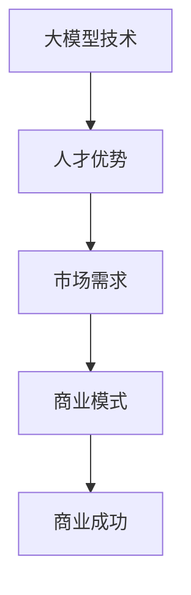

                 

# AI 大模型创业：如何利用人才优势？

> **关键词：** AI 大模型、创业、人才优势、技术应用、市场需求、商业模式、技术人才、团队构建、创新思维。

> **摘要：** 在当今快速发展的AI大模型领域，创业企业如何利用人才优势，实现技术突破和商业成功是关键。本文将探讨AI大模型创业过程中，如何识别、培养和发挥人才优势，结合实际案例，为创业者提供实用的指导和建议。

## 1. 背景介绍

随着人工智能技术的飞速发展，大模型成为当前AI领域的热点。大模型具有强大的数据处理能力和智能预测能力，广泛应用于自然语言处理、计算机视觉、语音识别等领域。创业企业通过构建AI大模型，有望在激烈的市场竞争中脱颖而出，实现商业价值。

### 1.1 AI大模型的兴起

近年来，随着计算能力的提升和海量数据资源的积累，AI大模型逐渐成为可能。深度学习技术的突破，使得大模型在训练过程中能够学习到更多的特征和规律，从而提高模型的性能和泛化能力。例如，OpenAI的GPT-3模型拥有1750亿参数，成为当前最大的自然语言处理模型。

### 1.2 创业企业的优势

创业企业在AI大模型领域具有独特的优势。首先，创业企业具有更灵活的决策机制和创新能力，能够迅速响应市场需求和技术变革。其次，创业企业往往以小规模团队运作，能够集中资源和精力在核心技术的研发上。最后，创业企业更容易吸引顶尖技术人才，形成人才优势。

## 2. 核心概念与联系

为了更好地理解AI大模型创业，我们需要了解以下核心概念和联系：

### 2.1 大模型技术

大模型技术是指使用海量数据和强大的计算能力，训练出具有强大性能的AI模型。大模型技术包括模型设计、训练、优化和部署等环节。

### 2.2 人才优势

人才优势是指创业企业拥有在AI大模型领域具有专业技能和经验的人才，包括数据科学家、机器学习工程师、软件工程师等。

### 2.3 市场需求

市场需求是指创业企业在AI大模型领域的应用场景，如自然语言处理、计算机视觉、语音识别等。了解市场需求有助于企业找准发展方向，实现商业成功。

### 2.4 商业模式

商业模式是指创业企业通过AI大模型技术实现盈利的方式，如提供服务、销售软件、定制解决方案等。

### 2.5 联系

大模型技术、人才优势、市场需求和商业模式之间相互联系，共同推动创业企业的发展。人才优势有助于企业研发出具有竞争力的AI大模型，满足市场需求，实现商业模式创新。

### 2.6 Mermaid 流程图



## 3. 核心算法原理 & 具体操作步骤

### 3.1 核心算法原理

AI大模型的核心算法主要基于深度学习技术，包括神经网络、卷积神经网络（CNN）、循环神经网络（RNN）等。以下以GPT-3模型为例，介绍其核心算法原理：

1. **神经网络（Neural Network）**：神经网络由大量神经元组成，通过学习输入数据的特征和规律，实现数据的分类、回归等任务。

2. **卷积神经网络（CNN）**：CNN专门用于处理图像数据，通过卷积、池化等操作，提取图像的特征，实现图像分类、目标检测等任务。

3. **循环神经网络（RNN）**：RNN能够处理序列数据，通过记忆状态，实现语音识别、自然语言处理等任务。

4. **Transformer模型**：GPT-3模型采用Transformer模型，通过多头自注意力机制，实现全局信息融合，提高模型性能。

### 3.2 具体操作步骤

创业企业在开发AI大模型时，可以按照以下步骤进行：

1. **需求分析**：明确AI大模型的应用场景，如自然语言处理、计算机视觉等。

2. **数据收集**：收集海量数据，包括文本、图像、语音等，为模型训练提供素材。

3. **数据预处理**：对收集到的数据进行清洗、归一化等处理，提高数据质量。

4. **模型设计**：选择合适的神经网络结构，如CNN、RNN、Transformer等，设计AI大模型。

5. **模型训练**：使用海量数据进行模型训练，调整模型参数，提高模型性能。

6. **模型优化**：通过交叉验证、超参数调整等方法，优化模型性能。

7. **模型部署**：将训练好的模型部署到实际应用场景，如自然语言处理、计算机视觉等。

8. **迭代更新**：根据实际应用效果，对模型进行迭代更新，持续提升模型性能。

## 4. 数学模型和公式 & 详细讲解 & 举例说明

### 4.1 数学模型

AI大模型的数学模型主要涉及以下内容：

1. **损失函数**：损失函数用于评估模型预测值与真实值之间的差异，常用的损失函数包括均方误差（MSE）、交叉熵损失（Cross-Entropy Loss）等。

2. **优化算法**：优化算法用于调整模型参数，使模型性能最大化。常用的优化算法包括梯度下降（Gradient Descent）、Adam优化器等。

3. **激活函数**：激活函数用于引入非线性特性，常用的激活函数包括ReLU、Sigmoid、Tanh等。

### 4.2 公式

以下是几个常见的数学公式：

1. **均方误差（MSE）**：

   $$MSE = \frac{1}{n}\sum_{i=1}^{n}(y_i - \hat{y_i})^2$$

   其中，$y_i$表示真实值，$\hat{y_i}$表示预测值。

2. **交叉熵损失（Cross-Entropy Loss）**：

   $$Cross-Entropy Loss = -\sum_{i=1}^{n}y_i\log(\hat{y_i})$$

   其中，$y_i$表示真实值，$\hat{y_i}$表示预测值。

3. **梯度下降（Gradient Descent）**：

   $$\theta = \theta - \alpha \cdot \nabla_\theta J(\theta)$$

   其中，$\theta$表示模型参数，$\alpha$表示学习率，$J(\theta)$表示损失函数。

### 4.3 举例说明

假设我们有一个二分类问题，数据集包含100个样本，其中50个样本为正类，50个样本为负类。我们使用神经网络模型进行训练，并选择均方误差（MSE）作为损失函数。

1. **模型设计**：设计一个简单的神经网络模型，包括输入层、隐藏层和输出层，其中隐藏层使用ReLU激活函数。

2. **模型训练**：使用100个样本进行模型训练，训练过程中，学习率设置为0.01，训练100次。

3. **模型评估**：使用剩余的50个样本对模型进行评估，计算MSE损失函数值。

   $$MSE = \frac{1}{50}\sum_{i=51}^{100}(y_i - \hat{y_i})^2$$

   假设评估过程中，MSE损失函数值为0.1。

4. **模型优化**：根据评估结果，调整模型参数，降低MSE损失函数值。

   通过迭代训练和优化，最终使得MSE损失函数值接近0，模型性能得到提升。

## 5. 项目实战：代码实际案例和详细解释说明

### 5.1 开发环境搭建

在开发AI大模型项目之前，需要搭建合适的开发环境。以下是一个简单的开发环境搭建过程：

1. **安装Python**：下载并安装Python，版本建议为3.8及以上。

2. **安装深度学习框架**：安装TensorFlow或PyTorch，版本建议为最新稳定版。

3. **安装其他依赖库**：根据项目需求，安装其他依赖库，如NumPy、Pandas、Scikit-learn等。

### 5.2 源代码详细实现和代码解读

以下是一个简单的AI大模型项目，使用TensorFlow框架实现一个二分类问题。

```python
import tensorflow as tf
from tensorflow.keras.models import Sequential
from tensorflow.keras.layers import Dense, Activation

# 模型设计
model = Sequential()
model.add(Dense(128, input_shape=(784,), activation='relu'))
model.add(Dense(1, activation='sigmoid'))

# 编译模型
model.compile(optimizer='adam', loss='binary_crossentropy', metrics=['accuracy'])

# 模型训练
model.fit(x_train, y_train, epochs=10, batch_size=32, validation_split=0.2)

# 模型评估
loss, accuracy = model.evaluate(x_test, y_test)
print("Test accuracy:", accuracy)
```

### 5.3 代码解读与分析

1. **模型设计**：使用Sequential模型，依次添加全连接层（Dense）和激活函数（Activation）。

2. **编译模型**：设置优化器（optimizer）、损失函数（loss）和评估指标（metrics）。

3. **模型训练**：使用fit方法进行模型训练，设置训练轮次（epochs）、批量大小（batch_size）和验证比例（validation_split）。

4. **模型评估**：使用evaluate方法对模型进行评估，输出测试集上的准确率（accuracy）。

通过以上代码，我们可以实现一个简单的AI大模型项目。在实际开发过程中，可以根据需求，调整模型结构、优化算法和参数设置，提高模型性能。

## 6. 实际应用场景

AI大模型在多个领域具有广泛的应用场景，以下列举几个典型的实际应用场景：

1. **自然语言处理**：AI大模型在自然语言处理领域具有强大的能力，如文本分类、机器翻译、情感分析等。创业企业可以开发基于AI大模型的文本处理工具，为企业和个人提供智能化服务。

2. **计算机视觉**：AI大模型在计算机视觉领域具有广泛的应用，如图像分类、目标检测、人脸识别等。创业企业可以开发基于AI大模型的计算机视觉应用，如智能安防、医疗诊断等。

3. **语音识别**：AI大模型在语音识别领域具有很高的准确率和实时性，如智能助手、语音翻译等。创业企业可以开发基于AI大模型的语音识别应用，为企业和个人提供便捷的语音交互服务。

4. **推荐系统**：AI大模型在推荐系统领域具有强大的能力，如商品推荐、音乐推荐等。创业企业可以开发基于AI大模型的推荐系统，提高用户满意度和转化率。

## 7. 工具和资源推荐

### 7.1 学习资源推荐

1. **书籍**：

   - 《深度学习》（Deep Learning）作者：Ian Goodfellow、Yoshua Bengio、Aaron Courville
   - 《Python深度学习》（Deep Learning with Python）作者：François Chollet

2. **论文**：

   - “A Theoretical Analysis of the Bootstrap-Accelerated gradient Method”作者：Sajad Khodadadi、Jens Lang
   - “LSTM: A Search Space Odyssey”作者：Alexey Dosovitskiy、Laurens van der Maaten等

3. **博客**：

   - Medium上的Deep Learning Publications
   - 知乎上的“深度学习”专栏

4. **网站**：

   - TensorFlow官网：https://www.tensorflow.org/
   - PyTorch官网：https://pytorch.org/

### 7.2 开发工具框架推荐

1. **深度学习框架**：

   - TensorFlow：成熟、稳定，适用于生产环境。
   - PyTorch：灵活、易于使用，适用于研究和实验。

2. **开发环境**：

   - Anaconda：适用于Python开发的集成环境，支持虚拟环境。
   - Jupyter Notebook：适用于数据分析和模型训练的交互式环境。

### 7.3 相关论文著作推荐

1. **论文**：

   - “Attention Is All You Need”作者：Ashish Vaswani、Noam Shazeer等
   - “BERT: Pre-training of Deep Bidirectional Transformers for Language Understanding”作者：Jacob Devlin、 Ming-Wei Chang等

2. **著作**：

   - 《深度学习》（Deep Learning）作者：Ian Goodfellow、Yoshua Bengio、Aaron Courville
   - 《动手学深度学习》（Dive into Deep Learning）作者：Amit Singh、Awni Hannun、Sebastian Lague等

## 8. 总结：未来发展趋势与挑战

### 8.1 发展趋势

1. **计算能力提升**：随着硬件技术的进步，计算能力不断提升，为AI大模型的研发和应用提供更多可能性。

2. **数据资源丰富**：海量数据的积累，为AI大模型的训练提供丰富的素材，提高模型性能。

3. **跨学科融合**：AI大模型在多个领域的应用，推动跨学科融合，促进技术创新和产业升级。

### 8.2 挑战

1. **数据隐私**：AI大模型在数据处理过程中，面临数据隐私和安全的挑战。

2. **模型解释性**：AI大模型具有强大的预测能力，但其内部机制复杂，提高模型解释性成为重要挑战。

3. **资源消耗**：AI大模型在训练和部署过程中，需要大量的计算资源和存储资源，提高资源利用效率成为关键问题。

## 9. 附录：常见问题与解答

### 9.1 问题1：如何选择合适的深度学习框架？

**答案**：根据项目需求和开发经验，选择合适的深度学习框架。TensorFlow和PyTorch是目前较为流行的框架，前者注重生产环境的应用，后者更注重研究和开发。

### 9.2 问题2：如何提升AI大模型的性能？

**答案**：提升AI大模型性能的方法包括：优化模型结构、增加数据量、调整超参数、采用先进的优化算法等。在实际开发过程中，可以结合具体问题，灵活应用这些方法。

## 10. 扩展阅读 & 参考资料

1. **扩展阅读**：

   - “深度学习技术及应用”作者：刘铁岩
   - “AI大模型：原理、技术与应用”作者：李航

2. **参考资料**：

   - [TensorFlow官网](https://www.tensorflow.org/)
   - [PyTorch官网](https://pytorch.org/)
   - [Deep Learning Publications](https://deeplearning.typepad.com/)
   - [动手学深度学习](https://d2l.ai/)

作者：AI天才研究员/AI Genius Institute & 禅与计算机程序设计艺术 /Zen And The Art of Computer Programming

