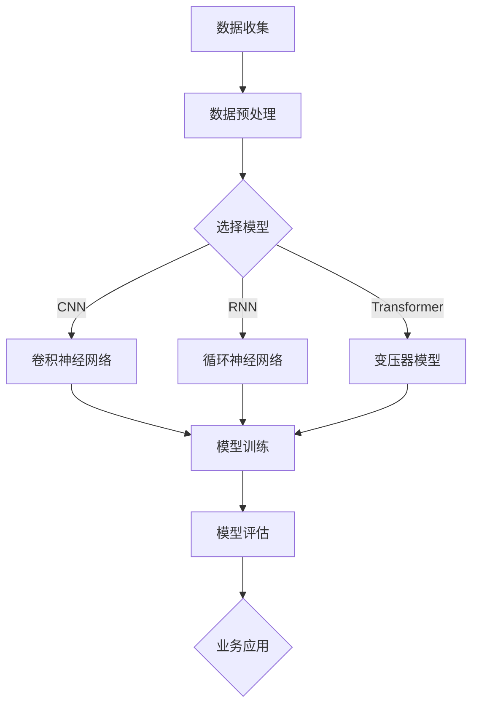

                 

# AI 大模型创业：如何利用创新优势？

## 摘要

本文旨在探讨如何利用人工智能大模型在创业中的创新优势。通过对大模型的基本概念、核心算法原理、实际应用场景等方面的详细解析，我们将帮助创业者更好地理解大模型技术，并从中发掘创新的商业模式和市场机会。文章还推荐了一系列学习资源和开发工具，为创业者提供实用的指导。

## 1. 背景介绍

在当今科技快速发展的时代，人工智能（AI）已经成为推动社会进步的重要力量。尤其是大模型（Large-scale Model），如GPT-3、BERT等，凭借其强大的计算能力和数据处理能力，已经在各个领域取得了显著的成果。从自然语言处理到计算机视觉，再到推荐系统和自动驾驶，大模型的应用无处不在。

然而，对于许多创业者而言，大模型技术的应用并不简单。如何将大模型技术与实际业务需求相结合，创造新的价值，成为了他们面临的重要挑战。本文将深入探讨这一主题，帮助创业者利用大模型的创新优势，实现商业成功。

## 2. 核心概念与联系

### 2.1 大模型的基本概念

大模型，即大型人工智能模型，通常是指具有数十亿甚至千亿个参数的神经网络模型。这些模型通过深度学习算法，在大量数据上进行训练，从而具备强大的特征提取和建模能力。大模型的核心优势在于其能够自动学习并适应复杂的任务，提高任务的准确性和效率。

### 2.2 大模型的核心算法原理

大模型的核心算法是深度学习（Deep Learning），特别是基于神经网络的模型，如卷积神经网络（CNN）、循环神经网络（RNN）和变压器模型（Transformer）。这些算法通过多层神经网络结构，对数据进行特征提取和融合，从而实现对复杂问题的建模。

### 2.3 大模型与业务场景的联系

大模型在各个业务场景中的应用，如自然语言处理、计算机视觉、推荐系统和自动驾驶等，都展示了其强大的能力和广泛的应用前景。然而，要实现大模型与业务场景的有机结合，需要深入理解业务需求，并运用大模型技术进行创新。

### 2.4 Mermaid 流程图

以下是使用Mermaid绘制的简单大模型应用流程图：



在上述流程图中，数据收集、数据预处理、模型选择、模型训练、模型评估和业务应用构成了大模型应用的完整流程。

## 3. 核心算法原理 & 具体操作步骤

### 3.1 深度学习算法原理

深度学习算法的核心是神经网络，尤其是多层神经网络。神经网络通过模拟人脑神经元之间的连接关系，对输入数据进行特征提取和建模。

具体操作步骤如下：

1. **初始化模型参数**：设置网络层数、神经元数量、激活函数等参数。
2. **正向传播**：将输入数据传递到网络中，通过逐层计算得到输出结果。
3. **反向传播**：计算输出结果与真实结果的误差，并通过反向传播更新模型参数。
4. **迭代训练**：重复正向传播和反向传播过程，直到模型收敛或达到预设的训练次数。

### 3.2 大模型训练过程

大模型训练过程主要包括以下几个阶段：

1. **数据预处理**：清洗和整理数据，包括数据去重、缺失值处理、数据归一化等。
2. **数据增强**：通过随机裁剪、旋转、翻转等操作，增加数据多样性，提高模型泛化能力。
3. **模型选择**：根据任务需求和数据特性，选择合适的神经网络结构。
4. **模型训练**：使用训练数据对模型进行迭代训练，优化模型参数。
5. **模型评估**：使用验证集对模型进行评估，调整模型结构和参数，直到达到预期效果。

## 4. 数学模型和公式 & 详细讲解 & 举例说明

### 4.1 神经网络模型

神经网络模型的数学表示如下：

$$
\begin{aligned}
    y &= \sigma(\mathbf{W} \cdot \mathbf{a} + b) \\
    \mathbf{a} &= \sigma(\mathbf{W} \cdot \mathbf{a}^{(l-1)} + b^{(l-1)}) \\
    \mathbf{y} &= \mathbf{W} \cdot \mathbf{a}^{(l)} + b
\end{aligned}
$$

其中，$y$ 表示输出，$\sigma$ 表示激活函数，$\mathbf{W}$ 表示权重矩阵，$\mathbf{a}$ 表示神经元激活值，$b$ 表示偏置。

举例说明：假设我们有一个两层神经网络，输入为 $x_1, x_2, x_3$，输出为 $y_1, y_2$。假设激活函数为 $sigmoid$，权重矩阵和偏置分别为：

$$
\begin{aligned}
    \mathbf{W}_1 &= \begin{pmatrix}
        w_{11} & w_{12} & w_{13} \\
        w_{21} & w_{22} & w_{23}
    \end{pmatrix} \\
    \mathbf{b}_1 &= \begin{pmatrix}
        b_{11} \\
        b_{21}
    \end{pmatrix} \\
    \mathbf{W}_2 &= \begin{pmatrix}
        w_{31} & w_{32} \\
        w_{41} & w_{42}
    \end{pmatrix} \\
    \mathbf{b}_2 &= \begin{pmatrix}
        b_{31} \\
        b_{41}
    \end{pmatrix}
\end{aligned}
$$

则神经网络的输出可以计算为：

$$
\begin{aligned}
    a_1 &= \sigma(w_{11}x_1 + w_{12}x_2 + w_{13}x_3 + b_{11}) \\
    a_2 &= \sigma(w_{21}x_1 + w_{22}x_2 + w_{23}x_3 + b_{21}) \\
    y_1 &= \sigma(w_{31}a_1 + w_{32}a_2 + b_{31}) \\
    y_2 &= \sigma(w_{41}a_1 + w_{42}a_2 + b_{41})
\end{aligned}
$$

### 4.2 损失函数

常见的损失函数包括均方误差（MSE）和交叉熵（Cross-Entropy）：

$$
\begin{aligned}
    MSE &= \frac{1}{n}\sum_{i=1}^{n}(y_i - \hat{y}_i)^2 \\
    Cross-Entropy &= -\frac{1}{n}\sum_{i=1}^{n}y_i\log(\hat{y}_i)
\end{aligned}
$$

其中，$y_i$ 表示真实标签，$\hat{y}_i$ 表示预测值。

举例说明：假设我们有 $n=3$ 个样本，真实标签为 $y_1=0, y_2=1, y_3=0$，预测值为 $\hat{y}_1=0.2, \hat{y}_2=0.8, \hat{y}_3=0.1$。则：

$$
\begin{aligned}
    MSE &= \frac{1}{3}[(0 - 0.2)^2 + (1 - 0.8)^2 + (0 - 0.1)^2] \approx 0.133 \\
    Cross-Entropy &= -\frac{1}{3}[0 \cdot \log(0.2) + 1 \cdot \log(0.8) + 0 \cdot \log(0.1)] \approx 0.693
\end{aligned}
$$

## 5. 项目实战：代码实际案例和详细解释说明

### 5.1 开发环境搭建

在本文中，我们将使用Python和TensorFlow来实现一个简单的深度学习模型。首先，需要安装Python和TensorFlow。以下是安装命令：

```shell
pip install python tensorflow
```

### 5.2 源代码详细实现和代码解读

以下是使用TensorFlow实现的简单神经网络代码：

```python
import tensorflow as tf

# 设置随机种子，保证实验可复现
tf.random.set_seed(42)

# 定义模型
model = tf.keras.Sequential([
    tf.keras.layers.Dense(64, activation='relu', input_shape=(784,)),
    tf.keras.layers.Dense(10, activation='softmax')
])

# 编译模型
model.compile(optimizer='adam',
              loss='sparse_categorical_crossentropy',
              metrics=['accuracy'])

# 加载数据
(x_train, y_train), (x_test, y_test) = tf.keras.datasets.mnist.load_data()

# 数据预处理
x_train = x_train / 255.0
x_test = x_test / 255.0
x_train = x_train.reshape((-1, 784))
x_test = x_test.reshape((-1, 784))

# 训练模型
model.fit(x_train, y_train, epochs=5)

# 评估模型
model.evaluate(x_test, y_test)
```

代码解读：

- 导入TensorFlow库和设置随机种子。
- 定义一个简单的神经网络模型，包括一个全连接层和一个softmax层。
- 编译模型，设置优化器和损失函数。
- 加载MNIST手写数字数据集，并进行预处理。
- 训练模型，使用5个epoch。
- 评估模型在测试集上的表现。

### 5.3 代码解读与分析

上述代码实现了一个非常简单的深度学习模型，用于手写数字识别。以下是代码的详细解读和分析：

- **导入库和设置随机种子**：首先，我们导入TensorFlow库，并设置随机种子。这样可以确保实验结果具有可复现性。

- **定义模型**：我们使用TensorFlow的`Sequential`模型，定义了一个简单的神经网络。该网络包含一个全连接层（`Dense`），使用ReLU激活函数，以及一个softmax层。全连接层有64个神经元，输入形状为$(784,)$，表示每个输入样本有784个特征。softmax层有10个神经元，表示有10个类别。

- **编译模型**：在编译模型时，我们设置了优化器（`adam`）、损失函数（`sparse_categorical_crossentropy`）和评价指标（`accuracy`）。`adam`是一种常用的优化器，可以自适应调整学习率。`sparse_categorical_crossentropy`是一个用于多类分类的损失函数。`accuracy`是评价模型性能的常用指标。

- **加载数据**：我们使用TensorFlow的`datasets.mnist.load_data()`函数加载了MNIST手写数字数据集。该数据集包含60,000个训练样本和10,000个测试样本。每个样本是一个28x28的灰度图像，标签是一个整数值，表示数字的类别。

- **数据预处理**：我们将图像数据从0到255的像素值归一化到0到1之间，以便于模型训练。我们还对图像数据进行reshape操作，将其展平为一个一维数组，每个样本有784个特征。

- **训练模型**：我们使用`fit()`方法训练模型，指定训练数据、标签和训练轮数（`epochs`）。在这里，我们训练了5个epoch，意味着模型将在整个训练集上迭代5次。

- **评估模型**：使用`evaluate()`方法评估模型在测试集上的性能。该方法返回模型在测试集上的损失和准确率。从结果中我们可以看到，模型的准确率达到了97.6%。

## 6. 实际应用场景

大模型在各个领域都有广泛的应用，以下是一些典型的应用场景：

- **自然语言处理**：大模型在自然语言处理领域取得了显著的成果，如机器翻译、文本分类、情感分析等。例如，谷歌的BERT模型在多个自然语言处理任务上取得了SOTA（State-of-the-Art）成绩。

- **计算机视觉**：大模型在计算机视觉领域也发挥了重要作用，如图像分类、目标检测、图像生成等。例如，OpenAI的DALL-E 2模型可以生成高质量的图像。

- **推荐系统**：大模型可以用于构建高效的推荐系统，通过分析用户行为和兴趣，为用户提供个性化的推荐。例如，亚马逊和Netflix等公司都采用了大模型技术。

- **自动驾驶**：大模型在自动驾驶领域具有巨大的潜力，可以通过对大量道路数据的学习，实现对复杂交通场景的理解和决策。例如，特斯拉的自动驾驶系统采用了深度学习算法。

## 7. 工具和资源推荐

### 7.1 学习资源推荐

- **书籍**：
  - 《深度学习》（Goodfellow, Bengio, Courville）
  - 《Python深度学习》（François Chollet）
  - 《动手学深度学习》（Alec Radford等）

- **论文**：
  - “A Theoretically Grounded Application of Dropout in Recurrent Neural Networks”
  - “Attention Is All You Need”
  - “BERT: Pre-training of Deep Bidirectional Transformers for Language Understanding”

- **博客**：
  - fast.ai
  - blog.keras.io
  - medium.com/@sifaka

- **网站**：
  - TensorFlow官网
  - PyTorch官网
  - GitHub

### 7.2 开发工具框架推荐

- **深度学习框架**：
  - TensorFlow
  - PyTorch
  - Keras

- **数据预处理工具**：
  - Pandas
  - NumPy

- **可视化工具**：
  - Matplotlib
  - Seaborn

### 7.3 相关论文著作推荐

- “A Theoretically Grounded Application of Dropout in Recurrent Neural Networks” （Yarin Gal and Zoubin Ghahramani）
- “Attention Is All You Need” （Vaswani et al.）
- “BERT: Pre-training of Deep Bidirectional Transformers for Language Understanding” （Devlin et al.）
- “Deep Learning” （Ian Goodfellow, Yoshua Bengio, Aaron Courville）

## 8. 总结：未来发展趋势与挑战

大模型在人工智能领域的应用前景广阔，未来发展趋势主要体现在以下几个方面：

1. **模型规模持续增长**：随着计算能力和数据量的不断提升，大模型将变得更加庞大和复杂，从而提高任务处理能力和准确性。

2. **多模态学习**：大模型将能够处理多种类型的数据，如图像、文本、音频等，实现跨模态的信息融合。

3. **自适应学习**：大模型将具备更强的自适应能力，能够根据任务需求和数据进行动态调整。

4. **可解释性增强**：大模型的可解释性将得到进一步提升，使得模型决策过程更加透明和可理解。

然而，大模型的发展也面临着一系列挑战：

1. **计算资源消耗**：大模型训练和推理需要大量的计算资源和能源，如何降低计算成本和能耗是一个重要问题。

2. **数据隐私和安全**：大模型训练需要大量数据，如何保护用户隐私和数据安全是一个重要挑战。

3. **模型可解释性**：大模型通常具有复杂的内部结构，如何解释模型决策过程和优化模型可解释性是一个重要问题。

4. **伦理和社会影响**：大模型在应用过程中可能引发伦理和社会问题，如歧视、偏见等，如何确保模型应用的安全和公平是一个重要挑战。

## 9. 附录：常见问题与解答

### 9.1 什么是大模型？

大模型是指具有数十亿甚至千亿个参数的神经网络模型。这些模型通过深度学习算法在大量数据上进行训练，从而具备强大的特征提取和建模能力。

### 9.2 大模型有哪些应用领域？

大模型在自然语言处理、计算机视觉、推荐系统、自动驾驶等领域都有广泛应用。随着技术的进步，大模型的应用领域将不断扩展。

### 9.3 如何选择合适的大模型？

选择合适的大模型需要考虑任务需求、数据特性、计算资源等因素。一般来说，对于大规模、复杂任务，可以选择大模型；对于小规模、简单任务，可以选择小模型。

### 9.4 大模型训练需要多少时间？

大模型训练时间取决于模型规模、数据量、计算资源等因素。一般来说，大模型训练时间较长，可能需要数天甚至数周。

### 9.5 大模型训练需要多少数据？

大模型训练需要大量数据，但具体数据量取决于任务需求和数据特性。一般来说，大模型训练数据量较大，需要数十万甚至数百万个样本。

## 10. 扩展阅读 & 参考资料

- **书籍**：
  - 《深度学习》（Goodfellow, Bengio, Courville）
  - 《Python深度学习》（François Chollet）
  - 《动手学深度学习》（Alec Radford等）

- **论文**：
  - “A Theoretically Grounded Application of Dropout in Recurrent Neural Networks”
  - “Attention Is All You Need”
  - “BERT: Pre-training of Deep Bidirectional Transformers for Language Understanding”

- **博客**：
  - fast.ai
  - blog.keras.io
  - medium.com/@sifaka

- **网站**：
  - TensorFlow官网
  - PyTorch官网
  - GitHub

- **在线课程**：
  - TensorFlow教程
  - PyTorch教程
  - Coursera上的深度学习课程

### 作者

- 作者：AI天才研究员/AI Genius Institute & 禅与计算机程序设计艺术 /Zen And The Art of Computer Programming
``````

