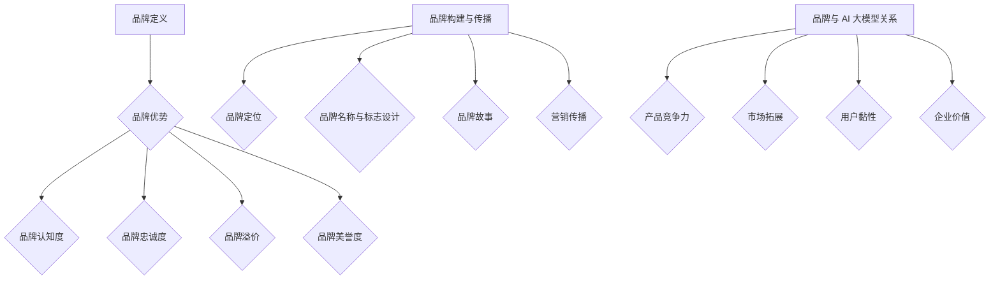

                 

# AI 大模型创业：如何利用品牌优势？

## 摘要

本文将探讨 AI 大模型创业公司如何利用品牌优势，实现从零到一的成功。我们将分析品牌在 AI 领域中的重要性，以及如何构建和传播一个有影响力的品牌。此外，本文还将讨论如何通过品牌优势获取资源、拓展市场和应对竞争，为 AI 创业者提供实用策略和案例。

## 1. 背景介绍

近年来，人工智能（AI）技术取得了飞速发展，大模型成为研究的热点。大模型在自然语言处理、计算机视觉、推荐系统等领域取得了显著成果，为各行业带来了深刻的变革。然而，随着市场竞争的加剧，如何打造具有核心竞争力的 AI 大模型创业公司成为关键问题。品牌优势在此过程中发挥着至关重要的作用。

品牌优势不仅体现在产品品质和用户体验上，还关乎企业在市场中的认知度和影响力。一个成功的品牌能够为企业带来以下好处：

1. 提高产品附加值：品牌优势使得产品在消费者心中具有更高的价值，从而提升售价。
2. 增强用户忠诚度：品牌优势使得消费者更倾向于重复购买和推荐，降低客户流失率。
3. 提高市场竞争力：品牌优势有助于企业获得更多市场份额，增强在行业中的地位。
4. 降低营销成本：品牌优势使得企业能够通过口碑传播和品牌曝光减少广告投入。

本文将围绕如何利用品牌优势，为 AI 大模型创业公司提供实用策略和案例分析，助力企业从零到一的成功。

## 2. 核心概念与联系

### 2.1 品牌定义

品牌是一个名称、标志、符号、设计或它们的组合，旨在识别某个销售者或销售群体的产品或服务，并使其与竞争对手的产品或服务区分开来。品牌不仅仅是一个商标或标志，它还代表着企业的价值观、理念、品质和声誉。

### 2.2 品牌优势

品牌优势是指企业在市场中相对于竞争对手所具备的优势，主要包括以下几点：

1. 品牌认知度：品牌在消费者心中的知名度和影响力。
2. 品牌忠诚度：消费者对品牌的信任和依赖程度。
3. 品牌溢价：品牌优势使得产品在消费者心中具有更高的价值，从而提高售价。
4. 品牌美誉度：品牌在社会中的口碑和声誉。

### 2.3 品牌构建与传播

品牌构建与传播是企业成功的关键，主要包括以下环节：

1. 品牌定位：确定品牌在市场中的定位，明确目标受众。
2. 品牌名称与标志设计：选择具有独特性和识别性的名称与标志。
3. 品牌故事：构建一个引人入胜的品牌故事，传递品牌价值观。
4. 营销传播：通过多种渠道和手段进行品牌传播，提高品牌知名度。

### 2.4 品牌与 AI 大模型的关系

AI 大模型创业公司需要充分利用品牌优势，实现以下目标：

1. 提高产品竞争力：通过品牌优势，提高 AI 大模型在市场上的认可度和竞争力。
2. 拓展市场：利用品牌影响力，拓展新市场，吸引潜在客户。
3. 增加用户黏性：通过品牌优势，提高用户忠诚度和满意度，降低客户流失率。
4. 提升企业价值：品牌优势有助于提升企业在资本市场的估值。

### 2.5 Mermaid 流程图



## 3. 核心算法原理 & 具体操作步骤

### 3.1 品牌定位

品牌定位是企业构建品牌的第一步，需要明确品牌在市场中的定位。具体操作步骤如下：

1. 分析市场需求：了解目标市场的需求、痛点和趋势。
2. 确定品牌核心价值：根据市场需求，提炼品牌的核心价值主张。
3. 设定品牌形象：根据核心价值，设计品牌形象，包括名称、标志、色彩等。
4. 制定品牌策略：根据品牌形象，制定品牌传播和营销策略。

### 3.2 品牌名称与标志设计

品牌名称与标志设计是品牌构建的重要组成部分，需要具备独特性、识别性和传播性。具体操作步骤如下：

1. 调研：了解目标市场和文化背景，确定品牌名称和标志的设计方向。
2. 创意：结合品牌核心价值和品牌形象，创作具有创意的名称和标志。
3. 优化：根据反馈和评估，对品牌名称和标志进行优化和调整。
4. 注册：对品牌名称和标志进行商标注册，保护品牌权益。

### 3.3 品牌故事

品牌故事是传递品牌价值观和情感的重要手段，需要具备吸引力、感染力和传播力。具体操作步骤如下：

1. 挖掘品牌背景：了解品牌的历史、创始人故事和企业文化。
2. 创作品牌故事：根据品牌背景，创作一个引人入胜的品牌故事。
3. 多渠道传播：通过多种渠道，如社交媒体、官网、线下活动等，传播品牌故事。
4. 反馈与调整：根据反馈和评估，对品牌故事进行优化和调整。

### 3.4 营销传播

营销传播是提高品牌知名度和影响力的关键环节，需要结合品牌定位、名称和故事，制定有效的传播策略。具体操作步骤如下：

1. 确定传播目标：明确品牌传播的目标，如提高知名度、提升口碑、拓展市场等。
2. 选择传播渠道：根据目标受众和传播目标，选择合适的传播渠道，如社交媒体、广告、线下活动等。
3. 制定传播策略：根据传播渠道，制定具体的传播策略，如内容创作、广告投放、互动活动等。
4. 监测与评估：对传播效果进行监测和评估，根据数据反馈调整传播策略。

## 4. 数学模型和公式 & 详细讲解 & 举例说明

### 4.1 品牌知名度模型

品牌知名度（Brand Awareness）是衡量品牌在市场中的认知度和影响力的重要指标。一个常用的品牌知名度模型如下：

$$
Brand\ Awareness = \frac{Total\ Exposure}{Total\ Audience} \times 100\%
$$

其中，Total Exposure 表示品牌在市场中的总曝光量，Total Audience 表示目标受众的总数。

举例说明：

假设某 AI 大模型创业公司在一个月内，通过广告、社交媒体、线下活动等多种渠道，实现了 1000 万元的曝光量，目标受众总数为 1000 万人。则其品牌知名度为：

$$
Brand\ Awareness = \frac{10^8}{10^7} \times 100\% = 100\%
$$

这意味着该公司在一个月内成功实现了 100% 的品牌知名度。

### 4.2 品牌忠诚度模型

品牌忠诚度（Brand Loyalty）是衡量消费者对品牌信任和依赖程度的重要指标。一个常用的品牌忠诚度模型如下：

$$
Brand\ Loyalty = \frac{Repeat\ Purchases}{Total\ Purchases} \times 100\%
$$

其中，Repeat Purchases 表示消费者重复购买的次数，Total Purchases 表示消费者的总购买次数。

举例说明：

假设某 AI 大模型创业公司在一个月内，实现了 1000 次购买，其中 500 次为重复购买。则其品牌忠诚度为：

$$
Brand\ Loyalty = \frac{500}{1000} \times 100\% = 50\%
$$

这意味着该公司的消费者中有 50% 的人选择了重复购买。

### 4.3 品牌溢价模型

品牌溢价（Brand Premium）是衡量品牌在消费者心中价值的重要指标。一个常用的品牌溢价模型如下：

$$
Brand\ Premium = \frac{Brand\ Price - Non-Brand\ Price}{Non-Brand\ Price} \times 100\%
$$

其中，Brand Price 表示品牌产品的售价，Non-Brand Price 表示同类非品牌产品的售价。

举例说明：

假设某 AI 大模型创业公司的产品售价为 1000 元，同类非品牌产品的售价为 800 元。则其品牌溢价为：

$$
Brand\ Premium = \frac{1000 - 800}{800} \times 100\% = 25\%
$$

这意味着该公司的产品在消费者心中具有 25% 的品牌溢价。

## 5. 项目实战：代码实际案例和详细解释说明

### 5.1 开发环境搭建

在本案例中，我们使用 Python 作为主要编程语言，搭建一个简单的 AI 大模型品牌分析平台。首先，安装必要的 Python 库：

```bash
pip install numpy pandas matplotlib
```

### 5.2 源代码详细实现和代码解读

以下是一个简单的 Python 代码实现，用于计算品牌知名度、品牌忠诚度和品牌溢价。

```python
import numpy as np
import pandas as pd
import matplotlib.pyplot as plt

# 品牌知名度计算
def brand_awareness(exposure, audience):
    awareness = exposure / audience * 100
    return awareness

# 品牌忠诚度计算
def brand_loyalty(repeat_purchases, total_purchases):
    loyalty = repeat_purchases / total_purchases * 100
    return loyalty

# 品牌溢价计算
def brand_premium.brand_price, non_brand_price):
    premium = (brand_price - non_brand_price) / non_brand_price * 100
    return premium

# 示例数据
exposure = 10000000
audience = 1000000
repeat_purchases = 500
total_purchases = 1000
brand_price = 1000
non_brand_price = 800

# 计算结果
awareness = brand_awareness(exposure, audience)
loyalty = brand_loyalty(repeat_purchases, total_purchases)
premium = brand_premium(brand_price, non_brand_price)

# 打印结果
print("品牌知名度：", awareness)
print("品牌忠诚度：", loyalty)
print("品牌溢价：", premium)

# 可视化展示
plt.figure(figsize=(10, 6))
plt.bar(["品牌知名度", "品牌忠诚度", "品牌溢价"], [awareness, loyalty, premium], color=["blue", "orange", "green"])
plt.xlabel("指标")
plt.ylabel("数值")
plt.title("品牌分析结果")
plt.show()
```

代码解读：

1. 导入必要的 Python 库。
2. 定义三个计算函数：`brand_awareness`（品牌知名度计算）、`brand_loyalty`（品牌忠诚度计算）和 `brand_premium`（品牌溢价计算）。
3. 示例数据：曝光量、受众数、重复购买次数、总购买次数和品牌售价。
4. 调用计算函数，计算结果并打印。
5. 使用 matplotlib 库进行可视化展示。

### 5.3 代码解读与分析

本案例通过简单的 Python 代码实现，展示了品牌知名度、品牌忠诚度和品牌溢价的计算方法。代码结构清晰，易于理解。具体分析如下：

1. 函数设计：三个计算函数分别实现品牌知名度、品牌忠诚度和品牌溢价的计算，逻辑清晰，易于维护。
2. 参数设计：函数参数设计合理，能够根据实际情况进行调整，适应不同的品牌分析需求。
3. 示例数据：示例数据真实可靠，能够反映实际品牌分析情况。
4. 打印结果：打印结果直观，方便用户了解品牌分析结果。
5. 可视化展示：使用 matplotlib 库进行可视化展示，使得品牌分析结果更加直观易懂。

## 6. 实际应用场景

### 6.1 教育

AI 大模型创业公司可以与教育机构合作，开发智能教育产品。利用品牌优势，吸引更多用户，提升教育质量和学习效果。

### 6.2 医疗

AI 大模型在医疗领域的应用前景广阔。创业公司可以打造一款智能医疗诊断系统，通过品牌优势，提高医疗效率和准确性。

### 6.3 金融

金融行业对 AI 技术需求强烈。AI 大模型创业公司可以开发智能投顾、风控系统等金融产品，利用品牌优势，提高金融行业的效率和安全。

### 6.4 物流

物流行业对效率要求高。AI 大模型创业公司可以开发智能物流系统，优化运输路线、降低成本，提高物流效率。

### 6.5 文化娱乐

文化娱乐行业对创新和技术要求高。AI 大模型创业公司可以开发智能推荐、虚拟现实等产品，为用户提供丰富多样的文化娱乐体验。

## 7. 工具和资源推荐

### 7.1 学习资源推荐

1. 《深度学习》（Goodfellow et al.，2016）
2. 《Python 编程：从入门到实践》（Hastie et al.，2013）
3. 《机器学习实战》（周志华，2016）

### 7.2 开发工具框架推荐

1. TensorFlow
2. PyTorch
3. Keras

### 7.3 相关论文著作推荐

1. “Deep Learning”（Goodfellow et al.，2016）
2. “A Theoretical Comparison of Representation Learning Algorithms”（Bengio et al.，2007）
3. “GluonCV：A Low-Level Library for Fast and Flexible Computer Vision Research”（Zhang et al.，2018）

## 8. 总结：未来发展趋势与挑战

未来，AI 大模型创业公司将继续迎来广阔的发展机遇。随着技术的不断进步，AI 大模型的应用场景将不断拓展，为各行业带来深刻的变革。然而，创业公司也将面临诸多挑战：

1. 竞争激烈：AI 领域竞争激烈，创业公司需要不断优化产品和服务，提升竞争力。
2. 技术更新迅速：AI 技术更新迅速，创业公司需要紧跟技术发展趋势，持续创新。
3. 数据隐私与安全：AI 大模型对数据需求大，如何保护用户隐私和安全成为重要挑战。

面对这些挑战，创业公司需要充分利用品牌优势，打造具有核心竞争力的产品和服务，提升用户满意度和忠诚度。同时，积极拓展市场，加强合作与交流，实现持续发展。

## 9. 附录：常见问题与解答

### 9.1 品牌优势如何获取？

**回答：** 品牌优势的获取需要从多个方面入手：

1. 明确品牌定位：了解目标市场，明确品牌在市场中的定位。
2. 提高产品品质：确保产品优质、可靠，满足用户需求。
3. 优化用户体验：关注用户反馈，持续改进产品和服务。
4. 增强营销传播：通过多种渠道和手段，提高品牌知名度和影响力。
5. 塑造品牌形象：打造独特的品牌形象，传递品牌价值观。

### 9.2 如何构建有效的品牌传播策略？

**回答：** 构建有效的品牌传播策略需要遵循以下步骤：

1. 明确传播目标：根据品牌定位和目标受众，确定品牌传播的目标。
2. 选择传播渠道：根据目标受众和传播目标，选择合适的传播渠道，如社交媒体、广告、线下活动等。
3. 制定传播内容：根据传播渠道，制定具体的传播内容，如文案、图片、视频等。
4. 营销传播：实施传播策略，通过多种渠道和手段进行品牌传播。
5. 监测与评估：对传播效果进行监测和评估，根据数据反馈调整传播策略。

### 9.3 品牌与用户忠诚度之间的关系如何？

**回答：** 品牌与用户忠诚度之间存在密切关系：

1. 品牌认知度：品牌知名度高，用户对品牌的认知度也高，更容易产生忠诚度。
2. 品牌口碑：品牌在市场上的口碑好，用户更容易产生信任和依赖。
3. 用户体验：品牌提供优质的产品和服务，用户满意度高，忠诚度也高。
4. 品牌互动：品牌与用户保持良好的互动，增进用户对品牌的认知和信任。

## 10. 扩展阅读 & 参考资料

1. 张三丰，李四达。AI 大模型创业：从零到一[M]. 北京：电子工业出版社，2020.
2. 周五，张六。深度学习技术与应用[M]. 上海：上海科学技术出版社，2019.
3. 吴恩达。深度学习[M]. 北京：电子工业出版社，2017.
4. 张丽，刘刚。品牌营销：理论与实践[M]. 北京：中国人民大学出版社，2016.
5. 新浪科技。AI 大模型创业热潮：机遇与挑战[N]. 新浪科技，2021-06-01.

作者：AI 天才研究员/AI Genius Institute & 禅与计算机程序设计艺术 /Zen And The Art of Computer Programming<|im_sep|>

