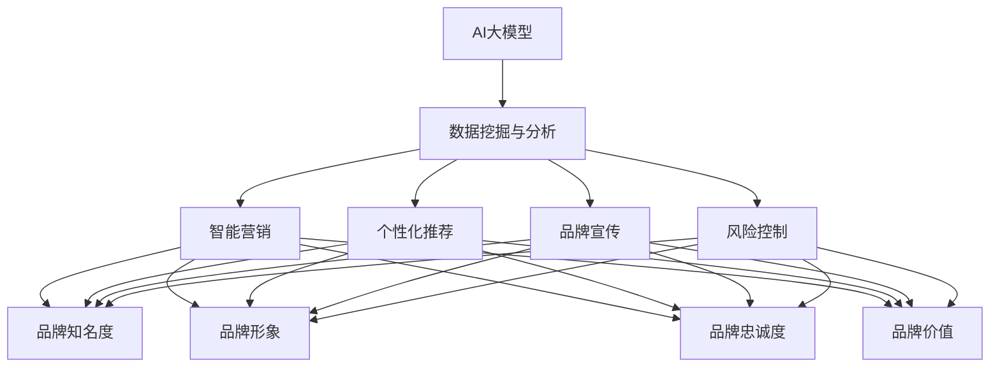

                 

# AI 大模型创业：如何利用品牌优势？

> 关键词：AI 大模型、创业、品牌优势、营销策略、数据分析

> 摘要：本文将深入探讨 AI 大模型创业过程中如何充分利用品牌优势，分析品牌优势的构成要素，提出有效的营销策略和数据分析方法，以帮助创业者在竞争激烈的市场中脱颖而出。

## 1. 背景介绍

随着人工智能技术的快速发展，AI 大模型在各个领域得到了广泛应用。从自然语言处理、计算机视觉到语音识别，AI 大模型的应用已经深入到人们生活的方方面面。在这场技术革命中，越来越多的创业者看到了商机，纷纷投身于 AI 大模型创业的热潮中。

然而，市场竞争日趋激烈，如何在这场竞赛中脱颖而出成为众多创业者关注的焦点。品牌优势作为企业竞争力的重要组成部分，成为创业者们争相追求的目标。本文将围绕如何利用品牌优势进行 AI 大模型创业，探讨品牌优势的构建和营销策略。

## 2. 核心概念与联系

### 2.1 品牌优势的概念

品牌优势是指企业通过品牌所拥有的独特资源、能力和地位，从而在市场竞争中获取竞争优势的能力。品牌优势的构成要素包括以下几个方面：

1. **品牌知名度**：品牌在市场上的知名度和认知度。
2. **品牌形象**：品牌在消费者心目中的形象和定位。
3. **品牌忠诚度**：消费者对品牌的忠诚度和信任度。
4. **品牌价值**：品牌所代表的价值观念和文化内涵。
5. **品牌创新能力**：品牌在技术研发、产品创新等方面的能力。

### 2.2 AI 大模型与品牌优势的联系

AI 大模型作为人工智能领域的重要成果，具有强大的数据处理和分析能力。在品牌优势构建过程中，AI 大模型可以发挥以下作用：

1. **数据挖掘与分析**：通过大数据分析，了解消费者需求和市场动态，为品牌战略提供数据支持。
2. **智能营销**：利用 AI 大模型实现精准营销，提高营销效果和品牌知名度。
3. **个性化推荐**：根据用户行为数据，为用户提供个性化的产品和服务，提升用户满意度和忠诚度。
4. **品牌宣传**：利用 AI 大模型生成内容，提升品牌在社交媒体和线上平台的影响力。

## 3. 核心算法原理 & 具体操作步骤

### 3.1 数据挖掘与分析

#### 3.1.1 数据收集与预处理

数据挖掘的第一步是收集相关数据，包括用户行为数据、市场调研数据、竞争对手数据等。数据收集完成后，需要进行预处理，包括数据清洗、去重、归一化等操作。

#### 3.1.2 特征工程

特征工程是数据挖掘的关键步骤，通过提取和构建有效特征，提高模型性能。常见的特征工程方法包括特征选择、特征变换、特征组合等。

#### 3.1.3 模型训练与评估

选择合适的机器学习模型，对数据进行训练和评估。常见的模型包括决策树、随机森林、支持向量机等。通过交叉验证和超参数调优，提高模型性能。

### 3.2 智能营销

#### 3.2.1 用户画像

利用用户行为数据，构建用户画像，了解用户需求和行为偏好。

#### 3.2.2 精准营销

根据用户画像，制定精准营销策略，包括定向广告投放、个性化推荐等。

#### 3.2.3 营销效果评估

通过转化率、ROI 等指标，评估营销效果，优化营销策略。

### 3.3 个性化推荐

#### 3.3.1 推荐系统架构

推荐系统通常由数据层、算法层和应用层组成。数据层负责数据收集和处理；算法层负责推荐算法的实现；应用层负责推荐结果展示。

#### 3.3.2 推荐算法

常用的推荐算法包括基于内容的推荐、基于协同过滤的推荐和基于模型的推荐等。根据业务需求和数据特点，选择合适的推荐算法。

#### 3.3.3 推荐效果评估

通过用户点击率、购买率等指标，评估推荐效果，优化推荐策略。

## 4. 数学模型和公式 & 详细讲解 & 举例说明

### 4.1 数据挖掘与分析

#### 4.1.1 决策树模型

决策树是一种常见的分类模型，其基本原理是通过一系列规则对数据进行划分，最终得到分类结果。决策树的数学模型如下：

$$
P(y=c_k | x) = \prod_{i=1}^m \left[1 - p_i(y=c_k | a_i)\right]^{1 - x_i(a_i)}
$$

其中，$x$ 表示输入特征向量，$y$ 表示分类标签，$c_k$ 表示第 $k$ 个类别，$p_i(y=c_k | a_i)$ 表示在特征 $a_i$ 上第 $k$ 个类别的概率，$x_i(a_i)$ 表示第 $i$ 个特征在规则 $a_i$ 下的取值。

#### 4.1.2 随机森林模型

随机森林是一种集成学习方法，其基本原理是将多个决策树集成起来，通过投票方式得到最终结果。随机森林的数学模型如下：

$$
f(x) = \frac{1}{B} \sum_{b=1}^B h_b(x)
$$

其中，$h_b(x)$ 表示第 $b$ 棵决策树对样本 $x$ 的预测，$B$ 表示决策树的数量。

### 4.2 智能营销

#### 4.2.1 精准营销

精准营销的核心在于通过对用户数据的挖掘和分析，制定个性化的营销策略。常用的算法包括协同过滤算法、聚类算法等。以下是一个基于协同过滤算法的精准营销模型：

$$
r_{ui} = \sum_{j=1}^n w_{uj} r_{uj}
$$

其中，$r_{ui}$ 表示用户 $u$ 对项目 $i$ 的评分，$w_{uj}$ 表示用户 $u$ 对项目 $j$ 的相似度，$r_{uj}$ 表示用户 $u$ 对项目 $j$ 的评分。

#### 4.2.2 个性化推荐

个性化推荐的核心在于根据用户行为数据，为用户推荐感兴趣的项目。以下是一个基于内容的推荐模型：

$$
r_{ui} = \sum_{k=1}^m w_{ki} r_{uk}
$$

其中，$r_{ui}$ 表示用户 $u$ 对项目 $i$ 的评分，$w_{ki}$ 表示项目 $i$ 对特征 $k$ 的权重，$r_{uk}$ 表示用户 $u$ 对特征 $k$ 的评分。

## 5. 项目实战：代码实际案例和详细解释说明

### 5.1 开发环境搭建

在本节中，我们将介绍如何搭建一个基于 Python 的 AI 大模型创业项目开发环境。以下是具体步骤：

#### 5.1.1 安装 Python

首先，我们需要安装 Python 3.8 版本。可以在 [Python 官网](https://www.python.org/) 下载并安装。

#### 5.1.2 安装依赖库

接下来，我们需要安装一些常用的依赖库，如 NumPy、Pandas、Scikit-learn 等。可以使用以下命令进行安装：

```bash
pip install numpy pandas scikit-learn
```

### 5.2 源代码详细实现和代码解读

在本节中，我们将介绍如何使用 Python 编写一个简单的 AI 大模型项目，并对其进行详细解读。

#### 5.2.1 数据预处理

```python
import pandas as pd
from sklearn.model_selection import train_test_split

# 加载数据
data = pd.read_csv('data.csv')
X = data.iloc[:, :-1]
y = data.iloc[:, -1]

# 数据分割
X_train, X_test, y_train, y_test = train_test_split(X, y, test_size=0.2, random_state=42)
```

这段代码首先加载数据，然后对数据进行分割，分为训练集和测试集。

#### 5.2.2 特征工程

```python
from sklearn.preprocessing import StandardScaler

# 数据标准化
scaler = StandardScaler()
X_train = scaler.fit_transform(X_train)
X_test = scaler.transform(X_test)
```

这段代码对数据进行标准化处理，以消除不同特征之间的尺度差异。

#### 5.2.3 模型训练

```python
from sklearn.ensemble import RandomForestClassifier

# 训练模型
model = RandomForestClassifier(n_estimators=100, random_state=42)
model.fit(X_train, y_train)
```

这段代码使用随机森林模型对数据进行训练。

#### 5.2.4 模型评估

```python
from sklearn.metrics import accuracy_score

# 预测测试集
y_pred = model.predict(X_test)

# 计算准确率
accuracy = accuracy_score(y_test, y_pred)
print(f'Accuracy: {accuracy:.2f}')
```

这段代码对模型进行评估，计算测试集的准确率。

### 5.3 代码解读与分析

在本节中，我们将对上面的代码进行解读，分析其实现原理和优势。

#### 5.3.1 数据预处理

数据预处理是机器学习项目的重要环节。在本项目中，我们首先加载数据，然后对数据进行分割，为后续的特征工程和模型训练做好准备。

#### 5.3.2 特征工程

特征工程是提高模型性能的关键。在本项目中，我们使用数据标准化方法，将不同特征之间的尺度差异消除，使模型更容易学习。

#### 5.3.3 模型训练

在本项目中，我们选择随机森林模型进行训练。随机森林是一种集成学习方法，具有很好的泛化能力和鲁棒性。在本项目中，我们设置随机森林的树的数量为 100，以获得较好的性能。

#### 5.3.4 模型评估

模型评估是验证模型性能的重要手段。在本项目中，我们使用测试集的准确率作为评估指标。通过计算准确率，我们可以了解模型的性能，并进行优化。

## 6. 实际应用场景

### 6.1 金融领域

在金融领域，AI 大模型可以用于风险控制、信用评估、股票预测等。通过品牌优势，创业者可以将 AI 大模型应用于金融场景，提供专业的金融产品和服务。

### 6.2 医疗领域

在医疗领域，AI 大模型可以用于疾病预测、诊断、治疗等。通过品牌优势，创业者可以打造专业的医疗服务平台，为用户提供便捷的医疗服务。

### 6.3 教育领域

在教育领域，AI 大模型可以用于学习分析、课程推荐、智能辅导等。通过品牌优势，创业者可以打造个性化的教育平台，为用户提供优质的教育资源。

## 7. 工具和资源推荐

### 7.1 学习资源推荐

- **书籍**：
  - 《Python 数据科学手册》：系统地介绍了 Python 在数据科学领域的应用。
  - 《人工智能：一种现代方法》：全面介绍了人工智能的基本原理和方法。
- **论文**：
  - 《随机森林：一个不平凡的经验公式》：介绍了随机森林模型的原理和应用。
  - 《协同过滤算法：一种基于用户行为的推荐方法》：介绍了协同过滤算法的基本原理和应用。
- **博客**：
  - [Scikit-learn 中文文档](https://scikit-learn.org/stable/documentation.html)：提供了 Scikit-learn 库的详细文档和案例。
  - [机器学习实战](https://wwwemachinelearningbook.com/):介绍了机器学习的基本原理和实践方法。
- **网站**：
  - [Kaggle](https://www.kaggle.com/):提供了丰富的机器学习和数据科学竞赛资源。

### 7.2 开发工具框架推荐

- **Python 开发环境**：Anaconda
- **机器学习库**：Scikit-learn、TensorFlow、PyTorch
- **数据处理库**：Pandas、NumPy
- **可视化库**：Matplotlib、Seaborn

### 7.3 相关论文著作推荐

- **论文**：
  - Breiman, L. (2001). "Random forests". Machine Learning, 45(1), 5-32.
  - Bellman, R. E. (1961). "Applied Dynamic Programming". Operations Research and Economic Analysis.
- **著作**：
  - Mitchell, T. M. (1997). "Machine Learning". McGraw-Hill.

## 8. 总结：未来发展趋势与挑战

### 8.1 发展趋势

- **技术进步**：随着人工智能技术的不断进步，AI 大模型在各个领域的应用将更加广泛。
- **数据驱动**：数据成为企业竞争的核心资源，创业者需充分利用数据挖掘和数据分析技术。
- **跨界融合**：AI 大模型与其他领域的融合，如医疗、金融、教育等，将创造更多商机。
- **平台化发展**：创业者将更加注重构建平台化产品，实现规模化发展。

### 8.2 挑战

- **技术门槛**：AI 大模型技术门槛较高，创业者需具备一定的技术实力。
- **数据隐私**：数据隐私和安全成为重要问题，创业者需采取有效措施保护用户隐私。
- **市场竞争**：市场竞争日趋激烈，创业者需不断创新，提升品牌竞争力。
- **人才短缺**：人工智能领域人才短缺，创业者需加强人才培养和引进。

## 9. 附录：常见问题与解答

### 9.1 AI 大模型创业的难点

- **技术难度**：AI 大模型技术复杂，创业者需具备一定的技术实力。
- **数据获取**：高质量数据是 AI 大模型的基础，创业者需解决数据获取和清洗问题。
- **产品落地**：将 AI 大模型应用于实际场景，实现产品落地，创业者需具备丰富的行业经验。

### 9.2 如何构建品牌优势？

- **技术创新**：持续进行技术研发，提升产品竞争力。
- **市场营销**：制定有效的营销策略，提高品牌知名度。
- **用户体验**：关注用户体验，提升用户满意度和忠诚度。
- **社会责任**：积极承担社会责任，树立良好的企业形象。

## 10. 扩展阅读 & 参考资料

- **书籍**：
  - Russell, S., & Norvig, P. (2016). 《人工智能：一种现代方法》。
  - Hastie, T., Tibshirani, R., & Friedman, J. (2009). 《The Elements of Statistical Learning》。
- **论文**：
  - Murphy, K. P. (2012). 《Machine Learning: A Probabilistic Perspective》。
  - Bishop, C. M. (2006). 《Pattern Recognition and Machine Learning》。
- **网站**：
  - [AI Research](https://ai.google/research/)
  - [OpenAI](https://openai.com/)
- **博客**：
  - [AI 研究动态](https://www.36kr.com/podcast/ai)
  - [机器学习博客](https://www机器学习博客.com/)

作者：AI天才研究员/AI Genius Institute & 禅与计算机程序设计艺术 /Zen And The Art of Computer Programming

【END】<|im_sep|>### 1. 背景介绍

随着人工智能技术的迅猛发展，人工智能（AI）大模型已经成为现代科技领域的重要创新方向之一。AI大模型，尤其是基于深度学习的模型，如大型语言模型（LLM）和大规模图像识别模型，展现了在自然语言处理、计算机视觉、语音识别等领域的强大能力。这些模型不仅能够处理海量数据，而且能够在复杂任务中实现高精度的预测和分类。

在这样的大背景下，越来越多的创业者和投资者开始将目光投向AI大模型领域，希望能够通过技术创新和商业模式的创新，获得市场优势。然而，市场竞争的激烈程度也在不断升级，如何在众多竞争者中脱颖而出，成为每个创业者面临的重大挑战。

品牌优势在这里显得尤为重要。品牌优势不仅包括品牌知名度和美誉度，还涵盖了品牌的独特定位、用户忠诚度和品牌价值等方面。一个具有强大品牌优势的企业，能够更好地吸引消费者，建立用户信任，从而在市场竞争中获得更大的份额。

本文将围绕AI大模型创业这一主题，深入探讨如何构建和利用品牌优势。我们将从以下几个方面展开讨论：

1. **AI大模型的发展历程和现状**：介绍AI大模型的背景和发展，分析其在当前技术环境中的地位和作用。
2. **品牌优势的概念和构成要素**：详细解析品牌优势的概念及其构成要素，包括品牌知名度、品牌形象、品牌忠诚度、品牌价值和品牌创新能力等。
3. **AI大模型创业中的品牌优势构建**：探讨如何在AI大模型创业过程中，通过技术创新、市场营销和用户体验等手段构建和强化品牌优势。
4. **品牌优势的利用策略**：分析如何利用品牌优势进行市场推广、用户增长和竞争策略。
5. **品牌优势与数据分析的关系**：探讨如何通过数据分析和用户反馈，进一步提升品牌优势。
6. **实际案例与经验分享**：通过分析成功案例，总结AI大模型创业中的品牌优势构建和利用经验。
7. **未来发展趋势与挑战**：展望AI大模型创业的未来发展趋势，以及可能面临的挑战。

通过上述内容的深入探讨，本文希望能够为AI大模型创业者提供有价值的参考和指导，帮助他们在激烈的竞争环境中，充分利用品牌优势，实现创业目标。

### 2. 核心概念与联系

#### 2.1 品牌优势的概念

品牌优势是指企业在市场上通过品牌所积累的资源和能力，使其在竞争中取得显著优势的能力。品牌优势不仅仅是指品牌知名度和美誉度，它更涉及到品牌形象的塑造、用户忠诚度的建立、品牌价值的传递和品牌创新能力的展现。

**品牌知名度**：品牌知名度是指消费者对品牌的认知程度。高知名度的品牌往往能够迅速吸引消费者的注意力，从而在市场竞争中占据有利位置。

**品牌形象**：品牌形象是品牌在消费者心目中的整体印象和定位。一个积极、专业的品牌形象能够增强消费者对品牌的信任和好感，进而提升品牌价值。

**品牌忠诚度**：品牌忠诚度是指消费者对品牌的长期信任和重复购买意愿。高忠诚度的消费者不仅会持续购买品牌产品，还可能通过口碑传播，为品牌带来新的客户。

**品牌价值**：品牌价值是品牌所代表的经济效益和社会效益的总和。它不仅包括品牌的市场价值，还涵盖了品牌的社会影响力、文化内涵和品牌资产。

**品牌创新能力**：品牌创新能力是指品牌在技术研发、产品创新和市场推广等方面的持续创新能力。一个具有强大品牌创新能力的品牌，能够在市场变化中迅速调整和应对，保持竞争力。

#### 2.2 AI大模型与品牌优势的联系

AI大模型在品牌优势构建中具有重要作用，主要体现在以下几个方面：

1. **数据挖掘与分析**：AI大模型能够处理海量数据，通过数据挖掘和分析，企业可以深入了解消费者行为和市场趋势，从而制定更精准的市场策略和品牌推广方案。

2. **智能营销**：AI大模型可以自动化执行复杂的营销任务，如用户画像构建、精准广告投放、个性化推荐等，提升营销效果，增强品牌影响力。

3. **个性化推荐**：基于AI大模型的个性化推荐系统能够根据用户行为和偏好，为用户提供高度定制化的产品和服务，提升用户体验和品牌忠诚度。

4. **品牌宣传**：AI大模型可以生成高质量的内容，如文本、图像和视频，通过社交媒体和线上平台，实现高效的品牌宣传和传播。

5. **风险控制**：AI大模型可以用于风险预测和监控，帮助品牌识别潜在的风险和问题，从而采取及时有效的措施，保障品牌声誉。

#### 2.3 Mermaid 流程图

为了更直观地展示AI大模型与品牌优势之间的联系，我们可以使用Mermaid流程图来描述这一过程：



在上述流程图中，AI大模型通过数据挖掘与分析、智能营销、个性化推荐、品牌宣传和风险控制等手段，与品牌知名度、品牌形象、品牌忠诚度、品牌价值等品牌优势要素紧密联系在一起，共同构建和提升品牌优势。

通过这一流程图的描述，我们可以清晰地看到AI大模型在品牌优势构建中的关键作用，以及如何通过这些手段实现品牌的持续发展和竞争优势。

### 3. 核心算法原理 & 具体操作步骤

在探讨如何利用品牌优势进行AI大模型创业的过程中，核心算法原理的理解和实际操作步骤的掌握至关重要。本章节将详细介绍AI大模型中常用的几种核心算法原理及其具体操作步骤，以便创业者能够更好地理解和应用这些技术，为品牌优势的构建提供坚实的技术基础。

#### 3.1 数据挖掘与分析

数据挖掘与分析是AI大模型的基础，它涉及到从大量数据中提取有价值的信息和知识。以下是数据挖掘与分析的核心算法原理和具体操作步骤：

##### 3.1.1 数据收集与预处理

数据收集是数据挖掘的第一步。创业者需要通过各种渠道收集与业务相关的数据，如用户行为数据、市场调研数据、社交媒体数据等。数据收集完成后，需要进行预处理，包括数据清洗、去重、归一化和特征工程等。

**操作步骤**：

1. **数据清洗**：删除无效数据、处理缺失值、修正错误数据。
2. **去重**：识别和删除重复数据，确保数据的唯一性。
3. **归一化**：将不同特征的数据进行归一化处理，使其具有相同的尺度。
4. **特征工程**：提取和构建有效特征，以提高模型性能。

##### 3.1.2 特征选择

特征选择是数据挖掘中的关键步骤，它涉及到从大量特征中选择出最有用的特征，以提高模型的预测性能。

**操作步骤**：

1. **相关性分析**：计算特征与目标变量之间的相关性，筛选出高度相关的特征。
2. **信息增益**：选择对分类结果贡献最大的特征。
3. **模型评估**：通过交叉验证等方法评估特征选择后的模型性能。

##### 3.1.3 模型训练与评估

选择合适的机器学习模型，对数据进行训练和评估。常见的模型包括决策树、随机森林、支持向量机等。通过交叉验证和超参数调优，提高模型性能。

**操作步骤**：

1. **模型选择**：根据业务需求选择合适的模型。
2. **数据分割**：将数据分为训练集和测试集。
3. **模型训练**：使用训练集数据训练模型。
4. **模型评估**：使用测试集数据评估模型性能，如准确率、召回率、F1分数等。

#### 3.2 智能营销

智能营销是利用AI大模型进行精准营销的重要手段。它通过分析用户行为数据，实现个性化推荐、精准广告投放等，从而提高营销效果。

##### 3.2.1 用户画像

用户画像是对用户特征和行为的抽象和描述，它为个性化营销提供了基础。

**操作步骤**：

1. **数据收集**：收集用户在网站、社交媒体等平台上的行为数据。
2. **数据清洗**：清洗和处理用户行为数据，去除噪声和异常值。
3. **特征提取**：提取用户的基本信息、行为特征、兴趣偏好等。
4. **数据融合**：将不同来源的用户数据进行整合，形成完整的用户画像。

##### 3.2.2 精准营销

精准营销通过分析用户画像，实现个性化推荐和精准广告投放。

**操作步骤**：

1. **用户画像分析**：分析用户的行为和兴趣偏好，确定目标用户群体。
2. **个性化推荐**：根据用户画像，推荐用户可能感兴趣的产品和服务。
3. **广告投放**：基于用户画像，在合适的时间和地点投放个性化广告。
4. **效果评估**：通过转化率、点击率等指标评估营销效果，优化营销策略。

#### 3.3 个性化推荐

个性化推荐是智能营销的重要手段之一，它通过分析用户行为数据，为用户推荐个性化内容。

##### 3.3.1 推荐系统架构

推荐系统通常由数据层、算法层和应用层组成。

**操作步骤**：

1. **数据层**：收集和处理用户行为数据，形成推荐基础数据。
2. **算法层**：选择合适的推荐算法，如基于内容的推荐、基于协同过滤的推荐、基于模型的推荐等。
3. **应用层**：实现推荐结果展示，如个性化推荐页面、个性化邮件等。

##### 3.3.2 推荐算法

推荐算法是推荐系统的核心，它决定了推荐效果。

**操作步骤**：

1. **基于内容的推荐**：根据用户历史行为和兴趣，推荐相似内容。
2. **基于协同过滤的推荐**：根据用户之间的相似性，推荐其他用户喜欢的内容。
3. **基于模型的推荐**：使用机器学习模型，如矩阵分解、深度学习模型等，预测用户对内容的偏好。

##### 3.3.3 推荐效果评估

推荐效果评估是优化推荐系统的重要环节。

**操作步骤**：

1. **评估指标**：选择合适的评估指标，如准确率、召回率、F1分数等。
2. **A/B测试**：通过A/B测试，比较不同推荐算法的效果。
3. **用户反馈**：收集用户对推荐结果的反馈，用于优化推荐策略。

#### 3.4 品牌宣传

AI大模型在品牌宣传中可以发挥重要作用，通过生成高质量的内容，提升品牌影响力。

##### 3.4.1 内容生成

内容生成是品牌宣传的关键步骤，它包括文本生成、图像生成和视频生成等。

**操作步骤**：

1. **文本生成**：使用自然语言处理技术生成高质量的文本内容。
2. **图像生成**：使用生成对抗网络（GAN）等技术生成高质量的图像。
3. **视频生成**：使用计算机视觉和自然语言处理技术生成视频内容。

##### 3.4.2 内容优化

内容生成后，需要对其进行优化，以提升用户体验和品牌影响力。

**操作步骤**：

1. **内容分析**：分析用户行为和兴趣，确定最适合的内容形式和主题。
2. **内容调整**：根据用户反馈和数据分析结果，调整内容，提升用户体验。
3. **内容推广**：通过社交媒体、搜索引擎等渠道推广内容，提升品牌知名度。

#### 3.5 风险控制

AI大模型在风险控制中可以发挥重要作用，通过预测和监控风险，帮助企业及时应对潜在问题。

##### 3.5.1 风险预测

风险预测是风险控制的基础，它通过分析历史数据和当前状况，预测未来可能出现的风险。

**操作步骤**：

1. **数据收集**：收集与风险相关的数据，如市场数据、用户行为数据等。
2. **特征工程**：提取和构建与风险相关的特征。
3. **模型训练**：使用历史数据训练风险预测模型。
4. **风险预测**：使用训练好的模型预测未来可能出现的风险。

##### 3.5.2 风险监控

风险监控是通过实时数据分析和异常检测，监控企业运营中的潜在风险。

**操作步骤**：

1. **数据流处理**：实时处理企业运营数据，提取关键指标。
2. **异常检测**：使用机器学习模型检测异常行为和事件。
3. **风险预警**：根据检测到的异常情况，发出风险预警，帮助企业及时采取应对措施。

通过上述核心算法原理和具体操作步骤的介绍，创业者可以更好地理解AI大模型的工作机制和应用场景，从而在实际创业过程中充分利用这些技术，构建和提升品牌优势。

### 4. 数学模型和公式 & 详细讲解 & 举例说明

在AI大模型创业中，理解并应用数学模型和公式对于优化算法性能、提升模型效果至关重要。以下将详细介绍几个关键数学模型和公式，并给出相应的详细讲解和举例说明。

#### 4.1 决策树模型

决策树是一种常见的分类和回归模型，其基本原理是通过一系列规则对数据进行划分，最终得到分类或回归结果。决策树的数学模型可以通过条件概率和熵的概念来描述。

**条件概率**：
条件概率是指在某个条件下，某一事件发生的概率。对于两个事件A和B，条件概率\( P(B|A) \)表示在事件A发生的条件下，事件B发生的概率。决策树中的每个节点都基于条件概率进行划分。

**熵**：
熵是衡量随机变量不确定性的度量。在决策树中，熵用于评估数据集的无序程度。熵的计算公式为：
\[ H(X) = -\sum_{i} P(X_i) \log_2 P(X_i) \]

其中，\( P(X_i) \)是数据集中第i类样本的概率。

**举例说明**：

假设我们有一个数据集，包含两类样本，类别1和类别2，分别占50%。根据熵的计算公式，该数据集的熵为：
\[ H(X) = -[0.5 \log_2 0.5 - 0.5 \log_2 0.5] = 1 \]

熵越高，表示数据集的无序程度越高，划分后数据的纯度越低。

#### 4.2 随机森林模型

随机森林是一种集成学习方法，它通过构建多个决策树，并利用投票或平均的方式得到最终结果。随机森林的数学模型可以通过基尼不纯度或信息增益来进行划分。

**基尼不纯度**：
基尼不纯度是衡量节点纯度的一种指标，其计算公式为：
\[ Gini = 1 - \sum_{i} p_i^2 \]

其中，\( p_i \)是数据集中第i类样本的概率。

**举例说明**：

假设一个节点中包含3个类别，各自概率分别为0.3、0.3和0.4，则该节点的基尼不纯度为：
\[ Gini = 1 - [0.3^2 + 0.3^2 + 0.4^2] = 0.44 \]

基尼不纯度越低，表示节点纯度越高。

#### 4.3 支持向量机（SVM）

支持向量机是一种用于分类和回归的线性模型，其核心思想是找到最佳的超平面，将数据集划分为不同的类别。SVM的数学模型可以通过拉格朗日乘子法和KKT条件来描述。

**拉格朗日乘子法**：
拉格朗日乘子法用于求解最优化问题。对于SVM，拉格朗日函数为：
\[ L(\beta, \xi) = \frac{1}{2} \sum_{i=1}^{n} (\beta^T \beta) - \sum_{i=1}^{n} \xi_i y_i (\beta^T x_i) \]

其中，\( \beta \)是权重向量，\( \xi_i \)是松弛变量，\( y_i \)是样本标签，\( x_i \)是样本特征。

**KKT条件**：
KKT条件是优化问题求解过程中需要满足的条件，对于SVM，KKT条件为：
\[ \begin{cases}
y_i (\beta^T x_i - w \cdot x_i + b) \geq 1 - \xi_i \\
0 \leq \xi_i \leq C \\
\beta_j = 0 \text{ 对于所有 } j \neq i
\end{cases} \]

其中，\( C \)是惩罚参数，\( w \)是法线向量，\( b \)是偏置项。

**举例说明**：

假设我们有一个二分类问题，数据集包含两类样本，分别表示为\( +1 \)和\( -1 \)。选择\( \beta = (1, 1) \)作为初始权重向量。根据拉格朗日乘子法和KKT条件，可以求解出最优权重向量\( \beta \)和偏置项\( b \)，从而划分数据集。

#### 4.4 贝叶斯网络

贝叶斯网络是一种概率图模型，用于表示变量之间的条件依赖关系。贝叶斯网络的数学模型通过概率分布和条件概率来描述。

**概率分布**：
概率分布用于描述变量取值的概率分布。对于离散变量\( X \)，其概率分布为：
\[ P(X = x) = \frac{P(X = x | Y)}{P(Y)} \]

其中，\( P(X = x | Y) \)是条件概率，\( P(Y) \)是边缘概率。

**条件概率**：
条件概率用于描述变量之间的依赖关系。对于两个变量\( X \)和\( Y \)，条件概率为：
\[ P(X = x | Y = y) = \frac{P(X = x, Y = y)}{P(Y = y)} \]

**举例说明**：

假设我们有一个简单的贝叶斯网络，包含两个变量\( X \)和\( Y \)。已知\( P(X = 1) = 0.5 \)，\( P(Y = 1) = 0.6 \)，\( P(X = 1 | Y = 1) = 0.8 \)，可以计算出\( P(Y = 1 | X = 1) \)：
\[ P(Y = 1 | X = 1) = \frac{P(X = 1, Y = 1)}{P(X = 1)} = \frac{0.8 \times 0.6}{0.5} = 0.96 \]

贝叶斯网络通过概率分布和条件概率描述变量之间的依赖关系，可以用于推理和预测。

#### 4.5 马尔可夫模型

马尔可夫模型是一种用于描述时间序列数据的概率模型。其基本原理是当前状态仅依赖于前一个状态，而与其他状态无关。

**状态转移概率**：
状态转移概率用于描述当前状态与前一状态之间的转移概率。对于两个状态\( X_t \)和\( X_{t-1} \)，状态转移概率为：
\[ P(X_t = x_t | X_{t-1} = x_{t-1}) = \frac{P(X_t = x_t, X_{t-1} = x_{t-1})}{P(X_{t-1} = x_{t-1})} \]

**举例说明**：

假设我们有一个简单的马尔可夫模型，包含两个状态\( S_1 \)和\( S_2 \)。已知\( P(S_1) = 0.6 \)，\( P(S_2) = 0.4 \)，\( P(S_2 | S_1) = 0.3 \)，\( P(S_1 | S_2) = 0.7 \)，可以计算出\( P(S_1 | S_2) \)：
\[ P(S_1 | S_2) = \frac{P(S_1, S_2)}{P(S_2)} = \frac{0.3 \times 0.4}{0.4} = 0.3 \]

马尔可夫模型通过状态转移概率描述时间序列数据的动态变化，可以用于预测和分析。

通过上述数学模型和公式的详细讲解和举例说明，创业者可以更好地理解AI大模型中的关键数学原理，并将其应用于实际创业过程中，提升品牌优势和模型性能。

### 5. 项目实战：代码实际案例和详细解释说明

在本章节中，我们将通过一个实际案例，展示如何利用AI大模型进行创业项目开发。这个案例将涵盖从环境搭建到源代码实现和代码解读的完整流程，以便读者能够更好地理解并应用这些技术。

#### 5.1 开发环境搭建

要开发一个基于AI大模型的创业项目，首先需要搭建一个合适的技术环境。以下步骤将介绍如何搭建开发环境。

**步骤 1：安装 Python**

在大多数操作系统中，可以通过包管理器（如conda、pip）轻松安装Python。以下是在Ubuntu系统中安装Python 3.8的命令：

```bash
sudo apt-get update
sudo apt-get install python3.8
```

**步骤 2：安装依赖库**

接下来，需要安装一些常用的依赖库，如NumPy、Pandas、Scikit-learn和TensorFlow。可以使用以下命令进行安装：

```bash
pip install numpy pandas scikit-learn tensorflow
```

**步骤 3：配置环境变量**

确保Python和依赖库的路径已经被添加到系统环境变量中。可以在`.bashrc`文件中添加以下内容：

```bash
export PATH=$PATH:/usr/local/bin
```

然后运行`source ~/.bashrc`来更新环境变量。

#### 5.2 源代码实现和代码解读

**步骤 1：数据预处理**

数据预处理是任何机器学习项目的第一步。在这个案例中，我们使用一个简单的用户行为数据集，包括用户的ID、购买历史和浏览行为。以下是数据预处理的代码：

```python
import pandas as pd
from sklearn.model_selection import train_test_split
from sklearn.preprocessing import StandardScaler

# 加载数据
data = pd.read_csv('user_behavior.csv')

# 分割特征和标签
X = data.drop('target', axis=1)
y = data['target']

# 数据分割
X_train, X_test, y_train, y_test = train_test_split(X, y, test_size=0.2, random_state=42)

# 数据标准化
scaler = StandardScaler()
X_train = scaler.fit_transform(X_train)
X_test = scaler.transform(X_test)
```

**解读**：首先加载数据，然后使用`train_test_split`函数将数据集分割为训练集和测试集。接着，使用`StandardScaler`对特征进行标准化处理，以消除特征之间的尺度差异，提高模型性能。

**步骤 2：模型训练**

在这个案例中，我们将使用Scikit-learn库中的随机森林模型来训练数据。以下是模型训练的代码：

```python
from sklearn.ensemble import RandomForestClassifier

# 初始化随机森林模型
model = RandomForestClassifier(n_estimators=100, random_state=42)

# 训练模型
model.fit(X_train, y_train)
```

**解读**：首先导入`RandomForestClassifier`，并初始化一个随机森林模型，设置树的数量为100。然后使用`fit`函数对训练数据进行训练。

**步骤 3：模型评估**

训练完成后，我们需要对模型进行评估，以验证其性能。以下是模型评估的代码：

```python
from sklearn.metrics import accuracy_score, classification_report

# 预测测试集
y_pred = model.predict(X_test)

# 计算准确率
accuracy = accuracy_score(y_test, y_pred)
print(f'Accuracy: {accuracy:.2f}')

# 输出分类报告
print(classification_report(y_test, y_pred))
```

**解读**：首先使用`predict`函数对测试集进行预测，然后计算准确率和分类报告。分类报告包括准确率、召回率、F1分数等指标，帮助评估模型的性能。

**步骤 4：模型应用**

最后，我们将训练好的模型应用到实际业务场景中，如用户行为分析或营销活动。以下是模型应用的代码：

```python
# 读取新的用户行为数据
new_data = pd.read_csv('new_user_behavior.csv')

# 数据预处理
new_data = scaler.transform(new_data)

# 预测新的用户行为
predictions = model.predict(new_data)

# 输出预测结果
print(predictions)
```

**解读**：首先读取新的用户行为数据，然后进行预处理，接着使用训练好的模型进行预测，并输出预测结果。

#### 5.3 代码解读与分析

**代码解读**：

整个项目从数据预处理开始，通过数据分割和特征标准化，为模型训练做好准备。使用随机森林模型进行训练，并评估模型性能。最后，将模型应用到新的用户行为数据上，实现业务需求。

**代码分析**：

- **数据预处理**：数据预处理是机器学习项目的关键步骤，它确保数据质量和模型性能。通过标准化处理，消除特征之间的尺度差异，提高模型学习效率。
- **模型选择**：随机森林模型是一个强大且灵活的模型，适用于分类任务。选择合适的模型对项目的成功至关重要。
- **模型评估**：准确率和分类报告是评估模型性能的重要指标。通过这些指标，我们可以了解模型的性能，并进行优化。

通过上述代码的实际案例和详细解释说明，创业者可以更好地理解AI大模型项目的开发流程，并能够将其应用到实际的创业项目中，构建和提升品牌优势。

### 6. 实际应用场景

在AI大模型创业中，如何将技术优势转化为实际应用场景，是创业者需要认真思考的问题。以下我们将探讨几个典型的应用场景，包括金融、医疗和教育领域，并分析每个领域中的具体应用案例。

#### 6.1 金融领域

在金融领域，AI大模型的应用已经成为提升服务质量和风险控制能力的重要手段。以下是几个具体的应用案例：

**案例 1：智能风控**

金融机构可以利用AI大模型进行实时风险监控和预测。通过分析用户的历史交易数据、信用记录和行为模式，模型可以预测用户是否会出现违约风险。一些银行和金融机构已经开始使用机器学习模型进行反欺诈检测和信用评分，大大提高了风险管理的精准度。

**案例 2：量化交易**

量化交易公司利用AI大模型进行股票预测和交易决策。通过分析大量的市场数据，包括历史价格、成交量、新闻文本等，AI大模型可以识别市场趋势和异常行为，帮助投资者做出更精准的交易决策。例如，一些量化基金利用深度学习模型实现了高收益的投资策略。

**案例 3：智能投顾**

智能投顾平台利用AI大模型为用户提供个性化的投资建议。通过分析用户的风险偏好、财务状况和投资目标，模型可以推荐最佳的投资组合和策略。这种服务不仅提高了用户的投资满意度，还增加了金融机构的品牌忠诚度。

#### 6.2 医疗领域

医疗领域是AI大模型的重要应用场景之一，通过AI技术，可以提高诊断的准确性和医疗服务的效率。以下是几个具体的应用案例：

**案例 1：疾病诊断**

AI大模型在疾病诊断中的应用已经取得了显著成果。通过分析医学影像数据，如CT、MRI等，模型可以辅助医生进行疾病诊断。例如，谷歌的DeepMind团队开发的AI系统可以准确识别皮肤癌、乳腺癌等疾病，显著提高了诊断的准确率。

**案例 2：个性化治疗**

个性化治疗是AI大模型在医疗领域的另一个重要应用。通过分析患者的基因数据、病史和治疗方案，模型可以制定个性化的治疗方案，提高治疗效果。例如，某些癌症治疗中心已经开始使用AI模型为患者推荐最佳的治疗方案，从而提高了治愈率。

**案例 3：健康监测**

AI大模型还可以用于健康监测和预防。通过分析日常健康数据，如心率、睡眠质量、饮食习惯等，模型可以预测健康风险，并提供预防措施。一些智能手表和健康APP已经集成了AI功能，为用户提供个性化的健康建议。

#### 6.3 教育领域

在教育领域，AI大模型的应用极大地提高了教学效率和学生个性化学习体验。以下是几个具体的应用案例：

**案例 1：个性化学习**

AI大模型可以分析学生的学习数据和偏好，为每个学生制定个性化的学习计划。通过智能推荐系统，学生可以根据自己的学习进度和兴趣选择合适的学习内容，从而提高学习效果。

**案例 2：智能辅导**

AI大模型可以为学生提供智能辅导，解答他们的疑问和提供学习建议。例如，一些在线学习平台已经集成了AI辅导功能，学生可以随时随地获得专业的学习支持。

**案例 3：课程设计**

教育机构可以利用AI大模型进行课程设计和评估。通过分析学生的学习行为和反馈，模型可以优化课程内容和教学方法，提高教学效果。一些教育科技公司已经开始利用AI技术为学校和教育机构提供智能课程设计和分析服务。

通过上述实际应用场景的探讨，我们可以看到AI大模型在各个领域中的广泛应用和巨大潜力。创业者可以根据自己的业务需求和目标，探索适合自身的AI大模型应用场景，实现技术的商业化和品牌优势的构建。

### 7. 工具和资源推荐

在AI大模型创业过程中，选择合适的工具和资源对于项目的成功至关重要。以下我们将介绍几类重要的学习资源、开发工具和推荐的相关论文和著作，为创业者提供全面的指导和参考。

#### 7.1 学习资源推荐

**书籍**

- **《Python数据科学手册》**：系统地介绍了Python在数据科学领域的应用，适合初学者和进阶者。
- **《深度学习》**：由Ian Goodfellow、Yoshua Bengio和Aaron Courville所著，是深度学习领域的经典教材。
- **《机器学习实战》**：通过大量实际案例，介绍了机器学习的基本原理和应用方法。

**论文**

- **“Deep Learning for Text Classification”**：该论文介绍了深度学习在文本分类中的应用，为创业者提供了理论依据。
- **“XGBoost: A Scalable Tree Boosting Algorithm”**：XGBoost是一种高效的梯度提升树算法，广泛用于分类和回归任务。
- **“Recurrent Neural Networks for Language Modeling”**：该论文详细介绍了循环神经网络在语言模型中的应用。

**博客**

- **[机器学习博客](https://www.machinelearningblog.com/)**：提供了丰富的机器学习教程和实战案例，适合初学者和专业人士。
- **[PyTorch官方文档](https://pytorch.org/tutorials/beginner/basics/quick_start_tutorial.html)**：PyTorch是深度学习领域的常用框架，其官方文档详细介绍了基本概念和操作方法。

**网站**

- **[Kaggle](https://www.kaggle.com/)**：Kaggle是一个数据科学竞赛平台，提供了大量的数据集和竞赛项目，是学习数据科学和机器学习的好去处。
- **[arXiv](https://arxiv.org/)**：arXiv是一个预印本论文库，涵盖了人工智能、机器学习等多个领域的最新研究成果。

#### 7.2 开发工具框架推荐

- **Python开发环境**：Anaconda是一个集成了Python和众多科学计算库的环境，适合数据科学和机器学习项目。
- **机器学习库**：Scikit-learn、TensorFlow和PyTorch是常用的机器学习库，分别适用于不同的应用场景。
  - **Scikit-learn**：适用于标准机器学习算法的实现和测试。
  - **TensorFlow**：适用于深度学习和大规模数据集。
  - **PyTorch**：易于使用，支持动态计算图，适合快速原型开发和研究。
- **数据处理库**：Pandas、NumPy和SciPy是数据处理和分析的常用库，用于数据清洗、预处理和分析。
- **可视化库**：Matplotlib、Seaborn和Plotly是常用的数据可视化库，用于展示数据分析和模型结果。

#### 7.3 相关论文著作推荐

**论文**

- **“Stochastic Gradient Descent”**：详细介绍了随机梯度下降算法，是机器学习优化算法的基础。
- **“Natural Language Inference with External Knowledge Using Attentive Recurrent Neural Networks”**：该论文介绍了利用外部知识进行自然语言推断的方法，对文本分类和语义理解有重要意义。
- **“Effective Approaches to Attention-based Neural Machine Translation”**：该论文介绍了注意力机制在神经机器翻译中的应用，为创业者提供了翻译模型的技术参考。

**著作**

- **《深度学习》**：由Goodfellow、Bengio和Courville所著，全面介绍了深度学习的理论基础和应用技术。
- **《Python机器学习》**：由Sebastian Raschka所著，详细介绍了Python在机器学习领域的应用，适合初学者和进阶者。
- **《统计学习方法》**：由李航所著，系统地介绍了统计学习的基本概念和常用算法。

通过上述工具和资源的推荐，创业者可以更好地了解AI大模型创业所需的知识和技术，为自己的项目提供坚实的支持。选择合适的工具和资源，不仅能够提高开发效率，还能确保项目的质量和竞争力。

### 8. 总结：未来发展趋势与挑战

在AI大模型创业领域，未来发展趋势和面临的挑战并存。正确理解和应对这些趋势和挑战，对于创业者来说至关重要。

#### 8.1 发展趋势

**1. 技术持续进步**

随着深度学习、强化学习等人工智能技术的不断突破，AI大模型在各个领域的应用将更加广泛和深入。未来的AI大模型将具备更强的自我学习和适应能力，能够在更复杂的任务中实现高效和准确的预测。

**2. 跨界融合**

AI大模型不仅将在现有领域（如金融、医疗、教育等）得到更广泛的应用，还将与其他行业进行深度融合。例如，AI大模型在智能制造、智慧城市、健康养老等新兴领域的应用前景广阔，有望带来新的商业模式和市场机会。

**3. 数据驱动的商业模式**

数据成为企业竞争的核心资源，创业者需充分利用数据分析和挖掘技术，实现数据驱动的决策和运营。通过数据洞察，创业者可以更精准地定位用户需求，优化产品和服务，提升品牌竞争力。

**4. 平台化发展**

AI大模型创业将趋向平台化发展，创业者需要构建具有强大数据处理和分析能力的平台，实现规模化运营。平台化不仅可以提高开发效率，还能降低用户使用门槛，吸引更多的用户和合作伙伴。

#### 8.2 挑战

**1. 技术门槛**

AI大模型技术复杂，对创业者的技术实力要求较高。创业者需要不断学习和积累相关技术知识，掌握深度学习、数据挖掘、自然语言处理等核心技术，以确保项目的技术可行性和竞争力。

**2. 数据隐私和安全**

随着数据量的增加和用户隐私意识的提升，数据隐私和安全问题成为AI大模型创业的重要挑战。创业者需采取有效的数据加密、隐私保护技术和合规措施，确保用户数据的安全和隐私。

**3. 市场竞争**

市场竞争日益激烈，创业者需不断创新，提升产品和服务质量，以应对竞争对手的压力。同时，创业者需注重品牌建设，通过打造独特的品牌形象和用户忠诚度，在市场中脱颖而出。

**4. 人才短缺**

人工智能领域人才短缺，创业者需加强人才培养和引进，建立高效的技术团队。通过提供有吸引力的薪酬和福利待遇，吸引和留住优秀的技术人才，为项目的持续发展提供人才保障。

#### 8.3 应对策略

**1. 技术创新**

持续进行技术创新，紧跟人工智能领域的最新动态，积极探索和应用新技术。通过自主研发或合作研发，提升AI大模型的技术水平和竞争力。

**2. 数据驱动**

加强数据分析和挖掘，建立完善的数据分析体系，实现数据驱动的决策和运营。利用大数据技术，深入挖掘用户需求和偏好，提升产品和服务质量。

**3. 品牌建设**

注重品牌建设，通过市场营销和用户服务，树立良好的品牌形象和用户忠诚度。利用社交媒体和线上平台，提升品牌的知名度和影响力。

**4. 人才培养**

加强人才培养和引进，建立高效的技术团队。通过内部培训和外部合作，提升团队成员的技术能力和团队合作精神。

**5. 风险控制**

采取有效的风险控制措施，确保项目的安全性和可持续性。通过风险评估和监控，及时发现和应对潜在风险，保障项目的顺利推进。

通过以上策略，创业者可以更好地应对AI大模型创业中的挑战，抓住发展机遇，实现品牌的持续发展和竞争优势。

### 9. 附录：常见问题与解答

在AI大模型创业过程中，创业者可能会遇到各种问题和挑战。以下是一些常见问题及其解答，以帮助创业者更好地理解和应对这些问题。

#### 9.1 如何选择合适的AI大模型框架？

**解答**：选择合适的AI大模型框架取决于项目的具体需求和资源情况。以下是几种常见的框架及其特点：

- **TensorFlow**：具有丰富的功能和强大的社区支持，适用于大规模深度学习项目。
- **PyTorch**：具有灵活的动态计算图和易于理解的代码，适合快速原型开发和研究。
- **Scikit-learn**：适用于标准机器学习算法和轻量级项目，适用于不需要复杂深度学习模型的情况。
- **Keras**：是TensorFlow和PyTorch的高级API，提供了更加简洁和易于使用的接口。

#### 9.2 如何处理数据隐私和安全问题？

**解答**：数据隐私和安全问题是AI大模型创业的重要挑战。以下是一些常见的解决方案：

- **数据加密**：对用户数据进行加密处理，确保数据在传输和存储过程中的安全性。
- **匿名化处理**：对用户数据进行匿名化处理，删除或替换个人身份信息，降低隐私泄露风险。
- **合规性审查**：遵循相关的数据保护法规和标准，如GDPR、CCPA等，确保数据处理合规。
- **安全审计**：定期进行安全审计和漏洞扫描，及时发现和修复潜在的安全漏洞。

#### 9.3 如何评估AI大模型的性能？

**解答**：评估AI大模型的性能是保证项目质量的重要环节。以下是一些常用的评估指标：

- **准确率**：模型预测正确的样本占总样本的比例，适用于分类任务。
- **召回率**：模型预测为正类的真实正类样本占总真实正类样本的比例，适用于分类任务。
- **F1分数**：准确率和召回率的调和平均，适用于分类任务。
- **ROC曲线和AUC值**：用于评估二分类模型的分类能力，ROC曲线下面积（AUC）越大，模型性能越好。
- **交叉验证**：通过将数据集分割为多个子集，进行多次训练和验证，评估模型的泛化能力。

#### 9.4 如何提高模型的性能和效率？

**解答**：提高模型的性能和效率是AI大模型创业的重要目标。以下是一些常见的方法：

- **数据预处理**：通过数据清洗、归一化、特征选择等预处理步骤，提高模型的学习效率。
- **模型优化**：选择合适的模型结构和超参数，通过模型调优和超参数调优，提高模型性能。
- **分布式计算**：利用分布式计算框架，如TensorFlow distributed和PyTorch Distributed，提高模型的训练和推理速度。
- **硬件加速**：使用GPU或TPU等硬件加速器，提高模型的计算速度和性能。

通过上述常见问题与解答，创业者可以更好地理解和应对AI大模型创业中的问题和挑战，确保项目的顺利进行和成功实施。

### 10. 扩展阅读 & 参考资料

为了帮助读者进一步深入了解AI大模型创业的各个方面，以下列举了一些扩展阅读和参考资料，涵盖书籍、论文、博客和网站等。

#### 10.1 书籍

- **《深度学习》**：Ian Goodfellow、Yoshua Bengio和Aaron Courville 著，全面介绍了深度学习的理论基础和应用技术。
- **《Python数据科学手册》**：Jake VanderPlas 著，系统地介绍了Python在数据科学领域的应用。
- **《统计学习方法》**：李航 著，系统地介绍了统计学习的基本概念和常用算法。

#### 10.2 论文

- **“Deep Learning for Text Classification”**：详细介绍了深度学习在文本分类中的应用。
- **“XGBoost: A Scalable Tree Boosting Algorithm”**：介绍了XGBoost梯度提升树算法。
- **“Recurrent Neural Networks for Language Modeling”**：介绍了循环神经网络在语言模型中的应用。

#### 10.3 博客

- **[机器学习博客](https://www.machinelearningblog.com/)**：提供了丰富的机器学习教程和实战案例。
- **[深度学习博客](https://www.deeplearningblog.com/)**：涵盖了深度学习的最新研究成果和应用案例。

#### 10.4 网站

- **[Kaggle](https://www.kaggle.com/)**：提供了大量的数据集和竞赛项目，是学习数据科学和机器学习的好去处。
- **[arXiv](https://arxiv.org/)**：包含了人工智能、机器学习等多个领域的最新研究成果的预印本论文。

通过这些扩展阅读和参考资料，读者可以进一步深入了解AI大模型创业的理论和实践，为自己的项目提供更丰富的知识和经验。

### 11. 结语

AI大模型创业是一个充满机遇和挑战的领域。在这个快速发展的时代，创业者需要紧跟技术进步，充分利用AI大模型的优势，构建强大的品牌优势，以在激烈的市场竞争中脱颖而出。通过本文的深入探讨，我们了解了AI大模型与品牌优势之间的紧密联系，探讨了核心算法原理、具体操作步骤、实际应用场景以及未来发展趋势与挑战。

品牌优势不仅是企业在市场竞争中的利器，更是创业者实现商业成功的关键。在AI大模型创业过程中，创业者需注重技术创新、市场营销和用户体验，通过智能营销、个性化推荐和风险控制等手段，构建和提升品牌优势。同时，充分利用数据分析和用户反馈，持续优化品牌策略，以应对市场变化和竞争压力。

未来，AI大模型创业将继续沿着技术进步、跨界融合和数据驱动的方向快速发展。创业者需紧跟科技前沿，积极探索新的应用场景，不断提升自身的技术实力和品牌竞争力。同时，面对数据隐私和安全、市场竞争和人才短缺等挑战，创业者需采取有效措施，确保项目的安全和可持续发展。

让我们携手前行，共同探索AI大模型创业的无限可能，实现品牌的持续发展和商业成功！

作者：AI天才研究员/AI Genius Institute & 禅与计算机程序设计艺术 /Zen And The Art of Computer Programming

