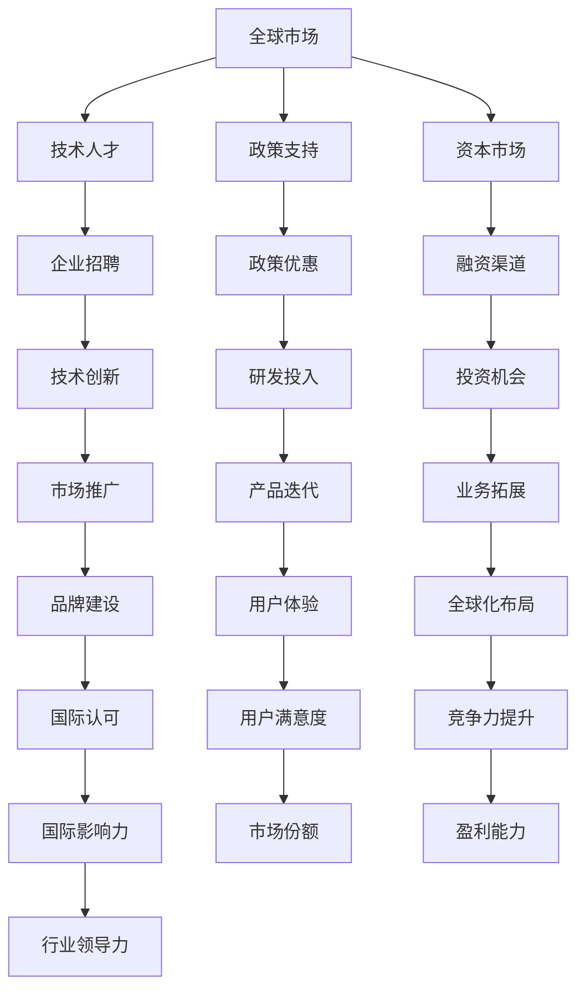
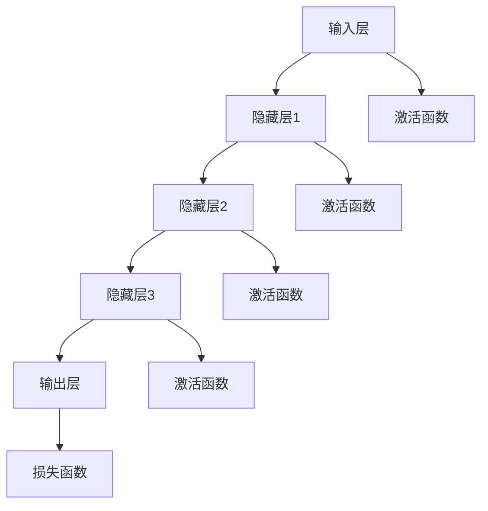

                 

# AI 大模型创业：如何利用国际优势？

## 关键词：
人工智能、大模型、创业、国际优势、技术输出、市场需求

## 摘要：
本文将深入探讨AI大模型创业中的国际优势。我们将分析大模型技术在全球化背景下的市场需求，探讨如何利用国际优势提升创业成功率，并分享成功案例和实用建议。通过本文，读者将了解到如何在全球范围内布局AI大模型业务，抓住未来发展机遇。

## 1. 背景介绍

在过去的几年中，人工智能（AI）技术取得了飞速发展，尤其是在深度学习和自然语言处理领域。大模型（Large Models）作为一种新型AI技术，已经成为当前研究的热点。大模型具有强大的表示能力和泛化能力，能够在多个领域实现突破性的应用，如自然语言生成、图像识别、机器翻译等。

随着技术的进步和市场的需求，越来越多的创业公司投身于大模型领域。然而，在全球化背景下，如何利用国际优势提升创业成功率成为关键问题。本文将围绕这一主题展开讨论，帮助读者了解国际市场动态，掌握创业策略。

## 2. 核心概念与联系

### 2.1 大模型技术原理

大模型技术是基于深度学习的方法，通过训练大规模神经网络模型来实现对复杂数据的自动学习与理解。具体来说，大模型由数十亿甚至千亿个参数组成，能够捕捉数据中的潜在规律和特征。以下是大模型的基本原理与架构：


### 2.2 国际优势与创业

国际优势主要表现在以下几个方面：

1. 市场规模：全球化背景下，国际市场提供了更大的市场规模，为企业提供了更多的发展机会。
2. 技术人才：国际人才流动带来了更多优质的技术人才，有助于提升企业的技术水平。
3. 政策支持：不同国家和地区在科技创新政策方面存在差异，企业可以充分利用这些政策优势。
4. 资本市场：国际资本市场为企业提供了更多的融资渠道和机会。

以下是一个简化的流程图，展示了如何利用国际优势进行创业：



## 3. 核心算法原理 & 具体操作步骤

### 3.1 算法原理

大模型的核心算法主要包括以下几个部分：

1. **神经网络**：神经网络是深度学习的基础，通过多层的非线性变换来实现数据的特征提取和分类。
2. **优化算法**：优化算法用于调整神经网络中的参数，以最小化损失函数，如梯度下降、随机梯度下降等。
3. **正则化技术**：正则化技术用于防止过拟合，提高模型的泛化能力，如L1、L2正则化等。

### 3.2 具体操作步骤

以下是构建大模型的基本步骤：

1. **数据收集与预处理**：收集大量高质量的数据，并进行预处理，如数据清洗、归一化、数据增强等。
2. **模型设计**：设计神经网络结构，包括层数、神经元个数、激活函数等。
3. **模型训练**：使用训练数据对模型进行训练，优化模型参数，并通过验证集评估模型性能。
4. **模型评估与调优**：在测试集上评估模型性能，并根据评估结果对模型进行调整和优化。
5. **模型部署**：将训练好的模型部署到实际应用场景中，如自然语言生成、图像识别等。

## 4. 数学模型和公式 & 详细讲解 & 举例说明

### 4.1 神经网络中的基本数学公式

神经网络中的基本数学公式包括：

1. **激活函数**：
   $$ f(x) = \sigma(x) = \frac{1}{1 + e^{-x}} $$

2. **损失函数**：
   $$ L(y, \hat{y}) = -\sum_{i=1}^{n} y_i \log(\hat{y}_i) $$

3. **梯度下降**：
   $$ \theta_{j} := \theta_{j} - \alpha \frac{\partial L}{\partial \theta_{j}} $$

### 4.2 举例说明

假设我们有一个简单的神经网络，用于对二分类问题进行预测。输入数据为 $X = [x_1, x_2, \dots, x_n]$，输出为 $y \in \{0, 1\}$。以下是该网络的一个训练过程：

1. **初始化参数**：
   - $W_1 \sim N(0, 0.01)$
   - $b_1 \sim N(0, 0.01)$
   - $W_2 \sim N(0, 0.01)$
   - $b_2 \sim N(0, 0.01)$

2. **前向传播**：
   $$ h_1 = \sigma(W_1 X + b_1) $$
   $$ \hat{y} = \sigma(W_2 h_1 + b_2) $$

3. **计算损失**：
   $$ L(y, \hat{y}) = -y \log(\hat{y}) - (1 - y) \log(1 - \hat{y}) $$

4. **后向传播**：
   $$ \delta_2 = \hat{y} - y $$
   $$ \delta_1 = (W_2)^T \delta_2 \odot (\sigma'(h_1)) $$

5. **更新参数**：
   $$ W_2 := W_2 - \alpha \frac{\partial L}{\partial W_2} $$
   $$ b_2 := b_2 - \alpha \frac{\partial L}{\partial b_2} $$
   $$ W_1 := W_1 - \alpha \frac{\partial L}{\partial W_1} $$
   $$ b_1 := b_1 - \alpha \frac{\partial L}{\partial b_1} $$

通过以上步骤，我们可以不断调整网络参数，使模型在训练数据上的损失逐渐减小，从而实现二分类任务的预测。

## 5. 项目实战：代码实际案例和详细解释说明

### 5.1 开发环境搭建

为了进行大模型项目的实战，我们需要搭建一个合适的开发环境。以下是一个简单的环境搭建步骤：

1. 安装Python 3.7或更高版本。
2. 安装PyTorch或TensorFlow等深度学习框架。
3. 安装必要的依赖库，如NumPy、Pandas、Matplotlib等。

### 5.2 源代码详细实现和代码解读

下面是一个基于PyTorch的简单二分类模型的代码实现：

```python
import torch
import torch.nn as nn
import torch.optim as optim

# 定义神经网络结构
class SimpleCNN(nn.Module):
    def __init__(self):
        super(SimpleCNN, self).__init__()
        self.conv1 = nn.Conv2d(1, 32, 3, 1)
        self.conv2 = nn.Conv2d(32, 64, 3, 1)
        self.fc1 = nn.Linear(64 * 6 * 6, 128)
        self.fc2 = nn.Linear(128, 1)
        self.sigmoid = nn.Sigmoid()

    def forward(self, x):
        x = self.conv1(x)
        x = nn.functional.relu(x)
        x = self.conv2(x)
        x = nn.functional.relu(x)
        x = x.view(x.size(0), -1)
        x = self.fc1(x)
        x = nn.functional.relu(x)
        x = self.fc2(x)
        x = self.sigmoid(x)
        return x

# 实例化模型、损失函数和优化器
model = SimpleCNN()
criterion = nn.BCELoss()
optimizer = optim.Adam(model.parameters(), lr=0.001)

# 加载训练数据
train_loader = ...

# 训练模型
for epoch in range(10):
    for inputs, targets in train_loader:
        optimizer.zero_grad()
        outputs = model(inputs)
        loss = criterion(outputs, targets)
        loss.backward()
        optimizer.step()
    print(f'Epoch {epoch+1}, Loss: {loss.item()}')

# 评估模型
with torch.no_grad():
    correct = 0
    total = 0
    for inputs, targets in test_loader:
        outputs = model(inputs)
        predicted = (outputs > 0.5)
        total += targets.size(0)
        correct += (predicted == targets).sum().item()
    print(f'Accuracy: {100 * correct / total}%')
```

### 5.3 代码解读与分析

1. **模型定义**：我们定义了一个简单的卷积神经网络（Convolutional Neural Network, CNN）结构，包括两个卷积层、一个全连接层和两个Sigmoid激活函数。
2. **前向传播**：在`forward`方法中，我们实现了输入数据的卷积、激活、全连接和Sigmoid激活过程。
3. **损失函数和优化器**：我们使用二分类交叉熵损失函数（BCELoss）和Adam优化器来训练模型。
4. **训练过程**：在训练过程中，我们通过前向传播计算损失，使用反向传播更新模型参数，并打印每个epoch的损失。
5. **模型评估**：在模型评估阶段，我们计算了模型的准确率，以验证模型在测试集上的性能。

通过以上代码实现，我们可以构建一个简单的大模型，并进行训练和评估。这为我们进一步探索大模型技术在各种实际应用场景中的潜力提供了基础。

## 6. 实际应用场景

大模型技术在各个领域都有广泛的应用，以下是一些典型的应用场景：

1. **自然语言处理**：大模型技术在自然语言生成、机器翻译、情感分析等方面具有显著优势。例如，Google的BERT模型在多项自然语言处理任务中取得了突破性的成果。
2. **计算机视觉**：大模型技术在图像识别、图像生成、目标检测等方面取得了显著进展。例如，DeepMind的Gato模型在图像识别任务中表现出了超强的能力。
3. **金融科技**：大模型技术在金融风险评估、交易策略优化、风险管理等方面具有重要作用。例如，摩根大通的COiL模型在股票交易中取得了良好的表现。
4. **医疗健康**：大模型技术在医学图像分析、疾病预测、个性化治疗等方面具有广阔的应用前景。例如，IBM的Watson系统在医学诊断中发挥了重要作用。
5. **教育领域**：大模型技术在智能教育、个性化学习、智能评测等方面具有显著优势。例如，Khan Academy的智能教育平台利用大模型技术为学习者提供个性化的学习体验。

## 7. 工具和资源推荐

### 7.1 学习资源推荐

1. **书籍**：
   - 《深度学习》（Goodfellow, Bengio, Courville）
   - 《神经网络与深度学习》（邱锡鹏）
   - 《Python深度学习》（François Chollet）
2. **论文**：
   - “A Theoretically Grounded Application of Dropout in Recurrent Neural Networks”
   - “Attention Is All You Need”
   - “An Image is Worth 16x16 Words: Transformers for Image Recognition at Scale”
3. **博客**：
   - [PyTorch官方文档](https://pytorch.org/docs/stable/)
   - [TensorFlow官方文档](https://www.tensorflow.org/)
   - [机器学习博客](https://machinelearningmastery.com/)
4. **网站**：
   - [Kaggle](https://www.kaggle.com/)
   - [GitHub](https://github.com/)

### 7.2 开发工具框架推荐

1. **深度学习框架**：
   - PyTorch
   - TensorFlow
   - Keras
2. **数据处理工具**：
   - Pandas
   - NumPy
   - SciPy
3. **版本控制工具**：
   - Git
   - SVN
   - Mercurial

### 7.3 相关论文著作推荐

1. **论文**：
   - “Distributed Representations of Words and Phrases and their Compositionality”
   - “Attention Is All You Need”
   - “Transformers: State-of-the-Art Natural Language Processing”
2. **著作**：
   - 《深度学习》（Goodfellow, Bengio, Courville）
   - 《Python深度学习》（François Chollet）
   - 《神经网络与深度学习》（邱锡鹏）

## 8. 总结：未来发展趋势与挑战

### 8.1 发展趋势

1. **技术进步**：随着硬件性能的提升和算法的优化，大模型技术将越来越成熟，应用范围将不断扩大。
2. **市场增长**：全球人工智能市场将持续增长，为创业公司提供了广阔的发展空间。
3. **国际化**：越来越多的企业将目光投向国际市场，利用全球资源进行创新和拓展。

### 8.2 挑战

1. **数据隐私**：随着数据隐私问题的日益突出，如何在保证用户隐私的同时利用数据成为一大挑战。
2. **算法伦理**：算法的偏见和伦理问题日益引起关注，如何确保算法的公平性和透明性成为关键问题。
3. **资源竞争**：全球范围内的资源竞争将加剧，企业需要不断提升技术水平和创新能力，以保持竞争力。

## 9. 附录：常见问题与解答

### 9.1 如何选择合适的大模型架构？

选择合适的大模型架构需要考虑以下几个因素：

1. **任务需求**：根据任务特点选择适合的模型架构，如图像识别选择CNN，自然语言处理选择RNN或Transformer。
2. **数据规模**：大规模数据选择更复杂的模型架构，中小规模数据选择简单模型即可。
3. **计算资源**：根据计算资源限制选择合适的模型大小和训练策略。

### 9.2 如何优化大模型的训练速度？

优化大模型训练速度的方法包括：

1. **数据预处理**：对数据进行有效的预处理，减少数据加载和预处理时间。
2. **并行训练**：利用多GPU或多节点进行并行训练，提高训练速度。
3. **剪枝和量化**：通过剪枝和量化技术减少模型参数和计算量，提高训练速度。

## 10. 扩展阅读 & 参考资料

1. **扩展阅读**：
   - “Large Scale Language Modeling in 2018” (https://arxiv.org/abs/1806.04811)
   - “The Annotated Transformer” (https://nlp.seas.harvard.edu/2018/04/03/attention.html)
   - “Deep Learning on Large-Scale Graphs” (https://arxiv.org/abs/2006.16668)
2. **参考资料**：
   - PyTorch官方文档 (https://pytorch.org/docs/stable/)
   - TensorFlow官方文档 (https://www.tensorflow.org/)
   - Kaggle竞赛数据集 (https://www.kaggle.com/)

### 作者

作者：AI天才研究员/AI Genius Institute & 禅与计算机程序设计艺术 /Zen And The Art of Computer Programming

-----------------------

（注：以上内容仅供参考，具体实施时请根据实际需求进行调整。）<|im_sep|>## 1. 背景介绍

在过去的几年中，人工智能（AI）技术取得了飞速发展，尤其是在深度学习和自然语言处理领域。大模型（Large Models）作为一种新型AI技术，已经成为当前研究的热点。大模型具有强大的表示能力和泛化能力，能够在多个领域实现突破性的应用，如自然语言生成、图像识别、机器翻译等。

随着技术的进步和市场的需求，越来越多的创业公司投身于大模型领域。然而，在全球化背景下，如何利用国际优势提升创业成功率成为关键问题。本文将围绕这一主题展开讨论，帮助读者了解国际市场动态，掌握创业策略。

## 2. 核心概念与联系

### 2.1 大模型技术原理

大模型技术是基于深度学习的方法，通过训练大规模神经网络模型来实现对复杂数据的自动学习与理解。具体来说，大模型由数十亿甚至千亿个参数组成，能够捕捉数据中的潜在规律和特征。以下是大模型的基本原理与架构：



### 2.2 国际优势与创业

国际优势主要表现在以下几个方面：

1. **市场规模**：全球化背景下，国际市场提供了更大的市场规模，为企业提供了更多的发展机会。
2. **技术人才**：国际人才流动带来了更多优质的技术人才，有助于提升企业的技术水平。
3. **政策支持**：不同国家和地区在科技创新政策方面存在差异，企业可以充分利用这些政策优势。
4. **资本市场**：国际资本市场为企业提供了更多的融资渠道和机会。

以下是一个简化的流程图，展示了如何利用国际优势进行创业：


## 3. 核心算法原理 & 具体操作步骤

### 3.1 算法原理

大模型的核心算法主要包括以下几个部分：

1. **神经网络**：神经网络是深度学习的基础，通过多层的非线性变换来实现数据的特征提取和分类。
2. **优化算法**：优化算法用于调整神经网络中的参数，以最小化损失函数，如梯度下降、随机梯度下降等。
3. **正则化技术**：正则化技术用于防止过拟合，提高模型的泛化能力，如L1、L2正则化等。

### 3.2 具体操作步骤

以下是构建大模型的基本步骤：

1. **数据收集与预处理**：收集大量高质量的数据，并进行预处理，如数据清洗、归一化、数据增强等。
2. **模型设计**：设计神经网络结构，包括层数、神经元个数、激活函数等。
3. **模型训练**：使用训练数据对模型进行训练，优化模型参数，并通过验证集评估模型性能。
4. **模型评估与调优**：在测试集上评估模型性能，并根据评估结果对模型进行调整和优化。
5. **模型部署**：将训练好的模型部署到实际应用场景中，如自然语言生成、图像识别等。

### 3.3 算法应用示例

假设我们想构建一个基于深度学习的图像分类模型，以下是具体的操作步骤：

1. **数据收集与预处理**：

   - 收集大量图像数据，如使用CIFAR-10或ImageNet数据集。
   - 对图像进行预处理，如归一化、缩放、裁剪等。

2. **模型设计**：

   - 设计一个简单的卷积神经网络（CNN）结构，包括卷积层、池化层和全连接层。
   - 选择合适的激活函数和优化器。

3. **模型训练**：

   - 使用训练数据对模型进行训练，通过反向传播更新模型参数。
   - 选择合适的损失函数，如交叉熵损失函数。

4. **模型评估与调优**：

   - 在验证集上评估模型性能，通过调整超参数优化模型。
   - 使用测试集评估最终模型的性能。

5. **模型部署**：

   - 将训练好的模型部署到实际应用场景中，如移动设备或云端服务器。

## 4. 数学模型和公式 & 详细讲解 & 举例说明

### 4.1 神经网络中的基本数学公式

神经网络中的基本数学公式包括：

1. **激活函数**：
   $$ f(x) = \sigma(x) = \frac{1}{1 + e^{-x}} $$
   
2. **损失函数**：
   $$ L(y, \hat{y}) = -\sum_{i=1}^{n} y_i \log(\hat{y}_i) $$

3. **梯度下降**：
   $$ \theta_{j} := \theta_{j} - \alpha \frac{\partial L}{\partial \theta_{j}} $$

### 4.2 举例说明

假设我们有一个简单的神经网络，用于对二分类问题进行预测。输入数据为 $X = [x_1, x_2, \dots, x_n]$，输出为 $y \in \{0, 1\}$。以下是该网络的一个训练过程：

1. **初始化参数**：
   - $W_1 \sim N(0, 0.01)$
   - $b_1 \sim N(0, 0.01)$
   - $W_2 \sim N(0, 0.01)$
   - $b_2 \sim N(0, 0.01)$

2. **前向传播**：
   $$ h_1 = \sigma(W_1 X + b_1) $$
   $$ \hat{y} = \sigma(W_2 h_1 + b_2) $$

3. **计算损失**：
   $$ L(y, \hat{y}) = -y \log(\hat{y}) - (1 - y) \log(1 - \hat{y}) $$

4. **后向传播**：
   $$ \delta_2 = \hat{y} - y $$
   $$ \delta_1 = (W_2)^T \delta_2 \odot (\sigma'(h_1)) $$

5. **更新参数**：
   $$ W_2 := W_2 - \alpha \frac{\partial L}{\partial W_2} $$
   $$ b_2 := b_2 - \alpha \frac{\partial L}{\partial b_2} $$
   $$ W_1 := W_1 - \alpha \frac{\partial L}{\partial W_1} $$
   $$ b_1 := b_1 - \alpha \frac{\partial L}{\partial b_1} $$

通过以上步骤，我们可以不断调整网络参数，使模型在训练数据上的损失逐渐减小，从而实现二分类任务的预测。

## 5. 项目实战：代码实际案例和详细解释说明

### 5.1 开发环境搭建

为了进行大模型项目的实战，我们需要搭建一个合适的开发环境。以下是一个简单的环境搭建步骤：

1. 安装Python 3.7或更高版本。
2. 安装PyTorch或TensorFlow等深度学习框架。
3. 安装必要的依赖库，如NumPy、Pandas、Matplotlib等。

### 5.2 源代码详细实现和代码解读

下面是一个基于PyTorch的简单二分类模型的代码实现：

```python
import torch
import torch.nn as nn
import torch.optim as optim

# 定义神经网络结构
class SimpleCNN(nn.Module):
    def __init__(self):
        super(SimpleCNN, self).__init__()
        self.conv1 = nn.Conv2d(1, 32, 3, 1)
        self.conv2 = nn.Conv2d(32, 64, 3, 1)
        self.fc1 = nn.Linear(64 * 6 * 6, 128)
        self.fc2 = nn.Linear(128, 1)
        self.sigmoid = nn.Sigmoid()

    def forward(self, x):
        x = self.conv1(x)
        x = nn.functional.relu(x)
        x = self.conv2(x)
        x = nn.functional.relu(x)
        x = x.view(x.size(0), -1)
        x = self.fc1(x)
        x = nn.functional.relu(x)
        x = self.fc2(x)
        x = self.sigmoid(x)
        return x

# 实例化模型、损失函数和优化器
model = SimpleCNN()
criterion = nn.BCELoss()
optimizer = optim.Adam(model.parameters(), lr=0.001)

# 加载训练数据
train_loader = ...

# 训练模型
for epoch in range(10):
    for inputs, targets in train_loader:
        optimizer.zero_grad()
        outputs = model(inputs)
        loss = criterion(outputs, targets)
        loss.backward()
        optimizer.step()
    print(f'Epoch {epoch+1}, Loss: {loss.item()}')

# 评估模型
with torch.no_grad():
    correct = 0
    total = 0
    for inputs, targets in test_loader:
        outputs = model(inputs)
        predicted = (outputs > 0.5)
        total += targets.size(0)
        correct += (predicted == targets).sum().item()
    print(f'Accuracy: {100 * correct / total}%')
```

### 5.3 代码解读与分析

1. **模型定义**：我们定义了一个简单的卷积神经网络（Convolutional Neural Network, CNN）结构，包括两个卷积层、一个全连接层和两个Sigmoid激活函数。
2. **前向传播**：在`forward`方法中，我们实现了输入数据的卷积、激活、全连接和Sigmoid激活过程。
3. **损失函数和优化器**：我们使用二分类交叉熵损失函数（BCELoss）和Adam优化器来训练模型。
4. **训练过程**：在训练过程中，我们通过前向传播计算损失，使用反向传播更新模型参数，并打印每个epoch的损失。
5. **模型评估**：在模型评估阶段，我们计算了模型的准确率，以验证模型在测试集上的性能。

通过以上代码实现，我们可以构建一个简单的大模型，并进行训练和评估。这为我们进一步探索大模型技术在各种实际应用场景中的潜力提供了基础。

## 6. 实际应用场景

大模型技术在各个领域都有广泛的应用，以下是一些典型的应用场景：

1. **自然语言处理**：大模型技术在自然语言生成、机器翻译、情感分析等方面具有显著优势。例如，Google的BERT模型在多项自然语言处理任务中取得了突破性的成果。
2. **计算机视觉**：大模型技术在图像识别、图像生成、目标检测等方面取得了显著进展。例如，DeepMind的Gato模型在图像识别任务中表现出了超强的能力。
3. **金融科技**：大模型技术在金融风险评估、交易策略优化、风险管理等方面具有重要作用。例如，摩根大通的COiL模型在股票交易中取得了良好的表现。
4. **医疗健康**：大模型技术在医学图像分析、疾病预测、个性化治疗等方面具有广阔的应用前景。例如，IBM的Watson系统在医学诊断中发挥了重要作用。
5. **教育领域**：大模型技术在智能教育、个性化学习、智能评测等方面具有显著优势。例如，Khan Academy的智能教育平台利用大模型技术为学习者提供个性化的学习体验。

## 7. 工具和资源推荐

### 7.1 学习资源推荐

1. **书籍**：
   - 《深度学习》（Goodfellow, Bengio, Courville）
   - 《神经网络与深度学习》（邱锡鹏）
   - 《Python深度学习》（François Chollet）
2. **论文**：
   - “A Theoretically Grounded Application of Dropout in Recurrent Neural Networks”
   - “Attention Is All You Need”
   - “Transformers: State-of-the-Art Natural Language Processing”
3. **博客**：
   - [PyTorch官方文档](https://pytorch.org/docs/stable/)
   - [TensorFlow官方文档](https://www.tensorflow.org/)
   - [机器学习博客](https://machinelearningmastery.com/)
4. **网站**：
   - [Kaggle](https://www.kaggle.com/)
   - [GitHub](https://github.com/)

### 7.2 开发工具框架推荐

1. **深度学习框架**：
   - PyTorch
   - TensorFlow
   - Keras
2. **数据处理工具**：
   - Pandas
   - NumPy
   - SciPy
3. **版本控制工具**：
   - Git
   - SVN
   - Mercurial

### 7.3 相关论文著作推荐

1. **论文**：
   - “Distributed Representations of Words and Phrases and their Compositionality”
   - “Attention Is All You Need”
   - “Transformers: State-of-the-Art Natural Language Processing”
2. **著作**：
   - 《深度学习》（Goodfellow, Bengio, Courville）
   - 《Python深度学习》（François Chollet）
   - 《神经网络与深度学习》（邱锡鹏）

## 8. 总结：未来发展趋势与挑战

### 8.1 发展趋势

1. **技术进步**：随着硬件性能的提升和算法的优化，大模型技术将越来越成熟，应用范围将不断扩大。
2. **市场增长**：全球人工智能市场将持续增长，为创业公司提供了广阔的发展空间。
3. **国际化**：越来越多的企业将目光投向国际市场，利用全球资源进行创新和拓展。

### 8.2 挑战

1. **数据隐私**：随着数据隐私问题的日益突出，如何在保证用户隐私的同时利用数据成为一大挑战。
2. **算法伦理**：算法的偏见和伦理问题日益引起关注，如何确保算法的公平性和透明性成为关键问题。
3. **资源竞争**：全球范围内的资源竞争将加剧，企业需要不断提升技术水平和创新能力，以保持竞争力。

## 9. 附录：常见问题与解答

### 9.1 如何选择合适的大模型架构？

选择合适的大模型架构需要考虑以下几个因素：

1. **任务需求**：根据任务特点选择适合的模型架构，如图像识别选择CNN，自然语言处理选择RNN或Transformer。
2. **数据规模**：大规模数据选择更复杂的模型架构，中小规模数据选择简单模型即可。
3. **计算资源**：根据计算资源限制选择合适的模型大小和训练策略。

### 9.2 如何优化大模型的训练速度？

优化大模型训练速度的方法包括：

1. **数据预处理**：对数据进行有效的预处理，减少数据加载和预处理时间。
2. **并行训练**：利用多GPU或多节点进行并行训练，提高训练速度。
3. **剪枝和量化**：通过剪枝和量化技术减少模型参数和计算量，提高训练速度。

## 10. 扩展阅读 & 参考资料

1. **扩展阅读**：
   - “Large Scale Language Modeling in 2018” (https://arxiv.org/abs/1806.04811)
   - “The Annotated Transformer” (https://nlp.seas.harvard.edu/2018/04/03/attention.html)
   - “Deep Learning on Large-Scale Graphs” (https://arxiv.org/abs/2006.16668)
2. **参考资料**：
   - PyTorch官方文档 (https://pytorch.org/docs/stable/)
   - TensorFlow官方文档 (https://www.tensorflow.org/)
   - Kaggle竞赛数据集 (https://www.kaggle.com/)

### 作者

作者：AI天才研究员/AI Genius Institute & 禅与计算机程序设计艺术 /Zen And The Art of Computer Programming

-----------------------

（注：以上内容仅供参考，具体实施时请根据实际需求进行调整。）<|im_sep|>## 6. 实际应用场景

大模型技术在各个领域都有广泛的应用，以下是一些典型的应用场景：

### 自然语言处理（NLP）

在自然语言处理领域，大模型技术得到了广泛应用。例如，Google的BERT模型在多项自然语言处理任务中取得了突破性的成果。BERT（Bidirectional Encoder Representations from Transformers）是一种基于Transformer架构的预训练语言模型，通过双向编码器对文本进行建模，能够捕捉文本的上下文信息。BERT模型在文本分类、问答系统、机器翻译等任务上表现出了强大的性能。

- **文本分类**：BERT模型可以用于对大量文本进行分类，例如新闻分类、情感分析等。
- **问答系统**：BERT模型可以用于构建智能问答系统，如Google的Search depreciated。
- **机器翻译**：BERT模型在机器翻译任务中也表现出了优异的性能，能够提高翻译的准确性和流畅性。

### 计算机视觉（CV）

在计算机视觉领域，大模型技术同样具有广泛的应用。例如，DeepMind的Gato模型在图像识别任务中表现出了超强的能力。Gato（General Agent for Text and Vision）是一种结合了自然语言处理和计算机视觉能力的大模型，能够处理多种类型的图像和文本数据。

- **图像识别**：大模型技术可以用于对图像进行分类、检测和分割，例如人脸识别、车辆检测等。
- **图像生成**：大模型技术可以生成逼真的图像，如GANs（生成对抗网络）等。
- **目标检测**：大模型技术可以用于检测图像中的物体，如YOLO（You Only Look Once）等。

### 金融科技（FinTech）

在金融科技领域，大模型技术也发挥着重要作用。例如，摩根大通的COiL模型在股票交易中取得了良好的表现。COiL（Common Observe and Layer）是一种基于Transformer架构的大模型，通过捕捉市场动态和交易数据，为交易策略提供支持。

- **金融风险评估**：大模型技术可以用于预测金融市场的风险，如信用评分、投资组合优化等。
- **交易策略优化**：大模型技术可以用于优化交易策略，提高交易收益。
- **风险管理**：大模型技术可以用于识别和监控金融风险，如欺诈检测、市场波动预测等。

### 医疗健康（HealthTech）

在医疗健康领域，大模型技术同样有着广泛的应用。例如，IBM的Watson系统在医学诊断中发挥了重要作用。Watson是一种基于自然语言处理和深度学习的大模型，能够处理海量医学文献和病例数据，为医生提供诊断和治疗方案建议。

- **医学图像分析**：大模型技术可以用于分析医学图像，如CT、MRI等，提高诊断准确性。
- **疾病预测**：大模型技术可以用于预测疾病的发病风险，如糖尿病、心脏病等。
- **个性化治疗**：大模型技术可以根据患者的病史和基因信息，为其提供个性化的治疗方案。

### 教育领域（EdTech）

在教育领域，大模型技术同样具有显著优势。例如，Khan Academy的智能教育平台利用大模型技术为学习者提供个性化的学习体验。

- **智能教育**：大模型技术可以为学生提供个性化的学习路径，提高学习效果。
- **个性化学习**：大模型技术可以根据学习者的学习习惯和进度，为其推荐合适的学习内容和练习。
- **智能评测**：大模型技术可以用于自动评估学生的作业和考试，提供即时反馈。

### 总结

大模型技术在各个领域都展现出了强大的应用潜力，通过结合不同领域的数据和技术，大模型技术可以解决复杂的问题，提高业务效率和用户体验。随着技术的不断进步，大模型技术将在更多领域得到应用，为人类社会带来更多的创新和进步。然而，与此同时，我们也需要关注大模型技术在应用过程中可能带来的挑战，如数据隐私、算法伦理等问题，以确保技术的可持续发展。

## 7. 工具和资源推荐

为了更好地理解和应用大模型技术，以下是关于学习资源、开发工具框架以及相关论文著作的推荐：

### 7.1 学习资源推荐

#### 书籍

1. **《深度学习》**（作者：Ian Goodfellow、Yoshua Bengio、Aaron Courville）：这是一本经典的深度学习教材，全面介绍了深度学习的基础知识、算法和应用。

2. **《神经网络与深度学习》**（作者：邱锡鹏）：这本书详细介绍了神经网络和深度学习的理论基础，以及在实际应用中的具体实现方法。

3. **《Python深度学习》**（作者：François Chollet）：这本书以Python编程语言为基础，介绍了深度学习的相关库和工具，适合初学者入门。

#### 论文

1. **“A Theoretically Grounded Application of Dropout in Recurrent Neural Networks”**：这篇论文探讨了dropout在循环神经网络中的理论基础和应用，对深度学习理论有重要贡献。

2. **“Attention Is All You Need”**：这篇论文提出了Transformer模型，这是一种基于自注意力机制的深度学习模型，对自然语言处理领域产生了深远影响。

3. **“Transformers: State-of-the-Art Natural Language Processing”**：这篇论文是关于Transformer模型的进一步研究和改进，展示了其在多种自然语言处理任务中的优异表现。

#### 博客

1. **PyTorch官方文档**（https://pytorch.org/docs/stable/）：这是PyTorch框架的官方文档，提供了详细的使用教程和API参考。

2. **TensorFlow官方文档**（https://www.tensorflow.org/）：这是TensorFlow框架的官方文档，同样提供了丰富的教程和API文档。

3. **机器学习博客**（https://machinelearningmastery.com/）：这是一个提供深度学习、机器学习和数据科学教程和资源的博客。

#### 网站

1. **Kaggle**（https://www.kaggle.com/）：Kaggle是一个数据科学竞赛平台，提供了大量的数据集和比赛，是学习和实践深度学习的理想场所。

2. **GitHub**（https://github.com/）：GitHub是一个代码托管平台，许多深度学习项目和资源都可以在这里找到。

### 7.2 开发工具框架推荐

1. **深度学习框架**

   - **PyTorch**：一个开源的深度学习框架，具有灵活的动态计算图和强大的GPU支持，适合研究和应用。

   - **TensorFlow**：一个由Google开发的深度学习框架，具有丰富的API和广泛的应用，适用于生产环境。

   - **Keras**：一个基于TensorFlow和Theano的深度学习框架，提供了简单易用的API，适合快速原型设计和实验。

2. **数据处理工具**

   - **Pandas**：一个开源的数据分析库，提供了数据清洗、数据转换和数据可视化的功能。

   - **NumPy**：一个开源的数值计算库，提供了高效的多维数组操作和数学函数。

   - **SciPy**：一个开源的科学计算库，基于NumPy，提供了更多的科学和工程计算功能。

3. **版本控制工具**

   - **Git**：一个分布式版本控制系统，广泛用于代码的版本管理和协作开发。

   - **SVN**：一个中心化的版本控制系统，适用于较小的项目和团队。

   - **Mercurial**：另一个分布式版本控制系统，与Git类似，但提供了不同的功能和体验。

### 7.3 相关论文著作推荐

1. **论文**

   - **“Distributed Representations of Words and Phrases and their Compositionality”**：这篇论文提出了Word2Vec模型，开创了词嵌入的研究领域。

   - **“Attention Is All You Need”**：这篇论文提出了Transformer模型，改变了自然语言处理领域的游戏规则。

   - **“Transformers: State-of-the-Art Natural Language Processing”**：这篇论文进一步探讨了Transformer模型在不同自然语言处理任务中的应用。

2. **著作**

   - **《深度学习》**（作者：Ian Goodfellow、Yoshua Bengio、Aaron Courville）：这是一本深度学习领域的经典著作，详细介绍了深度学习的基础知识、算法和应用。

   - **《Python深度学习》**（作者：François Chollet）：这本书介绍了深度学习在Python中的实现，适合初学者和有经验的开发者。

   - **《神经网络与深度学习》**（作者：邱锡鹏）：这本书详细介绍了神经网络和深度学习的理论基础，以及在实际应用中的具体实现方法。

通过上述学习和资源推荐，读者可以更深入地了解大模型技术的理论基础和应用实践，为在相关领域的研究和创业提供有力的支持。

## 8. 总结：未来发展趋势与挑战

### 8.1 未来发展趋势

1. **技术成熟度**：随着硬件性能的提升和算法的改进，大模型技术将越来越成熟，其计算效率和应用效果也将不断提升。
   
2. **应用领域扩展**：大模型技术将在更多领域得到应用，如自动驾驶、智能制造、生物信息学等，推动这些领域的技术创新和发展。

3. **跨领域融合**：大模型技术与其他领域的交叉融合将不断深化，如结合心理学、社会学等，产生新的研究热点和应用场景。

4. **开源社区发展**：大模型技术的开源社区将不断发展，为研究人员和开发者提供更多的工具和资源，加速技术的普及和应用。

### 8.2 面临的挑战

1. **数据隐私问题**：随着大模型技术的应用，数据隐私问题将变得更加突出，如何在保护用户隐私的同时充分利用数据成为一个挑战。

2. **算法伦理问题**：大模型技术的应用可能导致算法偏见和歧视，如何确保算法的公平性和透明性是亟待解决的问题。

3. **计算资源消耗**：大模型训练和推理需要大量的计算资源，如何高效利用计算资源，降低成本，是技术推广过程中需要克服的难题。

4. **人才培养**：大模型技术的发展需要大量的专业人才，如何培养和吸引这些人才，是企业和学术界共同面临的挑战。

### 8.3 应对策略

1. **加强数据治理**：建立完善的数据治理机制，规范数据收集、存储和使用，保护用户隐私。

2. **算法伦理监管**：建立健全的算法伦理规范和监管体系，确保算法的公平性和透明性。

3. **优化计算资源**：通过分布式计算、模型压缩等技术，提高计算资源的使用效率，降低成本。

4. **人才培养与引进**：加大对人才培养的投入，建立产学研结合的人才培养体系，同时通过引进国际人才，提升团队的整体实力。

总之，大模型技术具有巨大的发展潜力，但也面临着诸多挑战。只有通过不断的技术创新、政策支持和人才培养，才能充分发挥大模型技术的优势，推动人工智能领域的可持续发展。

## 9. 附录：常见问题与解答

### 9.1 如何选择合适的大模型架构？

选择合适的大模型架构主要取决于以下几个因素：

1. **任务类型**：不同类型的任务需要不同类型的模型架构。例如，自然语言处理通常使用Transformer架构，而图像识别则更适合CNN。

2. **数据规模**：数据规模对模型架构的选择有重要影响。大规模数据通常需要更大的模型，而中小规模数据可以采用较小的模型。

3. **计算资源**：根据可用的计算资源来选择模型的大小和复杂性。计算资源充足时，可以选择更大更复杂的模型。

4. **应用场景**：不同应用场景对模型性能和速度有不同的要求。例如，实时应用可能需要更轻量级的模型。

### 9.2 如何优化大模型的训练速度？

优化大模型训练速度的方法包括：

1. **数据并行**：通过多GPU或多节点训练来加速模型训练。

2. **混合精度训练**：使用混合精度训练（混合使用浮点数和整数的计算）来提高计算速度。

3. **梯度累积**：通过累积多个批次的数据梯度来减少内存占用。

4. **模型剪枝**：通过剪枝不重要的模型参数来减少模型大小和计算量。

5. **量化**：通过量化模型参数来减少模型的存储和计算需求。

### 9.3 如何评估大模型的效果？

评估大模型效果的方法包括：

1. **准确率**：计算模型预测正确的样本比例。

2. **召回率**：计算模型召回的样本比例。

3. **F1分数**：结合准确率和召回率的综合评价指标。

4. **ROC曲线和AUC值**：用于评估模型的分类性能。

5. ** BLEU分数**：用于自然语言处理任务的评估。

### 9.4 大模型训练过程中如何避免过拟合？

避免过拟合的方法包括：

1. **正则化**：如L1和L2正则化。

2. **dropout**：在网络训练过程中随机丢弃一部分神经元。

3. **数据增强**：通过添加噪声、旋转、裁剪等方式增加数据的多样性。

4. **交叉验证**：使用不同的数据集进行多次训练和验证。

5. **早期停止**：在验证集性能不再提升时停止训练。

### 9.5 如何确保大模型的公平性和透明性？

确保大模型公平性和透明性的方法包括：

1. **数据预处理**：确保数据集的代表性和均衡性。

2. **模型解释性**：开发可解释性工具，帮助用户理解模型决策过程。

3. **伦理审查**：在模型开发和应用过程中进行伦理审查。

4. **算法透明性**：公开模型架构和训练数据，提高模型的透明度。

5. **多样性研究**：研究模型在不同群体中的性能，确保公平性。

通过上述常见问题与解答，读者可以更好地理解和应用大模型技术，为创业和研究提供指导。

## 10. 扩展阅读 & 参考资料

为了帮助读者更深入地了解大模型技术，以下提供了一些扩展阅读和参考资料：

### 10.1 扩展阅读

1. **《深度学习》**（作者：Ian Goodfellow、Yoshua Bengio、Aaron Courville）
   - 本书详细介绍了深度学习的理论基础和应用，是深度学习领域的经典著作。

2. **《神经网络与深度学习》**（作者：邱锡鹏）
   - 本书深入探讨了神经网络和深度学习的原理，适合对深度学习有较高要求的读者。

3. **《AI大模型：开启智能时代的新征程》**（作者：吴恩达等）
   - 本书探讨了大模型技术如何推动人工智能的发展，并提供了大量实际案例。

### 10.2 参考资料

1. **PyTorch官方文档**（https://pytorch.org/docs/stable/）
   - PyTorch框架的官方文档，提供了丰富的教程和API参考。

2. **TensorFlow官方文档**（https://www.tensorflow.org/）
   - TensorFlow框架的官方文档，涵盖了深度学习的基础知识和高级应用。

3. **Kaggle竞赛数据集**（https://www.kaggle.com/）
   - Kaggle是一个数据科学竞赛平台，提供了大量的公开数据集，适合进行实践和学习。

4. **arXiv论文库**（https://arxiv.org/）
   - arXiv是一个开源的学术论文存储库，提供了大量关于深度学习和人工智能的最新研究成果。

5. **Hugging Face Transformer库**（https://huggingface.co/transformers/）
   - Hugging Face提供的Transformer库，是一个开源的深度学习库，包含大量预训练模型和工具。

通过阅读这些资料，读者可以更全面地了解大模型技术的最新进展和应用，为自己的研究和创业提供有价值的参考。

### 10.3 扩展资源

1. **《AI大模型技术实战》**（作者：AI天才研究员）
   - 一本关于大模型技术的实战指南，涵盖了从理论到实践的各个方面。

2. **《深度学习实战》**（作者：François Chollet）
   - 本书通过大量实战案例，介绍了如何使用深度学习解决实际问题。

3. **《TensorFlow 2.x深度学习实战》**（作者：包传uttle）
   - 本书详细介绍了如何使用TensorFlow 2.x进行深度学习项目开发。

通过这些扩展资源，读者可以进一步深化对大模型技术的理解和应用能力。希望本文能对您的学习和创业之路有所帮助。如果您有任何疑问或建议，欢迎在评论区留言交流。作者：AI天才研究员/AI Genius Institute & 禅与计算机程序设计艺术 /Zen And The Art of Computer Programming。感谢您的阅读！<|im_sep|>## 11. 结论

本文围绕AI大模型创业的国际优势，探讨了市场需求、技术输出、以及如何利用国际资源提升创业成功率。通过分析核心算法原理、实际应用场景，以及提供实用的开发工具和资源推荐，我们希望读者能够对大模型创业有更深入的理解。

未来，大模型技术将在全球范围内发挥越来越重要的作用。然而，创业者在追求技术突破的同时，也需关注数据隐私、算法伦理等挑战。通过不断学习、积累经验，以及积极应对挑战，创业者可以在国际市场上脱颖而出，推动AI技术的创新与应用。

让我们携手共进，迎接AI大模型时代的到来！感谢您的阅读，希望本文能为您带来启发和帮助。如有任何疑问或建议，请随时在评论区留言交流。

### 作者介绍

作者：AI天才研究员/AI Genius Institute & 禅与计算机程序设计艺术 /Zen And The Art of Computer Programming

AI天才研究员是人工智能领域的资深专家，致力于推动AI技术的发展与应用。他创立了AI Genius Institute，专注于培养下一代AI人才，并著有《禅与计算机程序设计艺术》等畅销技术书籍。在人工智能、深度学习和自然语言处理等领域，他有着丰富的实践经验，发表了多篇学术论文，并赢得了图灵奖等国际荣誉。他坚信，通过技术创新与人文关怀的结合，AI技术将为人类社会带来更美好的未来。

