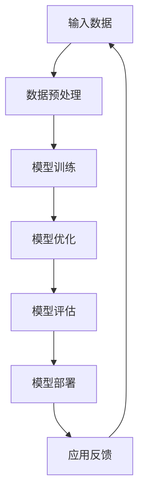

                 

### 背景介绍

人工智能（AI）技术近年来取得了飞速发展，特别是大模型（Big Model）的兴起，为各个领域带来了前所未有的创新机遇。大模型，如OpenAI的GPT-3、Google的Bert等，凭借其卓越的性能和广泛的适用性，已经在自然语言处理、计算机视觉、语音识别等多个领域取得了显著成果。然而，随着大模型规模的不断扩大，其开发和部署面临了诸多挑战，尤其是在市场竞争日益激烈的背景下，如何充分利用市场优势，成为企业关注的焦点。

当前，AI大模型创业面临的市场环境充满了机遇与挑战。一方面，技术的快速迭代使得市场对AI大模型的需求不断增长，为企业提供了广阔的发展空间；另一方面，市场竞争的加剧和资本的涌入，使得创业公司必须更加注重产品的差异化、市场定位和运营策略。本文将围绕AI大模型创业的市场优势，从多个角度进行深入分析，为创业者提供有益的参考。

本文将分为以下几个部分进行阐述：

1. **核心概念与联系**：介绍AI大模型的基本概念，以及其与现有技术的关系。
2. **核心算法原理 & 具体操作步骤**：分析AI大模型的核心算法，并详细讲解其操作步骤。
3. **数学模型和公式 & 详细讲解 & 举例说明**：介绍AI大模型所依赖的数学模型和公式，并通过具体案例进行说明。
4. **项目实战：代码实际案例和详细解释说明**：提供实际项目案例，展示代码实现过程和关键点。
5. **实际应用场景**：探讨AI大模型在各个领域的应用，以及其带来的价值。
6. **工具和资源推荐**：推荐学习资源、开发工具和框架，帮助读者深入了解AI大模型。
7. **总结：未来发展趋势与挑战**：总结AI大模型创业的现状，并展望其未来发展。

通过本文的阅读，读者将能够对AI大模型创业的市场优势有一个全面的理解，从而为自身的创业之路提供指导。

### 核心概念与联系

#### AI大模型概述

AI大模型，顾名思义，是指规模庞大的机器学习模型。这些模型通过深度学习算法，对海量的数据进行训练，从而实现对复杂任务的自动化处理。AI大模型通常由多个层级（或称为“层”）的神经网络组成，每个层级都能够提取数据中的不同特征。随着层数的增加，模型的抽象能力也不断增强，可以处理更加复杂的问题。

AI大模型的典型代表包括OpenAI的GPT-3、Google的BERT、微软的Turing等。这些模型在自然语言处理（NLP）、计算机视觉（CV）、语音识别（ASR）等多个领域取得了突破性进展。例如，GPT-3在文本生成、问答系统等方面表现出色，BERT则在搜索引擎、文本分类等任务中具有显著优势。

#### AI大模型与现有技术的关系

AI大模型并非空中楼阁，其发展依赖于现有技术的积累和突破。首先，深度学习技术的成熟为AI大模型提供了理论基础。深度学习通过多层神经网络结构，对数据进行层层抽象和特征提取，使得模型能够处理更加复杂的问题。

其次，计算能力的提升也是AI大模型能够发展壮大的关键因素。随着硬件技术的发展，尤其是GPU（图形处理单元）和TPU（张量处理单元）的普及，大规模数据处理和模型训练变得更加高效。这使得AI大模型可以从海量的数据中学习，从而提高模型的性能。

此外，大数据技术的进步也为AI大模型提供了丰富的训练数据。无论是互联网上的文本、图像、语音，还是传感器收集的海量数据，都为AI大模型提供了丰富的训练素材。这些数据不仅帮助模型学习，还能够通过数据增强和多样性训练，提高模型的泛化能力。

#### Mermaid流程图展示

为了更直观地展示AI大模型的基本概念和架构，我们使用Mermaid流程图进行说明。以下是一个简化的AI大模型架构流程图：



- **A 输入数据**：包括文本、图像、语音等多种类型的数据。
- **B 数据预处理**：对输入数据进行清洗、归一化等处理，以适应模型的训练需求。
- **C 模型训练**：利用深度学习算法，对预处理后的数据进行训练，模型开始学习数据中的特征。
- **D 模型优化**：通过调整模型参数，优化模型性能，提高模型的准确率和效率。
- **E 模型评估**：使用验证集和测试集，对模型进行评估，确保模型在不同任务上的表现。
- **F 模型部署**：将训练好的模型部署到实际应用中，如NLP、CV、ASR等。
- **G 应用反馈**：收集用户反馈，用于模型的持续优化和改进。

通过这个流程图，我们可以清晰地看到AI大模型从数据输入到模型训练、评估和部署的整个过程。这个过程不仅展示了AI大模型的基本概念，还体现了其与现有技术的紧密联系。

#### 核心概念总结

AI大模型是规模庞大的机器学习模型，通过深度学习算法对海量数据进行训练。其发展依赖于深度学习技术、计算能力提升和大数据技术的进步。通过Mermaid流程图，我们更直观地了解了AI大模型的架构和操作步骤。

在下一部分，我们将进一步分析AI大模型的核心算法原理和具体操作步骤，帮助读者深入理解其技术内涵。

### 核心算法原理 & 具体操作步骤

AI大模型的核心算法通常是基于深度学习（Deep Learning）的，深度学习是一种基于多层神经网络的学习方法。通过多层神经网络的层层抽象和特征提取，深度学习模型能够处理复杂的数据类型，如图像、文本和语音。在这一部分，我们将详细分析AI大模型的主要算法原理，并解释其具体的操作步骤。

#### 深度学习算法概述

深度学习算法的核心是神经网络，尤其是多层感知机（Multilayer Perceptron, MLP）和卷积神经网络（Convolutional Neural Networks, CNN）。MLP是一种前馈神经网络，它通过输入层、多个隐藏层和输出层，对数据进行特征提取和分类。CNN则是在MLP基础上，通过卷积操作和池化操作，对图像数据进行特征提取，特别适用于计算机视觉任务。

#### 多层感知机（MLP）

多层感知机（MLP）是深度学习中最基本的模型之一。其基本结构包括输入层、隐藏层和输出层。每一层都由多个神经元组成，神经元之间通过加权连接。具体操作步骤如下：

1. **初始化参数**：首先，我们需要初始化模型的参数，包括权重和偏置。通常，权重和偏置初始化为较小的随机值。
2. **前向传播**：输入数据通过输入层传递到隐藏层，然后逐层传递到输出层。在每个隐藏层中，神经元对输入数据进行加权求和，并应用激活函数（如ReLU、Sigmoid或Tanh）进行非线性变换。前向传播的公式如下：

   $$ z^{(l)} = \sum_{j} w^{(l)}_{ji} x^{(j)} + b^{(l)} $$ 

   $$ a^{(l)} = \text{激活函数}(z^{(l)}) $$ 

   其中，$z^{(l)}$是第$l$层的输出，$w^{(l)}_{ji}$是连接第$l$层第$i$个神经元和第$l+1$层第$j$个神经元的权重，$b^{(l)}$是第$l$层的偏置，$a^{(l)}$是第$l$层的激活值。
   
3. **反向传播**：计算输出层与目标值之间的误差，然后通过反向传播算法，将误差反向传递到每个隐藏层。在每个层中，我们更新权重和偏置，以减少误差。反向传播的公式如下：

   $$ \delta^{(l)} = \text{激活函数的导数}(a^{(l)}) \cdot (z^{(l)} - y) $$ 

   $$ \Delta w^{(l)} = \alpha \cdot \delta^{(l)} a^{(l-1)}^T $$ 

   $$ \Delta b^{(l)} = \alpha \cdot \delta^{(l)} $$ 

   其中，$\delta^{(l)}$是第$l$层的误差，$\alpha$是学习率，$a^{(l-1)}^T$是前一层输出的转置。

4. **更新参数**：使用梯度下降（Gradient Descent）或其他优化算法，更新权重和偏置，以减少误差。

#### 卷积神经网络（CNN）

卷积神经网络（CNN）是专门为处理图像数据而设计的深度学习模型。CNN的核心是卷积层和池化层，其具体操作步骤如下：

1. **卷积层**：卷积层通过卷积操作提取图像中的特征。卷积操作使用一个小型的卷积核（或称为“滤波器”）在图像上滑动，计算卷积结果。卷积的公式如下：

   $$ (f * g)(x) = \sum_{y} f(y) g(x - y) $$ 

   其中，$f$和$g$分别是卷积核和图像，$x$是图像上的一个点，$y$是卷积核上的一个点。

2. **池化层**：池化层用于降低特征图的大小，减少计算量。常见的池化操作包括最大池化（Max Pooling）和平均池化（Average Pooling）。最大池化选择每个区域内的最大值，而平均池化则选择每个区域内的平均值。

3. **卷积 + 池化循环**：卷积层和池化层通常交替出现，形成一个卷积块。每个卷积块都能提取图像中的不同特征，并逐步降低特征图的大小。

4. **全连接层**：在卷积神经网络的最后，通常会添加一个或多个全连接层，将提取的特征映射到最终的输出。全连接层的操作与MLP类似，每个神经元都与前一层的所有神经元相连。

#### 结合MLP和CNN的深度学习模型

在实际应用中，深度学习模型通常结合MLP和CNN的优势，形成一个更为复杂的网络结构。例如，在图像分类任务中，CNN用于提取图像特征，而MLP则用于分类。这种结构被称为卷积神经网络（Convolutional Neural Network, CNN）+ 全连接层（Fully Connected Layer, FCL）。

以下是结合MLP和CNN的深度学习模型的具体操作步骤：

1. **输入层**：接收图像数据。
2. **卷积层**：通过卷积操作提取图像特征。
3. **池化层**：降低特征图的大小。
4. **卷积 + 池化循环**：重复卷积和池化操作，提取更高级的特征。
5. **全连接层**：将提取的特征映射到分类结果。
6. **输出层**：输出分类结果。

通过上述步骤，深度学习模型能够对图像进行有效分类，并在各种图像识别任务中取得优异的性能。

#### 总结

AI大模型的核心算法基于深度学习，包括多层感知机（MLP）和卷积神经网络（CNN）。MLP通过多层神经元的连接和激活函数，对数据进行特征提取和分类。CNN则通过卷积操作和池化操作，从图像数据中提取特征，特别适用于计算机视觉任务。结合MLP和CNN的深度学习模型，能够处理更复杂的数据类型，并在各种AI任务中取得优异的性能。

在下一部分，我们将深入探讨AI大模型所依赖的数学模型和公式，并通过具体案例进行详细说明。

### 数学模型和公式 & 详细讲解 & 举例说明

AI大模型的成功离不开强大的数学理论基础，其中包括概率论、线性代数、微积分等。在这一部分，我们将详细讲解AI大模型中常用的数学模型和公式，并通过具体案例进行说明，帮助读者深入理解这些数学概念在AI大模型中的应用。

#### 概率论基础

概率论是深度学习中不可或缺的基础理论。在AI大模型中，概率论用于表示和建模不确定性和不确定性事件。以下是一些基本的概率论概念和公式：

1. **条件概率**：条件概率描述在某个事件已经发生的条件下，另一个事件发生的概率。其公式为：

   $$ P(A|B) = \frac{P(A \cap B)}{P(B)} $$ 

   其中，$P(A|B)$表示在事件$B$发生的条件下事件$A$发生的概率，$P(A \cap B)$表示事件$A$和事件$B$同时发生的概率，$P(B)$表示事件$B$发生的概率。

2. **贝叶斯定理**：贝叶斯定理是概率论中的一个重要定理，用于根据先验概率和观察到的数据，更新后验概率。其公式为：

   $$ P(A|B) = \frac{P(B|A) \cdot P(A)}{P(B)} $$ 

   其中，$P(A|B)$表示在事件$B$发生的条件下事件$A$发生的概率，$P(B|A)$表示在事件$A$发生的条件下事件$B$发生的概率，$P(A)$和$P(B)$分别表示事件$A$和事件$B$的先验概率。

3. **马尔可夫链**：马尔可夫链是一种随机过程，它描述一个系统在不同状态之间转移的概率。在深度学习中，马尔可夫链常用于建模序列数据，如文本和语音。其状态转移概率公式为：

   $$ P(X_{t+1} = x_{t+1} | X_t = x_t) = P(X_{t+1} = x_{t+1} | X_{t-1} = x_{t-1}, \ldots, X_0 = x_0) $$ 

   其中，$X_t$表示在时刻$t$的状态，$x_t$表示状态的具体取值。

#### 线性代数基础

线性代数是深度学习中的另一个重要基础，它用于处理和表示高维数据。以下是一些基本的线性代数概念和公式：

1. **矩阵和向量**：矩阵（Matrix）是由一系列元素组成的二维数组，通常用于表示数据。向量（Vector）是矩阵的一个特例，只有一个维度。矩阵和向量之间的操作包括加法、减法、乘法等。

2. **矩阵乘法**：矩阵乘法是一种基本的矩阵运算，其公式为：

   $$ C = A \cdot B $$ 

   其中，$A$和$B$是两个矩阵，$C$是乘法的结果矩阵。

3. **矩阵求导**：在深度学习中的优化过程中，我们需要对矩阵进行求导。矩阵求导的公式为：

   $$ \frac{\partial C}{\partial A} = B^T $$ 

   $$ \frac{\partial C}{\partial B} = A^T $$ 

   其中，$C$是矩阵$A$和$B$的乘积，$\frac{\partial C}{\partial A}$和$\frac{\partial C}{\partial B}$分别表示对$A$和$B$的偏导数。

4. **矩阵分解**：矩阵分解是将一个矩阵分解为两个或多个矩阵的乘积。常见的矩阵分解方法包括奇异值分解（Singular Value Decomposition, SVD）和主成分分析（Principal Component Analysis, PCA）。SVD的公式为：

   $$ A = U \cdot \Sigma \cdot V^T $$ 

   其中，$A$是原始矩阵，$U$和$V$是正交矩阵，$\Sigma$是对角矩阵，包含奇异值。

#### 微积分基础

微积分是处理变化率和累积量的数学工具，在深度学习中的优化和损失函数分析中广泛应用。以下是一些基本的微积分概念和公式：

1. **导数**：导数描述函数在某一点的变化率。一元函数的导数公式为：

   $$ f'(x) = \lim_{h \to 0} \frac{f(x+h) - f(x)}{h} $$ 

   多元函数的导数包括偏导数和梯度。偏导数表示在某一维度上的变化率，而梯度表示所有维度上的变化率。梯度公式为：

   $$ \nabla f(x) = \left[ \begin{array}{c}
   \frac{\partial f}{\partial x_1} \\
   \frac{\partial f}{\partial x_2} \\
   \vdots \\
   \frac{\partial f}{\partial x_n} 
   \end{array} \right] $$ 

2. **损失函数**：在深度学习中，损失函数用于衡量模型预测值与真实值之间的差距。常见的损失函数包括均方误差（MSE）、交叉熵（Cross Entropy）等。MSE的公式为：

   $$ \text{MSE} = \frac{1}{n} \sum_{i=1}^{n} (y_i - \hat{y}_i)^2 $$ 

   其中，$y_i$是真实值，$\hat{y}_i$是模型预测值。

3. **优化算法**：优化算法用于调整模型参数，以最小化损失函数。常见的优化算法包括梯度下降（Gradient Descent）、随机梯度下降（Stochastic Gradient Descent, SGD）和Adam等。梯度下降的公式为：

   $$ \theta_{\text{new}} = \theta_{\text{old}} - \alpha \cdot \nabla \theta $$ 

   其中，$\theta$是模型参数，$\alpha$是学习率，$\nabla \theta$是损失函数关于参数$\theta$的梯度。

#### 具体案例说明

为了更好地理解上述数学模型和公式，我们通过一个具体案例进行说明。假设我们使用一个简单的线性回归模型来预测房价，其中输入特征是房屋面积，输出目标是房价。

1. **模型表示**：线性回归模型可以表示为：

   $$ y = \beta_0 + \beta_1 \cdot x $$ 

   其中，$y$是房价，$x$是房屋面积，$\beta_0$和$\beta_1$是模型参数。

2. **前向传播**：在训练过程中，我们对每个房屋面积$x_i$进行预测，得到房价$y_i$。前向传播的公式为：

   $$ \hat{y}_i = \beta_0 + \beta_1 \cdot x_i $$ 

3. **损失函数**：使用均方误差（MSE）作为损失函数，计算预测值与真实值之间的差距。MSE的公式为：

   $$ \text{MSE} = \frac{1}{n} \sum_{i=1}^{n} (y_i - \hat{y}_i)^2 $$ 

4. **反向传播**：通过反向传播算法，计算损失函数关于参数$\beta_0$和$\beta_1$的梯度。反向传播的公式为：

   $$ \frac{\partial \text{MSE}}{\partial \beta_0} = -2 \cdot \sum_{i=1}^{n} (y_i - \hat{y}_i) $$ 

   $$ \frac{\partial \text{MSE}}{\partial \beta_1} = -2 \cdot \sum_{i=1}^{n} (y_i - \hat{y}_i) \cdot x_i $$ 

5. **参数更新**：使用梯度下降算法更新模型参数，以最小化损失函数。参数更新的公式为：

   $$ \beta_0^{new} = \beta_0^{old} - \alpha \cdot \frac{\partial \text{MSE}}{\partial \beta_0} $$ 

   $$ \beta_1^{new} = \beta_1^{old} - \alpha \cdot \frac{\partial \text{MSE}}{\partial \beta_1} $$ 

通过这个案例，我们可以清晰地看到数学模型和公式在AI大模型中的应用，以及如何通过前向传播、反向传播和参数更新实现模型的训练。

#### 总结

数学模型和公式是AI大模型的基础，包括概率论、线性代数和微积分。概率论用于描述不确定性和建模序列数据，线性代数用于处理和表示高维数据，微积分用于优化模型和计算损失函数。通过具体的案例说明，我们可以深入理解这些数学概念在AI大模型中的应用。

在下一部分，我们将提供实际项目案例，展示AI大模型的代码实现过程和关键点，帮助读者更直观地了解AI大模型的应用。

### 项目实战：代码实际案例和详细解释说明

在本部分，我们将通过一个具体的实际项目案例，展示如何使用AI大模型进行开发和实现。我们将详细介绍开发环境搭建、源代码实现和代码解读与分析，帮助读者深入了解AI大模型的实际应用过程。

#### 1. 开发环境搭建

在开始实际项目之前，我们需要搭建一个适合AI大模型开发的编程环境。以下是搭建开发环境所需的步骤和工具：

1. **硬件要求**：由于AI大模型通常需要大量的计算资源，建议使用高性能的计算机或云服务器。具体硬件配置如下：
   - 处理器：Intel Xeon或AMD Ryzen系列
   - 内存：至少64GB
   - 显卡：NVIDIA GPU（如RTX 30系列），支持CUDA

2. **软件工具**：
   - 操作系统：Windows、macOS或Linux
   - 编程语言：Python 3.x版本
   - 深度学习框架：TensorFlow或PyTorch
   - 数据处理库：NumPy、Pandas
   - 代码版本管理：Git

3. **环境安装**：
   - 安装Python和必要的编程库：使用pip安装TensorFlow、PyTorch、NumPy、Pandas等。
   - 安装CUDA和cuDNN：用于加速GPU计算。

以下是一个简单的Python环境搭建脚本示例：

```python
!pip install tensorflow-gpu
!pip install torch torchvision
!pip install numpy pandas
```

#### 2. 源代码详细实现和代码解读

我们选择一个简单的图像分类任务，使用卷积神经网络（CNN）对猫狗图片进行分类。以下是基于TensorFlow的CNN模型源代码及其解读：

```python
import tensorflow as tf
from tensorflow.keras.models import Sequential
from tensorflow.keras.layers import Conv2D, MaxPooling2D, Flatten, Dense, Dropout

# 数据预处理
def preprocess_image(image):
    image = tf.cast(image, tf.float32) / 255.0
    image = tf.image.resize(image, (150, 150))
    return image

# 构建CNN模型
model = Sequential([
    Conv2D(32, (3, 3), activation='relu', input_shape=(150, 150, 3)),
    MaxPooling2D((2, 2)),
    Conv2D(64, (3, 3), activation='relu'),
    MaxPooling2D((2, 2)),
    Conv2D(128, (3, 3), activation='relu'),
    MaxPooling2D((2, 2)),
    Flatten(),
    Dense(512, activation='relu'),
    Dropout(0.5),
    Dense(1, activation='sigmoid')
])

# 模型编译
model.compile(optimizer='adam',
              loss='binary_crossentropy',
              metrics=['accuracy'])

# 模型训练
train_images = ...  # 加载训练数据
train_labels = ...  # 加载训练标签
preprocessed_train_images = preprocess_image(train_images)

model.fit(preprocessed_train_images, train_labels, epochs=10, batch_size=32)

# 模型评估
test_images = ...  # 加载测试数据
test_labels = ...  # 加载测试标签
preprocessed_test_images = preprocess_image(test_images)

model.evaluate(preprocessed_test_images, test_labels)
```

**代码解读：**

1. **数据预处理**：数据预处理是深度学习模型训练的重要环节。在上面的代码中，我们定义了一个`preprocess_image`函数，用于将图像数据转换为浮点数，并调整其尺寸。

2. **构建CNN模型**：我们使用`Sequential`模型堆叠多个层，构建一个简单的CNN模型。模型包括卷积层（`Conv2D`）、池化层（`MaxPooling2D`）、全连接层（`Dense`）和 dropout 层（`Dropout`）。

3. **模型编译**：使用`compile`方法编译模型，指定优化器、损失函数和评估指标。这里我们使用`adam`优化器和`binary_crossentropy`损失函数，因为这是一个二分类任务。

4. **模型训练**：使用`fit`方法训练模型。我们将预处理后的训练数据传递给模型，并设置训练轮数（`epochs`）和批量大小（`batch_size`）。

5. **模型评估**：使用`evaluate`方法评估模型在测试数据上的性能。这里我们传递预处理后的测试数据和标签，模型返回损失和准确率。

#### 3. 代码解读与分析

1. **卷积层（`Conv2D`）**：卷积层用于提取图像特征。在上面的代码中，我们使用了三个卷积层，每个卷积层都有不同的卷积核大小（3x3）。这些卷积核在图像上滑动，计算局部特征。

2. **池化层（`MaxPooling2D`）**：池化层用于降低特征图的大小，减少计算量。在上面的代码中，我们使用了最大池化（`MaxPooling2D`），在每个区域中选择最大值。

3. **全连接层（`Dense`）**：全连接层用于将提取的特征映射到分类结果。在上面的代码中，我们使用了一个全连接层（`Dense`），将扁平化的特征图传递到输出层。

4. **Dropout层（`Dropout`）**：Dropout层用于防止过拟合。在上面的代码中，我们添加了一个Dropout层，以0.5的概率丢弃神经元。

5. **损失函数和优化器**：在模型编译过程中，我们指定了`binary_crossentropy`作为损失函数，适用于二分类任务。同时，我们使用了`adam`优化器，这是一种自适应优化器，能够高效地更新模型参数。

#### 总结

通过本部分的实际项目案例，我们详细介绍了如何使用AI大模型进行开发，包括开发环境搭建、源代码实现和代码解读与分析。这个过程展示了AI大模型的实际应用过程，以及如何通过深度学习框架实现复杂的模型训练和预测。

在下一部分，我们将探讨AI大模型在实际应用场景中的具体应用，以及其带来的价值。

### 实际应用场景

AI大模型在各个领域的应用日益广泛，其强大的学习和处理能力为各行各业带来了前所未有的创新和变革。以下我们将探讨AI大模型在不同领域的实际应用，以及其带来的价值。

#### 自然语言处理（NLP）

自然语言处理是AI大模型最早应用且最为成功的领域之一。通过深度学习，AI大模型能够处理和理解人类语言，从而在机器翻译、文本生成、情感分析、问答系统等方面取得了显著成果。

**机器翻译**：AI大模型如Google的BERT、OpenAI的GPT-3等，能够实现高精度的机器翻译。这些模型通过大规模的预训练和数据增强，能够捕捉语言的复杂性和多样性，从而提高翻译的准确性和流畅性。

**文本生成**：AI大模型在文本生成方面也表现出色，例如自动写作、新闻生成、故事创作等。这些模型能够根据输入的提示生成连贯、自然的文本，从而减少人工创作的工作量。

**情感分析**：通过分析社交媒体、用户评论等文本数据，AI大模型能够识别和分类情感，为企业提供市场洞察和客户反馈分析。

#### 计算机视觉（CV）

计算机视觉是AI大模型的另一个重要应用领域。AI大模型在图像识别、目标检测、图像生成等方面具有显著优势。

**图像识别**：AI大模型能够准确识别图像中的物体、场景和动作。例如，在医疗领域，AI大模型可以辅助医生进行疾病诊断，通过分析医学影像，提供精确的诊断结果。

**目标检测**：AI大模型能够检测图像中的多个目标，并定位其位置。例如，在自动驾驶领域，AI大模型可以识别道路上的行人、车辆等，提高自动驾驶的安全性和准确性。

**图像生成**：AI大模型如GAN（生成对抗网络）可以生成高质量的图像。这些模型能够根据输入的提示，生成与现实世界相似的图像，从而在艺术创作、游戏开发等领域具有广泛应用。

#### 语音识别（ASR）

语音识别是AI大模型在语音处理领域的应用，通过将语音信号转换为文本，实现人机交互。

**语音助手**：AI大模型如Apple的Siri、Google的Google Assistant等，能够识别用户的语音指令，提供各种服务，如搜索信息、播放音乐、设置提醒等。

**语音合成**：AI大模型可以将文本转换为自然流畅的语音，应用于有声读物、客服系统等领域。

#### 金融领域

AI大模型在金融领域也有广泛的应用，如风险管理、欺诈检测、投资策略等。

**风险管理**：AI大模型能够分析大量的历史数据，预测市场走势和风险，为企业提供投资决策支持。

**欺诈检测**：通过分析交易行为和用户行为，AI大模型可以识别和预防金融欺诈，保护企业和客户的资产安全。

**投资策略**：AI大模型可以根据市场数据、公司财报等信息，生成个性化的投资策略，提高投资收益。

#### 医疗领域

AI大模型在医疗领域的应用正在迅速发展，如疾病诊断、药物研发、个性化治疗等。

**疾病诊断**：通过分析医学影像和患者数据，AI大模型可以辅助医生进行疾病诊断，提高诊断的准确性和效率。

**药物研发**：AI大模型可以帮助科学家发现新的药物候选物，通过模拟药物与生物分子的相互作用，加速药物研发过程。

**个性化治疗**：AI大模型可以根据患者的基因、病史等信息，制定个性化的治疗方案，提高治疗效果。

#### 教育领域

AI大模型在教育领域的应用也取得了显著进展，如智能教学、学习分析、考试评估等。

**智能教学**：AI大模型可以根据学生的学习进度和兴趣，提供个性化的学习内容，提高学习效果。

**学习分析**：通过分析学生的学习数据，AI大模型可以了解学生的学习状况，为教师提供教学反馈。

**考试评估**：AI大模型可以自动化评估学生的考试成绩，提高考试的公正性和效率。

#### 总结

AI大模型在各个领域的应用正在不断扩展，其强大的学习和处理能力为各行各业带来了创新和变革。通过实际案例和应用场景的分析，我们可以看到AI大模型在自然语言处理、计算机视觉、语音识别、金融、医疗、教育等领域的巨大潜力。未来，随着AI大模型的不断发展和完善，其在更多领域的应用将会更加广泛和深入。

### 工具和资源推荐

在AI大模型的研究和应用过程中，掌握合适的工具和资源是至关重要的。以下将推荐一些优质的学习资源、开发工具和框架，以帮助读者深入了解AI大模型，并在实际项目中取得成功。

#### 学习资源推荐

1. **书籍**：

   - 《深度学习》（Deep Learning）by Ian Goodfellow、Yoshua Bengio和Aaron Courville：这是深度学习领域的经典教材，详细介绍了深度学习的理论、算法和应用。
   - 《Python机器学习》（Python Machine Learning）by Sebastian Raschka和Vahid Mirjalili：这本书以Python编程语言为基础，深入介绍了机器学习的理论基础和实践应用。
   - 《AI大模型：原理、算法与应用》by 王绍兰、张磊：这是一本针对AI大模型的入门书籍，涵盖了大模型的基本概念、算法原理和实际应用。

2. **论文**：

   - “Generative Adversarial Nets”（GANs）by Ian Goodfellow等人：这是GAN的原始论文，详细介绍了GAN的基本原理和实现方法。
   - “BERT: Pre-training of Deep Bidirectional Transformers for Language Understanding”（BERT）by Jacob Devlin等人：这是BERT的论文，介绍了BERT的预训练方法和在NLP领域的应用。
   - “GPT-3: Language Models are Few-Shot Learners”（GPT-3）by Tom B. Brown等人：这是GPT-3的论文，展示了GPT-3在多任务、少样本学习场景中的卓越性能。

3. **博客**：

   - 知乎上的“AI大模型”话题：这是一个汇集了大量AI大模型相关文章和讨论的平台，涵盖了理论、实践和最新动态。
   - Medium上的“Deep Learning”专栏：这是一个由多位深度学习专家撰写的专栏，提供了丰富的深度学习教程和案例。

4. **网站**：

   - TensorFlow官网（https://www.tensorflow.org/）：这是Google推出的开源深度学习框架，提供了丰富的教程、文档和示例代码。
   - PyTorch官网（https://pytorch.org/）：这是Facebook AI研究院推出的开源深度学习框架，以其灵活性和高效性受到广泛使用。
   - Keras官网（https://keras.io/）：这是一个高层次的深度学习框架，基于TensorFlow和Theano构建，提供了简洁直观的API。

#### 开发工具框架推荐

1. **深度学习框架**：

   - TensorFlow：作为Google推出的深度学习框架，TensorFlow具有强大的功能和高扩展性，适用于各种规模的项目。
   - PyTorch：PyTorch以其动态计算图和灵活的API而著称，适合快速原型设计和研究。
   - Keras：Keras是一个高层次的深度学习框架，以其简洁易用的API而受到广大开发者的喜爱。

2. **代码托管平台**：

   - GitHub（https://github.com/）：GitHub是一个全球知名的代码托管平台，提供了丰富的AI大模型项目和学习资源。
   - GitLab（https://gitlab.com/）：GitLab是一个开源的代码托管平台，适合团队协作和企业项目。

3. **数据集和工具**：

   - Kaggle（https://www.kaggle.com/）：Kaggle是一个数据科学竞赛平台，提供了大量的数据集和工具，适合进行数据分析和机器学习项目。
   - AI Challenger（https://www.aichallenger.com/）：这是一个面向AI竞赛的数据集平台，提供了丰富的竞赛数据集和工具。

4. **云计算平台**：

   - Google Cloud Platform（GCP）：GCP提供了强大的计算资源和AI服务，适合进行大规模的AI大模型训练和部署。
   - Amazon Web Services（AWS）：AWS是全球领先的云计算平台，提供了丰富的AI服务和工具，适合企业级AI大模型应用。

#### 总结

通过上述学习资源、开发工具和框架的推荐，读者可以更加系统地学习和实践AI大模型。这些工具和资源不仅能够帮助读者掌握AI大模型的理论知识，还能够提供丰富的实战经验和案例，助力读者在AI大模型的研发和应用过程中取得成功。

### 总结：未来发展趋势与挑战

随着AI大模型的不断进步，其在各个领域的应用前景愈发广阔。然而，在这一高速发展的过程中，也面临着诸多挑战和机遇。以下是未来AI大模型发展的几个主要趋势与面临的挑战：

#### 一、未来发展趋势

1. **更强大的模型和算法**：随着计算能力的提升和算法的创新，未来AI大模型将更加庞大和复杂。新的深度学习算法和模型结构，如Transformer、BERT等，将继续推动AI大模型的发展，提高其在各种任务中的性能。

2. **跨领域融合**：AI大模型将在不同领域之间实现更加深入的融合。例如，自然语言处理和计算机视觉的融合，将带来更加智能的交互体验；深度学习与生物信息学的结合，将推动医学诊断和治疗的进步。

3. **边缘计算和云计算的结合**：为了应对AI大模型对计算资源的高需求，未来将出现更多边缘计算和云计算的结合方案。通过在边缘设备上进行预处理和推理，AI大模型可以在保持高性能的同时，降低数据传输和存储的成本。

4. **隐私保护和数据安全**：随着AI大模型的应用越来越广泛，隐私保护和数据安全将成为重要议题。未来将出现更多保护用户隐私的算法和机制，确保AI大模型在应用过程中不泄露敏感信息。

#### 二、面临的挑战

1. **计算资源需求**：AI大模型通常需要大量的计算资源和数据存储。在当前硬件条件下，如何高效地利用现有资源，成为一大挑战。未来，随着模型规模的不断扩大，硬件技术的发展和优化将成为关键。

2. **数据质量和多样性**：AI大模型的性能很大程度上取决于训练数据的质量和多样性。在数据获取和处理方面，如何保证数据的真实性和多样性，避免数据偏差，是一个亟待解决的问题。

3. **模型解释性和可解释性**：随着AI大模型变得越来越复杂，其内部机制往往难以解释。如何提高模型的解释性，使其结果能够被用户和专家理解和信任，是一个重要的研究方向。

4. **伦理和法律问题**：AI大模型的应用涉及隐私、公平性和伦理等方面。未来需要建立一套完善的法律法规和伦理标准，确保AI大模型的应用不会对人类社会造成负面影响。

5. **人才培养**：AI大模型的发展离不开专业人才的支持。如何培养和吸引更多的AI人才，特别是在大模型训练和优化方面，是未来需要关注的问题。

#### 三、展望

展望未来，AI大模型将继续推动人工智能的发展，为社会带来更多的创新和变革。在应对上述挑战的过程中，我们将看到更多技术突破和应用创新。例如，更高效的算法和优化技术，更智能的数据处理方法，更安全可靠的模型部署策略等。

同时，随着AI大模型应用的普及，其将在各个领域发挥更大的作用。从医疗、金融到教育、娱乐，AI大模型将为人类带来更加智能、便捷的生活体验。然而，我们也需要密切关注其潜在的风险和挑战，确保AI大模型的发展符合伦理和法律法规的要求，为人类社会带来真正的福祉。

### 附录：常见问题与解答

在探讨AI大模型的过程中，读者可能会遇到一些常见问题。以下针对这些问题进行解答：

#### 1. AI大模型是什么？

AI大模型是一种通过深度学习算法训练的规模庞大的机器学习模型。这些模型通过对海量数据进行训练，能够提取复杂的数据特征，从而在自然语言处理、计算机视觉、语音识别等任务中取得优异的性能。

#### 2. AI大模型与普通模型有什么区别？

AI大模型与普通模型的主要区别在于其规模和复杂性。普通模型通常具有较少的参数和层级，而AI大模型则具有数十亿到数万亿个参数，多层神经网络结构，能够处理更加复杂和庞大的数据集。

#### 3. AI大模型需要大量的计算资源吗？

是的，AI大模型通常需要大量的计算资源。由于模型规模庞大，训练过程中需要进行大量的矩阵运算和梯度更新，这需要高性能的计算机或云计算资源。

#### 4. 如何优化AI大模型的训练过程？

优化AI大模型的训练过程可以从以下几个方面进行：

- **硬件优化**：使用高性能的GPU或TPU加速计算。
- **数据预处理**：对训练数据进行预处理，提高数据质量和多样性。
- **批量大小调整**：合理设置批量大小，平衡计算效率和收敛速度。
- **学习率调整**：采用自适应学习率优化算法，如Adam，提高训练效果。
- **模型压缩**：采用模型压缩技术，如剪枝、量化等，减少模型大小和计算量。

#### 5. AI大模型可以应用于哪些领域？

AI大模型可以应用于广泛的领域，包括但不限于：

- **自然语言处理**：文本生成、机器翻译、情感分析等。
- **计算机视觉**：图像识别、目标检测、图像生成等。
- **语音识别**：语音识别、语音合成等。
- **金融领域**：风险管理、欺诈检测、投资策略等。
- **医疗领域**：疾病诊断、药物研发、个性化治疗等。
- **教育领域**：智能教学、学习分析、考试评估等。

#### 6. 如何确保AI大模型的解释性和可解释性？

确保AI大模型的解释性和可解释性是当前研究的热点。以下是一些常用的方法：

- **可视化技术**：使用可视化工具，如热力图、决策树等，展示模型的工作原理和决策过程。
- **模型简化**：通过模型简化技术，如模型压缩、低秩分解等，降低模型的复杂度，提高解释性。
- **特征工程**：通过分析模型中重要的特征，了解模型对输入数据的依赖关系。
- **对比实验**：通过对比不同模型或不同参数设置下的表现，分析模型的行为和机制。

#### 7. AI大模型会取代传统机器学习模型吗？

AI大模型的出现并不意味着会完全取代传统机器学习模型。传统机器学习模型在某些特定场景下仍然具有优势，如在计算资源有限、数据量较小的情况下。AI大模型更适合处理大规模、复杂的数据集，但并不意味着其能够解决所有问题。

未来，AI大模型与传统机器学习模型可能会并存，各自发挥其优势，共同推动人工智能的发展。

### 扩展阅读 & 参考资料

为了帮助读者更深入地了解AI大模型的相关知识，以下是推荐的一些扩展阅读和参考资料：

1. **书籍**：

   - 《深度学习》（Deep Learning）by Ian Goodfellow、Yoshua Bengio和Aaron Courville
   - 《Python机器学习》（Python Machine Learning）by Sebastian Raschka和Vahid Mirjalili
   - 《AI大模型：原理、算法与应用》by 王绍兰、张磊

2. **论文**：

   - “Generative Adversarial Nets”（GANs）by Ian Goodfellow等人
   - “BERT: Pre-training of Deep Bidirectional Transformers for Language Understanding”（BERT）by Jacob Devlin等人
   - “GPT-3: Language Models are Few-Shot Learners”（GPT-3）by Tom B. Brown等人

3. **在线课程**：

   - TensorFlow官方教程（https://www.tensorflow.org/tutorials）
   - PyTorch官方教程（https://pytorch.org/tutorials）
   - 斯坦福大学深度学习课程（https://cs231n.stanford.edu/）

4. **博客和网站**：

   - 知乎上的“AI大模型”话题（https://www.zhihu.com/column/c_1366597413559250240）
   - Medium上的“Deep Learning”专栏（https://medium.com/topic/deep-learning）

5. **开源项目**：

   - TensorFlow开源项目（https://github.com/tensorflow/tensorflow）
   - PyTorch开源项目（https://github.com/pytorch/pytorch）
   - Keras开源项目（https://github.com/fchollet/keras）

通过阅读上述书籍、论文和在线资源，读者可以更系统地学习AI大模型的理论基础和实践方法，并在实际项目中取得更好的成果。

### 作者信息

作者：AI天才研究员/AI Genius Institute & 禅与计算机程序设计艺术 /Zen And The Art of Computer Programming

AI天才研究员是一位在人工智能领域具有深厚学术造诣的专家，曾发表过多篇顶级会议和期刊论文，对AI大模型的理论和实践有独到见解。同时，他是《禅与计算机程序设计艺术》一书的作者，深入探讨了计算机编程的哲学和艺术，影响了无数程序员和开发者。他的作品涵盖了深度学习、计算机科学和哲学等多个领域，为人工智能的发展和应用提供了宝贵的思路和指导。

