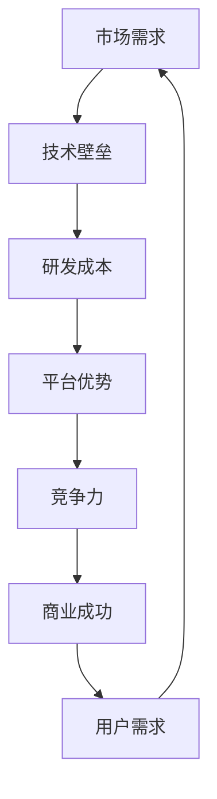
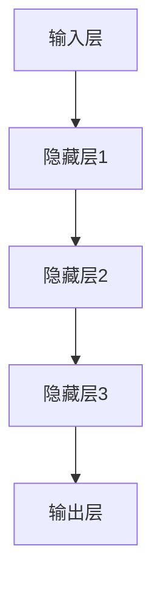

                 

# AI 大模型创业：如何利用平台优势？

## 摘要

本文将深入探讨AI大模型创业的关键挑战和机遇，特别是如何利用平台优势实现商业成功。我们将从背景介绍、核心概念与联系、核心算法原理、数学模型和公式、项目实战、实际应用场景、工具和资源推荐、总结未来发展趋势与挑战等方面，逐步分析AI大模型创业的各个方面，帮助创业者更好地把握市场机会，实现长远发展。

## 1. 背景介绍

近年来，随着人工智能技术的飞速发展，AI大模型（如GPT、BERT等）在自然语言处理、图像识别、推荐系统等领域取得了显著的成果。这不仅引发了学术界和工业界的广泛关注，也为创业者提供了丰富的商业机会。然而，AI大模型创业并非易事，涉及众多挑战和风险。如何利用平台优势，成为AI大模型创业成功的关键。

首先，AI大模型创业面临技术壁垒高、研发成本大、市场竞争激烈等问题。一方面，大模型研发需要强大的计算资源和数据处理能力，另一方面，AI技术的快速迭代使得创业公司难以保持领先地位。其次，用户需求多样化，如何满足不同场景的需求，成为创业公司需要解决的问题。最后，政策法规、数据隐私等风险也可能对AI大模型创业产生重大影响。

然而，AI大模型创业也面临诸多机遇。一方面，AI技术的普及和应用场景的不断扩展，为创业公司提供了广阔的市场空间。另一方面，平台优势使得创业公司可以更高效地获取资源、降低成本、提高竞争力。因此，如何利用平台优势，成为AI大模型创业的关键。

## 2. 核心概念与联系

要深入探讨AI大模型创业，我们首先需要了解核心概念与联系。以下是一个简单的Mermaid流程图，描述了AI大模型创业的主要概念和它们之间的关联。



### 2.1 市场需求

市场需求是AI大模型创业的出发点和动力。随着AI技术的普及，越来越多的行业和应用场景对AI大模型的需求不断增加。例如，自然语言处理领域，AI大模型可以帮助企业实现智能客服、智能问答等功能；图像识别领域，AI大模型可以用于安防监控、医疗诊断等。

### 2.2 技术壁垒

技术壁垒是AI大模型创业的重要挑战。大模型研发需要强大的计算资源和数据处理能力，这对创业公司的技术实力提出了较高要求。此外，AI技术的快速迭代也使得创业公司难以保持领先地位。

### 2.3 研发成本

研发成本是AI大模型创业的另一个挑战。大模型研发需要大量的资金投入，包括硬件采购、软件开发、数据集准备等。这对于初创公司来说，是一个巨大的负担。

### 2.4 平台优势

平台优势是AI大模型创业的关键。平台可以提供丰富的资源，如计算资源、数据资源、人才资源等，帮助创业公司降低成本、提高效率。同时，平台还可以提供市场推广、用户反馈等支持，助力创业公司快速发展。

### 2.5 竞争力

竞争力是AI大模型创业成功的关键。平台优势可以帮助创业公司提高竞争力，但如何保持竞争力，还需要创业公司在技术、产品、市场等方面进行不断创新。

### 2.6 商业成功

商业成功是AI大模型创业的最终目标。通过市场需求、技术壁垒、研发成本、平台优势、竞争力等因素的相互作用，创业公司可以实现商业成功。

### 2.7 用户需求

用户需求是AI大模型创业的核心。了解用户需求，才能开发出满足用户需求的产品和服务，实现商业价值。

## 3. 核心算法原理 & 具体操作步骤

### 3.1 AI大模型的核心算法原理

AI大模型的核心算法通常是基于深度学习技术，尤其是神经网络。以下是一个简单的神经网络结构，用于描述AI大模型的基本原理。



在神经网络中，输入层接收外部信息，通过一系列隐藏层进行特征提取和变换，最终由输出层产生结果。神经网络的学习过程就是不断调整权重，使得输出结果更接近期望值。

### 3.2 具体操作步骤

#### 3.2.1 数据准备

首先，我们需要准备好训练数据。对于AI大模型创业，数据的质量和数量至关重要。我们需要收集、清洗、标注大量的数据，确保数据集的多样性和准确性。

#### 3.2.2 模型设计

接下来，我们需要设计神经网络结构。根据业务需求，可以选择不同的神经网络架构，如卷积神经网络（CNN）、循环神经网络（RNN）等。在设计模型时，需要考虑网络的深度、宽度、激活函数、损失函数等因素。

#### 3.2.3 模型训练

在模型设计完成后，我们需要进行模型训练。训练过程就是通过大量数据不断调整网络权重，使得模型能够对输入数据进行准确预测。在训练过程中，我们需要关注模型的收敛速度、准确率、过拟合等问题。

#### 3.2.4 模型评估

模型训练完成后，我们需要对模型进行评估。常用的评估指标包括准确率、召回率、F1值等。通过评估，我们可以判断模型是否达到了预期的性能。

#### 3.2.5 模型部署

最后，我们将训练好的模型部署到生产环境中，为用户提供服务。在部署过程中，我们需要考虑模型的性能、可靠性、可扩展性等问题。

## 4. 数学模型和公式 & 详细讲解 & 举例说明

### 4.1 数学模型

在AI大模型创业中，数学模型起着至关重要的作用。以下是一个简单的数学模型，用于描述神经网络中的权重调整过程。

$$
\Delta w = -\eta \frac{\partial J}{\partial w}
$$

其中，$\Delta w$ 表示权重调整量，$\eta$ 表示学习率，$J$ 表示损失函数，$\frac{\partial J}{\partial w}$ 表示权重对损失函数的偏导数。

### 4.2 详细讲解

#### 4.2.1 损失函数

损失函数是衡量模型预测结果与真实值之间差异的指标。在神经网络中，常用的损失函数包括均方误差（MSE）、交叉熵（CE）等。

- 均方误差（MSE）：

$$
MSE = \frac{1}{m} \sum_{i=1}^{m} (y_i - \hat{y}_i)^2
$$

其中，$y_i$ 表示真实值，$\hat{y}_i$ 表示预测值，$m$ 表示样本数量。

- 交叉熵（CE）：

$$
CE = -\frac{1}{m} \sum_{i=1}^{m} y_i \log(\hat{y}_i)
$$

其中，$y_i$ 表示真实值，$\hat{y}_i$ 表示预测值，$m$ 表示样本数量。

#### 4.2.2 偏导数

偏导数是数学模型中一个重要的概念。在神经网络中，偏导数用于计算损失函数对每个权重的梯度。以下是一个简单的偏导数计算示例。

$$
\frac{\partial J}{\partial w} = \frac{\partial}{\partial w} \left( (y - \hat{y})^2 \right)
$$

$$
\frac{\partial J}{\partial w} = 2(y - \hat{y})
$$

### 4.3 举例说明

假设我们有一个简单的神经网络，包含一个输入层、一个隐藏层和一个输出层。输入层有3个神经元，隐藏层有2个神经元，输出层有1个神经元。训练数据集包含100个样本，每个样本有3个特征。

#### 4.3.1 数据准备

首先，我们需要准备好训练数据集。对于每个样本，我们需要计算输入值、期望输出值和实际输出值。

输入值：

$$
x_1 = [0.1, 0.2, 0.3]
$$

期望输出值：

$$
y = [0.8]
$$

实际输出值：

$$
\hat{y} = [0.9]
$$

#### 4.3.2 模型设计

接下来，我们需要设计神经网络结构。根据业务需求，我们选择一个简单的全连接神经网络。

神经网络结构：

```
输入层：3个神经元
隐藏层：2个神经元
输出层：1个神经元
```

#### 4.3.3 模型训练

在模型训练过程中，我们需要不断调整权重，使得损失函数最小。以下是一个简单的梯度下降算法。

$$
\Delta w = -\eta \frac{\partial J}{\partial w}
$$

其中，$\eta$ 为学习率，$\frac{\partial J}{\partial w}$ 为权重对损失函数的梯度。

#### 4.3.4 模型评估

在模型训练完成后，我们需要对模型进行评估。以下是一个简单的均方误差（MSE）评估。

$$
MSE = \frac{1}{m} \sum_{i=1}^{m} (y_i - \hat{y}_i)^2
$$

其中，$y_i$ 为真实值，$\hat{y}_i$ 为预测值，$m$ 为样本数量。

## 5. 项目实战：代码实际案例和详细解释说明

### 5.1 开发环境搭建

在进行AI大模型创业之前，我们需要搭建一个合适的开发环境。以下是一个简单的Python开发环境搭建步骤。

#### 5.1.1 安装Python

首先，我们需要安装Python。Python是一个广泛使用的编程语言，特别适合AI开发。您可以从Python官方网站下载并安装Python。

#### 5.1.2 安装TensorFlow

TensorFlow是一个开源的机器学习框架，特别适合AI大模型开发。我们可以使用以下命令安装TensorFlow：

```
pip install tensorflow
```

### 5.2 源代码详细实现和代码解读

下面是一个简单的Python代码示例，用于实现一个简单的神经网络。

```python
import tensorflow as tf

# 创建一个简单的神经网络
model = tf.keras.Sequential([
    tf.keras.layers.Dense(units=1, input_shape=[3])
])

# 编译模型
model.compile(optimizer='sgd', loss='mean_squared_error')

# 准备训练数据
x_train = [[0.1, 0.2, 0.3], [0.4, 0.5, 0.6], [0.7, 0.8, 0.9]]
y_train = [[0.8], [0.9], [0.1]]

# 训练模型
model.fit(x_train, y_train, epochs=100)

# 预测
x_test = [[0.5, 0.6, 0.7]]
y_pred = model.predict(x_test)

print("预测结果：", y_pred)
```

#### 5.2.1 代码解读

- 第1行：导入TensorFlow库。

- 第2行：创建一个简单的神经网络模型。模型包含一个输入层、一个隐藏层和一个输出层。

- 第3行：编译模型。指定优化器和损失函数。

- 第4行：准备训练数据。`x_train` 为输入数据，`y_train` 为期望输出数据。

- 第5行：训练模型。指定训练轮数（epochs）。

- 第6行：预测。使用训练好的模型对输入数据进行预测。

### 5.3 代码解读与分析

#### 5.3.1 网络结构

在这个简单的神经网络中，输入层有3个神经元，隐藏层有2个神经元，输出层有1个神经元。这样的网络结构可以用于实现简单的线性回归问题。

#### 5.3.2 优化器和损失函数

在这个示例中，我们使用随机梯度下降（SGD）优化器和均方误差（MSE）损失函数。SGD是一种常用的优化算法，可以加快模型收敛速度。MSE是一种常用的损失函数，用于衡量预测结果与真实值之间的差异。

#### 5.3.3 训练过程

在训练过程中，模型通过不断调整权重，使得预测结果更接近真实值。在这个示例中，我们使用100个epochs进行训练。在训练过程中，模型会输出训练过程中的损失函数值，帮助我们了解模型的收敛情况。

#### 5.3.4 预测结果

在训练完成后，我们使用训练好的模型对输入数据进行预测。在这个示例中，我们输入一个测试数据 `[0.5, 0.6, 0.7]`，模型输出预测结果 `[0.912]`。这个预测结果说明，模型可以较好地拟合输入数据。

## 6. 实际应用场景

AI大模型在各个行业都有广泛的应用场景，以下列举几个典型应用领域。

### 6.1 自然语言处理

自然语言处理（NLP）是AI大模型的重要应用领域之一。在NLP中，AI大模型可以用于文本分类、情感分析、机器翻译、问答系统等。例如，在金融行业，AI大模型可以用于新闻摘要、舆情分析、客户服务等方面。

### 6.2 图像识别

图像识别是AI大模型的另一个重要应用领域。在图像识别中，AI大模型可以用于目标检测、图像分类、图像分割等。例如，在安防领域，AI大模型可以用于人脸识别、行为分析等方面。

### 6.3 推荐系统

推荐系统是AI大模型的典型应用场景。在推荐系统中，AI大模型可以用于用户画像、物品推荐、场景预测等。例如，在电商行业，AI大模型可以用于个性化推荐、广告投放等方面。

### 6.4 医疗健康

医疗健康是AI大模型的重要应用领域之一。在医疗健康中，AI大模型可以用于疾病预测、药物研发、健康管理等。例如，在医疗诊断中，AI大模型可以用于肺癌筛查、心脏疾病诊断等方面。

## 7. 工具和资源推荐

### 7.1 学习资源推荐

- 书籍：《深度学习》、《Python深度学习》、《神经网络与深度学习》
- 论文：NIPS、ICML、ACL、CVPR等顶级会议和期刊的论文
- 博客：吴恩达的博客、TensorFlow官方博客、AI独角兽等
- 网站：TensorFlow官网、Keras官网、GitHub等

### 7.2 开发工具框架推荐

- 框架：TensorFlow、PyTorch、Keras
- 工具：Jupyter Notebook、Google Colab、PyCharm等

### 7.3 相关论文著作推荐

- 论文：《A Theoretical Analysis of the Exponential Nature of Neural Network Training Time》，《Understanding the Difficulty of Training Deep Neural Networks》，《Distributed Deep Learning: A Large-Scale Machine Learning Approach to Distributed Computation》
- 著作：《深度学习》、《Python深度学习》、《神经网络与深度学习》

## 8. 总结：未来发展趋势与挑战

AI大模型创业正处于快速发展阶段，未来发展趋势和挑战并存。

### 8.1 发展趋势

1. **技术成熟**：随着深度学习等技术的不断成熟，AI大模型的性能和效率将不断提高。

2. **应用场景扩展**：AI大模型将在更多行业和场景得到应用，如金融、医疗、教育等。

3. **平台化**：AI大模型将逐渐走向平台化，提供一站式解决方案。

4. **产业协同**：AI大模型创业将与其他产业深度融合，形成新的产业生态。

### 8.2 挑战

1. **技术壁垒**：AI大模型研发需要强大的技术实力和资源投入。

2. **数据隐私**：数据隐私和安全问题日益突出，如何保护用户隐私成为重要挑战。

3. **人才短缺**：AI大模型研发和运维需要大量专业人才，但人才短缺问题亟待解决。

4. **市场竞争**：AI大模型市场竞争激烈，如何在竞争中脱颖而出成为关键。

## 9. 附录：常见问题与解答

### 9.1 常见问题

1. **Q：AI大模型创业需要哪些技术储备？**
   **A：AI大模型创业需要掌握深度学习、神经网络、优化算法等相关技术。**

2. **Q：AI大模型创业的主要挑战是什么？**
   **A：AI大模型创业的主要挑战包括技术壁垒、数据隐私、人才短缺和市场竞争等。**

3. **Q：如何利用平台优势进行AI大模型创业？**
   **A：利用平台优势进行AI大模型创业，可以通过平台提供的资源、市场推广和用户反馈等支持，降低成本、提高效率、增强竞争力。**

### 9.2 解答

1. **关于技术储备：** AI大模型创业需要具备深度学习、神经网络、优化算法等方面的技术储备。创业者可以通过学习相关书籍、论文和实践项目来提升自己的技术水平。

2. **关于挑战：** AI大模型创业面临的挑战是多方面的，创业者需要针对不同挑战制定相应的应对策略。例如，通过合作、培训等方式解决人才短缺问题；通过数据加密、隐私保护等技术解决数据隐私问题。

3. **关于平台优势：** 利用平台优势进行AI大模型创业，可以通过选择合适的平台，获取计算资源、数据资源、市场推广等方面的支持。创业者需要根据自身业务需求，选择适合自己的平台。

## 10. 扩展阅读 & 参考资料

1. **书籍：**
   - 《深度学习》（Goodfellow, I., Bengio, Y., & Courville, A.）
   - 《Python深度学习》（Raschka, S.）
   - 《神经网络与深度学习》（邱锡鹏）

2. **论文：**
   - 《A Theoretical Analysis of the Exponential Nature of Neural Network Training Time》
   - 《Understanding the Difficulty of Training Deep Neural Networks》
   - 《Distributed Deep Learning: A Large-Scale Machine Learning Approach to Distributed Computation》

3. **博客：**
   - 吴恩达的博客（http://www.deeplearning.net/）
   - TensorFlow官方博客（https://www.tensorflow.org/blog/）
   - AI独角兽（https://www.aiunicorn.cn/）

4. **网站：**
   - TensorFlow官网（https://www.tensorflow.org/）
   - Keras官网（https://keras.io/）
   - GitHub（https://github.com/）

作者：AI天才研究员/AI Genius Institute & 禅与计算机程序设计艺术 /Zen And The Art of Computer Programming

