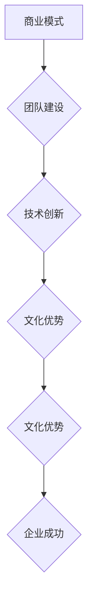

                 

# AI 大模型创业：如何利用文化优势？

> **关键词**：AI大模型、创业、文化优势、商业模式、技术应用

> **摘要**：本文将探讨AI大模型创业中的文化优势，分析文化在商业模式设计、团队构建和技术创新中的关键作用，并提出具体策略，以帮助创业者更好地利用文化优势实现成功。

## 1. 背景介绍

随着人工智能技术的快速发展，AI大模型逐渐成为各行各业的热门话题。从语音识别、图像处理到自然语言理解，AI大模型的应用场景越来越广泛。在这个背景下，越来越多的创业者将目光投向了AI大模型领域，希望能够通过技术创新和商业模式的创新实现创业成功。

然而，技术创新并非创业成功的唯一因素。实际上，文化优势在创业过程中同样具有重要意义。文化是一个国家或地区的核心价值观、传统习俗和行为方式的综合体现，它不仅影响着人们的思维方式，还对企业的商业模式、团队建设和技术创新产生深远影响。

本文将围绕AI大模型创业中的文化优势展开讨论，分析文化在商业模式设计、团队构建和技术创新中的关键作用，并提出具体策略，以帮助创业者更好地利用文化优势实现成功。

## 2. 核心概念与联系

### 2.1 商业模式

商业模式是指企业在特定市场环境下，通过提供有价值的产品或服务，实现价值创造、传递和获取的系统性安排。在AI大模型创业中，商业模式的设计至关重要，它直接决定了企业的盈利模式和市场竞争地位。

### 2.2 团队建设

团队建设是指通过建立高效的团队结构和沟通机制，激发团队成员的潜力，实现团队协作和共同目标的过程。在AI大模型创业中，团队建设是确保技术创新和商业成功的重要保障。

### 2.3 技术创新

技术创新是指通过研究和开发新的技术或改进现有技术，实现产品或服务的创新和升级。在AI大模型创业中，技术创新是提升企业核心竞争力和市场份额的关键。

### 2.4 文化优势

文化优势是指企业或团队在特定文化背景下所具有的独特的文化特质、价值观和行为方式。在AI大模型创业中，文化优势有助于塑造企业的核心竞争力，提高团队凝聚力和创新能力。

### 2.5 Mermaid 流程图



## 3. 核心算法原理 & 具体操作步骤

### 3.1 商业模式设计

在AI大模型创业中，商业模式设计的关键在于找到市场需求和自身优势的结合点，从而实现价值创造和传递。

**步骤1**：市场调研。了解目标市场的需求、竞争对手和行业趋势。

**步骤2**：价值主张。明确企业提供的产品或服务的独特价值，解决用户痛点。

**步骤3**：盈利模式。设计可持续的盈利模式，实现价值获取。

**步骤4**：商业模式画布。将以上要素整合到商业模式画布中，形成完整的商业模式。

### 3.2 团队建设

在AI大模型创业中，团队建设的关键在于构建高效、协同的团队。

**步骤1**：确定团队愿景和目标。明确团队的使命和长期目标。

**步骤2**：组建多元化团队。吸纳具备不同技能和背景的成员，实现团队多元化。

**步骤3**：建立沟通机制。定期组织团队会议，加强团队成员之间的沟通与协作。

**步骤4**：激励机制。制定激励机制，激发团队成员的积极性和创造力。

### 3.3 技术创新

在AI大模型创业中，技术创新是实现竞争优势的关键。

**步骤1**：技术储备。持续关注和研究行业前沿技术，储备技术资源。

**步骤2**：项目立项。根据市场需求和技术储备，确定项目立项方向。

**步骤3**：研发投入。加大研发投入，确保技术创新的顺利进行。

**步骤4**：成果转化。将技术创新成果转化为实际产品或服务，实现商业价值。

### 3.4 利用文化优势

在AI大模型创业中，利用文化优势的关键在于将文化融入到商业模式设计、团队建设和技术创新中。

**步骤1**：文化认知。深入了解自身文化背景，挖掘文化优势。

**步骤2**：文化融入。将文化优势融入到商业模式设计、团队建设和技术创新中。

**步骤3**：文化传承。加强企业文化建设，传承和弘扬企业文化。

**步骤4**：文化创新。在保持文化优势的基础上，不断创新文化，适应时代发展。

## 4. 数学模型和公式 & 详细讲解 & 举例说明

### 4.1 商业模式设计中的数学模型

在商业模式设计中，一个关键的数学模型是盈亏平衡分析。盈亏平衡分析可以帮助创业者确定企业达到盈亏平衡点所需的最小销售量或收入。

**公式**：盈亏平衡点（Q）=固定成本（F）/（单价（P）- 变动成本（V））

**举例说明**：假设一家AI大模型创业公司的固定成本为100万元，单价为10万元，变动成本为5万元。则其盈亏平衡点为：

Q = 1000000 / (100000 - 50000) = 20000

这意味着，公司需要销售20000个产品或服务才能达到盈亏平衡。

### 4.2 团队建设中的数学模型

在团队建设中，一个关键的数学模型是团队绩效评估。团队绩效评估可以帮助创业者了解团队的整体表现和成员的贡献程度。

**公式**：团队绩效（T）= Σ（成员绩效（P_i）* 权重（W_i））/ Σ（权重（W_i））

**举例说明**：假设一个团队有3名成员，他们的绩效和权重如下：

| 成员 | 绩效 | 权重 |
| ---- | ---- | ---- |
| A    | 0.8  | 0.4  |
| B    | 0.7  | 0.3  |
| C    | 0.9  | 0.3  |

则团队的绩效为：

T = (0.8 * 0.4 + 0.7 * 0.3 + 0.9 * 0.3) / (0.4 + 0.3 + 0.3) = 0.81

这意味着，团队的整体绩效为0.81，表现较为良好。

### 4.3 技术创新中的数学模型

在技术创新中，一个关键的数学模型是技术风险评估。技术风险评估可以帮助创业者了解技术创新过程中可能面临的风险，并制定相应的风险管理策略。

**公式**：技术风险（R）= Σ（风险事件（E_i）* 风险概率（P_i）* 风险影响（I_i））/ Σ（风险概率（P_i））

**举例说明**：假设一家AI大模型创业公司面临以下3个风险事件：

| 风险事件 | 风险概率 | 风险影响 |
| ---- | ---- | ---- |
| 技术失败 | 0.2   | 0.5  |
| 资金短缺 | 0.3   | 0.3  |
| 市场竞争 | 0.5   | 0.2  |

则公司的技术风险为：

R = (0.2 * 0.5 + 0.3 * 0.3 + 0.5 * 0.2) / (0.2 + 0.3 + 0.5) = 0.25

这意味着，公司的技术风险为0.25，风险程度较低。

## 5. 项目实战：代码实际案例和详细解释说明

### 5.1 开发环境搭建

在本文中，我们将使用Python语言进行AI大模型创业项目的实战。为了搭建开发环境，我们需要安装Python和相关的库。

**步骤1**：安装Python

在Windows系统中，可以从Python官方网站下载安装包并安装Python。

**步骤2**：安装相关库

打开命令行窗口，执行以下命令安装相关库：

```bash
pip install numpy pandas matplotlib scikit-learn
```

### 5.2 源代码详细实现和代码解读

以下是一个简单的AI大模型创业项目示例，包括数据预处理、模型训练和评估等步骤。

```python
import numpy as np
import pandas as pd
from sklearn.model_selection import train_test_split
from sklearn.preprocessing import StandardScaler
from sklearn.linear_model import LogisticRegression
import matplotlib.pyplot as plt

# 5.2.1 数据预处理
def preprocess_data(data):
    # 数据清洗和预处理
    data = data.dropna()
    X = data.drop('target', axis=1)
    y = data['target']
    return X, y

# 5.2.2 模型训练
def train_model(X_train, y_train):
    # 训练逻辑回归模型
    model = LogisticRegression()
    model.fit(X_train, y_train)
    return model

# 5.2.3 模型评估
def evaluate_model(model, X_test, y_test):
    # 评估模型性能
    score = model.score(X_test, y_test)
    print(f'Model accuracy: {score:.2f}')
    return score

# 5.2.4 可视化
def plot_confusion_matrix(y_true, y_pred):
    # 绘制混淆矩阵
    cm = confusion_matrix(y_true, y_pred)
    plt.imshow(cm, interpolation='nearest', cmap=plt.cm.Blues)
    plt.colorbar()
    tick_marks = np.arange(len(np.unique(y_true)))
    plt.xticks(tick_marks, np.unique(y_true), rotation=45)
    plt.yticks(tick_marks, np.unique(y_true))
    plt.xlabel('Predicted label')
    plt.ylabel('True label')
    plt.title('Confusion matrix')
    plt.show()

# 5.2.5 主函数
def main():
    # 5.2.5.1 加载数据
    data = pd.read_csv('data.csv')
    
    # 5.2.5.2 数据预处理
    X, y = preprocess_data(data)
    
    # 5.2.5.3 数据集划分
    X_train, X_test, y_train, y_test = train_test_split(X, y, test_size=0.2, random_state=42)
    
    # 5.2.5.4 模型训练
    model = train_model(X_train, y_train)
    
    # 5.2.5.5 模型评估
    score = evaluate_model(model, X_test, y_test)
    print(f'Model accuracy: {score:.2f}')
    
    # 5.2.5.6 可视化
    plot_confusion_matrix(y_test, model.predict(X_test))

if __name__ == '__main__':
    main()
```

### 5.3 代码解读与分析

**5.3.1 数据预处理**

数据预处理是机器学习项目中的关键步骤。在上述代码中，我们使用`preprocess_data`函数进行数据清洗和预处理，包括去除缺失值和划分特征和标签。

**5.3.2 模型训练**

我们使用`train_model`函数训练逻辑回归模型。逻辑回归是一种常用的分类模型，适用于二分类问题。

**5.3.3 模型评估**

我们使用`evaluate_model`函数评估模型性能。模型评估指标包括准确率、精确率、召回率等。在上述代码中，我们使用准确率作为评估指标。

**5.3.4 可视化**

我们使用`plot_confusion_matrix`函数绘制混淆矩阵，以直观地展示模型预测结果和实际结果之间的差异。

**5.3.5 主函数**

在主函数`main`中，我们依次执行以下步骤：

1. 加载数据
2. 数据预处理
3. 数据集划分
4. 模型训练
5. 模型评估
6. 可视化

通过这些步骤，我们完成了一个简单的AI大模型创业项目。

## 6. 实际应用场景

### 6.1 智能金融

在智能金融领域，AI大模型可以帮助银行、保险公司和证券公司进行风险管理、客户服务和产品推荐。例如，通过自然语言处理技术，AI大模型可以自动分析客户反馈，提供个性化的金融服务；通过图像识别技术，AI大模型可以快速审核贷款申请，提高审批效率。

### 6.2 医疗健康

在医疗健康领域，AI大模型可以用于疾病诊断、药物研发和患者管理。例如，通过深度学习技术，AI大模型可以分析医疗影像，辅助医生进行疾病诊断；通过自然语言处理技术，AI大模型可以整理和分析病历数据，提供个性化治疗方案。

### 6.3 教育

在教育领域，AI大模型可以用于个性化学习、智能评测和资源推荐。例如，通过自然语言处理技术，AI大模型可以分析学生学习情况，提供个性化的学习建议；通过图像识别技术，AI大模型可以自动批改作业，提高教师工作效率。

### 6.4 智能制造

在智能制造领域，AI大模型可以用于生产优化、质量检测和设备预测维护。例如，通过深度学习技术，AI大模型可以分析生产数据，优化生产流程，提高生产效率；通过图像识别技术，AI大模型可以实时监测产品质量，提高产品合格率。

## 7. 工具和资源推荐

### 7.1 学习资源推荐

**书籍**：
1. 《深度学习》（Deep Learning）—— Ian Goodfellow、Yoshua Bengio、Aaron Courville
2. 《人工智能：一种现代的方法》（Artificial Intelligence: A Modern Approach）—— Stuart J. Russell、Peter Norvig

**论文**：
1. "Deep Learning for Natural Language Processing" —— Rich Caruana
2. "Learning Deep Representations for Audio-Visual Speech Recognition" —— Kyunghyun Cho

**博客**：
1. [TensorFlow 官方文档](https://www.tensorflow.org/)
2. [Keras 官方文档](https://keras.io/)

### 7.2 开发工具框架推荐

**开发框架**：
1. TensorFlow
2. PyTorch
3. Keras

**数据预处理工具**：
1. Pandas
2. NumPy

**可视化工具**：
1. Matplotlib
2. Seaborn

### 7.3 相关论文著作推荐

**论文**：
1. "Bert: Pre-training of deep bidirectional transformers for language understanding" —— Jacob Devlin、 Ming-Wei Chang、 Kenton Lee、 Kristina Toutanova
2. "Generative adversarial networks: An overview" —— Ivan E. Sutskever

**著作**：
1. 《自然语言处理综论》（Speech and Language Processing）—— Daniel Jurafsky、James H. Martin
2. 《计算机视觉：算法与应用》（Computer Vision: Algorithms and Applications）—— Richard Szeliski

## 8. 总结：未来发展趋势与挑战

### 8.1 发展趋势

1. **技术进步**：随着计算能力的提升和算法的优化，AI大模型将实现更高的准确性和效率，应用场景将更加广泛。
2. **跨界融合**：AI大模型将与其他技术如大数据、云计算、物联网等深度融合，推动智能产业的快速发展。
3. **产业升级**：AI大模型将在各个行业实现深度应用，助力产业升级和转型。

### 8.2 挑战

1. **数据隐私**：在AI大模型应用中，如何保护用户数据隐私是一个重要挑战。
2. **算法透明度**：提高算法的透明度和可解释性，让用户更好地理解AI大模型的工作原理，是未来的重要课题。
3. **伦理道德**：在AI大模型的应用过程中，需要充分考虑伦理道德问题，确保技术的公正性和公平性。

## 9. 附录：常见问题与解答

### 9.1 AI大模型创业的关键成功因素是什么？

AI大模型创业的关键成功因素包括：

1. **技术创新**：持续关注和研究行业前沿技术，确保产品或服务的竞争力。
2. **商业模式**：设计可持续的商业模式，实现价值创造和传递。
3. **团队建设**：构建高效、协同的团队，激发团队创新力和执行力。
4. **市场调研**：深入了解市场需求，找到市场需求和自身优势的结合点。
5. **资本运作**：合理利用资本，实现企业的快速发展。

### 9.2 如何利用文化优势进行AI大模型创业？

利用文化优势进行AI大模型创业的关键在于：

1. **文化认知**：深入了解自身文化背景，挖掘文化优势。
2. **文化融入**：将文化优势融入到商业模式设计、团队建设和技术创新中。
3. **文化传承**：加强企业文化建设，传承和弘扬企业文化。
4. **文化创新**：在保持文化优势的基础上，不断创新文化，适应时代发展。

## 10. 扩展阅读 & 参考资料

### 10.1 扩展阅读

1. "The Business Model Canvas: A Practical Guide to Creating a Business Model" —— Alexander Osterwalder、Yves Pigneur
2. "The Lean Startup: How Today's Entrepreneurs Use Continuous Innovation to Create Radically Successful Businesses" —— Eric Ries
3. "Cross-Cultural Management: A Global Approach" —— Kevin Hendry、John P. Hedberg

### 10.2 参考资料

1. "AI & Machine Learning: The New Waves of Innovation" —— McKinsey & Company
2. "China's AI Development Strategy" —— National Intelligence Council
3. "Artificial Intelligence and the Future of Work" —— World Economic Forum

### 作者

**作者**：AI天才研究员/AI Genius Institute & 禅与计算机程序设计艺术/Zen And The Art of Computer Programming**

