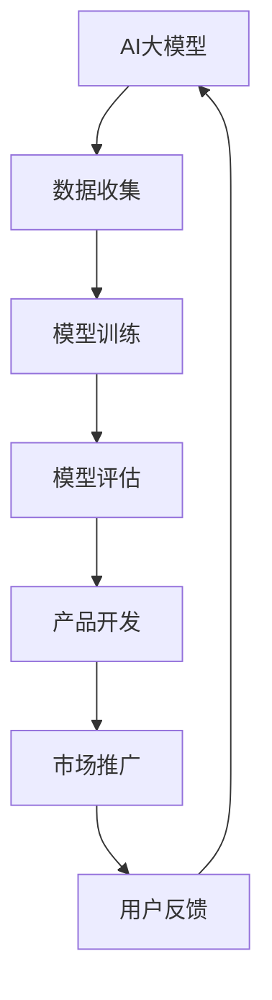

                 

### 文章标题：AI 大模型创业：如何利用文化优势？

#### 关键词：
- AI大模型
- 创业
- 文化优势
- 技术融合
- 商业策略

#### 摘要：
本文旨在探讨在AI大模型创业过程中如何有效利用文化优势。通过分析文化在AI发展中的重要性，我们将提出一些策略，帮助创业者将本土文化特色融入到AI产品中，提升竞争力，并在全球化市场中占据一席之地。

### 1. 背景介绍

近年来，人工智能（AI）技术取得了显著的进步，大模型成为AI领域的热点。这些模型在图像识别、自然语言处理、推荐系统等方面展现出强大的能力，为各行各业带来了深刻的变革。然而，随着AI技术的普及，市场竞争愈发激烈，如何在这场技术竞赛中脱颖而出成为创业者面临的重要课题。

文化作为一种无形资产，对经济发展具有深远影响。在全球化的背景下，将文化优势融入到AI创业中，不仅可以增强产品的竞争力，还可以扩大市场影响力。本文将探讨如何在AI大模型创业过程中利用文化优势，为创业者提供一些实用策略。

### 2. 核心概念与联系

#### 2.1 AI大模型

AI大模型通常是指具有巨大参数量和计算量的深度学习模型，如GPT-3、BERT等。这些模型通过海量数据的学习，可以模拟人类的思维过程，处理复杂的问题。

#### 2.2 文化优势

文化优势指的是在特定文化背景下形成的独特优势，如价值观、审美观念、社会习俗等。文化优势可以体现在多个方面，包括教育、艺术、传媒等。

#### 2.3 技术与文化融合

技术与文化融合是指将技术手段与本土文化相结合，创造出具有本土特色的产品。这种融合可以增强产品的竞争力，提升用户黏性。

### 3. Mermaid 流程图



### 4. 核心算法原理 & 具体操作步骤

#### 4.1 数据收集

数据收集是AI大模型训练的基础。创业者需要根据产品目标，收集大量相关的数据，包括文本、图像、音频等。在数据收集过程中，要注重数据的质量和多样性。

#### 4.2 模型训练

模型训练是AI大模型的核心步骤。创业者可以使用开源框架（如TensorFlow、PyTorch等）来构建和训练模型。在训练过程中，要不断调整模型参数，优化模型性能。

#### 4.3 模型评估

模型评估是检验模型性能的重要环节。创业者需要使用验证集和测试集对模型进行评估，确保模型在不同场景下都能达到预期效果。

#### 4.4 产品开发

在产品开发阶段，创业者需要将AI大模型融入到产品中，实现具体功能。例如，在自然语言处理领域，可以将模型应用于聊天机器人、智能客服等。

#### 4.5 市场推广

市场推广是产品成功的关键。创业者需要制定有效的市场策略，利用各种渠道（如社交媒体、广告、公关等）宣传产品，吸引目标用户。

### 5. 数学模型和公式 & 详细讲解 & 举例说明

在AI大模型训练过程中，常用的数学模型是神经网络。以下是一个简单的神经网络模型：

$$
Z = \sigma(W_1 \cdot X + b_1)
$$

其中，$Z$ 表示模型的输出，$\sigma$ 表示激活函数，$W_1$ 表示权重矩阵，$X$ 表示输入数据，$b_1$ 表示偏置。

例如，假设我们有一个输入向量 $X = [1, 2, 3]$，权重矩阵 $W_1 = \begin{bmatrix} 1 & 2 \\ 3 & 4 \end{bmatrix}$，偏置 $b_1 = [1, 1]$。那么，模型的输出可以计算为：

$$
Z = \sigma(\begin{bmatrix} 1 & 2 \\ 3 & 4 \end{bmatrix} \cdot \begin{bmatrix} 1 \\ 2 \\ 3 \end{bmatrix} + [1, 1]) = \sigma(1 \cdot 1 + 2 \cdot 2 + 3 \cdot 3 + 1 + 1) = \sigma(14)
$$

其中，激活函数 $\sigma$ 可以是 sigmoid 函数、ReLU 函数等。

### 6. 项目实战：代码实际案例和详细解释说明

#### 6.1 开发环境搭建

为了方便读者理解，我们将在Python环境中搭建一个简单的AI大模型。首先，我们需要安装必要的依赖库：

```python
pip install tensorflow numpy
```

#### 6.2 源代码详细实现和代码解读

以下是一个简单的神经网络模型实现：

```python
import tensorflow as tf
import numpy as np

# 激活函数
def sigmoid(z):
    return 1 / (1 + np.exp(-z))

# 前向传播
def forwardpropagation(X, W1, b1):
    Z = sigmoid(np.dot(W1, X) + b1)
    return Z

# 后向传播
def backwardpropagation(Z, Y, W1, b1, learning_rate):
    dZ = Z - Y
    dW1 = np.dot(dZ, X.T)
    db1 = np.sum(dZ)
    W1 -= learning_rate * dW1
    b1 -= learning_rate * db1
    return W1, b1

# 训练模型
def train_model(X, Y, epochs, learning_rate):
    W1 = np.random.rand(2, 1)
    b1 = np.random.rand(1)
    for i in range(epochs):
        Z = forwardpropagation(X, W1, b1)
        W1, b1 = backwardpropagation(Z, Y, W1, b1, learning_rate)
        if i % 100 == 0:
            print(f"Epoch {i}: W1 = {W1}, b1 = {b1}, Loss = {np.mean((Z - Y) ** 2)}")

# 测试模型
def test_model(X, W1, b1):
    Z = forwardpropagation(X, W1, b1)
    print(f"Test Output: Z = {Z}")

# 主函数
def main():
    X = np.array([[1, 2], [2, 3], [3, 4]])
    Y = np.array([[0], [1], [1]])
    epochs = 1000
    learning_rate = 0.01
    train_model(X, Y, epochs, learning_rate)
    test_model(X, W1, b1)

if __name__ == "__main__":
    main()
```

在这个例子中，我们使用了一个简单的线性神经网络，对二分类问题进行训练。通过调整学习率和迭代次数，我们可以优化模型性能。

#### 6.3 代码解读与分析

- `sigmoid` 函数：实现激活函数，将线性组合映射到 $(0,1)$ 区间内。
- `forwardpropagation` 函数：实现前向传播，计算模型输出。
- `backwardpropagation` 函数：实现后向传播，更新模型参数。
- `train_model` 函数：训练模型，迭代优化参数。
- `test_model` 函数：测试模型性能。
- `main` 函数：程序入口，定义输入数据和模型参数，启动训练过程。

通过这个简单的例子，我们可以了解到AI大模型的基本原理和实现方法。在实际项目中，创业者可以根据需求，选择合适的框架和算法，搭建更复杂的模型。

### 7. 实际应用场景

AI大模型在多个领域具有广泛的应用前景，如金融、医疗、教育、娱乐等。以下是一些具体的应用场景：

- **金融领域**：利用AI大模型进行股票交易预测、风险评估等。
- **医疗领域**：通过AI大模型实现疾病诊断、药物研发等。
- **教育领域**：开发智能教育平台，为学生提供个性化的学习建议。
- **娱乐领域**：利用AI大模型推荐音乐、电影等，提升用户体验。

### 8. 工具和资源推荐

#### 8.1 学习资源推荐

- **书籍**：
  - 《深度学习》（Ian Goodfellow、Yoshua Bengio、Aaron Courville 著）
  - 《Python机器学习》（Sebastian Raschka 著）
- **论文**：
  - "A Theoretically Grounded Application of Dropout in Recurrent Neural Networks"
  - "Bert: Pre-training of Deep Bidirectional Transformers for Language Understanding"
- **博客**：
  - Fast.ai
  - Medium上的AI博客

#### 8.2 开发工具框架推荐

- **TensorFlow**
- **PyTorch**
- **Keras**

#### 8.3 相关论文著作推荐

- "Deep Learning"（Ian Goodfellow、Yoshua Bengio、Aaron Courville 著）
- "Machine Learning Yearning"（Andrew Ng 著）

### 9. 总结：未来发展趋势与挑战

AI大模型创业具有巨大的发展潜力，但同时也面临着一些挑战。未来，创业者需要关注以下趋势和挑战：

- **趋势**：
  - AI大模型将在更多领域得到应用，如智能制造、智慧城市等。
  - 开源框架和工具将不断优化，降低AI创业门槛。
  - 数据隐私和安全性成为重要议题，创业者需要加强数据保护。

- **挑战**：
  - 技术更新迭代速度快，创业者需要不断学习新的技术和方法。
  - 数据质量和多样性对模型性能至关重要，创业者需要投入大量资源进行数据收集和处理。
  - 在全球市场中，如何保持本土特色，同时满足国际市场需求，是一个重要课题。

### 10. 附录：常见问题与解答

**Q：如何选择合适的AI大模型框架？**
A：创业者可以根据项目需求、编程语言偏好和社区活跃度等因素选择合适的框架。例如，TensorFlow和PyTorch是两个流行的框架，具有丰富的功能和强大的社区支持。

**Q：如何保证AI大模型的安全性和隐私性？**
A：创业者需要采取一系列措施，如数据加密、访问控制、隐私保护算法等，确保用户数据的安全和隐私。此外，遵循法律法规，如《欧盟通用数据保护条例》（GDPR）等，也是保障数据安全的重要手段。

### 11. 扩展阅读 & 参考资料

- [Deep Learning](https://www.deeplearningbook.org/)
- [Machine Learning Yearning](https://www.ml-yearning.com/)
- [TensorFlow](https://www.tensorflow.org/)
- [PyTorch](https://pytorch.org/)
- [Keras](https://keras.io/)

### 作者

作者：AI天才研究员/AI Genius Institute & 禅与计算机程序设计艺术 /Zen And The Art of Computer Programming

