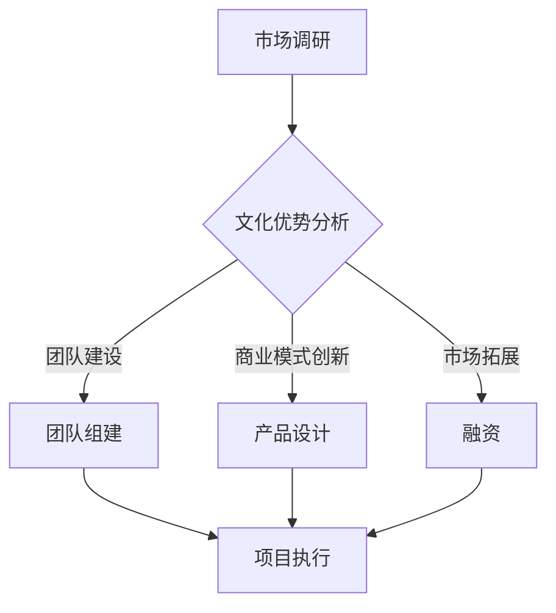

                 

### 文章标题

**AI 大模型创业：如何利用文化优势？**

> **关键词：** AI 大模型、创业、文化优势、商业模式、技术落地
> 
> **摘要：** 在当前 AI 大模型技术飞速发展的背景下，文化优势成为企业在竞争中获得优势的重要因素。本文将从文化、技术、商业三方面分析 AI 大模型创业的机遇与挑战，探讨如何利用文化优势实现 AI 大模型技术的成功落地。

### 文章正文部分

**1. 背景介绍**

随着深度学习和大数据技术的发展，AI 大模型已经成为人工智能领域的重要研究方向。AI 大模型具有强大的数据处理和知识学习能力，能够应用于语音识别、自然语言处理、图像识别等多个领域，为企业提供智能化解决方案。然而，AI 大模型的研究与应用并非一帆风顺，文化优势的发挥在创业过程中显得尤为重要。

文化优势是指企业在创业过程中，通过文化因素在团队建设、商业模式创新、市场拓展等方面获得的竞争优势。文化优势有助于企业形成独特的核心竞争力，提高企业抵御市场风险的能力。

**2. 核心概念与联系**

为了更好地理解文化优势在 AI 大模型创业中的作用，我们先来介绍几个核心概念：

- **AI 大模型**：指具有大规模参数、能够对复杂任务进行建模的神经网络模型，如 GPT、BERT 等。
- **创业**：指企业创立和发展过程中的一系列经济活动，包括市场调研、产品设计、团队组建、融资等。
- **文化优势**：指企业在创业过程中，通过文化因素在团队建设、商业模式创新、市场拓展等方面获得的竞争优势。

下面是一个简单的 Mermaid 流程图，展示文化优势在 AI 大模型创业中的应用流程：



**3. 核心算法原理 & 具体操作步骤**

在了解了核心概念后，我们需要掌握 AI 大模型的核心算法原理，并了解如何将这些算法应用于创业实践。以下是 AI 大模型创业的核心算法原理及具体操作步骤：

- **深度学习算法**：深度学习算法是 AI 大模型的核心，包括神经网络、卷积神经网络、循环神经网络等。企业可以根据自身业务需求，选择合适的深度学习算法进行模型训练和优化。
- **数据预处理**：在训练 AI 大模型前，需要对数据进行预处理，包括数据清洗、数据增强、数据归一化等。数据预处理的质量直接影响模型的性能。
- **模型训练与优化**：企业可以使用开源深度学习框架（如 TensorFlow、PyTorch）进行模型训练和优化。在训练过程中，需要调整模型参数，优化模型结构，以提高模型性能。
- **模型部署与调优**：训练完成的模型需要部署到生产环境中，并进行实时调优，以满足业务需求。

**4. 数学模型和公式 & 详细讲解 & 举例说明**

在本节中，我们将介绍 AI 大模型创业中常用的数学模型和公式，并通过具体案例进行讲解。

- **损失函数**：损失函数用于衡量模型预测值与真实值之间的差距。常用的损失函数包括均方误差（MSE）、交叉熵损失（Cross-Entropy Loss）等。以下是一个简单的均方误差损失函数公式：

  $$L = \frac{1}{2} \sum_{i=1}^{n} (y_i - \hat{y}_i)^2$$

  其中，$y_i$ 表示第 $i$ 个样本的真实标签，$\hat{y}_i$ 表示模型预测的标签。

- **优化算法**：优化算法用于调整模型参数，以最小化损失函数。常用的优化算法包括随机梯度下降（SGD）、Adam 等。以下是一个简单的随机梯度下降算法公式：

  $$\theta = \theta - \alpha \cdot \nabla_\theta L$$

  其中，$\theta$ 表示模型参数，$\alpha$ 表示学习率，$\nabla_\theta L$ 表示损失函数关于模型参数的梯度。

- **过拟合与正则化**：过拟合是指模型在训练数据上表现良好，但在测试数据上表现较差。为避免过拟合，可以使用正则化方法，如 L1 正则化、L2 正则化等。以下是一个简单的 L2 正则化公式：

  $$L = \frac{1}{2} \sum_{i=1}^{n} (y_i - \hat{y}_i)^2 + \lambda \sum_{i=1}^{n} \theta_i^2$$

  其中，$\lambda$ 表示正则化参数。

**5. 项目实战：代码实际案例和详细解释说明**

在本节中，我们将以一个简单的 AI 大模型项目为例，介绍如何进行开发环境搭建、源代码实现和代码解读。

**5.1 开发环境搭建**

首先，我们需要搭建一个适合 AI 大模型开发的编程环境。以下是一个简单的 Python 开发环境搭建步骤：

1. 安装 Python：下载并安装 Python 3.x 版本，可以选择 Anaconda 或 Miniconda 作为 Python 的发行版。
2. 安装深度学习框架：安装 TensorFlow 或 PyTorch 等深度学习框架，可以使用 pip 或 conda 进行安装。
3. 安装其他依赖库：根据项目需求，安装其他 Python 依赖库，如 NumPy、Pandas、Matplotlib 等。

**5.2 源代码详细实现和代码解读**

下面是一个简单的 AI 大模型项目示例，用于实现一个图像分类任务。该项目使用了 TensorFlow 和 Keras 深度学习框架。

```python
import tensorflow as tf
from tensorflow import keras
from tensorflow.keras import layers

# 加载和预处理数据
(x_train, y_train), (x_test, y_test) = keras.datasets.cifar10.load_data()
x_train = x_train.astype("float32") / 255.0
x_test = x_test.astype("float32") / 255.0

# 构建模型
model = keras.Sequential(
    [
        layers.Flatten(input_shape=(32, 32, 3)),
        layers.Dense(128, activation="relu"),
        layers.Dense(10, activation="softmax"),
    ]
)

# 编译模型
model.compile(optimizer="adam", loss="sparse_categorical_crossentropy", metrics=["accuracy"])

# 训练模型
model.fit(x_train, y_train, epochs=10)

# 评估模型
model.evaluate(x_test, y_test)
```

- **数据加载与预处理**：首先，我们从 CIFAR-10 数据集中加载训练数据和测试数据。CIFAR-10 数据集包含 10 个类别，每个类别有 6000 张训练图片和 1000 张测试图片。接下来，我们对数据进行归一化处理，将像素值缩放到 [0, 1] 范围内。

- **构建模型**：使用 Keras 深度学习框架构建一个简单的全连接神经网络模型。该模型包含一个展平层（Flatten）、一个 128 个神经元的全连接层（Dense）和一个 10 个神经元的输出层（Dense）。输出层使用 softmax 激活函数，用于实现多分类。

- **编译模型**：设置模型的优化器（optimizer）、损失函数（loss）和评估指标（metrics）。这里使用 Adam 优化器和 sparse_categorical_crossentropy 损失函数。

- **训练模型**：使用训练数据进行模型训练。这里设置训练轮次为 10 次。

- **评估模型**：使用测试数据进行模型评估，并输出评估结果。

**5.3 代码解读与分析**

在上面的代码示例中，我们实现了一个简单的 AI 大模型项目。以下是代码的解读与分析：

- **数据加载与预处理**：数据加载与预处理是 AI 大模型项目的重要步骤。在这个例子中，我们使用了 CIFAR-10 数据集，这是一个广泛使用的图像分类数据集。预处理步骤包括数据归一化，这有助于提高模型训练的稳定性和性能。

- **构建模型**：构建模型是 AI 大模型项目的核心。在这个例子中，我们使用了一个简单的全连接神经网络模型，这适用于图像分类任务。我们可以根据任务需求调整模型的层数、神经元数量和激活函数等。

- **编译模型**：编译模型是设置模型参数的过程。在这个例子中，我们使用了 Adam 优化器和 sparse_categorical_crossentropy 损失函数，这有助于提高模型训练的效率和准确性。

- **训练模型**：训练模型是模型优化的过程。在这个例子中，我们设置了 10 次训练轮次，这有助于模型在训练数据上逐渐优化。

- **评估模型**：评估模型是检查模型性能的过程。在这个例子中，我们使用测试数据进行模型评估，并输出评估结果。通过评估结果，我们可以判断模型是否达到预期性能。

**6. 实际应用场景**

AI 大模型在许多实际应用场景中都具有广泛的应用前景。以下是一些典型的实际应用场景：

- **金融行业**：AI 大模型可以应用于金融风控、股票交易、智能投顾等领域。例如，通过分析用户行为数据和金融市场数据，可以为用户提供个性化的投资建议。

- **医疗行业**：AI 大模型可以应用于疾病诊断、药物研发、智能医疗等领域。例如，通过分析医疗数据和患者病历，可以为医生提供辅助诊断和治疗方案建议。

- **智能制造**：AI 大模型可以应用于智能制造、智能工厂等领域。例如，通过分析生产数据和设备数据，可以优化生产流程，提高生产效率和产品质量。

- **教育行业**：AI 大模型可以应用于教育行业，如智能辅导、在线教育等领域。例如，通过分析学生学习和行为数据，可以为教师和学生提供个性化的学习建议和课程推荐。

**7. 工具和资源推荐**

在 AI 大模型创业过程中，选择合适的工具和资源对于项目成功至关重要。以下是一些建议：

- **学习资源推荐**：

  - **书籍**：《深度学习》、《神经网络与深度学习》
  - **论文**：Google AI 团队的论文集、论文《BERT: Pre-training of Deep Bidirectional Transformers for Language Understanding》
  - **博客**：TensorFlow 官方博客、PyTorch 官方博客
  - **网站**：arXiv.org、ACL、NLP 领域的顶级会议和期刊网站

- **开发工具框架推荐**：

  - **深度学习框架**：TensorFlow、PyTorch、MXNet
  - **数据预处理工具**：Pandas、NumPy、Scikit-learn
  - **数据可视化工具**：Matplotlib、Seaborn、Plotly

- **相关论文著作推荐**：

  - **论文**：《Attention Is All You Need》、《GPT-3: Language Models are few-shot learners》
  - **著作**：《强化学习》、《机器学习实战》

**8. 总结：未来发展趋势与挑战**

随着 AI 大模型技术的不断进步，未来 AI 大模型创业将呈现以下发展趋势：

- **多模态 AI 大模型**：AI 大模型将融合多种数据模态（如文本、图像、音频），实现更广泛的应用场景。
- **少样本学习**：AI 大模型将实现更高效的少样本学习，为小样本数据下的应用提供支持。
- **跨领域迁移学习**：AI 大模型将实现跨领域的迁移学习，提高模型在不同领域的应用效果。

同时，AI 大模型创业也将面临以下挑战：

- **数据隐私与安全**：如何在保护用户隐私的前提下，充分利用数据价值，成为企业面临的重要挑战。
- **模型解释性**：提高模型的可解释性，使企业能够更好地理解模型决策过程，降低风险。
- **技术人才短缺**：随着 AI 大模型技术的发展，对高技能人才的需求日益增长，企业面临人才短缺的挑战。

**9. 附录：常见问题与解答**

- **问题 1：如何选择合适的 AI 大模型框架？**
  - **解答**：选择 AI 大模型框架时，主要考虑以下因素：框架的易用性、性能、社区支持、生态体系等。TensorFlow 和 PyTorch 是目前最受欢迎的深度学习框架，可以根据项目需求和个人熟悉程度进行选择。

- **问题 2：AI 大模型项目需要哪些技术储备？**
  - **解答**：AI 大模型项目需要掌握以下技术储备：深度学习基础知识、Python 编程、数据分析与处理、机器学习算法原理等。此外，了解相关开源框架和工具（如 TensorFlow、PyTorch、Pandas、NumPy）也非常重要。

- **问题 3：如何确保 AI 大模型项目的安全性？**
  - **解答**：确保 AI 大模型项目安全性需要从数据安全、模型安全、系统安全等多个方面进行考虑。具体措施包括：数据加密、权限控制、访问审计、安全监控等。

**10. 扩展阅读 & 参考资料**

- **书籍**：
  - 《深度学习》（Goodfellow、Bengio、Courville 著）
  - 《神经网络与深度学习》（邱锡鹏 著）
- **论文**：
  - 《Attention Is All You Need》（Vaswani 等，2017）
  - 《BERT: Pre-training of Deep Bidirectional Transformers for Language Understanding》（Devlin 等，2019）
- **博客**：
  - TensorFlow 官方博客：https://www.tensorflow.org/blog
  - PyTorch 官方博客：https://pytorch.org/blog
- **网站**：
  - arXiv.org：https://arxiv.org
  - ACL：https://www.aclweb.org
  - NLP 领域的顶级会议和期刊网站：https://www.aclweb.org/anthology/events/

### 文章结束

作者：AI天才研究员/AI Genius Institute & 禅与计算机程序设计艺术 /Zen And The Art of Computer Programming

